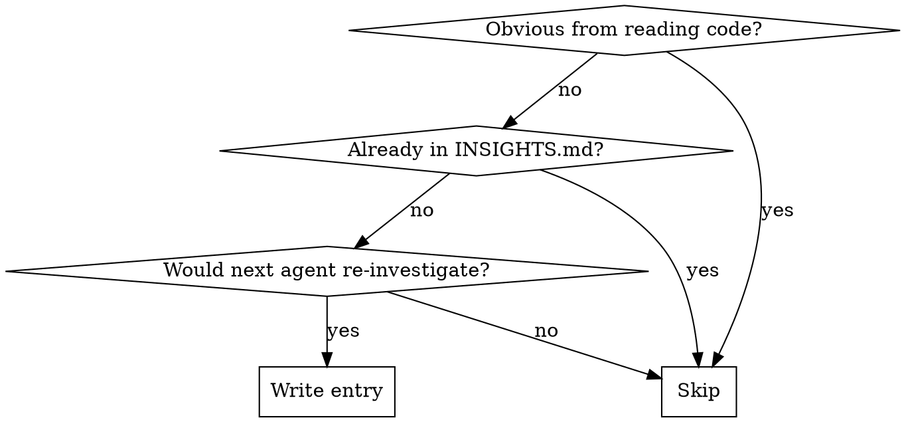

# Engineering Insights

Two mandatory checkpoints every session: **read first, write last.**

## Session Lifecycle

### Step 1 — READ (before any code or analysis)

Read the touched module's `INSIGHTS.md` immediately. Treat every entry as high-confidence guidance.

If multiple modules are involved, read all of them.

**Do not skip** — known gotchas live here, not in code.

### Step 2 — WORK (capture mid-session, don't defer)

Note things mid-session that took multiple attempts, surprised you, or would cost the next agent time. **Write immediately when a finding is clear** — don't rely on remembering it at session end.

### Step 3 — DEDUP CHECK (before writing anything)

Re-read `INSIGHTS.md`. If the insight is already present in any form, skip.

### Step 4 — WRITE (session end, conditional)

Should I write this entry?



Skip Step 4 entirely for purely mechanical sessions — trivial config edits, formatting, no surprises. Sessions under ~30 min with no surprises rarely warrant an entry.

---

## Which File

| Work happened in | File |
|---|---|
| `client/` | `client/INSIGHTS.md` |
| `server/` | `server/INSIGHTS.md` |
| `reviewer-core/` | `reviewer-core/INSIGHTS.md` |
| `e2e/` | `e2e/INSIGHTS.md` |
| `mcp-server/` | `mcp-server/INSIGHTS.md` |
| `evals/` | `evals/INSIGHTS.md` |
| `.claude/` — the harness itself: hooks, `settings.json`, skills, agents | `.claude/INSIGHTS.md` |

If work touches multiple modules, write to each relevant one.

`.claude/` is not a product module, but harness work produces exactly the kind of finding this skill exists for — hook semantics, permission-rule globs, shell quirks — and it used to have nowhere to go. Route it there rather than dropping it or forcing it into whichever product module the session happened to touch.

**Not write targets:** `INSIGHTS.md` copies under `.claude/worktrees/**` and `server/clones/**` are throwaway checkouts of this repo — a plain glob for `INSIGHTS.md` surfaces them. Always write to the path at the repo root.

---

## Sections

| Section | What goes here |
|---|---|
| **What Works** | Approaches and solutions that worked |
| **What Doesn't Work** | Dead ends, antipatterns — **highest-value section; most often skipped** |
| **Codebase Patterns** | Conventions, architectural decisions |
| **Tool & Library Notes** | Dependency quirks specific to this codebase |
| **Decisions** | Architectural or approach choices made, with the reason — so future agents don't re-open closed questions |
| **Recurring Errors & Fixes** | Common errors and their exact fixes |
| **Session Notes** | Dated summary of what was accomplished |
| **Open Questions** | Unresolved items needing investigation |

---

## Entry Format

```markdown
- YYYY-MM-DD: [Specific, actionable finding — the symptom, constraint, or fix in one sentence] (`path/to/file:line`)
```

Include `file:line` whenever the finding is anchored to specific code. Omit only for pure process/tool observations with no code anchor.

Add under the matching `## Section` header. If the section is missing, append it at the bottom.

---

## Quality Standard

Entries must be cold-readable — a future agent reads it and knows exactly what to do without re-investigating.

| ❌ Noise | ✅ Signal |
|---|---|
| "Promises can be tricky" | "`Promise.all()` times out after 30 items — use `Promise.allSettled()` with batches of 10" |
| "Be careful with async" | "`pnpm db:migrate` must run manually after every schema change — not auto on boot" |
| "Zod is complex" | "Fastify routes use `fastify-type-provider-zod` — never call `Schema.parse()` manually in handlers" |

**Test:** "Would this be obvious to anyone reading the code?" If yes, skip it.

> **INSIGHTS.md is a draft under review.** Entries are LLM-generated; a human spot-check after each wrap-up is expected.

---

## Non-Destructive Write Contract (hard rule)

**Never use the `Write` tool on an existing `INSIGHTS.md`** — `Write` replaces the whole file and destroys all prior content.

- **Re-read the target `INSIGHTS.md` immediately before writing** — its state may have changed during the session
- **Insert with an anchored `Edit`** that adds the new bullet under the correct `##` heading
- **Corrections are additive** — if reality contradicts an old entry, add a new dated note that supersedes it; never delete or edit the old one
- **Idempotent** — if an equivalent entry already exists, skip it entirely

---

## Rules

- **Append-only (agent sessions)** — only add entries; never edit or remove existing ones. Human maintenance (monthly) can delete stale or incorrect entries.
- **Module-specific** — always write to the module where the work happened
- **One entry per insight** — don't bundle unrelated discoveries
- **No forced entries** — an empty session is better than a noisy file
- **Flag conflicts** — if two existing entries contradict each other, add a note in **Open Questions** flagging the conflict for human resolution; don't silently proceed
- **Size limit** — if a file approaches ~200 entries, flag in **Open Questions** for a domain split (e.g., `INSIGHTS-Database.md`, `INSIGHTS-Auth.md`); signal-to-noise degrades past this point
