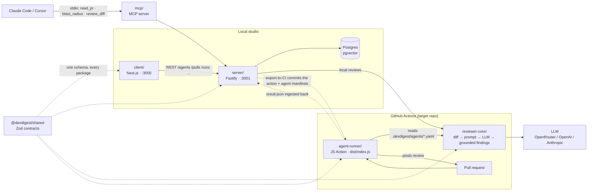

# DevDigest — apps

Local-first AI pull-request review. Several standalone packages (no monorepo
workspace — each has its own `package.json` and lockfile; cross-package code is
shared through tsconfig path aliases, not published modules):

| Folder           | Package                     | What it is                                            | Port |
|------------------|-----------------------------|-------------------------------------------------------|------|
| `server/`        | `@devdigest/api`            | Fastify API + Drizzle/Postgres (pgvector)             | 3001 |
| `client/`        | `@devdigest/web`            | Next.js 15 web app (the studio)                       | 3000 |
| `reviewer-core/` | `@devdigest/reviewer-core`  | Pure review engine: diff → prompt → LLM → findings    | —    |
| `agent-runner/`  | —                           | GitHub Action that runs the engine in CI              | —    |
| `mcp/`           | `@devdigest/mcp`            | MCP server (stdio) + pre-push review CLI              | —    |
| `e2e/`           | `@devdigest/e2e`            | Deterministic browser e2e (agent-browser)             | —    |
| `server/src/vendor/shared` | `@devdigest/shared` | Zod contracts shared across every package             | —    |

Only **Postgres** runs in Docker; the API and web app run on the host via `pnpm dev`.

## Architecture



Each package has its own README with deeper diagrams:
[`client`](client/README.md) (UI route map) ·
[`server`](server/README.md) (API map) ·
[`reviewer-core`](reviewer-core/README.md) (review pipeline) ·
[`agent-runner`](agent-runner/README.md) (CI flow) ·
[`mcp`](mcp/README.md) · [`e2e`](e2e/README.md).
The full agent lifecycle (studio → export → CI → ingest) is in
[`docs/github-actions-pipeline.md`](docs/github-actions-pipeline.md).

## Prerequisites

- **Node** ≥ 22 · **pnpm** ≥ 10 (`npm i -g pnpm`) · **Docker** (for Postgres)

## Quick start (from zero)

```sh
./scripts/dev.sh
```

This script:
1. starts Postgres (`docker compose up -d`) and waits until it's healthy,
2. creates `server/.env` and `client/.env` from `.env.example` if missing,
3. installs deps in `server/` and `client/` (only when `node_modules` is absent),
4. applies DB migrations and seeds demo data,
5. launches the API (`:3001`) and the web app (`:3000`).

Open **http://localhost:3000**. Press **Ctrl-C** to stop the dev servers —
Postgres keeps running (`docker compose down` to stop it).

Flags: `--no-seed` · `--no-client` · `--db-only` · `--help`.

> Add your keys in `server/.env` (`OPENAI_API_KEY`, `ANTHROPIC_API_KEY`,
> `GITHUB_PAT`). They can also be entered via the Settings UI at runtime.

## Manual steps (what the script does)

```sh
docker compose up -d                                   # Postgres + pgvector

cd server && pnpm install
pnpm db:migrate          # apply migrations (NOT run automatically on boot)
pnpm db:seed             # idempotent demo data (optional)
pnpm dev                 # API on :3001

cd ../client && pnpm install && pnpm dev               # web on :3000
```

MCP server / CLI (optional):

```sh
cd mcp && pnpm install
pnpm dev:server          # MCP server over stdio
pnpm dev:cli -- review --mode working   # pre-push review CLI
```

## Useful scripts

`server/`: `dev` · `build` · `db:migrate` · `db:seed` · `db:generate` · `test` · `typecheck`
(unit/integration split: `pnpm exec vitest run --exclude '**/*.it.test.ts'` / `pnpm exec vitest run .it.test`)
`client/`: `dev` · `build` · `start` · `test` · `typecheck`

## Testing & CI

One test suite per package, each gated by its own GitHub Actions workflow with a
path filter — full strategy in **[`TESTING.md`](TESTING.md)**.

| Suite | Workflow | Needs Docker |
|-------|----------|--------------|
| client (vitest + jsdom) | `client.yml` | no |
| server unit (hermetic) | `server-unit.yml` | no |
| server integration (real Postgres) | `server-integration.yml` | yes |
| reviewer-core (engine) | `reviewer-core.yml` | no |
| agent-runner (+ ncc bundle smoke) | `agent-runner.yml` | no |
| mcp (smoke) | `mcp.yml` | no |
| web e2e (agent-browser, real stack) | `e2e-web.yml` | yes |

Server tests split by filename: `*.it.test.ts` are DB-backed (`pnpm test:integration`,
testcontainers Postgres); everything else is hermetic (`pnpm test:unit`). The
browser e2e flows live in [`e2e/`](e2e/README.md) and run deterministically (no LLM).

## Troubleshooting

- **`relation ... does not exist` / API errors on first run** — migrations weren't
  applied. The server does **not** migrate on boot: run `cd server && pnpm db:migrate`.
- **Port 5432 already in use** — another Postgres is running. Stop it, or change the
  host port in `docker-compose.yml`.
- **`vector` type errors** — the pgvector extension is enabled by migration `0000`;
  make sure migrations ran against the Dockerized DB, not a different one.
- **Reset everything** — `docker compose down -v` drops the volume, then re-run
  `./scripts/dev.sh`.
