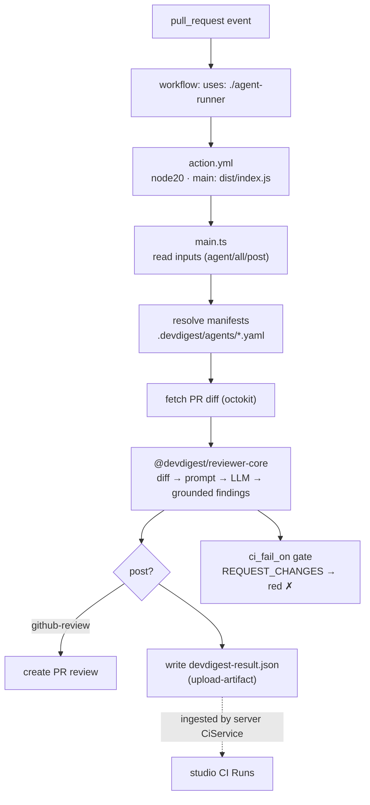

# `agent-runner` — the DevDigest GitHub Action

The IO wrapper that runs the `reviewer-core` engine in CI. On each pull request
it resolves agent manifests, fetches the diff, runs the engine, and posts a
GitHub review — the same engine the studio uses locally, just with GitHub I/O
around it.

It's a **JavaScript action** (`action.yml` → `runs: node20`, `main: dist/index.js`).

## CI flow

`OPENROUTER_API_KEY` powers the engine; `GITHUB_TOKEN` posts the review.
External-fork PRs get no secrets by design, so the post step is skipped.

## Inputs (`action.yml`)

| Input | Default | Purpose |
|-------|---------|---------|
| `agent` | — | run one agent slug (`.devdigest/agents/<slug>.yaml`) |
| `agents` | — | multiple slugs, one per line |
| `all` | `false` | run every agent in `.devdigest/agents` |
| `post` | `github-review` | `github-review` \| `none` |
| `devdigest-dir` | `.devdigest` | root of the committed agent config |

Outputs: `findings` (count) · `result-path` (the JSON artifact).

## Why `dist/` is committed

GitHub runs `main: dist/index.js` **as-is, with no build step**, so the bundled
output must be in the repo. `.gitignore` ignores `dist/` everywhere *except*
here. The bundle is produced by `npm run package` (`@vercel/ncc`).

CI does **not** byte-diff a rebuild against the committed bundle — ncc output
isn't reproducible across environments (Node/ncc/OS differences), so a strict
diff would flap. Instead `agent-runner.yml` runs a **build smoke**: `npm run
package` must succeed and emit a non-empty `dist/index.js`. After editing
`src/`, rebuild and commit `dist/` in the same change.

The end-to-end lifecycle (studio → export-to-CI → this action → ingest) is
documented in [`../docs/github-actions-pipeline.md`](../docs/github-actions-pipeline.md).

## Testing

`npm test` (vitest) covers the github adapter, the `local`/`main` entrypoints,
and `review-pr`. `npm run typecheck` type-checks against `reviewer-core` and the
shared contracts. See [`../TESTING.md`](../TESTING.md).
