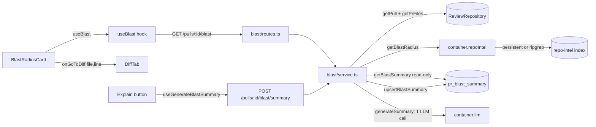

# Development Plan: Blast Radius

## Overview
Blast Radius is a read-only impact map for a PR, rendered as a card beside the existing Intent
card on the PR Overview tab. It answers "what could these changes break?" by reading the
already-built `repo-intel` index (built at clone time): which symbols changed, who calls them, and
which HTTP endpoints/crons are reachable. There is zero LLM usage on the main path and zero live
analysis — the endpoint is a pure derived read over the persistent index (with a documented,
honest degraded state when the index is incomplete). An explicit "Explain" button is the sole,
opt-in exception: exactly one cheap-model call producing a one-paragraph summary, persisted per-PR
so it is never re-generated on reload.

## Requirements
- R1: A new server module `blast/` exposes `GET /pulls/:id/blast` that returns a Blast Radius for
  the PR, computed on demand by reading `repoIntel.getBlastRadius(...)` only. (User steps 1–4,
  criterion 3/4/6)
- R2: The response groups callers into `DownstreamImpact[]` (one per changed symbol via
  `viaSymbol`), with each symbol's `endpoints_affected`/`crons_affected` derived from
  `factsByFile` of its caller files (falling back to the flat `impactedEndpoints` on the degraded
  path). (User steps 2–4, criterion 1)
- R3: The response carries an honest degraded/partial signal (`degraded` + `reason`) so the UI can
  render a badge-with-explanation rather than a blank/empty screen. (User step 5, criterion 8)
- R4: The shared contract `BlastRadius` gains the degraded/reason fields and a `PrBlastRecord`
  response wrapper, updated in the SAME task across BOTH vendor copies
  (`server/src/vendor/shared` + `client/src/vendor/shared`). (Repo hard rule)
- R5: A client hook `useBlast(prId)` fetches `GET /pulls/:id/blast` via the existing `api` client,
  mirroring `useRisks`/`useIntent` (no spinner on 404/empty). (Criterion 3)
- R6: A new `BlastRadiusCard` renders the Tree view exactly as designed: header with stat counters
  and Tree/Graph toggle; one row per changed symbol (first expanded, others collapsed) with a
  "{n} callers" count; indented clickable `file:line` caller rows; a pill row of impacted
  endpoints/crons (crons styled distinctly). (Criterion 1, design audit)
- R7: Clicking a caller `file:line` row navigates to that file+line in the Diff tab by reusing the
  existing `handleGoToDiff(file, line)` mechanism threaded down through `OverviewTab`. (Criterion 2)
- R8: `OverviewTab` is restructured to a two-column grid (Intent left, BlastRadiusCard right) to
  match the design; single-column stacking on narrow widths. (Design)
- R9: The card renders explicit non-blank states: a degraded badge with explanation (R3), a
  "no downstream" state when there are changed symbols but no callers, and an empty state when
  there is no data at all — never a blank screen. (Criterion 8)
- R10: The Graph view behind the toggle renders as an explicit **stub state** (reusing the
  pre-seeded `graph.empty`/`graph.ariaLabel` i18n keys) — the toggle is visible and functional, but
  no node/edge diagram is built in this iteration. (Design; resolved via grilling — see
  "Grilling decisions" below)
- R11: An explicit **"Explain"** action (button in the card header) triggers exactly one cheap-model
  LLM call via `POST /pulls/:id/blast/summary`, producing a one-paragraph summary. The main
  `GET /pulls/:id/blast` NEVER calls the LLM — it only ever reads a previously persisted summary.
  (User step 7, criterion 5; resolved via grilling — now required, not stretch)
- R12: The generated summary is **persisted** per-PR in a new `pr_blast_summary` table (one row per
  PR, overwritten on regeneration), so a page reload shows the last-generated summary without
  re-spending a model call. (Resolved via grilling)

> Criterion 7 (two markdown docs) is WAIVED per the request — no task is planned for it.

## Grilling decisions (post-planning interview with the user)

1. **1-hop vs depth-2 endpoint attribution:** confirmed ship 1-hop as originally planned (see
   Architecture notes) — zero `repo-intel` changes, satisfies criterion 1's example. Depth-2 stays
   a documented fast-follow, not built here.
2. **Graph view:** confirmed stub-only (R10 above) — the Tree/Graph toggle is visible from day one
   (it's in the design and the i18n keys are pre-seeded), but Graph renders a placeholder message,
   not a real diagram. Avoids inventing an undesigned surface.
3. **"Prior PRs touching these files" footer:** confirmed fully omitted (no placeholder either) —
   no data source exists (future PR History / L05 feature); showing a dead affordance was rejected
   as worse than omitting the row.
4. **LLM summary (R11/R12):** confirmed to build now, not defer. Trigger is an explicit "Explain"
   button only — the card's default render and the `GET` endpoint never call the LLM. Placement:
   a small secondary button (Sparkles icon) in the card header, next to the Tree/Graph toggle;
   result renders as an italic paragraph under the stat-counter row (same visual treatment as
   `IntentCard`'s quoted intent summary).
5. **Persistence for the summary:** confirmed `GET /pulls/:id/blast` returns any previously
   persisted summary automatically (no re-click needed after reload) — this is the whole point of
   persisting it. Requires a new `pr_blast_summary` table + migration (see Phase 3).
6. **`reason` field type:** confirmed plain `z.string()` in `PrBlastRecord` (not a shared enum
   mirroring `repo-intel`'s internal `DegradedReason`) — keeps the onion boundary clean; the client
   only ever displays the string, never branches on it.
7. **Integration test for the new table:** confirmed required — `blast.it.test.ts` (real Postgres)
   asserts the persist → reload roundtrip and that a second `GET` does not call the LLM again.

## Design audit
Every visible element of the Blast Radius card mapped to a requirement.

| Panel | Element | Requirement |
| ----- | ------- | ----------- |
| Card header | Icon + "BLAST RADIUS" label | R6 |
| Card header | Inline stat counters ("2 symbols · 14 callers · 3 endpoints · 1 cron") | R6 |
| Card header | Tree / Graph view toggle (two buttons, top-right) | R6, R10 |
| Card header | "Explain" button (Sparkles icon, secondary, next to the view toggle) | R11 |
| Card body | Summary paragraph (italic, under the stat-counter row) — shown when a summary exists, whether persisted-and-loaded or just generated | R11, R12 |
| Tree view | Changed-symbol row with right-aligned "{n} callers" count | R6 |
| Tree view | First symbol expanded by default; others collapsed with chevron | R6 |
| Tree view | Indented caller rows: monospace `file:line` + tree glyph (└→) | R6 |
| Tree view | Caller row is clickable → navigates to file:line in Diff tab | R7 |
| Tree view | Pill row of impacted HTTP endpoints (route icon, blue) | R6 |
| Tree view | Cron pill styled distinctly (clock icon, amber) | R6 |
| Graph view | Stub/placeholder state (no real diagram this iteration) | R10 |
| Graph view | Placeholder copy (`graph.empty`) + `aria-label` (`graph.ariaLabel`) | R10, R9 |
| Card body | Degraded/partial badge with explanation | R3, R9 |
| Card body | "No downstream callers" state | R9 |
| Card body | Empty state (no data) | R9 |
| Layout | Two-column grid (Intent left, Blast right) | R8 |
| Footer | "Prior PRs touching these files" row | OUT OF SCOPE — see Risks. Omitted from this feature (no data source exists). |

Orphan-contract check: `BlastRadius`/`ChangedSymbol`/`BlastCaller`/`DownstreamImpact` in
`brief.ts` are all consumed by the `blast/` service (T-02) and card (T-06). `BlastRadius.summary`
is `""` until an "Explain" call persists one (T-12); once persisted, `GET` returns it — a covered
field, not an orphan. `PrHistory`/`PrHistoryItem` are explicitly OUT OF SCOPE (tracked under the
future PR History / L05 feature) — the footer they back is omitted.

## Affected modules & contracts
- `server/src/modules/blast/` (NEW) — Fastify plugin + service. Reads `repoIntel.getBlastRadius`
  only for the core map (no persistence there); the optional summary path additionally reads/writes
  one dedicated table via `ReviewRepository` (see below) — the core blast computation itself is
  still never persisted.
- `server/src/modules/index.ts` — register the new `blastRoutes` plugin.
- `server/src/db/schema/reviews.ts` (NEW table) — `pr_blast_summary` (prId PK/FK, summary text,
  generatedAt), mirroring `prIntent`. New migration via `pnpm db:generate` + `pnpm db:migrate`.
- `server/src/modules/reviews/repository/pull.repo.ts` + `server/src/modules/reviews/repository.ts`
  — add `upsertBlastSummary`/`getBlastSummary`, mirroring `upsertRisks`/`getRisks`.
- `server/src/modules/settings/feature-models.ts` — add a `blast_summary` feature-model id
  (defaults to the same flash-class model as `review_intent`), used by `generateSummary`.
- Contracts (both vendor copies, same task):
  - `server/src/vendor/shared/contracts/brief.ts` + `client/src/vendor/shared/contracts/brief.ts`
    — no shape change to `BlastRadius` core fields; keep as-is.
  - `server/src/vendor/shared/contracts/review-api.ts` +
    `client/src/vendor/shared/contracts/review-api.ts` — add `PrBlastRecord` (the response
    wrapper) with `degraded`/`reason`, mirroring `PrIntentRecord`/`PrRisksRecord`.
- `client/src/lib/hooks/brief.ts` — add `useBlast(prId)` and `useGenerateBlastSummary(prId)`
  (mirrors `useRecalculateIntent`).
- `client/src/app/repos/[repoId]/pulls/[number]/_components/OverviewTab/` — restructure grid +
  new `_components/BlastRadiusCard/` (incl. Explain button, summary paragraph, Graph stub).
- `client/src/app/repos/[repoId]/pulls/[number]/page.tsx` — thread `onGoToDiff` into `OverviewTab`.
- `client/messages/en/blast.json` — extend with degraded-badge, empty-state, and Explain-button keys.

## Architecture notes
- **Onion layering (hard rule).** The `blast/` service is Application layer: it depends on
  `container.repoIntel` (a port) and `ReviewRepository` (its own reuse of an Infrastructure repo
  via `container.db`), never on `repo-intel/repository.ts` internals or `db/schema`. `routes.ts`
  is Transport: Zod-first schema, calls the service, maps result — no logic, no DB, no SDK.
- **1-hop vs 2-hop endpoint attribution — DECISION: ship 1-hop (option a).** The existing
  `repoIntel.getBlastRadius` attributes endpoints/crons by checking whether each caller FILE
  itself declares a route (via `factsByFile`/`impactedEndpoints`). This satisfies criterion 1's
  concrete example with zero facade changes and keeps `repo-intel` (starter infra) untouched. The
  true depth-2 import-graph BFS (`BFS_DEPTH = 2`, caller → importer-of-caller → route file) is NOT
  implemented here and is recorded as a known limitation in Risks; a fast-follow (`getReachableEndpoints`
  facade method) is out of scope for this plan.
- **Core map: not persisted. Summary: persisted, LLM-optional.** The symbols/callers/endpoints map
  itself is a fresh derived read on every request — no table, no upsert for that part. The ONE
  exception is the "Explain" summary (R11/R12): a dedicated `pr_blast_summary` table (one row per
  PR) stores the last-generated paragraph, written only by `POST /pulls/:id/blast/summary`. `GET
  /pulls/:id/blast` reads that table (if a row exists) but never writes to it and never calls the
  LLM — the LLM boundary is strictly the POST handler, called strictly by the "Explain" button.
  This means a Drizzle migration IS required for this feature (Phase 3, T-10) — the earlier
  "no persistence" framing applied only to the core map, not the summary.
- **RSC vs client boundary.** `OverviewTab`, `BlastRadiusCard`, and the hooks are all client
  components (`"use client"`), matching `IntentCard`/`OverviewTab` today. The card fetches via the
  `useBlast`/`useGenerateBlastSummary` hooks, never in the component body (react-best-practices).
- **Attribution mapping (service).** Group `callers` by `viaSymbol` into `DownstreamImpact[]`. For
  each symbol, `endpoints_affected`/`crons_affected` = union of `factsByFile[callerFile]` over that
  symbol's caller files; when `factsByFile` is absent (degraded path), attribute the flat
  `impactedEndpoints` to each symbol. `summary` is populated from `pr_blast_summary` if a row
  exists, else `""` — both `get()` and `generateSummary()` share one internal `computeBlast()`
  helper to avoid duplicating the grouping logic (T-12).



## INSIGHTS summary
- [server]: `REPO_INTEL_ENABLED=true` by default; an unindexed repo silently degrades to
  diff-only — `getBlastRadius` returns `degraded: true` with a `reason`, which is expected, not an
  error. The `blast/` service must propagate this rather than treat it as a failure.
- [server]: Migrations do not run on boot. This feature DOES add one table
  (`pr_blast_summary`) — T-10 must run `pnpm db:generate` then `pnpm db:migrate`; never hand-write
  the migration file.
- [server]: Fastify routes are Zod-first via `fastify-type-provider-zod` — never call
  `Schema.parse()` in handlers; declare the response schema on the route instead.
- [client]: Data hooks live in `src/lib/hooks/*` → `src/lib/api.ts`; `useIntent`/`useRisks` set
  `retry: false` so a 404/empty renders the empty state immediately instead of spinning.
- [client]: Pages are thin — feature logic lives in colocated `_components/<Name>/` with a
  `*.test.tsx`; mirror `IntentCard/` for `BlastRadiusCard/`.

## Phased tasks

> Phase 1 lands the contract + backend (self-consistent: endpoint works and is testable).
> Phase 2 lands the client hook + card + grid wiring on top of the shipped contract.
> Phase 3 (Explain summary) is required, not optional (resolved via grilling) — it adds the one
> persisted table and the one LLM call in the whole feature, strictly behind an explicit button,
> and is additive on top of Phase 1/2 without modifying their behavior.

### Phase 1 — Contract & backend

#### T-01: Add `PrBlastRecord` response contract (both vendor copies)

- **Action:** In `server/src/vendor/shared/contracts/review-api.ts`, import `BlastRadius` from
  `./brief.js` and add:
  `export const PrBlastRecord = BlastRadius.extend({ pr_id: z.string(), degraded: z.boolean().optional(), reason: z.string().optional() });`
  plus `export type PrBlastRecord = z.infer<typeof PrBlastRecord>;` — placed next to
  `PrRisksRecord`. Apply the identical edit to the manual client copy at
  `client/src/vendor/shared/contracts/review-api.ts`. Do NOT change `brief.ts`. Confirm the shared
  barrel re-exports `review-api` (it already does for `PrRisksRecord`); if the export is explicit
  per-name, add `PrBlastRecord` to the barrel in the same file set.
- **Why:** Satisfies R4/R3 — without a response wrapper carrying `degraded`/`reason`, the endpoint
  has nowhere to express the honest partial/degraded state (criterion 8).
- **Module:** server (+ shared client copy)
- **Type:** backend
- **Skills to use:** zod, onion-architecture-node, typescript-expert
- **Owned paths:** `server/src/vendor/shared/contracts/review-api.ts`,
  `client/src/vendor/shared/contracts/review-api.ts`
- **Depends-on:** none
- **Risk:** low
- **Known gotchas:** `src/vendor/shared/` is `@devdigest/shared`; the two copies must stay
  byte-for-byte in sync — edit both in this one task. `reason` is a plain `string` (not the
  `DegradedReason` enum, which lives in `repo-intel/types.ts` outside shared) to avoid leaking an
  infra type into the shared contract.
- **Acceptance:** `cd server && pnpm exec vitest run --exclude '**/*.it.test.ts'` passes and
  `cd server && pnpm typecheck` succeeds; `cd client && pnpm typecheck` succeeds; grepping both
  copies shows an identical `PrBlastRecord` definition.

#### T-02: Create `blast/` service — derived read over `repoIntel`

- **Action:** Create `server/src/modules/blast/service.ts` exporting `class BlastService`
  constructed with `(container: Container)`, mirroring `server/src/modules/risks/service.ts`.
  Instantiate `this.repo = new ReviewRepository(container.db)`. Implement
  `async get(prId: string, workspaceId: string): Promise<PrBlastRecord>`:
  1. `const prRow = await this.repo.getPull(workspaceId, prId)`; if missing throw
     `new NotFoundError('Pull request not found')` (from `../../platform/errors.js`).
  2. `const prFiles = await this.repo.getPrFiles(prId)`; build `changedFiles = prFiles.map(f => f.path)`.
  3. `const blast = await this.container.repoIntel.getBlastRadius(prRow.repoId, changedFiles)`.
  4. Map `blast` → `BlastRadius`: `changed_symbols` from `blast.changedSymbols`
     (`{ name, file, kind }`); group `blast.callers` by `viaSymbol` into `downstream:
     DownstreamImpact[]`, each `{ symbol, callers: [{ name: c.symbol, file: c.file, line: c.line }],
     endpoints_affected, crons_affected }`. Derive `endpoints_affected`/`crons_affected` as the
     de-duplicated union of `blast.factsByFile[callerFile].endpoints` / `.crons` over that symbol's
     caller files; when `factsByFile` is undefined (degraded path), set `endpoints_affected =
     blast.impactedEndpoints` for every symbol and `crons_affected = []`. Set `summary: ''`.
  5. Return `{ ...blastRadius, pr_id: prId, degraded: blast.degraded, reason: blast.reason }`.
  This module must import ONLY `container.repoIntel` and `ReviewRepository` — never
  `repo-intel/repository.ts` or `db/schema`.
- **Why:** Satisfies R1/R2/R3 — produces the grouped `DownstreamImpact[]` the design needs and
  propagates the degraded signal, with zero LLM calls (criterion 4/6).
- **Module:** server
- **Type:** backend
- **Skills to use:** onion-architecture-node, typescript-expert, zod
- **Owned paths:** `server/src/modules/blast/service.ts`
- **Depends-on:** T-01
- **Known gotchas:** `getBlastRadius` returns `degraded: true` for an unindexed repo — this is the
  expected fallback, not an error; propagate it. Do not persist anything (no `upsert`, no table).
  `BlastResult.callers[].symbol` is the caller's own symbol name; `viaSymbol` links it to the
  changed symbol — group by `viaSymbol`, not `symbol`.
- **Risk:** medium
- **Acceptance:** `cd server && pnpm exec vitest run --exclude '**/*.it.test.ts'` passes; the new
  service test (T-04) exercises this file and passes; `cd server && pnpm typecheck` succeeds.

#### T-03: Wire `blast/` route + register plugin

- **Action:** Create `server/src/modules/blast/routes.ts` as a default `FastifyPluginAsync`,
  mirroring `server/src/modules/risks/routes.ts`: use `appBase.withTypeProvider<ZodTypeProvider>()`,
  `const service = new BlastService(app.container)`, and register
  `app.get('/pulls/:id/blast', { schema: { params: IdParams, response: { 200: PrBlastRecord } } }, async (req, reply) => { const { workspaceId } = await getContext(app.container, req); return service.get(req.params.id, workspaceId); })`.
  Import `IdParams` from `../_shared/schemas.js`, `getContext` from `../_shared/context.js`,
  `PrBlastRecord` from `@devdigest/shared`. Then register the plugin in
  `server/src/modules/index.ts`: add `import blastRoutes from './blast/routes.js';` and a
  `blastRoutes,` entry in the `modules` object.
- **Why:** Satisfies R1 — exposes the endpoint; without registration the route returns 404
  (mirrors the note in `index.ts`'s "blast" lesson comment).
- **Module:** server
- **Type:** backend
- **Skills to use:** fastify-best-practices, onion-architecture-node, zod
- **Owned paths:** `server/src/modules/blast/routes.ts`, `server/src/modules/index.ts`
- **Depends-on:** T-02
- **Known gotchas:** Zod-first routes — declare the response schema on the route, never call
  `PrBlastRecord.parse()` in the handler. Routes may not import adapters or `db/schema`.
- **Risk:** low
- **Acceptance:** `cd server && pnpm typecheck` succeeds; `cd server && npm run depcruise` exits 0
  (no new onion violation); the route test (T-04) hits `GET /pulls/:id/blast` via `app.inject` and
  gets 200.

#### T-04: Hermetic tests for `blast/` (service + route)

- **Action:** Create `server/src/modules/blast/service.test.ts` (or `blast.test.ts` at
  `server/test/` following the sibling style) that: injects a stub `RepoIntel` via
  `ContainerOverrides.repoIntel` (see `server/src/platform/container.ts`) and a mock
  `ReviewRepository` data source, then asserts (a) callers are grouped by `viaSymbol` into
  `DownstreamImpact[]`; (b) `endpoints_affected`/`crons_affected` are derived from `factsByFile`
  per symbol; (c) on the degraded path (`factsByFile` undefined, `degraded: true`) the flat
  `impactedEndpoints` is attributed and `degraded`/`reason` propagate to `PrBlastRecord`; (d) an
  unknown PR id yields a `NotFoundError` / 404. Follow the hermetic style of
  `server/test/repo-intel-facade-degraded.test.ts` (no DB). Add a route-level test using
  `app.inject({ method: 'GET', url: '/pulls/<id>/blast' })` asserting 200 and the response shape,
  mirroring the risks route tests.
- **Why:** Makes R1/R2/R3 binary-verifiable (grouping, attribution, degraded propagation, 404).
- **Module:** server
- **Type:** backend
- **Skills to use:** fastify-best-practices, typescript-expert
- **Owned paths:** `server/src/modules/blast/service.test.ts`,
  `server/src/modules/blast/routes.test.ts`
- **Depends-on:** T-03
- **Known gotchas:** Nothing is persisted, so use hermetic (non-`.it.test.ts`) suffix and no
  Docker; inject a stub `repoIntel` rather than exercising the real facade.
- **Risk:** low
- **Acceptance:** `cd server && pnpm exec vitest run --exclude '**/*.it.test.ts'` passes with the
  new blast tests green.

### Phase 2 — Client hook, card & layout

#### T-05: Add `useBlast` hook

- **Action:** In `client/src/lib/hooks/brief.ts`, add
  `export function useBlast(prId: string | null | undefined)` using `useQuery` with
  `queryKey: ["blast", prId ?? ""]`, `queryFn: () => api.get<PrBlastRecord>(\`/pulls/${prId!}/blast\`)`,
  `enabled: !!prId`, `retry: false` — mirroring `useRisks`. Import the `PrBlastRecord` type from
  `@devdigest/shared`. (The `hooks/index.ts` barrel already re-exports `./brief`, so no barrel
  edit is needed.)
- **Why:** Satisfies R5 — the card fetches Blast data through the standard hook layer, not in the
  component body; `retry: false` shows the empty/degraded state immediately.
- **Module:** client
- **Type:** ui
- **Skills to use:** react-frontend-architecture, react-best-practices, next-best-practices
- **Owned paths:** `client/src/lib/hooks/brief.ts`
- **Depends-on:** T-01
- **Known gotchas:** All data fetching lives in `src/lib/hooks/*` → `src/lib/api.ts`; do not fetch
  in the component. `retry: false` is required so a 404/empty does not spin (matches `useIntent`).
- **Risk:** low
- **Acceptance:** `cd client && pnpm typecheck` succeeds; `cd client && pnpm test` passes.

#### T-06: Build `BlastRadiusCard` (Tree view + states) + i18n keys

- **Action:** Create `client/src/app/repos/[repoId]/pulls/[number]/_components/OverviewTab/_components/BlastRadiusCard/`
  with `BlastRadiusCard.tsx`, `styles.ts`, `index.ts`, and `BlastRadiusCard.test.tsx`, mirroring
  the sibling `IntentCard/`. Props:
  `{ blastData: PrBlastRecord | undefined; blastLoading: boolean; onGoToDiff: (file: string, line: number) => void; }`.
  Use `useTranslations("blast")` and `@devdigest/ui` primitives (`SectionLabel`, `Icon`, `Button`).
  Render:
  - Header: icon + "BLAST RADIUS" label; inline stat counters from `blast.json` `stat.*` (symbols =
    `changed_symbols.length`, callers = sum of `downstream[].callers.length`, endpoints/crons =
    de-duplicated unions); a Tree/Graph toggle (two small buttons, `view.tree`/`view.graph`) with
    local `useState` for the active view (default `tree`).
  - Tree view: one row per `downstream` entry showing `symbol` + right-aligned `callerCount`
    ("{count} callers"); first entry expanded by default, others collapsed with a chevron toggled
    by local state. Expanded rows list caller rows as monospace `file:line` with a `└→` glyph;
    each caller row is a clickable button that calls `onGoToDiff(caller.file, caller.line)` and has
    an `aria-label` (icon/interactive a11y). Below callers, a pill row: endpoints styled blue with
    a route icon, crons styled amber with a clock icon (distinct style per design).
  - States (R9): if `blastData?.degraded`, show a badge + explanation copy (new i18n key) instead
    of a blank body; if there are `changed_symbols` but no `downstream`, show the `noDownstream`
    message; if there is no data at all, show an empty state (new i18n key). Never render blank.
  Extend `client/messages/en/blast.json` with the missing keys the card needs (e.g.
  `degraded.badge`, `degraded.explain`, `empty`, `title`), reusing existing `stat.*`, `view.*`,
  `callerCount`, `noDownstream` keys. Do NOT add a "Prior PRs" footer (out of scope).
- **Why:** Satisfies R6/R7/R9 and the full design audit for the Tree view — the primary, fully
  specified surface, with click-to-code and honest non-blank states.
- **Module:** client
- **Type:** ui
- **Skills to use:** react-frontend-architecture, react-best-practices, next-best-practices,
  typescript-expert. Load `react-testing-library` lazily for the test.
- **Owned paths:**
  `client/src/app/repos/[repoId]/pulls/[number]/_components/OverviewTab/_components/BlastRadiusCard/BlastRadiusCard.tsx`,
  `client/src/app/repos/[repoId]/pulls/[number]/_components/OverviewTab/_components/BlastRadiusCard/styles.ts`,
  `client/src/app/repos/[repoId]/pulls/[number]/_components/OverviewTab/_components/BlastRadiusCard/index.ts`,
  `client/src/app/repos/[repoId]/pulls/[number]/_components/OverviewTab/_components/BlastRadiusCard/BlastRadiusCard.test.tsx`,
  `client/messages/en/blast.json`
- **Depends-on:** T-01, T-05
- **Known gotchas:** Do not store derived values (stat counts) in `useState` — compute during
  render (react-best-practices). Icon-only/clickable rows need `aria-label`. i18n strings come from
  `messages/<locale>/*.json` via next-intl — extend `blast.json`, do not hardcode copy. The
  clickable caller must reuse `onGoToDiff` (do not build new navigation). This test needs the RTL
  skill — the planner did not preload it.
- **Risk:** medium
- **Acceptance:** `cd client && pnpm test` passes including `BlastRadiusCard.test.tsx`, which
  asserts: (a) stat counters render; (b) first symbol expanded shows caller `file:line` rows;
  (c) clicking a caller calls `onGoToDiff` with the right file+line; (d) a degraded fixture renders
  the badge/explanation and no blank body. `cd client && pnpm typecheck` succeeds.

#### T-07: Restructure `OverviewTab` to two-column grid + mount card

- **Action:** Edit
  `client/src/app/repos/[repoId]/pulls/[number]/_components/OverviewTab/OverviewTab.tsx` and its
  colocated `styles.ts`: add an `onGoToDiff: (file: string, line: number) => void` prop to
  `OverviewTabProps`; call `useBlast(prId)`; wrap `IntentCard` (left) and the new `BlastRadiusCard`
  (right) in a two-column grid container (add a `gridTwoCol` style to `styles.ts` — grid on wide
  widths, single column on narrow). Pass `blastData`/`blastLoading`/`onGoToDiff` into
  `BlastRadiusCard`. Update
  `client/src/app/repos/[repoId]/pulls/[number]/_components/OverviewTab/OverviewTab.test.tsx` to
  render both cards and assert the grid + card presence. Do not modify `IntentCard`.
- **Why:** Satisfies R8 — the design shows a two-column grid; without this the card has no home and
  the layout diverges from the mock.
- **Module:** client
- **Type:** ui
- **Skills to use:** react-frontend-architecture, react-best-practices, next-best-practices.
  Load `react-testing-library` lazily for the test update.
- **Owned paths:**
  `client/src/app/repos/[repoId]/pulls/[number]/_components/OverviewTab/OverviewTab.tsx`,
  `client/src/app/repos/[repoId]/pulls/[number]/_components/OverviewTab/styles.ts`,
  `client/src/app/repos/[repoId]/pulls/[number]/_components/OverviewTab/OverviewTab.test.tsx`
- **Depends-on:** T-05, T-06
- **Known gotchas:** Styling via the colocated `styles.ts` object (existing pattern uses inline
  `style={s.*}`), not inline `style={{}}` literals. `OverviewTab` already receives `prId`; add
  `onGoToDiff` without breaking the existing intent/risks props.
- **Risk:** medium
- **Acceptance:** `cd client && pnpm test` passes including the updated `OverviewTab.test.tsx`
  (renders Intent + Blast in a grid); `cd client && pnpm typecheck` succeeds.

#### T-08: Thread `onGoToDiff` from `page.tsx` into `OverviewTab`

- **Action:** Edit `client/src/app/repos/[repoId]/pulls/[number]/page.tsx`: at the existing
  `OverviewTab` render (`{tab === "overview" && <OverviewTab prBody={pr.body} prId={prId ?? ""} />}`)
  add `onGoToDiff={handleGoToDiff}`. `handleGoToDiff(file, line)` already exists (sets `diffTarget`
  + switches to the diff tab, consumed by `DiffTab`'s `targetFile`/`targetLine`/`targetNonce`) —
  reuse it exactly, do not build a new path.
- **Why:** Satisfies R7/criterion 2 — clicking a caller row opens the code at that file:line in the
  Diff tab via the same mechanism `FindingsTab` already uses.
- **Module:** client
- **Type:** ui
- **Skills to use:** react-frontend-architecture, next-best-practices
- **Owned paths:** `client/src/app/repos/[repoId]/pulls/[number]/page.tsx`
- **Depends-on:** T-07
- **Known gotchas:** `page.tsx` is a large shared file — change only the single `OverviewTab` JSX
  line; `handleGoToDiff` is defined at lines ~72–75 and needs no change. Owned solely by this task
  so it does not overlap with T-07's `OverviewTab/` directory.
- **Risk:** low
- **Acceptance:** `cd client && pnpm typecheck` succeeds; `cd client && pnpm test` passes;
  manual/E2E: on a PR overview, clicking a Blast caller row switches to the Diff tab scrolled to
  that file:line (criterion 2).

#### T-09: Graph view — stub state (no diagram)

- **Action:** Add a Graph view stub to `BlastRadiusCard` (extend the component created in T-06 —
  this task owns adding a `_components/BlastGraph/` subfolder under the card so it does not overlap
  T-06's owned files). Create
  `.../BlastRadiusCard/_components/BlastGraph/BlastGraph.tsx`, `styles.ts`, `index.ts`, and
  `BlastGraph.test.tsx`. Render a simple centered placeholder (icon + the `graph.empty` copy) inside
  a container carrying `aria-label={t("graph.ariaLabel")}` — **do NOT build a node/edge diagram**;
  resolved via grilling that the Graph view ships as an explicit stub in this iteration, not a real
  visualization (see "Grilling decisions" #2). T-06's `BlastRadiusCard` renders `<BlastGraph .../>`
  when the view toggle is set to `graph`; that single render line is added in T-06 (the toggle
  already exists), so this task only creates the `BlastGraph` files and imports.
- **Why:** Satisfies R10 — the toggle must be functional (it's in the design), but the diagram
  itself is out of scope for this iteration.
- **Module:** client
- **Type:** ui
- **Skills to use:** react-frontend-architecture, react-best-practices, next-best-practices. Load
  `react-testing-library` lazily for the test.
- **Owned paths:**
  `client/src/app/repos/[repoId]/pulls/[number]/_components/OverviewTab/_components/BlastRadiusCard/_components/BlastGraph/BlastGraph.tsx`,
  `client/src/app/repos/[repoId]/pulls/[number]/_components/OverviewTab/_components/BlastRadiusCard/_components/BlastGraph/styles.ts`,
  `client/src/app/repos/[repoId]/pulls/[number]/_components/OverviewTab/_components/BlastRadiusCard/_components/BlastGraph/index.ts`,
  `client/src/app/repos/[repoId]/pulls/[number]/_components/OverviewTab/_components/BlastRadiusCard/_components/BlastGraph/BlastGraph.test.tsx`
- **Depends-on:** T-06
- **Known gotchas:** Stub only — no graph dependency, no node/edge layout at all in this iteration.
  Reuse `graph.empty`/`graph.ariaLabel` from `blast.json` (already seeded). Because T-06 owns
  `BlastRadiusCard.tsx`, the `<BlastGraph/>` render line must be added in T-06; this task must run
  after T-06 (Depends-on) to avoid touching that file.
- **Risk:** low
- **Acceptance:** `cd client && pnpm test` passes including `BlastGraph.test.tsx` (renders the
  placeholder + `graph.empty` copy for any fixture; container carries `graph.ariaLabel`);
  `cd client && pnpm typecheck` succeeds.

### Phase 3 — Explain summary (persisted, one LLM call, button-triggered only)

> Resolved via grilling: this is now a required phase, not an optional stretch. `GET
> /pulls/:id/blast` (Phase 1) never calls the LLM at any point in this phase — only the new POST
> handler does, and only when the user clicks "Explain".

#### T-10: Add `pr_blast_summary` table + migration

- **Action:** In `server/src/db/schema/reviews.ts`, add (next to `prIntent`):

  ```ts
  export const prBlastSummary = pgTable('pr_blast_summary', {
    prId: uuid('pr_id').primaryKey().references(() => pullRequests.id, { onDelete: 'cascade' }),
    summary: text('summary').notNull(),
    generatedAt: timestamp('generated_at', { withTimezone: true }).notNull().defaultNow(),
  });
  ```

  Run `cd server && pnpm db:generate` to produce the migration, then `cd server && pnpm db:migrate`
  against the local Postgres. Never hand-edit the generated SQL file.
- **Why:** Satisfies R12 — one row per PR, overwritten on regeneration (same shape as
  `prIntent`/`prBrief`'s single-row-per-PR pattern).
- **Module:** server
- **Type:** backend
- **Skills to use:** drizzle-orm-patterns, postgresql-table-design
- **Owned paths:** `server/src/db/schema/reviews.ts`, `server/src/db/migrations/**` (generated)
- **Depends-on:** none (independent of Phase 1/2; can run any time)
- **Known gotchas:** `pnpm db:generate` diffs schema against the migration journal — no live DB
  needed for generation, but `db:migrate` needs Postgres up (`docker compose up -d`).
- **Risk:** low
- **Acceptance:** `cd server && pnpm db:generate` produces exactly one new migration file;
  `cd server && pnpm db:migrate` succeeds; `cd server && pnpm typecheck` succeeds.

#### T-11: Add blast-summary repository methods

- **Action:** In `server/src/modules/reviews/repository/pull.repo.ts`, add
  `upsertBlastSummary(db, prId, summary: string): Promise<void>` (insert into `prBlastSummary`,
  `onConflictDoUpdate({ target: prBlastSummary.prId, set: { summary, generatedAt: new Date() } })`)
  and `getBlastSummary(db, prId): Promise<{ summary: string; generatedAt: Date } | undefined>`,
  mirroring `upsertRisks`/`getRisks`. Expose both as thin pass-through methods on the
  `ReviewRepository` class in `server/src/modules/reviews/repository.ts`.
- **Why:** Gives `blast/service.ts` a typed read/write path without reaching into `db/schema`
  directly (onion rule) — satisfies R12.
- **Module:** server
- **Type:** backend
- **Skills to use:** drizzle-orm-patterns, onion-architecture-node, typescript-expert
- **Owned paths:** `server/src/modules/reviews/repository/pull.repo.ts`,
  `server/src/modules/reviews/repository.ts`
- **Depends-on:** T-10
- **Known gotchas:** `ReviewRepository`'s class methods do NOT auto-derive from the underlying
  `pull.repo.ts` function signatures — update both in this task (per server INSIGHTS).
- **Risk:** low
- **Acceptance:** `cd server && pnpm typecheck` succeeds; exercised by T-14's tests.

#### T-12: `blast/service.ts` — `generateSummary()` + `get()` reads persisted summary

- **Action:** Extend `BlastService` (T-02). Factor the existing map-building logic out of `get()`
  into a private `computeBlast(repoId, changedFiles): Promise<BlastRadius>` helper (no `pr_id`,
  no summary). Then:
  1. `get(prId, workspaceId)`: after `computeBlast`, call
     `const persisted = await this.repo.getBlastSummary(prId)` and set
     `summary: persisted?.summary ?? ''`. This method makes ZERO LLM calls — it only ever reads.
  2. `generateSummary(prId, workspaceId): Promise<PrBlastRecord>`: resolve `prRow`/`changedFiles`
     the same way as `get()`, call `computeBlast`, resolve the `blast_summary` feature model via
     `resolveFeatureModel(this.container, workspaceId, 'blast_summary')`, build a compact prompt
     from the computed `BlastRadius` (symbol names, caller counts, endpoint/cron list — no file
     contents, no re-reading the clone), call `container.llm(provider).complete(prompt, model)`
     EXACTLY ONCE, `await this.repo.upsertBlastSummary(prId, text)`, and return the full
     `PrBlastRecord` with the new `summary`.
  In `server/src/modules/settings/feature-models.ts`, add a `blast_summary` feature-model entry
  defaulting to the same OpenRouter flash-class model as `review_intent`.
- **Why:** Satisfies R11 — exactly one LLM call, strictly inside `generateSummary`, never inside
  `get()`.
- **Module:** server
- **Type:** backend
- **Skills to use:** onion-architecture-node, typescript-expert, zod
- **Owned paths:** `server/src/modules/blast/service.ts`, `server/src/modules/settings/feature-models.ts`
- **Depends-on:** T-02, T-11
- **Known gotchas:** Use `llm.complete()` (plain text), not `completeStructured()` — the summary is
  free text, not a schema the model must match (per server INSIGHTS on `conventions/extractor.ts`,
  the same reasoning applies here: a validation throw would break a supposed-to-be-safe path).
- **Risk:** medium
- **Acceptance:** unit test (T-14) asserts `get()` never calls `container.llm` under any fixture,
  and `generateSummary()` calls it exactly once and persists via `upsertBlastSummary`.

#### T-13: `blast/routes.ts` — `POST /pulls/:id/blast/summary`

- **Action:** In `server/src/modules/blast/routes.ts` (extends T-03's file), add
  `app.post('/pulls/:id/blast/summary', { schema: { params: IdParams, response: { 200: PrBlastRecord } } }, async (req) => { const { workspaceId } = await getContext(app.container, req); return service.generateSummary(req.params.id, workspaceId); })`.
- **Why:** Satisfies R11 — exposes the "Explain" action; without it the button has nothing to call.
- **Module:** server
- **Type:** backend
- **Skills to use:** fastify-best-practices, zod
- **Owned paths:** `server/src/modules/blast/routes.ts` (same file as T-03 — sequential, not
  concurrent)
- **Depends-on:** T-03, T-12
- **Known gotchas:** Zod-first — declare the response schema, no manual `.parse()` in the handler.
- **Risk:** low
- **Acceptance:** `cd server && pnpm typecheck` succeeds; route test (T-14) hits
  `POST /pulls/:id/blast/summary` via `app.inject` and gets 200 with `summary` populated.

#### T-14: Tests for the summary persistence path (hermetic + integration)

- **Action:** Extend `server/src/modules/blast/service.test.ts` (T-04's file) with cases for
  `generateSummary`/`get`-reads-persisted-summary using a mock LLM + mock repo (assert call counts
  per T-12's acceptance). Create `server/src/modules/blast/blast.it.test.ts` (real Postgres via
  testcontainers, `.it.test.ts` suffix) asserting the full roundtrip: `POST .../summary` generates
  and persists a summary; a subsequent `GET .../blast` returns the same summary WITHOUT a second
  `container.llm` call (assert the mock LLM's call count stays at 1 across both requests).
- **Why:** Makes R11/R12 binary-verifiable — resolved via grilling as a required test, matching the
  rigor of `intent.it.test.ts` for the one DB-touching part of this feature.
- **Module:** server
- **Type:** backend
- **Skills to use:** fastify-best-practices, typescript-expert
- **Owned paths:** `server/src/modules/blast/service.test.ts` (extends T-04),
  `server/src/modules/blast/blast.it.test.ts` (new)
- **Depends-on:** T-04, T-12, T-13
- **Known gotchas:** `.it.test.ts` suffix required for the DB-backed file (server-integration CI
  lane selects only that glob); self-skips when Docker is unavailable, per `TESTING.md`.
- **Risk:** low
- **Acceptance:** `cd server && pnpm exec vitest run --exclude '**/*.it.test.ts'` passes; `cd server
  && pnpm exec vitest run .it.test` passes (requires Docker) with `blast.it.test.ts` green.

#### T-15: Client — "Explain" button + summary paragraph

- **Action:** In `client/src/lib/hooks/brief.ts`, add `useGenerateBlastSummary()` — a `useMutation`
  posting to `/pulls/${prId}/blast/summary`, `onSuccess` sets the `["blast", prId]` query cache (or
  invalidates it) so the card re-renders with the new summary, mirroring `useRecalculateIntent`.
  Extend `BlastRadiusCard` (T-06's file): add a small secondary "Explain" button (Sparkles icon)
  next to the Tree/Graph toggle, calling the mutation on click with a loading spinner while
  pending. When `blastData.summary` is non-empty (whether loaded from a prior persist or just
  generated), render it as an italic paragraph under the stat-counter row, using the same visual
  treatment as `IntentCard`'s quoted intent summary (`s.summary`-style). Add any missing i18n keys
  to `client/messages/en/blast.json` (e.g. `explain.button`, `explain.loading`).
- **Why:** Satisfies R11/R12 in the UI — the button is the ONLY LLM trigger; a persisted summary
  renders on load with no click required.
- **Module:** client
- **Type:** ui
- **Skills to use:** react-frontend-architecture, react-best-practices, next-best-practices. Load
  `react-testing-library` lazily for the test.
- **Owned paths:** `client/src/lib/hooks/brief.ts` (extends T-05),
  `client/src/app/repos/[repoId]/pulls/[number]/_components/OverviewTab/_components/BlastRadiusCard/BlastRadiusCard.tsx`
  (extends T-06), same directory's `styles.ts`/`BlastRadiusCard.test.tsx` (extends T-06),
  `client/messages/en/blast.json` (extends T-06)
- **Depends-on:** T-05, T-06, T-13
- **Known gotchas:** Do not auto-fetch/auto-trigger the summary on mount — only the explicit button
  click calls the mutation. A fixture with a pre-existing `summary` must render it with zero clicks
  (tests this in T-14's spirit, client-side).
- **Risk:** medium
- **Acceptance:** `cd client && pnpm test` passes: clicking "Explain" calls the mutation and renders
  the returned summary; a fixture with `summary` already set renders the paragraph on initial
  render with no interaction; `cd client && pnpm typecheck` succeeds.

## Testing strategy
- Unit (server, hermetic, no Docker): `cd server && pnpm exec vitest run --exclude '**/*.it.test.ts'`
  — covers `blast/` service grouping/attribution/degraded + route via `app.inject` (T-04).
- Onion gate (server): `cd server && npm run depcruise` — must exit 0 (T-03), proving `blast/`
  reads only `repoIntel.*`, not `repo-intel/repository.ts` or `db/schema`.
- UI: `cd client && pnpm test && pnpm typecheck` — `BlastRadiusCard`, `BlastGraph`, and updated
  `OverviewTab` tests (fetch is mocked; no API needed).
- Integration (server, real Postgres, requires Docker): `cd server && pnpm exec vitest run .it.test`
  — `blast.it.test.ts` (T-14) is the one DB-touching path in this feature: the persisted-summary
  roundtrip (`POST .../summary` → `GET .../blast` returns it, no second LLM call).
- E2E (manual/per `e2e/docs/flows.md`): open a PR that changes a shared helper on the Overview tab;
  verify ≥2 callers and ≥1 endpoint render (criterion 1) and clicking a caller opens the Diff tab
  at that file:line (criterion 2); click "Explain" and confirm the summary persists across a reload.

## Risks & mitigations
- **Depth-2 endpoint reachability is NOT implemented (known limitation).** The shipped attribution
  is 1-hop (caller file declares the route). If a PR changes a symbol whose callers are helpers one
  more hop from the route file, those endpoints will not appear. Mitigation: documented decision to
  ship 1-hop (satisfies criterion 1's example); fast-follow is a read-only `getReachableEndpoints`
  facade method on `RepoIntel` using the existing `BFS_DEPTH = 2` / `getEdges()` primitives —
  out of scope for this plan.
- **"Prior PRs touching these files" footer has no data source.** It belongs to the future PR
  History / L05 feature (`PrHistory`/`PrHistoryItem` exist as contracts but no service produces the
  data). Mitigation: omit the footer entirely from this feature; do not fabricate data or build
  PR-history detection. Tracked as future work.
- **Degraded index renders as apparent emptiness.** An unindexed/partial repo returns
  `degraded: true`. Mitigation: R3/R9 surface a badge + explanation and explicit
  no-downstream/empty states — never a blank card (criterion 8), verified by T-04 and T-06 tests.
- **Graph view is undesigned.** Risk of over-investment. Mitigation: resolved via grilling — T-09
  ships an explicit stub (placeholder + `graph.empty` copy), no diagram at all in this iteration.
- **`page.tsx` is a large shared file.** Mitigation: T-08 owns it solely and touches only the one
  `OverviewTab` render line; it depends on T-07 rather than sharing the `OverviewTab/` directory.
- **New persistence surface (`pr_blast_summary`) is the only DB-touching part of the feature.**
  Risk of an inconsistent write (summary saved but stale relative to a since-amended PR) since
  there is no auto-invalidation on new commits — matches the existing, accepted pattern for
  Intent/Risks (manual "Recalculate"/"Explain" re-trigger, no automatic staleness detection).
  Mitigation: none needed beyond parity with existing behavior; not a new risk class.
- **`blast/routes.ts` is touched by two tasks in different phases (T-03, T-13).** Mitigation:
  T-13 explicitly depends on T-03 (sequential, never concurrent) — same rule already applied to
  `page.tsx` above.

## Red-flags check
- [x] Global Constraints have no internal contradictions (contract-first, core map not persisted,
  summary persisted+LLM strictly behind an explicit button, onion read-only, zero-LLM `GET` path
  all consistent)
- [x] Every requirement maps to a task (R1→T02/T03, R2→T02, R3→T01/T02, R4→T01, R5→T05, R6→T06,
  R7→T06/T08, R8→T07, R9→T06, R10→T09, R11→T10–T13/T15, R12→T10–T12/T15)
- [x] Dependencies form a DAG (T01→T02→T03→T04; T01→T05; {T01,T05}→T06→T09; {T05,T06}→T07→T08;
  T10→T11→T12→T13→T14; {T05,T06,T13}→T15 — no cycles)
- [x] Concurrent tasks have non-overlapping Owned paths AND parent directories (T05 hooks vs T06
  BlastRadiusCard dir are independent under Phase 2; T02/T03/T04 own distinct files; T09 uses a
  nested `BlastGraph/` subdir it fully owns; T10's schema file and T11's repository files are
  independent of Phase 1/2 paths)
- [x] Every task description names exact file paths — no abstract descriptions
- [x] Every task is self-contained (carries contract ref, owned paths, runnable acceptance)
- [x] Every Acceptance is a runnable command with binary pass/fail
- [x] Each phase produces a self-consistent, mergeable state (Phase 1 = working endpoint; Phase 2 =
  wired UI; Phase 3 = Explain summary, additive on top of Phase 1/2 without modifying their behavior)
- [x] Shared contract change (T-01) updates BOTH vendor copies in the same task
- [x] Schema changes: ONE table (`pr_blast_summary`, T-10) with `pnpm db:generate` +
  `pnpm db:migrate` in the task — the core blast map itself still adds no schema
- [x] Integration edge-cases explicit: degraded/partial state (T-02/T-04), 404 for unknown PR
  (T-02/T-04), onion boundary (T-03 depcruise), empty/no-downstream states (T-06), persisted-summary
  roundtrip + zero-second-LLM-call (T-14, real Postgres)
- [x] UI design audit completed — every visible element mapped; "Prior PRs" footer explicitly
  out-of-scope; Explain button + summary paragraph added (R11/R12)
- [x] Orphan contracts: `BlastRadius`/`ChangedSymbol`/`BlastCaller`/`DownstreamImpact` covered by
  T-02/T-06; `PrBlastRecord` added in T-01; `PrHistory`/`PrHistoryItem` explicitly out-of-scope
  (tracked in future PR History / L05)
