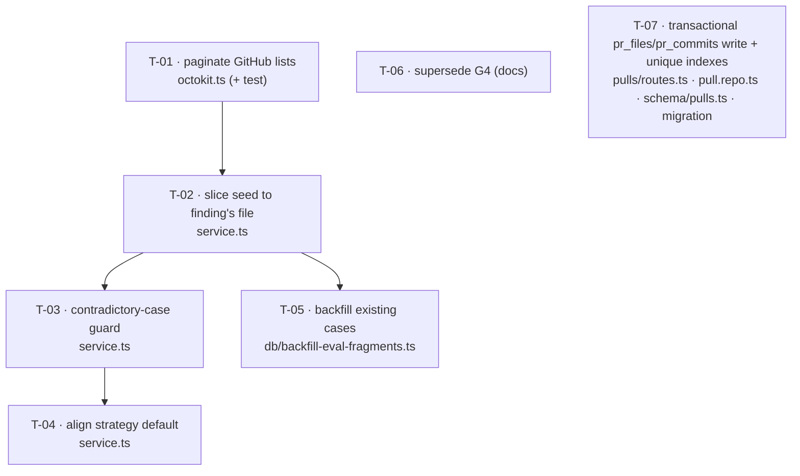

# Development Plan: Restore diff-FRAGMENT snapshotting for "Turn into eval case"

## Overview
The Eval Pipeline's original assignment (and its approved spec, AC-3) requires "Turn into eval
case" to snapshot **a diff fragment** of the finding onto the case. At grilling time the
`eval-pipeline.md` plan overrode this with G4 ("snapshot the WHOLE PR unified diff"), and that is
what shipped: `buildSeedFromFinding` snapshots every `pr_files` patch (live: 570 KB / 100 files /
~145k tokens per case). This plan restores AC-3 by snapshotting only **the finding's whole file**
(the single-file slice of the PR diff via the already-exported `sliceDiff`), fixes the GitHub
file-list truncation that can make the fragment unbuildable, guards against self-cancelling
case pairs, aligns the eval's review-strategy default with production, reconciles the 4 existing
whole-PR cases, and supersedes G4 in the docs so the whole-PR design isn't re-derived.

## Execution mode
**Single-agent (sequential).** Three of the six tasks (T-02, T-03, T-04) all edit the same file,
`server/src/modules/eval/service.ts`, and share the same test file `service.it.test.ts`; they are
tightly coupled and cannot be parallelised without owned-path collisions on a shared branch.
T-01 (adapter), T-05 (backfill script), and T-06 (docs) touch disjoint paths and *could* run
concurrently, but the plan's centre of gravity is the serial `service.ts` chain, so a single
implementer working top-to-bottom is the honest fit. The `Owned paths` below still document scope;
in this mode the overlap among T-02/T-03/T-04 on `service.ts` is intentional and relies on
sequential execution, not a concurrency contract.

> Open for grilling: if the requester prefers multi-agent, T-02/T-03/T-04 must be merged into one
> task (they cannot run in parallel on `service.ts`); T-01/T-05/T-06 could then run alongside it.

**GRILLING COMPLETE (2026-07-17) — single-agent sequential CONFIRMED.**

## Grilling resolutions
<!-- Requester decisions, 2026-07-17. Binding. -->
- **G-1 (range/matcher scope):** Narrow the *diff* to the finding's file only; keep the copied
  line range verbatim; do NOT tighten the matcher. The wide-range weakness on whole-file findings
  (a `must_find` satisfiable by any finding in the file) is ACCEPTED as a known, documented
  limitation — confirms Non-goals as written.
- **G-2 (R5 contradictory cases):** **Hard-reject** with a 409 — confirms the Recommendation. → T-03.
- **G-3 (R7 existing cases):** **Re-seed** via the idempotent backfill — confirms the
  Recommendation. → T-05.
- **G-4 (R4 scope):** Paginate **all three** lists (`listFiles` + `listCommits` +
  `listReviewComments`) — confirms the Recommendation. → T-01.
- **G-5 (R4 caps):** Use GitHub's documented ceilings **3000 / 250 / 500** — confirms the
  Recommendation. → T-01.
- **G-6 (execution mode):** Single-agent sequential — confirms Execution mode.
- **G-7 (pr_files/pr_commits write path):** **PULL INTO THIS PLAN** (overrides the plan's original
  "explicit follow-up, out of scope" recommendation under Risks). Fix BOTH `pr_files` AND
  `pr_commits` (same anti-pattern, same handler, clean natural keys `(prId,path)` / `(prId,sha)`):
  move the inline non-transactional `delete`-then-`insert` out of `pulls/routes.ts:274-297` into a
  repository method wrapped in a **transaction** (correct full-replace semantics — a transactional
  delete+insert, NOT an upsert, because a force-push can remove files and upsert would leak stale
  rows), and add **unique indexes** on both tables via a migration (matching the existing
  `pr_repo_number_uq` "idempotent import" precedent in `schema/pulls.ts:31`). → NEW T-07. This adds
  a DB migration to a plan that previously had none — see updated Testing strategy and Risks.

## Requirements
<!-- Every line traces to the user's original assignment, the approved spec (AC-3), or an
     explicit in-scope instruction in the superseding brief. -->
- R1: "Turn into eval case" shall snapshot a diff **FRAGMENT** (not the whole PR diff) onto the
  case's `input_diff`, restoring spec AC-3 (`SPEC-2026-07-15-eval-pipeline.md:422-424`).
- R2: The fragment shall be **the finding's whole file** — the single-file slice of the PR diff
  for `finding.file` (user decision, not to be re-litigated).
- R3: Snapshotting shall be non-silent about truncation: if the finding's file is not present in
  the snapshot source, the seed operation shall fail loudly with an actionable error rather than
  fall back to a whole-PR or empty fixture.
- R4: The GitHub PR file list shall be paginated (not a single 100-item page), with an explicit
  named cap and a logged record whenever the cap truncates the result.
- R5: The eval set shall be guarded against mutually contradictory cases (same owner, same file,
  overlapping range, opposite `type`) at create-from-finding time.
- R6: The eval run path shall use the same default review strategy as production
  (`REVIEW_STRATEGY = 'single-pass'`), not the engine's `'auto'` default.
- R7: The 4 existing persisted whole-PR cases shall be reconciled so runs remain comparable after
  the fixture shape changes.
- R8: G4 in `docs/plans/eval-pipeline.md` shall be superseded in place so the whole-PR design is
  not re-derived by the next reader.
- R9 (grilling G-7): The `pr_files` and `pr_commits` write in `GET /pulls/:id` shall be moved out
  of the route handler into transactional repository methods, and both tables shall gain a unique
  index on their natural key (`pr_files(pr_id, path)`, `pr_commits(pr_id, sha)`) via a migration.

## Recommendations
<!-- Advice the requester can accept or reject during grilling — not binding requirements. -->
<!-- RESOLVED 2026-07-17 — see ## Grilling resolutions: R4-caps→G-5 (accepted), R4-scope→G-4
     (accepted, all three), R5→G-2 (hard-reject accepted), R7→G-3 (re-seed accepted). Plus G-7:
     the pr_files/pr_commits write-path was pulled IN scope (T-07), overriding the Risks deferral. -->
- R4 caps: set `MAX_PR_FILES = 3000` (GitHub's own documented `listFiles` ceiling),
  `MAX_PR_COMMITS = 250` (GitHub's `listCommits` ceiling), `MAX_PR_REVIEW_COMMENTS = 500`. Log a
  warning with `{ pr, cap, fetched }` when a resource hits its cap. Rationale: anchoring to
  GitHub's real API ceilings means the log fires only on genuinely-truncated giant PRs, and the
  fragment fix makes the fixture tiny regardless of how many files are fetched. (needs requester
  confirmation of the exact numbers)
- R4 scope: apply the same paginate-with-cap treatment to `listCommits` and `listReviewComments`
  (same file, same single-page `per_page: 100` shape) — silent truncation is the through-line of
  this bug and leaving two known siblings unfixed contradicts the fix. (needs requester
  confirmation; could be deferred to a follow-up if they want R4 minimal)
- R5 behaviour: **hard-reject** the create (throw a 409 `AppError`) rather than warn-and-save.
  Rationale: reject surfaces through the existing error envelope (no new contract, no UI task) and
  decisively prevents the self-cancelling set; warn-and-save would need a new response field the
  out-of-scope UI can't render. (needs requester confirmation — warn-vs-reject is explicitly their
  open choice)
- R7 approach: **re-seed** the existing cases to fragments via an idempotent backfill script that
  slices each case's already-stored `input_diff` down to the file named in its `expected_output`
  (byte-identical to what a fresh fragment seed produces, since the stored diff *was*
  `diffFromPrFiles(...).raw`). Skip and log any case whose file isn't in its own stored fixture;
  log (do not auto-resolve) contradictory pairs for manual review. Rationale: reuses
  `source_finding_id`'s intent, converges old and new cases, and needs neither the source finding
  nor a fresh GitHub fetch. (needs requester confirmation vs. "leave them" or "delete them")

## Affected modules & contracts
- `server` adapter (`src/adapters/github/octokit.ts`) — paginate PR file/commit/review-comment
  lists with caps + truncation logging; add optional injected-octokit and injected-logger
  constructor seams for hermetic testing.
- `server` eval module (`src/modules/eval/service.ts`) — slice the seed to the finding's file;
  loud guard when the file isn't snapshotted; contradictory-case guard; strategy-default align.
- `server` DB tooling (`src/db/backfill-eval-fragments.ts` NEW, `package.json`) — one-off
  idempotent re-seed of existing cases.
- `docs/plans/eval-pipeline.md` — supersede G4.
- `server` pulls module + reviews repo + DB (grilling G-7 → T-07): move the `pr_files`/`pr_commits`
  write out of `src/modules/pulls/routes.ts` into transactional methods on the reviews repository
  (`src/modules/reviews/repository/pull.repo.ts` + the `ReviewRepository` wrapper), add unique
  indexes to `src/db/schema/pulls.ts`, and generate ONE migration under `src/db/migrations/`.
- Contracts: **none.** No `@devdigest/shared` schema changes. `ExpectedFinding`,
  `EvalCase`/`EvalCaseInput`, `PrDetail` are all unchanged. **DB migration: ONE** — the
  `pr_files`/`pr_commits` unique indexes (T-07, grilling G-7). No table/column shape change, only
  two `CREATE UNIQUE INDEX`es; run `pnpm db:generate` then `pnpm db:migrate`.

## Architecture notes
- **`buildSeedFromFinding` is the single choke point.** All three seed entry points route through
  it — `evalCaseSeed` (`service.ts:473`), `createCaseFromFinding` (`service.ts:489`), and
  `evalRunPreviewFromFinding` (`service.ts:514`). Fixing it once fixes preview, seed, and create
  uniformly; do not duplicate the slice logic into the three callers.
- **`sliceDiff` already exists and is already reachable server-side.** Exported from
  `reviewer-core/src/index.ts:39` (definition `reviewer-core/src/review/reduce.ts:58`) and
  re-exported at `server/src/modules/reviews/helpers.ts:10`. Importing it into `eval/service.ts`
  is a pure Application-layer function import between sibling modules — the same accepted pattern
  as `eval/service.ts` already importing `diffFromPrFiles` from `reviews/diff-loader.js`
  (server INSIGHTS 2026-07-15). No reviewer-core change, no new port.
- **`sliceDiff` has a silent whole-diff fallback (`reduce.ts:70`): when the requested path isn't
  found it returns `diff.raw` (the ENTIRE diff).** This is exactly the silent-truncation footgun
  the fix exists to kill. T-02 must NOT rely on `sliceDiff` to detect a missing file — it must
  guard the file's presence in `pr_files` *before* slicing, and re-parse the sliced result to
  assert exactly one file (`=== finding.file`) *after* slicing, throwing otherwise.
- **Strategy default is nearly moot under a single-file fragment but fix it anyway.** `selectMode`
  (`reviewer-core/src/review/run.ts:120-126`) only picks map-reduce when `diff.files.length > 1`,
  so a one-file fragment always runs single-pass regardless of the `'auto'` vs `'single-pass'`
  default. R6 is a small robustness/consistency fix (`agent.strategy ?? REVIEW_STRATEGY`), not a
  performance lever — see Non-goals on map-reduce.
- **Do not reach for map-reduce as a large-diff workaround.** `reviewer-core/INSIGHTS.md`
  (2026-07-17) documents that map-reduce is ~200+ serial per-file LLM calls; and the OpenRouter
  request deadline now scales with prompt size (`deadlineFor(messages)`, up to ~600s), so
  single-pass on the (now tiny) fragment is unambiguously correct.
- **Adapter logging seam.** No adapter under `src/adapters/**` currently takes a logger (verified
  by grep). T-01 adds an optional `logger?: Pick<Console, 'warn'>` constructor param defaulting to
  `console`, and an optional injected-octokit param defaulting to `new Octokit({ auth: token })`,
  both backward-compatible with the sole construction site `platform/container.ts:164`.
- **pr_files/pr_commits write path is IN scope (grilling G-7, was originally deferred).** The
  inline non-transactional `delete`-then-`insert` in `pulls/routes.ts:274-297` (raw `container.db`
  in a route handler — an onion violation per `server/CLAUDE.md`) moves into transactional
  `replacePrFiles`/`replacePrCommits` methods on the reviews repository, and both tables gain a
  unique index on their natural key. Use a transactional delete+insert (full-replace: a force-push
  can drop a file/commit, and an upsert would leak the stale row), NOT `onConflictDoUpdate`. The
  unique index is a data-integrity guard + matches the `pr_repo_number_uq` "idempotent import"
  precedent (`schema/pulls.ts:31`). This is the ONLY schema change in the plan. → T-07.

> T-07 (grilling G-7) is independent of the `service.ts` chain and of T-01 — disjoint Owned paths
> (`pulls/routes.ts`, `reviews/pull.repo.ts`, `schema/pulls.ts`, a new migration). In single-agent
> sequential mode it runs in Phase 1 alongside T-01 as ingestion-path hardening; it depends on
> nothing and blocks nothing.

## INSIGHTS summary
- [server]: `listFiles({ per_page: 100 })` fetches one page, never paginates — `pr_files` silently
  caps at 100 files; a finding beyond position 100 can't be snapshotted at all (2026-07-17,
  `octokit.ts:79-84`).
- [server]: The eval set already holds two cases that cancel each other (same file+range, opposite
  type) with no cross-case check in `createCaseFromFinding` (2026-07-17, `service.ts`).
- [server]: `buildSeedFromFinding` copies the finding's `start_line`/`end_line` verbatim; combined
  with overlap-only matching a whole-file range makes `must_find` satisfiable by any finding in
  the file — narrowing the *diff* to one file does not narrow the *range*, so this remains a known
  limitation, not something this plan changes (2026-07-17, `service.ts:424-432`).
- [server]: eval vs. production strategy default diverge (`'auto'` vs `'single-pass'`); latent only
  because every seeded agent sets `strategy` explicitly (2026-07-17, `service.ts:241`).
- [server]: `diffFromPrFiles(container.reviewRepo, prId)` returns an already-parsed `UnifiedDiff`;
  use `.raw` for `input_diff` (2026-07-15, `diff-loader.ts:33`).
- [reviewer-core]: Do NOT tighten `matchesExpectation` and do NOT switch to map-reduce — both are
  documented dead-ends; the real defect is the seeder's fixture/ranges (2026-07-17, `score.ts:42-47`,
  `run.ts:120-126`).

## Phased tasks

> Single-agent, sequential. Each phase reaches a self-consistent, mergeable state.

### Phase 1 — Fetch the finding's file at all

#### T-01: Paginate the GitHub PR file/commit/review-comment lists with capped, logged truncation

- **Action:** In `server/src/adapters/github/octokit.ts`, replace the three single-page
  `per_page: 100` calls with real pagination that loops pages (`page = 1..N`, `per_page: 100`,
  stop when a page returns `< 100` items OR the running total reaches the resource cap):
  - `getPullRequest` → `pulls.listFiles` (cap `MAX_PR_FILES`) and `pulls.listCommits`
    (cap `MAX_PR_COMMITS`).
  - `listReviewComments` → `pulls.listReviewComments` (cap `MAX_PR_REVIEW_COMMENTS`).
  Define the three caps as named module constants. When a loop stops because it hit the cap while
  the last page was still full (more may exist), call `this.logger.warn({ pr: n, cap, fetched },
  'GitHub <resource> list truncated at cap')`. Add two backward-compatible constructor seams:
  `constructor(token: string, opts?: { octokit?: Octokit; logger?: Pick<Console, 'warn'> })`,
  defaulting `octokit` to `new Octokit({ auth: token })` and `logger` to `console`. Update the
  sole call site `platform/container.ts:164` only if needed (the new args are optional, so no
  change is required — verify it still compiles).
- **Why:** Satisfies R4. Without pagination, a finding whose file is beyond position 100 has no
  patch in `pr_files`, so T-02's fragment cannot be built (verified live: PR #10 has 201 changed
  files, `pr_files` held exactly 100). Silent truncation is the through-line of the whole bug.
- **Module:** server
- **Type:** backend
- **Skills to use:** onion-architecture-node, fastify-best-practices, typescript-expert, security
- **Owned paths:** `server/src/adapters/github/octokit.ts`,
  `server/src/adapters/github/octokit.test.ts` (NEW FILE)
- **Depends-on:** none
- **Risk:** medium
- **Known gotchas:** Adapters here take no logger today (verified) — the optional
  `logger`/`octokit` params are new seams, keep them optional so `container.ts:164` compiles
  untouched. Do NOT introduce `octokit.paginate` (harder to fake); the manual page loop is
  trivially stubbable by injecting an `octokit` whose `rest.pulls.{get,listFiles,listCommits,
  listReviewComments}` return controlled pages. Keep the `withRetry(withTimeout(...))` wrapper.
- **Acceptance:** `cd server && pnpm exec vitest run src/adapters/github/octokit.test.ts` passes,
  with hermetic cases (injected stub octokit, no network) proving: (1) `getPullRequest` returns
  all files across ≥3 stubbed pages (e.g. 250 files) — not just 100; (2) when the stub keeps
  returning full pages past the cap, exactly one truncation `warn` is emitted (assert via an
  injected logger spy) and the returned length equals the cap; (3) a normal <100-file PR emits no
  warning and makes exactly one page call. `cd server && pnpm typecheck` passes.

#### T-07: Move the pr_files/pr_commits write into transactional repository methods + unique indexes (grilling G-7)

- **Action:** Three coordinated changes:
  1. **Schema** (`server/src/db/schema/pulls.ts`): add a unique index to each table's natural key,
     mirroring the existing `pr_repo_number_uq` on `pullRequests` (`:31`) —
     `uniqueIndex('pr_files_pr_path_uq').on(t.prId, t.path)` on `prFiles` and
     `uniqueIndex('pr_commits_pr_sha_uq').on(t.prId, t.sha)` on `prCommits` (both tables currently
     have NO secondary index, `:36-56`). Then `cd server && pnpm db:generate` to emit ONE migration
     under `src/db/migrations/`, and `pnpm db:migrate` to apply it.
  2. **Repository** (`server/src/modules/reviews/repository/pull.repo.ts` + the `ReviewRepository`
     wrapper `server/src/modules/reviews/repository.ts`): add `replacePrFiles(db, prId, files)` and
     `replacePrCommits(db, prId, commits)` that each run a **`db.transaction`** doing
     `tx.delete(...).where(eq(prId))` then, if non-empty, `tx.insert(...).values(...)` — a
     transactional full-replace (NOT `onConflictDoUpdate`: a force-push can drop a file/commit and
     an upsert would leak the stale row). Expose both through the `ReviewRepository` class wrapper
     (its methods do NOT auto-derive from the function-level repo — server INSIGHTS 2026-06-20).
  3. **Route** (`server/src/modules/pulls/routes.ts:274-297`): replace the two inline
     `container.db.delete(...)` + `container.db.insert(...)` blocks with
     `await container.reviewRepo.replacePrFiles(pr.id, detail.files.map(...))` and the commits
     equivalent, removing all raw `container.db` mutation from the handler. Keep the surrounding
     `try/catch` at `:311` (offline/no-token fallback to persisted rows) exactly as-is.
- **Why:** Satisfies R9. The only `pr_files`/`pr_commits` write is an inline non-transactional
  delete-then-insert against raw `db` in a GET route handler (`:274-297`) — an onion violation
  (`server/CLAUDE.md`), and non-atomic (a crash between delete and insert leaves the PR with zero
  files/commits). The missing `(prId,path)`/`(prId,sha)` unique index is why it's delete+insert and
  why nothing guards against duplicate rows. The requester pulled this in (grilling G-7) rather
  than deferring it.
- **Module:** server
- **Type:** backend
- **Skills to use:** onion-architecture-node, drizzle-orm-patterns, postgresql-table-design, fastify-best-practices, typescript-expert
- **Owned paths:** `server/src/db/schema/pulls.ts`, `server/src/db/migrations/**` (NEW migration
  file, name assigned by `db:generate`), `server/src/modules/reviews/repository/pull.repo.ts`,
  `server/src/modules/reviews/repository.ts`, `server/src/modules/pulls/routes.ts`,
  `server/src/modules/pulls/routes.it.test.ts`
- **Depends-on:** none (disjoint from T-01 and the `service.ts` chain)
- **Risk:** medium
- **Known gotchas:** NEVER edit an existing migration file — `db:generate` creates a new one
  (`server/CLAUDE.md`). Migrations do NOT run on boot — `pnpm db:migrate` after generating. The
  unique indexes assume no existing duplicate `(prId,path)`/`(prId,sha)` rows; the current
  delete-then-insert means there should be none, but `db:migrate` will fail loudly if any exist —
  that's acceptable (surfaces real corruption) but note it. `ReviewRepository` is a thin wrapper
  whose class method signatures must be added by hand alongside the `pull.repo.ts` functions
  (server INSIGHTS 2026-06-20). The route handler builds the same `{prId, path, additions,
  deletions, patch}` / `{prId, sha, message, author, committedAt}` value shapes it builds today —
  just moved behind the repo method.
- **Acceptance:** `cd server && pnpm db:generate` produces exactly one new migration containing two
  `CREATE UNIQUE INDEX` statements and no table/column changes; `pnpm db:migrate` applies cleanly.
  `cd server && pnpm exec vitest run src/modules/pulls/routes.it.test.ts` passes (Docker), proving
  a second `GET /pulls/:id` refresh with a changed file set fully replaces the prior `pr_files`
  rows (no duplicates, no stale rows) via the repository method. `cd server && pnpm typecheck` and
  `cd server && npm run depcruise` (exit 0 — the route now calls the repo, removing a raw-db access,
  which cannot worsen layering) both pass.

### Phase 2 — Snapshot a fragment, not the whole PR

#### T-02: Slice the seed fixture down to the finding's file (restore AC-3)

- **Action:** In `server/src/modules/eval/service.ts`, change `buildSeedFromFinding`
  (`:411-457`) so the snapshot is the finding's single file, not the whole PR:
  1. Keep `const diff = await diffFromPrFiles(this.container.reviewRepo, review.prId)` and
     `const files = await this.container.reviewRepo.getPrFiles(review.prId)`.
  2. **Guard before slicing:** find the `pr_files` entry for `finding.file` with a non-null
     `patch`. If none exists, `throw new AppError('finding_file_not_snapshotted', ...)` with an
     actionable message (the PR's file list is truncated or the file has no patch — re-import the
     PR so its files are fully fetched). Do NOT fall back to a whole-PR or empty fixture (R3).
  3. Import `sliceDiff` from `../reviews/helpers.js` and compute
     `const fragmentRaw = sliceDiff(diff, finding.file)`.
  4. **Guard after slicing:** `parseUnifiedDiff(fragmentRaw)` and assert the result has exactly one
     file whose path `=== finding.file`; otherwise `throw` — this closes `sliceDiff`'s silent
     whole-diff fallback (`reduce.ts:70`).
  5. Set `input_diff: fragmentRaw` and narrow `input_files` to only the matching file entry
     (`files.filter(f => f.path === finding.file).map(...)`), keeping the same `{path, additions,
     deletions, patch}` shape. Leave `input_meta` (PR meta) and `expected_output` unchanged —
     the expectation's file/line range is still copied verbatim from the finding (do NOT change
     the range; see Non-goals).
- **Why:** Satisfies R1, R2, R3. This is the core fix: it restores spec AC-3, drops the fixture
  from ~570 KB/100 files to single-digit KB/1 file, and guarantees grounding sees every line the
  finding cites. Fixing the one choke point fixes seed, preview, and create together.
- **Module:** server
- **Type:** backend
- **Skills to use:** onion-architecture-node, typescript-expert, zod
- **Owned paths:** `server/src/modules/eval/service.ts`,
  `server/src/modules/eval/service.it.test.ts`
- **Depends-on:** T-01
- **Risk:** high
- **Known gotchas:** `sliceDiff` returns the ENTIRE `diff.raw` when the path isn't found
  (`reduce.ts:70`) — never treat a "successful" slice as proof the file was present; the
  before-guard (step 2) and after-guard (step 4) are both mandatory. `diffFromPrFiles` already
  returns a parsed `UnifiedDiff`; `.raw` is the reconstructed text. `input_files` is display-only
  (editor Diff tab) — narrowing it is safe because the review engine consumes only `input_diff`
  via `parseUnifiedDiff` (`service.ts:235`). `buildSeedFromFinding` needs the DB (`reviewRepo`),
  so its test is `.it.test.ts` (Docker).
- **Acceptance:** `cd server && pnpm exec vitest run src/modules/eval/service.it.test.ts` passes
  (Docker required), with cases proving: (1) a finding on a multi-file PR yields a seed whose
  `input_diff` parses to exactly one file `=== finding.file` and whose `input_files.length === 1`;
  (2) a finding whose file has no patch in `pr_files` makes `evalCaseSeed`/`createCaseFromFinding`
  throw `AppError('finding_file_not_snapshotted')`, not return a whole-PR fixture. `cd server &&
  pnpm typecheck` passes.

#### T-03: Reject creating a case that contradicts an existing case for the same finding-file/range

- **Action:** In `server/src/modules/eval/service.ts`, in `createCaseFromFinding` (`:484-497`),
  after resolving the seed and before `this.repo.createCase(...)`, load the owner's existing cases
  (via `this.repo.listCasesForOwner(workspaceId, 'agent', ownerId)` — already exists,
  `repository.ts:33`) and detect a contradiction: an existing case containing an
  `expected_output` entry with the **same `file`**, an **overlapping line range**, and the
  **opposite `type`** to the case being created. Use a small inline overlap check
  (`aLo <= bHi && bLo <= aHi`, mirroring `overlaps` in `score.ts:34-40`, which is not exported).
  On a contradiction, `throw new AppError('contradictory_case', 'A <opposite-type> eval case
  already exists for <file>:<range> (case <id>); resolve it before adding this one', 409)`.
- **Why:** Satisfies R5. Live, the Security Reviewer set holds `ad769a0e` (`must_find`) and
  `c34e6a01` (`must_not_flag`) on the same file+range — no agent output can pass both, and the
  set silently scores itself as half-failing. This is an integration edge-case, so it is its own
  task, not hidden inside T-02.
- **Module:** server
- **Type:** backend
- **Skills to use:** onion-architecture-node, typescript-expert
- **Owned paths:** `server/src/modules/eval/service.ts`,
  `server/src/modules/eval/service.it.test.ts`
- **Depends-on:** T-02
- **Risk:** medium
- **Known gotchas:** Guard the *create* path only — do NOT touch `evalCaseSeed`/preview (read-only)
  or the matcher/scoring. The user has deferred any polarity/empty-array redesign, so this only
  blocks *new* contradictions; it does not rewrite existing cases (T-05 reports them instead).
  `listCasesForOwner` returns `expected_output` already parsed to `ExpectedFinding[]`.
- **Acceptance:** `cd server && pnpm exec vitest run src/modules/eval/service.it.test.ts` passes
  (Docker), with a case proving: after creating a `must_not_flag` case from a dismissed finding,
  creating a `must_find` case from an accepted finding on the same file+overlapping range throws
  `AppError('contradictory_case')` (409); and a non-overlapping / same-type create still succeeds.
  `cd server && pnpm typecheck` passes.

#### T-04: Align the eval run's default review strategy with production

- **Action:** In `server/src/modules/eval/service.ts`, change `executeCase`'s
  `strategy: agent.strategy ?? undefined` (`:241`) to `strategy: agent.strategy ?? REVIEW_STRATEGY`,
  importing `REVIEW_STRATEGY` from `../reviews/constants.js` (`constants.ts:12`, value
  `'single-pass'`). Leave `executeSkillCase` as-is (skill path passes no strategy by design).
- **Why:** Satisfies R6. `reviewPullRequest` defaults `undefined` → `'auto'`, but production passes
  `agent.strategy ?? REVIEW_STRATEGY` = `'single-pass'` (`run-executor.ts:264`). An agent with a
  null `strategy` would be evaluated under a different mode than it's reviewed under. Latent today
  (all agents set `strategy`) and nearly moot under a one-file fragment, but fixed for robustness
  so the eval never silently measures a mode production never runs.
- **Module:** server
- **Type:** backend
- **Skills to use:** onion-architecture-node, typescript-expert
- **Owned paths:** `server/src/modules/eval/service.ts`,
  `server/src/modules/eval/service.it.test.ts`
- **Depends-on:** T-03
- **Risk:** low
- **Known gotchas:** Importing `REVIEW_STRATEGY` from `reviews/constants.js` is a cross-module
  Application-layer constant import — same accepted precedent as eval already importing
  `diffFromPrFiles` from `reviews/diff-loader.js` (server INSIGHTS 2026-07-15). It may add a
  `warn`-level cross-module edge to `depcruise`; that is tolerated drift, not an error (do not
  restructure to avoid it). Do NOT flip production's default or touch `constants.ts`.
- **Acceptance:** `cd server && pnpm exec vitest run src/modules/eval/service.it.test.ts` passes
  (Docker); `cd server && pnpm typecheck` passes; `cd server && npm run depcruise` exits 0 (no new
  `error`). A test asserts an agent seeded with `strategy = null` runs a case under single-pass
  (e.g. via an injected LLM/spy confirming a single review call), not `'auto'`.

### Phase 3 — Reconcile existing data

#### T-05: Backfill the existing whole-PR cases to fragments (idempotent one-off)

- **Action:** Add `server/src/db/backfill-eval-fragments.ts` (NEW FILE), runnable via a new
  `server/package.json` script (`"db:backfill-eval-fragments": "tsx src/db/backfill-eval-fragments.ts"`).
  For every `eval_cases` row: for each `expected_output` entry's `file`, slice the row's stored
  `input_diff` to that file via `sliceDiff` and rebuild `input_files` to the matching subset;
  update the row only when the result actually changes (idempotent — re-slicing an already
  single-file fixture is a no-op). Skip and log any case whose file is absent from its own stored
  `input_diff` (nothing to slice). Separately, detect and **log** (do not modify) contradictory
  pairs among existing cases (same owner, same file, overlapping range, opposite type) so the user
  can resolve them by hand. Extract the pure slice-a-stored-fixture step into a small exported
  helper so it can be unit-tested hermetically.
- **Why:** Satisfies R7. The 4 live cases hold 570 KB / 100-file whole-PR fixtures; new cases are
  fragments, so cross-version runs would not be comparable — undermining the assignment's "inputs
  are fixed so runs of different agent versions are comparable". Slicing the *stored* diff is
  byte-identical to a fresh fragment seed (the stored diff was `diffFromPrFiles(...).raw`), so old
  and new cases converge with no GitHub fetch and no dependency on the source finding still
  existing.
- **Module:** server
- **Type:** backend
- **Skills to use:** onion-architecture-node, drizzle-orm-patterns, typescript-expert
- **Owned paths:** `server/src/db/backfill-eval-fragments.ts` (NEW FILE),
  `server/src/db/backfill-eval-fragments.test.ts` (NEW FILE), `server/package.json`
- **Depends-on:** T-02
- **Risk:** medium
- **Known gotchas:** Operate on each case's *stored* `input_diff`/`expected_output`, NOT on live
  `pr_files` (which are themselves truncated and may be gone) and NOT via `buildSeedFromFinding`
  (which re-fetches). This makes the backfill self-contained and idempotent. It is a maintenance
  script, not a Drizzle migration — the slice logic is TS, so it cannot be expressed as SQL; do
  NOT add it to `src/db/migrations/`. Reconciling the known contradictory pair is out of scope —
  log it, leave it (polarity redesign is deferred by the user).
- **Acceptance:** `cd server && pnpm exec vitest run src/db/backfill-eval-fragments.test.ts` passes
  hermetically, proving the pure helper: (1) slices a synthetic multi-file stored `input_diff` down
  to the `expected_output` file and narrows `input_files`; (2) is idempotent (running it on an
  already single-file fixture yields no change); (3) leaves a fixture unchanged and flags it when
  the expected file is absent. `cd server && pnpm typecheck` passes.

### Phase 4 — Docs

#### T-06: Supersede G4 in the eval-pipeline plan

- **Action:** In `docs/plans/eval-pipeline.md`, at the G4 bullet (`:118-120`), add an inline
  **SUPERSEDED** note stating that the whole-PR snapshot was reverted to a diff FRAGMENT (the
  finding's whole file) to restore spec AC-3, and pointing the reader to
  `docs/plans/eval-case-diff-fragment.md`. Do not delete the original G4 text (keep the history);
  annotate it.
- **Why:** Satisfies R8. G4's whole-PR rationale reads as settled design; without a superseding
  note the next reader re-derives it. The spec itself (AC-3) was correct and needs no change.
- **Module:** n/a (docs)
- **Type:** backend
- **Skills to use:** (none)
- **Owned paths:** `docs/plans/eval-pipeline.md`
- **Depends-on:** none
- **Risk:** low
- **Known gotchas:** Additive annotation only — never edit the approved spec
  (`SPEC-2026-07-15-eval-pipeline.md`), which already specifies "diff fragment" correctly.
- **Acceptance:** `docs/plans/eval-pipeline.md` G4 bullet carries a visible SUPERSEDED marker that
  names this plan file; `git diff` shows only additive lines around `:118-120` and no other plan
  content changed.

## Non-goals
<!-- Constraints 1–4 from the brief — closed decisions, recorded so they aren't re-opened. -->
- **Do NOT change the matcher.** `matchesExpectation` (`reviewer-core/src/eval/score.ts:42-47`)
  matches on file + line-range overlap by requirement ("the file matches and the lines overlap");
  `severity`/`category`/`title` are `.nullish()`, display-only (`knowledge.ts:82-84`). Tightening
  it is explicitly rejected (`reviewer-core/INSIGHTS.md` 2026-07-17). The wide-range weakness
  (`service.ts:424-432`) is a known, documented consequence, not fixed here — this plan narrows
  the *diff*, not the copied *range*.
- **Do NOT remove `must_not_flag` or turn negative cases into empty `expected_output`.** Negative
  cases are the precision mechanism (`score.ts:67-78`); `expected.length === 0` already means a
  pure-precision case (`score.ts:84-92`). Polarity/empty-array redesign is deferred by the user.
- **Do NOT plan UI work.** No changes to `client/src/components/eval/**` or either EvalsTab. The
  editor's Diff tab will render a much smaller (single-file) fixture after this change — that is an
  expected observation, not a task.
- **Do NOT snapshot `callers`/`repoMap`/`prDescription`/`intent` into the case.** The eval-vs-review
  context asymmetry (`run-executor.ts:257-279`) is real but is NOT why cases return `[]`
  (investigated and rejected, `service.ts:227-268`); output on a large single-pass diff is simply
  non-deterministic.
- **Do NOT switch the eval/agent to `auto`/map-reduce** as a large-diff coping strategy — it is
  ~200+ serial per-file calls and the deadline now scales for single-pass
  (`reviewer-core/INSIGHTS.md` 2026-07-17).

## Testing strategy
- Unit (hermetic, no Docker): `cd server && pnpm exec vitest run --exclude '**/*.it.test.ts'` —
  covers `octokit.test.ts` (T-01) and `backfill-eval-fragments.test.ts` (T-05).
- Integration (Docker): `cd server && pnpm exec vitest run .it.test` — covers `service.it.test.ts`
  (T-02/T-03/T-04); `buildSeedFromFinding` needs the DB.
- Typecheck: `cd server && pnpm typecheck`.
- Layering gate: `cd server && npm run depcruise` (must exit 0 — no new `error`).
- Migration (T-07 only): `cd server && pnpm db:generate` (ONE new migration, two `CREATE UNIQUE
  INDEX`es, no shape change) then `pnpm db:migrate` (does NOT run on boot). No other task changes
  schema.
- Never use `pnpm test -- <filter>`; scope with `pnpm exec vitest run <path>` (CLAUDE.md gotcha).

## Risks & mitigations
- **`pr_files`/`pr_commits` write path — NOW IN SCOPE (grilling G-7, T-07).** Originally deferred;
  the requester chose to fix it in this plan. Risk is the added DB migration: `db:migrate` will
  fail if pre-existing duplicate `(prId,path)`/`(prId,sha)` rows exist (the current delete-then-
  insert means they shouldn't, but a failure surfaces real corruption rather than hiding it — do
  not add `ON CONFLICT DO NOTHING` to mask it). Mitigation: run `db:generate`/`db:migrate` on the
  shared dev Postgres early (T-07 is dependency-free) so any surprise surfaces before the
  `service.ts` chain is built. The transactional full-replace is behaviour-preserving except for
  atomicity; the route's offline `try/catch` fallback is retained verbatim.
- **Backfill on a finding whose file fell outside the old 100-file snapshot** — the stored
  `input_diff` won't contain it, so T-05 skips+logs it. Mitigation: after T-01 ships, such a case
  can be re-created fresh (pagination now fetches the file); the backfill deliberately does not
  re-fetch to stay self-contained and safe to re-run.
- **Cap values (R4) are chosen from GitHub's documented API ceilings, not from code** — surfaced as
  a Recommendation for grilling confirmation; wrong values only affect giant PRs and are a
  one-line change.
- **Cross-module import may add a `depcruise` warn edge (T-04)** — tolerated drift matching an
  existing precedent; acceptance asserts `depcruise` still exits 0.

## Red-flags check
- [x] Execution mode is stated (single-agent) with rationale; flagged for grilling confirmation
- [x] Every line in Requirements traces to the assignment, spec AC-3, or an in-scope brief instruction
- [x] Recommendations are separated from Requirements and marked "needs requester confirmation"
- [x] Global constraints have no internal contradictions (fragment restore is consistent with keeping the matcher, `must_not_flag`, and ranges unchanged)
- [x] Every requirement maps to a task (R1-R3→T-02, R4→T-01, R5→T-03, R6→T-04, R7→T-05, R8→T-06, R9→T-07)
- [x] Dependencies form a DAG (no cycles)
- [x] Concurrent tasks have non-overlapping Owned paths — n/a in single-agent; the T-02/T-03/T-04 overlap on `service.ts` is intentional and sequential, documented under Execution mode
- [x] No phase exceeds ~7 concurrent tasks
- [x] No task split by activity type forcing two concurrent tasks onto the same files
- [x] Every cited path verified with Read/Glob (or marked NEW FILE)
- [x] Every task names exact file paths
- [x] Every task is self-contained (carries the file refs, guards, and a runnable acceptance)
- [x] Every Acceptance is a runnable command with a binary pass/fail
- [x] Each phase produces a self-consistent, mergeable state
- [x] Shared contract changes — none in this plan (no vendor-copy sync needed)
- [x] Schema changes — ONE migration (T-07, grilling G-7): unique indexes on
  `pr_files(pr_id,path)` + `pr_commits(pr_id,sha)`, no table/column shape change; `db:generate` +
  `db:migrate` in Testing strategy
- [x] Integration edge-cases are explicit tasks (contradictory-case guard = T-03; truncation log = T-01), not hidden in impl tasks
- [x] UI tasks — none (design audit n/a; backend-only plan)
- [x] Design assets — none (backend-only plan)
- [x] Orphan contracts — none; `ExpectedFinding`/`EvalCase` schemas are reused unchanged, no new Zod schema introduced
