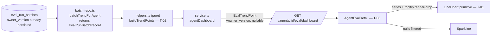

# Development Plan: Eval METRIC TREND chart — tooltip, version/cost axes, n/a fidelity

## Overview

Complete the `METRIC TREND` chart on the Eval Dashboard agent-detail page (`/eval/[agentId]`) so it
works as a **reading instrument** for "CI-as-trend": comparing two runs shows a jump, but only a
chart shows a trajectory. Today the chart renders three lines and nothing else — no tooltip, no
prompt version, no cost, and a `?? 0` coercion that renders an "n/a" metric as a fake cliff to the
floor. This plan adds a per-point tooltip carrying **prompt version + cost** (the two decision axes:
version answers "what did I change that moved the metric", cost answers "did I buy this recall at
double the price") plus the three metric values, threads `owner_version` through the trend contract,
restores the n/a invariant, and lands the terminal dot from design/06.

**Grilled 2026-07-17** (5 questions, all resolved — see R9/R10/R11 and Execution mode). The
load-bearing outcome: restoring the n/a invariant is not free. Removing the fake cliff opens two
paths where a *real* measurement renders as empty space instead — an isolated point between two
n/a's, and a single-point sparkline dividing by zero. Both are silent, so both are worse than the
bug being fixed; R11 closes them in the primitives before the nulls ever arrive.

## Execution mode

**Single-agent (sequential).** ✅ *Confirmed by the requester in grilling (2026-07-17).*

This change is small (3 tasks, ~10 files) and tightly coupled through one shared contract:
`EvalTrendPoint` is the hinge, and both the server producer and the client consumer sit on either
side of it. The DAG is a strict chain (T-01 → T-02 → T-03), so there is nothing to parallelize.
T-01 and T-02 touch disjoint files and *could* run concurrently — their dependency is about the
intermediate `typecheck` state, not a file conflict — but doing so would buy a few minutes at the
cost of the documented `vitest`-hang risk from parallel implementers on this machine
(`client/INSIGHTS.md` 2026-07-09). Rejected on that trade.

## Requirements

<!-- Restates only what the requester stated or confirmed. -->

- R1: The chart's tooltip surfaces **prompt version + cost per point**, so a reader can tie a metric
  movement to the version that caused it and the cost it was bought at.
- R2: `EvalTrendPoint` carries `owner_version`. The underlying batch row already has it
  (`EvalRunBatchRecord.owner_version`, `eval-ci.ts:72`); `service.ts:619-626` simply doesn't map it
  into the trend point.
- R3: The `?? 0` coercion at `service.ts:621-623` is removed and `EvalTrendPoint`'s metrics widen to
  nullable. Per the G2/G3 invariant (`eval-ci.ts:56-61`, `:133-141`), a null metric means "n/a"
  (zero denominator across the set) and must NEVER become `0` — a `0` renders as a fake cliff to the
  floor, the exact false-regression signal this feature exists to avoid. The line breaks at n/a
  points (`connectNulls={false}`) rather than diving.
- R4: Design fidelity to design/06 — a terminal dot on each series' **last point**
  (`LineChart.tsx:60` currently hardcodes `dot={false}`). Extended by R11 below: a dot also renders
  on **isolated** points. On a gap-free trend (design/06's own data) the two rules coincide and the
  result is pixel-identical to the mockup: exactly one dot per series, at the right edge.
- R5: The chart stays **only** on `/eval/[agentId]` (the drill-down). It is NOT added to the agent
  EvalsTab — `design/03-agent-editor-evals-tab.png` shows that tab intentionally has no chart
  (4 metric cards + "View full dashboard →" + Eval cases list only). Confirmed via the design.
- R6: The chart is a **reading instrument, not a gate**. The existing soft `alert` banner
  (`buildRegressionAlert`, `helpers.ts:89-104`) is deliberately non-blocking and stays that way. No
  thresholds, no gating, no blocking behavior is added.
- R7: The tooltip is **additive** to design/06 (a static mockup cannot show a hover state) — it does
  not contradict the design.
- R8: `LineChart` stays a generic shared UI primitive. No eval-specific tooltip content is hardcoded
  into it; eval formatting stays in `AgentEvalDetail`. `Showcase.tsx:205` must keep compiling.
- R9 *(grilling 2026-07-17)*: The tooltip shows **all three metric values** alongside version, cost,
  and `ran_at` — not version/cost alone. Rationale: the whole point of the tooltip is to kill the
  mapping task "which of these 5 X-positions is v7". A tooltip that names the version and price but
  forces the reader back to the RECENT RUNS table to read the value has not earned itself. Every
  value routes through `formatMetricPct` / `formatCost`, so an n/a renders "—", never "0%"/"$0.00".
- R10 *(grilling 2026-07-17)*: `pass_rate` widens to nullable in the same edit, for the same G2/G3
  reason — `service.ts:624`'s `b.total_count > 0 ? … : 0` reports a literal `0` ("0% pass") for a
  zero-case batch. It has *zero* consumers today (grep finds only the contract, `service.ts:624`,
  and a test fixture), so this is invariant hygiene, not a visible bug fix — accepted because
  leaving one field of a freshly-rewritten object non-nullable is a puzzle for the next reader.
  **Explicitly NOT in scope:** the identical fake-zero at `service.ts:574`
  (`EvalDashboardOverview.sparkline`). That is a different contract, a different screen, and has a
  live consumer (`EvalDashboardView.tsx:138`) — a separate change with its own risk.
- R11 *(grilling 2026-07-17)*: **No valid measurement may be rendered invisible.** Two distinct
  failure modes, both introduced or widened by R3's nullability, both silent (no error, just empty
  space) — which makes them strictly worse than the fake cliff R3 removes:
  1. **Isolated chart points.** `connectNulls={false}` (R3) + "dot on the last point only" (R4)
     means a non-null point whose neighbours are both null gets **no line segment** (nothing to
     connect to) and **no dot** (not last) → it vanishes. On `[0.8, null, 0.85, null, 0.9]` the
     chart would show one dot and empty space despite holding 3 real measurements. → A dot renders
     on any point that is non-null **and** (last-non-null **or** isolated).
  2. **Single-point sparklines.** `Sparkline.tsx:19` divides by `data.length - 1`; at length 1 that
     is `0/0 → NaN`, the path becomes `"MNaN,20"`, and the sparkline silently renders nothing.
     Reachable today (a 1-run agent — including on the Eval Dashboard landing page via
     `EvalDashboardView.tsx:138`), and R3's null-filtering widens it (5 runs, 4 n/a → length 1).
     → Guard inside the `Sparkline` primitive: at length 1, draw the dot and skip the line.

## Design references

| File | Shows |
| --- | --- |
| `specs/SPEC-2026-07-15-eval-pipeline/design/06-eval-dashboard-agent-detail.png` | Target screen: METRIC TREND chart (3 lines, Y 0.6–1.0), legend, terminal dots, RECENT RUNS table |
| `specs/SPEC-2026-07-15-eval-pipeline/design/03-agent-editor-evals-tab.png` | Agent EvalsTab — proves it has NO trend chart (grounds R5) |

Inherited by reference from the approved spec's own `design/` folder — **not duplicated** into this
plan. No new design assets arrived at planning time.

## Design audit

Region-by-region audit of design/06's chart card + runs table, at style level.

| Panel | Element | Design file | Requirement |
| --- | --- | --- | --- |
| METRIC TREND header | `TrendingUp` icon + "METRIC TREND" label, left-aligned | `design/06` | Already correct (`AgentEvalDetail.tsx:186-197`) |
| METRIC TREND header | Legend right-aligned: short **line-segment** swatches (not dots/squares) + "Recall"/"Precision"/"Citation" | `design/06` | **Already correct** — `styles.ts:87` is `{ width: 10, height: 2, borderRadius: 1 }`, i.e. a 10×2 line segment. The investigation's "verify legend swatch shape" concern is resolved: no work needed. |
| METRIC TREND header | Legend colors: blue / green / amber | `design/06` | Already correct (`METRIC_COLORS` = `--accent`/`--ok`/`--warn`) |
| Chart body | Y axis 0.6–1.0, one decimal, muted, no axis line | `design/06` | Already correct (`LineChart.tsx:45-52`, `yMin=0.6 yMax=1.0`) |
| Chart body | Horizontal-only gridlines, no vertical | `design/06` | Already correct (`LineChart.tsx:43`) |
| Chart body | X axis hidden (no tick labels) | `design/06` | Already correct (`LineChart.tsx:44`) |
| Chart body | **Filled terminal dot on each series' LAST point only** — no dots on intermediate points | `design/06` | **R4** → T-01 |
| Chart body | Line breaks / no dive at an n/a point | *not shown* (mockup has no n/a data) | **R3** → T-01 + T-02 + T-03 |
| Chart body | Dot on an **isolated** non-null point | *not shown* (mockup has no n/a data) | **R11.1** → T-01. Not a design conflict: with gap-free data the rule is unreachable and the card stays pixel-identical to design/06. |
| Chart body (hover) | — | *not shown — static mockup* | **R1/R7/R9**: tooltip is additive, no design conflict → T-03 |
| Metric tiles | Sparkline with a filled terminal dot, per tile | `design/06` | **Already correct** — `Sparkline.tsx:24-25` draws both the path and a terminal `<circle>`. **R11.2** only fixes the length-1 arity crash (invisible sparkline); multi-point rendering must stay byte-identical → T-01 (4b) |
| Metric tiles | Delta reads `↑ 0.04` / `↓ 0.02` (2-decimal) here, but `▲ 4pt` / `▼ 2pt` in `design/03` — **the two mockups contradict each other** | `design/06` vs `design/03` | Out of scope, and **the code is not wrong**: `formatDeltaPt` (`constants.ts:32-38`) renders `▲ 4pt`, deliberately following `design/03` and citing the spec's **C3** requirement (`"▲ 4pt" / "▼ 2pt"`) in its own docblock. Recorded only so T-03's screenshot diff against design/06 does not mistake this known mockup inconsistency for a regression introduced by this plan. Do **not** "fix" it. |
| RECENT RUNS | VERSION column in accent-blue (`v7`, `v6`…) | `design/06` | **Already correct** — `styles.ts:120` is `color: "var(--accent-text)"` = `#93bbfc` (`vendor/ui/styles.css:23`), an accent blue. No work needed; T-03's screenshot check re-confirms the shade. |
| RECENT RUNS | COST column, right-aligned, `$0.23` | `design/06` | Already correct (`AgentEvalDetail.tsx:325-327`, `formatCost`) |
| Agent EvalsTab | 4 metric cards + "View full dashboard →" + Eval cases list — **no chart** | `design/03` | **R5** — explicitly out of scope; no task touches EvalsTab |

**Orphan contracts:** `EvalTrendPoint` is the only `@devdigest/shared` schema this plan touches; T-02
owns it in both vendor copies. `pass_rate` is the one field with no implementation task — see
Recommendations (flagged for grilling, not silently resolved).

## Affected modules & contracts

- `client/src/vendor/ui/charts/` — `LineChart` primitive: nullable data, `connectNulls={false}`,
  terminal + isolated dots, optional `tooltip` render-prop. `Sparkline` primitive: length-1 arity
  guard (R11.2) — no signature change.
- `server/src/modules/eval/` — `helpers.ts` gains a pure `buildTrendPoints`; `service.ts:619-626`
  delegates to it (drops `?? 0`, maps `owner_version`).
- `client/src/app/eval/[agentId]/_components/AgentEvalDetail/` — passes nullable series, renders
  tooltip content, null-safe sparklines.
- Contracts: **`EvalTrendPoint`** (`eval-ci.ts:129-138`) — metrics widen to nullable, `owner_version`
  added. Applied to **BOTH** `server/src/vendor/shared/contracts/eval-ci.ts` and
  `client/src/vendor/shared/contracts/eval-ci.ts` in the **same task** (T-02).
- **No DB schema change, no migration.** Confirmed: `owner_version` is already persisted on
  `eval_run_batches` and already read back — `batchTrendForAgent` returns full
  `EvalRunBatchRecord[]` (`repository/batch.repo.ts:134-146`), and `buildRegressionAlert` already
  consumes `latest.owner_version` at `service.ts:633`. This is a mapping gap in `service.ts`, not a
  storage gap. Do **not** run `pnpm db:generate`.

## Architecture notes



- **Onion placement (server):** the mapping is pure transformation, so it belongs in
  `modules/eval/helpers.ts` — the module's established home for "aggregation math independently
  testable without a DB/LLM" (`helpers.ts:1-5`), alongside `aggregateBatch`/`buildRegressionAlert`.
  `service.ts` keeps orchestration only. This also buys a **hermetic** unit test: `helpers.test.ts`
  runs without Docker, whereas the only existing `agentDashboard` coverage is integration-level
  (`service.it.test.ts`) and there is no unit test for it. No new port/adapter; no repository change.
- **Keep `LineChart` generic (R8).** Add an optional `tooltip?: (index: number) => React.ReactNode`
  render-prop; the primitive owns *placement* (a recharts `<Tooltip content={…}>`), the caller owns
  *content*. Eval formatting (version, cost, metric labels) stays in `AgentEvalDetail`. `Showcase`
  omits the prop and keeps working.
- **Widening `ChartSeries.data` to `(number | null)[]` is backward compatible** — `number[]` is
  assignable to `(number | null)[]`, so `Showcase.tsx:205-211` compiles untouched. Confirmed by
  grep: `LineChart` has exactly two consumers, `Showcase.tsx:205` and `AgentEvalDetail.tsx:202`.
- **Nullable metrics ripple into the metric tiles' sparklines** — this is the non-obvious cost of
  R3. `AgentEvalDetail.tsx:166,171,180` does `trend.map((p) => p.recall)`, currently `number[]`,
  feeding `MetricTile`'s `trend: number[]` → `Sparkline`'s `data: number[]`
  (`vendor/ui/charts/Sparkline.tsx:10`). Once widened, this breaks `pnpm typecheck`. **Resolution:
  filter nulls out at the `AgentEvalDetail` call site** (`.filter((v): v is number => v != null)`),
  do **not** change `Sparkline`'s signature and do **not** re-introduce `?? 0`. Rationale: a
  sparkline is a 64×22px glanceable with no axis — dropping an n/a point is honest there, whereas a
  `0` would draw the same fake cliff R3 exists to kill. The full-size chart, which *does* have an
  axis and a tooltip, is where n/a is represented properly (as a gap).
- **…but that filter is exactly what makes R11.2 mandatory.** Filtering can reduce a series to a
  single point (5 runs, 4 n/a), and `Sparkline` divides by `data.length - 1` (`Sparkline.tsx:19`) —
  `0/0 → NaN` at length 1, so the sparkline silently renders nothing. The filter is still the right
  call, but it is only safe once T-01 has guarded the primitive's arity. This is why R11.2 lands in
  T-01 (the primitive, fixing all three consumers including the already-broken 1-run agent on the
  Eval Dashboard landing page) rather than as a second arity check at T-03's call site.
- **Reuse existing formatters, don't duplicate:** `formatCost`
  (`AgentEvalDetail/constants.ts:54-56` — renders `null` as "—", never "$0.00", since unknown ≠
  free) and `formatMetricPct` (`EvalDashboardView/constants.ts:15-18` — renders `null` as "—",
  never "0%"). Both already encode the n/a invariant this plan is restoring; the tooltip must route
  every value through them.
- **i18n:** `AgentEvalDetail` hardcodes its display strings ("METRIC TREND", "RECENT RUNS", legend
  labels) rather than using `messages/en/eval.json` — a deliberate carry-over documented in
  `client/INSIGHTS.md` (2026-07-15: `eval.json` is unowned by any task). The tooltip follows the
  same local convention; do **not** add keys to `eval.json`.

## INSIGHTS summary

- [client]: `src/vendor/shared/` is a **manual copy** of `server/src/vendor/shared/` — not a symlink
  or a package; contract changes must hit both copies simultaneously (2026-06-20). This is a
  documented repeat offender — T-02 owns both copies so they cannot drift.
- [client]: A parallel implementer mid-write on a sibling file can make even a scoped `vitest run`
  hang with zero output; on a loaded machine `vitest` can hang at the `RUN v…` banner while `tsc`
  stays fast — that asymmetry is the signal it's machine contention, not your regression
  (2026-07-09). Don't retry-loop; single-agent mode largely sidesteps this.
- [client]: **NEVER** `pnpm test -- <filter>` in `client/` — pnpm forwards a literal `"--"` into
  `vitest run`, which does not filter and instead runs everything / hangs, leaving orphaned
  `tinypool` workers. Use `pnpm exec vitest run <path>` (CLAUDE.md + 2026-07-09).
- [client]: Design fidelity on this codebase has repeatedly turned on style-level details invisible
  when reading a style object (rounded vs. square caps, `--text-secondary` vs `--text-muted`,
  ghost vs. secondary buttons) — several were only caught by pixel-sampling a live screenshot
  against the design PNG, not by eyeballing (2026-07-11 ×4). Hence the screenshot check on T-01/T-03.
- [server]: Pure aggregation math lives in `modules/eval/helpers.ts` specifically so the G1–G3
  "0/0 → null, excluded from aggregate" policy is testable without a DB or LLM (`helpers.ts:1-5`).

## Phased tasks

> Each phase reaches a self-consistent, mergeable state on its own.
> **Phase ordering is load-bearing:** the UI primitive (T-01) widens to `(number | null)[]` *before*
> the contract (T-02) starts emitting nulls. Reversing T-01/T-02 would leave the client failing
> `typecheck` between phases, or force a temporary `?? 0` at the call site — re-introducing the exact
> fake-zero bug R3 exists to remove.
> Single-agent mode: execute top-to-bottom. Owned paths document scope, not concurrency.

### Phase 1 — Chart primitives (nullable-capable, design/06 dots, tooltip hook, no-vanish guards)

#### T-01: Widen `LineChart` + guard `Sparkline` — nullable data, gap on null, dots, tooltip render-prop

- **Action:** In `client/src/vendor/ui/charts/LineChart.tsx`:
  1. Widen `ChartSeries.data` from `number[]` to `(number | null)[]` (line 15).
  2. Change the row builder (lines 31-38) from `row[s.name] = s.data[i] ?? 0` to
     `s.data[i] ?? null`, and the row type from `Record<string, number>` to
     `Record<string, number | null>`.
  3. Add `connectNulls={false}` explicitly to each `<Line>` (lines 53-63) so an n/a point renders as
     a **gap**, never a dive to the floor.
  4. Replace `dot={false}` (line 60) with a per-point dot renderer that draws a filled circle
     (radius ~3, `fill` = the series' `stroke` color) on a point that is non-null **and** either
     (a) the series' **last non-null point** (R4, design/06) or (b) **isolated** — i.e. both
     neighbours are null/absent (**R11.1**). Every other point draws nothing. Note recharts calls
     the dot renderer per point and expects an element back — return an empty
     `<g />`/`<React.Fragment />` (with a `key`) rather than `null`, to avoid a render warning.
     On a gap-free series these two rules collapse to exactly one dot at the right edge, matching
     design/06 pixel-for-pixel — the isolated-point rule is unreachable without n/a data.
  4b. In `client/src/vendor/ui/charts/Sparkline.tsx`, guard the `data.length === 1` case
     (**R11.2**): `Sparkline.tsx:19` computes `(i / (data.length - 1)) * w`, which is `0/0 → NaN`
     at length 1, producing the invalid path `"MNaN,20"` and a `<circle cx={NaN}>` — the whole
     sparkline silently disappears. Render just the terminal dot (skip the `<path>`) when there is
     only one point; place it at a sensible x (e.g. `w`, the right edge, consistent with "latest
     value sits at the right"). The existing `if (!data.length) return null` (line 15) already
     covers length 0. Do **not** change `Sparkline`'s `data: number[]` signature — nulls are
     filtered by the caller in T-03, this guard is only about arity.
  5. Add an optional prop `tooltip?: (index: number) => React.ReactNode`. When supplied, render
     recharts' `<Tooltip content={…} />` (import it — the file currently never imports `Tooltip`),
     resolving the hovered point index from `payload[0].payload.i` (the row's own `i` field) rather
     than from `label` — `<XAxis dataKey="i" hide />` (line 44) makes `label` less reliable. When the
     prop is omitted, render no `<Tooltip>` at all, so `Showcase` is unchanged. Also add
     `activeDot` on each `<Line>` so a hovered point has a visible target (the current `dot={false}`
     leaves nothing to aim at); the tooltip itself triggers off the chart cursor, not the dots.
  6. Do **not** hardcode any eval-specific content, label, or format here (R8).
- **Why:** Satisfies R4 (design/06's dot), R11.1 + R11.2 (no valid measurement renders invisible),
  the primitive half of R3 (a gap, not a dive), and R8 (generic render-prop). Sequenced first so the
  contract can start emitting nulls in T-02 without ever breaking `typecheck` or needing a temporary
  `?? 0`.
- **Module:** client
- **Type:** ui
- **Design ref:** `specs/SPEC-2026-07-15-eval-pipeline/design/06-eval-dashboard-agent-detail.png` —
  the METRIC TREND chart body: one filled dot per series at the rightmost point, no dots on
  intermediate points. Also the three metric tiles' sparklines, each of which already shows its own
  terminal dot (`Sparkline.tsx:25` — already correct; 4b only fixes the length-1 arity crash, and
  must not change the rendered look of any multi-point sparkline).
- **Skills to use:** `react-frontend-architecture`, `react-best-practices`, `typescript-expert`
- **Owned paths:** `client/src/vendor/ui/charts/LineChart.tsx`,
  `client/src/vendor/ui/charts/Sparkline.tsx`
- **Depends-on:** none
- **Risk:** medium — two shared primitives; `LineChart` has a second consumer (`Showcase.tsx:205`)
  and `Sparkline` has three (`Showcase.tsx:203`, `EvalDashboardView.tsx:138`,
  `AgentEvalDetail.tsx:281`), none of them in your Owned paths.
- **Known gotchas:**
  - `LineChart` has exactly two consumers: `client/src/components/showcase/Showcase.tsx:205` and
    `client/src/app/eval/[agentId]/_components/AgentEvalDetail/AgentEvalDetail.tsx:202`. **Neither
    is in your Owned paths** — the signature change must be backward compatible so both keep
    compiling untouched. Widening `data` to `(number | null)[]` and making `tooltip` optional
    achieves this (`number[]` is assignable to `(number | null)[]`).
  - `Sparkline` has three consumers (`Showcase.tsx:203`, `EvalDashboardView.tsx:138`,
    `AgentEvalDetail.tsx:281`), **none in your Owned paths**. 4b is a pure behavior guard on an
    input arity that renders nothing today — it must not alter output for `data.length >= 2`, and
    must not change the component's signature. `EvalDashboardView.tsx:138` is the reason this is
    worth doing in the primitive rather than at T-03's call site: it renders `agent.sparkline` for
    every agent on the Eval Dashboard landing page, so a 1-run agent is silently blank there today.
  - Do **not** attempt an RTL/jsdom test that asserts rendered chart internals: `ResponsiveContainer`
    (line 41) measures `offsetWidth`, which is `0` in jsdom, so recharts renders nothing. This is
    why the existing `AgentEvalDetail.test.tsx:196-203` only asserts the "METRIC TREND" label and
    legend text. If you want a test, mock `ResponsiveContainer` to a fixed-size `div` — otherwise
    rely on `typecheck` + the live screenshot below.
- **Acceptance:** `cd client && pnpm typecheck` passes (proves `Showcase`, `EvalDashboardView` and
  `AgentEvalDetail` all still compile against the new signatures); **and** a self-taken screenshot of
  `/eval/<agentId>`'s METRIC TREND card visually matches
  `specs/SPEC-2026-07-15-eval-pipeline/design/06-eval-dashboard-agent-detail.png` element by
  element — exactly one filled dot per series at the rightmost point, no dots on intermediate
  points, dot color matching its line, and the existing lines/grid/Y-axis unchanged; **and** a
  hermetic unit test for `Sparkline` (`client/src/vendor/ui/charts/Sparkline.test.tsx`, NEW —
  inside your Owned directory) proves R11.2: `data={[0.82]}` renders a `<circle>` whose `cx`/`cy`
  are finite numbers (assert `Number.isNaN` is false — the current code yields `cx="NaN"`) and no
  `<path d>` containing the literal `NaN`, while `data={[0.7, 0.8]}` still renders both a path and
  a terminal circle. `Sparkline` is hand-rolled inline SVG with **no** `ResponsiveContainer`
  (`Sparkline.tsx:23`), so unlike `LineChart` it renders fine under jsdom and is directly testable.
  R11.1's isolated-dot rule is **not** unit-testable for the same `offsetWidth: 0` reason that
  blocks every `LineChart` assertion — verify it instead by temporarily feeding the chart a
  gap-containing series (e.g. `[0.8, null, 0.85, null, 0.9]`) in the browser and confirming by
  screenshot that all three real points are visibly marked, then revert the temporary data.

### Phase 2 — Contract + server producer (`owner_version`, n/a invariant)

#### T-02: Add `owner_version` to `EvalTrendPoint`, widen metrics to nullable, drop `?? 0`

- **Action:**
  1. In **BOTH** `server/src/vendor/shared/contracts/eval-ci.ts` **and**
     `client/src/vendor/shared/contracts/eval-ci.ts` (identical edit, same task — see gotchas), change
     `EvalTrendPoint` (lines 129-138) to: add `owner_version: z.number().int()`, and widen `recall`,
     `precision`, `citation_accuracy` from `z.number()` to `z.number().nullable()`. Extend the
     doc-comment to state the G2/G3 rule (null = "n/a", never coerced to 0) the way
     `EvalRunBatchRecord`'s comment already does at lines 63-68. Leave `ran_at` and `cost_usd`
     alone — `cost_usd` is already `z.number().nullable()` and already reaches the client.
     **`pass_rate` also widens to `z.number().nullable()`** (**R10**, confirmed in grilling).
  2. Add a pure exported `buildTrendPoints(batches: EvalRunBatchRecord[]): EvalTrendPoint[]` to
     `server/src/modules/eval/helpers.ts`, mapping each batch → `{ ran_at, owner_version, recall,
     precision, citation_accuracy, pass_rate, cost_usd }` **passing the metrics through verbatim
     (`b.recall`, not `b.recall ?? 0`)**. `pass_rate` becomes
     `b.total_count > 0 ? b.pass_count / b.total_count : null` — `null`, not `0` (**R10**).
     Do **NOT** touch the structurally identical expression at `service.ts:574`
     (`EvalDashboardOverview.sparkline`) — explicitly out of scope per R10; it is a different
     contract with a live consumer.
  3. Rewrite `server/src/modules/eval/service.ts:619-626` to `const trendPoints = buildTrendPoints(trend);`
     — deleting the three `?? 0` coercions. Leave everything else in `agentDashboard` untouched:
     `current`/`delta` (lines 597-617) already handle null correctly, and the `alert` call
     (lines 630-636) must keep its current soft, non-blocking behavior (**R6** — do not add any
     threshold or gate).
  4. Add unit coverage in `server/src/modules/eval/helpers.test.ts`: a batch with
     `recall: null` maps to `recall: null` (**not** `0`); a batch with `total_count: 0` maps to
     `pass_rate: null` (**not** `0`) (**R10**); and `owner_version` is carried through.
- **Why:** Satisfies R2 (version is the "what did I change" axis the tooltip needs) and the
  server half of R3. `service.ts:619` is the single point where the n/a invariant is currently
  destroyed, and `owner_version` is dropped despite already being on the batch row.
- **Module:** server (+ the client's vendored contract copy)
- **Type:** backend
- **Skills to use:** `onion-architecture-node`, `zod`, `typescript-expert`
- **Owned paths:** `server/src/vendor/shared/contracts/eval-ci.ts`,
  `client/src/vendor/shared/contracts/eval-ci.ts`, `server/src/modules/eval/helpers.ts`,
  `server/src/modules/eval/helpers.test.ts`, `server/src/modules/eval/service.ts`
- **Depends-on:** T-01 (the client's `LineChart` must already accept `(number | null)[]` before the
  contract starts emitting nulls, or `cd client && pnpm typecheck` breaks between phases)
- **Risk:** medium
- **Known gotchas:**
  - **`client/src/vendor/shared/` is a MANUAL COPY of `server/src/vendor/shared/`** — not a symlink,
    not a published package (`client/CLAUDE.md` "Do-not-touch"; `client/INSIGHTS.md` 2026-06-20).
    Both copies are in this one task's Owned paths precisely so they cannot drift. Verify the two
    `EvalTrendPoint` blocks are byte-identical before finishing. Both files currently define it at
    lines 129-138.
  - **No DB schema change, no migration.** `owner_version` is already persisted and already returned
    by `batchTrendForAgent` (`repository/batch.repo.ts:134-146`) as part of the full
    `EvalRunBatchRecord`; `buildRegressionAlert` already reads `latest.owner_version`
    (`service.ts:633`). Do **not** run `pnpm db:generate` / `pnpm db:migrate` — nothing to generate.
  - Put the mapping in `helpers.ts`, not inline in `service.ts` — that file exists so this math is
    testable without Docker (`helpers.ts:1-5`), and it's the only way this task gets a hermetic
    acceptance command. The existing `agentDashboard` coverage is integration-only
    (`service.it.test.ts`, requires Docker) and has no trend assertions at all.
  - Widening the metrics is **safe for existing server callers**: `current`/`delta`
    (`service.ts:597-617`) read from `trend` (the raw `EvalRunBatchRecord[]`), not from
    `trendPoints`, and already treat every metric as nullable.
- **Acceptance:** `cd server && pnpm exec vitest run src/modules/eval/helpers.test.ts` passes
  (hermetic — no Docker), including new cases proving a `null` batch metric maps to `null` and never
  `0`, that a `total_count: 0` batch maps to `pass_rate: null` and never `0` (R10), and that
  `owner_version` is carried onto the trend point; **and** `cd server && pnpm typecheck` **and**
  `cd client && pnpm typecheck` both pass (the contract lives in both vendor copies — a
  server-only typecheck cannot prove the copies agree); **and** a grep of
  `server/src/modules/eval/service.ts` for `?? 0` returns no hit inside `agentDashboard`'s trend
  mapping; **and** `service.ts:574`'s overview-sparkline expression is confirmed **unchanged**
  (R10's explicit non-goal).

### Phase 3 — Consume: tooltip content, null-safe tiles

#### T-03: Render the version+cost+metrics tooltip and pass nullable series through `AgentEvalDetail`

- **Action:** In `client/src/app/eval/[agentId]/_components/AgentEvalDetail/`:
  1. `AgentEvalDetail.tsx:202-208` — pass the metric arrays straight through
     (`trend.map((p) => p.recall)`, now `(number | null)[]`) with **no** `?? 0`, and supply the new
     `tooltip={…}` render-prop.
  2. Tooltip content (**R1** + **R9**): for the hovered index, show the point's `ran_at` (via the
     existing `formatRunTimestamp`), its **prompt version** (`v{owner_version}`, styled like the
     RECENT RUNS VERSION column — `s.runVersion`, `var(--accent-text)`), its **cost** (via the
     existing `formatCost`), and **all three metric values** (via the existing `formatMetricPct`),
     each on its own row prefixed by that series' `METRIC_COLORS` swatch so the row a reader is
     hovering is identifiable. Confirmed layout from grilling:

     ```text
     2026-05-29 09:14
     v7                $0.23
     ──────────────────────
     ● Recall           82%
     ● Precision        91%
     ● Citation         95%
     ```

     Build the tooltip's content as a small exported pure function/component (e.g. `TrendTooltip` in
     this folder) so it is unit-testable **without** rendering recharts — see gotchas. Add its
     styles to the local `styles.ts` — card surface `var(--bg-elevated)`, `1px solid var(--border)`,
     `borderRadius: 9`, matching `s.chartCard`.
  3. `AgentEvalDetail.tsx:161-183` — keep `MetricTile`'s `trend: number[]` signature and filter at
     the call site: `trend.map((p) => p.recall).filter((v): v is number => v != null)`. Do **not**
     substitute `0` for null. `Sparkline` itself is T-01's file, already guarded against the
     length-1 case this filter can now produce (**R11.2**) — rely on that guard; do **not** add a
     second arity check here, and do **not** edit `Sparkline`.
  4. `AgentEvalDetail.test.tsx` — add `owner_version` to the two `DASHBOARD.trend` fixtures
     (lines 79-80; use `7` and `6` to match the existing `BATCHES` fixtures) so they satisfy the
     widened contract, and add coverage for the tooltip content function: a point with
     `cost_usd: 0.23` and `owner_version: 7` renders "v7" and "$0.23"; a point with a `null` metric
     renders "—" and never "0%"; a `null` cost renders "—" and never "$0.00"; and all three metric
     rows render (**R9**).
  5. Do **not** touch the agent EvalsTab (**R5**) or the `alert` banner (**R6**).
- **Why:** Satisfies R1 — version and cost are the two decision axes; without them the chart shows
  WHAT happened but not WHY or at what cost. Also completes R3 end-to-end: this is the task where
  an n/a point finally renders as a gap rather than a fake cliff.
- **Module:** client
- **Type:** ui
- **Design ref:** `specs/SPEC-2026-07-15-eval-pipeline/design/06-eval-dashboard-agent-detail.png` —
  the METRIC TREND card (chart body + legend) and the RECENT RUNS VERSION/COST columns, whose
  accent-blue version treatment and `$0.00` cost format the tooltip mirrors. The tooltip itself is
  **additive** (R7): the mockup is static and cannot show a hover state, so no tooltip element in
  design/06 contradicts it. Everything else in the card must remain pixel-identical to design/06.
- **Skills to use:** `react-frontend-architecture`, `react-best-practices`, `react-testing-library`,
  `typescript-expert`
- **Owned paths:** `client/src/app/eval/[agentId]/_components/AgentEvalDetail/AgentEvalDetail.tsx`,
  `client/src/app/eval/[agentId]/_components/AgentEvalDetail/AgentEvalDetail.test.tsx`,
  `client/src/app/eval/[agentId]/_components/AgentEvalDetail/styles.ts`,
  `client/src/app/eval/[agentId]/_components/AgentEvalDetail/constants.ts`
- **Depends-on:** T-01 (needs the `tooltip` render-prop + nullable `ChartSeries.data`), T-02 (needs
  `owner_version` on `EvalTrendPoint`)
- **Risk:** medium
- **Known gotchas:**
  - **Do not assert tooltip content by rendering the chart in jsdom.** `ResponsiveContainer`
    measures `offsetWidth` = `0` under jsdom, so recharts renders no chart and no tooltip — this is
    exactly why the existing test at `AgentEvalDetail.test.tsx:196-203` only asserts the label and
    legend text. Test the extracted pure tooltip component/function directly with props instead.
  - **Scope the test run as `pnpm exec vitest run src/app/eval`** — do **not** pass the literal path
    `src/app/eval/[agentId]/...`: vitest treats the filter as a regex, so `[agentId]` is parsed as a
    character class and silently matches nothing. And never `pnpm test -- <filter>` (CLAUDE.md —
    pnpm forwards a literal `"--"`, which does not filter and leaves orphaned workers).
  - Reuse, don't duplicate: `formatCost` (`./constants.ts:54-56`), and `formatMetricPct` +
    `formatRunTimestamp` + `METRIC_COLORS` (already imported at `AgentEvalDetail.tsx:29` from
    `../../../_components/EvalDashboardView/constants`). All three already render `null` as "—";
    that is the invariant, not a nicety.
  - Hardcode the tooltip's literal strings in this folder — do **not** add keys to
    `client/messages/en/eval.json`, which is unowned and which this component already bypasses
    (`client/INSIGHTS.md` 2026-07-15).
  - `filterByDateRange` (`./constants.ts:16-24`) is generic over `{ ran_at: string }` and needs no
    change for the widened point.
- **Acceptance:** `cd client && pnpm exec vitest run src/app/eval` passes, including new cases
  proving the tooltip content renders `v7`, `$0.23` and all three metric rows (R9) for a point with
  `owner_version: 7` / `cost_usd: 0.23`, and renders "—" (never "0%" / "$0.00") for a null metric
  and a null cost; **and** `cd client && pnpm typecheck` passes; **and** a self-taken screenshot of
  `/eval/<agentId>` visually matches
  `specs/SPEC-2026-07-15-eval-pipeline/design/06-eval-dashboard-agent-detail.png` element by element
  (legend line-swatches, terminal dots, Y-axis 0.6–1.0, RECENT RUNS VERSION in accent-blue), plus a
  second screenshot with the cursor over a chart point showing the tooltip with version, cost and
  all three metrics.

## Testing strategy

- Unit (server, hermetic — no Docker): `cd server && pnpm exec vitest run src/modules/eval/helpers.test.ts`
- Unit (server, full): `cd server && pnpm exec vitest run --exclude '**/*.it.test.ts'`
- Integration (server, requires Docker): `cd server && pnpm exec vitest run .it.test`
- UI: `cd client && pnpm exec vitest run src/app/eval` (scoped) — then `cd client && pnpm test && pnpm typecheck`
  for the full pass. **Never** `pnpm test -- <filter>`.
- E2E: not applicable — no route, endpoint, or flow change; `e2e/` is untouched.

## Risks & mitigations

- **`LineChart` is shared; `Showcase.tsx:205` is not in any task's Owned paths** — a non-backward-compatible
  signature change breaks it silently at build time. → T-01 only *widens* (`number[]` stays
  assignable) and makes `tooltip` optional; `cd client && pnpm typecheck` is T-01's binary gate and
  covers both consumers.
- **Contract drift between the two manual `eval-ci.ts` copies** — the documented repeat offender in
  `client/INSIGHTS.md`. → Both copies are in T-02's Owned paths; the task cannot be split across
  agents, and its acceptance includes a both-sides typecheck.
- **Phase-ordering inversion re-introduces the bug being fixed** — if T-02 lands before T-01, the
  client won't compile against nullable series, and the tempting fix is a `?? 0` at the call site:
  the exact fake-cliff R3 removes. → The dependency is explicit (T-02 `Depends-on: T-01`) and the
  rationale is stated in the Phase-ordering note.
- **recharts renders nothing under jsdom** (`ResponsiveContainer` → `offsetWidth: 0`), so the
  tooltip cannot be verified by a naive RTL hover test — a test could pass while the tooltip never
  renders in a browser. → Test the extracted pure tooltip component directly, and make a live
  screenshot part of T-03's acceptance rather than trusting the suite.
- **Terminal dot on a series whose last point is n/a** — design/06 shows the dot on the *last* point,
  but a `null` last value has no coordinate to draw at. → T-01 specifies "last **non-null** point",
  which degrades correctly and keeps the line's end marked.
- **The plan's own n/a handling can make real data vanish** (**R11**) — the sharpest risk here, and
  the reason two of grilling's five questions were spent on it. R3 exists to stop `?? 0` lying about
  n/a; but `connectNulls={false}` + last-point-only dots erases *isolated* real points, and
  null-filtering + `Sparkline`'s `length - 1` divisor erases *single-point* sparklines. Both fail
  **silently** — empty space, no error — which is strictly harder to notice than the fake cliff being
  removed. → R11.1 (dot on isolated points) + R11.2 (arity guard in the primitive), both landed in
  T-01 ahead of the nulls arriving in T-02, each with its own acceptance evidence.
- **`Sparkline` is shared by three consumers and none are in T-01's Owned paths** — R11.2 touches a
  primitive that also renders on the Eval Dashboard landing page and the Showcase. → The guard only
  affects `data.length === 1`, an arity that renders *nothing* today, so no existing visual can
  regress; `pnpm typecheck` plus a length-2 assertion in `Sparkline.test.tsx` pin this.

## Red-flags check

- [x] Execution mode is stated **and confirmed** by the requester in grilling (single-agent
      sequential, 2026-07-17).
- [x] Every line in Requirements traces to the requester's brief (R1/R6 goal, R2/R3/R4 verified
      findings, R5/R7 stated scope decisions, R8 stated hard constraint) or to a grilling decision
      the requester made explicitly (R9/R10/R11, 2026-07-17) — nothing originated here unasked.
- [x] The `## Recommendations` section has been **removed, not ignored** — both of its items were
      put to the requester in grilling and accepted, becoming R9 (metrics in tooltip) and R10
      (`pass_rate`); R11 was raised during grilling and accepted. Nothing advisory is left open, so
      no task depends on an unconfirmed default.
- [x] Global constraints have no internal contradictions (Requirements + Architecture notes scanned:
      R3's nullability vs. `Sparkline`'s `number[]` was the one latent conflict — resolved
      explicitly in Architecture notes via call-site filtering, not by re-adding `?? 0`).
- [x] Every requirement maps to a task: R1→T-03, R2→T-02, R3→T-01+T-02+T-03, R4→T-01, R5→no task
      (explicit non-goal, design/03), R6→no task (explicit non-goal, `alert` untouched), R7→T-03,
      R8→T-01, R9→T-03, R10→T-02, R11.1→T-01 (step 4), R11.2→T-01 (step 4b).
- [x] Dependencies form a DAG (T-01 → T-02 → T-03; no cycles).
- [x] Concurrent tasks have non-overlapping Owned paths and parent directories (single-agent
      sequential; and no two tasks share a file even so — T-01 `vendor/ui/charts/`, T-02
      `vendor/shared/contracts/` + `modules/eval/`, T-03 `app/eval/[agentId]/_components/`).
- [x] No phase has more than ~7 concurrent tasks (max 1 per phase).
- [x] No task is split by activity type — each task carries its own tests (T-02 owns
      `helpers.test.ts`; T-03 owns `AgentEvalDetail.test.tsx`).
- [x] Every file path cited was verified with `Read`/`Grep`/`Glob`; the only `(NEW FILE)` paths are
      `client/src/vendor/ui/charts/Sparkline.test.tsx` (T-01, inside its own Owned directory) and
      the `TrendTooltip` extraction inside T-03's already-owned folder.
- [x] Every task description names exact file paths and line numbers.
- [x] Every task is self-contained (contract ref, owned paths, gotchas, acceptance — no "see above").
- [x] Every Acceptance has a runnable, binary command.
- [x] Each phase produces a self-consistent, mergeable state (T-01 backward-compatible + ships R4's
      dot; T-02 contract+producer with both vendor copies in one task; T-03 consumes).
- [x] Shared contract changes assign both vendor copies to the **same** task (T-02).
- [x] Schema changes: **none** — verified `owner_version` is already persisted and already read back
      (`repository/batch.repo.ts:134-146`, `service.ts:633`); no `db:generate`/`db:migrate`.
- [x] Integration edge-cases explicit: the n/a/null path is a first-class assertion in both T-02's
      and T-03's acceptance, not hidden inside implementation.
- [x] UI tasks: design audit completed at style level; every element in design/06's chart card and
      runs table maps to a requirement, to "already correct" **with cited evidence**, or to a flagged
      gap. Two claimed gaps (legend swatch shape, VERSION color) were checked against
      `styles.ts:87`/`styles.ts:120` + `vendor/ui/styles.css:23` and found already satisfied — no
      make-work task invented. No gap resolved by keeping old behavior over the design.
- [x] Design assets: inherited by reference from the approved spec's `design/` folder (not
      duplicated); `## Design references` lists both files; every Design audit row and both UI tasks
      carry a `Design ref:` to an exact file.
- [x] Orphan contracts: `EvalTrendPoint` is owned by T-02, and after R10 **every** field of it is
      addressed — no orphans remain. `EvalDashboardOverview.sparkline`'s structurally identical
      fake-zero (`service.ts:574`) is a consciously-scoped-out non-goal, recorded in R10.
