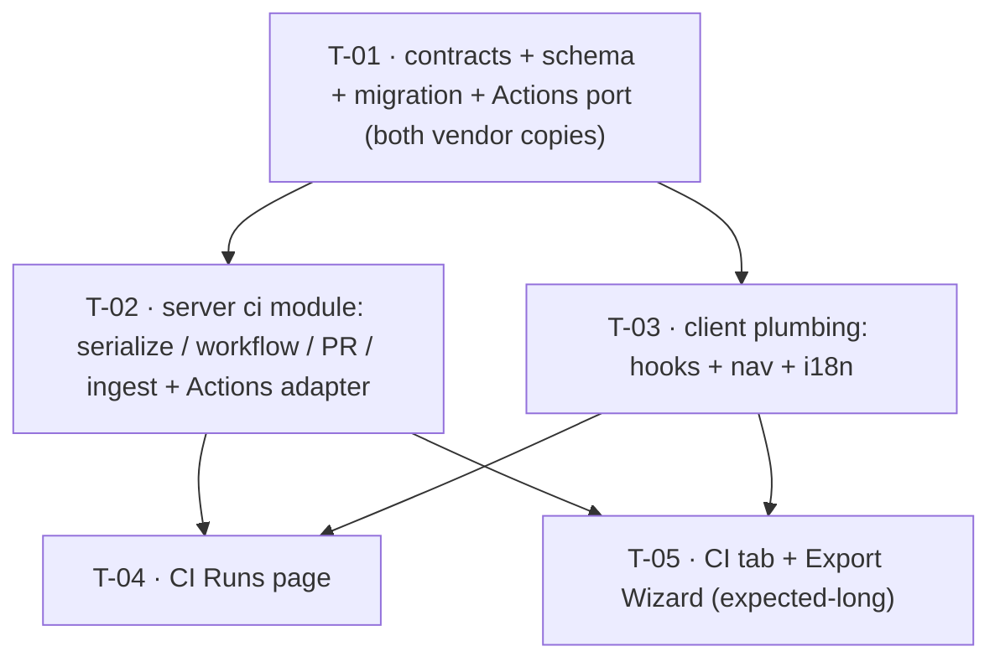

# Development Plan: Export to CI (worktree B, L07)

## Overview
Add the **Export to CI** path: a 4-step wizard on an agent's new CI tab that serializes the agent
to a byte-identical `AgentManifest` YAML, generates a self-contained, least-privilege GitHub Actions
workflow (bundling the already-built `agent-runner`), opens a reviewable PR on a `devdigest/ci`
branch, and pulls the runner's result artifact back into a global **CI Runs** page and the per-agent
**CI tab**. The manifest is validated by the *same* Zod contract the runner reads, so the studio and
CI agent can never silently diverge. Source of truth: the approved spec
`specs/SPEC-2026-07-19-export-to-ci/SPEC-2026-07-19-export-to-ci.md` (AC-1…AC-47).

## Execution mode
**Multi-agent (parallel implementers, strict Owned-path partitioning).** Confirmed by the requester's
hard constraint: the build stage must fit in **≤5 implementer agents total**. The change spans two
packages and several disjoint surfaces (schema/contracts, server module, client plumbing, two client
UI surfaces), so it partitions cleanly into 5 tasks across 3 phases with non-overlapping Owned paths
and a clean DAG (foundational contracts/schema → parallel server + client-plumbing → parallel
CI-runs page + CI-tab/wizard). This is exactly 5 dispatches — at the cap, not over it.

## Requirements
<!-- Restated from the approved spec's Decisions + EARS acceptance criteria (AC-1…AC-47) and the
     requester's build/reuse scope for worktree B. Every line traces to the spec or the requester's
     confirmed scope message. -->
- R1 (AC-1…AC-12, AC-43, AC-45, AC-47): A 4-step Export Wizard (Target → Preview → Configure →
  Install) on the agent CI tab, with GitHub Actions selected by default, the other 3 target cards
  visible-but-disabled, editable workflow preview, trigger chips, expected-secrets list, post-as
  radios, corrected block-merge callout, regenerate-on-configure warning, and Install via open-PR or
  zip.
- R2 (AC-13…AC-19, AC-44, AC-46): Server serializes the agent → `.devdigest/agents/<slug>.yaml`
  (`AgentManifest`), one `.devdigest/skills/<slug>.md` per linked skill, `.devdigest/memory.jsonl`,
  the prebuilt `.devdigest/runner/index.js` ncc bundle, and `.github/workflows/devdigest-review.yml`;
  commits them to a `devdigest/ci` branch and opens/refreshes a single PR against `base`; upserts one
  `ci_installations` row per (agent, repo); rejects an invalid `owner/name` repo.
- R3 (AC-31…AC-36): The generated workflow is least-privilege and fork-safe by construction —
  `permissions:` exactly `contents: read` + `pull-requests: write`, `OPENROUTER_API_KEY` from Actions
  secrets only, no secret literals in workflow or manifest, `pull_request` triggers only (never
  `pull_request_target`), no comment-triggered runs; the CI review path treats PR text as untrusted
  under `INJECTION_GUARD`.
- R4 (AC-29, AC-30, AC-37, AC-38): Pull-based ingest — the studio polls the GitHub Actions API per
  installed repo, downloads `devdigest-result.json`, `safeParse`s it against `CiResultArtifact`, and
  persists a `ci_runs` row (agent, findings_count, per-severity counts, cost, duration, pr_number,
  source, linked installation); a failed job with no artifact still records a `status='failed'` row
  from job metadata; the workflow never posts back to the studio.
- R5 (AC-23…AC-28, AC-39, AC-40): A global **CI Runs** page — title/subtitle, table (timestamp, PR,
  agent, source, duration, findings-by-severity, cost, status, Trace), per-severity finding icons,
  "—" for failed/empty, status pills, Trace → `github_url`, a Source filter, and ~15s auto-refresh
  (ingesting on each poll) plus a manual Refresh.
- R6 (AC-20, AC-21, AC-22, AC-41, AC-42): The per-agent **CI tab** — "CI deployment · Active in N
  repos" header, Update CI config + Add to CI actions, one row per installation (repo + target badge
  + latest-run status pill + relative time), an Add-repository affordance, a per-agent "Fail CI on"
  selector persisting to `agents.ciFailOn`, and the agent's `version` surfaced at export time.
- R7 (spec Decisions): Additive-only contract change — `CiRun` gains optional
  `critical?`/`warning?`/`suggestion?` per-severity counts (synced both vendor copies), backed by new
  nullable int columns on `ci_runs` via a new migration. No other `@devdigest/shared` contract
  changes.
- R8 (requester scope): Reuse — do not rebuild — the existing `GitHubClient` port /
  `OctokitGitHubClient` (`commitFiles`/`openPullRequest`/`findOpenPr`), obtained via
  `container.github()` with the PAT from `SecretsProvider.get('GITHUB_TOKEN')`; the fixed
  `agent-runner/` package (embed its prebuilt ncc bundle, do not modify its source); and the
  pre-authored `ci.json` i18n keys.

## Recommendations — RESOLVED (grilling, 2026-07-19)
<!-- All three were interviewed and decided by the requester; folded into the tasks below.
     Kept here as the decision record. -->
- **REC-1 — Preview side-effect → RESOLVED: `action=files` is side-effect-free.** It generates and
  returns `CiFile[]` only — no `ci_installations` write, no GitHub call. Only `action=open_pr`
  persists/upserts the installation and opens the PR, so previewing/regenerating never creates a
  premature "installed" row. (Drives T-02 route logic and T-05 Preview fetch.)
- **REC-2 — PR title column → RESOLVED: add an additive `pr_title?` field to `CiRun`.** The sanctioned
  additive contract exception (previously the 3 severity counts) is **extended to also include
  `pr_title?`** (both vendor copies, T-01). It is populated at ingest by calling the **existing**
  `GitHubClient.getPullRequest(repo, prNumber).title` (`server/src/adapters/github/octokit.ts:116`) —
  `CiResultArtifact`/the workflow-run payload don't carry the title. T-04 renders `#number + title`,
  matching `design/06`. (Drives T-01 contract, T-02 ingest, T-04 render.)
- **REC-3 — Target repo → RESOLVED: always the active repo only, no manual entry.** The wizard always
  targets `useActiveRepo()` (the workspace shown top-left in every mockup); there is **no free-text
  repo field** anywhere in the wizard. To install to a different repo the user switches the active
  workspace first, then exports. "Add to CI" and "Add repository" (AC-22) both open the wizard against
  the active repo. The `ci.json` `repoLabel/repoHint/repoPlaceholder` strings go unused (or a
  read-only display of the active repo). AC-19's `owner/name` validation still applies server-side to
  the active-repo value (validated as data regardless of source). (Drives T-05 — no repo input UI.)

## Design references
<!-- Inherited from the approved spec's own design/ folder — NOT duplicated into this plan (no new
     design assets were introduced at planning time). Cite these exact paths. -->
| File | Shows |
| --- | --- |
| `specs/SPEC-2026-07-19-export-to-ci/design/01-ci-tab-agent-page.png` | Agent CI tab: "CI deployment · Active in 2 repos" header, Update CI config + Add to CI buttons, per-repo installation rows (target badge + status pill + relative time), Add repository row |
| `specs/SPEC-2026-07-19-export-to-ci/design/02-wizard-1-target.png` | Wizard Step 1 Target: 4 target cards (GitHub Actions recommended, CircleCI, Jenkins, Generic CLI), Continue |
| `specs/SPEC-2026-07-19-export-to-ci/design/03-wizard-2-preview.png` | Wizard Step 2 Preview: FILES TO CREATE list + selected file contents with "editable" badge on the workflow |
| `specs/SPEC-2026-07-19-export-to-ci/design/04-wizard-3-configure.png` | Wizard Step 3 Configure: trigger chips, Secrets expected, Post results as radios, block-merge info callout |
| `specs/SPEC-2026-07-19-export-to-ci/design/05-wizard-4-install.png` | Wizard Step 4 Install: Open-a-PR (recommended) vs Copy-files-as-zip, setup-docs link, Install |
| `specs/SPEC-2026-07-19-export-to-ci/design/06-ci-runs-page.png` | Global CI Runs page: title/subtitle, auto-refresh + Refresh, filter chips, table with findings-by-severity |

## Design audit
<!-- Style-level enumeration per panel, each row citing the exact inherited design file and its
     AC/task, with divergences flagged (never silently resolved). Known mockup placeholder errors
     (locked in the spec's Assumptions/Decisions) are called out as corrected, not implemented. -->
| Panel | Element (style-level) | Design file | Requirement / task |
| --- | --- | --- | --- |
| CI tab header | "CI deployment" bold + green "● Active in N repos" pill; right-aligned "↻ Update CI config" (ghost) + "＋ Add to CI" (filled accent) buttons | `design/01` | AC-20 → T-05 |
| CI tab rows | one row per repo: branch icon + `owner/name` (mono), right group = target badge ("⤢ GitHub Actions" outline) + status pill ("● succeeded" green) + muted relative time ("4m ago") | `design/01` | AC-21 → T-05 (status via client-side join of ci-runs by installation) |
| CI tab footer | dashed "＋ Add repository" full-width row | `design/01` | AC-22 → T-05 |
| CI tab (not in mockup) | "Fail CI on" selector bound to `agents.ciFailOn`; agent `version` surfaced | (spec AC-41/42, no panel) | AC-41, AC-42 → T-05 (reuses existing update-agent write path) |
| Wizard Step 1 | modal "Export to CI" + subtitle; numbered 4-step indicator (1 Target active) via `ExportWizardSteps`; 4 cards in 2×2 grid — GitHub Actions selected (accent border) + "recommended" pill, CircleCI/Jenkins/Generic CLI disabled "coming soon"; Continue (filled, bottom-right) | `design/02` | AC-1, AC-2, AC-3, AC-43 → T-05 |
| Wizard Step 2 | left "FILES TO CREATE" list (file icon + path, selected row highlighted), right pane = selected file contents (mono) with "✎ editable" badge on the workflow; Back + Continue | `design/03` | AC-4, AC-5, AC-6 → T-05 |
| Wizard Step 2 (mockup error) | mockup YAML shows `uses: devdigest/review-action@v1` + `openai-key: ${{ secrets.OPENAI_API_KEY }}` — **known placeholder error** (spec Assumptions); the rendered contents come from the server (T-02) and use `node .devdigest/runner/index.js` + `OPENROUTER_API_KEY` | `design/03` | AC-16, AC-32, AC-46 → T-02 (corrects mockup) |
| Wizard Step 3 | "Trigger" chips: `pull_request:opened` + `:synchronize` selected (accent check), `:reopened` unselected; "Secrets expected" rows (`OPENROUTER_API_KEY` "not set" amber, `GITHUB_TOKEN` "ready" green); "Post results as" radios (GitHub review recommended / PR comment / None); info callout | `design/04` | AC-7, AC-8, AC-9 → T-05 |
| Wizard Step 3 callout | block-merge callout: "Fail CI on + required status check in branch protection. No GitHub App needed." — `ci.json` `exportWizard.blockMergeDesc` currently says "Requires a GitHub App"; **must be corrected** | `design/04` | AC-45 → T-03 (string) + T-05 (render) |
| Wizard Step 4 | "Open a PR with these files" (accent-bordered, "recommended") vs "Copy files as a zip" ("add them manually"); "GitHub Action setup docs →" link; Back + Install (filled) | `design/05` | AC-10, AC-11, AC-12 → T-05 |
| CI Runs page | H1 "CI Runs" + muted subtitle; right "● auto-refresh on" + "↻ Refresh" (outline); filter chip row (Last 7 days / All agents / All repos / All statuses [accent-selected] / All sources); table header row | `design/06` | AC-23, AC-39, AC-40 → T-04 |
| CI Runs table | columns TIMESTAMP, PULL REQUEST (#num accent link + title), AGENT (icon+name), SOURCE (target badge), DUR., FINDINGS (severity icon+count pairs, "—" if none), COST, STATUS (pill), trailing "Trace" link; failed row = "—" in dur/findings/cost | `design/06` | AC-24, AC-25, AC-26, AC-27, AC-28 → T-04 |
| CI Runs table | PR column shows `#number` + truncated **title** — RESOLVED via additive `pr_title?` on `CiRun` (REC-2), populated at ingest by `getPullRequest` | `design/06` | AC-24 → T-01 (field) + T-02 (populate) + T-04 (render) |

## Affected modules & contracts
- `server/src/modules/ci/` (NEW) — the whole CI module: manifest YAML serializer, skill→markdown
  emitter, workflow generator, bundle assembler, export route, pull-based ingest, read models.
- `server/src/adapters/github-actions/` (NEW) — a CI-scoped GitHub Actions gateway (list workflow
  runs + download artifact); the existing `GitHubClient` adapter has no Actions-API methods.
- `server/src/db/schema/ci.ts` — add nullable `critical`/`warning`/`suggestion` int columns to
  `ci_runs`; new migration `0022_*`.
- `server/src/platform/container.ts`, `server/src/modules/index.ts`, `server/package.json` — DI
  wiring for the Actions gateway + CiService, module registration, add `yaml` dependency.
- `client/src/app/ci-runs/` (NEW), `client/src/app/agents/[id]/_components/AgentEditor/` — the CI
  Runs page and the CI tab + Export Wizard.
- `client/src/lib/hooks/ci.ts` (NEW), `client/src/vendor/ui/nav.ts`, `client/messages/en/ci.json`,
  `client/messages/en/agents.json` — data hooks, nav item, i18n.
- Contracts: additive only — optional `critical?`/`warning?`/`suggestion?` **and `pr_title?`** on
  `CiRun` in **both** vendor copies; a new `GitHubActionsClient` port + payload/return types in
  **both** vendor copies of `adapters.ts`. No other `@devdigest/shared` changes.

## Architecture notes
- **Onion layering (server).** New external call = GitHub Actions API → canonical move
  (`onion-architecture-node`): define a **port** `GitHubActionsClient` in
  `server/src/vendor/shared/adapters.ts`, implement the **adapter** in
  `server/src/adapters/github-actions/`, add a mock in `server/src/adapters/mocks.ts`, wire a lazy
  `container.githubActions()` getter + `ContainerOverrides` field, constructed from
  `secrets.get('GITHUB_TOKEN')` exactly like `container.github()` (`container.ts:159-166`). `CiService`
  depends on the ports (`container.github()`, `container.githubActions()`, `container.db` via
  `CiRepository`), never on the concrete SDK. Routes are Zod-first (`fastify-type-provider-zod`), no
  logic; repository is the only layer touching `db/schema` + `drizzle-orm`. Run `npm run depcruise`
  (0 errors) before done.
- **Why the Actions port is split across T-01/T-02.** The port interface (a pure type, no implementor
  required to typecheck) lives with all other `vendor/shared` edits in the foundational T-01, so every
  do-not-touch shared-contract change (both copies) is atomic in one task; the adapter + container
  wiring + service consumption land in T-02. This keeps T-02 free of any `vendor/shared` edit.
- **Manifest/workflow generation is server-only.** Nothing in `server/src` writes YAML today (no
  `yaml` dep) — T-02 adds `yaml` and the serializer. The wizard Preview renders whatever the server
  returns as `CiFile[]`; the "editable" workflow is a client-preview convenience only — on Install the
  server regenerates from `CiExportInput` (triggers/post_as), so edits to non-input-derived fields are
  overwritten (the spec's "no YAML-merge this iteration" Decision; AC-47 warns of exactly this).
- **Runner bundle (AC-46).** The export embeds the prebuilt ncc bundle
  `agent-runner/dist/index.js` as `.devdigest/runner/index.js`. This file does **not exist in the tree
  yet** and is gitignored — the bundle assembler must resolve it from the built path, and
  `cd agent-runner && pnpm install && pnpm build` (build only — never modify agent-runner source) is a
  prerequisite. See Risks.
- **Client placement (`react-frontend-architecture`).** CI Runs page = thin `page.tsx` →
  `_components/CiRunsView/` (mirror `app/eval/`). CI tab + wizard colocate under the agent editor:
  `AgentEditor/_components/CiTab/` with the wizard nested at
  `CiTab/_components/ExportWizard/`, reusing the `ExportWizardSteps` UI primitive
  (`client/src/vendor/ui/ExportWizardSteps.tsx`) and the pre-authored `ci.json` copy. Tab label lives
  in the `agents` i18n namespace (`editor.tabs.ci` in `agents.json`), not `ci.json`.
- **AC-41 write path already exists.** `PUT /agents/:id` (`UpdateAgentBody` accepts
  `ci_fail_on: CiFailOn.optional()`, `server/src/modules/agents/routes.ts:57`) persists to
  `agents.ciFailOn` (`service.ts:104`, `repository.ts:138`). The CI tab's "Fail CI on" selector
  reuses the existing update-agent hook — **no server change** for AC-41.
- **AC-36 already satisfied.** The CI review path applies `INJECTION_GUARD`
  (`reviewer-core/src/prompt.ts:16-34`) inside the bundled runner via `assemblePrompt`
  (`agent-runner/CLAUDE.md`); the generated workflow only invokes the runner. T-02 documents/verifies
  this — no `reviewer-core` change.

## Task DAG


## INSIGHTS summary
- [server]: Export-to-CI is pre-scaffolded in contracts/tables but has ZERO server implementation —
  build the whole `src/modules/ci/`; don't re-create `AgentManifest`/`CiExport*`/`CiFile`/`CiRun`
  contracts or the `ci_installations`/`ci_runs` tables.
- [server]: The `GitHubClient` write-adapter (`commitFiles`/`openPullRequest`/`findOpenPr`) exists,
  is tested, and is currently unconsumed — reuse it for branch/commit/PR; obtain via
  `container.github()` which throws `ConfigError` unless `SecretsProvider.get('GITHUB_TOKEN')`
  resolves.
- [server]: No GitHub Actions-API methods exist anywhere (no `rest.actions`/`listWorkflowRuns`/
  `downloadArtifact`) — T-02 must add a new port + adapter for the pull-based ingest.
- [server]: `server/package.json` has **no** `yaml` dependency and nothing writes YAML today — T-02
  adds `yaml` and the manifest serializer.
- [server]: `pnpm db:generate` hangs on an add+drop-same-table diff, but T-01's migration is
  **additive-only** (3 nullable columns) → a pure ADD diff, non-interactive; still never hand-edit a
  migration, and run `pnpm db:migrate` after (not auto on boot). Latest migration is `0021_*`.
- [client]: `src/vendor/shared/` is a **manual copy** of the server's — every contract/port change
  must edit both copies in the same task (T-01).
- [client]: The entire CI UI is i18n-scaffolded but has no rendered components; `ExportWizardSteps`
  primitive + all `ci.json` copy already exist, and `components/app-shell/helpers.ts:42` already maps
  `/ci-runs → "ci-runs"` — only the `NAV` item, `app/ci-runs/` route, `"ci"` tab, wizard, and hooks
  are missing.
- [client]: `ci.json` was authored ahead of the design and diverges — correct `blockMergeDesc`
  (AC-45) and add `runs.filters.allSources` (AC-40); the mockup's `OPENAI_API_KEY`/`review-action@v1`
  are placeholders (canonical = `OPENROUTER_API_KEY` + self-contained runner).
- [client]: `Modal` (`vendor/ui/kit/Modal.tsx`) is a full-screen inline overlay — no `createPortal`
  needed; use native `<select>` replacement `vendor/ui/kit/Select.tsx` for the Fail-CI-on / filter
  dropdowns (native `<select>` is unstyleable in dark mode).

## Phased tasks

> Multi-agent mode: tasks in the same phase have non-overlapping Owned paths (file AND parent
> directory) and may run concurrently. Each phase reaches a self-consistent, typechecking, mergeable
> state on its own.

### Phase 1 — Contracts, schema, migration, ports

#### T-01: Additive `CiRun` severity fields + `ci_runs` migration + `GitHubActionsClient` port (both vendor copies)

- **Action:**
  1. Add optional `critical?`/`warning?`/`suggestion?` (`z.number().int().nullish()`) **and
     `pr_title?` (`z.string().nullish()`, REC-2)** to `CiRun` in
     `server/src/vendor/shared/contracts/eval-ci.ts` (after `duration_s`, ~line 328) and apply the
     **identical** change to `client/src/vendor/shared/contracts/eval-ci.ts`. `pr_title?` is
     persisted at ingest (resolved once via `getPullRequest`, see T-02) and read directly — it gets a
     DB column in step 2.
  2. Add nullable columns `critical`/`warning`/`suggestion` (int) **and `pr_title` (text, REC-2)** to
     `ciRuns` in `server/src/db/schema/ci.ts`. Then `cd server && pnpm db:generate` (pure ADD →
     non-interactive) and `pnpm db:migrate`; commit the generated `server/src/db/migrations/0022_*.sql`
     + `meta/_journal.json` + `meta/0022_snapshot.json`. Never hand-write the migration.
  3. Define a new **port** `GitHubActionsClient` in `server/src/vendor/shared/adapters.ts` with two
     methods for the pull-based ingest — `listWorkflowRuns(repo, opts)` and
     `downloadArtifact(repo, artifactId)` (return domain shapes: workflow-run metadata incl. PR
     number, conclusion, html_url, run id, and artifact bytes/JSON) — plus their payload/return
     types, using app-language names (no `octokit`/vendor names). Apply the **identical** addition to
     `client/src/vendor/shared/adapters.ts`. Do **not** add an implementor here (a pure interface
     typechecks without one).
- **Why:** R7 + the ingest read model. `ci_runs` severity columns back `design/06`'s Findings column
  (AC-25/30); the port is the inward-facing interface T-02's adapter implements (onion canonical
  move). Foundational — T-02, T-03, T-04 all build on these.
- **Module:** server (+ client vendor copy)
- **Type:** core (contracts) + backend (schema/migration)
- **Skills to use:** zod, drizzle-orm-patterns, postgresql-table-design, onion-architecture-node,
  typescript-expert
- **Owned paths:** `server/src/vendor/shared/contracts/eval-ci.ts`,
  `server/src/vendor/shared/adapters.ts`, `client/src/vendor/shared/contracts/eval-ci.ts`,
  `client/src/vendor/shared/adapters.ts`, `server/src/db/schema/ci.ts`,
  `server/src/db/migrations/0022_*.sql` (NEW), `server/src/db/migrations/meta/_journal.json`,
  `server/src/db/migrations/meta/0022_snapshot.json` (NEW)
- **Depends-on:** none
- **Risk:** medium (schema migration on a shared dev DB; both-copy contract sync)
- **Known gotchas:** additive-only migration avoids the drizzle-kit interactive add+drop hang; run
  `pnpm db:migrate` manually after generate (not auto on boot); the two vendor copies must stay
  byte-identical for the CI namespace.
- **Acceptance:** `cd server && pnpm exec tsc --noEmit` and `cd client && pnpm typecheck` both pass;
  `pnpm db:generate` produces a single additive migration with no interactive prompt and `pnpm
  db:migrate` applies it cleanly; a `CiRun.safeParse` of an object carrying `critical/warning/
  suggestion` succeeds AND one omitting them still succeeds (optional fields); `CiResultArtifact`
  already carries the same three fields (`eval-ci.ts:336-347`) so no artifact change is needed.

### Phase 2 — Server module + client plumbing (parallel)

#### T-02: Server `ci` module — serializer, workflow generator, bundle, export route, pull-based ingest, Actions adapter

- **Action:** Build `server/src/modules/ci/` following the `eval` module anatomy
  (routes.ts → service.ts → repository.ts, service constructed per-request `new CiService(container)`,
  plugin default-exported and registered in `modules/index.ts` with no prefix, absolute route paths):
  - **Serializers/generators** (`service.ts` + `manifest.ts`/`workflow.ts`/`constants.ts`): agent →
    `AgentManifest` YAML at `.devdigest/agents/<slug>.yaml` such that `AgentManifest.safeParse`
    succeeds (AC-13), `ci_fail_on` from `agents.ciFailOn` (AC-14), one `.devdigest/skills/<slug>.md`
    per `agent_skills` link (AC-15), `.devdigest/memory.jsonl`, the prebuilt
    `.devdigest/runner/index.js` bundle (AC-46), and `.github/workflows/devdigest-review.yml`. The
    workflow must invoke `node .devdigest/runner/index.js` with **no** marketplace `uses:` (AC-16);
    `permissions:` exactly `contents: read` + `pull-requests: write` (AC-31); LLM key only as
    `${{ secrets.OPENROUTER_API_KEY }}`, no literal (AC-32); manifest carries no secret (AC-33);
    triggers only `pull_request` (opened/synchronize/optional reopened), never `pull_request_target`
    (AC-34); no `issue_comment`/comment triggers (AC-35).
  - **Export route** `POST /agents/:id/export-ci` (Zod body `CiExportInput`): validate `repo` as a
    non-empty `owner/name`, reject otherwise before any GitHub call (AC-19); on `open_pr`
    `commitFiles` to `devdigest/ci` then `openPullRequest` against `base`, reusing `findOpenPr` to
    refresh a single existing PR and upserting one `ci_installations` row per (agent, repo) (AC-17,
    AC-18, AC-44); return `CiExport { installation, files, pr_url }`. `action=files` (REC-1, resolved)
    is **side-effect-free**: generate and return `CiFile[]` only — no `ci_installations` write, no
    GitHub call, `installation`/`pr_url` null. The target repo is always the active repo (REC-3) —
    still validate the `owner/name` value as data (AC-19).
  - **Pull-based ingest** (`POST /ci-runs/refresh`): for each `ci_installations` repo, call
    `container.githubActions().listWorkflowRuns(...)`, `downloadArtifact(...)`, `safeParse` the
    `devdigest-result.json` against `CiResultArtifact`, reject-without-persist on failure (AC-29),
    upsert a `ci_runs` row with agent/findings_count/critical/warning/suggestion/cost/duration/
    pr_number/**pr_title**/source linked to the installation (AC-30); resolve `pr_title` once via the
    existing `container.github().getPullRequest(repo, prNumber).title` (`octokit.ts:116`, REC-2) and
    persist it on the row; a failed job with no artifact records a `status='failed'` row with null
    duration/findings/cost from job metadata (AC-37); studio pulls, workflow never posts back (AC-38).
  - **Read models**: `GET /ci-runs` → `CiRun[]` (join `ci_runs`→`ci_installations`→`agents` for
    repo/agent); `GET /agents/:id/ci-installations` → `CiInstallation[]`.
  - **Actions adapter/DI**: implement the T-01 `GitHubActionsClient` port in
    `server/src/adapters/github-actions/`, add `MockGitHubActionsClient` to `adapters/mocks.ts`, wire
    `container.githubActions()` + `ContainerOverrides` in `platform/container.ts`; add `yaml` to
    `server/package.json`; register `ciRoutes` in `modules/index.ts`.
  - **Runner bundle prerequisite**: resolve `.devdigest/runner/index.js` bytes from
    `agent-runner/dist/index.js`; run `cd agent-runner && pnpm install && pnpm build` to produce it
    (build only — do not modify agent-runner source). See Risks.
- **Why:** R2, R3, R4, R8 — the entire server-side export→PR→ingest path. Without it the wizard has no
  endpoint and the CI Runs page has no data.
- **Module:** server
- **Type:** backend
- **Skills to use:** onion-architecture-node, fastify-best-practices, drizzle-orm-patterns, zod,
  security, typescript-expert
- **Owned paths:** `server/src/modules/ci/**` (NEW), `server/src/adapters/github-actions/**` (NEW),
  `server/src/adapters/mocks.ts`, `server/src/platform/container.ts`, `server/src/modules/index.ts`,
  `server/package.json`
- **Depends-on:** T-01
- **Risk:** high (external GitHub API, security-critical generated YAML, bundle resolution)
- **Known gotchas:** `container.github()`/`githubActions()` throw `ConfigError` without a
  `GITHUB_TOKEN` — integration tests inject mocks via `ContainerOverrides`; `agent-runner/dist/index.js`
  is gitignored and absent until built; `INJECTION_GUARD` lives in the runner (AC-36) — do not add
  keyword scanning server-side; never interpolate `repo` unescaped into a path/shell (validate as
  data, A05/A08).
- **Acceptance:** `cd server && pnpm exec vitest run --exclude '**/*.it.test.ts'` passes, including
  new hermetic tests that assert over the generated workflow YAML: `permissions:` == `contents: read`
  + `pull-requests: write` and nothing broader (AC-31), triggers are `pull_request`-only with no
  `pull_request_target` (AC-34) and no `issue_comment` (AC-35), the LLM key appears only as
  `${{ secrets.OPENROUTER_API_KEY }}` with zero secret literals in workflow or manifest (AC-32/33),
  and the run step is `node .devdigest/runner/index.js` with no `uses: devdigest/...` (AC-16/46); a
  serialized manifest passes `AgentManifest.safeParse` (AC-13); a non-`owner/name` repo is rejected
  before any GitHub call (AC-19). `cd server && pnpm exec vitest run .it.test` (Docker) covers export
  upsert idempotency (AC-44), `ci_installations` persistence (AC-18), and ingest safeParse→`ci_runs`
  incl. the failed-no-artifact path (AC-29/30/37) using `MockGitHubActionsClient`. `cd server && npm
  run depcruise` reports 0 errors; `pnpm exec tsc --noEmit` passes.

#### T-03: Client plumbing — data hooks, nav item, i18n corrections

- **Action:**
  - `client/src/lib/hooks/ci.ts` (NEW): `useExportCi(agentId)` (`useMutation` → `api.post<CiExport>(
    '/agents/:id/export-ci', input)`), `useCiRuns()` (`useQuery<CiRun[]>('/ci-runs')` with a function-
    form `refetchInterval` ≈ 15_000 while active — mirror `hooks/reviews.ts:35`), `useRefreshCiRuns()`
    (`useMutation` → `POST /ci-runs/refresh`, invalidates the ci-runs query), and
    `useCiInstallations(agentId)` (`useQuery<CiInstallation[]>('/agents/:id/ci-installations')`). Types
    import from `@devdigest/shared`. Add `export * from "./ci";` to `client/src/lib/hooks/index.ts`.
  - `client/src/vendor/ui/nav.ts`: add a `GLOBAL` `NavGroup` (or append if present) with
    `{ key: "ci-runs", label: "CI Runs", icon: <branch/CI IconName>, href: "/ci-runs", gKey: "<free
    key>" }`; add the matching `SHORTCUTS` entry. Active highlight auto-derives (`activeKeyFor`
    already returns `"ci-runs"`); the item `key` must be exactly `"ci-runs"`.
  - `client/messages/en/ci.json`: correct `exportWizard.blockMergeDesc` to the branch-protection
    guidance ("… set Fail CI on so the run exits non-zero, then add a required status check in the
    repo's branch protection. No GitHub App needed.") (AC-45); add `runs.filters.allSources`
    ("All sources") (AC-40).
  - `client/messages/en/agents.json`: add `editor.tabs.ci` ("CI") label for the new tab.
- **Why:** R5/R6 plumbing consumed by both T-04 and T-05 — hooks, the sidebar entry, and the two
  i18n corrections must exist before either UI surface builds against them.
- **Module:** client
- **Type:** ui
- **Skills to use:** react-frontend-architecture, react-best-practices, next-best-practices, zod,
  typescript-expert
- **Owned paths:** `client/src/lib/hooks/ci.ts` (NEW), `client/src/lib/hooks/index.ts`,
  `client/src/vendor/ui/nav.ts`, `client/messages/en/ci.json`, `client/messages/en/agents.json`
- **Depends-on:** T-01
- **Known gotchas:** keep query-key args stable across the enabled/disabled toggle (don't null args
  to "disable" a poll — use `enabled`/function-form `refetchInterval`); `ci.json` diverges from the
  design in exactly the two spots above — do not blindly reuse the current strings; tab label belongs
  in the `agents` namespace, not `ci.json`.
- **Acceptance:** `cd client && pnpm typecheck` passes; `ci.json` and `agents.json` remain valid JSON
  with the two/one new keys; the hooks compile and export from the barrel; a scoped
  `pnpm exec vitest run` of any existing nav/hook test still passes (no regression from the new nav
  entry).

### Phase 3 — CI Runs page + CI tab/wizard (parallel)

#### T-04: Global CI Runs page

- **Action:** Thin `client/src/app/ci-runs/page.tsx` → `_components/CiRunsView/CiRunsView.tsx`
  (+ `constants.ts`, `styles.ts`, `CiRunsView.test.tsx`), mirroring `app/eval/`. Wrap in `<AppShell>`,
  `useTranslations("ci")`, data via `useCiRuns()` + `useRefreshCiRuns()` (T-03). Render per
  `design/06`: H1 `runs.title` + subtitle `runs.subtitle` (AC-23); "auto-refresh on" indicator +
  `runs.refresh` control triggering `useRefreshCiRuns` and relying on the hook's ~15s poll (AC-39);
  filter chips incl. a **Source** filter keyed `runs.filters.allSources` (AC-40); a table row per run
  with Timestamp, Pull Request (**#number linked to `github_url` + truncated `pr_title`** per REC-2,
  matching `design/06`), Agent, Source (target badge), Duration, Findings, Cost, Status, trailing
  Trace (AC-24);
  Findings column shows per-severity icon+count pairs (blocker/warning/suggestion from
  `critical`/`warning`/`suggestion`) or "—" when none (AC-25); a `failed` row renders "—" in Duration,
  Findings, Cost (AC-26); Status pill maps `succeeded`/`no_findings`/`failed` → `runs.status.*`
  (AC-27); Trace navigates to `CiRun.github_url` (AC-28); empty state uses `runs.emptyTitle`/
  `runs.emptyBody`. Use `vendor/ui/kit/Select.tsx` for filter dropdowns (dark-mode-safe).
- **Why:** R5 (US-5/US-6) — the global monitoring surface for CI reviews.
- **Module:** client
- **Type:** ui
- **Design ref:** `specs/SPEC-2026-07-19-export-to-ci/design/06-ci-runs-page.png` — full page (header,
  filter row, table, per-severity findings, status pills, failed-row "—").
- **Skills to use:** react-frontend-architecture, react-best-practices, next-best-practices,
  react-testing-library, typescript-expert
- **Owned paths:** `client/src/app/ci-runs/**` (NEW)
- **Depends-on:** T-02, T-03
- **Risk:** medium
- **Known gotchas:** PR column renders `#number` (linked to `github_url`) + truncated `pr_title`
  (REC-2, now an additive `CiRun` field from T-01); severity icons/colors should reuse the existing
  `SeverityBadge`/`SEV` pattern; `no_findings` status renders "No findings" (not "—") while `failed`
  renders "—" columns.
- **Acceptance:** `cd client && pnpm exec vitest run src/app/ci-runs` passes; `cd client && pnpm
  typecheck` passes; RTL tests assert AC-23 (title+subtitle), AC-24 (all columns present + Trace),
  AC-25 (per-severity counts render with icons; "—" when zero), AC-26 (failed row shows "—" in
  dur/findings/cost), AC-27 (three status pills), AC-28 (Trace href == `github_url`), AC-39
  (auto-refresh indicator + Refresh triggers the refresh mutation), AC-40 (Source filter present with
  `allSources` label). A self-taken screenshot of the rendered page visually matches
  `design/06-ci-runs-page.png` element by element (header, filter chips, table columns, severity
  icons, status pills).

#### T-05: Agent CI tab + 4-step Export Wizard  *(expected-long — see Known gotchas)*

- **Action:**
  - **Tab wiring:** append `{ key: "ci", labelKey: "editor.tabs.ci", icon: "GitPullRequest" }` to
    `TABS` in `AgentEditor/constants.ts`; add `{tab === "ci" && <CiTab agent={agent} />}` + import in
    `AgentEditor.tsx`.
  - **CI tab** (`_components/CiTab/CiTab.tsx` + `styles.ts` + test) per `design/01`: header "CI
    deployment · Active in N repos" + "Update CI config" (ghost) and "Add to CI" (accent) actions
    (AC-20); one row per installation from `useCiInstallations(agentId)` (T-03) showing repo, a
    target-type badge, the **latest-run status pill + relative time derived client-side by joining
    `useCiRuns()` on `ci_installation_id`** (AC-21); an "Add repository" dashed row opening the wizard
    for a new repo (AC-22); a "Fail CI on" selector bound to `agent.ciFailOn`, persisting via the
    **existing** update-agent hook (`PUT /agents/:id`, `ci_fail_on`) (AC-41); surface the agent's
    `version` captured at export (AC-42). Use `vendor/ui/kit/Select.tsx` for the Fail-CI-on selector.
  - **Export Wizard** (`_components/CiTab/_components/ExportWizard/**`) reusing the
    `ExportWizardSteps` primitive and `ci.exportWizard.*` copy, per `design/02–05`: opens on Step 1
    Target with the 4-step indicator (AC-1); 4 target cards, GitHub Actions selected by default +
    "recommended", CircleCI/Jenkins/Generic CLI visible-but-disabled "coming soon" (AC-2, AC-43);
    Continue/Back move in fixed order (AC-3); Step 2 Preview lists the files to create (AC-4), shows
    selected file contents (AC-5) with the workflow marked "editable" and locally editable (AC-6);
    Step 3 Configure renders trigger chips (opened/synchronize selected, reopened optional) (AC-7),
    the expected-secrets list (AC-8), the Post-results-as radios mapping to `post_as` (AC-9), and the
    corrected block-merge callout text (AC-45); changing triggers/post-as regenerates the workflow and
    warns that manual Step-2 edits will be overwritten (AC-47); Step 4 Install offers open-PR
    (recommended) vs zip and the setup-docs link (AC-10) — open-PR calls `useExportCi` with
    `action=open_pr` and surfaces `pr_url` (AC-11); zip calls with `action=files` and returns files
    without opening a PR (AC-12). The target repo is **always the active repo** (`useActiveRepo()`,
    REC-3) — there is NO repo text field anywhere in the wizard; "Add to CI" and "Add repository" both
    target the active repo (to install elsewhere the user switches the active workspace first). The
    `ci.json` repo* strings may be used as a read-only display of the active repo only. Preview file
    contents come from the server `CiFile[]` via `action=files`, which is side-effect-free (REC-1) —
    previewing/regenerating never persists an installation.
- **Why:** R1 + R6 (US-1/US-2/US-4) — the primary user entry point that turns a tuned agent into a CI
  installation and shows where it's deployed.
- **Module:** client
- **Type:** ui
- **Design ref:** `specs/SPEC-2026-07-19-export-to-ci/design/01-ci-tab-agent-page.png` (CI tab);
  `.../02-wizard-1-target.png`, `.../03-wizard-2-preview.png`, `.../04-wizard-3-configure.png`,
  `.../05-wizard-4-install.png` (wizard steps 1–4).
- **Skills to use:** react-frontend-architecture, react-best-practices, next-best-practices, zod,
  react-testing-library, typescript-expert
- **Owned paths:** `client/src/app/agents/[id]/_components/AgentEditor/constants.ts`,
  `client/src/app/agents/[id]/_components/AgentEditor/AgentEditor.tsx`,
  `client/src/app/agents/[id]/_components/AgentEditor/_components/CiTab/**` (NEW)
- **Depends-on:** T-02, T-03
- **Risk:** high
- **Known gotchas:** **Expected-long** — this single task spans a CI tab plus a 4-step wizard (≥4
  non-trivial sub-components under one owned subtree) plus its own live-render design-fidelity checks
  against 5 mockups; legitimate size, not a hang (kept as one task because the tab launches the
  wizard, so they cannot be parallelized across owned paths within the 5-agent cap). `Modal` is
  full-screen inline (no portal); the "editable" workflow is preview-local (server regenerates on
  Install — AC-47); mockup 03's `OPENAI_API_KEY`/`review-action@v1` are placeholders — render whatever
  the server returns; AC-41 reuses the existing update-agent hook (do not add a new write path).
- **Acceptance:** `cd client && pnpm exec vitest run src/app/agents` passes; `cd client && pnpm
  typecheck` passes; RTL tests assert AC-1/2/3/43 (wizard opens on Target with 4-step indicator; GHA
  default; 3 disabled cards; Continue/Back), AC-4/5/6 (files list, contents pane, editable workflow),
  AC-7/8/9/45 (trigger chips, secrets list, post-as radios, corrected callout text), AC-47 (regenerate
  warning fires on a Configure change), AC-10/11/12 (Install options; `action=open_pr` surfaces
  `pr_url`; `action=files` returns files), AC-20/21/22/41/42 (CI tab header, rows with status,
  Add-repository, Fail-CI-on persists via update-agent hook, version surfaced). Self-taken screenshots
  of the CI tab and each wizard step visually match `design/01`–`design/05` element by element.

## Testing strategy
- Unit (server): `cd server && pnpm exec vitest run --exclude '**/*.it.test.ts'`
- Integration (server): `cd server && pnpm exec vitest run .it.test` (requires Docker)
- Architecture gate (server): `cd server && npm run depcruise` (0 errors)
- UI: `cd client && pnpm exec vitest run <scoped path>` and `cd client && pnpm typecheck`
  (never `pnpm test -- <filter>` — the literal `--` is swallowed and runs the whole suite)
- Runner bundle prerequisite: `cd agent-runner && pnpm install && pnpm build` (produces
  `dist/index.js`; build only, never modify source)

## Risks & mitigations
- **Runner bundle absent (AC-46) — RESOLVED: build prerequisite.** `agent-runner/dist/index.js` does
  not exist and is gitignored; the export embeds it as `.devdigest/runner/index.js`. — T-02's bundle
  assembler reads the built path and **fails with a clear error if absent**; `cd agent-runner && pnpm
  install && pnpm build` is a documented deploy/setup prerequisite (build only, never modify the
  runner source). The bundle is NOT committed to this repo.
- **Preview side-effect / `action=files` (REC-1) — RESOLVED: side-effect-free.** `action=files`
  generates + returns `CiFile[]` only (no `ci_installations` write, no GitHub call); only `open_pr`
  persists/upserts and opens the PR. Preview/regeneration never creates a premature installation.
- **PR title (REC-2) — RESOLVED: additive `pr_title?`.** The sanctioned additive exception is extended
  to `pr_title?` on `CiRun` + a nullable `pr_title` text column on `ci_runs` (T-01), populated at
  ingest via the existing `getPullRequest` (T-02), rendered by T-04 — matching `design/06`.
- **Target-repo input (REC-3) — RESOLVED: active repo only.** The wizard always targets
  `useActiveRepo()`; no free-text repo field. AC-19 validation still applies to the active-repo value
  as data.
- **Actions-API port pollutes the shared contract.** A server-only gateway is added to the
  do-not-touch `vendor/shared/adapters.ts` (both copies). — Accepted as the onion canonical move;
  kept atomic in T-01 so no other task edits `vendor/shared`. The client copy carries an unused-by-
  client interface, consistent with the manual-copy sync rule.
- **db:migrate on a shared dev DB.** — Additive nullable columns only; low collision risk; run
  `pnpm db:migrate` after generate and never edit `0022_*` by hand.

## Red-flags check
- [x] Execution mode is stated and was confirmed by the requester (multi-agent, ≤5 agents)
- [x] Every line in Requirements traces to the approved spec / requester scope — nothing originated here
- [x] Recommendations (REC-1/2/3) were separated from Requirements and are now RESOLVED via grilling (2026-07-19); folded into T-01/T-02/T-04/T-05 + Risks
- [x] Global constraints have no internal contradictions (5-agent cap met exactly; owned paths disjoint)
- [x] Every requirement maps to a task (R1→T-05; R2/R3/R4→T-02; R5→T-04; R6→T-05; R7→T-01; R8→T-02); every AC-1…AC-47 mapped in the Design audit / task Acceptance
- [x] Dependencies form a DAG (T-01 → {T-02,T-03} → {T-04,T-05}); no cycles
- [x] Concurrent tasks have non-overlapping Owned paths AND parent directories (Phase 2: server/** vs client/lib+vendor/ui+messages; Phase 3: app/ci-runs vs app/agents/.../AgentEditor)
- [x] No phase exceeds ~7 concurrent tasks (max width 2)
- [x] No task split by activity type in a way that forces concurrent tasks onto the same files (server impl+tests together in T-02; each UI surface owns its own tests)
- [x] Every cited file path verified with Read/Glob/Grep or marked (NEW)
- [x] Every task description names exact file paths — no abstract "update the service"
- [x] Every task is self-contained (contract refs, owned paths, runnable acceptance; no "see T-01")
- [x] Every Acceptance is measurable with a runnable command (binary pass/fail)
- [x] Each phase produces a self-consistent, mergeable state (T-01 typechecks with an unimplemented port; Phase 2 adds impl+plumbing; Phase 3 adds UI)
- [x] Shared contract changes assign both vendor copies to the same task (T-01 owns all four vendor/shared files)
- [x] Schema change includes `pnpm db:generate` + `pnpm db:migrate` in T-01
- [x] Integration edge-cases are explicit tasks/criteria (repo validation AC-19, upsert AC-44, failed-no-artifact AC-37, workflow security AC-31–35) — in T-02 Acceptance, not hidden
- [x] UI tasks: design audit completed at style level; every visible element maps to an AC (the one gap — REC-2 PR title — is now RESOLVED via additive `pr_title?`); no gap silently resolved by keeping old behavior over the design
- [x] Design assets cited from the approved spec's `design/` folder by reference (not duplicated); `## Design references` lists every file; every audit row and every design-derived UI task carries a `Design ref:`
- [x] Orphan contracts: every touched `@devdigest/shared` CI schema has an implementation task — `AgentManifest`/`CiFile`/`CiExport*`/`CiInstallation` (T-02), `CiRun`+severity fields (T-01/T-02/T-04), `CiResultArtifact` (T-02 ingest); `GitHubActionsClient` port (T-01 def → T-02 impl)
```
