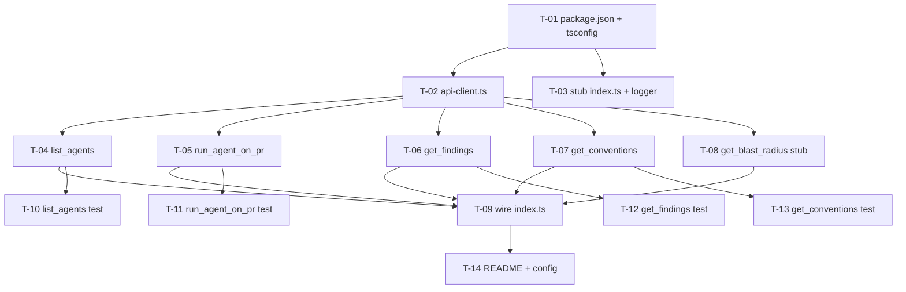

# Development Plan: `@devdigest/mcp-server` — Local MCP Server

## Overview

Build a new standalone `mcp-server/` package (sibling of `server/`, `client/`, `reviewer-core/`) that
runs a local stdio MCP server exposing 5 tools so Claude (Desktop / Claude Code) can review pull
requests via the DevDigest API at `http://localhost:4001`. The server is a thin, result-oriented
adapter: each tool returns a final concise result (not intermediate state), uses flat primitive
arguments, and returns forward-guiding error messages. No product code changes to any existing
package — this is additive only.

## Requirements

- R1: New package `@devdigest/mcp-server` at repo root with its own `package.json`, `tsconfig.json`, and
  `node_modules` — no workspace hoisting, mirrors the `reviewer-core` package shape.
- R2: A typed HTTP client (`fetch`-based, Node 22 built-in) wrapping the DevDigest API at a base URL
  from `DEVDIGEST_API_URL` (default `http://localhost:4001`). All HTTP lives here; no business logic.
- R3: `index.ts` boots an `McpServer` over `StdioServerTransport`, registers all 5 tools via each
  tool file's `register(server, client)` export, and connects. Never writes to stdout via `console.log`.
- R4: Tool `list_agents` — no input; returns `{ agents: [{ id, name, description, enabled }] }`;
  server-down error guides to check the server at :4001.
- R5: Tool `run_agent_on_pr` — flat inputs `pull_id` (uuid), `agent_id` (uuid); starts a review,
  polls runs every 2s until `done`/`failed` (120s cap), then returns concise findings; timeout and
  not-found errors guide the next step; `isError: true` on API/timeout failures.
- R6: Tool `get_findings` — flat input `pull_id` (uuid); returns the same shape as `run_agent_on_pr`;
  no-reviews case guides to run `run_agent_on_pr` first.
- R7: Tool `get_conventions` — flat input `repo_id` (uuid); returns `{ conventions: [{ rule, accepted }] }`;
  no-conventions case guides to extract via the DevDigest UI.
- R8: Tool `get_blast_radius` — flat input `pull_id` (uuid); STUB returning `isError: true` with
  "get_blast_radius is not yet implemented."
- R9: Hermetic unit tests (vitest) per tool using `InMemoryTransport.createLinkedPair()` with mocked
  `fetch`; each test covers success path + `isError: true` path + error-guides-forward message.
- R10: README documenting the MCP Inspector manual test and the JSON config entry a user pastes into
  `claude_desktop_config.json` / `.claude/settings.json`.

## Affected modules & contracts

- `mcp-server/` — **new package**, the only place any files are created. No edits to `server/`, `client/`,
  `reviewer-core/`, or `e2e/`.
- Contracts: **none added to `@devdigest/shared`.** The MCP tool schemas are local Zod schemas
  private to this package (flat, tool-input only). The API response shapes are consumed structurally
  by `api-client.ts`; do not import server internals. (If a future task wants to share response
  types, that is out-of-scope here.)

## Architecture notes

- **Not part of the server onion.** `mcp-server/` is an independent client of the HTTP API — it is another
  "transport/outer" process that talks to the API over the wire, exactly like the web client does.
  It must not import from `server/src/**` or `reviewer-core/src/**`; it only speaks HTTP.
- **Layering inside `mcp-server/`:** `index.ts` (composition/boot) → `tools/*.ts` (one tool each, exposing
  `register(server, client)`) → `lib/api-client.ts` (typed `fetch` wrapper, no business logic).
  Tool files own tool logic (polling, response shaping, error mapping); the client owns transport.
- **stdio discipline (CRITICAL):** stdout is the MCP protocol channel. `console.log` corrupts it.
  All diagnostics use `console.error` (stderr) only. This applies to every file in the package.
- **Flat schemas only:** every tool input is primitive (`z.string().uuid()`, etc.). No nested
  objects — non-Anthropic models make more mistakes with nested schemas.
- **Result-oriented tools:** `run_agent_on_pr` performs start → poll → fetch findings internally and
  returns the final result. The model never orchestrates multiple calls for one review.
- **Error contract:** tool *execution* failures return `{ content: [{ type: 'text', text }], isError: true }`
  with a forward-guiding message. Malformed-argument (protocol) errors are left to the SDK.
- **Zod version:** Zod v3 (`^3.24.1`), matching the rest of the monorepo. The MCP SDK's
  `registerTool` accepts a Zod raw shape for the input schema.

## INSIGHTS summary

- [reviewer-core]: A standalone TS package here uses `type: module`, `moduleResolution: Bundler`,
  `noEmit` for typecheck-as-build, its own pinned `zod`, and `tsx`/`vitest` in devDeps — copy this
  shape for `mcp-server/` rather than inventing a new one.
- [root/CLAUDE.md]: No workspace hoisting — each package has its own `node_modules`; cross-package
  code uses tsconfig path aliases, not published modules. `mcp-server/` needs no path alias since it talks
  HTTP, not TS imports.
- [root/CLAUDE.md]: Secrets live in `~/.devdigest/secrets.json` and are owned by the server. The MCP
  server must never read secrets or `.env` — it only needs `DEVDIGEST_API_URL`.

## Phased tasks

> Phase 1 stands up the package skeleton + typed client so every tool task can compile and run in
> parallel. Phase 2 implements the 5 tools plus boot wiring (each tool is an independent owned file).
> Phase 3 adds the hermetic tests (one file per tool) and the README. Each phase is mergeable on its
> own: after Phase 1 the package typechecks with a stub `index.ts`; after Phase 2 all tools work and
> the server boots; after Phase 3 tests pass and docs exist.



### Phase 1 — Package skeleton & typed API client

#### T-01: Scaffold the `@devdigest/mcp-server` package (package.json + tsconfig.json)

- **Action:** Create `mcp-server/package.json` and `mcp-server/tsconfig.json`, mirroring the `reviewer-core`
  package shape. `package.json`: `"name": "@devdigest/mcp-server"`, `"private": true`, `"type": "module"`,
  `"version": "0.0.0"`; scripts:
  `"dev": "tsx src/index.ts"`, `"build": "tsc -p tsconfig.json"`, `"typecheck": "tsc --noEmit -p tsconfig.json"`,
  `"test": "vitest run --passWithNoTests"`, `"inspector": "npx @modelcontextprotocol/inspector node dist/index.js"`;
  dependencies: `"@modelcontextprotocol/sdk": "^1"`, `"zod": "^3.24.1"`; devDependencies:
  `"@types/node": "^22.10.0"`, `"tsx": "^4.19.2"`, `"typescript": "^5.7.2"`, `"vitest": "^2.1.8"`.
  `tsconfig.json`: `target ESNext`, `module ESNext`, `moduleResolution "Bundler"`, `strict: true`,
  `noUncheckedIndexedAccess: true`, `esModuleInterop: true`, `resolveJsonModule: true`,
  `isolatedModules: true`, `skipLibCheck: true`, `types: ["node"]`, `outDir "dist"`, `noEmit: false`
  (the package emits JS via `build`), `include: ["src/**/*.ts"]`, and `exclude: ["src/__tests__/**"]`.
  Run `pnpm install` inside `mcp-server/` to create its own `node_modules`.
- **Why:** Satisfies R1; without an installed package skeleton no tool file can import the SDK/zod or
  compile.
- **Module:** mcp (new)
- **Type:** core
- **Skills to use:** typescript-expert
- **Owned paths:** `mcp-server/package.json`, `mcp-server/tsconfig.json`
- **Depends-on:** none
- **Risk:** low
- **Known gotchas:** No workspace hoisting — `mcp-server/` must get its own `node_modules` (run install from
  inside `mcp-server/`). Unlike `reviewer-core` (typecheck-only, `noEmit: true`), this package emits JS to
  `dist/`, so set `noEmit: false` and `outDir "dist"`; keep `--noEmit` only on the `typecheck` script.
- **Acceptance:** `cd mcp-server && pnpm install && pnpm exec tsc --noEmit -p tsconfig.json` exits 0 (with an
  empty/stub `src`, allow `--passWithNoTests` behavior by having at least one `.ts` file or an empty
  `src/index.ts` placeholder created here); `node -e "require('./mcp-server/package.json')"` prints no error
  and the name is `@devdigest/mcp-server`.

#### T-02: Typed `fetch` API client for the DevDigest API

- **Action:** Create `mcp-server/src/lib/api-client.ts` exporting a `createApiClient(baseUrl?: string)`
  factory returning an `ApiClient` object (also export the `ApiClient` type). Base URL resolves from
  the passed arg → `process.env.DEVDIGEST_API_URL` → `"http://localhost:4001"`. Implement thin typed
  methods, each a single `fetch` call returning parsed JSON (no business logic, no polling, no
  response shaping):
  `listAgents()` → `GET /agents`;
  `startReview(pullId, agentId)` → `POST /pulls/:id/review` with JSON body `{ agentId }`;
  `listRuns(pullId)` → `GET /pulls/:id/runs`;
  `getReviews(pullId)` → `GET /pulls/:id/reviews`;
  `getConventions(repoId)` → `GET /repos/:id/conventions`.
  Define local `interface`/`type` shapes for the fields the tools consume (agent: `id,name,description,enabled`;
  run: `id,status`; review/finding fields used by tools; convention: `rule,accepted`). Throw a typed
  `ApiError` (subclass of `Error` with a `status?: number`) on non-2xx or network failure so tool
  files can map it to guiding messages; do NOT format user-facing messages here. Do not import from
  `server/` or `reviewer-core/`.
- **Why:** Satisfies R2; every tool depends on a single typed transport surface so tool logic stays
  I/O-free and testable via a mocked `fetch`.
- **Module:** mcp (new)
- **Type:** core
- **Skills to use:** typescript-expert
- **Owned paths:** `mcp-server/src/lib/api-client.ts`
- **Depends-on:** T-01
- **Risk:** medium
- **Known gotchas:** `fetch` is a Node 22 built-in — do not add `node-fetch`. A non-2xx response does
  not reject the `fetch` promise; check `res.ok` explicitly and throw `ApiError` with `res.status`.
  Never `console.log` here — if any debug is needed use `console.error`.
- **Acceptance:** `cd mcp-server && pnpm exec tsc --noEmit -p tsconfig.json` exits 0; `api-client.ts` exports
  `createApiClient`, `ApiClient`, and `ApiError`; no import path references `../../server` or
  `../../reviewer-core` (grep returns nothing).

#### T-03: Boot skeleton — `index.ts` shell + stderr logger

- **Action:** Create `mcp-server/src/index.ts` that constructs an `McpServer` (name `"devdigest-mcp"`,
  version from package.json or a literal), creates the `ApiClient` via `createApiClient()`, connects
  it to a `StdioServerTransport`, and awaits `server.connect(transport)`. Also create
  `mcp-server/src/lib/logger.ts` exporting a minimal logger whose methods write ONLY to `process.stderr` /
  `console.error` (expose `logger.info/warn/error`, all → stderr). In this task, register no tools
  yet (a comment placeholder `// tools registered in T-09`). Wrap boot in a top-level `try/catch`
  that logs to stderr and `process.exit(1)` on failure.
- **Why:** Satisfies R3 (boot half) and the stdio logging rule; gives every tool task a compilable
  entry point and a safe logger to import. Kept separate from wiring (T-09) so it does not overlap
  tool-file ownership.
- **Module:** mcp (new)
- **Type:** core
- **Skills to use:** typescript-expert
- **Owned paths:** `mcp-server/src/index.ts`, `mcp-server/src/lib/logger.ts`
- **Depends-on:** T-01
- **Risk:** low
- **Known gotchas:** CRITICAL — `console.log` corrupts the stdio MCP stream; the logger must use
  `console.error`/`process.stderr` exclusively. `StdioServerTransport` takes over stdout; do not
  print anything else to stdout anywhere in the package.
- **Acceptance:** `cd mcp-server && pnpm exec tsc --noEmit -p tsconfig.json` exits 0; `grep -rn "console.log" mcp-server/src`
  returns nothing; `grep -n "StdioServerTransport" mcp-server/src/index.ts` matches.

### Phase 2 — Tools & boot wiring

> Each tool file is an independently owned path and depends only on T-02 (client) — the five tool
> tasks run concurrently. Each exports `register(server: McpServer, client: ApiClient): void` and
> registers exactly one tool via `server.registerTool(name, config, handler)`. Handlers return
> `{ content: [{ type: 'text', text: JSON.stringify(result) }] }` on success and
> `{ content: [{ type: 'text', text: <guiding message> }], isError: true }` on failure.

#### T-04: Tool `list_agents`

- **Action:** Create `mcp-server/src/tools/list-agents.ts` exporting `register(server, client)`. Register
  tool `"list_agents"`, description `"List all configured review agents with their id, name, and description."`,
  input schema `{}` (no parameters). Handler calls `client.listAgents()` and returns
  `{ agents: agents.map(a => ({ id: a.id, name: a.name, description: a.description, enabled: a.enabled })) }`
  as JSON text — only those four fields, never the raw API array. On any `ApiError`/network failure,
  return `isError: true` with text `"Could not list agents. Is the DevDigest server running at :4001?"`.
- **Why:** Satisfies R4; entry point the model uses to discover valid `agent_id`s referenced by
  `run_agent_on_pr`.
- **Module:** mcp (new)
- **Type:** core
- **Skills to use:** typescript-expert, zod
- **Owned paths:** `mcp-server/src/tools/list-agents.ts`
- **Depends-on:** T-02
- **Risk:** low
- **Known gotchas:** Return only `{ id, name, description, enabled }` — dumping the raw `/agents`
  response wastes tokens (a full dump can be tens of thousands of tokens). No `console.log`.
- **Acceptance:** `cd mcp-server && pnpm exec tsc --noEmit -p tsconfig.json` exits 0; file exports a
  `register` function; `grep -n "running at :4001" mcp-server/src/tools/list-agents.ts` matches.

#### T-05: Tool `run_agent_on_pr` (start → poll → findings)

- **Action:** Create `mcp-server/src/tools/run-agent-on-pr.ts` exporting `register(server, client)`. Register
  tool `"run_agent_on_pr"`, description
  `"Run a review agent on a pull request and return findings when complete."`, flat input schema
  `{ pull_id: z.string().uuid(), agent_id: z.string().uuid() }` (no `.describe()` on these
  self-evident params). Handler:
  (1) `client.startReview(pull_id, agent_id)` to get the run id;
  (2) poll `client.listRuns(pull_id)` every 2s (implement a `sleep(ms)` = `new Promise` +
  `setTimeout`, NOT a busy loop) until the target run's status is `done` or `failed`, with a hard
  120s cap tracked by elapsed wall-clock time;
  (3) on `done`, `client.getReviews(pull_id)` and shape the concise result
  `{ verdict: string, score: number, finding_count: number, findings: [{ severity, title, file, line, body }] }`;
  return only those fields.
  Error mapping (all `isError: true` except where noted):
  agent-not-found (e.g. 404/400 on start referencing the agent) → `"Agent not found. Call list_agents to see available agents."`;
  PR-not-found → `"Pull request not found. Verify the pull_id."`;
  run status `failed` → a guiding message that the review failed;
  120s timeout → `"Review timed out after 120s. The run may still complete — call get_findings with pull_id to check."`;
  any other API/network failure → guiding message with `isError: true`.
- **Why:** Satisfies R5; the core result-oriented tool — the model triggers a full review with one
  call and receives final findings, never orchestrating start/poll/fetch itself.
- **Module:** mcp (new)
- **Type:** core
- **Skills to use:** typescript-expert, zod
- **Owned paths:** `mcp-server/src/tools/run-agent-on-pr.ts`
- **Depends-on:** T-02
- **Risk:** high
- **Known gotchas:** Poll with a Promise-wrapped `setTimeout` (`await sleep(2000)`) inside a loop that
  checks elapsed time — never a busy `while` loop (pegs CPU, blocks event loop). The findings come
  from `GET /pulls/:id/reviews` AFTER a run reaches `done`/`failed` in `GET /pulls/:id/runs`, not from
  the `POST .../review` response. Return only the 5 finding fields — never the raw reviews payload.
  No `console.log`.
- **Acceptance:** `cd mcp-server && pnpm exec tsc --noEmit -p tsconfig.json` exits 0; file exports `register`;
  `grep -n "timed out after 120s" mcp-server/src/tools/run-agent-on-pr.ts` and
  `grep -n "Call list_agents" mcp-server/src/tools/run-agent-on-pr.ts` both match; `grep -n "setInterval\|setTimeout"`
  matches (proves timer-based polling, not a busy loop).

#### T-06: Tool `get_findings`

- **Action:** Create `mcp-server/src/tools/get-findings.ts` exporting `register(server, client)`. Register
  tool `"get_findings"`, description
  `"Get the latest review findings for a pull request that has already been reviewed."`, flat input
  `{ pull_id: z.string().uuid() }`. Handler calls `client.getReviews(pull_id)` and returns the SAME
  concise shape as `run_agent_on_pr`:
  `{ verdict, score, finding_count, findings: [{ severity, title, file, line, body }] }`. If no
  completed reviews exist, return `isError: true` with
  `"No completed reviews found for this PR. Run run_agent_on_pr first."`. Any other API failure →
  guiding message with `isError: true`. Reuse the same finding-shaping logic pattern as T-05 but keep
  it local to this file (do not import from `run-agent-on-pr.ts` — self-contained; a tiny duplicated
  mapper is acceptable to preserve non-overlapping ownership).
- **Why:** Satisfies R6; lets the model re-fetch findings for an already-reviewed PR without
  re-running, and is the follow-up the timeout message in T-05 points to.
- **Module:** mcp (new)
- **Type:** core
- **Skills to use:** typescript-expert, zod
- **Owned paths:** `mcp-server/src/tools/get-findings.ts`
- **Depends-on:** T-02
- **Risk:** low
- **Known gotchas:** Must return the identical result shape as `run_agent_on_pr` so the model gets a
  consistent contract. Do not import the mapper from `run-agent-on-pr.ts` (would create shared
  ownership and a cross-file coupling); duplicate the small mapping. No `console.log`.
- **Acceptance:** `cd mcp-server && pnpm exec tsc --noEmit -p tsconfig.json` exits 0; file exports `register`;
  `grep -n "Run run_agent_on_pr first" mcp-server/src/tools/get-findings.ts` matches.

#### T-07: Tool `get_conventions`

- **Action:** Create `mcp-server/src/tools/get-conventions.ts` exporting `register(server, client)`. Register
  tool `"get_conventions"`, description `"Get the coding conventions extracted from a repository."`,
  flat input `{ repo_id: z.string().uuid() }`. Handler calls `client.getConventions(repo_id)` and
  returns `{ conventions: candidates.map(c => ({ rule: c.rule, accepted: c.accepted })) }` where
  `accepted` is `boolean | null`. If the repo has no conventions, return `isError: true` with
  `"No conventions found for this repo. Conventions must be extracted first via the DevDigest UI."`.
  Any other API failure → guiding message with `isError: true`. Only return `{ rule, accepted }` per
  item — never the raw candidate objects.
- **Why:** Satisfies R7; gives the model the repo's coding conventions to inform review context.
- **Module:** mcp (new)
- **Type:** core
- **Skills to use:** typescript-expert, zod
- **Owned paths:** `mcp-server/src/tools/get-conventions.ts`
- **Depends-on:** T-02
- **Risk:** low
- **Known gotchas:** Uses `GET /repos/:id/conventions` (read) only — never the `extract` endpoint.
  `accepted` is tri-state (`true`/`false`/`null`); preserve `null`, don't coerce to `false`. Return
  only `{ rule, accepted }`. No `console.log`.
- **Acceptance:** `cd mcp-server && pnpm exec tsc --noEmit -p tsconfig.json` exits 0; file exports `register`;
  `grep -n "extracted first via the DevDigest UI" mcp-server/src/tools/get-conventions.ts` matches.

#### T-08: Tool `get_blast_radius` (STUB)

- **Action:** Create `mcp-server/src/tools/get-blast-radius.ts` exporting `register(server, client)`. Register
  tool `"get_blast_radius"`, description
  `"Get the blast radius (impact map) of a pull request. (Not yet implemented)"`, flat input
  `{ pull_id: z.string().uuid() }`. Handler makes NO API call and returns `isError: true` with text
  `"get_blast_radius is not yet implemented."`. Do not implement any real blast-radius logic.
- **Why:** Satisfies R8; reserves the tool name and returns a clear not-implemented signal so the
  model does not attempt to use it or invent behavior.
- **Module:** mcp (new)
- **Type:** core
- **Skills to use:** typescript-expert, zod
- **Owned paths:** `mcp-server/src/tools/get-blast-radius.ts`
- **Depends-on:** T-02
- **Risk:** low
- **Known gotchas:** Stub only — do not add real implementation and do not call the API. No `console.log`.
- **Acceptance:** `cd mcp-server && pnpm exec tsc --noEmit -p tsconfig.json` exits 0; file exports `register`;
  `grep -n "not yet implemented" mcp-server/src/tools/get-blast-radius.ts` matches; `grep -n "client\." mcp-server/src/tools/get-blast-radius.ts`
  returns nothing (proves no API call).

#### T-09: Wire all tools into `index.ts`

- **Action:** Edit `mcp-server/src/index.ts` (owned by this task at this point; T-03 created it and is a
  dependency, so no concurrent writer) to import the five `register` functions and call each with
  `(server, client)` before `server.connect(transport)`:
  `registerListAgents`, `registerRunAgentOnPr`, `registerGetFindings`, `registerGetConventions`,
  `registerGetBlastRadius` (use whatever exact export names the tool files use; import the `register`
  from each file). Order does not matter. Do not change the logger or client construction from T-03.
- **Why:** Satisfies R3 (wiring half); without this the server boots with zero tools and the package
  is non-functional end to end. Placed after all tool tasks so their exports exist.
- **Module:** mcp (new)
- **Type:** core
- **Skills to use:** typescript-expert
- **Owned paths:** `mcp-server/src/index.ts`
- **Depends-on:** T-03, T-04, T-05, T-06, T-07, T-08
- **Risk:** low
- **Known gotchas:** This is the only task besides T-03 that touches `index.ts`; because it
  depends on T-03, there is no concurrent write. No `console.log`.
- **Acceptance:** `cd mcp-server && pnpm exec tsc --noEmit -p tsconfig.json` exits 0; `cd mcp-server && pnpm build`
  emits `dist/index.js`; `node mcp-server/dist/index.js` starts, stays alive on stdio, and writes nothing to
  stdout before a client connects (any diagnostics appear on stderr only). All five tool files are
  imported (grep for each `register` import in `index.ts` matches 5 times).

### Phase 3 — Tests & documentation

> Test files are independently owned (one per tool) and each depends only on its tool file. They run
> concurrently. Each uses `InMemoryTransport.createLinkedPair()` to connect the server to an
> in-memory client and mocks `fetch` (via `vi.stubGlobal('fetch', ...)`), asserting the tool result
> for success + `isError: true` + the exact guiding message.

#### T-10: Unit test — `list_agents`

- **Action:** Create `mcp-server/src/__tests__/list-agents.test.ts`. Build a fresh `McpServer`, register
  only `list_agents` via its `register(server, client)` with a client pointed at a stubbed `fetch`,
  connect via `InMemoryTransport.createLinkedPair()` to an SDK `Client`, then call the tool through
  the client. Cases: (a) success — mocked `GET /agents` returns 2 agents; assert the result contains
  only `{ id, name, description, enabled }` per agent and no extra fields; (b) server-down — `fetch`
  rejects / returns non-ok; assert `isError: true` and the text is
  `"Could not list agents. Is the DevDigest server running at :4001?"`.
- **Why:** Satisfies R9 for `list_agents`; verifies field-trimming and the forward-guiding server-down
  message.
- **Module:** mcp (new)
- **Type:** core
- **Skills to use:** typescript-expert
- **Owned paths:** `mcp-server/src/__tests__/list-agents.test.ts`
- **Depends-on:** T-04
- **Risk:** low
- **Known gotchas:** Use `InMemoryTransport.createLinkedPair()` from `@modelcontextprotocol/sdk` for
  hermetic wiring — no real stdio, no network. Stub `fetch` with `vi.stubGlobal` and restore in
  `afterEach`. The `tsconfig` excludes `src/__tests__/**` from `build`; vitest still runs them.
- **Acceptance:** `cd mcp-server && pnpm exec vitest run src/__tests__/list-agents.test.ts` passes with both
  cases green.

#### T-11: Unit test — `run_agent_on_pr`

- **Action:** Create `mcp-server/src/__tests__/run-agent-on-pr.test.ts`. Register only `run_agent_on_pr`,
  wire via `InMemoryTransport.createLinkedPair()`, stub `fetch` and (to keep the 2s poll fast) fake
  timers with `vi.useFakeTimers()` advancing between poll iterations. Cases: (a) success — `POST review`
  returns a run id, first `GET runs` returns `running`, second returns `done`, `GET reviews` returns a
  review; assert result shape `{ verdict, score, finding_count, findings:[{severity,title,file,line,body}] }`;
  (b) agent-not-found — start call errors referencing the agent; assert `isError: true` and text
  `"Agent not found. Call list_agents to see available agents."`; (c) timeout — `GET runs` always
  returns `running`; advance fake time past 120s; assert `isError: true` and text
  `"Review timed out after 120s. The run may still complete — call get_findings with pull_id to check."`.
- **Why:** Satisfies R9 for the highest-risk tool; verifies the start→poll→findings flow, result
  shaping, and the two most important guiding errors (agent-not-found, timeout).
- **Module:** mcp (new)
- **Type:** core
- **Skills to use:** typescript-expert
- **Owned paths:** `mcp-server/src/__tests__/run-agent-on-pr.test.ts`
- **Depends-on:** T-05
- **Risk:** medium
- **Known gotchas:** Real 2s polling makes tests slow/flaky — use `vi.useFakeTimers()` and
  `await vi.advanceTimersByTimeAsync(...)` to drive the poll loop and the 120s cap deterministically;
  restore real timers in `afterEach`. Mock the sequence of `fetch` responses in call order.
- **Acceptance:** `cd mcp-server && pnpm exec vitest run src/__tests__/run-agent-on-pr.test.ts` passes with
  all three cases green in under a few seconds (fake timers, no real waiting).

#### T-12: Unit test — `get_findings`

- **Action:** Create `mcp-server/src/__tests__/get-findings.test.ts`. Register only `get_findings`, wire via
  `InMemoryTransport.createLinkedPair()`, stub `fetch`. Cases: (a) success — `GET reviews` returns a
  completed review; assert the `{ verdict, score, finding_count, findings:[...] }` shape matches the
  `run_agent_on_pr` contract; (b) no-reviews — `GET reviews` returns empty/none; assert `isError: true`
  and text `"No completed reviews found for this PR. Run run_agent_on_pr first."`.
- **Why:** Satisfies R9 for `get_findings`; verifies shape parity with `run_agent_on_pr` and the
  no-reviews guiding message.
- **Module:** mcp (new)
- **Type:** core
- **Skills to use:** typescript-expert
- **Owned paths:** `mcp-server/src/__tests__/get-findings.test.ts`
- **Depends-on:** T-06
- **Risk:** low
- **Known gotchas:** Use `InMemoryTransport.createLinkedPair()`; stub `fetch` with `vi.stubGlobal`.
  Assert the result shape is identical to `run_agent_on_pr`'s (same keys), guarding against contract
  drift between the two tools.
- **Acceptance:** `cd mcp-server && pnpm exec vitest run src/__tests__/get-findings.test.ts` passes with both
  cases green.

#### T-13: Unit test — `get_conventions`

- **Action:** Create `mcp-server/src/__tests__/get-conventions.test.ts`. Register only `get_conventions`,
  wire via `InMemoryTransport.createLinkedPair()`, stub `fetch`. Cases: (a) success — `GET conventions`
  returns candidates with mixed `accepted` values (`true`, `false`, `null`); assert result is
  `{ conventions: [{ rule, accepted }] }` and that a `null` `accepted` is preserved as `null`;
  (b) none — empty conventions; assert `isError: true` and text
  `"No conventions found for this repo. Conventions must be extracted first via the DevDigest UI."`.
- **Why:** Satisfies R9 for `get_conventions`; verifies field-trimming, tri-state `accepted`
  preservation, and the guiding empty message.
- **Module:** mcp (new)
- **Type:** core
- **Skills to use:** typescript-expert
- **Owned paths:** `mcp-server/src/__tests__/get-conventions.test.ts`
- **Depends-on:** T-07
- **Risk:** low
- **Known gotchas:** Explicitly assert the `null` case for `accepted` is not coerced to `false`.
  `InMemoryTransport.createLinkedPair()` + `vi.stubGlobal('fetch', ...)`.
- **Acceptance:** `cd mcp-server && pnpm exec vitest run src/__tests__/get-conventions.test.ts` passes with
  both cases green.

#### T-14: README with Inspector instructions + Claude config entry

- **Action:** Create `mcp-server/README.md` documenting: (1) build/run (`pnpm install`, `pnpm build`,
  `node dist/index.js`, `pnpm dev` for `tsx`); (2) the `DEVDIGEST_API_URL` env var (default
  `http://localhost:4001`) and that secrets are owned by the server, never the MCP process; (3) the
  MCP Inspector manual test command `npx @modelcontextprotocol/inspector node dist/index.js`; (4) the
  list of 5 tools and their one-line descriptions; (5) the exact JSON config block a user pastes into
  `claude_desktop_config.json` / `.claude/settings.json` under an `"mcpServers"` key, e.g.:

  ```json
  {
    "mcpServers": {
      "devdigest": {
        "command": "node",
        "args": ["/absolute/path/to/dev-digest/mcp-server/dist/index.js"],
        "env": { "DEVDIGEST_API_URL": "http://localhost:4001" }
      }
    }
  }
  ```

  Note the dev alternative using `tsx` (`"command": "npx", "args": ["tsx", ".../mcp-server/src/index.ts"]`)
  and that the DevDigest server must be running at :4001 first.
- **Why:** Satisfies R10; without documented config the user cannot register the server with Claude,
  and the Inspector command is the only manual verification path.
- **Module:** mcp (new)
- **Type:** core
- **Skills to use:** typescript-expert
- **Owned paths:** `mcp-server/README.md`
- **Depends-on:** T-09
- **Risk:** low
- **Known gotchas:** The `args` path must be absolute in the config (Claude launches the process with
  an arbitrary cwd). Depends on T-09 so the documented `dist/index.js` entry actually exists and works.
- **Acceptance:** `mcp-server/README.md` exists and contains a fenced `json` block with an `"mcpServers"`
  key and the `npx @modelcontextprotocol/inspector` command; `grep -n "mcpServers" mcp-server/README.md` and
  `grep -n "modelcontextprotocol/inspector" mcp-server/README.md` both match.

## Claude config entry (summary for the user)

After `cd mcp-server && pnpm install && pnpm build`, add this to `claude_desktop_config.json` (Claude
Desktop) or the `mcpServers` section of `.claude/settings.json` (Claude Code), using an **absolute**
path:

```json
{
  "mcpServers": {
    "devdigest": {
      "command": "node",
      "args": ["/absolute/path/to/dev-digest/mcp-server/dist/index.js"],
      "env": { "DEVDIGEST_API_URL": "http://localhost:4001" }
    }
  }
}
```

Dev variant (no build step): `"command": "npx"`, `"args": ["tsx", "/absolute/path/to/dev-digest/mcp-server/src/index.ts"]`.
The DevDigest server must be running at :4001 for the tools to work.

## Testing strategy

- Unit (hermetic): `cd mcp-server && pnpm exec vitest run` — all tool tests via
  `InMemoryTransport.createLinkedPair()` with `vi.stubGlobal('fetch', ...)`; no network, no real stdio.
  `run_agent_on_pr` uses `vi.useFakeTimers()` for the poll loop.
- Typecheck: `cd mcp-server && pnpm exec tsc --noEmit -p tsconfig.json`.
- Build: `cd mcp-server && pnpm build` emits `dist/index.js`.
- Manual: `cd mcp-server && npx @modelcontextprotocol/inspector node dist/index.js` with the DevDigest
  server running at :4001 — exercise each tool from the Inspector UI (documented in `mcp-server/README.md`).

## Risks & mitigations

- **MCP SDK API drift (`registerTool` signature / `InMemoryTransport` location).** — Pin
  `@modelcontextprotocol/sdk` to a resolved 1.x version in T-01; the implementer confirms the exact
  `registerTool(name, config, handler)` and `InMemoryTransport.createLinkedPair()` imports against the
  installed version before writing tool/test code.
- **API response shapes differ from the spec (field names on agents/runs/reviews/conventions).** —
  `api-client.ts` (T-02) is the single place shapes are defined; if a field name differs, only that
  file and the consuming tool change. Tool tasks assert exact result fields so drift is caught in tests.
- **stdout corruption from an accidental `console.log`.** — Enforced by the T-03/T-09 acceptance grep
  `grep -rn "console.log" mcp-server/src` returning nothing, plus a stderr-only logger.
- **Flaky/slow `run_agent_on_pr` test from real 2s polling.** — T-11 mandates `vi.useFakeTimers()`
  and `advanceTimersByTimeAsync`; no real waiting.
- **Blast-radius scope creep.** — T-08 is explicitly a stub with an acceptance grep proving it makes
  no API call.

## Red-flags check

- [x] Global Constraints have no internal contradictions (flat schemas, stderr-only logging, no
  shared-contract changes, additive-only package — all mutually consistent)
- [x] Every requirement maps to a task (R1→T-01, R2→T-02, R3→T-03+T-09, R4→T-04, R5→T-05, R6→T-06,
  R7→T-07, R8→T-08, R9→T-10..T-13, R10→T-14)
- [x] Dependencies form a DAG (no cycles; see mermaid graph)
- [x] Concurrent tasks have non-overlapping Owned paths and parent directories (Phase 2 tool files are
  distinct files under `src/tools/`; Phase 3 test files distinct under `src/__tests__/`; `index.ts`
  written only by T-03 then T-09 which depends on T-03)
- [x] Every task description names exact file paths — no abstract descriptions
- [x] Every task is self-contained: carries owned paths, dependency refs, and a runnable acceptance
- [x] Every Acceptance is measurable with a runnable command (binary pass/fail)
- [x] Each phase produces a self-consistent, mergeable state (P1 typechecks with stub boot; P2 boots
  with all tools; P3 tests pass + docs)
- [x] Shared contract changes assign the same-task update to both vendor copies — N/A, no shared
  contract changes (local Zod schemas only)
- [x] Schema changes include `pnpm db:generate` + `pnpm db:migrate` — N/A, no DB schema changes
- [x] Integration edge-cases (auth, rate limits, error formats) are explicit tasks — no auth (local
  API); error formats are explicit per-tool acceptance greps and dedicated test cases (agent-not-found,
  timeout, no-reviews, no-conventions)
- [x] UI tasks: design audit — N/A, no UI in this plan
- [x] Orphan contracts: every `@devdigest/shared` Zod schema touched — none touched (out of scope, by
  design; MCP tool schemas are package-local)
