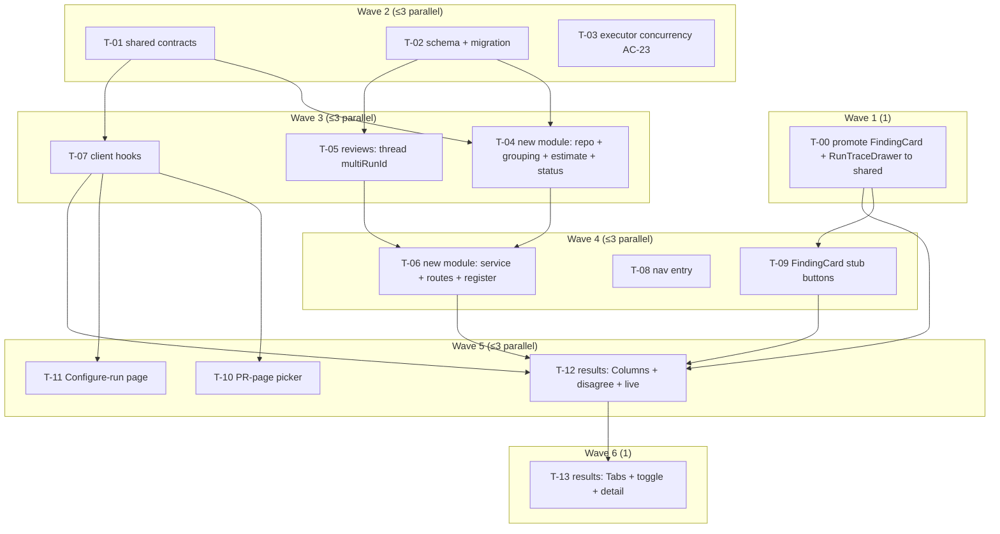

# Development Plan: Multi-Agent Review (worktree A)

## Overview
Add a multi-agent review flow: pick N agents to fan out on a PR (from the PR page and a dedicated
Configure-run page), show a pre-run per-agent + summary cost/time estimate, persist each run as its
own addressable `multi_agent_runs` record linking N `agent_runs`, and present a results page with
Columns/Tabs modes, live per-agent status, and a cross-agent "Where agents disagree" grouping. The
feature is reuse-heavy: it re-fires the existing review executor via DI, reuses `FindingCard`,
`RunTraceDrawer`, the SSE stream, and the eval-case action. The one non-trivial engine change is
making the shared executor's fan-out concurrent (AC-23).

## Execution mode
**Multi-agent (parallel implementers), hard-capped at 3 concurrent per wave** — as directed by the
requester. The change spans two packages and 14 tasks (T-00..T-13) with clean module seams (shared
contracts, schema, a new self-contained server plugin, and several independent UI surfaces), so strict
Owned-path partitioning pays off. Waves are sized so **at most 3 implementer agents run
concurrently at any time**; within a wave every task owns strictly non-overlapping paths **and
non-overlapping immediate parent directories**, so parallel dispatch on the shared branch is safe.

> **MAX PARALLELISM = 3.** The build orchestrator must never dispatch more than 3 implementers at
> once. Each `### Wave N` below is a parallel group of ≤3 tasks; waves run in order.

## Requirements
<!-- All trace to the approved SPEC-2026-07-19-multi-agent-review (Status: approved) — verified
     input, not originated here. AC-1..AC-25 / SC-1..SC-4 are cited verbatim by id per task. -->
- R1 (AC-1, AC-2): Replace the PR page's one-or-all "Run review" dropdown with a multi-select
  "Pick agents to run" picker that starts a multi-agent review over exactly the N selected agents.
- R2 (AC-3): A Configure-run page selects a PR + agents; the run button is disabled until a PR is
  picked (empty "Pick a pull request first" state).
- R3 (AC-4, AC-5, AC-6, G3): Persist one `multi_agent_runs` row per run with its own id, linking
  each spawned `agent_run` via `multi_agent_run_id`; a re-run creates a NEW record (never
  overwrites); each record is addressable at its own URL.
- R4 (AC-7, AC-8): Every new read/write is workspace-scoped; a multi-run/agent-run from another
  workspace returns not-found (IDOR/A01).
- R5 (AC-9, AC-10, AC-11): Per-agent + summary estimate. Summary cost = Σ per-agent, duration = MAX
  per-agent (parallel fan-out). Per-agent basis = repo-scoped history avg over last 20 completed
  runs on the target PR's repo, else PR diff-size × repo token-rate × model pricing.
- R6 (AC-12..AC-16, E1, E2, E3, E8, E10): Cross-agent grouping by same-file + overlapping-line-range
  only; a column per agent that actually ran with binary `flagged`/`did not flag`; "Show only
  conflicts" shows only groups where ≥1 agent flagged and ≥1 agent that ran did not.
- R7 (AC-17, AC-18, AC-19, US4, E5, E7): Live per-agent header status from the SSE stream mapping
  `agent_runs.status` → Running/Finished/Failed/Cancelled (four distinct states, Cancelled distinct
  from Failed); one agent failing leaves the others intact; each header shows status + cost + score.
- R8 (AC-20, AC-21, AC-22): Columns⇄Tabs toggle switches layout without re-running; per-agent "View
  trace" opens the existing `RunTraceDrawer` for that agent's run id; Tabs detail renders findings
  via the existing `FindingCard` with Accept/Dismiss/Turn-into-eval-case functional (reused).
- R9 (AC-23, SC-4): For N>1 agents the executor runs the agents concurrently (bounded fan-out) so
  wall-clock ≈ slowest agent, preserving per-agent failure isolation.
- R10 (AC-24): In the Multi-Agent Review detail only, `FindingCard` shows Learn + Reply-to-author as
  visible-but-disabled no-op stubs; these are NOT rendered on the existing PR findings page and add
  no new server behavior (`learn`/`reply` stay 400).
- R11 (AC-25): Add a "Multi-Agent Review" sidebar `NAV` entry routing to the results/configure page;
  do NOT add an "Agent Performance" entry.
- R12 (SC-1, SC-2, SC-3): The read/history route exposes each run's total cost (Σ `agent_runs`) so a
  1-agent and 3-agent run on the same PR compare side by side; grouping collapses duplicate findings.

## Recommendations
<!-- The former "promote shared components" recommendation was CONFIRMED during grilling and is now a
     decided task (T-00, Wave 1) — no longer pending. -->
- Expose model pricing (`estimateCost`) through the DI container as `container.estimateCost(...)`
  rather than importing `src/adapters/llm/pricing.ts` into the new module's service — keeps the
  Application layer off `src/adapters/**` and the `depcruise` gate green *(adopted in T-06; recorded
  here so the reviewer sees it was a deliberate onion choice, not incidental)*.

## Design references
| File | Shows |
| --- | --- |
| `specs/SPEC-2026-07-19-multi-agent-review/design/01.png` | PR page, "Pick agents to run" dropdown (multi-select, per-agent time hint, "Run multi-agent review (N)", "Configure agents…") replacing Run Review |
| `specs/SPEC-2026-07-19-multi-agent-review/design/02.png` | Configure-run page, empty state ("Pick a pull request first", run button disabled) |
| `specs/SPEC-2026-07-19-multi-agent-review/design/03.png` | Configure-run page, PR selected: step-1 PR picker, step-2 agent checkboxes w/ "time · $cost", "Select all", summary "≈ 8.2s · $0.20 · parallel fan-out" |
| `specs/SPEC-2026-07-19-multi-agent-review/design/04.png` | Results **Columns** mode: per-agent column (status/cost/score header, View trace, findings, count) + "Where agents disagree" w/ verdicts incl. "did not flag" + "Show only conflicts" toggle |
| `specs/SPEC-2026-07-19-multi-agent-review/design/05.png` | Results **Tabs + detail** mode: per-agent tabs, finding detail via `FindingCard` (Accept/Dismiss/Learn/Turn-into-eval-case/Reply-to-author), same disagree block |

> This plan inherits the spec's `design/` folder by reference — images are NOT duplicated. Every UI
> task cites the exact `design/<file>` in its `Design ref:` field.

## Design audit
Style-level enumeration of each mockup, mapped to a requirement or flagged. Divergences below are
**already resolved in the approved spec** ("Design divergences" + E9); they are restated so no
implementer re-chases a non-existent pixel.

| Panel | Element (style-level) | Design file | Requirement |
| --- | --- | --- | --- |
| PR header | "Run Review" button opens a dropdown titled "PICK AGENTS TO RUN" with a "Clear" affordance | `design/01.png` | R1 / AC-1 |
| PR dropdown | Each agent = checkbox (filled blue when checked) + globe icon + name + right-aligned "~6s" time hint | `design/01.png` | R1, R5 / AC-9 |
| PR dropdown | Primary "Run multi-agent review (2)" button (count = selected); muted "Configure agents…" row below | `design/01.png` | R1 / AC-2 |
| Configure (empty) | Step 1 "Pull request" select "Select a pull request…"; Step 2 greyed card "Pick a pull request first"; "Run multi-agent review (4)" button present but disabled | `design/02.png` | R2 / AC-3 |
| Configure (selected) | Step 2 = agent rows, each a checkbox + colored category icon + name + description + right "8.2s · $0.06"; "Select all" link top-right; checked rows get a colored ring | `design/03.png` | R1, R5 / AC-9, AC-10, AC-11 |
| Configure (selected) | Run button "Run multi-agent review (4)" + inline summary "≈ 8.2s · $0.20 · parallel fan-out" (max duration · Σ cost) | `design/03.png` | R5 / AC-10 |
| Results header | "Configure run" button, title "Multi-Agent Review", subtitle "4 selected agents · parallel", right-aligned segmented "Columns / Tabs" toggle; meta line "N agents · fan-out … · 8.2s total · $0.20" | `design/04.png`, `design/05.png` | R8 / AC-20; R12 |
| Results Columns | One column per agent: header = category icon + name + "8.2s · $0.06" + score ring; body = finding rows (severity icon + title + file:line); footer "View trace" + "N findings" | `design/04.png` | R7, R8 / AC-19, AC-21 |
| Results Columns | **Live Running/Failed/Cancelled header states are NOT in the mockup** (shows finished only) — derived from US4/AC-17. Not a gap; spec-flagged divergence. | `design/04.png` | R7 / AC-17 (spec divergence) |
| Where agents disagree | Per-location block: `<>` icon + `file:line` + short title; one cell per agent that ran = agent name + verdict dot ("SUGGESTION"/"WARNING" when flagged, muted "did not flag" when not) | `design/04.png`, `design/05.png` | R6 / AC-13, AC-15 |
| Where agents disagree | "did not flag" cells in the mockup show reasons ("Not a security concern") — **not backable (E9); v1 renders bare "did not flag" with no reason.** Not a gap; spec-resolved. | `design/04.png` | R6 / E9 (spec divergence) |
| Where agents disagree | `design/04.png` shows an "Architecture" column in a group though Architecture did not run — **mockup slip; per AC-14 only agents that ran get a column.** Not a gap; spec-resolved. | `design/04.png` | R6 / AC-14 (spec divergence) |
| Where agents disagree | "Show only conflicts" toggle, top-right of the block, OFF by default (full view) | `design/04.png`, `design/05.png` | R6 / AC-16 |
| Results Tabs | Per-agent tab row (category icon + name + score); selected agent's summary card (score ring + verdict text + "View trace" + cost); expandable `FindingCard`s | `design/05.png` | R8 / AC-19, AC-21 |
| Results Tabs | Expanded `FindingCard`: confidence %, markdown rationale, "SUGGESTED FIX", action row Accept / Dismiss / **Learn** / Turn into eval case / **Reply to author** | `design/05.png` | R8, R10 / AC-22, AC-24 |
| Results Tabs | **Learn + Reply-to-author do not exist in `FindingCard` today; v1 adds them as disabled stubs, multi-agent context only.** Not a gap; spec-resolved (N2). | `design/05.png` | R10 / AC-24 (spec divergence) |
| Sidebar (all) | GLOBAL group has a "Multi-Agent Review" entry (active on these pages). "Agent Performance" also appears in mockups but is a **separate feature — its nav entry is NOT added by worktree A** (N4). | `design/04.png` | R11 / AC-25 |

## Affected modules & contracts
- **`@devdigest/shared`** (both vendor copies) — NEW `contracts/multi-agent.ts`: create req/res,
  detail (agents + `CrossAgentGroup[]`), estimate req/res, history summary. Barrel `index.ts`
  re-export added in both copies. (T-01)
- **`server` schema** — extend `multi_agent_runs` (+`selected_agent_ids` jsonb, `status` text,
  `estimated_cost_usd` double, `estimated_duration_ms` int) and `agent_runs`
  (+`multi_agent_run_id` uuid nullable FK on-delete-set-null); one NEW generated migration. (T-02)
- **`server/src/modules/reviews/`** — executor fan-out made concurrent, env-bounded (T-03);
  `runReview` / `createAgentRun` thread an optional `multiRunId` so spawned runs link atomically at
  creation (T-05).
- **`server/src/modules/multi-agent-runs/`** (NEW self-contained Fastify plugin) — repository +
  grouping + estimate + status helper (T-04), service + routes + registration (T-06). Reuses
  `ReviewService.runReview` / `ReviewRunExecutor` via DI; local ~6-line line-overlap helper (NOT
  imported from reviewer-core).
- **`client` components (shared)** — promote `FindingCard` + `RunTraceDrawer` from the PR route's
  `_components/` to `client/src/components/` and repoint all existing PR-page imports (T-00), so the
  results page reuses them from a stable shared path.
- **`client`** — new hooks (T-07), nav entry (T-08), `FindingCard` stub buttons (T-09), PR-page
  picker (T-10), Configure-run page (T-11), results page Columns+disagree (T-12), Tabs+toggle (T-13).

New routes (per spec, exact prefixes an implementation detail; use these):
- `POST /pulls/:id/multi-agent-runs` → `{ multiRunId, runs: {agentId, runId}[] }`
- `POST /pulls/:id/multi-agent-runs/estimate` → `{ perAgent[], summary }`
- `GET  /pulls/:id/multi-agent-runs` → history list `[{ id, ranAt, status, agentCount, totalCostUsd, totalDurationMs }]` (`status` is **derived-on-read** from child `agent_runs` via the shared helper, so a run whose page was never opened never shows stale `running`)
- `GET  /multi-agent-runs/:id` → `{ id, prId, status, ranAt, agents[], groups: CrossAgentGroup[] }` (`status` **derived-on-read** via the same shared helper)

## Architecture notes
- **Onion placement.** Routes (`multi-agent-runs/routes.ts`, Transport) → service
  (`service.ts`, Application) → repository (`repository.ts`, Infrastructure — the only new file
  allowed to touch `db/schema` + drizzle). Pure grouping/estimate/status math (`grouping.ts`,
  `estimate.ts`, `status.ts`) are Application-layer pure functions taking their pricing/data deps as
  parameters — they import neither drizzle nor `src/adapters/**`, so they unit-test with stubs and
  keep `depcruise` green.
- **Executor reuse + atomic linking (E4).** The new service inserts the `multi_agent_runs` row
  first (obtaining `multiRunId`), resolves the selected `agentIds` → `AgentRow[]` via
  `container.agentsRepo`, then calls `ReviewService.runReview(workspaceId, prId, targets, logger,
  { multiRunId })`. `runReview` threads `multiRunId` into `createAgentRun` (T-05) so each spawned
  `agent_runs` row is linked **at insert time** — no post-hoc UPDATE window that a concurrent run on
  the same PR could race (E4). Verified reuse points: `runReview` is public and returns run ids
  (`server/src/modules/reviews/service.ts:103-138`); `createAgentRun` insert is at
  `server/src/modules/reviews/repository/run.repo.ts:117-140`.
- **Multi-run status derivation (both routes).** Create sets `status='running'`. A SINGLE shared
  helper (added in T-04 as `status.ts`, used by BOTH `GET /multi-agent-runs/:id` and
  `GET /pulls/:id/multi-agent-runs` in T-06) derives effective status from child `agent_runs` (any
  `running` → running; all terminal & any not-`done` → failed; all `done` → complete). Derivation is
  read-only; the shared executor is NOT modified to know about `multi_agent_runs`. Both routes must
  use the same helper so the history list can never show a stale `running` for a run whose results
  page was never opened.
- **Estimate data flow (AC-11).** History branch reads `agent_runs.cost_usd`/`duration_ms` aggregate
  (last 20 completed on the target repo, per agent) — no pricing needed. Fallback branch uses the PR
  row's `additions + deletions` (already persisted via `updatePullMeta`; load the diff only if null,
  E6) × repo token-rate (avg `(tokens_in+tokens_out)/diff-line` over completed runs on that repo,
  else workspace-global) × `container.estimateCost(model, …)`. Summary computed server-side: cost =
  Σ per-agent, duration = MAX per-agent (AC-10). **Absolute cold start** (no completed run anywhere —
  no repo-level nor workspace-global token-rate derivable): per-agent AND summary return `null` for
  BOTH cost and duration (the fallback duration also needs a data-derived rate) — NO hardcoded
  constant; the UI renders `—`. This is transient and self-resolves after the first completed run.
- **Concurrency (AC-23, high risk).** `executeRuns` at `server/src/modules/reviews/run-executor.ts:140-167`
  is a `for … await` loop; convert the per-agent `runOneAgent` calls to a **bounded** `Promise.all`
  whose pool size comes from an env var `MULTI_AGENT_CONCURRENCY` (default 4) read via AppConfig
  (`server/src/platform/config.ts`) — NOT a hardcoded literal. This bound is the SOLE throttle: there
  is no rate limiter/queue/semaphore anywhere (`server/src/adapters/llm` has none; `resilience.ts` is
  per-call only), so an unbounded `Promise.all` would fire all N provider calls at once → 429s.
  Preserve the per-agent try/catch isolation (`:146-166`) AND the per-run logger narrowing
  `parentLog.forRun(runId)` inside `runOneAgent` (`:185`) so concurrent runs don't cross-write
  live-log streams. `markReviewed` (`:312` → `pull.repo.ts:89-94`) is a shared-row write but
  idempotent (all agents pass the same headSha) — safe. Shared pre-work (diff load, intent) stays
  single and sequential above the fan-out. Solo (N=1) runs must be byte-for-byte unaffected.
- **Shared component location (decided, T-00).** T-00 promotes `FindingCard` and `RunTraceDrawer`
  (`runId, agentName?, prNumber?, findings?, running?, onClose` — default export) to
  `client/src/components/` and repoints existing PR-page imports, BEFORE any task that consumes them.
  The results page then imports both from `client/src/components/` (stable shared path), not from the
  PR route's `_components/`. SSE reuse stays at `useRunEvents(runIds)`
  (`client/src/lib/hooks/reviews.ts:176-230`).
- **Configure-run PR list is active-repo-scoped.** The client model is a single active REPO, not a
  "workspace": the Configure page gets the repo via `useActiveRepo()`
  (`client/src/lib/repo-context.tsx:58`, available on every route) → `repoId` → `usePulls(repoId)`
  (`client/src/lib/hooks/core.ts:102`, `GET /repos/:id/pulls`). There is NO cross-repo PR endpoint
  and NO client workspace abstraction; the server still IDOR-scopes by `workspaceId` from
  `getContext` (unchanged). Exemplar global page: `conventions`
  (`client/src/app/conventions/_components/ConventionsView/ConventionsView.tsx:23,:31`).
- **i18n has no shared registration.** `client/src/i18n/request.ts` auto-globs `messages/en/*.json`,
  so each UI task adds its OWN namespace file (no central file to contend on). Nav labels are plain
  strings in `nav.ts`, not i18n keys.

## INSIGHTS summary
- [reviewer-core]: the file+line-overlap matcher is private & eval-shaped — DUPLICATE the ~6-line
  overlap helper locally in `multi-agent-runs/grouping.ts`; do not import from `reviewer-core`
  (`reviewer-core/INSIGHTS.md:23`). No semantic/essence similarity anywhere — file+line-overlap only.
- [reviewer-core]: whole-file line ranges match broadly (E8) — expected, not a bug to "fix"
  (`reviewer-core/INSIGHTS.md:11`).
- [server]: migrations do NOT run on boot — `pnpm db:generate` then `pnpm db:migrate`; NEVER edit an
  existing migration (`server/CLAUDE.md`).
- [server]: routes are Zod-first via `fastify-type-provider-zod` — no manual `Schema.parse()` in
  handlers (`server/CLAUDE.md`); note the existing `/review` route does a *tolerant* `RunRequest.parse`
  in-handler, but new routes should use `schema.body` instead.
- [server]: no rate limiter/queue exists in the LLM adapters (`resilience.ts` is per-call only), so
  the executor's bounded pool is the only backpressure against provider 429s under fan-out.
- [client]: `@devdigest/shared` is a MANUAL copy in both `vendor/shared/` dirs — update both in the
  same task (`client/INSIGHTS.md:93`). `next.config.mjs` `extensionAlias` is already set, so a new
  contract file added to the barrel is covered — no config change needed (`client/INSIGHTS.md:130`).
- [client]: `vendor/ui` portal components need `"use client"`; the results page's dropdowns/toggles
  reuse `@devdigest/ui` primitives which already handle this.
- [client/server, operational]: on this shared Windows box under 3 parallel implementers, `vitest run`
  can hang at the banner while `tsc` stays fast — that's machine contention, not a regression; verify
  via typecheck + manual trace, don't spin (`client/INSIGHTS.md:44`). NEVER use `pnpm test -- <filter>`
  in `client/` — use `pnpm exec vitest run <path>` (`CLAUDE.md`).

## Dependency DAG

## Phased tasks

> Each wave reaches a self-consistent, mergeable state. Shared-component promotion first (Wave 1),
> contracts+schema+concurrency (Wave 2), backend services (Waves 3–4), UI (Waves 5–6). MAX 3
> implementers concurrent per wave.

### Wave 1 — shared-component promotion (1 task)

#### T-00: Promote FindingCard + RunTraceDrawer to shared components

- **Action:** Move `FindingCard` and `RunTraceDrawer` out of the PR route's private `_components/`
  into shared `client/src/components/`:
  - `client/src/app/repos/[repoId]/pulls/[number]/_components/FindingCard/` → `client/src/components/FindingCard/`
  - `client/src/app/repos/[repoId]/pulls/[number]/_components/RunTraceDrawer/` → `client/src/components/RunTraceDrawer/`
  Move each folder wholesale (component + `index.ts` + `styles.ts`/`constants.ts`/`helpers.ts`/tests
  + any `_components/` children, e.g. `RunTraceDrawer/_components/TraceBody`). Fix each moved file's
  now-wrong relative imports (e.g. the deep `../../../../../../../lib/...` paths and `github-urls` in
  `FindingCard.tsx`) — prefer the `@/` alias. Then repoint EVERY existing import site on the PR page:
  grep both component names across `client/src` and update all hits (e.g. the pulls `page.tsx` and
  any `_components` consumer). Delete the old folders. No behavior change.
- **Why:** T-09 (FindingCard stubs), T-12, and T-13 all import these from a shared location; the
  moved path must be stable before they run. Fixes the cross-route colocation smell the
  `architecture-reviewer` would otherwise flag when the results route imports a PR-route-private
  `_components/` folder.
- **Module:** client · **Type:** ui (refactor, no behavior change)
- **Skills to use:** react-frontend-architecture, react-best-practices, typescript-expert
- **Owned paths:** `client/src/components/FindingCard/` (NEW), `client/src/components/RunTraceDrawer/` (NEW),
  `client/src/app/repos/[repoId]/pulls/[number]/_components/FindingCard/` (DELETE),
  `client/src/app/repos/[repoId]/pulls/[number]/_components/RunTraceDrawer/` (DELETE),
  `client/src/app/repos/[repoId]/pulls/[number]/page.tsx`,
  plus any other PR-page file importing either component (grep-verified within this task)
- **Depends-on:** none
- **Risk:** medium (pure move + import repoint across the existing PR page — must not change behavior)
- **Known gotchas:** this is the ONLY task touching these component folders and the PR page's import
  sites, and it runs ALONE in Wave 1 so no other task races the moved paths; keep the components
  byte-identical except import paths (the Learn/Reply behavior change belongs to T-09); on this
  shared box `vitest` may hang under load while `tsc` stays fast — verify via typecheck
  (`client/INSIGHTS.md:44`).
- **Acceptance:** `cd client && pnpm typecheck` passes (proves every import site repointed);
  `cd client && pnpm exec vitest run src/components/FindingCard src/components/RunTraceDrawer` passes
  the moved tests unchanged; a repo-wide grep shows ZERO remaining imports of these components from
  the old `pulls/[number]/_components/` path; the existing PR page still renders findings + trace
  drawer (self-check screenshot unchanged from before the move).

### Wave 2 — contracts, schema, executor concurrency (parallel group of 3)

#### T-01: Shared Zod contracts for multi-agent runs (both vendor copies)

- **Action:** Create `server/src/vendor/shared/contracts/multi-agent.ts` defining, with Zod:
  `MultiAgentRunCreateRequest { agentIds: z.string().uuid().array().min(1) }`;
  `MultiAgentRunCreateResponse { multiRunId: string, runs: { agentId, runId }[] }`;
  `CrossAgentVerdict { agentId, state: z.enum(['flagged','did_not_flag']), severity: Severity.nullish(), findingId: z.string().nullish() }`;
  `CrossAgentGroup { file, lineStart:int, lineEnd:int, title, verdicts: CrossAgentVerdict[], isConflict: boolean }`;
  `MultiAgentRunDetail { id, prId, status: z.enum(['running','complete','failed']), ranAt, agents: { agentId, runId, name, status, costUsd:nullable, durationMs:nullable, score:nullable, findingsCount:nullable }[], groups: CrossAgentGroup[] }`;
  `MultiAgentEstimateRequest { agentIds: uuid[] }`;
  `MultiAgentEstimateResponse { perAgent: { agentId, estCostUsd: z.number().nullable(), estDurationMs: z.number().int().nullable(), basis: z.enum(['history','diff-size']) }[], summary: { estCostUsd: z.number().nullable(), estDurationMs: z.number().int().nullable() } }`
  (cost/duration nullable so absolute cold start returns null → UI renders `—`);
  `MultiAgentRunListItem { id, ranAt, status, agentCount:int, totalCostUsd:nullable, totalDurationMs:nullable }`.
  Reuse `Severity` from `./findings.js`. Add a re-export line to `server/src/vendor/shared/index.ts`.
  Copy the file verbatim to `client/src/vendor/shared/contracts/multi-agent.ts` and add the matching
  re-export to `client/src/vendor/shared/index.ts` (manual copy — both must be identical).
- **Why:** Satisfies R3/R5/R6; every dependent backend and UI task builds on these types. Contract-first.
- **Module:** server + client · **Type:** core (contracts)
- **Skills to use:** zod, typescript-expert
- **Owned paths:** `server/src/vendor/shared/contracts/multi-agent.ts` (NEW),
  `server/src/vendor/shared/index.ts`, `client/src/vendor/shared/contracts/multi-agent.ts` (NEW),
  `client/src/vendor/shared/index.ts`
- **Depends-on:** none
- **Risk:** low
- **Known gotchas:** `@devdigest/shared` is a MANUAL copy — both vendor dirs must be byte-identical
  in this same task (`client/INSIGHTS.md:93`); barrel imports use explicit `.js` specifiers on `.ts`
  sources (mirror the existing pattern in `index.ts`); `extensionAlias` already covers new sub-imports
  — no `next.config.mjs` change. Estimate cost/duration MUST be nullable (cold-start `—`).
- **Acceptance:** `cd server && pnpm exec tsc --noEmit` passes AND `cd client && pnpm typecheck`
  passes; `git diff --stat` shows both `contracts/multi-agent.ts` files added and both `index.ts`
  barrels changed; a Node/tsx `import { MultiAgentRunDetail } from '@devdigest/shared'` resolves in
  both packages.

#### T-02: Additive schema change + generated migration

- **Action:** In `server/src/db/schema/runs.ts`, extend `multiAgentRuns` (line 42) with
  `selectedAgentIds: jsonb('selected_agent_ids').$type<string[]>()`, `status: text('status')`,
  `estimatedCostUsd: doublePrecision('estimated_cost_usd')`, `estimatedDurationMs:
  integer('estimated_duration_ms')` — all nullable/defaulted so the migration stays additive. Add to
  `agentRuns` (line 8) `multiAgentRunId: uuid('multi_agent_run_id').references(() =>
  multiAgentRuns.id, { onDelete: 'set null' })` (nullable; null for solo/existing runs). Then run
  `cd server && pnpm db:generate` followed by `pnpm db:migrate`, committing the NEW generated
  migration file(s) under `server/src/db/migrations/`.
- **Why:** Satisfies R3 (persist + link); all repository queries in T-04/T-05 depend on these columns.
- **Module:** server · **Type:** backend (schema)
- **Skills to use:** drizzle-orm-patterns, postgresql-table-design
- **Owned paths:** `server/src/db/schema/runs.ts`, `server/src/db/migrations/` (NEW generated files
  + updated `_journal`)
- **Depends-on:** none
- **Risk:** medium (FK forward-reference `agent_runs → multi_agent_runs`; both tables in the same
  file — use the arrow-function reference form to avoid a circular init)
- **Known gotchas:** migrations do NOT run on boot — must `pnpm db:generate` then `pnpm db:migrate`;
  NEVER hand-edit an existing migration (`server/CLAUDE.md`). Additive only — no column drops/renames.
- **Acceptance:** `cd server && pnpm db:generate` produces exactly one new migration adding the four
  `multi_agent_runs` columns + `agent_runs.multi_agent_run_id`; `pnpm db:migrate` applies it clean;
  `pnpm exec tsc --noEmit` passes; `git status` shows a new file under `src/db/migrations/`.

#### T-03: Concurrent executor fan-out (AC-23) — HIGH RISK, isolated

- **Action:** In `server/src/modules/reviews/run-executor.ts`, convert the sequential per-agent loop
  in `executeRuns` (`:140-167`) to a **bounded-concurrency** fan-out over `jobs`. The pool size is
  read from a new env var `MULTI_AGENT_CONCURRENCY` (default 4) via AppConfig
  (`server/src/platform/config.ts`) — NOT a hardcoded literal. Keep the shared pre-work (diff load
  `:106-116`, intent `:118-138`) single and sequential ABOVE the fan-out. Preserve the existing
  per-agent try/catch isolation (`:146-166`) AND the per-run logger narrowing
  `parentLog.forRun(runId)` inside `runOneAgent` (`:185`) so concurrent runs don't cross-write
  live-log streams. Do NOT change `runOneAgent`'s body or any persistence/SSE call. Solo (N=1) runs
  must remain behaviorally identical.
- **Why:** Satisfies R9/AC-23 & SC-4 — the "8.2s · parallel fan-out" summary and "saves wall-clock
  not dollars" measurement require concurrency; this is the shared execution path for every review.
- **Module:** server · **Type:** backend · **Risk:** high
- **Skills to use:** onion-architecture-node, fastify-best-practices, typescript-expert
- **Owned paths:** `server/src/modules/reviews/run-executor.ts`,
  `server/src/platform/config.ts` (add `MULTI_AGENT_CONCURRENCY`, default 4),
  `server/src/modules/reviews/run-executor.concurrency.test.ts` (NEW hermetic unit test)
- **Depends-on:** none
- **Known gotchas:** the bounded pool is the SOLE throttle — there is NO rate limiter/queue/semaphore
  anywhere (`server/src/adapters/llm` has none; `resilience.ts` is per-call only), so a naive
  unbounded `Promise.all` fires all N provider calls at once → 429s. The `runBus` logger is fanned
  over all run ids (`:76-81`); the `parentLog.forRun(runId)` narrowing (`:185`) MUST be preserved so
  concurrent live-log streams don't interleave. `markReviewed` (`:312` → `pull.repo.ts:89-94`) is a
  shared-row write but idempotent (all agents pass the same headSha) — safe, no change. Per-request
  deadline budget is unaffected by concurrency (`reviewer-core/INSIGHTS.md:15`). The researcher
  confirmed `anthropic.ts` is stateless-per-call — VERIFY the OpenRouter adapter (`openrouter.ts`) is
  too, since it's a primary provider. This is the one non-reuse node — give it extra verification.
- **Acceptance:** a new hermetic test injects a stub executor path where agent A rejects and agents
  B, C resolve, and asserts (1) B and C still complete (isolation preserved), (2) the three
  `runOneAgent` calls overlap in time rather than run strictly end-to-end (fan-out), (3) an N=1 run
  path is unchanged, (4) the pool size is read from `MULTI_AGENT_CONCURRENCY` and defaults to 4 when
  unset; `cd server && pnpm exec vitest run --exclude '**/*.it.test.ts' run-executor` passes;
  `pnpm exec tsc --noEmit` passes; `npm run depcruise` reports 0 errors.

### Wave 3 — new-module logic, reviews linking, client hooks (parallel group of 3)

#### T-04: multi-agent-runs infrastructure + pure grouping/estimate/status logic

- **Action:** Create the new plugin's non-transport files under `server/src/modules/multi-agent-runs/`:
  - `repository.ts` (Infrastructure — the only new file touching `db/schema`+drizzle): `insertMultiRun({
    workspaceId, prId, selectedAgentIds, status:'running', estimatedCostUsd, estimatedDurationMs })
    → id`; `getMultiRun(workspaceId, id)` (workspace-scoped, returns undefined cross-workspace);
    `listMultiRuns(workspaceId, prId)`; `linkedAgentRuns(multiRunId)` (agent_runs + agent name +
    status/cost/duration/score/findingsCount); `findingsForMultiRun(multiRunId)` (findings joined
    reviews→agent_runs where `multi_agent_run_id` = id, carrying agentId + file + start/end line +
    severity + title + finding id); estimate aggregates: `recentCompletedRunsForAgentOnRepo(agentId,
    repoId, limit=20)` (avg cost_usd, duration_ms) and `repoTokenRate(repoId)` / workspace-global
    fallback (avg (tokens_in+tokens_out)/diff-line over completed runs), plus `pullDiffSize(prId)`
    (PR row additions+deletions).
  - `grouping.ts` (pure): a LOCAL ~6-line `rangesOverlap(aStart,aEnd,bStart,bEnd)` helper (duplicated,
    NOT imported from reviewer-core) + `groupCrossAgent(findings, ranAgentIds)` → `CrossAgentGroup[]`
    keyed by file, merging overlapping line ranges; each group emits a verdict per agent that ran
    (`flagged` if it has a finding in the group, else `did_not_flag`), `isConflict` = ≥1 flagged AND
    ≥1 ran-but-did-not-flag (AC-16/E10). Bare "did not flag", no reason (E9). Binary state only (AC-15).
  - `estimate.ts` (pure): `computeEstimate({ agentIds, perAgentHistory, diffSize, tokenRate, priceFor })`
    → per-agent (basis 'history' when history present, else 'diff-size') + summary (cost=Σ, duration=MAX).
    `priceFor` is injected (not imported) so this file stays off `src/adapters/**`. **Absolute cold
    start** — when `tokenRate` is null (no completed run anywhere, repo nor workspace-global) and the
    agent has no history — per-agent AND summary return `null` for BOTH `estCostUsd` and
    `estDurationMs` (no hardcoded constant; the fallback duration also needs a data-derived rate). The
    UI renders these nulls as `—` (T-10/T-11).
  - `status.ts` (pure): `deriveMultiRunStatus(childRuns) → 'running'|'complete'|'failed'` (any child
    `running` → running; all terminal & any non-`done` → failed; all `done` → complete) — the SINGLE
    shared helper BOTH read routes call in T-06 (detail + history list) so neither shows a stale
    `running`.
  - `grouping.test.ts`, `estimate.test.ts`, `status.test.ts` (hermetic units).
- **Why:** Satisfies R5 (estimate math), R6 (grouping), and the derived-status contract (R3/R7) with
  testable pure logic; R4 scoping lives in the repo queries. Isolating math here keeps the service
  (T-06) thin.
- **Module:** server · **Type:** backend
- **Skills to use:** onion-architecture-node, drizzle-orm-patterns, postgresql-table-design, zod, typescript-expert
- **Owned paths:** `server/src/modules/multi-agent-runs/repository.ts` (NEW),
  `server/src/modules/multi-agent-runs/grouping.ts` (NEW),
  `server/src/modules/multi-agent-runs/estimate.ts` (NEW),
  `server/src/modules/multi-agent-runs/status.ts` (NEW),
  `server/src/modules/multi-agent-runs/grouping.test.ts` (NEW),
  `server/src/modules/multi-agent-runs/estimate.test.ts` (NEW),
  `server/src/modules/multi-agent-runs/status.test.ts` (NEW)
- **Depends-on:** T-01, T-02
- **Risk:** medium (estimate is the second non-trivial node — the token-rate aggregate and
  history/fallback branch selection per AC-11 must be exact; per-entity averages, not a global blend)
- **Known gotchas:** re-implement the overlap helper locally — it is private & eval-shaped in
  reviewer-core (`reviewer-core/INSIGHTS.md:23`); whole-file ranges over-match broadly and that's
  expected (E8, `reviewer-core/INSIGHTS.md:11`); repository is the ONLY new file allowed to import
  `db/schema` (onion). Prefer the PR row's `additions+deletions` for diff size; load the diff only
  when null (E6). At absolute cold start return null cost/duration — never a hardcoded fallback.
- **Acceptance:** `cd server && pnpm exec vitest run --exclude '**/*.it.test.ts' multi-agent-runs`
  passes with unit tests proving: overlapping ranges in one file merge into one group; a
  non-overlapping range in the same file stays separate (E3); an agent that ran with zero findings
  reads `did_not_flag` everywhere (E1); `isConflict` true only when ≥1 flagged & ≥1 ran-did-not-flag
  (E2/E10); estimate summary cost = Σ and duration = MAX (AC-10); history branch chosen when prior
  repo runs exist, else diff-size (AC-11); at absolute cold start (no token-rate derivable anywhere)
  both cost and duration are `null` with no hardcoded constant; `deriveMultiRunStatus` returns
  running/complete/failed for the three child-run mixes; `pnpm exec tsc --noEmit` passes;
  `npm run depcruise` 0 errors.

#### T-05: Thread `multiRunId` through `runReview` / `createAgentRun`

- **Action:** Add an optional `opts?: { multiRunId?: string }` (or 5th param) to
  `ReviewService.runReview` (`server/src/modules/reviews/service.ts:103`) and pass it into each
  `this.repo.createAgentRun(...)` call (`:120`). Add `multiRunId?: string` to `createAgentRun`'s
  values in `server/src/modules/reviews/repository.ts:205-213` and set `multiAgentRunId` on the
  insert in `server/src/modules/reviews/repository/run.repo.ts:117-140`. Default undefined → column
  stays null (solo runs unaffected). No behavior change when `multiRunId` is absent.
- **Why:** Satisfies R3/AC-4 and closes E4 — spawned runs link to their multi-run **at insert time**,
  with no post-hoc UPDATE window a concurrent same-PR run could race.
- **Module:** server · **Type:** backend
- **Skills to use:** onion-architecture-node, drizzle-orm-patterns, typescript-expert
- **Owned paths:** `server/src/modules/reviews/service.ts`,
  `server/src/modules/reviews/repository.ts`,
  `server/src/modules/reviews/repository/run.repo.ts`
- **Depends-on:** T-02
- **Risk:** low
- **Known gotchas:** keep the param optional and last so no existing caller
  (`reviews/routes.ts:37`) changes; `createAgentRun` returns the run id — do not alter its return
  shape. This runs in a different wave from T-03 (both reviews-dir), so they never touch the module
  in parallel.
- **Acceptance:** `cd server && pnpm exec tsc --noEmit` passes; a hermetic test (or extend an
  existing reviews unit test) asserts `createAgentRun` sets `multi_agent_run_id` when passed and
  leaves it null otherwise; `cd server && pnpm exec vitest run --exclude '**/*.it.test.ts' reviews`
  passes; `npm run depcruise` 0 errors.

#### T-07: Client data hooks for multi-agent runs

- **Action:** Create `client/src/lib/hooks/multi-agent.ts` (mirrors `lib/hooks/reviews.ts` patterns:
  `api`/`API_BASE` from `../api`, TanStack `useQuery`/`useMutation`, array query keys): `useMultiRunEstimate()`
  (mutation → `POST /pulls/:id/multi-agent-runs/estimate`, or a debounced query keyed by sorted
  agentIds); `useCreateMultiRun()` (mutation → `POST /pulls/:id/multi-agent-runs`, returns
  `{ multiRunId, runs }`); `useMultiRun(id)` (query → `GET /multi-agent-runs/:id`, polls while status
  is `running`, mirroring `usePrRuns`'s `refetchInterval`); `useMultiRunHistory(prId)` (query → `GET
  /pulls/:id/multi-agent-runs`). Type everything from `@devdigest/shared` (T-01), including nullable
  estimate cost/duration. Do NOT touch `reviews.ts` (reuse `useRunEvents` from there by import).
- **Why:** Satisfies R5/R7/R12 data access for the picker, configure page, and results page.
- **Module:** client · **Type:** ui (data layer)
- **Skills to use:** react-frontend-architecture, react-best-practices, next-best-practices, zod, typescript-expert
- **Owned paths:** `client/src/lib/hooks/multi-agent.ts` (NEW),
  `client/src/lib/hooks/multi-agent.test.ts` (NEW)
- **Depends-on:** T-01
- **Risk:** low
- **Known gotchas:** don't null out query-key args to "disable" a query — gate with `enabled` and
  keep identifying args stable (`client/INSIGHTS.md:42`); reuse `useRunEvents` rather than
  re-implementing SSE.
- **Acceptance:** `cd client && pnpm typecheck` passes; `cd client && pnpm exec vitest run
  src/lib/hooks/multi-agent.test.ts` passes (mocked fetch asserts each hook hits the right
  method+path and returns typed data); no import added to `reviews.ts`.

### Wave 4 — new-module transport, nav, FindingCard stubs (parallel group of 3)

#### T-06: multi-agent-runs service, routes, registration (+ pricing accessor)

- **Action:** Create `server/src/modules/multi-agent-runs/service.ts` (Application): `createMultiRun`
  (insert multi-run row via T-04 repo with the estimate stored at launch, resolve agentIds →
  `AgentRow[]` via `container.agentsRepo.getById`, call `new ReviewService(container).runReview(
  workspaceId, prId, targets, logger, { multiRunId })`, return `{ multiRunId, runs }`); `getMultiRun`
  (assemble agents via `linkedAgentRuns` + groups via `grouping.groupCrossAgent(findingsForMultiRun,
  ranAgentIds)`, compute effective status via the shared `status.deriveMultiRunStatus` helper from
  T-04); `estimate` (wire repo aggregates + `container.estimateCost` into `estimate.computeEstimate`,
  passing null token-rate straight through at cold start so the response carries null cost/duration);
  `listMultiRuns` (each item's `status` ALSO computed via the SAME `deriveMultiRunStatus` helper — so
  the history list never shows a stale `running`). Create
  `server/src/modules/multi-agent-runs/routes.ts` (Transport, Zod-first via `schema.body`/`schema.params`,
  no manual `.parse()`): the four routes above; workspace from `getContext`; the CREATE route carries
  a tight `config.rateLimit { max: 10, timeWindow: '1 minute' }` (fans out to expensive LLM runs,
  mirroring `/pulls/:id/review`). Register the plugin: add an import + entry to
  `server/src/modules/index.ts`. If the container has no public pricing accessor, add
  `estimateCost(model, tokensIn, tokensOut)` to `server/src/platform/container.ts` binding the pure
  `estimateCost` from `adapters/llm/pricing.ts` (composition root — allowed to know the adapter).
- **Why:** Satisfies R3, R4, R5, R6, R12 — the addressable create/read/estimate/history surface.
- **Module:** server · **Type:** backend
- **Skills to use:** onion-architecture-node, fastify-best-practices, zod, security, drizzle-orm-patterns, typescript-expert
- **Owned paths:** `server/src/modules/multi-agent-runs/service.ts` (NEW),
  `server/src/modules/multi-agent-runs/routes.ts` (NEW),
  `server/src/modules/multi-agent-runs/routes.it.test.ts` (NEW integration test),
  `server/src/modules/index.ts`, `server/src/platform/container.ts`
- **Depends-on:** T-04, T-05
- **Risk:** medium
- **Known gotchas:** service must NOT import `src/adapters/**` — get pricing via `container`
  (onion/`depcruise`); routes must NOT touch `db/schema` or adapters; every query workspace-scoped
  (IDOR); the service resolves multiple specific agentIds itself (existing `resolveTargets` only does
  single/`all`). BOTH `getMultiRun` and `listMultiRuns` MUST call the shared `deriveMultiRunStatus`
  (T-04) — do not inline a second copy in the list route, or a never-opened run shows stale `running`.
  Note `platform/config.ts` (the concurrency env) is owned by T-03 in an earlier wave — do not edit
  it here.
- **Acceptance:** `cd server && pnpm exec vitest run .it.test multi-agent-runs` (Docker) passes with
  an integration test proving: create persists one `multi_agent_runs` row + N linked `agent_runs`
  (AC-4); a re-run creates a SECOND row, prior untouched (AC-5); `GET /multi-agent-runs/:id` for
  another workspace returns not-found (AC-7/AC-8); the CREATE route returns 429 past 10/min; read
  returns groups + per-agent totals (SC-1); the history list reports a DERIVED status for a run whose
  detail page was never opened (not a stale `running`). `pnpm exec tsc --noEmit` passes;
  `npm run depcruise` 0 errors.

#### T-08: "Multi-Agent Review" sidebar nav entry (AC-25)

- **Action:** In `client/src/vendor/ui/nav.ts`, add a `NAV` entry (a new "GLOBAL" group or the
  existing appropriate group per the design's sidebar) `{ key: "multi-agent-review", label:
  "Multi-Agent Review", icon: <an existing IconName, e.g. "Users"/"GitPullRequest">, href:
  "/multi-agent-review", gKey: <free letter> }` and a matching `SHORTCUTS` row. Do NOT add an "Agent
  Performance" entry (N4).
- **Why:** Satisfies R11/AC-25 — the route's discoverable entry point.
- **Module:** client · **Type:** ui · **Design ref:** `design/04.png` (GLOBAL sidebar group; note
  "Agent Performance" in the mockup is a separate feature and is intentionally NOT added)
- **Skills to use:** react-frontend-architecture, typescript-expert
- **Owned paths:** `client/src/vendor/ui/nav.ts`
- **Depends-on:** none
- **Risk:** low
- **Known gotchas:** nav labels are plain strings, not i18n keys; `icon` must be a valid `IconName`
  from `./icons` (verify before using); `href` uses no `:repoId` token (global route).
- **Acceptance:** `cd client && pnpm typecheck` passes; a unit assertion (or existing nav test)
  confirms exactly one new "Multi-Agent Review" entry pointing at `/multi-agent-review` and NO
  "Agent Performance" entry added.

#### T-09: FindingCard Learn + Reply-to-author disabled stubs (AC-24)

- **Action:** In `client/src/components/FindingCard/FindingCard.tsx` (moved there by T-00), add an
  optional prop (e.g. `showStubActions?: boolean`) following the existing conditional-prop pattern
  used for `onTurnIntoEvalCase` (`:148-173`). When true, render two extra visible-but-`disabled`
  no-op buttons in the action row — "Learn" (icon e.g. `GraduationCap`) and "Reply to author" (icon
  e.g. `Reply`) — that fire NO handler and call NO server route. When the prop is absent/false (the
  existing PR findings page), they do NOT render. Add labels to `client/messages/en/prReview.json`
  (FindingCard's namespace).
- **Why:** Satisfies R10/AC-24 — match `design/05.png` in the multi-agent context only, with zero new
  server behavior (`learn`/`reply` stay 400).
- **Module:** client · **Type:** ui · **Design ref:** `design/05.png` (expanded FindingCard action
  row: Accept / Dismiss / Learn / Turn into eval case / Reply to author)
- **Skills to use:** react-frontend-architecture, react-best-practices, react-testing-library, typescript-expert
- **Owned paths:** `client/src/components/FindingCard/FindingCard.tsx`,
  `client/src/components/FindingCard/FindingCard.test.tsx`,
  `client/messages/en/prReview.json`
- **Depends-on:** T-00
- **Risk:** low
- **Known gotchas:** stubs must be inert (no `onAction`, no route) — do NOT extend `FindingActionKind`
  or add server handling; keep them gated behind the new prop so the existing PR page is unchanged;
  ICU-escape any `{`/`}` in new i18n values (`client/INSIGHTS.md:126`). The component now lives at
  `client/src/components/FindingCard/` (T-00) — do not recreate it under the PR route.
- **Acceptance:** `cd client && pnpm exec vitest run src/components/FindingCard` passes with tests
  proving (1) with `showStubActions` the Learn + Reply-to-author buttons render and are `disabled`
  and clicking them triggers no handler, (2) without the prop neither button renders; `cd client &&
  pnpm typecheck` passes.

### Wave 5 — PR picker, Configure page, results (Columns) (parallel group of 3)

#### T-10: PR-page "Pick agents to run" picker (replaces RunReviewDropdown)

- **Action:** Create `client/src/app/repos/[repoId]/pulls/[number]/_components/PickAgentsToRun/`
  (`PickAgentsToRun.tsx` + `index.ts` + `styles.ts` + test). Multi-select dropdown listing agents
  (checkboxes) with a per-agent time hint and a primary "Run multi-agent review (N)" button + a muted
  "Configure agents…" row; uses `useMultiRunEstimate` for per-agent hints and `useCreateMultiRun` to
  start, then `router.push('/multi-agent-review/' + multiRunId)`. In
  `client/src/app/repos/[repoId]/pulls/[number]/_components/PrDetailHeader/PrDetailHeader.tsx`, render
  `PickAgentsToRun` in place of `RunReviewDropdown` (`:93-98`); update
  `client/src/app/repos/[repoId]/pulls/[number]/page.tsx` if it references `RunReviewDropdown`
  directly. Add strings to `client/messages/en/multiAgentPicker.json` (NEW namespace).
- **Why:** Satisfies R1/AC-1, AC-2 and surfaces R5/AC-9 estimates on the PR page.
- **Module:** client · **Type:** ui · **Design ref:** `design/01.png` (PICK AGENTS TO RUN dropdown:
  per-agent checkbox + globe icon + "~6s" hint, "Run multi-agent review (2)", "Configure agents…",
  "Clear")
- **Skills to use:** react-frontend-architecture, react-best-practices, next-best-practices, typescript-expert
- **Owned paths:**
  `client/src/app/repos/[repoId]/pulls/[number]/_components/PickAgentsToRun/` (NEW folder),
  `client/src/app/repos/[repoId]/pulls/[number]/_components/PrDetailHeader/PrDetailHeader.tsx`,
  `client/src/app/repos/[repoId]/pulls/[number]/page.tsx`,
  `client/messages/en/multiAgentPicker.json` (NEW)
- **Depends-on:** T-07
- **Risk:** medium
- **Known gotchas:** reuse `@devdigest/ui` `Dropdown`/`Button` primitives (portal `"use client"`
  already handled); note `page.tsx` is also touched by T-00 (import repoint) in an EARLIER wave — no
  parallel conflict, but read it fresh before editing; the live results view is owned by T-12 — if
  the render self-check needs the results route mid-run, note `DONE_WITH_CONCERNS` pointing at T-12
  rather than verifying against a substitute (per CLAUDE.md exception); render null per-agent estimate
  values (absolute cold start) as `—`, not a fabricated number.
- **Acceptance:** `cd client && pnpm exec vitest run <PickAgentsToRun test>` passes proving:
  selecting N agents enables "Run multi-agent review (N)"; confirming calls `useCreateMultiRun` with
  exactly those N agentIds and navigates to `/multi-agent-review/:id`; per-agent estimate hints
  render (and `—` when null). `RunReviewDropdown` is no longer rendered on the PR page. `cd client &&
  pnpm typecheck` passes. A self-taken screenshot of the dropdown visually matches `design/01.png`
  element by element.

#### T-11: Configure-run page

- **Action:** Create `client/src/app/multi-agent-review/page.tsx` (thin) + colocated
  `_components/ConfigureRun/` (PR picker step 1, agent-checkbox list step 2 with per-agent "time ·
  $cost" hints + "Select all", "Run multi-agent review (N)" + summary "≈ MAXs · $Σ · parallel
  fan-out"). The step-1 PR picker is **active-repo-scoped**: get the repo via `useActiveRepo()`
  (`client/src/lib/repo-context.tsx:58`) → `repoId` → `usePulls(repoId)`
  (`client/src/lib/hooks/core.ts:102`, `GET /repos/:id/pulls`) — there is no cross-repo PR endpoint
  and no client "workspace" abstraction (exemplar global page: `conventions` —
  `client/src/app/conventions/_components/ConventionsView/ConventionsView.tsx:23,:31`). Empty state
  ("Pick a pull request first", run button disabled) until a PR is chosen. Uses `useMultiRunEstimate`
  + `useCreateMultiRun` (T-07); render null estimate values (cold start) as `—`; on start, navigate
  to `/multi-agent-review/:id`. Add strings to `client/messages/en/multiAgentConfigure.json` (NEW).
- **Why:** Satisfies R2/AC-3 and R5/AC-9, AC-10, AC-11 off the PR page.
- **Module:** client · **Type:** ui · **Design ref:** `design/02.png` (empty state, disabled run
  button) and `design/03.png` (PR selected, agent rows with "8.2s · $0.06", "Select all", summary
  "≈ 8.2s · $0.20 · parallel fan-out")
- **Skills to use:** react-frontend-architecture, react-best-practices, next-best-practices, typescript-expert
- **Owned paths:** `client/src/app/multi-agent-review/page.tsx` (NEW),
  `client/src/app/multi-agent-review/_components/` (NEW — ConfigureRun and children),
  `client/messages/en/multiAgentConfigure.json` (NEW)
- **Depends-on:** T-07
- **Risk:** medium
- **Known gotchas:** PRs come from the ACTIVE repo only (`useActiveRepo()` → `usePulls(repoId)`) —
  there is no cross-repo PR list and no client workspace concept (server still IDOR-scopes by
  workspaceId from getContext — unchanged); the results route lives at `multi-agent-review/[id]/`
  (T-12) — do NOT create a `layout.tsx` here that T-12 also needs (the global app layout already
  wraps the route); summary duration is MAX and cost is Σ (AC-10), matching the server estimate —
  display, don't recompute; render null cost/duration estimates (cold start) as `—`, never a
  fabricated number.
- **Acceptance:** `cd client && pnpm exec vitest run <ConfigureRun test>` passes proving: with no PR
  selected the run button is disabled and the empty state shows (AC-3); selecting a PR (from the
  active repo) + agents shows per-agent hints and the summary; null estimates render `—`; "Run" calls
  `useCreateMultiRun`. `cd client && pnpm typecheck` passes. Self-taken screenshots of the empty and
  selected states visually match `design/02.png` and `design/03.png` element by element.

#### T-12: Results page — shell + Columns mode + Where-agents-disagree + live status

- **Action:** Create `client/src/app/multi-agent-review/[id]/page.tsx` (thin) + colocated
  `_components/` for: the results shell (header with "Configure run", title, "N selected agents ·
  parallel", meta line, and the Columns/Tabs segmented toggle — Columns active here, Tabs wired in
  T-13); **Columns** view = one column per agent that ran (header: category icon + name + "cost ·
  duration" + score ring + live status; body: finding rows; footer: "View trace" + "N findings");
  **WhereAgentsDisagree** block = the server `groups` rendered per location with a verdict cell per
  agent that ran (flagged severity dot or muted "did not flag") + a "Show only conflicts" toggle
  (OFF default) filtering by `group.isConflict`. Wire live per-agent status: seed from `useMultiRun`
  (T-07), subscribe via `useRunEvents(runIds)` (reused), map `agent_runs.status` → Running / Finished
  / Failed / Cancelled (four distinct states, Cancelled ≠ Failed), and refetch the read route on SSE
  done. "View trace" opens the existing `RunTraceDrawer` (imported from
  `client/src/components/RunTraceDrawer/`, moved there by T-00) with that agent's runId. Add strings
  to `client/messages/en/multiAgentResults.json` (NEW).
- **Why:** Satisfies R6 (AC-12..16), R7 (AC-17, AC-18, AC-19), and R8 partial (AC-21 View trace,
  AC-20 toggle scaffold) — the addressable results view (R3/AC-6).
- **Module:** client · **Type:** ui · **Design ref:** `design/04.png` (Columns mode + "Where agents
  disagree" with "did not flag" verdicts + "Show only conflicts"; live Running/Failed/Cancelled
  header states are spec-derived per AC-17, NOT in the mockup — render them distinctly)
- **Skills to use:** react-frontend-architecture, react-best-practices, next-best-practices, react-testing-library, typescript-expert
- **Owned paths:** `client/src/app/multi-agent-review/[id]/page.tsx` (NEW),
  `client/src/app/multi-agent-review/[id]/_components/` (NEW),
  `client/messages/en/multiAgentResults.json` (NEW)
- **Depends-on:** T-00, T-06, T-07, T-09
- **Risk:** medium-high (largest UI surface; live SSE + grouping render). Expected-long relative to
  siblings — build + live-status wiring + design self-check across several sub-components.
- **Known gotchas:** import `RunTraceDrawer` (default export, props `{ runId, agentName?, prNumber?,
  findings?, running?, onClose }`) from `client/src/components/RunTraceDrawer/` (T-00) and, if used in
  columns, `FindingCard` from `client/src/components/FindingCard/` — do not rebuild; render finding
  text ONLY through the reused sanitized `FindingCard`/`Markdown` path — no `dangerouslySetInnerHTML`
  in columns/groups (A05/XSS); group headers (file/line/title) render as text; the results page may
  open mid-run — grouping reflects only agents reported so far and updates as more finish (E7); an
  agent that ran with zero findings still gets a column reading "did not flag" everywhere (E1). On
  this shared box `vitest` may hang under parallel load while `tsc` stays fast — that's contention,
  verify via typecheck + manual trace (`client/INSIGHTS.md:44`).
- **Acceptance:** `cd client && pnpm exec vitest run <results test>` passes proving: a column renders
  per agent that ran with status+cost+score (AC-19); a failed agent renders failed while others stay
  intact (AC-18); "Show only conflicts" ON shows only groups with ≥1 flagged & ≥1 ran-did-not-flag,
  OFF shows all (AC-16); "did not flag" cells render without a reason (E9); "View trace" mounts
  `RunTraceDrawer` with the agent runId (AC-21). `cd client && pnpm typecheck` passes. A self-taken
  screenshot of Columns + disagree visually matches `design/04.png` element by element.

### Wave 6 — results Tabs mode (1 task)

#### T-13: Results page — Tabs mode + Columns⇄Tabs toggle + FindingCard detail

- **Action:** Extend `client/src/app/multi-agent-review/[id]/` with the **Tabs** view: per-agent tab
  row (category icon + name + score), the selected agent's summary card (score ring + verdict + "View
  trace" + cost), and expandable findings rendered via the reused `FindingCard` (from
  `client/src/components/FindingCard/`, T-00) with `showStubActions` enabled (AC-24 Learn/Reply stubs,
  from T-09) and Accept/Dismiss/Turn-into-eval-case functional (reused hooks/handlers). Wire the
  Columns⇄Tabs segmented toggle (from T-12's shell) to switch layout with NO re-run/refetch of the
  review. The same WhereAgentsDisagree block shows under Tabs. Extend
  `client/messages/en/multiAgentResults.json` with any Tabs-only strings.
- **Why:** Satisfies R8 (AC-20 toggle, AC-22 FindingCard Accept/Dismiss/eval-case) and completes R10
  (AC-24) in the detail view.
- **Module:** client · **Type:** ui · **Design ref:** `design/05.png` (Tabs + detail: per-agent
  tabs, expanded FindingCard with Accept/Dismiss/Learn/Turn-into-eval-case/Reply-to-author, same
  disagree block)
- **Skills to use:** react-frontend-architecture, react-best-practices, react-testing-library, typescript-expert
- **Owned paths:** `client/src/app/multi-agent-review/[id]/page.tsx`,
  `client/src/app/multi-agent-review/[id]/_components/`,
  `client/messages/en/multiAgentResults.json`
- **Depends-on:** T-12 (same route dir — sequential, not parallel; transitively covers T-00/T-09 for
  the moved+stubbed FindingCard)
- **Risk:** medium
- **Known gotchas:** reuse the existing Accept/Dismiss/Turn-into-eval-case handlers/hooks — add NO
  new finding-action server code (N2); the Learn/Reply stubs come from T-09's `showStubActions` prop
  — pass it here (multi-agent context) and nowhere on the PR page; toggling modes must not re-fire the
  run (AC-20) — it's pure client layout state over the already-fetched data; import `FindingCard` from
  its shared location `client/src/components/FindingCard/` (T-00).
- **Acceptance:** `cd client && pnpm exec vitest run <results Tabs test>` passes proving: switching
  Columns⇄Tabs changes layout without a new create/estimate call (AC-20); a finding in Tabs renders
  via `FindingCard` with Accept/Dismiss/Turn-into-eval-case functional (AC-22) and Learn/Reply
  visible+disabled (AC-24); "View trace" opens `RunTraceDrawer` (AC-21). `cd client && pnpm
  typecheck` passes. A self-taken screenshot of Tabs + detail visually matches `design/05.png`
  element by element.

## Testing strategy
- Unit (server): `cd server && pnpm exec vitest run --exclude '**/*.it.test.ts' <scope>` — grouping,
  estimate, status derivation, concurrency isolation, multiRunId linking.
- Integration (server): `cd server && pnpm exec vitest run .it.test multi-agent-runs` (requires
  Docker) — persistence, re-run isolation, IDOR not-found, rate limit, read assembly, derived status.
- Gate (server): `cd server && npm run depcruise` (0 errors) after every backend task.
- UI: `cd client && pnpm exec vitest run <path>` (never `pnpm test -- <filter>`) + `pnpm typecheck`.
- Schema: `cd server && pnpm db:generate` then `pnpm db:migrate` (T-02 only).
- E2E: out of scope for this plan (no `e2e/` flow requested); manual/live design self-checks per UI task.

## Risks & mitigations
- **Concurrency change (AC-23) regresses the shared review path** — isolate in T-03 with its own
  isolation+overlap test, env-bounded pool, unchanged `runOneAgent`, N=1 parity; extra reviewer
  attention in the verification tail. The bounded pool (`MULTI_AGENT_CONCURRENCY`, default 4) is the
  SOLE throttle — no rate limiter exists, so unbounded fan-out would 429.
- **Estimate branch selection (AC-11) subtly wrong** (global blend vs per-entity avg; token-rate
  denominator) — pure `estimate.ts` with explicit unit tests for both branches; repo aggregates
  queried, not full-run scans (perf).
- **Absolute cold-start estimate** (fresh install, zero completed runs) — return `null` cost/duration
  and render `—`; no hardcoded constant to drift; self-resolves after the first completed run
  (T-04/T-10/T-11).
- **Component promotion breaks PR-page imports** — T-00 runs ALONE in Wave 1; typecheck + a
  repo-wide grep for old import paths gate it before any consumer runs.
- **Stale multi-run status in the history list** — a single `deriveMultiRunStatus` helper (T-04) used
  by BOTH read routes (T-06); no route inlines its own copy.
- **E4 mislinking under concurrent same-PR runs** — link at insert time via T-05 threading, never a
  post-hoc UPDATE.
- **Out-of-scope guardrails:** `ci/`, `agent-runner/` untouched; `reviewer-core/` (esp.
  `grounding.ts`) read-only — the overlap helper is re-implemented locally, not imported.

## Red-flags check
- [x] Execution mode stated and confirmed (multi-agent, MAX 3 concurrent)
- [x] Every Requirements line traces to the approved spec (AC/SC ids) — none originated here
- [x] Recommendations updated post-grilling: the promote item is now a decided task (T-00), not a pending recommendation; only the pricing note remains
- [x] Grilling decisions folded: component promotion (T-00), active-repo PR scoping (T-11), env concurrency pool (T-03), derived-status shared helper both routes (T-04/T-06), cold-start `—` estimate (T-01/T-04/T-10/T-11)
- [x] Global constraints have no internal contradictions (worktree boundary + reuse + onion consistent)
- [x] Every requirement maps to a task (R1→T-10; R2→T-11; R3→T-01/02/05/06; R4→T-06; R5→T-04/06/10/11;
      R6→T-04/12; R7→T-04/12; R8→T-12/13; R9→T-03; R10→T-09/13; R11→T-08; R12→T-06/12; reuse enabler T-00→R8/R10)
- [x] Dependencies form a DAG (no cycles — see mermaid)
- [x] Concurrent tasks (per wave) have non-overlapping Owned paths AND immediate parent dirs
- [x] No wave exceeds 3 concurrent tasks (hard cap = 3; Wave 1 & 6 = 1 task, Waves 2–5 = 3 tasks)
- [x] No task split by activity type forcing two concurrent tasks onto the same files (backend impl +
      its tests are co-owned within one task; reviews-dir tasks T-03/T-05 are in different waves)
- [x] Every cited path verified via Read/Glob or marked (NEW FILE)/(DELETE)/(moved by T-00)
- [x] Every task names exact file paths — no abstract "update the service"
- [x] Every task self-contained (contract ref, owned paths, runnable acceptance — no "see T-01")
- [x] Every Acceptance is a runnable command with binary pass/fail
- [x] Each wave produces a self-consistent, mergeable state
- [x] Shared contract change updates BOTH vendor copies in the same task (T-01)
- [x] Schema change includes `pnpm db:generate` + `pnpm db:migrate` (T-02)
- [x] Integration edge-cases (IDOR not-found, rate limit, re-run isolation, derived status) are explicit
      acceptance in T-06, not hidden in impl
- [x] UI tasks: design audit completed at style level; every visible element maps to a requirement or
      a spec-resolved divergence — no gap silently resolved against the design
- [x] Design assets persisted as real files (inherited from the spec's `design/` folder by reference,
      cited path-by-path); `## Design references` lists every file; every UI task carries a `Design ref:`
- [x] Orphan contracts: every schema in `@devdigest/shared` touched here (T-01) has an implementing
      task (T-06 backend, T-07/10/11/12/13 UI)

## Verification tail (post-build gates)
After the capped multi-agent implementer run completes, run these gates in order (the CLAUDE.md
pipeline's early functional `plan-verifier` pass is intentionally omitted here for cost):
1. **`architecture-reviewer` (Sonnet)** — focus: onion layering of the new `multi-agent-runs` module
   (routes→service→repository, no adapter/`db/schema` leakage), DI reuse of `ReviewService.runReview`
   /`ReviewRunExecutor` (no second execution path), the `reviewer-core` read-only boundary (overlap
   helper re-implemented locally, not imported), shared-contract sync across both vendor copies, the
   AC-23 concurrency change (env-bounded fan-out + preserved per-agent isolation + per-run logger
   narrowing), the shared `deriveMultiRunStatus` helper used by BOTH read routes, and that T-00's
   component promotion repointed every PR-page import without behavior change. Fix critical/high, iterate.
2. **`plan-verifier` (Opus)** — final per-AC coverage gate over AC-1..AC-25 / SC-1..SC-4 (pass
   `## Architecture review: PASS` so it skips re-checking layering/DI/contract-sync).
