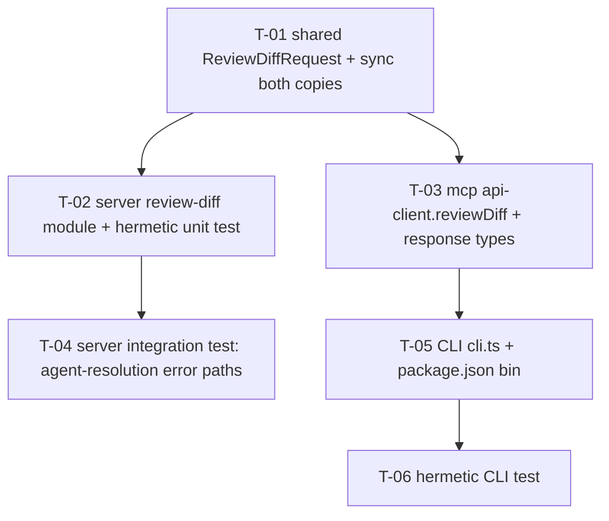

# Development Plan: Pre-push CLI (`devdigest review --mode working`)

## Overview

Add a console command to the existing `@devdigest/mcp-server` package that reviews a developer's
**local working copy** (uncommitted `git diff`) **before** anything is pushed or a PR is opened.
The command collects the working-tree diff, sends it over HTTP to a new synchronous server endpoint,
and prints the returned findings to the terminal. The server endpoint reuses the **exact same review
engine** (`reviewPullRequest` in `@devdigest/reviewer-core`) that the PR-page flow uses — this is a
new *entry point* into the existing reviewer, not a parallel reviewer. `--mode working` is the only
mode implemented; the flag shape is reserved for future `staged`/`branch` modes.

## Requirements

- R1: New Zod request contract `ReviewDiffRequest` (`{ diff: string, agentId?: string }`) added to
  `@devdigest/shared` and synced to both vendor copies. The response reuses the **existing** shared
  `Review` schema (verdict/summary/score/findings) — no new response contract.
- R2: New synchronous server endpoint `POST /review/diff` in a **new** self-contained module
  `server/src/modules/review-diff/`. It resolves an agent, parses the raw diff with the existing
  `parseUnifiedDiff`, calls `reviewPullRequest` with the injected LLM provider, and returns the
  grounded `Review` in the HTTP response. No repo-intel enrichment, no PR/intent, **no persistence**,
  no SSE.
- R3: Agent resolution: `agentId` (optional) → `agentsRepo.getById`; when omitted → first
  `agentsRepo.listEnabled(workspaceId)`. When no agent is enabled, return a clear 400 error the CLI
  can print verbatim.
- R4: New typed client method `reviewDiff(diff, agentId?)` on `mcp-server`'s `ApiClient`, following
  the existing `request<T>`/`ApiError` pattern, with a response type accurate to the raw `Review`
  shape (findings carry `start_line`/`end_line`/`rationale`/`suggestion`).
- R5: New CLI entry `mcp-server/src/cli.ts` wired as `bin: { "devdigest": "dist/cli.js" }`. Parses
  `devdigest review --mode working` with Node's built-in `node:util` `parseArgs` (no new dependency);
  `--mode staged`/`--mode branch` are recognized but reply "not implemented"; missing/unknown mode →
  usage error with non-zero exit.
- R6: The CLI shells out to `git diff` in the current working directory, handles the clean-tree case
  (exit 0, friendly message) and the not-a-git-repo case (non-zero exit, clear error), and prints
  findings in a human-readable terminal format (severity, `file:line`, title, body, plus
  verdict/score/count header).
- R7: Error handling maps every failure to a clear terminal message (never a raw stack trace):
  server unreachable, empty/malformed diff, no enabled agent, and provider misconfigured (missing
  API key surfaced by the server as `config_error`).
- R8: The CLI never reads secrets — only the server resolves the LLM key from
  `~/.devdigest/secrets.json`. The CLI speaks HTTP only; it must not import `server/` or
  `reviewer-core/`.
- R9: Hermetic tests: a server unit test of the pure diff→`Review` path (mock LLM, no DB/Docker), a
  server integration test of the endpoint's agent-resolution error paths, and a CLI test that mocks
  `git diff` and `fetch`.

## Affected modules & contracts

- `@devdigest/shared` — **add** `ReviewDiffRequest` to `contracts/review-api.ts` (co-located with the
  existing `ReviewRunResponse`/`ReviewRecord`). Response reuses the existing `Review`
  (`contracts/findings.ts:66`). Both vendor copies (`server/src/vendor/shared/`,
  `client/src/vendor/shared/`) updated in the same task.
- `server/` — **new module** `server/src/modules/review-diff/` (routes + service + tests) and one line
  in `server/src/modules/index.ts` to register it. No DB schema change, no migration.
- `mcp-server/` — **edit** `src/lib/api-client.ts` (new method + response types); **add** `src/cli.ts`
  and `src/__tests__/cli.test.ts`; **edit** `package.json` (add `bin`). The MCP stdio server
  (`src/index.ts`) and its 5 tools are **untouched** — this is additive.
- Contracts: `ReviewDiffRequest` (new, in `@devdigest/shared`); `Review` (existing, reused).

## Architecture notes

- **Reuse point (verified).** `reviewPullRequest(input: ReviewInput)`
  (`reviewer-core/src/review/run.ts:128`) is diff-source-agnostic: it takes a parsed `UnifiedDiff` +
  resolved agent inputs + an injected `LLMProvider` and returns a grounded `Review`. It performs no
  I/O beyond the LLM call. The server's PR flow builds its `ReviewInput` in
  `ReviewRunExecutor.runOneAgent` (`server/src/modules/reviews/run-executor.ts:223`); the new endpoint
  builds a **minimal** `ReviewInput` (systemPrompt, model, diff, llm, task, optional skills/strategy)
  and skips everything PR-specific.
- **Diff parsing (verified).** `parseUnifiedDiff(raw)`
  (`server/src/adapters/git/diff-parser.ts:14`) parses standard `git diff` text into a `UnifiedDiff`.
  A CLI running plain `git diff` produces the identical text format, so it is directly reusable with
  zero changes. **Precedent:** the `reviews` module already imports it from an application-layer file
  (`server/src/modules/reviews/diff-loader.ts:3`), so the new `review-diff/service.ts` doing the same
  is consistent with existing practice (an accepted onion `warn`, not a new violation — `parseUnifiedDiff`
  is a pure function, not an I/O adapter).
- **Onion placement.** New module follows the "one self-contained Fastify plugin per module"
  convention (`server/CLAUDE.md`). Transport `routes.ts` → Application `service.ts` → ports
  (`container.llm`, `container.agentsRepo`) + the pure `parseUnifiedDiff` helper + core
  `reviewPullRequest`. `routes.ts` imports no adapters and no `db/schema`; it uses `getContext`
  (`server/src/modules/_shared/context.ts:14`) for workspace resolution exactly like every other
  route. The service uses `container.agentsRepo` (never raw Drizzle — the onion invariant flagged in
  `server/INSIGHTS.md` 2026-06-26).
- **Why a new module, not `reviews`.** The `reviews` module is entirely PR-centric (pull_id, runs,
  SSE, persistence, `POST /pulls/:id/review`). The pre-push flow has no PR, no persistence, and is
  synchronous. A separate module keeps owned paths clean and the reviews module untouched.
- **Why reuse `Review` for the response.** `reviewPullRequest` returns `outcome.review` which is a
  shared `Review`. Returning it directly gives the CLI the same structured findings shape the engine
  produces, uses an already-shared contract (no orphan schema), and lets the route enforce it via
  `response: { 200: Review }`.
- **Request contract in `@devdigest/shared`.** Matches the precedent that review request bodies are
  shared Zod contracts (`RunRequest`, `contracts/platform.ts:275`). `mcp-server` does **not** import
  `@devdigest/shared` (its architecture rule — HTTP only, local structural types); it mirrors the
  shape with a local `interface`, exactly as its `api-client.ts` already does for `Agent`/`Run`/`Review`.
- **`--mode` is a client-only concept.** The server endpoint only takes a diff string; it does not
  know or care about `working`/`staged`/`branch`. `--mode` selects *which* diff the CLI collects
  (`working` → `git diff`). Reserving the flag now costs nothing server-side.
- **CLI in `mcp-server`.** `mcp-server` is not part of the server onion — it is an independent HTTP
  client (like the web client). The CLI is a normal console program: unlike the MCP stdio server
  (`index.ts`), it MAY write to stdout freely. It must not import `server/` or `reviewer-core/`.

## INSIGHTS summary

- [server]: `src/vendor/shared/` is do-not-touch-without-sync — any change to `contracts/review-api.ts`
  must be mirrored in `client/src/vendor/shared/contracts/review-api.ts` in the same change.
- [server]: A service must never issue raw Drizzle queries — resolve agents via `container.agentsRepo`
  (onion invariant; `server/INSIGHTS.md` 2026-06-26). The new service holds no `db` import.
- [server]: `container.llm(provider)` throws `ConfigError` ("`<PROVIDER>_API_KEY` is not configured")
  when the key is missing (`server/src/platform/container.ts:173-193`); the error handler returns it
  as `{ error: { code: 'config_error', message } }` with status 500
  (`server/src/app.ts:153-156`). The CLI must render `error.message`, not a stack trace.
- [reviewer-core]: `reviewPullRequest` is pure — the only side effect is the injected `LLMProvider`,
  so the hermetic test stubs it (no keys, no network) via `MockLLMProvider`
  (`server/src/adapters/mocks.ts:58`). The fixture `Review`'s finding must cite a `start_line` that
  intersects a real hunk in the sample diff, or the citation-grounding gate drops it.
- [mcp-server]: The existing `api-client.ts` `Finding` interface (`line`, `body`;
  `mcp-server/src/lib/api-client.ts:25-32`) does **not** match the raw `Review` finding shape returned
  by `/review/diff`, which carries `start_line`/`end_line`/`rationale`/`suggestion` (see
  `server/src/modules/reviews/helpers.ts:34`). The new client method needs its **own** accurate
  response type; do not reuse the existing `Finding`/`Review` interfaces.
- [mcp-server]: The package builds all of `src/**` to `dist/` via `tsc`; adding `src/cli.ts` emits
  `dist/cli.js` automatically. TypeScript preserves a leading `#!/usr/bin/env node` shebang line.

## Phased tasks

> Phase 1 lands the shared contract that both the server route and the CLI client depend on.
> Phase 2 builds the server endpoint (with a Docker-free unit test) and the mcp-server client method
> **concurrently** (different packages, non-overlapping paths). Phase 3 adds the server integration
> edge-case test and the CLI entry **concurrently**. Phase 4 adds the hermetic CLI test. Each phase
> is independently mergeable: after P1 the contract compiles in both copies; after P2 the endpoint
> works and is unit-tested and the client method typechecks; after P3 the CLI runs end-to-end and the
> endpoint's error paths are integration-tested; after P4 the CLI is covered by hermetic tests.



### Phase 1 — Shared contract

#### T-01: Add `ReviewDiffRequest` to `@devdigest/shared` (both vendor copies)

- **Action:** In `server/src/vendor/shared/contracts/review-api.ts`, add:
  ```ts
  export const ReviewDiffRequest = z.object({
    diff: z.string().min(1),
    agentId: z.string().uuid().optional(),
  });
  export type ReviewDiffRequest = z.infer<typeof ReviewDiffRequest>;
  ```
  (`z` and `Finding`/`Verdict` are already imported in that file.) The response type is the **existing**
  `Review` (`contracts/findings.ts`, already barrel-exported) — do **not** add a new response schema.
  Then copy the identical edit into `client/src/vendor/shared/contracts/review-api.ts` so both vendor
  copies stay byte-identical. Do not touch any other contract file.
- **Why:** Satisfies R1. Both the server route (`schema.body`) and the mcp client shape depend on this
  contract, so it must land first as the earliest task in the DAG.
- **Module:** server (+ client vendor copy)
- **Type:** backend
- **Skills to use:** zod, typescript-expert
- **Owned paths:** `server/src/vendor/shared/contracts/review-api.ts`,
  `client/src/vendor/shared/contracts/review-api.ts`
- **Depends-on:** none
- **Risk:** low
- **Known gotchas:** `src/vendor/shared/` is do-not-touch-without-sync — the two copies MUST be updated
  together (`server/CLAUDE.md` "Do-not-touch"). `client/` is a manual copy, not a symlink. Keep the
  field name `agentId` (camelCase) to match the existing `RunRequest.agentId` convention.
- **Acceptance:** `cd server && pnpm exec tsc --noEmit` exits 0 and `cd client && pnpm typecheck`
  exits 0; `grep -n "ReviewDiffRequest" server/src/vendor/shared/contracts/review-api.ts` and
  `grep -n "ReviewDiffRequest" client/src/vendor/shared/contracts/review-api.ts` both match; the two
  files are identical (`diff server/src/vendor/shared/contracts/review-api.ts client/src/vendor/shared/contracts/review-api.ts` prints nothing).

### Phase 2 — Server endpoint & typed client (concurrent)

#### T-02: New `review-diff` server module (`POST /review/diff`) + hermetic unit test

- **Action:** Create a self-contained Fastify module `server/src/modules/review-diff/`:
  - `service.ts` exporting a **pure** function and a service class:
    ```ts
    export async function reviewWorkingDiff(input: {
      systemPrompt: string; model: string; rawDiff: string; llm: LLMProvider;
      strategy?: ReviewStrategy; skills?: string[];
    }): Promise<Review>
    ```
    It calls `parseUnifiedDiff(input.rawDiff)` (import from `../../adapters/git/diff-parser.js`, the
    same import path `reviews/diff-loader.ts:3` uses); if `diff.files.length === 0` it throws
    `ValidationError('Diff contained no recognizable file changes')` (from `../../platform/errors.js`,
    → 422). Otherwise it calls `reviewPullRequest({ systemPrompt, model, diff, llm, task: WORKING_TASK,
    ...(skills?.length ? { skills } : {}), ...(strategy ? { strategy } : {}) })` and returns
    `outcome.review`. Define `WORKING_TASK` inline as a trusted task line, e.g. "Review the following
    local working-copy changes (uncommitted, not yet pushed). Report only distinct, high-value findings
    you can defend, each citing an exact file and line that appears in the diff. Zero findings is a
    valid result." (Do **not** import `reviews/helpers.taskLine` — it needs a `PullRow`, and importing
    it would create a cross-module edge.)
    `ReviewDiffService` (constructed with the `Container`) exposes
    `reviewDiff(workspaceId, diff, agentId?): Promise<Review>` which:
    (1) resolves the agent — if `agentId` given, `container.agentsRepo.getById(workspaceId, agentId)`
    and throw `NotFoundError('Agent not found')` if absent; else take the first of
    `container.agentsRepo.listEnabled(workspaceId)` and throw
    `new AppError('no_enabled_agent', 'No enabled review agent found. Enable an agent in the DevDigest UI first.', 400)`
    when the list is empty;
    (2) resolves `const llm = await container.llm(agent.provider as Provider)` (let `ConfigError`
    bubble on a missing key);
    (3) loads the agent's enabled skills the same way as the executor
    (`container.agentsRepo.linkedSkills(agent.id)` filtered to `l.enabled && l.skill.enabled`, mapped
    to `` `### ${l.skill.name}\n${l.skill.body}` ``);
    (4) returns `reviewWorkingDiff({ systemPrompt: agent.systemPrompt, model: agent.model,
    rawDiff: diff, llm, strategy: agent.strategy ?? undefined, skills })`.
  - `routes.ts` (default Fastify plugin, `withTypeProvider<ZodTypeProvider>()`): register
    `app.post('/review/diff', { schema: { body: ReviewDiffRequest, response: { 200: Review } },
    config: { rateLimit: { max: 10, timeWindow: '1 minute' } } }, handler)` where the handler does
    `const { workspaceId } = await getContext(container, req); return service.reviewDiff(workspaceId,
    req.body.diff, req.body.agentId);`. Import `ReviewDiffRequest` and `Review` from `@devdigest/shared`.
    The 10/min rate limit mirrors the reviews route (`server/src/modules/reviews/routes.ts:29`) because
    each call triggers an expensive synchronous LLM run.
  - Register the module: add `import reviewDiff from './review-diff/routes.js';` and a `reviewDiff,`
    entry to the `modules` record in `server/src/modules/index.ts`.
  - `service.test.ts` (hermetic, no DB/Docker): import `reviewWorkingDiff` and `MockLLMProvider`
    (`../../adapters/mocks.js`). Case (a): a small valid `git diff` string + a `MockLLMProvider('openai',
    { structured: <fixture Review> })` whose single finding's `start_line` lands inside a hunk of the
    sample diff → assert the returned `Review` keeps that finding and has the fixture's verdict/score.
    Case (b): a fixture finding citing a line NOT in the diff → assert grounding drops it (findings
    length 0). Case (c): `rawDiff = ''` (or a string with no `diff --git` header) → assert it rejects
    with a `ValidationError`.
- **Why:** Satisfies R2 and R3. This is the new entry point into the existing reviewer; without it the
  CLI has nothing to call. The pure `reviewWorkingDiff` is extracted so the diff→`Review` path is
  testable with zero DB/Docker (the DB-touching agent resolution is exercised separately in T-04).
- **Module:** server
- **Type:** backend
- **Skills to use:** onion-architecture-node, fastify-best-practices, zod, typescript-expert
- **Owned paths:** `server/src/modules/review-diff/service.ts`,
  `server/src/modules/review-diff/routes.ts`, `server/src/modules/review-diff/service.test.ts`,
  `server/src/modules/index.ts`
- **Depends-on:** T-01
- **Risk:** medium
- **Known gotchas:** No persistence — do NOT create `agent_runs`/`reviews`/`findings` rows or touch the
  `runBus`; there is no PR. No repo-intel, no intent, no PR description. `container.llm(provider)` throws
  `ConfigError` on a missing key — let it bubble (the app error handler turns it into a 500
  `config_error` the CLI prints). The service must use `container.agentsRepo`, never a raw Drizzle query
  (onion invariant; `server/INSIGHTS.md` 2026-06-26). The grounding gate silently drops findings whose
  `start_line` is not inside a diff hunk — the fixture in case (a) must cite a real changed line.
- **Acceptance:** `cd server && pnpm exec vitest run --exclude '**/*.it.test.ts' review-diff` passes
  all three cases; `cd server && pnpm exec tsc --noEmit` exits 0;
  `grep -n "review-diff/routes" server/src/modules/index.ts` matches (module registered);
  `grep -rn "container.db\|drizzle-orm\|db/schema" server/src/modules/review-diff/service.ts` returns
  nothing (no raw DB access).

#### T-03: Add `reviewDiff` method + response types to `mcp-server` API client

- **Action:** Edit `mcp-server/src/lib/api-client.ts`. Add response interfaces that are **accurate to
  the raw `Review`** the endpoint returns (do not reuse the existing `Finding`/`Review` interfaces —
  they model the persisted PR DTO with `line`/`body`, which `/review/diff` does not return):
  ```ts
  export interface DiffFinding {
    severity: string; category: string; title: string; file: string;
    start_line: number; end_line: number; rationale: string; suggestion: string | null;
  }
  export interface DiffReview {
    verdict: string; summary: string; score: number; findings: DiffFinding[];
  }
  ```
  Add `reviewDiff(diff: string, agentId?: string): Promise<DiffReview>;` to the `ApiClient` interface,
  and implement it in the `createApiClient` return object using the existing `request<T>` helper:
  `POST /review/diff` with `Content-Type: application/json` and body
  `JSON.stringify({ diff, ...(agentId ? { agentId } : {}) })`. Reuse the existing `ApiError` throwing
  behavior (non-2xx → `ApiError` with `res.status`). Do not modify any existing method, the MCP tools,
  or `index.ts`. Do not import from `server/` or `reviewer-core/`.
- **Why:** Satisfies R4. The CLI needs a single typed transport method so its logic stays I/O-free and
  testable via a stubbed `fetch`, consistent with how the MCP tools already consume the client.
- **Module:** mcp-server
- **Type:** core
- **Skills to use:** typescript-expert
- **Owned paths:** `mcp-server/src/lib/api-client.ts`
- **Depends-on:** T-01
- **Risk:** low
- **Known gotchas:** The existing `Finding` interface (`line`/`body`;
  `mcp-server/src/lib/api-client.ts:25-32`) is NOT the shape of `/review/diff` findings (which are
  `start_line`/`end_line`/`rationale`/`suggestion`) — define the new `DiffFinding`/`DiffReview` types
  and keep them separate. `fetch` is a Node built-in — do not add `node-fetch`. A non-2xx response does
  not reject `fetch`; the shared `request<T>` already checks `res.ok` and throws `ApiError`.
- **Acceptance:** `cd mcp-server && pnpm exec tsc --noEmit -p tsconfig.json` exits 0;
  `grep -n "reviewDiff" mcp-server/src/lib/api-client.ts` matches; the file contains no import path
  referencing `../../server` or `../../reviewer-core` (grep returns nothing).

### Phase 3 — Integration edge-cases & CLI entry (concurrent)

#### T-04: Server integration test — agent-resolution error paths for `POST /review/diff`

- **Action:** Create `server/src/modules/review-diff/routes.it.test.ts` (integration; `.it.test.ts`
  suffix so it runs only under the Docker suite). Boot the app via the project's test app builder with
  a `ContainerOverrides.llm = { openai: new MockLLMProvider('openai', { structured: <fixture Review> }) }`
  override (follow the existing `.it.test.ts` boot pattern in the `reviews`/other server modules; use
  `app.inject` for requests). Seed/insert one enabled agent with `provider: 'openai'` via the agents
  repository. Cases:
  (a) **happy path** — `POST /review/diff` with a valid diff string (a real `diff --git … @@ … @@` body
  whose changed line matches the fixture finding's `start_line`) and no `agentId` → 200 with a body
  matching the shared `Review` shape (verdict/summary/score/findings), the kept finding present;
  (b) **no enabled agent** — with all agents disabled/absent, `POST /review/diff` → 400 and
  `body.error.code === 'no_enabled_agent'` with the "Enable an agent in the DevDigest UI first." message;
  (c) **unknown agentId** — `POST /review/diff` with `agentId` set to a random UUID → 404 and
  `body.error.code === 'not_found'`.
- **Why:** Satisfies R3 and R9 for the DB-backed paths. Agent resolution and the endpoint error
  envelope cannot be exercised by the Docker-free unit test in T-02; this is the explicit
  integration edge-case task (error formats/status codes are binary-asserted here, not hidden in the
  impl task).
- **Module:** server
- **Type:** backend
- **Skills to use:** fastify-best-practices, typescript-expert
- **Owned paths:** `server/src/modules/review-diff/routes.it.test.ts`
- **Depends-on:** T-02
- **Risk:** medium
- **Known gotchas:** `MockLLMProvider` only accepts id `'openai' | 'anthropic'`
  (`server/src/adapters/mocks.ts:58`) — seed the agent with a matching provider. The fixture `Review`
  finding must cite a `start_line` inside the diff hunk or grounding drops it and the happy-path
  assertion on `findings.length` fails. This suite requires Docker (Postgres) per `server/CLAUDE.md`.
- **Acceptance:** `cd server && pnpm exec vitest run review-diff.it.test` passes all three cases
  (Docker running).

#### T-05: CLI entry `mcp-server/src/cli.ts` + `bin` wiring

- **Action:** Create `mcp-server/src/cli.ts` with `#!/usr/bin/env node` as the **first line**. Export
  testable units and an executable tail:
  - `parseCliArgs(argv: string[]): { command: string; mode: string }` using `parseArgs` from
    `node:util`: `parseArgs({ args: argv, options: { mode: { type: 'string' } }, allowPositionals: true })`.
    Require `positionals[0] === 'review'` and `values.mode === 'working'`. Throw a `UsageError` (a local
    `Error` subclass) with a usage string (`Usage: devdigest review --mode working`) when the command is
    missing/unknown or `--mode` is absent. When `mode` is `staged` or `branch`, throw a `UsageError`
    with `Mode '<mode>' is not implemented yet. Only '--mode working' is supported.`
  - `getWorkingDiff(cwd: string): Promise<string>` using `execFile` from `node:child_process` (promisified):
    `execFile('git', ['diff'], { cwd, maxBuffer: 64 * 1024 * 1024 })`, returning `stdout`. On rejection
    whose message includes `not a git repository`, throw a clear `Error('Not a git repository. Run devdigest review from inside a git repo.')`; rethrow other git errors with their message.
  - `formatReview(review: DiffReview): string` — a header line
    `` `DevDigest review — working tree · ${review.verdict} · ${review.score}/100 · ${review.findings.length} finding(s)` ``,
    the `summary`, then per finding: `` `[${f.severity}] ${f.file}:${f.start_line}` `` (append
    `` `-${f.end_line}` `` when `end_line !== start_line`), the `title`, the `rationale` body, and
    `Suggestion: <suggestion>` when present. (Maps the raw `Review` finding fields to the terminal
    display; this is the `severity/title/file/line/body` shaping the `run-agent-on-pr` MCP tool uses,
    with `line ← start_line`, `body ← rationale`.)
  - `runCli(argv, deps)` orchestration where `deps` inject `{ getDiff, client, cwd, out, err, exit }`
    (defaulting to real `getWorkingDiff`, `createApiClient()`, `process.cwd()`, `console.log`,
    `console.error`, `process.exit`) so the test can substitute fakes: parse args → get the working diff
    → if the diff is empty/whitespace, print `No uncommitted changes to review.` and exit 0 → else call
    `client.reviewDiff(diff)` and print `formatReview(...)`, exit 0. Error handling: `UsageError` →
    print message to stderr, exit 2; `ApiError` → parse and print `Review failed: <message>` (read the
    `{ error: { message } }` envelope when present) to stderr, exit 1; a `fetch`/network failure (server
    down) → `Cannot reach the DevDigest API at <baseUrl>. Is the server running? (start it with ./scripts/dev.sh)`,
    exit 1; any other error → print its `message`, exit 1.
  - Executable tail: `if (process.argv[1] && import.meta.url === pathToFileURL(process.argv[1]).href) void runCli(process.argv.slice(2), {});`.
  - Add `"bin": { "devdigest": "dist/cli.js" }` to `mcp-server/package.json`. Do not change the existing
    `scripts`/`dependencies`; `parseArgs`, `execFile`, and `fetch` are all Node built-ins — add no new
    dependency. Do not touch `src/index.ts` or any MCP tool.
- **Why:** Satisfies R5, R6, R7, R8. This is the user-facing command; without it there is no pre-push
  entry point. Structuring `runCli`/`parseCliArgs`/`formatReview`/`getWorkingDiff` as exported units
  makes the flow hermetically testable in T-06.
- **Module:** mcp-server
- **Type:** core
- **Skills to use:** typescript-expert
- **Owned paths:** `mcp-server/src/cli.ts`, `mcp-server/package.json`
- **Depends-on:** T-03
- **Risk:** medium
- **Known gotchas:** The `#!/usr/bin/env node` shebang must be the very first line — TypeScript
  preserves it in `dist/cli.js`. `git diff` shows only tracked, unstaged changes (not untracked/new
  files) — that is the intended `working` scope; `staged` (`git diff --cached`) is explicitly reserved,
  not implemented. Set a large `maxBuffer` on `execFile` or big diffs fail with `ENOBUFS`. The CLI must
  never read `~/.devdigest/secrets.json` — the server owns the LLM key. Editing string literals with the
  Edit tool can corrupt ASCII quotes to curly quotes (`reviewer-core/INSIGHTS.md` 2026-06-24) — verify
  `tsc` after edits.
- **Acceptance:** `cd mcp-server && pnpm exec tsc --noEmit -p tsconfig.json` exits 0;
  `cd mcp-server && pnpm build` emits `dist/cli.js`;
  `node mcp-server/dist/cli.js review --mode staged` prints a "not implemented" message and exits
  non-zero (`echo $?` ≠ 0); `node mcp-server/dist/cli.js` (no args) prints usage and exits non-zero;
  `grep -n '"devdigest"' mcp-server/package.json` matches under a `bin` key; the first line of
  `mcp-server/src/cli.ts` is `#!/usr/bin/env node`.

### Phase 4 — CLI test

#### T-06: Hermetic CLI test (mock `git diff` + mock `fetch`)

- **Action:** Create `mcp-server/src/__tests__/cli.test.ts`. Import `runCli`, `parseCliArgs`, and
  `formatReview` from `../cli.js`. Drive `runCli` with injected `deps` (a fake `getDiff`, a fake
  `client` with a stubbed `reviewDiff`, and captured `out`/`err`/`exit`) — or, equivalently, `vi.mock`
  `node:child_process` and `vi.stubGlobal('fetch', …)`. Cases:
  (a) **happy path** — `getDiff` returns a non-empty diff; `client.reviewDiff` resolves a `DiffReview`
  with one finding → assert `out` contains the severity, `file:start_line`, title, and the
  verdict/score/count header, and `exit` was called with 0;
  (b) **clean tree** — `getDiff` returns `''` → assert `out` contains `No uncommitted changes to review.`
  and `exit(0)`, and `client.reviewDiff` was never called;
  (c) **not a git repo** — `getDiff` rejects with a "Not a git repository" error → assert `err` contains
  the message and `exit` was called non-zero;
  (d) **invalid mode** — `parseCliArgs(['review', '--mode', 'staged'])` (or `runCli` with those args)
  → assert it reports "not implemented" and exits non-zero;
  (e) **server down** — `client.reviewDiff` rejects with a network error → assert `err` contains
  `Cannot reach the DevDigest API` and `exit` non-zero.
- **Why:** Satisfies R9 for the CLI. Verifies argument parsing, the clean-tree/no-repo branches, output
  formatting, and forward-guiding error messages without a real git repo or a running server.
- **Module:** mcp-server
- **Type:** core
- **Skills to use:** typescript-expert
- **Owned paths:** `mcp-server/src/__tests__/cli.test.ts`
- **Depends-on:** T-05
- **Risk:** low
- **Known gotchas:** Prefer injecting `deps` into `runCli` over spawning a real process — no real `git`
  or server needed, deterministic. If you stub `process.exit`, capture the code rather than letting it
  terminate the test runner. The `tsconfig` excludes `src/__tests__/**` from `build`; vitest still runs
  them.
- **Acceptance:** `cd mcp-server && pnpm exec vitest run src/__tests__/cli.test.ts` passes all five
  cases.

## Testing strategy

- Server unit (Docker-free): `cd server && pnpm exec vitest run --exclude '**/*.it.test.ts' review-diff`
  — the pure `reviewWorkingDiff` path with `MockLLMProvider` (T-02).
- Server integration (Docker): `cd server && pnpm exec vitest run review-diff.it.test` — endpoint
  agent-resolution + error envelope (T-04).
- Server typecheck: `cd server && pnpm exec tsc --noEmit`; client typecheck: `cd client && pnpm typecheck`
  (the vendor-copy sync).
- mcp-server typecheck/build: `cd mcp-server && pnpm exec tsc --noEmit -p tsconfig.json && pnpm build`.
- mcp-server unit (hermetic): `cd mcp-server && pnpm exec vitest run src/__tests__/cli.test.ts` (T-06).
- Manual end-to-end: with the API running (`./scripts/dev.sh`) and a provider key configured, run
  `cd mcp-server && pnpm build && node dist/cli.js review --mode working` from inside a repo with
  uncommitted changes.

## Risks & mitigations

- **Onion drift: service imports the pure `parseUnifiedDiff` from `src/adapters/`.** — Accepted and
  consistent with the existing `reviews/diff-loader.ts:3` precedent; `parseUnifiedDiff` is a pure
  function, not an I/O adapter. Flagged in Architecture notes; no new SDK import is introduced.
- **Finding-shape mismatch between the persisted DTO and the raw `Review`.** — Addressed by defining a
  dedicated `DiffFinding`/`DiffReview` type in the client (T-03) instead of reusing the inaccurate
  existing `Finding` interface; the server enforces the response with `response: { 200: Review }`.
- **Grounding drops a valid-looking finding in tests.** — Test fixtures must cite a `start_line` inside
  a real diff hunk; called out in T-02/T-04 known gotchas.
- **`git diff` omits untracked files.** — Documented as the intended `working` scope; `staged`/`branch`
  are explicitly reserved (not implemented), so the limitation is bounded and named.
- **Provider key missing surfaces as a 500 to the CLI.** — The CLI prints the server's
  `error.message` ("`OPENAI_API_KEY` is not configured"), not a stack trace (T-05 error mapping); the
  CLI never reads secrets itself.
- **Shebang / bin packaging.** — `#!/usr/bin/env node` on line 1 (tsc preserves it); acceptance in T-05
  greps for it and runs `node dist/cli.js` directly, so packaging is verified.

## Red-flags check

- [x] Global Constraints have no internal contradictions (reuse-not-reimplement, no persistence,
  HTTP-only CLI, secrets server-side — all mutually consistent)
- [x] Every requirement maps to a task (R1→T-01, R2→T-02, R3→T-02+T-04, R4→T-03, R5→T-05, R6→T-05,
  R7→T-05, R8→T-05, R9→T-02+T-04+T-06)
- [x] Dependencies form a DAG (no cycles; see mermaid graph)
- [x] Concurrent tasks have non-overlapping Owned paths and parent directories (P2: T-02 `server/…`
  vs T-03 `mcp-server/src/lib/…`; P3: T-04 `server/…/review-diff/routes.it.test.ts` vs T-05
  `mcp-server/src/cli.ts` + `package.json`)
- [x] Every task description names exact file paths — no abstract descriptions
- [x] Every task is self-contained: carries the contract ref, owned paths, and a runnable acceptance
- [x] Every Acceptance is measurable with a runnable command (binary pass/fail)
- [x] Each phase produces a self-consistent, mergeable state (P1 contract compiles both copies; P2
  endpoint works + client typechecks; P3 CLI runs end-to-end + error paths integration-tested; P4 CLI
  covered)
- [x] Shared contract changes assign the same-task update to both vendor copies (T-01 updates
  `server/` and `client/` copies together)
- [x] Schema changes include `pnpm db:generate` + `pnpm db:migrate` — N/A, no DB schema change
  (ad-hoc, non-persisted review)
- [x] Integration edge-cases (rate limit, error formats, agent resolution) are explicit — T-04 asserts
  400/404 envelopes; the 10/min rate limit is configured on the route in T-02 mirroring the reviews
  route; CLI error formats are explicit T-06 cases
- [x] UI tasks: design audit — N/A, no UI in this plan
- [x] Orphan contracts: the only new `@devdigest/shared` schema (`ReviewDiffRequest`) has an
  implementation task (T-02 consumes it); the reused `Review` schema is existing and consumed by the
  route response + client type
```