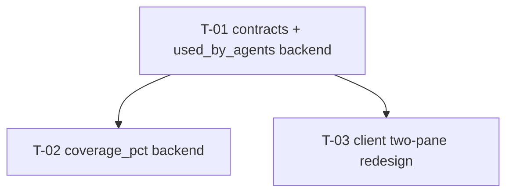

# Development Plan: Project Context page redesign (two-pane master-detail)

Source design: requester-supplied screenshot (described in the request), reconciled against the
**approved** spec `specs/SPEC-2026-07-08-project-context.md` and the already-executed feature plan
`docs/plans/project-context.md` (shipped: commit `ba908b2` "feat(project-context): implement
Project Context feature end-to-end").

> **This is a follow-on redesign, not a from-scratch build.** The Project Context feature is fully
> implemented. This plan reconciles the working UI against a new visual/product design and adds two
> new per-document data points ("Used by N agents", "Coverage %"). It deliberately reuses every
> shipped contract, endpoint, hook, and modal-render/editor helper it can, and touches only the
> Project Context page's own layout plus two small backend additions. It does **not** re-plan the
> discovery / attach / inject pipeline (that is done and correct).

## Overview

Redesign the shipped Project Context page (`client/src/app/repos/[repoId]/context/`) from today's
flat-list-plus-popup-modals into a two-pane master-detail layout matching the new mockup: a left
pane (icon toolbar + filename list + status footer) and a right pane (selected document with an
inline Preview|Edit toggle, a "Used by N agents" pill, a coverage ring, and rendered markdown).
Add one confirmed backend data point — a per-document `used_by_agents` count — and one product-gap
data point — a `coverage_pct` whose *meaning* is undefined by any prior spec and must be confirmed
before its compute task runs.

## Execution mode

**Single-agent (sequential, one implementer works through the tasks in order). CONFIRMED at
grilling.** Rationale: the change is small (3 tasks) and tightly coupled. Almost all client work
lands in one directory tree (`client/src/app/repos/[repoId]/context/_components/ProjectContextView/`),
so it cannot be partitioned into non-overlapping Owned paths for parallel implementers without
artificial activity-type splits. The DAG below still applies — it is simply executed top-to-bottom in
one pass. Owned paths are documented for scope, not as a concurrency contract.

## Requirements

<!-- Restates only what the requester confirmed (screenshot + written brief) or what the approved
     spec already ratified as a must-not-regress acceptance criterion. Nothing originated here. -->

Design/layout (requester screenshot + written brief):

- RR1: Replace the flat-list-plus-popup-modals page with a two-pane master-detail layout, under a
  breadcrumb `<repo> > Project Context`. **Format resolved by codebase precedent, not invented:**
  `client/src/app/repos/[repoId]/pulls/page.tsx:66` already renders exactly this shape —
  `crumb={[{ label: repoName, mono: true }, { label: t("list.breadcrumb") }]}` — for the sibling
  repo-scoped `pulls` route. T-03 follows this precedent verbatim (`repoName` + `mono: true`), rather
  than the shipped Project Context page's current `[{DevDigest}, {title · repo}]` shape.
- RR2: Left pane — a **compact icon toolbar** (new-file, new-folder, upload, refresh) replacing
  today's full-width labeled `Button` row; a flat list of **filename-only** rows with a file icon
  and a selected/highlighted state; a filter box preserved.
- RR3: Left-pane **footer status line** re-skinned to the mockup's "Indexed: N files · … · last Xm
  ago" shape, but using the **total estimated token count** (spec Non-goals + AC-40:
  `file_count` + summed `ceil(length/4)` `token_estimate` + last-scan timestamp) — reusing the
  shipped `footer.summary` / `footer.lastScanned` i18n. **Never** the word "chunks".
- RR4: Right pane — the selected document shown full width: filename as a title; a **Preview|Edit
  segmented toggle** replacing the separate popup `PreviewModal`/`EditDocModal`; rendered markdown
  in-pane in Preview mode; an inline CodeMirror editor in Edit mode.
- RR5: Right pane — a **"Used by N agents" pill** showing the per-document agent-usage count
  (backend data point below).
- RR6: Right pane — a **circular ring "N COVERAGE" percentage indicator**, reusing the existing
  `StatsTab` `RingChart` SVG pattern (not a new chart).

Backend data points (requester brief — confirmed to implement for real):

- RR7: The discovery response carries, per document, a `used_by_agents` count (new confirmed field).
- RR8: A real `coverage_pct` value is produced for the ring, using the repo-level definition
  **CONFIRMED at grilling** (see D-COV): % of this repo's discovered docs referenced by ≥1 agent or
  skill. Same value renders on every document's ring — it is a repo health signal, not a
  per-document fact.

Must-not-regress (approved spec acceptance criteria that the redesign must preserve):

- RR9 (AC-1): every discovered `.md`'s `tracked` flag stays user-visible somewhere in the new row.
- RR10 (AC-7): filter-by-filename/path still narrows the list.
- RR11 (AC-8): a document's rendered markdown is still viewable (now in-pane, not a popup).
- RR12 (AC-37): an **untracked** (`tracked === false`) document is still in-app editable + savable.
- RR13 (AC-38): a **tracked** (`tracked === true`) document offers **no** Edit affordance.
- RR14 (AC-40): the page still shows total doc count + summed token estimate + last-scan time.
- RR15 (AC-21): zero discovered docs → empty state, not an error.
- RR16 (AC-11/12 spirit): any client-side token math reuses the shipped `ceil(length/4)` heuristic
  summed client-side — no new tokenizer, no extra round trip.

Scope guard (requester — explicitly OUT of scope):

- RR17: **No** changes to `client/src/vendor/ui/nav.ts`, and no new/stubbed routes for the mockup's
  other sidebar items (Eval Dashboard, Memory, Multi-Agent Review, Agent Performance, CI Runs,
  etc.). This plan is scoped to the Project Context page layout + the two new per-document data
  points only. No reviewer-core change, no change to the discovery/attach/inject pipeline, zero new
  LLM calls.

## Grilling outcomes (all resolved — see `## Decisions` for the authoritative record)

<!-- Every item below was an open Recommendation pending requester confirmation; grilling closed
     all six. Nothing in this plan is still open. -->

- Execution mode: **single-agent, sequential.** CONFIRMED.
- D-COV coverage definition: **repo-level aggregate** (% of discovered docs referenced by ≥1 agent
  or skill, same value on every doc's ring). CONFIRMED. T-02 is no longer gated.
- Metadata relocation (RR9): **secondary sub-line** under the filename (root_folder badge + tracked
  dot + token estimate), keeping rows always-visible rather than hover-only. CONFIRMED.
- Upload icon consolidation: **one icon opens a small menu** ("Upload file" / "Upload archive"),
  each routing to the existing shipped `UploadControls` flow unchanged. CONFIRMED.
- Left-pane subtitle: **keep the shipped `page.subtitle` i18n copy** — the mockup's
  `.devdigest/specs/` literal is illustrative only, not a real path in this codebase. CONFIRMED.
- D-UBA cross-repo path-collision caveat: **accepted as pre-existing, not fixed in this plan** — file
  as a follow-up if a workspace ever needs a repo-scoped count (would require a schema change to
  `agent_context_docs`/`skill_context_docs`, out of this redesign's scope). CONFIRMED.
- Breadcrumb format: **follows the `pulls/page.tsx:66` precedent** (`repoName` + `mono: true` +
  page-title label) — a codebase-precedent finding, not a requester decision (see RR1).

## Design audit

Every visible element in the mockup, mapped to a requirement or flagged as a gap.

| Panel | Element | Requirement / disposition |
| ----- | ------- | ------------------------- |
| Breadcrumb | `acme/payments-api > Project Context` | RR1 (build from `activeRepo.full_name`) |
| Left | Header "PROJECT CONTEXT" | RR2 (reuse `page.title` i18n) |
| Left | Subtitle `.devdigest/specs/` | GAP → Recommendation (subtitle literal); keep shipped `page.subtitle` pending confirmation |
| Left | Icon toolbar: new-file, new-folder, upload, refresh | RR2 (new-file→`CreateModal` file, new-folder→`CreateModal` folder, upload→`UploadControls`, refresh→`useRefreshDiscovery`) |
| Left | File rows: file icon + filename, one selected/highlighted | RR2 |
| Left | (no visible root_folder/tracked/token badges in mockup) | RR9/RR10/RR16 → Recommendation (metadata relocation): preserve AC-1 `tracked` + per-row `token_estimate` on a secondary line/badge; keep filter |
| Left | Footer "Indexed: 12 files · 1,240 chunks · last 5m ago" | RR3 + RR14 — reuse `footer.summary`/`footer.lastScanned`; **token count, never "chunks"** |
| Right | Filename title (`public-api.md`) | RR4 |
| Right | "Preview \| Edit" segmented toggle | RR4 (replaces popup modals; Edit hidden when `tracked`) |
| Right | "Used by N agents" pill | RR5 + RR7 |
| Right | Circular ring "78 COVERAGE" | RR6 + RR8 (meaning gated, D-COV) |
| Right | Rendered markdown body | RR11 (reuse shipped `Markdown` render / `PreviewModal` logic, moved in-pane) |
| Right | (edit mode) inline markdown editor | RR12 (reuse shipped `EditDocModal` CodeMirror setup, moved in-pane) |
| Sidebar | WORKSPACE/SKILLS LAB/GLOBAL groups + nav items | OUT of scope per RR17 — no change |

Orphan-contract check: every Zod schema this plan touches has an implementing task —
`DiscoveredDoc.used_by_agents` → T-01; `DiscoveryResponse.coverage_pct` → T-01 (shape) + T-02
(populate); all shipped project-context contracts are reused unchanged.

## Decisions

Following the shipped plan's D1–D6 house style. Numbered fresh for this redesign.

- **D-EXEC — Execution mode: single-agent (sequential). CONFIRMED.** See `## Execution mode`.

- **D-UBA — "Used by N agents" definition: distinct agents that would inject this doc at run time =
  direct attach ∪ enabled-skill inheritance. CONFIRMED (data point), definition recommended.**
  For a document path `P` in the current repo's workspace `W`, `used_by_agents = |A ∪ B|` where:
  - `A` = agents in `W` with a row in `agent_context_docs` for `P` (direct attach), and
  - `B` = agents in `W` linked via an **enabled** `agent_skills` row to an **enabled** skill that
    has a row in `skill_context_docs` for `P` (inherited attach).
  Rationale: the badge literally reads "Used by N **agents**", so we count agents and fold
  skill-inheritance into that count (rather than surfacing skills separately). The enabled-link /
  enabled-skill condition mirrors the run-executor's actual inheritance filter
  (`l.enabled && l.skill.enabled`, `run-executor.ts:189-195`), so the number reflects what really
  reaches a reviewer. Agents are counted regardless of their own `enabled` flag (a disabled agent
  still *references* the doc in its config — the badge is a configuration signal, not a live-run
  signal). **Caveat, explicitly accepted at grilling (not fixed in this plan):**
  `agent_context_docs`/`skill_context_docs` store bare repo-relative path strings with **no
  `repoId`** (`server/src/db/schema/project-context.ts`), so the count is inherently workspace-wide
  over that path string; two different repos in the same workspace sharing a path (e.g.
  `specs/public-api.md`) would count together. This is consistent with the existing repo-agnostic
  attach storage and is not introduced by this plan. Fixing it would require a schema migration
  (adding `repoId` to both attach tables) plus updating the attach endpoints and the run-executor's
  resolver — out of scope for this redesign; filed as a follow-up if a workspace ever needs a
  repo-scoped count.

- **D-META — Row metadata placement: secondary sub-line. CONFIRMED at grilling.** Each left-pane row
  is two lines: the filename (+ file icon) on top, then a smaller muted line carrying the
  `root_folder` badge, a tracked/untracked indicator, and the `token_estimate` — always visible, not
  hover-only. Preserves AC-1 (tracked visibility) and the token-estimate signal without regressing to
  a tooltip-only affordance, while keeping the mockup's filename-forward look.

- **D-UPLOAD — Upload affordance: single icon, popover menu. CONFIRMED at grilling.** The toolbar's
  one upload icon opens a small menu with two entries ("Upload file" / "Upload archive"), each
  invoking the existing shipped `UploadControls` flow (`useUploadFile` / `useUploadArchive`)
  unchanged. Matches the mockup's single-icon toolbar without dropping either capability.

- **D-SUBTITLE — Left-pane subtitle: keep shipped copy. CONFIRMED at grilling.** The mockup's
  `.devdigest/specs/` literal does not correspond to anything in this codebase (no `.devdigest`
  prefix exists; default root folders are `specs`/`docs`/`insights`, and a repo may have docs under
  more than one simultaneously). T-03 keeps the already-shipped `page.subtitle` i18n string rather
  than hardcoding a path or adding a new root-folder-list endpoint.

- **D-BREADCRUMB — Format: follow the `pulls/page.tsx` precedent, not a new format.** Resolved by a
  direct codebase check, not a requester decision: `client/src/app/repos/[repoId]/pulls/page.tsx:66`
  already renders `crumb={[{ label: repoName, mono: true }, { label: t("list.breadcrumb") }]}` for
  the sibling repo-scoped route — exactly the `<repo> › <Page>` shape the mockup shows. T-03 adopts
  this verbatim (`repoName` + `mono: true`) in place of the shipped Project Context page's current
  `[{DevDigest}, {title · repo}]` crumb.

- **D-COV — Coverage ring meaning: repo-level aggregate. CONFIRMED at grilling.** No "coverage"
  concept existed anywhere in the codebase for Project Context before this plan.
  `coverage_pct = round(100 × |discovered docs referenced by ≥1 agent (direct or inherited) OR ≥1
  skill| / |discovered docs|)`; `null` when zero docs are discovered (ring shows a placeholder).
  Rationale: it answers "how much of my available project context is actually wired into review",
  a meaningful config-health signal; it is computable from the same data as D-UBA plus a
  skill-attach flag; and as a single scalar it keeps the contract minimal. The per-document
  alternative ("how much of this doc's estimated tokens fit under the workspace's attached-context
  token budget") was considered and rejected — it would overload the existing token-budget warning
  concept (AC-29) for an unrelated purpose. Same value renders on every document's ring in T-03 (it
  is a repo-wide health signal, not a per-document fact) — intentional, not a bug.

- **D-SHAPE — Coverage contract shape final.** `coverage_pct: z.number().nullable()` lives on
  `DiscoveryResponse` (not `DiscoveredDoc`) per the confirmed repo-level definition. T-01 adds the
  field and populates it `null`; T-02 (no longer gated) computes the real value.

- **D-FRESH — `used_by_agents` / `coverage_pct` are computed fresh per request, never cached with
  the filesystem walk.** The shipped discovery cache (`discovery.ts`, in-memory per repo, D3 of the
  prior plan) is keyed on the filesystem scan and invalidated only by refresh. Attach changes do
  **not** trigger a rescan, so usage/coverage must be recomputed on every `discovery()`/`refresh()`
  response-assembly from a live DB query and merged onto the (possibly cached) walk result. The walk
  produces a `used_by_agents: 0` placeholder to satisfy the type; the service overwrites it.

## Affected modules & contracts

- `server/src/vendor/shared/contracts/project-context.ts` (**+ client copy**) — add
  `used_by_agents` to `DiscoveredDoc`; add `coverage_pct` (nullable) to `DiscoveryResponse`. Both
  vendor copies, same task (T-01). No other contract changes — all shipped project-context contracts
  are reused.
- `server/src/modules/project-context/` — new `repository.ts` (usage/coverage DB aggregate);
  `discovery.ts` (add the `used_by_agents: 0` placeholder); `service.ts` (merge fresh usage +
  coverage into the response). (T-01, T-02)
- `client/src/app/repos/[repoId]/context/_components/ProjectContextView/` — the two-pane redesign:
  `ProjectContextView.tsx`, `styles.ts`, `helpers.ts`, its test, a new `DetailPane/` right-pane
  component; the popup `PreviewModal/` and `EditDocModal/` are folded into the pane. `CreateModal/`
  and `UploadControls/` are reused behind the new icon toolbar. (T-03)
- `client/messages/en/context.json` — new keys for the redesign (used-by pill, coverage label,
  toggle labels, breadcrumb/header copy). (T-03)
- **No** changes to: `nav.ts`, agents/skills modules, run-executor, reviewer-core, DB schema, or the
  attach endpoints — all reused as shipped.

## Architecture notes

- **Onion placement (server).** Usage/coverage counting is Infrastructure data-access in the
  `project-context` module — a new `ProjectContextRepository` owning the aggregate over
  `agent_context_docs` / `skill_context_docs` / `agent_skills` (joined to `agents`/`skills` for
  workspace scoping). `service.ts` (Application) calls it and merges into the `DiscoveryResponse`;
  `routes.ts` is untouched (the response shape it already returns just carries two more fields).
  Reading three link tables from within this module is the established cross-module data pattern —
  it does not import the agents/skills *services*, only queries their tables via `db/schema`.
- **`used_by_agents` merge point (D-FRESH).** In `ProjectContextService.discovery`/`refresh`, after
  `getDiscovery`/`refreshDiscovery` returns the (cached) walk, call
  `repo.usageCounts(workspaceId, documentPaths)` → `Map<path, { agentCount, coveredByAny }>` and map
  it onto the docs in `toResponse`: `used_by_agents = map.get(doc.path)?.agentCount ?? 0`. `toResponse`
  gains the usage map + (gated) coverage as parameters. The filesystem-walk cache is never mutated.
- **`coverage_pct` (D-COV, gated).** Computed in `toResponse` from the same usage map's
  `coveredByAny` flags: `covered = docs.filter(d => map.get(d.path)?.coveredByAny).length`;
  `coverage_pct = docs.length ? Math.round(100 * covered / docs.length) : null`. Only wired in T-02,
  after the definition is confirmed; T-01 leaves it `null`.
- **Client two-pane (RSC vs client).** `ProjectContextView` stays `"use client"`. Selection state
  (`selectedPath`) drives the right `DetailPane`. The `DetailPane` reuses the shipped lazy
  `useDocContent(repoId, path, enabled)` hook (only fetches while a doc is selected) for both Preview
  render (`Markdown`) and Edit load, and the shipped `useEditDoc` mutation for save — i.e. the
  `PreviewModal`/`EditDocModal` render+editor logic moves into the pane verbatim, minus the `Modal`
  chrome. Edit mode is only reachable when `selectedDoc.tracked === false` (RR12/RR13); the server
  still re-checks tracked-status at save time (shipped `editFile` gate). No portal is needed for the
  right pane (it is inline layout, not an overlay) — so no mounted-guard concern there; the
  `CreateModal`/`UploadControls` popups behind the toolbar icons keep their existing `Modal` usage.
- **RingChart reuse.** Copy the self-contained ~30-line SVG `RingChart` pattern from
  `client/src/app/skills/[id]/_components/SkillEditor/_components/StatsTab/StatsTab.tsx:9-41`
  (documented in client INSIGHTS 2026-06-22) into `DetailPane` — an inline component, not a shared
  extraction, consistent with how this codebase treats these local patterns. Render a null-safe
  placeholder when `coverage_pct` is `null`.
- **Breadcrumb.** `AppShell` `crumb` becomes `[{ label: activeRepo.full_name ?? \`${owner}/${name}\` },
  { label: t("page.title") }]` (today it is `[{DevDigest}, {title · repo}]`).

## INSIGHTS summary

- [client]: SVG ring-chart for a single-value percentage stat — `<circle>` with
  `strokeDasharray="${filled} ${circ-filled}"`, `filled=(pct/100)·2πr`, `rotate(-90 cx cy)`,
  `dominantBaseline="central"` on the label; self-contained, no chart lib (2026-06-22,
  `StatsTab.tsx:RingChart`). **Reuse this for RR6.**
- [client]: `src/vendor/shared/` is a manual copy of the server contracts — every Zod change hits
  both copies in the same task (2026-06-20). Applies to T-01.
- [client]: native `<select>` is unstyleable in dark mode — use `vendor/ui/kit` `Select`
  (2026-06-22). `CreateModal`/`UploadControls` already comply; keep it if any new dropdown is added.
- [client]: `createPortal` components need `"use client"` + a mounted-guard (2026-06-22) — relevant
  only to the reused `Modal`-based `CreateModal`/`UploadControls`, not the inline right pane.
- [client]: `@testing-library/user-event` is NOT installed — use `fireEvent` in the rewritten
  `ProjectContextView.test.tsx` (2026-07-02).
- [server]: `pnpm db:generate` + `pnpm db:migrate` after schema changes — **N/A here** (no schema
  change; the attach tables already exist).
- [server]: the shipped discovery cache is filesystem-keyed and attach-agnostic — usage/coverage
  must be computed fresh per request, not folded into the cache (D-FRESH).

## Phased tasks

Execution mode is single-agent (D-EXEC), so the diagram is executed top-to-bottom in one pass:
T-01 → T-02 → T-03.

### Phase 1 — Backend data

#### T-01: Contracts + `used_by_agents` compute (both vendor copies + project-context module)

- **Action:**
  - In **both** `server/src/vendor/shared/contracts/project-context.ts` and
    `client/src/vendor/shared/contracts/project-context.ts` (byte-identical):
    add `used_by_agents: z.number().int()` to `DiscoveredDoc`; add
    `coverage_pct: z.number().nullable()` to `DiscoveryResponse` (see D-SHAPE — confirmed
    repo-level shape).
  - Create `server/src/modules/project-context/repository.ts` exporting a
    `ProjectContextRepository` with `usageCounts(workspaceId: string, paths: string[]):
    Promise<Map<string, { agentCount: number; coveredByAny: boolean }>>`. It queries, scoped to
    `workspaceId`: (a) `agent_context_docs` joined to `agents` for direct attaches, and (b)
    `skill_context_docs` joined to `skills` + `agent_skills` (enabled link, enabled skill) joined to
    `agents` for inherited attaches — per D-UBA. Build a `path → Set<agentId>` union in JS and set
    `agentCount = set.size`; set `coveredByAny = true` for any path referenced by ≥1
    `agent_context_docs` OR ≥1 `skill_context_docs` row in the workspace (for T-02's coverage). Only
    aggregate over the passed `paths`.
  - In `server/src/modules/project-context/discovery.ts` `scanRepoDocs`, add
    `used_by_agents: 0` to the constructed `DiscoveredDoc` literal (placeholder; overwritten by the
    service — D-FRESH).
  - In `server/src/modules/project-context/service.ts`: in `discovery` and `refresh`, after the
    discovery result is obtained, call `new ProjectContextRepository(container.db).usageCounts(
    workspaceId, result.documents.map(d => d.path))`; pass the map into `toResponse`, which maps
    `used_by_agents = map.get(doc.path)?.agentCount ?? 0` per doc and sets `coverage_pct: null` for
    now.
- **Why:** RR7 (confirmed per-document usage count) + the contract surface T-03's ring/pill read
  (RR5/RR6). Single-owns all `vendor/shared/` edits so no other task touches that tree.
- **Module:** project-context (+ shared) · **Type:** backend
- **Skills to use:** zod, drizzle-orm-patterns, onion-architecture-node, typescript-expert
- **Owned paths:** `server/src/vendor/shared/contracts/project-context.ts`,
  `client/src/vendor/shared/contracts/project-context.ts`,
  `server/src/modules/project-context/repository.ts` (NEW),
  `server/src/modules/project-context/discovery.ts`,
  `server/src/modules/project-context/service.ts`,
  `server/src/modules/project-context/discovery.test.ts`,
  `server/src/modules/project-context/repository.it.test.ts` (NEW),
  `server/src/modules/project-context/routes.it.test.ts`
- **Depends-on:** none
- **Risk:** medium
- **Known gotchas:** Both vendor copies must stay byte-identical (client INSIGHTS 2026-06-20). Adding
  a required field to `DiscoveredDoc` breaks every literal/factory that builds one — update
  `discovery.ts` (placeholder) and any strict shape assertion in `discovery.test.ts` /
  `routes.it.test.ts` in this task so both typechecks pass (mergeable state). Usage/coverage must be
  computed fresh per request, never folded into the filesystem cache (D-FRESH). `usageCounts` is
  DB-backed → its test is an `.it.test` (needs Docker); the vitest run-filter is a substring on the
  full path — cite `repository.it.test` (server INSIGHTS 2026-07-02).
- **Acceptance:** `cd server && pnpm typecheck` and `cd client && pnpm typecheck` both pass; a
  scratch `diff` of the two `project-context.ts` contract copies reports no differences;
  `cd server && pnpm exec vitest run src/modules/project-context/repository.it.test.ts` passes,
  covering: a doc attached directly to 2 agents → `used_by_agents === 2`; a doc attached only to a
  skill that 1 enabled agent links via an enabled link → `used_by_agents === 1`; the union counts a
  doc attached both directly and via skill once; a disabled link / disabled skill is excluded from
  inheritance; an unattached doc → `0`.

#### T-02: `coverage_pct` compute (repo-level definition, D-COV — confirmed)

- **Action:** In `server/src/modules/project-context/service.ts` `toResponse`, compute
  `covered = result.documents.filter(d => usageMap.get(d.path)?.coveredByAny).length` and
  `coverage_pct = result.documents.length ? Math.round(100 * covered / result.documents.length) :
  null`, replacing the `null` placeholder from T-01. `coveredByAny` is already produced by T-01's
  `usageCounts` — no new query needed.
- **Why:** RR8 — produces the real coverage number the ring shows, per the D-COV definition
  confirmed at grilling.
- **Module:** project-context · **Type:** backend
- **Skills to use:** onion-architecture-node, typescript-expert
- **Owned paths:** `server/src/modules/project-context/service.ts`,
  `server/src/modules/project-context/routes.it.test.ts`
- **Depends-on:** T-01
- **Risk:** low
- **Known gotchas:** Zero discovered docs → `coverage_pct` must be `null` (avoid divide-by-zero;
  ring shows a placeholder). Same fresh-per-request rule as T-01 (D-FRESH).
- **Acceptance:** `cd server && pnpm exec vitest run src/modules/project-context/routes.it.test.ts`
  passes, covering (repo-level definition): with N discovered docs of which M are referenced by ≥1
  agent or skill, `coverage_pct === Math.round(100*M/N)`; zero docs → `coverage_pct === null`.

### Phase 2 — Client redesign

#### T-03: Two-pane master-detail redesign of the Project Context page

- **Action:** Rewrite the shipped `ProjectContextView` into the two-pane layout:
  - **Breadcrumb (RR1, D-BREADCRUMB):** `AppShell crumb` → `[{ label: repoName, mono: true },
    { label: t("page.title") }]`, following `pulls/page.tsx:66`'s precedent verbatim — not the
    shipped page's current `[{DevDigest}, {title · repo}]` shape.
  - **Left pane (RR2):** replace the labeled-`Button` header row with a compact `IconBtn` toolbar:
    new-file → `setCreateMode("file")`; new-folder → `setCreateMode("folder")`; upload → a small
    popover menu ("Upload file" / "Upload archive", D-UPLOAD) each opening the existing
    `UploadControls` flow unchanged; refresh → `useRefreshDiscovery`, reusing the shipped handler.
    Render **two-line** rows (D-META): filename + file icon on top, then a secondary muted sub-line
    with the `root_folder` badge, a tracked/untracked indicator, and `token_estimate` — always
    visible, not hover-only — with a selected highlight bound to a new `selectedPath` state. Preserve
    the filter box (RR10). Keep `sortDocuments`/`filterDocuments` in `helpers.ts`.
  - **Left-pane subtitle (D-SUBTITLE):** keep the shipped `page.subtitle` i18n copy as-is — do not
    hardcode the mockup's `.devdigest/specs/` literal or add a root-folder-list endpoint.
  - **Left footer (RR3/RR14):** re-skin to the mockup shape reusing `footer.summary` (count + summed
    tokens) and `footer.lastScanned`/`neverScanned` — **no "chunks" wording** (the legacy top-level
    `context.json` `chunks` key stays unused here).
  - **Right pane (RR4/RR11/RR12/RR13) — new `DetailPane/`:** shows the selected doc (empty prompt
    when none selected). Header: filename title; a **Preview|Edit segmented toggle** (Edit control
    rendered only when `selectedDoc.tracked === false`); a **"Used by N agents" pill** reading
    `selectedDoc.used_by_agents` (RR5); a **`RingChart`** reading `data.coverage_pct` null-safe
    (RR6 — repo-level per D-COV, same value on every doc's ring, populated by T-02). Preview mode
    renders `<Markdown>` from `useDocContent` (moving `PreviewModal`'s body). Edit mode renders the
    inline CodeMirror + `@codemirror/lang-markdown` editor from `EditDocModal` (loaded via
    `useDocContent`, saved via `useEditDoc`). Delete the now-unused `PreviewModal/` and
    `EditDocModal/` component + test files.
  - **i18n:** add `context.json` keys for the used-by pill, the coverage label ("COVERAGE"), the
    upload popover menu entries, the Preview/Edit toggle (the existing `mode.preview`/`mode.edit`
    keys may be reused), and any new header/empty-detail copy.
  - **Tests:** rewrite `ProjectContextView.test.tsx` for the new layout (filename rows, selection
    drives the right pane, tracked doc shows no Edit toggle, untracked doc opens the inline editor,
    used-by pill renders, footer shows count/tokens/scan-time, empty state on zero docs). Use
    `fireEvent` (no `user-event`).
- **Why:** RR1–RR6 + RR9–RR16 — the actual redesign, reusing every shipped hook/modal-render/editor
  helper.
- **Module:** client · **Type:** ui
- **Skills to use:** react-frontend-architecture, react-best-practices, next-best-practices,
  react-testing-library, typescript-expert
- **Owned paths:**
  `client/src/app/repos/[repoId]/context/_components/ProjectContextView/ProjectContextView.tsx`,
  `client/src/app/repos/[repoId]/context/_components/ProjectContextView/styles.ts`,
  `client/src/app/repos/[repoId]/context/_components/ProjectContextView/helpers.ts`,
  `client/src/app/repos/[repoId]/context/_components/ProjectContextView/ProjectContextView.test.tsx`,
  `client/src/app/repos/[repoId]/context/_components/ProjectContextView/_components/DetailPane/` (NEW dir),
  `client/src/app/repos/[repoId]/context/_components/ProjectContextView/_components/PreviewModal/` (DELETE),
  `client/src/app/repos/[repoId]/context/_components/ProjectContextView/_components/EditDocModal/` (DELETE),
  `client/messages/en/context.json`
- **Depends-on:** T-01 (needs `used_by_agents` + `coverage_pct` on the contract). Per D-EXEC
  (single-agent, sequential), T-02 lands before T-03 starts, so the ring shows the real computed
  value from first render — no null-placeholder window in practice, though the render logic stays
  null-safe as defense in depth.
- **Risk:** medium
- **Known gotchas:** Reuse the `StatsTab` `RingChart` SVG pattern verbatim as an inline component —
  do not add a chart library (client INSIGHTS 2026-06-22). Render `coverage_pct` null-safe (zero
  discovered docs → placeholder, never `NaN`) even though T-02 runs first. The inline right pane is
  layout, not an overlay — no portal / mounted-guard needed there; keep `CreateModal`/`UploadControls`
  (still `Modal`-based) unchanged behind the toolbar icons. `@testing-library/user-event` is NOT
  installed — use `fireEvent` (2026-07-02). Keep the list stably sorted (`sortDocuments`) so it
  doesn't reorder on refetch. Do NOT touch `nav.ts` or any other route (RR17).
- **Acceptance:** `cd client && pnpm exec vitest run
  src/app/repos/[repoId]/context/_components/ProjectContextView/ProjectContextView.test.tsx` and
  `cd client && pnpm typecheck` pass; the test covers: filename rows render with a selection state,
  selecting a row shows it in the right pane, a `tracked` doc shows no Edit toggle, an untracked doc
  reveals the inline editor, the "Used by N agents" pill shows `used_by_agents`, the footer shows
  count + summed tokens + scan time (no "chunks"), and the empty state renders on zero docs.

## Testing strategy

- Unit (server): `cd server && pnpm exec vitest run --exclude '**/*.it.test.ts'` — still green
  (T-01 placeholder + discovery unchanged behavior).
- Integration (server, Docker): `cd server && pnpm exec vitest run .it.test` —
  `repository.it.test.ts` (T-01 usage counts), `routes.it.test.ts` (T-01 response shape, T-02
  coverage).
- UI: `cd client && pnpm test && pnpm typecheck` — rewritten `ProjectContextView.test.tsx`.
- E2E: out of scope (no `e2e/` flow specified for this redesign).

## Risks & mitigations

- **`used_by_agents` cross-repo path collision (D-UBA caveat).** Same path string in two workspace
  repos counts together, since attach rows carry no `repoId`. **Accepted at grilling** as
  pre-existing, out of this plan's scope; filed as a follow-up if a repo-scoped count is ever needed
  (would require a schema change).
- **Rewriting the shipped `ProjectContextView.test.tsx`** risks dropping coverage of a preserved AC.
  Mitigation: the T-03 acceptance list re-asserts every must-not-regress AC (tracked visibility,
  filter, preview, edit-gate, footer, empty state).

## Red-flags check

- [x] Execution mode stated (single-agent) — **CONFIRMED at grilling** (D-EXEC).
- [x] Every Requirements line traces to the requester's screenshot/brief or an approved-spec AC —
      nothing originated here; the coverage *meaning* was a genuine product gap and is now
      **CONFIRMED at grilling** (D-COV).
- [x] All six grilling-round items (execution mode, D-COV, metadata placement, upload icon, subtitle,
      cross-repo caveat) are resolved — see `## Grilling outcomes` and `## Decisions`. Nothing in this
      plan is open.
- [x] Design audit completed — every visible mockup element maps to a requirement or a flagged gap;
      the out-of-scope sidebar is called out.
- [x] Global constraints have no internal contradictions (scanned Requirements + Architecture notes).
- [x] Every requirement maps to a task (RR1–RR6/RR9–RR16→T-03; RR7→T-01; RR8→T-02; RR17 = scope
      guard, enforced by owned-path limits).
- [x] Dependencies form a DAG (T-01→T-02, T-01→T-03; no cycles).
- [x] Owned paths are non-overlapping among tasks that could run together; T-02 overlaps T-01/T-03
      only on `service.ts`/tests and is strictly sequenced (single-agent), never concurrent.
- [x] No phase exceeds ~7 concurrent tasks (max 2, and single-agent runs them in order anyway).
- [x] No task split by activity type forcing shared-file contention — tests live with their task.
- [x] Every cited path verified with Read/Glob or marked NEW/DELETE.
- [x] Every task names exact file paths; no abstract "update the service".
- [x] Every task is self-contained (contract ref, owned paths, runnable acceptance).
- [x] Every Acceptance is a runnable, binary command + observable.
- [x] Each phase reaches a self-consistent, mergeable state (T-01 leaves usage populated + coverage
      null-safe placeholder; T-02 populates the real coverage value; T-03 leaves a working
      redesigned page).
- [x] Shared contract change assigns both vendor copies to the same task (T-01).
- [x] No schema change (attach tables already exist) → no `db:generate`/`db:migrate` needed.
- [x] Integration edge-cases explicit: usage union / enabled-filter / zero-docs coverage in
      T-01/T-02; tracked edit-gate preserved in T-03.
- [x] Orphan contracts: `used_by_agents`→T-01, `coverage_pct`→T-01 (shape)+T-02 (populate).
