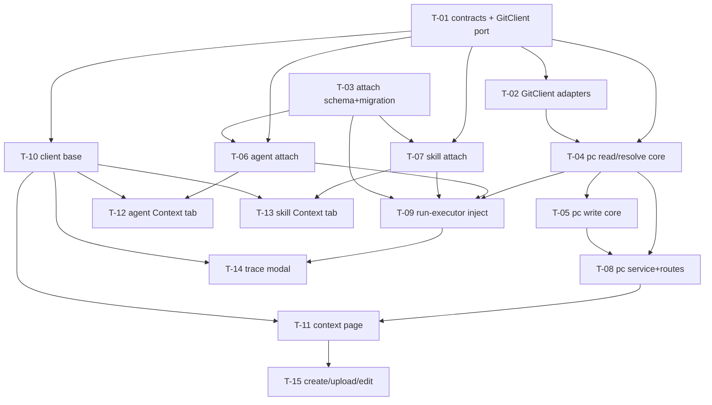

# Development Plan: Project Context

Source spec: `specs/SPEC-2026-07-08-project-context.md` (SPEC-2026-07-08-project-context, approved).

> **Rewritten from scratch** against the current spec text. The spec was substantially revised
> since the previous plan: the DevDigest-managed "virtual document" concept, its DB tables
> (`project_context_nodes`, `project_context_scans`), and the `origin: 'repo' | 'virtual'` field
> are **gone**. See `## Corrections to the prior plan (superseded decisions)` for what changed and
> `## Deferred decisions (need grilling confirmation)` for the still-open planner calls.

## Overview

Turn a repo's markdown docs under configurable root folders (`specs`/`docs`/`insights`) into
*attachable review context*. Docs are discovered live by walking the already-cloned repo's
filesystem — never a database. Users attach doc *paths* to review agents and skills; at run time
the run-executor resolves the attached paths (agent's own + inherited from attached skills), reads
current content straight off the clone, and injects it into reviewer-core's existing `specs` slot
(`## Project context`, untrusted-wrapped). Users who lack committed specs can create folders/files,
upload a single `.md` or a `.zip`, and edit content in-app — all written **directly onto the clone's
git working tree**, and editable only while the file is still git-**untracked**. The run trace
records exactly what was injected so a reviewer can audit it.

## Execution mode

**Multi-agent (parallel implementers, strict Owned-path partitioning).** The change is large and
spans independent surfaces (shared contracts, git port, schema, a new server module, agent/skill
attach, run-executor, and four client route trees) that partition cleanly by directory. Within a
single module directory (e.g. `server/src/modules/project-context/`) tasks are **sequenced**, since
concurrent implementers share no worktree isolation and must not co-write the same parent directory.

## Requirements

Re-derived directly from the current spec's acceptance criteria (AC-1..AC-40). Each traces to that
spec. Nothing here is originated by this plan.

- R1 (AC-1, AC-2): Discovery returns every `.md` under the workspace-resolved root-folder set
  (override else default `specs`/`docs`/`insights`) by walking the clone filesystem, each doc
  carrying `path`, `filename`, `root_folder`, `tracked` (git-tracked boolean), and a server-computed
  `token_estimate` (`ceil(byteLength/4)`). Metadata only — no content in the list response.
- R2 (AC-3): A refresh action invalidates the cached discovery result and re-scans the clone.
- R3 (AC-4, AC-5, AC-9): Users attach docs to an agent (append + drag-reorder) and to a skill
  (append); order is persisted.
- R4 (AC-6): Only document **path** references are stored on agent/skill metadata — never doc text;
  content lives only on the clone filesystem.
- R5 (AC-7): Client filters displayed rows by filename/path substring.
- R6 (AC-8): Preview renders a document's markdown; content fetched lazily per document.
- R7 (AC-10, AC-13, AC-15): At run time the run-executor injects the agent's own + inherited-skill
  attached docs, deduped by path with **agent-order-wins, first-occurrence position** (agent list
  walked before any skill list).
- R8 (AC-11, AC-12): Context tabs show a running token count summed client-side from already-fetched
  `token_estimate`, with no LLM call and no extra round trip per toggle.
- R9 (AC-14, AC-16): Injected docs are untrusted-wrapped under `INJECTION_GUARD`; zero added LLM
  calls.
- R10 (AC-17, AC-28, AC-30): A doc that is unresolvable / oversize (>400 KB, `MAX_FILE_SIZE`) /
  non-UTF-8 is skipped and its omission recorded, without failing the run.
- R11 (AC-18, AC-20): The run trace records injected paths (`specs_read`) and a per-run snapshot
  (`prompt_assembly.specs` + new `prompt_assembly.specs_snapshot`), authoritative even after source
  files change.
- R12 (AC-19, AC-25, AC-26): The trace "Attached Specs" row expands to a modal rendering
  `### <path>` + content per injected doc, with a search-in-block filter and a Copy control.
- R13 (AC-21, AC-22): Zero discovered docs → empty state (not error); zero attached docs → the
  `## Project context` slot is omitted (prompt byte-identical to pre-feature).
- R14 (AC-23, AC-24): Skill editor renders a display-only "SERIALIZES AS" preview
  (`## Project specifications` + one bullet per attached path); the Agent Context tab does not.
- R15 (AC-27): An attached doc whose path no longer resolves shows a "stale/missing" badge in the
  Context tab, not silently dropped.
- R16 (AC-29): When attached total token count exceeds the workspace budget (default 4000,
  configurable), the Context tab shows a non-blocking warning.
- R17 (AC-31): Create a folder under a root-folder name → `mkdir -p` on the clone filesystem;
  an empty folder is scaffolding only and does not itself appear as a discovery row.
- R18 (AC-32): Create (inline content) or upload a single `.md` file → written directly onto the
  clone filesystem, untracked until an external commit.
- R19 (AC-33, AC-34, AC-35): Upload a `.zip` → extract every `.md` entry onto disk preserving
  internal structure; ignore non-`.md` entries; reject any zip-slip entry without extracting it.
- R20 (AC-36): Any folder/file create, single-file upload, or archive entry targeting an existing
  path (tracked or untracked) is rejected as a conflict, never overwritten.
- R21 (AC-37, AC-38): A document whose live `tracked` status is `false` gets an in-app markdown
  editor + save (overwrite on disk); a `tracked === true` document gets **no** Edit action,
  regardless of how it was created.
- R22 (AC-39): A single-file or archive upload over the 10 MB `@fastify/multipart` limit is
  rejected, writing nothing.
- R23 (AC-40): The Project Context page shows total discovered doc count, summed `ceil(length/4)`
  token estimate, and the timestamp of the last discovery scan.

## Corrections to the prior plan (superseded decisions)

The current spec resolved or removed several things the prior plan (and its grilling round) had
settled. These are called out per the rewrite brief so reviewers know they are **intentionally
dropped**, not overlooked:

- **`origin: 'repo' | 'virtual'` is eliminated everywhere.** There is one document store — the
  clone filesystem. Discovery reports `tracked: boolean` instead. Every place the prior plan carried
  `origin` (discovery response, attach refs, resolver dedup key, editability gate) now uses a plain
  path (dedup key) and live git tracked-status (edit gate).
- **`project_context_nodes` is removed.** No DB table backs document content. AC's Non-goal is
  explicit: "no `project_context_nodes`-style table exists in this design." Created/uploaded/edited
  files are written to the clone working tree via `fs`. The prior plan's T-02 node table, its
  `ProjectContextRepository` node CRUD, and the virtual-vs-repo merge are all deleted.
- **`project_context_scans` (DB-backed discovery cache) is removed — this reverses the prior
  grilling decision "Discovery cache → DB-backed, not in-memory."** The spec now says only that
  results are "cached between page loads and invalidated only by the explicit refresh action," with
  no backing table, and its Non-goals ban DB persistence of this feature's data. The cache is now
  in-memory per process (see `## Deferred decisions` D3 for the accepted multi-instance trade-off).
- **Editability gate is live git tracked-status, not `origin === 'virtual'`.** AC-38 now keys on
  `tracked === true`. A file becomes permanently read-only from the app the moment any external
  commit tracks it.
- **New GitClient capability required.** No existing method reports git tracked-status; the prior
  plan had no such task. This plan adds `listTrackedFiles` to the `GitClient` port (T-01/T-02).
- **New write-path concurrency requirement.** Writes now hit a live git working tree that a
  re-clone/pull may mutate concurrently; the spec requires a serialization/locking strategy (prior
  plan had none). See D5.

Unchanged from the prior plan and still correct: the `fflate` reuse for zip extraction (already a
dependency, used by skill import), and that **reviewer-core needs no change** — `specs` slot,
`wrapUntrusted`, `INJECTION_GUARD`, `## Project context` render, and omit-when-empty behavior all
already exist and are verified below (AC-14/16/22 pre-satisfied).

## Decisions (confirmed during grilling)

The spec's `## Deferred` delegated three calls to the planner; two more surfaced from the removed DB
design. All five, plus test coverage, were interviewed and confirmed by the requester — none remain
open.

- **D1 — Attach-ref storage shape: two link tables** `agent_context_docs` / `skill_context_docs`
  (`ownerId` FK, `path`, `order`, pk `(ownerId, path)`), mirroring `agent_skills` minus
  `skillId`/`enabled`. Rationale: drag-reorder + skill-inheritance argue for first-class ordered rows
  (the spec's `## Deferred` lean), and a DB-level unique constraint on `(ownerId, path)` prevents
  duplicate attaches for free — a jsonb `string[]` column (the spec-acknowledged alternative, like
  `skills.evidenceFiles`) can't enforce that without app-level validation. **Confirmed.**
- **D2 — Version bump on context-docs change: bump.** `agent.version` / `skill.version` is stamped
  into every run trace so a past run's effective prompt is reproducible from its
  `agent_versions`/`skill_versions` snapshot (`server/src/modules/agents/repository.ts:110-146`), and
  attached paths now shape that effective prompt. The context-docs write is routed through the same
  version-bump + snapshot path used by the general `update()` (vs. `setSkills`, which incidentally
  skips it, `agents/service.ts:148-157`) — T-06/T-07's "if D2 is rejected" fallback no longer applies.
  **Confirmed.**
- **D3 — Discovery cache mechanism: in-memory per-process** `Map<repoId, { result, scannedAt }>`,
  populated on first scan, replaced on refresh (AC-3). Rationale: no shared-cache infrastructure
  (Redis or similar) exists anywhere in `server/package.json` today, so a cross-instance cache would
  mean adding new infra disproportionate to one feature's list-view freshness; the spec's own Success
  criteria language ("cold scan, cache miss") assumes a per-instance cache exists. **Accepted
  trade-off:** with multiple server instances a refresh on instance A does not invalidate instance B's
  cache; self-heals on that instance's next refresh, and the edit/write endpoints always re-check
  `tracked` status live regardless, so this staleness never affects a correctness or security
  guarantee — only the displayed list. **Confirmed.**
- **D4 — Git tracked-status mechanism: a new `GitClient.listTrackedFiles(repo, pathspecs?)` port
  method** (not an internal helper), shelling `git ls-files -z -- <rootFolders>` (one call per scan).
  Rationale: this codebase's onion architecture treats `GitClient` as the sole sanctioned boundary for
  git operations — a module shelling git directly would be a layering violation
  `architecture-reviewer` is built to catch — and the port method makes `tracked` status mockable via
  `MockGitClient` for free. **Confirmed.**
- **D5 — Write concurrency / locking: ship the MVP per-clone mutex only**, serializing this feature's
  own create/upload/edit/extract calls against each other via a `Map<clonePath, Promise>` chain. It
  does **not** serialize against the review pipeline's `git sync` → `reset --hard`
  (`server/src/adapters/git/simple-git.ts:77-88`). Verified during grilling: `reset --hard` does not
  delete untracked files (only reverts/removes tracked ones), so the actual exposure is a rare torn
  read/inconsistent scan during a concurrent sync, not data loss of user-created content; a repo-wide
  search also found **no existing per-clone lock anywhere in the codebase** — `sync()` isn't
  serialized against concurrent readers today either, so this is a pre-existing gap this plan doesn't
  regress. A full cross-module lock shared with `sync()` was considered and explicitly deferred as
  future work, consistent with the spec's own "clone volatility... accepted risk" edge case.
  **Confirmed.**
- **D6 — `test-writer`: enabled for this plan**, overriding the project's disabled-by-default
  setting (`CLAUDE.md` cost tuning), given the security-sensitive surface (path traversal on writes,
  zip-slip, prompt-injection wrap, the live tracked-status re-check race). Dispatch after the
  multi-agent `implementer` phase completes, before `architecture-reviewer`. **Confirmed.**

## Affected modules & contracts

- `server/src/vendor/shared/` (**+ client copy**) — new `contracts/project-context.ts`; extend
  `contracts/trace.ts` (`PromptAssembly.specs_snapshot`); extend `contracts/platform.ts`
  (`SettingsKnown.context_root_folders`, `context_token_budget`); add `GitClient.listTrackedFiles`
  to `adapters.ts`. Both vendor copies, same task (T-01).
- `server/src/adapters/git/simple-git.ts`, `server/src/adapters/mocks.ts` — implement
  `listTrackedFiles` (T-02).
- `server/src/db/schema/` — two new link tables `agent_context_docs`, `skill_context_docs`; one
  migration. **No node/scan/content tables.** (T-03)
- `server/src/modules/project-context/` (**NEW module**) — discovery (walk + tracked-status +
  in-memory cache), run-time resolver, archive extraction, filesystem writer + per-clone lock,
  service, routes. (T-04, T-05, T-08)
- `server/src/modules/agents/` — `context_docs` link-table persistence + `GET`/`PUT
  /agents/:id/context-docs` + `contextDocPaths(agentId)`. (T-06)
- `server/src/modules/skills/` — same for skills. (T-07)
- `server/src/modules/reviews/run-executor.ts` — resolve + read + inject specs; persist
  `specs_read` + `specs_snapshot`. (T-09)
- `client/src/app/context/` (**NEW route**) — Project Context page + authoring. (T-11, T-15)
- `client/src/app/agents/[id]/…/AgentEditor/` — Context tab. (T-12)
- `client/src/app/skills/[id]/…/SkillEditor/` — Context tab + SERIALIZES AS. (T-13)
- `client/src/app/repos/[repoId]/pulls/[number]/_components/RunTraceDrawer/` — Attached Specs modal.
  (T-14)

## Architecture notes

- **Onion placement (server).** Discovery/resolver/archive/writer are Infrastructure+Application
  logic in the new `project-context` module; `routes.ts` is Transport and never touches `db/schema`
  or `fs` directly. `run-executor` (reviews/Application) gathers agent + enabled-skill attached paths
  from the agents/skills repositories, then calls the project-context resolver — the established
  cross-module service pattern.
- **reviewer-core untouched (pre-satisfied ACs).** `assemblePrompt` already wraps each spec via
  `wrapUntrusted('spec-${i}', …)` and renders `## Project context` only when `specs.length > 0`
  (`reviewer-core/src/prompt.ts:127-130,161`), persisting it as `assembly.specs`
  (`:180`). run-executor's only job is to pass `specs` via the existing omit-when-empty spread
  already used for `skills`/`callers`/`repoMap` (`run-executor.ts:233-244`). This makes AC-14
  (untrusted), AC-16 (zero LLM calls — pure text assembly), and AC-22 (omit slot when empty →
  identical prompt) satisfied by existing code; the wiring must not regress them. `specs_snapshot` is
  set by run-executor onto the assembly object *after* `assemblePrompt` returns (nullish field, so
  `assemblePrompt` legitimately omits it — no core change).
- **Run-time read + dedup + skip (correctness core).** The resolver takes an ordered path list =
  agent's own `context_docs` ++ each enabled linked skill's `context_docs` (skills already loaded in
  run-executor via `this.agents.linkedSkills(agent.id)`, filtered `l.enabled && l.skill.enabled`,
  `run-executor.ts:189-195`). Dedup **by path, first occurrence wins**, agent list before any skill
  list (AC-15). For each surviving path: traversal-guard against `clonePathFor(repo)`
  (`path.resolve(full).startsWith(path.resolve(cloneRoot))`, the `verifyEvidence` invariant, server
  INSIGHTS 2026-06-22), read **raw bytes** via `fs.readFile` (so size + UTF-8 validity are checkable
  on bytes — `GitClient.readFile` returns an already-decoded string and can't distinguish invalid
  UTF-8), then validate. Skip + record omission (never throw) when: path unresolved (AC-17), size
  > `MAX_FILE_SIZE` 400 KB (AC-28, `repo-intel/constants.ts:43`), or content not valid UTF-8
  (AC-30). Return `{ specs: string[], snapshot: {path,content}[], read: string[] }`, all same order.
- **`specs_snapshot` vs `specs`.** `prompt_assembly.specs` is the raw wire text
  (`<untrusted source="spec-N">…`), reused verbatim by the panel-level "Copy raw output".
  `prompt_assembly.specs_snapshot` is a new ordered `{ path, content }[]` (pre-`wrapUntrusted`
  content) so the "Attached Specs" modal can render a per-path, human-readable breakdown and derive
  its token count client-side. `run_traces` persists the whole trace as one jsonb doc; a nullish new
  field is safe for old rows (`trace.ts` schema uses `.nullish()`).
- **Discovery = walk + tracked-status + cache (D3/D4).** A recursive `readdir` modeled on
  `repo-intel/pipeline/walk.ts` (never follow symlinks — `entry.isSymbolicLink()` skip, `:89`; skip
  `EXCLUDED_DIRS`; POSIX-normalize the repo-relative path via `split(sep).join('/')`, `:119`) but
  filtered to `.md` whose path is under a resolved root folder, capped at `MAX_FILE_SIZE`, with
  `token_estimate = ceil(byteLength/4)`. One `GitClient.listTrackedFiles(repo, rootFolders)` call per
  scan yields the tracked set; `tracked = trackedSet.has(path)`. Result cached in-memory per repo
  (D3); `scannedAt` feeds the page footer's last-scan time (AC-40). Repo not cloned
  (`repos.clonePath` null) → empty list, not a crash (mirrors `REPO_INTEL_ENABLED` degrade).
- **Writes go straight to the clone filesystem (R17-R22).** `mkdir -p` for folders, `fs.writeFile`
  for files/edits, `fflate.unzipSync` → per-`.md`-entry write for archives. **Every** write path is
  traversal-guarded against the clone root (spec `## Non-functional` makes this load-bearing on
  writes, not just reads) and serialized by the per-clone mutex (D5). Conflicts detected via a live
  existence check before writing (AC-36). The edit endpoint re-checks live `tracked` status at
  request time and refuses a tracked path (AC-38, and the "file became tracked mid-session" edge
  case).
- **Settings resolution.** `context_root_folders` (default `['specs','docs','insights']`) and
  `context_token_budget` (default 4000) resolve workspace-override-else-default via the same settings
  read as `getFeatureModelOverride` (`settings/feature-models.ts:36-48`). The discovery response
  carries the resolved `token_budget` so the Context tabs (AC-29) and page have it without a second
  fetch. No Settings **UI** is in scope (consistent with existing DB/API-only settings like
  `polling_interval_min`, `platform.ts:96`).
- **Attach endpoints mirror the skills-link pattern.** Separate `GET`/`PUT /agents/:id/context-docs`
  and `/skills/:id/context-docs` (like `GET`/`POST /agents/:id/skills`, `agents/routes.ts:145-160`) —
  **no change to the `Agent`/`Skill` DTOs**, keeping T-01 contract surface minimal.
- **RSC vs client.** All interactive surfaces are `"use client"`; data via TanStack Query hooks in
  `client/src/lib/hooks/project-context.ts`. Repo-scoped hooks pass `enabled: !!repoId` (client
  INSIGHTS 2026-06-26). Native `<select>` is banned — use `vendor/ui/kit` `Select` (client INSIGHTS
  2026-06-22). Portals need `"use client"` + a `mounted` guard (client INSIGHTS 2026-06-22).

## INSIGHTS summary

- [server]: user/LLM-supplied file paths must be traversal-guarded
  (`path.resolve(full).startsWith(path.resolve(root))`) before any `fs` access — the
  `conventions/extractor.ts:verifyEvidence` / `skills/import.service.ts:39` pattern (2026-06-22).
  Now applies to **writes** too.
- [server]: `fflate` (`unzipSync`/`strFromU8`, and `zipSync`/`strToU8` for tests) is already present
  and used by `skills/import.service.ts` — no new import; build in-process ZIP buffers in unit tests
  (2026-06-22).
- [server]: `pnpm db:generate` then `pnpm db:migrate` after every schema change; never hand-write
  migrations; migrations do not run on boot (2026-06-20, CLAUDE.md).
- [server]: a `sort/slice` or set-after-merge cap applied *after* concatenating across entities caps
  globally, not per-entity — the dedup must be first-occurrence over the concatenated (agent-before-
  skills) list, not a global set (2026-07-02).
- [server]: vitest run-filter is a substring match on the full path — cite acceptance filters that
  match the landed filename (2026-07-02).
- [client]: `src/vendor/shared/` is a manual copy of the server contracts — every Zod / port change
  hits both copies in the same task (2026-06-20).
- [client]: repo-scoped `useQuery` hooks must pass `enabled: !!repoId` or they fire `GET /repos//…`
  (2026-06-26).
- [client]: `@testing-library/user-event` is NOT installed — use `fireEvent` (2026-07-02).
- [client]: replace native `<select>` with `vendor/ui/kit` `Select`; portal components need
  `"use client"` + mounted-guard (2026-06-22).
- [reviewer-core]: build multi-line prompt strings via array `.join(' ')` to dodge Edit-tool quote
  corruption — relevant only if a prompt string is touched (it should not be) (2026-06-24).

## Phased tasks

### Phase 1 — Foundation

#### T-01: Shared contracts + GitClient port method (both vendor copies)

- **Action:** Add and sync, **byte-identical across `server/src/vendor/shared/` and
  `client/src/vendor/shared/`**:
  - New `contracts/project-context.ts` defining (no `origin` anywhere):
    `DiscoveredDoc = z.object({ path, root_folder, filename, tracked: z.boolean(), token_estimate:
    z.number().int() })`;
    `DiscoveryResponse = z.object({ documents: z.array(DiscoveredDoc), file_count: z.number().int(),
    token_total: z.number().int(), token_budget: z.number().int(), scanned_at:
    z.string().nullable() })`;
    `DocContentResponse = z.object({ path, content })`;
    `CreateFolderBody = z.object({ root_folder, path })`;
    `CreateFileBody = z.object({ root_folder, path, content })`;
    `EditDocBody = z.object({ path, content })`;
    `SetContextDocsBody = z.object({ paths: z.array(z.string()) })`;
    `ContextDocsResponse = z.object({ paths: z.array(z.string()) })`.
    Register the new file in both `contracts/index.ts` barrels.
  - In `contracts/trace.ts` add to `PromptAssembly`:
    `specs_snapshot: z.array(z.object({ path: z.string(), content: z.string() })).nullish()`.
  - In `contracts/platform.ts` add to `SettingsKnown`:
    `context_root_folders: z.array(z.string()).default(['specs','docs','insights'])` and
    `context_token_budget: z.number().int().min(0).default(4000)`.
  - In `adapters.ts` add to the `GitClient` interface (after `showFile`):
    `listTrackedFiles(repo: RepoRef, pathspecs?: string[]): Promise<string[]>;` with a doc comment
    ("repo-relative POSIX paths currently tracked by git; scoped to `pathspecs` when given —
    e.g. `git ls-files -- specs docs insights`").
- **Why:** Every downstream server + client task builds on these types (R1-R23); the contract-sync
  rule forces both copies in one task, and this task **single-owns all `vendor/shared/` edits** so no
  concurrent task touches that tree.
- **Module:** — (shared) · **Type:** backend
- **Skills to use:** zod, typescript-expert
- **Owned paths:** `server/src/vendor/shared/contracts/project-context.ts` (NEW),
  `client/src/vendor/shared/contracts/project-context.ts` (NEW),
  `server/src/vendor/shared/contracts/trace.ts`, `client/src/vendor/shared/contracts/trace.ts`,
  `server/src/vendor/shared/contracts/platform.ts`, `client/src/vendor/shared/contracts/platform.ts`,
  `server/src/vendor/shared/contracts/index.ts`, `client/src/vendor/shared/contracts/index.ts`,
  `server/src/vendor/shared/adapters.ts`, `client/src/vendor/shared/adapters.ts`
- **Depends-on:** none
- **Risk:** medium
- **Known gotchas:** Both vendor copies must stay identical (client INSIGHTS 2026-06-20).
  `specs_snapshot` MUST be `.nullish()` so old traces still parse. `SettingsKnown.default(...)` keeps
  existing settings rows valid. Do not add `context_docs` to the `Agent`/`Skill` DTO here — attach
  refs use dedicated endpoints (see T-06/T-07).
- **Acceptance:** `cd server && pnpm typecheck` and `cd client && pnpm typecheck` both pass; a
  scratch `diff` of each server↔client contract file (`project-context.ts`, `trace.ts`, `platform.ts`,
  `adapters.ts`) reports no differences.

#### T-02: GitClient adapter implementations — `listTrackedFiles`

- **Action:** Implement the new port method in both adapters:
  - `SimpleGitClient` (`server/src/adapters/git/simple-git.ts`): `async listTrackedFiles(repo,
    pathspecs?)` → `this.git(repo).raw(['ls-files', '-z', ...(pathspecs ? ['--', ...pathspecs] :
    [])])`, split on NUL, drop empties. `git ls-files` already emits POSIX forward-slash paths, so no
    normalization needed. Return `[]` if the clone dir is missing (guard with the existing
    `exists`/try-catch style, matching `readFile`'s tolerance).
  - `MockGitClient` (`server/src/adapters/mocks.ts`): return a configurable tracked-set (constructor
    seed or a settable field) so unit/integration tests can drive `tracked` true/false.
- **Why:** Provides the git tracked-status capability (D4) that discovery keys `tracked` on (R1) and
  the edit gate (R21) re-checks; no existing method reports this.
- **Module:** server · **Type:** backend
- **Skills to use:** typescript-expert, security
- **Owned paths:** `server/src/adapters/git/simple-git.ts`, `server/src/adapters/mocks.ts`
- **Depends-on:** T-01
- **Risk:** low
- **Known gotchas:** Never execute repo code — `git ls-files` is a metadata op only (matches the
  adapter's "only git ops" invariant, `simple-git.ts:24`). Use `-z` NUL separation so filenames with
  spaces/newlines don't split wrong.
- **Acceptance:** `cd server && pnpm typecheck` passes; a hermetic test seeds `MockGitClient` and
  asserts `listTrackedFiles` returns the seeded set; the real client compiles against the port.

#### T-03: DB schema — attach link tables + migration

- **Action:** Create `server/src/db/schema/project-context.ts` exporting (D1):
  - `agentContextDocs = pgTable('agent_context_docs', { agentId uuid FK→agents cascade, path text
    notNull, order integer notNull }, (t) => ({ pk: primaryKey({ columns: [t.agentId, t.path] }) }))`.
  - `skillContextDocs = pgTable('skill_context_docs', { skillId uuid FK→skills cascade, path text
    notNull, order integer notNull }, (t) => ({ pk: primaryKey({ columns: [t.skillId, t.path] }) }))`.
  Register both in the `server/src/db/schema.ts` barrel (re-export + `schema` object). Then
  `cd server && pnpm db:generate && pnpm db:migrate`. **No** node/scan/content tables — document
  content and the discovery cache are never in the DB.
- **Why:** First-class ordered attach refs (R3, R4) per the D1 link-table decision; the composite pk
  `(ownerId, path)` enforces attach-once, `order` drives prompt position.
- **Module:** server · **Type:** backend
- **Skills to use:** drizzle-orm-patterns, postgresql-table-design, typescript-expert
- **Owned paths:** `server/src/db/schema/project-context.ts` (NEW), `server/src/db/schema.ts`,
  `server/src/db/migrations/` (generated SQL — NEW)
- **Depends-on:** none
- **Risk:** low
- **Known gotchas:** Never hand-write the migration — `pnpm db:generate` then `pnpm db:migrate`;
  migrations do not run on boot (server INSIGHTS 2026-06-20). Do NOT add columns to
  `schema/agents.ts` / `schema/skills.ts` — the attach tables are freestanding, like `agent_skills`.
- **Acceptance:** `cd server && pnpm db:generate` produces exactly one new migration containing
  `agent_context_docs` and `skill_context_docs` (and no `project_context_nodes`/`_scans`);
  `pnpm db:migrate` applies cleanly; `pnpm typecheck` passes.

### Phase 2 — Server logic & attach persistence (parallel; distinct module dirs)

#### T-04: project-context read/resolve core — constants, discovery, resolver

- **Action:** Create the read/resolve half of the new module (no routes, no writes yet):
  - `constants.ts` — `MD_EXT = '.md'`, re-export `MAX_FILE_SIZE` (400 KB) and `EXCLUDED_DIRS` from
    `repo-intel/constants.ts`, `DEFAULT_ROOT_FOLDERS = ['specs','docs','insights']`.
  - `settings.ts` — `resolveRootFolders(container, workspaceId)` /
    `resolveTokenBudget(container, workspaceId)` reading `context_root_folders` /
    `context_token_budget` with workspace-override-else-default, modeled on
    `feature-models.ts:36-48` (settings row read → parse → fallback to the contract default).
  - `discovery.ts` — an in-module `Map<repoId, { result: DiscoveredDoc[]; scannedAt: string }>`
    cache (D3, module-level singleton). `scanRepoDocs(git, repo, clonePath, rootFolders)`: recursive
    `readdir` modeled on `repo-intel/pipeline/walk.ts` — skip symlinks (`entry.isSymbolicLink()`),
    skip `EXCLUDED_DIRS`, include a file iff `extname === '.md'` AND its repo-relative path's first
    segment (or any ancestor dir) ∈ `rootFolders`; POSIX-normalize (`split(sep).join('/')`); drop
    files > `MAX_FILE_SIZE`; `token_estimate = ceil(byteLength/4)`; `root_folder` = the matched root.
    Then one `git.listTrackedFiles(repo, rootFolders)` call → `tracked = set.has(path)` per doc.
    `getDiscovery(...)` returns the cached result or scans+caches; `refreshDiscovery(...)` deletes the
    cache entry then re-scans (AC-3). Repo not cloned → `{ documents: [], scanned_at: null }`.
  - `resolver.ts` — `resolveAttachedSpecs({ orderedPaths, clonePath }): { specs, snapshot, read }`
    where `orderedPaths` is already agent-then-skills concatenated by the caller. Dedup **by path,
    first occurrence wins** (AC-15). Per surviving path: traversal-guard against `clonePath`, then
    `fs.readFile(full)` raw bytes → skip+omit if missing (AC-17), `bytes.length > MAX_FILE_SIZE`
    (AC-28), or not valid UTF-8 (AC-30, decode-and-re-encode round-trip check); else keep decoded
    content. Return `specs`/`snapshot`/`read` in the surviving order. Pure I/O — no DB.
  - `discovery.test.ts`, `resolver.test.ts`.
- **Why:** The read + injection correctness core (R1, R2, R7, R9, R10). Isolating pure logic makes
  dedup, skip, and the walk unit-testable without HTTP/DB.
- **Module:** project-context · **Type:** backend
- **Skills to use:** onion-architecture-node, security, zod, typescript-expert
- **Owned paths:** `server/src/modules/project-context/constants.ts` (NEW),
  `server/src/modules/project-context/settings.ts` (NEW),
  `server/src/modules/project-context/discovery.ts` (NEW),
  `server/src/modules/project-context/resolver.ts` (NEW),
  `server/src/modules/project-context/discovery.test.ts` (NEW),
  `server/src/modules/project-context/resolver.test.ts` (NEW)
- **Depends-on:** T-01, T-02
- **Risk:** high
- **Known gotchas:** Dedup must be first-occurrence over the *concatenated* list — a global set or
  sort/slice silently breaks agent-order-wins (server INSIGHTS 2026-07-02). Traversal guard is
  mandatory before any `fs.readFile` (2026-06-22). On Windows, POSIX-normalize paths to match
  `walk.ts:119`. Read raw bytes (Buffer), not `GitClient.readFile` (decoded string), so size + UTF-8
  checks are byte-accurate.
- **Acceptance:** `cd server && pnpm exec vitest run src/modules/project-context/discovery.test.ts
  src/modules/project-context/resolver.test.ts` passes, covering: an agent+skill sharing ≥1 path
  injected once at the agent position; skip on missing / >400 KB / non-UTF-8; `tracked` reflects the
  mock tracked-set; `token_estimate === ceil(byteLength/4)`; refresh re-scans.

#### T-05: project-context write core — archive, filesystem writer, per-clone lock

- **Action:** Create the write half of the module:
  - `lock.ts` — a per-clone async mutex: `withCloneLock(clonePath, fn)` chaining on a
    `Map<string, Promise<unknown>>` so writes to the same clone serialize (D5).
  - `archive.ts` — `extractMarkdownEntries(zipBuffer): { path, content }[]`: `fflate.unzipSync`; per
    entry ignore non-`.md` (AC-34); reject zip-slip (`entry.includes('..') || entry.startsWith('/')`
    plus a resolved-path check that the entry stays under the target root) without extracting (AC-35);
    decode via `strFromU8`. Pure — no fs.
  - `writer.ts` — filesystem writes under `withCloneLock`, each traversal-guarded against `clonePath`
    (spec `## Non-functional`): `createFolder(clonePath, rootFolder, path)` (`mkdir` recursive,
    reject if it already exists → conflict, AC-31/36); `writeNewFile(clonePath, rootFolder, path,
    content)` (reject if exists, AC-32/36); `extractArchive(clonePath, rootFolder, entries)`
    (per-entry conflict check, write, AC-33/36); `editFile(git, repo, clonePath, path, content)` —
    re-check `git.listTrackedFiles` and **refuse if the path is tracked** (AC-38, mid-session tracked
    edge case) before overwriting. `rootFolder` must ∈ resolved set (caller validates).
  - `archive.test.ts`, `writer.test.ts`.
- **Why:** In-app authoring written directly to the clone (R17-R22) with the mandatory write-path
  traversal + zip-slip guards and the tracked-status edit gate.
- **Module:** project-context · **Type:** backend
- **Skills to use:** onion-architecture-node, security, typescript-expert
- **Owned paths:** `server/src/modules/project-context/lock.ts` (NEW),
  `server/src/modules/project-context/archive.ts` (NEW),
  `server/src/modules/project-context/writer.ts` (NEW),
  `server/src/modules/project-context/archive.test.ts` (NEW),
  `server/src/modules/project-context/writer.test.ts` (NEW)
- **Depends-on:** T-04 (same module dir — sequenced; also reuses `constants.ts` guard helpers)
- **Risk:** high
- **Known gotchas:** Traversal guard is load-bearing on **writes** now, not just reads
  (`path.resolve(full).startsWith(path.resolve(cloneRoot))`, 2026-06-22). `fflate` test helpers
  (`zipSync`/`strToU8`) build in-process ZIP buffers — no new import (2026-06-22). Conflict = reject,
  never overwrite (AC-36), even for an untracked file. Edit must re-check tracked-status live, not
  trust the (possibly stale) discovery cache.
- **Acceptance:** `cd server && pnpm exec vitest run src/modules/project-context/archive.test.ts
  src/modules/project-context/writer.test.ts` passes, covering: a `../` zip entry rejected without
  writing; a non-`.md` entry ignored; nested archive structure recreated on disk; a path-conflict
  rejected; an edit to a tracked path refused; a create/write outside the clone root rejected.

#### T-06: Agent attached-doc persistence + endpoints

- **Action:** In `AgentsRepository` add `setContextDocs(agentId, paths: string[])` (transaction:
  delete all `agent_context_docs` for the agent, bulk-insert with `order` = array index) and
  `contextDocPaths(agentId): Promise<string[]>` (select ordered by `order` asc). **Per D2
  (recommended, pending grilling):** route `setContextDocs` through the same config-change +
  version-bump + `agent_versions` snapshot path as `update()` (extend `isConfigChange` in
  `agents/helpers.ts` to treat a context-docs change as config, or invoke the bump/snapshot step
  explicitly) — do NOT copy `setSkills`'s no-bump behavior. In `agents/service.ts` add a
  `setContextDocs` / `contextDocs` passthrough (workspace-scoped, mirroring `setSkills`
  `:148-157`). In `agents/routes.ts` add `GET /agents/:id/context-docs` → `ContextDocsResponse` and
  `PUT /agents/:id/context-docs` (`schema: { params: IdParams, body: SetContextDocsBody }`), mirroring
  the `/agents/:id/skills` endpoints (`:145-160`).
- **Why:** R3/R4 for agents (AC-4, AC-5, AC-6) — persists only path refs, ordered; the version bump
  (D2) preserves run-trace→effective-prompt reproducibility.
- **Module:** agents · **Type:** backend
- **Skills to use:** onion-architecture-node, fastify-best-practices, drizzle-orm-patterns, zod
- **Owned paths:** `server/src/modules/agents/routes.ts`, `server/src/modules/agents/repository.ts`,
  `server/src/modules/agents/service.ts`, `server/src/modules/agents/helpers.ts`,
  `server/src/modules/agents/routes.test.ts` (extend if present, else NEW)
- **Depends-on:** T-01, T-03
- **Risk:** low
- **Known gotchas:** Reorder is a whole-list replace (delete-then-insert), mirroring `setSkills`'s
  mechanics — but, per D2, this endpoint bumps `version` + snapshots `agent_versions`, unlike
  `setSkills`. Routes use `fastify-type-provider-zod` — never call `.parse()` by hand. If D2 is
  rejected at grilling, drop the bump and skip the `helpers.ts` edit.
- **Acceptance:** `cd server && pnpm exec vitest run src/modules/agents/routes.test.ts` passes,
  including: PUT `paths` then GET returns them in order; a reorder replaces the order; and (if D2
  stands) the agent `version` increments with a corresponding `agent_versions` row after PUT.

#### T-07: Skill attached-doc persistence + endpoints

- **Action:** In `SkillsRepository` add `setContextDocs(skillId, paths)` (delete-then-bulk-insert,
  `order` = index) and `contextDocPaths(skillId)`. Per D2 (pending grilling), route through the same
  version-bump + `skill_versions` snapshot path as the general skill `update()` (do not copy
  `setSkills`'s no-bump behavior). In `skills/service.ts` add `setContextDocs` / `contextDocs`
  passthroughs (workspace-scoped). In `skills/routes.ts` add `GET /skills/:id/context-docs` →
  `ContextDocsResponse` and `PUT /skills/:id/context-docs` (`schema: { params: IdParams, body:
  SetContextDocsBody }`).
- **Why:** R3/R4 for skills (AC-9, AC-6); skill refs are inherited by agents at run time (AC-10);
  the version bump (D2) keeps `skill_versions` reproducible for the skill's serialized context.
- **Module:** skills · **Type:** backend
- **Skills to use:** onion-architecture-node, fastify-best-practices, drizzle-orm-patterns, zod
- **Owned paths:** `server/src/modules/skills/routes.ts`, `server/src/modules/skills/repository.ts`,
  `server/src/modules/skills/service.ts`, `server/src/modules/skills/routes.test.ts` (extend/NEW)
- **Depends-on:** T-01, T-03
- **Risk:** low
- **Known gotchas:** `skills/routes.ts` already registers `@fastify/multipart` (`:31`) — do not
  re-register. Do not copy `setSkills`'s no-version-bump behavior (D2). Routes are Zod-first — no
  manual `.parse()`.
- **Acceptance:** `cd server && pnpm exec vitest run src/modules/skills/routes.test.ts` (or
  `pnpm typecheck` + a route test) passes: PUT `/skills/:id/context-docs` then GET returns `paths` in
  order, and (if D2 stands) the skill `version` increments with a `skill_versions` row.

### Phase 3 — project-context routes & run-executor injection (parallel; distinct dirs)

#### T-08: project-context service + routes + module registration

- **Action:** Add `service.ts` (orchestrates discovery/refresh, guarded content read, folder/file
  create, single-file + archive upload, edit — validates `root_folder` ∈ resolved set, delegates
  writes to the T-05 writer under the clone lock, resolves the repo + `clonePathFor`) and `routes.ts`
  (Fastify plugin). Register `@fastify/multipart` (`{ limits: { fileSize: 10 * 1024 * 1024 } }`) as
  skills routes do (AC-39). Routes (all repo-scoped, workspace-checked):
  - `GET  /repos/:id/context/docs` → `DiscoveryResponse` (cached; sums `file_count`/`token_total`,
    carries resolved `token_budget` + `scanned_at`).
  - `POST /repos/:id/context/refresh` → invalidate + re-scan (AC-3).
  - `GET  /repos/:id/context/content?path=` → `DocContentResponse` (guarded read, AC-8).
  - `POST /repos/:id/context/folders` (`CreateFolderBody`, AC-31).
  - `POST /repos/:id/context/files` (`CreateFileBody`, inline, AC-32).
  - `POST /repos/:id/context/files/upload` (multipart single `.md`, AC-32/39).
  - `POST /repos/:id/context/archive` (multipart `.zip` → `extractMarkdownEntries` → writer,
    AC-33/34/35/36/39).
  - `PUT  /repos/:id/context/content` (`EditDocBody`, gated live `tracked === false`, AC-37/38).
  Register the module in `server/src/modules/index.ts`. Degrade to empty when `repos.clonePath` is
  null.
- **Why:** Exposes discovery + authoring (R1, R2, R6, R17-R22) to the client.
- **Module:** project-context · **Type:** backend
- **Skills to use:** onion-architecture-node, fastify-best-practices, zod, security, typescript-expert
- **Owned paths:** `server/src/modules/project-context/service.ts` (NEW),
  `server/src/modules/project-context/routes.ts` (NEW),
  `server/src/modules/project-context/routes.it.test.ts` (NEW),
  `server/src/modules/index.ts`
- **Depends-on:** T-04, T-05
- **Risk:** medium
- **Known gotchas:** `@fastify/multipart` `req.file()` for single upload; iterate parts for the zip;
  reject when the filename doesn't end `.md`/`.zip`. `NotFoundError`/`ValidationError`/`ConflictError`
  live in `platform/errors.js`. Repo resolution + `clonePath` null-check follows the conventions
  service pattern. The vitest run-filter is a substring on the full path — cite `routes.it.test`
  (2026-07-02).
- **Acceptance:** `cd server && pnpm exec vitest run src/modules/project-context/routes.it.test.ts`
  passes, covering: discovery shape with `tracked` flags (seeded via `MockGitClient`), refresh
  re-scan, folder/file create, zip upload creating nested files while ignoring a non-`.md` entry and
  rejecting a `../` entry, a path-conflict 409, an edit succeeding on an untracked path and refused on
  a tracked one, and an oversize (>10 MB) upload rejected.

#### T-09: run-executor injection + trace persistence

- **Action:** In `run-executor.ts` `runOneAgent`, after skills load (`:189-195`): gather the agent's
  attached paths (`this.agents.contextDocPaths(agent.id)`) and each enabled linked skill's paths
  (map over the already-filtered `l.enabled && l.skill.enabled` links →
  `this.skills.contextDocPaths(l.skill.id)`), concatenate **agent paths first, then skills in link
  order**, and call the project-context resolver with `{ orderedPaths, clonePath:
  clonePathFor(repo) }`. Pass the resulting `specs` into `reviewPullRequest` via the existing
  omit-when-empty spread (`...(specs.length > 0 ? { specs } : {})`, mirroring `:233-244`). On the
  success trace: set `specs_read` to the resolver's `read` (replacing the hardcoded `[]` at `:321`)
  and set `prompt_assembly` to `{ ...outcome.assembly, specs_snapshot: snapshot }`. Add a
  `runLog.info` line noting N injected / M skipped. Leave the failure-path `traceFromBuffer`
  (`:449-473`) with `specs_read: []` and no snapshot.
- **Why:** R7/R9/R10/R11 — the actual injection + audit trail; makes the feature take effect.
- **Module:** reviews · **Type:** backend
- **Skills to use:** onion-architecture-node, typescript-expert
- **Owned paths:** `server/src/modules/reviews/run-executor.ts`,
  `server/src/modules/reviews/run-executor.test.ts` (extend if present, else NEW)
- **Depends-on:** T-01, T-03, T-04, T-06, T-07
- **Risk:** medium
- **Known gotchas:** Do NOT modify `reviewer-core` — omit-when-empty + untrusted-wrap already exist
  (`prompt.ts:127-130,161`), so AC-14/16/22 hold as long as `specs` is passed only when non-empty and
  nothing else changes. `assembly.specs` is already persisted; only `specs_read` + the new
  `specs_snapshot` need setting (the latter is added onto the assembly object by run-executor, since
  `assemblePrompt` doesn't emit it). The resolver must never throw into the run — skips are recorded,
  not fatal (AC-17). Dedup is first-occurrence over the concatenated list (2026-07-02).
- **Acceptance:** `cd server && pnpm exec vitest run src/modules/reviews/run-executor.test.ts`
  passes with: 0 attached docs → `prompt_assembly.specs` null, no `## Project context` section
  (AC-22); an agent + skill sharing a path injects it once and records it once in `specs_read`
  (AC-15); a missing path skipped, run still completes (AC-17); `specs_snapshot[i].content` byte-equal
  to the raw content passed to `specs[i]` (success-criteria fidelity).

### Phase 4a — Client shared base

#### T-10: Client hooks, i18n keys, and nav entry

- **Action:** Create `client/src/lib/hooks/project-context.ts` (TanStack Query; all repo-scoped hooks
  pass `enabled: !!repoId`): `useDiscovery(repoId)`, `useRefreshDiscovery`,
  `useDocContent(repoId, path, enabled)`, `useCreateFolder`, `useCreateFile`, `useUploadFile`,
  `useUploadArchive`, `useEditDoc`, `useAgentContextDocs(agentId)`, `useSetAgentContextDocs(agentId)`,
  `useSkillContextDocs(skillId)`, `useSetSkillContextDocs(skillId)` — using the existing `api` client
  + query-invalidation patterns from `client/src/lib/hooks/conventions.ts`. Export from
  `client/src/lib/hooks/index.ts`. Add a `context` nav item to `client/src/vendor/ui/nav.ts` under
  the workspace section (href `/repos/:repoId/context`… — verify the existing repo-scoped href
  convention in `nav.ts`), plus its shortcut. Add all i18n keys up front (single message-file owner):
  extend `client/messages/en/context.json` (page: list/preview/refresh/create/upload/edit/footer/
  empty/tracked-badge), and add a `context` section to `client/messages/en/agents.json`,
  `client/messages/en/skills.json`, and `client/messages/en/prReview.json` for the Context tabs +
  Attached Specs modal.
- **Why:** Shared foundation every Phase-4b/4c client task imports; single-owning hooks + i18n + nav
  prevents cross-task file overlap.
- **Module:** client · **Type:** ui
- **Skills to use:** react-frontend-architecture, react-best-practices, next-best-practices, zod,
  typescript-expert
- **Owned paths:** `client/src/lib/hooks/project-context.ts` (NEW), `client/src/lib/hooks/index.ts`,
  `client/src/vendor/ui/nav.ts`, `client/messages/en/context.json`,
  `client/messages/en/agents.json`, `client/messages/en/skills.json`,
  `client/messages/en/prReview.json`
- **Depends-on:** T-01
- **Risk:** medium
- **Known gotchas:** Repo-scoped hooks need `enabled: !!repoId` (client INSIGHTS 2026-06-26). Hook
  files are not components — mutation `onError` uses module-level notify/toast, not a hook
  (2026-06-26). `context.json` already exists — extend, don't overwrite.
- **Acceptance:** `cd client && pnpm typecheck` passes; `context.json` contains the new page keys;
  `cd client && pnpm test` green (existing nav/hook tests still pass).

### Phase 4b — Client feature surfaces (parallel; distinct route dirs)

#### T-11: Project Context page — list, preview, refresh, aggregate footer, empty state

- **Action:** Create the route `client/src/app/context/page.tsx` (reads the active repo via the
  existing active-repo hook) and `client/src/app/context/_components/ProjectContextView/`: render the
  discovered-doc list (path, `root_folder` badge, `tracked`/untracked indicator, per-row
  `token_estimate`); a "Filter documents…" box narrowing by filename/path (AC-7); a per-row Preview
  affordance opening a portal modal that lazily fetches + markdown-renders content via `useDocContent`
  (AC-8); a Refresh action calling `useRefreshDiscovery` (AC-3); an aggregate footer showing
  `file_count` + summed `token_estimate` + `scanned_at` (AC-40); an empty state on zero docs (AC-21).
- **Why:** R1, R2, R5, R6, R23, R13 (page side).
- **Module:** client · **Type:** ui
- **Skills to use:** react-frontend-architecture, react-best-practices, next-best-practices,
  typescript-expert
- **Owned paths:** `client/src/app/context/page.tsx` (NEW),
  `client/src/app/context/_components/ProjectContextView/` (NEW dir)
- **Depends-on:** T-08, T-10
- **Risk:** medium
- **Known gotchas:** Footer sums already-fetched `token_estimate` — no per-doc content fetch
  (AC-12/40). Preview modal is a portal → `"use client"` + mounted-guard (client INSIGHTS 2026-06-22).
  Use `vendor/ui/kit` `Select` for any dropdown. Sort the list by a stable key so it doesn't reorder
  on refetch.
- **Acceptance:** `cd client && pnpm test` (new ProjectContextView test) + `pnpm typecheck` pass;
  test covers: rows render with root-folder + tracked badges, filter narrows rows, empty state on
  `documents: []`, footer shows count + summed tokens + scan time.

#### T-12: Agent editor — Context tab

- **Action:** Add a `context` tab to the agent editor: extend
  `client/src/app/agents/[id]/_components/AgentEditor/constants.ts` `TABS`; render a new
  `_components/ContextTab/` from `AgentEditor.tsx`'s body switch; add `'context'` to `VALID_TABS` in
  `client/src/app/agents/[id]/page.tsx`. The tab lists discovered docs (`useDiscovery`), lets the user
  attach/detach (checkbox) and drag-reorder — persisting the ordered `paths` via
  `useSetAgentContextDocs` (AC-4/5); a "Filter documents…" box (AC-7); a running token-count footer
  summing attached docs' `token_estimate` client-side (AC-11/12); a non-blocking budget warning when
  the sum exceeds `token_budget` from the discovery response (AC-29); a "stale/missing" badge on an
  attached path absent from the current discovery set (AC-27). **No "SERIALIZES AS" panel** (AC-24).
- **Why:** R3, R5, R8, R15, R16 (agent side); R14 negative.
- **Module:** client · **Type:** ui
- **Skills to use:** react-frontend-architecture, react-best-practices, typescript-expert
- **Owned paths:**
  `client/src/app/agents/[id]/_components/AgentEditor/_components/ContextTab/` (NEW dir),
  `client/src/app/agents/[id]/_components/AgentEditor/AgentEditor.tsx`,
  `client/src/app/agents/[id]/_components/AgentEditor/constants.ts`,
  `client/src/app/agents/[id]/page.tsx`
- **Depends-on:** T-06, T-10
- **Risk:** medium
- **Known gotchas:** Model attach/reorder on the existing Skills-tab checkbox + draggable pattern.
  `useState` derived from the async attached-paths query must `useEffect`-sync. `@testing-library/
  user-event` is NOT installed — use `fireEvent` (2026-07-02).
- **Acceptance:** `cd client && pnpm test` (ContextTab test) + `pnpm typecheck` pass; test covers:
  attaching appends a path, the token footer sums estimates, exceeding the budget shows a warning
  without disabling attach, and an attached path absent from discovery shows the stale badge.

#### T-13: Skill editor — Context tab (+ SERIALIZES AS preview)

- **Action:** Add a `context` tab to the skill editor: extend
  `client/src/app/skills/[id]/_components/SkillEditor/constants.ts` `TABS` (`VALID_TABS` derives from
  it, `:16`); render `_components/ContextTab/` from `SkillEditor.tsx`'s body switch. The tab lists
  discovered docs, attaches ordered `paths` via `useSetSkillContextDocs` (AC-9), shows the running
  token-count footer (AC-11/12), and renders a display-only "SERIALIZES AS" preview: literal
  `## Project specifications` followed by one `- <path>` bullet per attached doc in attach order
  (AC-23) — illustrative copy, not the runtime header.
- **Why:** R3 (skill side), R8, R14 (positive — SERIALIZES AS).
- **Module:** client · **Type:** ui
- **Skills to use:** react-frontend-architecture, react-best-practices, typescript-expert
- **Owned paths:**
  `client/src/app/skills/[id]/_components/SkillEditor/_components/ContextTab/` (NEW dir),
  `client/src/app/skills/[id]/_components/SkillEditor/SkillEditor.tsx`,
  `client/src/app/skills/[id]/_components/SkillEditor/constants.ts`
- **Depends-on:** T-07, T-10
- **Risk:** low
- **Known gotchas:** Only edit `TABS` — `VALID_TABS` derives from it (`SkillEditor/constants.ts:16`).
  Reuse the `estimateTokens` (`ceil(length/4)`) helper pattern from `ConfigTab.tsx:14-16` — do not add
  an external tokenizer.
- **Acceptance:** `cd client && pnpm test` (ContextTab test) + `pnpm typecheck` pass; test asserts
  the SERIALIZES AS block shows `## Project specifications` + one bullet per attached path in order,
  and the footer sums estimates.

#### T-14: Run trace — "Attached Specs" row + modal

- **Action:** In `client/src/app/repos/[repoId]/pulls/[number]/_components/RunTraceDrawer/_components/
  TraceBody/TraceBody.tsx`, add an "Attached Specs" expandable row that renders only when
  `prompt_assembly.specs_snapshot` is non-empty. Expanding opens a new portal modal
  `_components/AttachedSpecsModal/` rendering, per snapshot entry, a `### <path>` heading + content
  (AC-19); a "Search in this block…" box filtering the displayed per-doc content (AC-25); and a Copy
  control copying the full rendered (headed, concatenated) text (AC-26). Derive the attached-specs
  token count on the fly from `specs_snapshot` via `ceil(length/4)` — no new trace field.
- **Why:** R11 (display), R12 — lets a reviewer audit exactly what was injected.
- **Module:** client · **Type:** ui
- **Skills to use:** react-frontend-architecture, react-best-practices, typescript-expert
- **Owned paths:**
  `client/src/app/repos/[repoId]/pulls/[number]/_components/RunTraceDrawer/_components/AttachedSpecsModal/` (NEW dir),
  `client/src/app/repos/[repoId]/pulls/[number]/_components/RunTraceDrawer/_components/TraceBody/TraceBody.tsx`
- **Depends-on:** T-09, T-10
- **Risk:** medium
- **Known gotchas:** Modal is a portal → `"use client"` + mounted-guard (2026-06-22). Old traces have
  `specs_snapshot` null/absent — guard the row so it simply doesn't render (no crash). `@testing-
  library/user-event` is NOT installed — use `fireEvent` (2026-07-02).
- **Acceptance:** `cd client && pnpm test` (AttachedSpecsModal test) + `pnpm typecheck` pass; test
  covers: the row renders only when snapshot present, the modal shows a `### path` heading per doc,
  the search box filters shown content, and Copy writes the concatenated text (mock clipboard).

### Phase 4c — Client create / upload / edit

#### T-15: Project Context page — create folder / create+upload file / upload zip / edit

- **Action:** Extend `ProjectContextView` (sibling components under its `_components/`) with the
  authoring affordances: a create-folder form (root-folder `Select` + path → `useCreateFolder`,
  AC-31); create-file (inline markdown) and upload-single-`.md` (`useCreateFile` / `useUploadFile`,
  AC-32); upload-`.zip` (`useUploadArchive`, AC-33) surfacing server conflict/zip-slip/size errors as
  toasts (AC-35/36/39); and an Edit view gated on live `tracked === false` — a CodeMirror +
  `@codemirror/lang-markdown` editor modeled on `ConfigTab.tsx:18,85-91` that loads content via
  `useDocContent` and saves via `useEditDoc` (AC-37). Render **no** Edit action for `tracked === true`
  rows (AC-38).
- **Why:** R17-R22, R21 — lets a user create/edit project context without committing to the repo.
- **Module:** client · **Type:** ui
- **Skills to use:** react-frontend-architecture, react-best-practices, next-best-practices,
  typescript-expert
- **Owned paths:**
  `client/src/app/context/_components/ProjectContextView/_components/` (NEW subdirs for
  CreateModal / UploadControls / EditDocModal)
- **Depends-on:** T-11
- **Risk:** medium
- **Known gotchas:** Edit action gates on `tracked === false` (AC-38), re-verified server-side. Use
  `vendor/ui/kit` `Select` for the root-folder dropdown, not a native `<select>` (2026-06-22).
  CodeMirror usage is inline per `ConfigTab.tsx` — new component modeled on it, not a shared import.
  Mutations need `onError` toasts.
- **Acceptance:** `cd client && pnpm test` (new component tests) + `pnpm typecheck` pass; tests cover:
  a `tracked` row shows no Edit action, an untracked row opens the editor and saves, a create-folder
  submit calls the mutation, and an upload error renders a toast.

## Testing strategy

- Unit (server): `cd server && pnpm exec vitest run --exclude '**/*.it.test.ts'` — discovery,
  resolver, archive, writer (T-04, T-05), adapters (T-02), agent/skill routes (T-06/T-07),
  run-executor (T-09).
- Integration (server, Docker): `cd server && pnpm exec vitest run .it.test` — project-context routes
  (T-08); specific file `src/modules/project-context/routes.it.test.ts`.
- UI: `cd client && pnpm test && pnpm typecheck`.
- E2E: out of scope for this plan (no `e2e/` flow specified by the spec).
- Invariant acceptance scenario (spec Success criteria): manual — attach a spec stating "`api/` must
  not import `db/` directly" to a reviewer, run against a violating PR, confirm ≥1 finding references
  the spec.
- `test-writer` recommendation: given the security-sensitive surface (path traversal on writes,
  zip-slip, prompt-injection wrap, tracked-status edit gate), enabling `test-writer` for this plan is
  advisable — confirm during grilling (the project default is disabled).

## Risks & mitigations

- **Write races with the review pipeline's `git sync`/`reset --hard` (D5).** The per-clone mutex
  (T-05) serializes this feature's own writes but not against `simple-git.ts:77-88`. Mitigation:
  ship the mutex as MVP; the clone-volatility risk is already an accepted spec edge case; escalate to
  a shared cross-module clone lock only if grilling requires it.
- **In-memory discovery cache staleness across instances (D3).** A refresh on one instance doesn't
  invalidate another's cache. Mitigation: accepted spec trade-off (DB cache was removed); the edit
  endpoint re-checks tracked-status live so the edit gate is never stale.
- **`fflate.unzipSync` is not streaming** — whole archive decompresses in memory; bounded by the
  10 MB `@fastify/multipart` cap (AC-39), consistent with skill import. Mitigation: keep the 10 MB
  limit; reject oversize before decompress.
- **A repo-committed doc rewritten by a malicious PR** — mitigated by the mandatory untrusted-wrap +
  `INJECTION_GUARD` (AC-14, pre-existing) and the traversal guard on reads.
- **Message-file single-ownership (T-10)** is a soft dependency bottleneck — mitigated by T-10 adding
  all keys up front so Phase-4b/4c tasks never edit message files.

## Red-flags check

- [x] Execution mode stated (multi-agent) — confirmed by the requester's rewrite brief.
- [x] Every Requirements line traces to a spec AC (R1-R23 ↔ AC-1..AC-40) — nothing originated here.
- [x] Deferred/planner decisions (D1-D5) are separated from Requirements and explicitly flagged as
      needing grilling confirmation, with a spec-tied rationale each.
- [x] Superseded prior-plan decisions (DB cache, `origin`, node/scan tables) are called out in
      `## Corrections to the prior plan`, not silently carried forward.
- [x] Global constraints have no internal contradictions (scanned Requirements + Architecture notes).
- [x] Every requirement maps to a task (R1→T-04/08/11; R7/R9/R10/R11→T-04/09; R12→T-14; R17-R22→
      T-05/08/15; R21 gate→T-05/08/15; etc.).
- [x] Dependencies form a DAG (see diagram) — no cycles.
- [x] Concurrent tasks have non-overlapping Owned paths AND parent directories (Phase 2: project-
      context vs agents vs skills distinct; T-05 sequenced after T-04 because both own the
      project-context dir; Phase 4b: context/, agents editor, skills editor, pulls trace distinct;
      T-01 single-owns all `vendor/shared/` edits so T-02/T-03 don't overlap it).
- [x] No phase exceeds ~7 concurrent tasks (max 4, Phase 4b).
- [x] No task split by activity type forcing two concurrent tasks onto the same files — tests live
      with their implementation task; the read core (T-04) and write core (T-05) are split by
      cohesion but sequenced, not parallel.
- [x] Every cited path verified via Read/Glob or marked NEW.
- [x] Every task names exact file paths.
- [x] Every task self-contained (contract ref, owned paths, runnable acceptance).
- [x] Every Acceptance is a runnable, binary command + observable.
- [x] Each phase reaches a self-consistent, mergeable state (backend fully works after Phase 3; UI
      after Phase 4).
- [x] Shared contract + port changes assign both vendor copies to the same task (T-01).
- [x] Schema change includes `pnpm db:generate` + `pnpm db:migrate` (T-03).
- [x] Integration edge-cases explicit: dedup/skip/traversal in T-04; zip-slip/conflict/size/edit-gate
      in T-05/T-08; injection omit-when-empty in T-09.
- [x] No design image/Figma was provided; UI shapes come from the spec's field-level interface
      descriptions + SERIALIZES AS copy — no visual mockup to audit, so no Design audit section.
- [x] Orphan contracts: every new Zod schema (T-01) has an implementing task (discovery→T-04/08/11,
      attach refs→T-06/07/12/13, snapshot→T-09/T-14, settings→T-04, write bodies→T-05/08/15).
