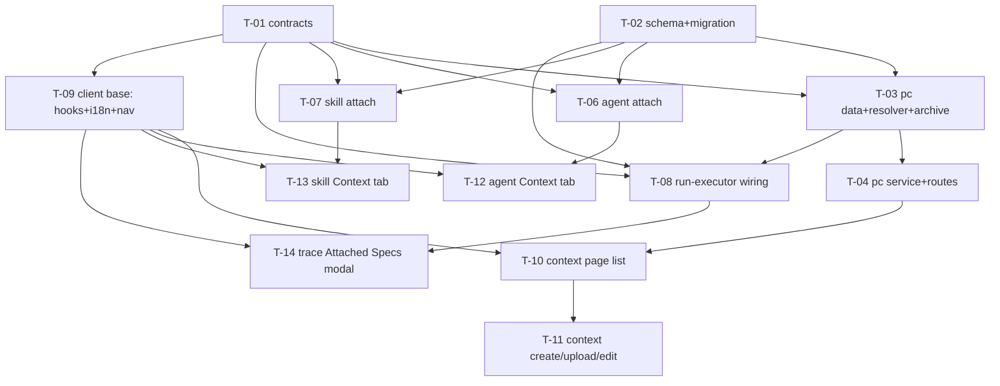

# Development Plan: Project Context

Source spec: `specs/SPEC-2026-07-08-project-context.md` (SPEC-2026-07-08-project-context, approved).

## Overview

Turn a repo's markdown docs (`specs`/`docs`/`insights`) — plus a new DevDigest-managed set of
"virtual" (in-app created/uploaded) markdown documents — into *attachable review context*. Users
attach docs to review agents and skills; at run time the run-executor resolves the attached
references (agent's own + inherited from attached skills), reads current content per origin, and
injects it into the reviewer-core prompt's already-existing `specs` slot (`## Project context`,
untrusted-wrapped). The run trace records exactly what was injected so a reviewer can audit it.

## Execution mode

**Multi-agent (parallel implementers, strict Owned-path partitioning).** The requester's brief
explicitly asks for "owned paths for parallel implementer dispatch, per-task skill assignments,
dependency DAG." The change is large and spans four independent surfaces (server data/services,
agent-attach, skill-attach, client UI across four distinct route trees), which partition cleanly
by directory. Within a single new module directory (`server/src/modules/project-context/`) tasks
are sequenced rather than parallelized, because concurrent implementers share no worktree isolation
and must not co-write files in the same parent directory.

## Requirements

Restated from the approved spec's acceptance criteria (AC-1..AC-40). Each traces to that spec.

- R1 (AC-1, AC-2): Discovery endpoint returns every `.md` under the workspace-resolved
  root-folder name set (override else default `specs`/`docs`/`insights`), merged with virtual
  document nodes, each carrying `path`, `filename`, `root_folder`, `origin` (`repo`|`virtual`),
  and a server-computed `token_estimate` (`ceil(byteLength/4)`).
- R2 (AC-3): A refresh action invalidates the cached discovery result and re-scans the clone.
- R3 (AC-4, AC-5, AC-9): Users attach docs to an agent (append + reorder) and to a skill (append);
  order is persisted.
- R4 (AC-6): Only `{ path, origin }` references are stored on agent/skill config — never doc text.
- R5 (AC-7): Client filters displayed rows by filename/path substring.
- R6 (AC-8): Preview renders a document's markdown; content fetched lazily per document.
- R7 (AC-10, AC-13, AC-15): At run time the run-executor injects the agent's own + inherited-skill
  attached docs, deduped by `(path, origin)` with agent-order-wins (first occurrence position).
- R8 (AC-11, AC-12): Context tabs show a running token count summed client-side from already-
  fetched `token_estimate`, no extra round trip / LLM call.
- R9 (AC-14, AC-16): Injected docs are untrusted-wrapped under `INJECTION_GUARD`; zero added LLM
  calls.
- R10 (AC-17, AC-28, AC-30): A doc that is unresolvable / oversize (>400 KB) / non-UTF-8 is skipped
  and its omission recorded, without failing the run.
- R11 (AC-18, AC-20): The run trace records injected paths (`specs_read`) and a per-run snapshot
  (`prompt_assembly.specs` + new `prompt_assembly.specs_snapshot`), authoritative even after source
  files change.
- R12 (AC-19, AC-25, AC-26): The run trace "Attached Specs" row expands to a modal rendering
  `### <path>` + content per injected doc, with a search-in-block filter and a Copy control.
- R13 (AC-21, AC-22): Zero discovered docs → empty state (not error); zero attached docs → the
  `## Project context` slot is omitted (prompt byte-identical to pre-feature).
- R14 (AC-23, AC-24): Skill Context tab renders a display-only "SERIALIZES AS" preview
  (`## Project specifications` + one bullet per attached path); the Agent Context tab does not.
- R15 (AC-27): An attached doc whose path no longer resolves shows a "stale/missing" badge in the
  Context tab, not silently dropped.
- R16 (AC-29): When attached total token count exceeds the workspace budget (default 4000,
  configurable), the Context tab shows a non-blocking warning.
- R17 (AC-31): Create a folder under a root-folder name → persists a `folder` node that appears in
  discovery even with zero children.
- R18 (AC-32): Create (inline content) or upload a single `.md` file → persists a `file` node.
- R19 (AC-33, AC-34, AC-35): Upload a `.zip` → extract every `.md` entry into matching virtual
  folder/file nodes preserving internal structure; ignore non-`.md` entries; reject any zip-slip
  entry without extracting it.
- R20 (AC-36): Any create/upload/archive-entry targeting an existing virtual node path is rejected
  as a conflict, never overwritten.
- R21 (AC-37, AC-38): Virtual (`origin: virtual`) docs get an in-app markdown editor + save; `repo`
  docs get no Edit action.
- R22 (AC-39): A single-file or archive upload over the 10 MB multipart limit is rejected,
  extracting nothing.
- R23 (AC-40): The Project Context page shows total discovered doc count, summed
  `ceil(length/4)` token estimate, and the last-scan timestamp.

## Decisions (confirmed during grilling)

The spec explicitly delegated two decisions to the planner; grilling additionally surfaced two
architecture risks the original plan had only flagged, not resolved. All four are now settled and
supersede the planner's original recommendations:

- **Attached-doc-reference storage → link table, not jsonb** (reverses the planner's original jsonb
  recommendation; matches the spec's `## Deferred` lean). Two new tables, `agent_context_docs` and
  `skill_context_docs` (mirroring `agent_skills`'s shape: `id`, owning-row FK, `path`, `origin`,
  `order` int, unique on `(agentId/skillId, path, origin)`), replace the `context_docs` jsonb
  column originally planned for T-02. Confirmed by requester.
- **`PUT …/context-docs` bumps `version`** (reverses the original "skip the bump, like `setSkills`"
  choice). Research surfaced that `version` is stamped into every run trace (`agent.version` /
  `skill.version`) specifically so a past run's *effective prompt* is reproducible from its
  `agent_versions`/`skill_versions` snapshot — and `context_docs` now directly shapes that
  effective prompt. Skipping the bump (as `setSkills` incidentally does, itself an unreviewed gap)
  would silently break that reproducibility guarantee for the new field. T-06/T-07's context-docs
  endpoints must go through the same config-change-detection + version-bump + snapshot path as the
  general agent/skill `update()`, not a bare repository write.
- **Discovery cache → DB-backed, not in-memory** (reverses the original in-memory single-process
  cache, which had been flagged as an accepted MVP risk). Confirmed: build the persistent cache
  from the start rather than defer it, since DevDigest's deployment may run multiple server
  instances.
- **Zip-extraction library → reuse `fflate`** (already a dependency; unchanged — see Corrections).
- **Settings UI for `context_root_folders`/`context_token_budget` → none for MVP** (confirmed
  consistent with existing precedent: most `SettingsKnown` fields, e.g. `polling_interval_min`,
  `sync_to_folder`, ship DB/API-only with no client form control today). No new task added.
- **Test coverage → `test-writer` enabled for this plan**, overriding the project's disabled-by-
  default setting, given the security-sensitive surface (path traversal, zip-slip, prompt-injection
  guard) and the new end-to-end flow from upload to run-time injection.

## Corrections to the spec (visible to reviewers)

- **The spec's "new dependency" claim is factually wrong.** `## Dependencies` states "no
  zip-parsing library exists in `server/package.json` today (confirmed via search)" and asks the
  planner to select one. In fact `fflate@^0.8.3` is already a dependency and is already used for
  ZIP extraction in skill import (`server/src/modules/skills/import.service.ts:1,57,69` —
  `unzipSync`/`strFromU8`; server INSIGHTS 2026-06-22 documents its test helpers). This plan reuses
  `fflate.unzipSync` for archive extraction. Caveat: `unzipSync` is in-memory (not streaming), but
  the 10 MB `@fastify/multipart` cap (AC-39) bounds memory, and this matches the established skills-
  import pattern — so no streaming API is warranted. No `package.json` / lockfile change (which
  implementers must not make) is needed.
- **`reviewer-core` needs no change.** The `specs` slot, `wrapUntrusted`, `INJECTION_GUARD`, the
  `## Project context` render, and omit-when-empty behavior already exist and are verified below —
  AC-14, AC-16, and AC-22 are pre-satisfied by existing code. There are no `reviewer-core/` tasks.

## Affected modules & contracts

- `server/src/modules/project-context/` (**NEW module**) — discovery (walk clone + merge virtual),
  virtual-node store, archive extraction, run-time resolver, service, routes.
- `server/src/modules/agents/` — add `context_docs` persistence + `PUT /agents/:id/context-docs`;
  include `context_docs` in the agent DTO.
- `server/src/modules/skills/` — add `context_docs` persistence + `PUT /skills/:id/context-docs`;
  include `context_docs` in the skill DTO.
- `server/src/modules/reviews/run-executor.ts` — resolve + read + inject specs; persist
  `specs_read` + `specs_snapshot`.
- `server/src/db/schema/` — new `project_context_nodes`, `project_context_scans`,
  `agent_context_docs`, `skill_context_docs` tables; one migration. (No jsonb column added to
  `agents`/`skills` — link tables per the grilling decision.)
- `client/src/app/context/` (**NEW route**) — Project Context page.
- `client/src/app/agents/[id]/…/AgentEditor/` — new Context tab.
- `client/src/app/skills/[id]/…/SkillEditor/` — new Context tab.
- `client/src/app/repos/[repoId]/pulls/[number]/…/RunTraceDrawer/` — Attached Specs row + modal.
- Contracts (**both vendor copies, same task**): new `contracts/project-context.ts`; extend
  `contracts/trace.ts` (`PromptAssembly.specs_snapshot`); extend `contracts/platform.ts`
  (`SettingsKnown.context_root_folders`, `context_token_budget`).

## Architecture notes

- **Onion placement (server).** Discovery/resolver/archive are Infrastructure+Application logic in
  the new `project-context` module; routes are Transport. Routes never touch `db/schema` directly —
  they call the service, which calls the module repository. `run-executor` (reviews/Application)
  imports the project-context run-time resolver (cross-module service import — the established
  pattern, e.g. `ConventionsService` imports `RepoRepository`, `IntentService` constructs
  `ReviewRepository`).
- **Reuse of the specs slot (pre-satisfied ACs).** `assemblePrompt` already wraps each spec via
  `wrapUntrusted('spec-N', …)` and renders `## Project context` only when `specs.length > 0`
  (`reviewer-core/src/prompt.ts:127-130,161`), and persists it as `assembly.specs`
  (`:180`). So run-executor's only job is to pass `specs` using the existing omit-when-empty spread
  pattern already used for `skills`/`callers`/`repoMap` (`run-executor.ts:233-244`). This makes
  AC-14 (untrusted), AC-16 (zero LLM calls — pure text assembly), and AC-22 (omit slot when empty →
  identical prompt) satisfied by existing code; the resolver + wiring must not regress them.
- **Run-time read + dedup + skip (the correctness core).** The resolver builds one ordered
  `(path, origin)` list = agent's own `context_docs` ++ each *enabled* linked skill's
  `context_docs` (skills already loaded in `run-executor` via `this.agents.linkedSkills(agent.id)`,
  filtered `l.enabled && l.skill.enabled`; skill rows carry `context_docs` after the schema task).
  Dedup by `(path, origin)`, **first occurrence wins**, agent list walked before any skill list
  (AC-15). For each surviving ref: `repo` origin → guard path against `clonePathFor(repo)`
  (`path.resolve(full).startsWith(path.resolve(cloneRoot))`, the `verifyEvidence` invariant, server
  INSIGHTS 2026-06-22) then read; `virtual` origin → read node content from the store. Skip +
  record omission (do not throw) when: path unresolved (AC-17), size > `MAX_FILE_SIZE` 400 KB
  (AC-28, `repo-intel/constants.ts:43`), or content not valid UTF-8 (AC-30). Return
  `{ specs: string[], snapshot: {path,content}[], read: string[] }`, all in the same order. Read
  raw bytes via `fs` under the guarded clone root (so size + UTF-8 validity are checkable on bytes,
  matching the discovery walk and `verifyEvidence`), rather than `GitClient.readFile` which returns
  an already-decoded string; `clonePathFor(repo)` gives the root.
- **`specs_snapshot` vs `specs`.** `prompt_assembly.specs` is the raw wire text
  (`<untrusted source="spec-N">…`), reused verbatim by the panel-level "Copy raw output".
  `prompt_assembly.specs_snapshot` is a new ordered `{ path, content }[]` (pre-`wrapUntrusted`
  content) so the "Attached Specs" modal can render a per-path, human-readable breakdown and derive
  its token count client-side. `run_traces` persists/reads the whole trace as one jsonb doc with a
  raw cast (`run.repo.ts:180-190`, no re-parse), so adding a nullish field is safe for old rows.
- **Discovery cache (DB-backed, confirmed during grilling).** Cached in `project_context_scans`
  (one row per `repoId`: `result` jsonb + `scannedAt`), not in-memory — survives restarts and works
  correctly across multiple server instances. Populated/replaced on first scan and on refresh
  (AC-3); read on every Project Context page open without re-walking the clone. Only the
  `repo`-origin subset is cached — virtual-origin docs are always read live from
  `project_context_nodes` and merged in at request time, so an in-app create/upload/edit is visible
  immediately, without needing a refresh. `scannedAt` feeds the page footer's last-scan time
  (AC-40).
- **Settings resolution.** `context_root_folders` (default `['specs','docs','insights']`) and
  `context_token_budget` (default 4000) resolve workspace-override-else-default via the same
  settings read as `getFeatureModelOverride` (`settings/feature-models.ts:38-48`). The discovery
  response carries the resolved `token_budget` so the Context tabs (AC-29) and page have it without
  a second fetch.
- **RSC vs client (client).** All interactive surfaces (page view, Context tabs, trace modal) are
  `"use client"`; data via TanStack Query hooks in `client/src/lib/hooks/project-context.ts`. All
  repo-scoped hooks include `enabled: !!repoId` (client INSIGHTS 2026-06-26). Native `<select>` is
  banned — use `vendor/ui/kit/Select` (client INSIGHTS 2026-06-22). Portals need `"use client"` +
  `mounted` guard (client INSIGHTS 2026-06-22).

## INSIGHTS summary

- [server]: LLM/user-supplied file paths must be traversal-guarded
  (`path.resolve(full).startsWith(path.resolve(root))`) before any `fs` read — the
  `conventions/extractor.ts:verifyEvidence` / `skills/import.service.ts:39` pattern (2026-06-22).
- [server]: `fflate` (`zipSync`/`unzipSync`/`strToU8`/`strFromU8`) is already present and usable in
  unit tests to build in-process ZIP buffers — no new import (2026-06-22).
- [server]: `pnpm db:generate` then `pnpm db:migrate` after every schema change; never hand-write
  migrations; migrations do not run on boot (2026-06-20, CLAUDE.md).
- [server]: a `sort/slice` cap applied after merging across entities caps globally, not per-entity —
  verify the dedup/first-occurrence logic per the AC-15 walk order, don't pattern-match on a
  plausible loop (2026-07-02).
- [server]: vitest run-filter is a substring match on the full path — cite acceptance filters that
  actually match the landed filename (e.g. `routes.it.test`, not `<module>.it.test`) (2026-07-02).
- [client]: `src/vendor/shared/` is a manual copy of the server contracts — every Zod change hits
  both copies in the same task (2026-06-20).
- [client]: repo-scoped `useQuery` hooks must pass `enabled: !!repoId` or they fire `GET /repos//…`
  (2026-06-26).
- [client]: `@testing-library/user-event` is NOT installed — use `fireEvent` (2026-07-02).
- [client]: replace native `<select>` with `vendor/ui/kit/Select`; portal components need
  `"use client"` + mounted-guard (2026-06-22).
- [reviewer-core]: build multi-line prompt strings via array `.join(' ')` to dodge Edit-tool quote
  corruption — relevant only if any prompt string is touched (it should not be) (2026-06-24).

## Phased tasks

### Phase 1 — Contracts & schema foundation

#### T-01: Shared contracts (both vendor copies)

- **Action:** Add a new contract file `contracts/project-context.ts` and extend two existing
  contract files — in BOTH vendor copies (`server/src/vendor/shared/contracts/` and
  `client/src/vendor/shared/contracts/`), keeping them byte-identical, and register the new file in
  both `contracts/index.ts` barrels. New file defines: `ContextDocOrigin = z.enum(['repo','virtual'])`;
  `ContextDocRef = z.object({ path, origin })`; `DiscoveredDoc = z.object({ path, root_folder,
  filename, origin, token_estimate: z.number().int() })`; `DiscoveryResponse = z.object({
  documents: DiscoveredDoc[], file_count, token_total, token_budget, scanned_at:
  z.string().nullable() })`; `VirtualDocNode = z.object({ id, type: z.enum(['folder','file']),
  root_folder, path, filename: nullish, content: nullish, created_at, updated_at })`; request
  bodies `CreateFolderBody { root_folder, path }`, `CreateFileBody { root_folder, path, content }`,
  `EditDocBody { content }`, `SetContextDocsBody { docs: ContextDocRef[] }`; and a `DocContent
  Response { path, origin, content }`. In `contracts/trace.ts` add
  `specs_snapshot: z.array(z.object({ path: z.string(), content: z.string() })).nullish()` to
  `PromptAssembly`. In `contracts/platform.ts` add to `SettingsKnown`:
  `context_root_folders: z.array(z.string()).default(['specs','docs','insights'])` and
  `context_token_budget: z.number().int().min(0).default(4000)`.
- **Why:** Every downstream server + client task builds on these types (R1, R3, R4, R7, R11, R14);
  contract-sync rule forces both copies in one task (client INSIGHTS 2026-06-20).
- **Module:** — (shared) · **Type:** backend
- **Skills to use:** zod, typescript-expert
- **Owned paths:** `server/src/vendor/shared/contracts/project-context.ts` (NEW FILE),
  `client/src/vendor/shared/contracts/project-context.ts` (NEW FILE),
  `server/src/vendor/shared/contracts/trace.ts`, `client/src/vendor/shared/contracts/trace.ts`,
  `server/src/vendor/shared/contracts/platform.ts`, `client/src/vendor/shared/contracts/platform.ts`,
  `server/src/vendor/shared/contracts/index.ts`, `client/src/vendor/shared/contracts/index.ts`
- **Depends-on:** none
- **Risk:** medium
- **Known gotchas:** Both vendor copies must stay identical (client INSIGHTS 2026-06-20). If any
  edited string literal gets curly-quote-corrupted by the Edit tool, run the ASCII-restore one-liner
  (reviewer-core INSIGHTS 2026-06-24). `specs_snapshot` must be nullish so old traces still parse.
- **Acceptance:** `cd server && pnpm typecheck` and `cd client && pnpm typecheck` both pass; a
  scratch `diff` of the two `project-context.ts` copies (and the two `trace.ts`, two `platform.ts`)
  reports no differences in the added blocks.

#### T-02: DB schema — virtual-node table, discovery-scan cache, attach link tables, migration

- **Action:** Create `server/src/db/schema/project-context.ts` exporting:
  - `projectContextNodes` (`pgTable('project_context_nodes', …)`): `id uuid pk defaultRandom`,
    `workspaceId` FK→workspaces (cascade), `repoId` FK→repos (cascade), `type text enum
    ['folder','file'] notNull`, `rootFolder text notNull`, `path text notNull`, `filename text`
    (nullable), `content text` (nullable), `createdAt`, `updatedAt`, with
    `uniqueIndex('pcn_repo_root_path_uq').on(repoId, rootFolder, path)` (enforces AC-36 conflict)
    and an index on `(workspaceId, repoId)`.
  - `projectContextScans` (`pgTable('project_context_scans', …)`) — the DB-backed discovery cache
    (grilling decision): `repoId` FK→repos (cascade, **pk**, one row per repo), `result jsonb
    notNull` (the cached repo-origin `DiscoveredDoc[]` — virtual-origin docs are never cached, see
    Architecture notes), `scannedAt timestamp notNull`.
  - `agentContextDocs` (`pgTable('agent_context_docs', …)`) — mirrors `agentSkills`'s shape: `id
    uuid pk defaultRandom`, `agentId` FK→agents (cascade), `path text notNull`, `origin text enum
    ['repo','virtual'] notNull`, `order integer notNull`, unique on `(agentId, path, origin)`.
  - `skillContextDocs` (`pgTable('skill_context_docs', …)`) — same shape, FK→skills.
  Register all four in the `schema.ts` barrel (re-export + `schema` object). Then
  `cd server && pnpm db:generate && pnpm db:migrate`.
- **Why:** Backing store for virtual docs (R17-R21), the DB-backed discovery cache (grilling
  decision), and attached refs as first-class ordered rows (R3, R4, R7) per the grilling-confirmed
  link-table shape (supersedes the plan's original jsonb-column design).
- **Module:** server · **Type:** backend
- **Skills to use:** drizzle-orm-patterns, postgresql-table-design, typescript-expert
- **Owned paths:** `server/src/db/schema/project-context.ts` (NEW FILE), `server/src/db/schema.ts`,
  `server/src/db/migrations/` (generated SQL — NEW FILE)
- **Depends-on:** none
- **Risk:** medium
- **Known gotchas:** Never hand-write the migration — `pnpm db:generate` then `pnpm db:migrate`;
  migrations do not run on boot (server INSIGHTS 2026-06-20). This task does NOT touch
  `schema/agents.ts` / `schema/skills.ts` — the attach tables are freestanding, like `agent_skills`,
  not columns on the owning row.
- **Acceptance:** `cd server && pnpm db:generate` produces exactly one new migration containing
  `project_context_nodes`, `project_context_scans`, `agent_context_docs`, `skill_context_docs`;
  `pnpm db:migrate` applies cleanly; `pnpm typecheck` passes.

### Phase 2 — Server data, resolver & attach persistence (parallel; distinct module dirs)

#### T-03: project-context data layer — store, discovery, archive, run-time resolver

- **Action:** Create the new module's data/logic files (no routes yet):
  - `repository.ts` — `ProjectContextRepository(db)`: `listNodes(workspaceId, repoId)`,
    `getNodeById(workspaceId, repoId, id)`, `getFileContentByPath(workspaceId, repoId, rootFolder,
    path)`, `createNode(...)` (relies on the unique index; catch the unique violation and throw a
    `ConflictError` for AC-36), `updateContent(id, content)`, plus the DB-backed scan-cache methods
    `getScanCache(repoId)`, `upsertScanCache(repoId, result, scannedAt)`, `invalidateScanCache(repoId)`
    (backed by `project_context_scans`, T-02 — grilling decision).
  - `constants.ts` — `MD_EXT = '.md'`, re-export `MAX_FILE_SIZE` (400 KB) from
    `repo-intel/constants.ts`, default root folders.
  - `discovery.ts` — `resolveRootFolders(container, workspaceId)` /
    `resolveTokenBudget(container, workspaceId)` (settings override-else-default, mirroring
    `feature-models.ts:38-48`); `scanRepoDocs(clonePath, rootFolders)` — recursive `readdir`
    modeled on `repo-intel/pipeline/walk.ts` but: never follow symlinks (`entry.isSymbolicLink()`
    → skip), skip `EXCLUDED_DIRS`, include a file iff `ext === .md` AND some ancestor directory name
    ∈ `rootFolders`, POSIX-normalize the repo-relative path, drop files > `MAX_FILE_SIZE`, record
    the matched `root_folder`; compute `token_estimate = ceil(byteLength/4)`. Cache only this
    repo-origin scan result via the repository's DB-backed cache (`getScanCache(repoId)` /
    `upsertScanCache(repoId, result, scannedAt)` / `invalidateScanCache(repoId)`, backed by
    `project_context_scans`, T-02 — grilling decision, replaces the originally-planned in-memory
    cache) so it survives restarts and multi-instance deployment; `invalidateScanCache` satisfies
    AC-3. Merge the (cached-or-fresh) repo docs with virtual nodes (read live from the repository,
    never cached — see Architecture notes) into one `DiscoveredDoc[]` on every request.
  - `archive.ts` — `extractMarkdownEntries(zipBuffer, rootFolder)`: `fflate.unzipSync`, for each
    entry ignore non-`.md` (AC-34), reject zip-slip (`path.includes('..')`, absolute paths, and a
    resolved-path check that the entry stays under the `rootFolder` virtual namespace) without
    extracting (AC-35), decode via `strFromU8`, return `{ path, content }[]` (folders inferred from
    nested paths). Pure — no DB writes.
  - `resolver.ts` — `resolveAttachedSpecs({ agentDocs, skillDocLists, repo, clonePath, repo:
    ProjectContextRepository, workspaceId, repoId })`: concat agent list ++ each enabled skill list,
    dedup by `(path, origin)` first-occurrence-wins (AC-15), then per ref read content —
    `repo` origin: traversal-guard against `clonePath` then `fs.readFile` raw bytes, validate
    UTF-8, size cap; `virtual` origin: `getFileContentByPath`. Skip + collect omission for
    missing/oversize/non-UTF-8 (AC-17/28/30). Return `{ specs, snapshot, read }` in order.
- **Why:** The correctness + security core (R1, R7, R9, R10, R17-R20). Isolating pure logic here
  makes dedup, skip, and zip-slip unit-testable without HTTP/DB round-trips.
- **Module:** project-context · **Type:** backend
- **Skills to use:** onion-architecture-node, drizzle-orm-patterns, security, zod, typescript-expert
- **Owned paths:** `server/src/modules/project-context/repository.ts` (NEW),
  `server/src/modules/project-context/constants.ts` (NEW),
  `server/src/modules/project-context/discovery.ts` (NEW),
  `server/src/modules/project-context/archive.ts` (NEW),
  `server/src/modules/project-context/resolver.ts` (NEW),
  `server/src/modules/project-context/resolver.test.ts` (NEW),
  `server/src/modules/project-context/archive.test.ts` (NEW),
  `server/src/modules/project-context/discovery.test.ts` (NEW)
- **Depends-on:** T-01, T-02
- **Risk:** high
- **Known gotchas:** Dedup must be first-occurrence over the *concatenated* list (agent before
  skills) — a global sort/slice or set-after-merge silently breaks agent-order-wins (server
  INSIGHTS 2026-07-02). Traversal guard is mandatory before any `fs` read (2026-06-22). `fflate`
  test helpers (`zipSync`/`strToU8`) build in-process ZIP buffers (2026-06-22). On Windows,
  POSIX-normalize paths (`split(sep).join('/')`) to match `walk.ts`.
- **Acceptance:** `cd server && pnpm exec vitest run src/modules/project-context/resolver.test.ts
  src/modules/project-context/archive.test.ts src/modules/project-context/discovery.test.ts`
  passes, with tests covering: dedup with an agent+skill sharing ≥1 path (each injected once, agent
  position), skip on missing / >400 KB / non-UTF-8, zip-slip `../` entry rejected, non-`.md` entry
  ignored, and `token_estimate === ceil(byteLength/4)`.

#### T-06: Agent attached-doc persistence + endpoint

- **Action:** In `AgentsRepository` add `setContextDocs(agentId, docs: ContextDocRef[])`: replace
  the full `agent_context_docs` row set for that agent in a transaction (delete-then-bulk-insert,
  `order` = array index — a whole-list replace, mirroring `setSkills`'s row-replace mechanics).
  Per the grilling decision, this call MUST also bump the agent's `version` and write an
  `agent_versions` snapshot — route it through (or call directly) the same config-change-detection,
  version-bump, and snapshot step used by the general `update()` (extend
  `isConfigChange`/the bump helper in `agents/helpers.ts` to treat a `context_docs` diff as a config
  change, or invoke the bump/snapshot step explicitly from `setContextDocs` — implementer's choice,
  either satisfies the requirement). In `agents/routes.ts` add `PUT /agents/:id/context-docs`
  (`schema: { params: IdParams, body: SetContextDocsBody }`) → workspace-scoped, calls
  `setContextDocs`, returns the updated agent (reflecting its bumped `version`). Ensure the existing
  agent GET response includes ordered `context_docs` (join `agent_context_docs` by `agentId`, order
  by `order` asc) so the Context tab can render current attachments + stale badges.
- **Why:** R3/R4 for agents (AC-4, AC-5, AC-6); persists only `{ path, origin }` refs; the version
  bump preserves run-trace-to-effective-prompt reproducibility (grilling decision — `context_docs`
  now shapes the effective prompt the same way the rest of the agent config does).
- **Module:** agents · **Type:** backend
- **Skills to use:** onion-architecture-node, fastify-best-practices, drizzle-orm-patterns, zod
- **Owned paths:** `server/src/modules/agents/routes.ts`, `server/src/modules/agents/repository.ts`,
  `server/src/modules/agents/helpers.ts`, `server/src/modules/agents/routes.test.ts`
- **Depends-on:** T-01, T-02
- **Risk:** low
- **Known gotchas:** Reorder is a whole-list replace, but — unlike `setSkills`, which incidentally
  skips it — this endpoint MUST bump `version` and write an `agent_versions` snapshot; do not copy
  `setSkills`'s no-bump behavior verbatim (grilling decision). Routes use
  `fastify-type-provider-zod` — never call `.parse()` by hand.
- **Acceptance:** `cd server && pnpm exec vitest run src/modules/agents/routes.test.ts` passes,
  including a test that PUT-ing `docs` then GET-ing the agent returns them in order, a reorder
  replaces the order, AND the agent's `version` is incremented with a corresponding
  `agent_versions` row after the PUT.

#### T-07: Skill attached-doc persistence + endpoint

- **Action:** In `SkillsRepository` add `setContextDocs(skillId, docs)`: replace the full
  `skill_context_docs` row set for that skill (delete-then-bulk-insert, `order` = array index).
  Per the grilling decision, route this through the same config-change-detection, version-bump,
  and snapshot path as the general skill `update()` (see T-06 for the parallel agent-side
  requirement — do not copy `setSkills`'s no-bump behavior). Include ordered `context_docs` in the
  skill DTO (`toSkillDto` in `skills/helpers.ts`, joined from `skill_context_docs`). In
  `skills/routes.ts` add `PUT /skills/:id/context-docs` (`schema: { params: IdParams, body:
  SetContextDocsBody }`) → workspace-scoped via `SkillsService`. Extend `SkillsService` with a
  `setContextDocs` passthrough that also triggers the version bump.
- **Why:** R3/R4 for skills (AC-9, AC-6); skill refs are inherited by agents at run time (AC-10);
  the version bump keeps `skill_versions` reproducible for the skill's effective serialized context
  (grilling decision).
- **Module:** skills · **Type:** backend
- **Skills to use:** onion-architecture-node, fastify-best-practices, drizzle-orm-patterns, zod
- **Owned paths:** `server/src/modules/skills/routes.ts`, `server/src/modules/skills/repository.ts`,
  `server/src/modules/skills/service.ts`, `server/src/modules/skills/helpers.ts`
- **Depends-on:** T-01, T-02
- **Risk:** low
- **Known gotchas:** `skills/routes.ts` already registers `@fastify/multipart` — do not re-register.
  `toSkillDto` is the single DTO mapper; add `context_docs` there so both list and get include it
  (server INSIGHTS 2026-06-22 re: `get()` needing explicit field wiring). Do not copy `setSkills`'s
  no-version-bump behavior (grilling decision).
- **Acceptance:** `cd server && pnpm typecheck` passes; a route test asserts
  `PUT /skills/:id/context-docs` then `GET /skills/:id` returns `context_docs` in order AND the
  skill's `version` incremented with a corresponding `skill_versions` row.

### Phase 3 — project-context routes & run-executor injection (parallel; distinct dirs)

#### T-04: project-context service + routes + module registration

- **Action:** Add `service.ts` (orchestrates discovery, node CRUD, single-file create/upload, edit,
  archive upload — validates root folder ∈ resolved set, enforces conflicts via the repository) and
  `routes.ts` exporting the Fastify plugin; register `@fastify/multipart`
  (`{ limits: { fileSize: 10 * 1024 * 1024 } }`) as skills routes do (AC-39). Routes:
  `GET /repos/:id/context/docs` → `DiscoveryResponse` (cached), `POST /repos/:id/context/refresh`
  → invalidate + rescan (AC-3), `GET /repos/:id/context/docs/content?path=&origin=&root_folder=`
  → `DocContentResponse` (AC-8/37, guarded read for repo origin), `POST /repos/:id/context/folders`
  (AC-31), `POST /repos/:id/context/files` (inline JSON content, AC-32),
  `POST /repos/:id/context/files/upload` (multipart single `.md`, AC-32/39),
  `POST /repos/:id/context/archive` (multipart `.zip` → `extractMarkdownEntries` → create nodes,
  AC-33/34/35/36/39), `PUT /repos/:id/context/docs/:nodeId` (edit virtual content, AC-37). Register
  the module in `server/src/modules/index.ts`. Degrade to virtual-only (or empty) when
  `repos.clonePath` is null (edge case: repo not cloned).
- **Why:** Exposes discovery + virtual-doc CRUD (R1, R2, R6, R17-R22) to the client.
- **Module:** project-context · **Type:** backend
- **Skills to use:** onion-architecture-node, fastify-best-practices, zod, security, typescript-expert
- **Owned paths:** `server/src/modules/project-context/service.ts` (NEW),
  `server/src/modules/project-context/routes.ts` (NEW),
  `server/src/modules/project-context/routes.it.test.ts` (NEW),
  `server/src/modules/index.ts`
- **Depends-on:** T-03
- **Risk:** medium
- **Known gotchas:** `@fastify/multipart` `req.file()` for single upload; iterate parts for the zip.
  Reject uploads whose filename doesn't end `.md`/`.zip` respectively. `NotFoundError`/
  `ValidationError`/`ConflictError` live in `platform/errors.js`. Repo resolution + `clonePath`
  null-check follows `ConventionsService.extract` (`conventions/service.ts:30-38`).
- **Acceptance:** `cd server && pnpm exec vitest run src/modules/project-context/routes.it.test.ts`
  passes, covering: discovery merge shape, refresh re-scan, folder/file create, zip upload creating
  nested nodes while ignoring a non-`.md` entry and rejecting a `../` entry, a path-conflict 409, an
  edit updating content, and an oversize (>10 MB) upload rejected.

#### T-08: run-executor injection + trace persistence

- **Action:** In `run-executor.ts` `runOneAgent`, after skills are loaded, call the project-context
  resolver (`new ProjectContextService(this.container)` / resolver) with the agent's `context_docs`,
  the enabled linked skills' `context_docs` (already available from the `linkedSkills` call —
  filter `l.enabled && l.skill.enabled`), the `repo` row + `clonePathFor(repo)`, and workspace/repo
  ids. Pass the resulting `specs` into `reviewPullRequest` using the existing omit-when-empty spread
  (`...(specs.length > 0 ? { specs } : {})`, mirroring the `skills`/`callers` lines at
  `run-executor.ts:233-244`). Populate the success `RunTrace`: set `specs_read` to the resolver's
  `read` (replacing the hardcoded `[]` at `:321`) and set `prompt_assembly.specs_snapshot` to the
  resolver's `snapshot`. Add a `runLog.info` line noting N docs injected / M skipped (omissions).
  Leave the failure-path `traceFromBuffer` `specs_read: []` and no snapshot (nothing injected).
- **Why:** R7/R9/R10/R11 — the actual injection + audit trail; makes the feature take effect.
- **Module:** reviews · **Type:** backend
- **Skills to use:** onion-architecture-node, typescript-expert
- **Owned paths:** `server/src/modules/reviews/run-executor.ts`,
  `server/src/modules/reviews/run-executor.test.ts` (NEW or extend if present)
- **Depends-on:** T-01, T-02, T-03
- **Risk:** medium
- **Known gotchas:** Do NOT modify `reviewer-core` — the omit-when-empty + untrusted-wrap already
  exist (`prompt.ts:127-130,161`), so AC-14/16/22 hold as long as `specs` is passed only when
  non-empty and nothing else in the assembly changes. `assembly.specs` is already persisted; only
  `specs_read` + the new `specs_snapshot` need setting. Resolver must never throw into the run —
  skips are recorded, not fatal (AC-17).
- **Acceptance:** `cd server && pnpm exec vitest run src/modules/reviews/run-executor.test.ts`
  passes with: an agent with 0 attached docs produces a trace whose `prompt_assembly.specs` is null
  and no `## Project context` section (AC-22); an agent + skill sharing a path injects it once and
  records it once in `specs_read` (AC-15); a missing path is skipped, run still completes (AC-17);
  `specs_snapshot[i].content` equals the raw content passed to `specs[i]` (success-criteria
  fidelity).

### Phase 4a — Client shared base

#### T-09: Client hooks, i18n keys, and nav entry

- **Action:** Create `client/src/lib/hooks/project-context.ts` with TanStack Query hooks (all
  repo-scoped ones pass `enabled: !!repoId`): `useDiscovery(repoId)`, `useRefreshDiscovery`,
  `useDocContent(repoId, path, origin, rootFolder, enabled)`, `useCreateFolder`, `useCreateFile`,
  `useUploadFile`, `useUploadArchive`, `useEditDoc`, `useSetAgentContextDocs(agentId)`,
  `useSetSkillContextDocs(skillId)` — using the existing `api` client and query-invalidation
  patterns from `client/src/lib/hooks/conventions.ts`. Export them from `client/src/lib/hooks/index.ts`.
  Add a `context` nav item to `client/src/vendor/ui/nav.ts` under WORKSPACE (href
  `/repos/:repoId/context`, an existing `IconName`, `gKey`) + a matching SHORTCUTS entry. Add ALL
  i18n keys this feature needs up front (single-owner of message files): extend
  `client/messages/en/context.json` (page: list/preview/refresh/create/upload/edit/footer/empty),
  add a `context` section to `client/messages/en/agents.json` and to the skills + prReview message
  files for the Context tabs + Attached Specs modal.
- **Why:** Shared foundation every Phase-4b/4c client task imports; single-owning hooks + i18n +
  nav prevents cross-task file overlap.
- **Module:** client · **Type:** ui
- **Skills to use:** react-frontend-architecture, react-best-practices, next-best-practices, zod,
  typescript-expert
- **Owned paths:** `client/src/lib/hooks/project-context.ts` (NEW), `client/src/lib/hooks/index.ts`,
  `client/src/vendor/ui/nav.ts`, `client/messages/en/context.json`,
  `client/messages/en/agents.json`, `client/messages/en/prReview.json`, and the skills message file
  (verify exact filename under `client/messages/en/`)
- **Depends-on:** T-01
- **Risk:** medium
- **Known gotchas:** Repo-scoped hooks need `enabled: !!repoId` (client INSIGHTS 2026-06-26). Hook
  files are not components — `onError` uses module-level `notify`/`toast`, not a hook (client
  INSIGHTS 2026-06-26). Nav shortcuts auto-wire from the definition (client INSIGHTS 2026-06-26).
- **Acceptance:** `cd client && pnpm typecheck` passes; `client/messages/en/context.json` contains
  the new page keys; the nav renders a Project Context item (existing nav test, if any, still
  passes) — `cd client && pnpm test` green.

### Phase 4b — Client feature surfaces (parallel; distinct route dirs)

#### T-10: Project Context page — list, preview, refresh, aggregate footer, empty state

- **Action:** Create the route `client/src/app/context/page.tsx` (reads the active repo via
  `useActiveRepo()`) and `client/src/app/context/_components/ProjectContextView/` (view + styles):
  render the merged discovered-doc list (path, root_folder, origin badge, per-row token estimate);
  a "Filter documents…" box narrowing by filename/path (AC-7); a per-row Preview affordance opening
  a modal that lazily fetches + markdown-renders content via `useDocContent` (AC-8); a Refresh
  action calling `useRefreshDiscovery` (AC-3); an aggregate footer showing file count + summed
  `token_estimate` + last-scan time from the discovery response (AC-40); and an empty state when
  zero docs (AC-21). Repurpose the existing "Indexed: N files · chunks · last …" status-line real
  estate per the spec (Non-goals note).
- **Why:** R1, R2, R5, R6, R23, R13 (page side).
- **Module:** client · **Type:** ui
- **Skills to use:** react-frontend-architecture, react-best-practices, next-best-practices,
  typescript-expert
- **Owned paths:** `client/src/app/context/page.tsx` (NEW),
  `client/src/app/context/_components/ProjectContextView/` (NEW dir)
- **Depends-on:** T-04, T-09
- **Risk:** medium
- **Known gotchas:** Token footer sums already-fetched `token_estimate` — no per-doc content fetch
  (AC-12/40). Preview modal is a portal → `"use client"` + mounted-guard (client INSIGHTS
  2026-06-22). Use `vendor/ui/kit/Select` for any dropdown. Sort the list by a stable key + id
  tiebreaker so it doesn't reorder on refetch (client INSIGHTS 2026-06-23).
- **Acceptance:** `cd client && pnpm test` (the new ProjectContextView test) and `pnpm typecheck`
  pass; test covers: rows render with origin badges, filter narrows rows, empty state shows on
  `documents: []`, footer shows count + summed tokens.

#### T-12: Agent editor — Context tab

- **Action:** Add a `context` tab to the agent editor: extend
  `client/src/app/agents/[id]/_components/AgentEditor/constants.ts` `TABS`; render the new
  `_components/ContextTab/` (ContextTab.tsx + styles.ts) from `AgentEditor.tsx`'s body switch; add
  `'context'` to `VALID_TABS` in `client/src/app/agents/[id]/page.tsx`. The tab lists discovered
  docs (from `useDiscovery`), lets the user attach/detach (checkbox) and reorder (drag handle) —
  persisting via `useSetAgentContextDocs` as an ordered `{ path, origin }[]` (AC-4/5); a filter box
  (AC-7); a running token-count footer summing attached docs' `token_estimate` client-side (AC-11/
  12); a non-blocking budget warning when the sum exceeds `token_budget` from the discovery response
  (AC-29); a "stale/missing" badge on an attached ref whose path is not in the current discovery set
  (AC-27). No "SERIALIZES AS" panel here (AC-24).
- **Why:** R3, R5, R8, R15, R16 (agent side); R14 negative (no SERIALIZES AS).
- **Module:** client · **Type:** ui
- **Skills to use:** react-frontend-architecture, react-best-practices, typescript-expert
- **Owned paths:**
  `client/src/app/agents/[id]/_components/AgentEditor/_components/ContextTab/` (NEW dir),
  `client/src/app/agents/[id]/_components/AgentEditor/AgentEditor.tsx`,
  `client/src/app/agents/[id]/_components/AgentEditor/constants.ts`,
  `client/src/app/agents/[id]/page.tsx`
- **Depends-on:** T-06, T-09
- **Risk:** medium
- **Known gotchas:** Model attach/reorder on the existing `SkillsTab` interaction pattern
  (checkbox + draggable order; client INSIGHTS 2026-06-22). `useState` derived from async
  attached-docs prop must `useEffect`-sync (client INSIGHTS 2026-06-29). Use array index for list
  key + toggle-state Set when the domain value may repeat (client INSIGHTS 2026-07-02).
- **Acceptance:** `cd client && pnpm test` (ContextTab test) + `pnpm typecheck` pass; test covers:
  attaching appends a ref, the token footer sums estimates, exceeding the budget shows a warning
  without disabling attach, an attached ref absent from discovery shows the stale badge.

#### T-13: Skill editor — Context tab (+ SERIALIZES AS preview)

- **Action:** Add a `context` tab to the skill editor: extend
  `client/src/app/skills/[id]/_components/SkillEditor/constants.ts` `TABS` (+ `VALID_TABS` derives);
  render `_components/ContextTab/` from `SkillEditor.tsx`'s body switch. The tab lists discovered
  docs, attaches via `useSetSkillContextDocs` (AC-9), shows the running token-count footer (AC-11/
  12), and renders a display-only "SERIALIZES AS" preview: literal `## Project specifications`
  followed by one `- <path>` bullet per attached doc in attach order (AC-23) — illustrative copy,
  not the runtime header.
- **Why:** R3 (skill side), R8, R14 (positive — SERIALIZES AS).
- **Module:** client · **Type:** ui
- **Skills to use:** react-frontend-architecture, react-best-practices, typescript-expert
- **Owned paths:**
  `client/src/app/skills/[id]/_components/SkillEditor/_components/ContextTab/` (NEW dir),
  `client/src/app/skills/[id]/_components/SkillEditor/SkillEditor.tsx`,
  `client/src/app/skills/[id]/_components/SkillEditor/constants.ts`
- **Depends-on:** T-07, T-09
- **Risk:** low
- **Known gotchas:** The skill editor tab list already derives `VALID_TABS` from `TABS`
  (`SkillEditor/constants.ts:16`) — only edit `TABS`. Reuse the `estimateTokens` helper already in
  `ConfigTab.tsx:14-16` for parity, or import a shared copy (do not add an external tokenizer).
- **Acceptance:** `cd client && pnpm test` (ContextTab test) + `pnpm typecheck` pass; test asserts
  the SERIALIZES AS block shows `## Project specifications` + one bullet per attached path in order,
  and the token footer sums estimates.

#### T-14: Run trace — "Attached Specs" row + modal

- **Action:** In the run-trace Prompt Assembly UI
  (`client/src/app/repos/[repoId]/pulls/[number]/_components/RunTraceDrawer/_components/TraceBody/TraceBody.tsx`
  — verify exact path), add an "Attached Specs" expandable row that renders when
  `prompt_assembly.specs_snapshot` is non-empty. Expanding opens a modal component (new
  `_components/AttachedSpecsModal/`) that renders, per snapshot entry, a `### <path>` heading + the
  entry's content (AC-19); a "Search in this block…" box filtering the displayed per-doc content to
  matching text (AC-25); and a Copy control copying the full rendered (headed, concatenated) modal
  text (AC-26). Derive the attached-specs token count on the fly from `specs_snapshot` via the same
  `ceil(length/4)` heuristic (AC-12 note) — no new trace field.
- **Why:** R11 (display), R12 — lets a reviewer audit exactly what was injected.
- **Module:** client · **Type:** ui
- **Skills to use:** react-frontend-architecture, react-best-practices, typescript-expert
- **Owned paths:**
  `client/src/app/repos/[repoId]/pulls/[number]/_components/RunTraceDrawer/_components/AttachedSpecsModal/` (NEW dir),
  `client/src/app/repos/[repoId]/pulls/[number]/_components/RunTraceDrawer/_components/TraceBody/TraceBody.tsx`
- **Depends-on:** T-08, T-09
- **Risk:** medium
- **Known gotchas:** Modal is a portal → `"use client"` + mounted-guard (client INSIGHTS
  2026-06-22). Old traces have `specs_snapshot` null/absent — guard the row so it simply doesn't
  render (no crash). Reuse the drawer's existing formatters from `pulls/helpers.ts` rather than
  adding new ones (client INSIGHTS 2026-06-20).
- **Acceptance:** `cd client && pnpm test` (AttachedSpecsModal test) + `pnpm typecheck` pass; test
  covers: the row renders only when snapshot present, the modal shows a `### path` heading per doc,
  the search box filters shown content, and Copy writes the concatenated text (mock clipboard).

### Phase 4c — Client create/upload/edit

#### T-11: Project Context page — create folder / create+upload file / upload zip / edit

- **Action:** Extend `ProjectContextView` (add sibling components under its `_components/`) with the
  authoring affordances: create-folder form (root-folder select + path → `useCreateFolder`, AC-31);
  create-file (inline markdown content) and upload-single-`.md` (`useCreateFile` / `useUploadFile`,
  AC-32); upload-`.zip` (`useUploadArchive`, AC-33) with client-side surfacing of server
  conflict/zip-slip/size errors; and an Edit view for `origin: virtual` docs only — a CodeMirror +
  `@codemirror/lang-markdown` editor modeled on `ConfigTab.tsx:18,85-91` that loads content via
  `useDocContent` and saves via `useEditDoc` (AC-37); NO Edit action rendered for `origin: repo`
  rows (AC-38). Surface the 10 MB / conflict / zip-slip errors as toasts (AC-36/39).
- **Why:** R17-R22 — lets a user create project context without committing to the repo.
- **Module:** client · **Type:** ui
- **Skills to use:** react-frontend-architecture, react-best-practices, next-best-practices,
  typescript-expert
- **Owned paths:**
  `client/src/app/context/_components/ProjectContextView/_components/` (NEW subdirs for
  CreateModal / UploadControls / EditDocModal)
- **Depends-on:** T-10
- **Risk:** medium
- **Known gotchas:** Edit action gates on `origin === 'virtual'` (AC-38). CodeMirror usage is inline
  per `ConfigTab.tsx` — new component modeled on it, not a shared import. Mutations need `onError`
  toasts (client INSIGHTS 2026-06-23). Single `router.replace` per action, never two consecutive
  navigations (client INSIGHTS 2026-06-23).
- **Acceptance:** `cd client && pnpm test` (new component tests) + `pnpm typecheck` pass; tests
  cover: a `repo`-origin row shows no Edit action, a `virtual`-origin row opens the editor and saves,
  a create-folder submit calls the mutation, and an upload error renders a toast.

## Testing strategy

- Unit (server): `cd server && pnpm exec vitest run --exclude '**/*.it.test.ts'` — resolver,
  archive, discovery (T-03).
- Integration (server, Docker): `cd server && pnpm exec vitest run .it.test` — project-context
  routes (T-04); or the specific file `src/modules/project-context/routes.it.test.ts`.
- UI: `cd client && pnpm test && pnpm typecheck`.
- E2E: out of scope for this plan (no `e2e/` flow specified by the spec); add later if desired.
- Invariant acceptance scenario (spec success criteria): manual — attach a spec stating
  "`api/` must not import `db/` directly" to a reviewer, run against a violating PR, confirm ≥1
  finding references the spec.
- **`test-writer` enabled for this plan** (grilling decision, overrides the project's disabled-by-
  default setting) — dispatch it after the multi-agent `implementer` phase, before
  `architecture-reviewer`, given the security-sensitive surface (path traversal, zip-slip,
  prompt-injection guard) and the new end-to-end flow from upload to run-time injection.

## Risks & mitigations

- **`fflate.unzipSync` is not streaming** — whole archive decompresses in memory; bounded by the
  10 MB multipart cap (AC-39) and consistent with existing skills-import usage. Mitigation: keep the
  10 MB limit; reject oversize before decompress.
- **`repo`-origin doc edited by a malicious PR** — mitigated by the mandatory untrusted-wrap +
  `INJECTION_GUARD` (AC-14, pre-existing) and the traversal guard on reads.
- **Client message-file single-ownership (T-09)** creates a soft dependency bottleneck — mitigated
  by having T-09 add all keys up front so Phase-4b/4c tasks never edit message files.
- **Resolved during grilling (no longer open risks):** the discovery cache is now DB-backed
  (`project_context_scans`, T-02/T-03), not single-process in-memory; attached-doc-reference
  storage is a link table (`agent_context_docs`/`skill_context_docs`), not a jsonb column; the
  context-docs endpoints (T-06/T-07) bump `version` and snapshot, not skipped like `setSkills`. See
  `## Decisions (confirmed during grilling)`.

## Red-flags check

- [x] Execution mode stated and confirmed (multi-agent; implied by the requester's brief).
- [x] Every Requirements line traces to a spec AC — nothing originated here.
- [x] Recommendations separated from Requirements; all four grilling-flagged decisions (storage
      shape, version bump, discovery cache, test coverage) resolved with the requester — see
      `## Decisions (confirmed during grilling)` — before Phase 1 implementation begins.
- [x] Global constraints have no internal contradictions (scanned Requirements + Architecture notes).
- [x] Every requirement maps to a task (R1→T-03/04/10; R7/R9/R10/R11→T-03/08; R12→T-14; etc.).
- [x] Dependencies form a DAG (see diagram) — no cycles.
- [x] Concurrent tasks have non-overlapping Owned paths AND parent directories (Phase 2: agents/,
      skills/, project-context/ distinct; Phase 4b: context/, agents editor, skills editor, pulls
      trace distinct; intra-module project-context work is sequenced T-03→T-04).
- [x] No phase exceeds ~7 concurrent tasks (max 4, Phase 4b).
- [x] No task split by activity type forcing two concurrent tasks onto the same files (tests live
      with their implementation task).
- [x] Every cited path verified via Read/Glob or marked NEW FILE.
- [x] Every task names exact file paths.
- [x] Every task self-contained (contract ref, owned paths, runnable acceptance).
- [x] Every Acceptance is a runnable, binary command + observable.
- [x] Each phase reaches a self-consistent, mergeable state (backend fully works after Phase 3; UI
      after Phase 4).
- [x] Shared contract changes assign both vendor copies to the same task (T-01).
- [x] Schema change includes `pnpm db:generate` + `pnpm db:migrate` (T-02).
- [x] Integration edge-cases are explicit: dedup/skip/traversal in T-03; zip-slip/conflict/size in
      T-03/T-04; injection omit-when-empty in T-08.
- [x] UI design audit: no design image/Figma was provided; UI shapes come from the spec's field-
      level interface descriptions + SERIALIZES AS copy — no visual mockup to audit against, so no
      Design audit section (backend+spec-driven UI). Any pixel-level layout is left to the
      implementer within the spec's stated elements.
- [x] Orphan contracts: every new Zod schema (T-01) has an implementing task (discovery→T-03/04,
      refs→T-06/07, snapshot→T-08/T-14, settings→T-03).
