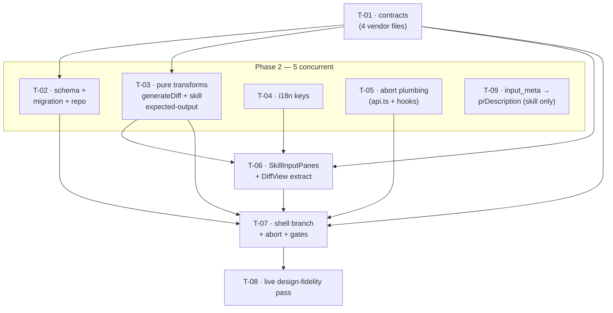

# Development Plan: Skill eval case — Code input (Before/After) + run abort

## Overview

Rework the eval-case modal's Input area for **skill-owned cases only**: replace the raw
`Diff | Files | PR meta` textareas with a `Code | PR meta` design — a Code tab carrying
`New file` / `Modified file` sub-tabs (Before/After snippet fields plus a collapsed
"Preview generated diff" disclosure) and a PR meta tab with real Title/Body form fields.
Before/After and the new-vs-modified mode are persisted on the eval case; the unified diff
the review engine needs is generated client-side on save into the existing `input_diff`.
The persisted PR meta is wired into the skill run's prompt. Separately, an in-flight
"Run case" request becomes abortable from both Cancel and Save, for both the skill and the
agent modal.

## Execution mode

**Multi-agent** (parallel implementers, strict Owned-path partitioning). Stated by the
requester: *"Give per-task Owned paths so independent tasks can be dispatched to parallel
implementers."*

Fit: the change spans two packages (server contracts/schema/repo/service + client UI) and has
five genuinely independent leaf pieces (storage, pure transforms, i18n, abort plumbing, the
server prompt wiring) that fan out from one contract change. Phase 2 runs 5 concurrent tasks.
Phases 3–5 narrow to one task each because the work converges on a single modal file — that
serialisation is inherent to the change, not a partitioning failure. See T-07's `Known gotchas`
for its expected-long status.

## Requirements

<!-- Restates only what the requester stated or explicitly confirmed. R1–R7 + C1–C4 are the
     original brief. R8–R12 came out of the grilling interview. R13–R17 are the grilling
     verdicts on the former Rec-1…Rec-7, promoted here because they are now decided. -->

- **R1: Scope is the SKILL modal only.** `owner.kind === "agent"` keeps the current
  `Diff | Files | PR meta` behaviour unchanged. Only `owner.kind === "skill"` gets the new
  design. The agent path's existing tests must stay green. (Structure decided — see R13.)
- **R2: Skill Input tabs become `Code | PR meta`.** The `Files` tab is HIDDEN for skills;
  `input_files` is left `undefined` for skill cases. `input_files` is NOT removed from the
  contract — the agent path still uses it.
- **R3: Code tab has two sub-tabs, `New file` and `Modified file`.** "New file" shows only an
  `After` field. "Modified file" shows `Before` and `After`. Below them, a collapsed
  `Preview generated diff` disclosure reveals the unified diff generated from Before/After.
- **R4: Persist before/after on the case.** Add fields to `EvalCase` for the code input
  (before, after, and the new-vs-modified mode) plus a new Drizzle migration generated via
  `pnpm db:generate` (never hand-edit an existing migration; migrations do not run on boot, so
  `cd server && pnpm db:migrate` is part of the work). Existing agent-owned cases must keep
  working — the new fields must be optional/nullish so already-persisted rows still parse.
  (Diff build site decided — see R14.)
- **R5: The generated file name is the constant `snippet.ts`.** No filename input field.
  New-file mode diffs against `/dev/null`.
- **R6: PR meta tab is Title + Body form fields**, mapping to `input_meta`, replacing the raw
  JSON textarea for skills. Reuse the existing unused i18n keys.
- **R7: Abort in-flight runs — for BOTH the skill and the agent modal.** While a run request is
  in flight, pressing Cancel OR Save aborts that request. This implies Save must become
  pressable during a run — a deliberate UI change. Cover the run hooks in
  `client/src/lib/hooks/eval.ts` (`useRunEvalCase`, `usePreviewEvalRunFromFinding`) with an
  `AbortController` wired through `client/src/lib/api.ts`.
- **R8: Save-during-run semantics.** While a run is in flight:
  - **Cancel** (and the Modal `X`) → abort the run, close.
  - **Save with "Run on save" OFF** → abort the run, save, close.
  - **Save with "Run on save" ON** → abort the in-flight run, save, then start a **fresh** run
    against the saved case, keeping the **Save button blocked for the duration of that run**;
    when it finishes, close the modal and surface the result as a **toast**.
  - Consequence: `runAndCapture` currently hardcodes `silent: true`
    (`EvalCaseEditor.tsx:216-225`) because the inline result banner shows the outcome — which is
    only correct while the modal stays open. **`silent` becomes a parameter.** The "Run case"
    button's run stays `silent: true` (banner); the save-triggered run is `silent: false` (the
    modal is closing, so the toast is the only surviving feedback).
  - **Only runs are abortable.** Cancel during a *save* aborts nothing — aborting the HTTP
    request cannot undo a committed INSERT, it would only hide work that already happened. No
    implementer may extend the abort to saves.
- **R9: Wire `input_meta` → the review prompt, for SKILL runs only.** Verified gap:
  `executeSkillCase` (`server/src/modules/eval/service.ts:254-267`) passes no meta to
  `reviewPullRequest`, though `ReviewInput.prDescription` exists and is assembled into the
  prompt (`reviewer-core/src/review/run.ts:142`). Map the persisted `input_meta.{title,body}`
  into `prDescription` in `executeSkillCase`. **`executeCase` (the agent path) is explicitly NOT
  changed** — agent-owned rows may already carry `input_meta`, and wiring it there would
  silently shift the prompt (and the stored recall/precision) of existing cases with no change
  to the case itself. Narrow `input_meta` defensively (it is `z.unknown()`) — a
  `typeof === "object"` guard, never a cast.
- **R10: An empty generated diff blocks the skill modal's Run case AND Save.** `generateDiff`
  returns `""` for identical or empty Before/After, and `parseUnifiedDiff("")` returns
  `{raw:"", files:[]}` without throwing — so such a case would run against no code at all and
  score a silent zero recall (a fake failure, not an error). Gate both buttons on a non-empty
  generated diff for `owner.kind === "skill"`, using the same disabling mechanism as the
  existing invalid-JSON gate (`EvalCaseEditor.tsx:305,308`). The agent path keeps its current
  gating (valid JSON only) — this is a skill-only guard. Binds only in editable (new-case) mode:
  in edit mode Before/After are read-only and come from persisted values, so the generated diff
  is non-empty by construction.
- **R11: The skill modal parses Expected output leniently and normalizes before saving.** The
  designs' Expected output shows an entry with only `title`/`category`/`end_line`/`severity`/
  `start_line` — **no `file`, no `type`** — while the badge reads "valid JSON". Today that JSON
  fails `ExpectedFinding` (both required) and blocks Save. Skills don't need `file`; agents do.
  Implement WITHOUT weakening the shared contract:
  - `ExpectedFinding` (`contracts/knowledge.ts:83-91`) is **UNCHANGED** — `file` and `type` stay
    required. The agent path is untouched.
  - The skill branch validates the textarea against a **lenient** schema where `file` defaults to
    `snippet.ts` and `type` defaults to `must_find`, then normalizes each entry to a full
    `ExpectedFinding` before it enters the payload. What lands in the DB is always a complete
    entry with `file: "snippet.ts"`, so scoring is unaffected.
  - `findingSkeleton()` (`constants.ts:9`, currently `file: ""`) gains a **skill variant**
    emitting the short shape (no `file`, no `type`) — matching the designs. The agent variant is
    unchanged.
  - Consequence, accepted: with `type` defaulting to `must_find`, a NEGATIVE skill case requires
    the author to type `"type": "must_not_flag"` explicitly; otherwise the case reads as positive
    and the left badge shows that.
- **R12: `snippet.ts` has exactly ONE definition** — T-03's `SNIPPET_FILENAME`. Both the diff
  generator (R5) and the Expected-output normalization (R11) import it. No second string literal
  may appear anywhere.
- **R13: Structure — branch inside `EvalCaseEditor`; extract only the skill input pane.**
  (Confirmed; was Rec-1.) The modal's shell (chrome, name field, case-type badge,
  Expected/Actual columns, footer, `ensureSaved()` orchestration) is identical for both owners;
  the only real divergence is the left column's input area and how
  `input_diff`/`input_files`/`input_meta` are derived. Keep `EvalCaseEditor` as the one
  component, render `owner.kind === "skill" ? <SkillInputPanes/> : <existing inline JSX>`, and
  branch `buildPayload()` on `owner.kind`. **The agent branch's code path stays byte-identical.**
  - **As built (accepted deviation, 2026-07-17):** T-07 also lifted the agent's inline JSX into a
    module-scope `AgentInputPanes` component (`EvalCaseEditor.tsx:552-615`) rather than leaving it
    inline. This goes beyond R13's "extract *only* the skill input pane", so `plan-verifier` scored
    R13 PARTIAL. Accepted rather than reverted: the component is defined at module scope (no
    remount), all state stays in the parent, the agent tests pass **unedited**, and the extraction
    is what keeps the `Files` tab out of skill renders (R2's intent). R13's guarantee that matters —
    agent behaviour unchanged — holds; only its wording about how the JSX is arranged does not.
- **R14: The diff is built on the CLIENT, on save, into `input_diff`.** (Confirmed; was Rec-2.)
  `code_before`/`code_after`/`code_mode` are persisted alongside it. The preview disclosure (R3)
  forces a client generator to exist regardless; a second server-side generator would mean two
  implementations of one transform that could silently disagree. Generating once on the client
  means the preview shows exactly the bytes that get persisted, and `EvalService`'s
  `parseUnifiedDiff(evalCase.input_diff)` (`server/src/modules/eval/service.ts:212,261`) needs
  **no change**. The derived-data duplication is safe because the Code tab is read-only after
  creation (C1), so the two cannot drift.
- **R15: The default sub-tab for a new skill case is `Modified file`.** (Confirmed; was Rec-3.)
- **R16: `caseEditor.preview` is updated in place** from `"Preview"` to
  `"Preview generated diff"` (`client/messages/en/eval.json:54`). (Confirmed; was Rec-7.) The key
  is currently unused, so nothing breaks.
- **R17: There is NO legacy fallback — the legacy state is unreachable and must not be coded.**
  (Confirmed; was Rec-4, rejected in favour of removal.) Evidence: `eval_cases` holds 5 rows, ALL
  `owner_kind='agent'`, ZERO skill rows. Skill eval cases are never seeded, never imported, never
  fixtured — `server/src/db/seed.ts` inserts no eval cases at all, and `skill-evals/` is a
  file-based scaffold that never touches Postgres. The only way a skill case exists is through
  this UI. So "skill case with `input_diff` but no `code_mode`" is not reachable by any data.
  Therefore: no `legacyDiff` prop on `SkillInputPanes`, no legacy detection in the shell.
  Additionally, the existing test fixture at `EvalCaseEditor.test.tsx:175-196` pairs a skill owner
  with an agent-shaped `EXISTING_CASE` — it must be updated to a realistic skill case carrying
  `code_mode`/`code_before`/`code_after`, rather than encoding a state that no longer has a code
  path.

**Confirmed constraints**

- **C1:** In EDIT mode the input fixture is read-only and PATCH sends only
  `name` + `expected_output` — re-sending `input_diff` for a large PR hits the server's 1 MiB
  body limit (413). What read-only means for the new Code tab must be stated explicitly per task.
- **C2:** The seed / `from-finding` mode (screen 2 of "Turn into eval case") is agent-only
  today and must stay unaffected.
- **C3:** Every design-derived task cites the exact `design/<file>` in a `Design ref:` field.
- **C4:** Follow the repo's onion layering for server work and `client/CLAUDE.md` for client work.

## Design references

| File | Shows |
| --- | --- |
| `design/01-code-modified-file.png` | Full modal, Code tab → "Modified file" sub-tab (Before + After) |
| `design/02-code-modified-file-scrolled.png` | Same, scrolled: the After field + the collapsed "Preview generated diff" disclosure |
| `design/03-code-new-file.png` | Code tab → "New file" sub-tab (only "After") |
| `design/04-pr-meta.png` | "PR meta" tab: separate Title and Body form fields |

## Design audit

Style-level enumeration of every visible element in the Input column of each design file, plus
the right column's Expected-output rows (added post-grilling — the original audit deliberately
covered only the Input column and therefore missed the `file`/`type` contradiction that R11 now
resolves). Footer elements are unchanged by this plan and are listed only where a design
contradicts shipped code.

| Panel | Element | Design file | Requirement |
| --- | --- | --- | --- |
| Input tabs | Two tabs only: `Code` (active — brighter label + blue/`--accent` underline) and `PR meta` (muted). **No `Files` tab.** | `design/01-code-modified-file.png` | R2 |
| Input tabs | `PR meta` active with the same blue underline; `Code` muted | `design/04-pr-meta.png` | R2 |
| Code sub-tabs | Second tab row below the main tabs: `New file` \| `Modified file`. Active tab = bright/white label + **white-ish underline**, NOT the blue `--accent` underline the main tabs use | `design/01-code-modified-file.png`, `design/03-code-new-file.png` | R3 |
| Code sub-tabs | `Modified file` active; `New file` muted | `design/01-code-modified-file.png` | R3 |
| Code sub-tabs | `New file` active; `Modified file` muted | `design/03-code-new-file.png` | R3 |
| Code sub-tabs | Sub-tab row is absent on the PR meta tab (Code-only) | `design/04-pr-meta.png` | R3 |
| Code / Modified | `Before` label (small, muted) above a bordered mono textarea containing the snippet | `design/01-code-modified-file.png` | R3 |
| Code / Modified | `After` label above a second bordered mono textarea | `design/02-code-modified-file-scrolled.png` | R3 |
| Code / New file | Only `After` label + box. **No `Before` label, no Before box.** | `design/03-code-new-file.png` | R3 |
| Code (both modes) | Collapsed disclosure below the last box: a small right-pointing chevron (`▸`) + muted text **"Preview generated diff"**, left-aligned | `design/02-code-modified-file-scrolled.png`, `design/03-code-new-file.png` | R3 / R16 |
| Code (both modes) | **No filename field anywhere** in the Code tab | `design/01`, `design/02`, `design/03` | R5 / R12 |
| Code | Expanded state of the disclosure | *(never shown)* | **G1 — RESOLVED:** renders the extracted syntax-highlighted `DiffView` (R3/R14). No new visual decision. |
| Code | Default sub-tab for a brand-new case | *(not determinable — `design/01` and `design/03` are the same case toggled)* | **RESOLVED → R15** (`Modified file`) |
| PR meta | `Title` label above a **single-line** input, placeholder "Add Stripe integration" (muted → field is empty) | `design/04-pr-meta.png` | R6 |
| PR meta | `Body` label above a **multi-line** textarea, placeholder "Wire up payments via Stripe SDK." (muted → field is empty) | `design/04-pr-meta.png` | R6 |
| PR meta | No raw-JSON textarea | `design/04-pr-meta.png` | R2/R6 |
| Expected output (right col) | The JSON entry shows **only** `title`, `category`, `end_line`, `severity`, `start_line` — **no `file` key, no `type` key** — while the column header badge simultaneously reads a green `✓ valid JSON` | `design/01-code-modified-file.png`, `design/03-code-new-file.png`, `design/04-pr-meta.png` | **R11** — under today's `ExpectedFinding` (both `file` and `type` required) this exact JSON badges *invalid* and blocks Save, i.e. the designs' own state is unreachable. R11's lenient skill parse + normalization is what makes the designs valid, without weakening the shared contract. |
| Expected output (right col) | `+ Finding skeleton` action in the column header (muted `+` + label), right of the badge | `design/01-code-modified-file.png` | **R11** — the skill variant must emit the short shape shown in the textarea (no `file`, no `type`); the agent variant keeps `file: ""` + `type: "must_find"`. |
| Left col (pre-existing) | Case-type badge reads `POSITIVE CASE` with a **blue/accent** border, background and label | `design/01-code-modified-file.png`, `design/03`, `design/04` | **OUT OF SCOPE — raised with the requester and explicitly declined.** See Risks. Shipped code uses green `--ok` for positive (`EvalCaseEditor/styles.ts:17-30`). T-08 must NOT touch it. |

**Orphan-contract check:** the only `@devdigest/shared` schemas this plan touches are `EvalCase`
(`contracts/knowledge.ts:94`) and `EvalCaseInput` (`contracts/eval-ci.ts:20`). Both gain the same
three fields in T-01 and both are consumed by implementation tasks (T-02 persists/returns them,
T-07 reads/writes them). `ExpectedFinding` is **read but not modified** (R11) — its lenient
counterpart is a client-local schema, not a shared contract. No orphans.

## Affected modules & contracts

- `server` — `EvalCase`/`EvalCaseInput` contracts gain three optional code-input fields;
  `eval_cases` gains three nullable columns + a generated migration; `case.repo.ts` maps them
  both ways; `executeSkillCase` maps `input_meta` → `prDescription` (R9). **No change to the
  agent run path** and no change to `parseUnifiedDiff` consumption (R14).
- `client` — `EvalCaseEditor` branches on `owner.kind`; a new `SkillInputPanes` child renders
  the Code/PR-meta design; new pure `generateDiff` + skill expected-output modules; `api.ts` +
  `lib/hooks/eval.ts` gain `AbortSignal` plumbing; `messages/en/eval.json` gains/updates keys.
- `reviewer-core` — **not touched.** R9 uses `ReviewInput.prDescription`, which already exists.
- Contracts: no new files. Modified in the same task (T-01), all four copies:
  `server/src/vendor/shared/contracts/knowledge.ts`,
  `server/src/vendor/shared/contracts/eval-ci.ts`,
  `client/src/vendor/shared/contracts/knowledge.ts`,
  `client/src/vendor/shared/contracts/eval-ci.ts`.

## Architecture notes

**Contract shape (T-01).** Add to BOTH `EvalCase` (read DTO, `knowledge.ts:94`) and
`EvalCaseInput` (write payload, `eval-ci.ts:20`):

```
code_before: z.string().nullish()
code_after:  z.string().nullish()
code_mode:   z.enum(['new_file', 'modified_file']).nullish()
```

All three are `.nullish()` per R4 — every agent-owned row was persisted without them and must
still parse. This mirrors the established precedent for adding a field to an already-persisted
contract (`OnboardingFirstTask.complexity`, `client/INSIGHTS.md` 2026-07-11;
`OnboardingCriticalPath.fanIn`, `server/INSIGHTS.md` 2026-07-10).

**Where the diff is built (R14).** Client, on save, into `input_diff`. The server's run path
(`parseUnifiedDiff(evalCase.input_diff)`, `server/src/modules/eval/service.ts:212` and `:261`)
is untouched. `code_before`/`code_after`/`code_mode` exist purely so the editor can re-render
Before/After read-only on reopen, and so the source of a generated diff is auditable.

**Required generated-diff format (verified against the parser).**
`server/src/adapters/git/diff-parser.ts:14-79` is the parser every run goes through. Reading it
line by line pins the format the generator MUST emit:

- A file is only opened by a `diff --git` line (`:33`) or a `+++ ` line (`:39`), and
  `files.filter(f => f.path)` (`:78`) drops any file whose path stayed empty — so the `+++ b/…`
  line is mandatory.
- `--- ` lines are unconditionally skipped (`:45`), so `--- /dev/null` is safe for new-file mode.
- Hunk bodies are only consumed while `current && hunk` are both set (`:62`) — the `@@` header
  must come after `+++`. Any other line (e.g. `new file mode 100644`) hits `:62` and is skipped
  harmlessly.
- **Every context line must be prefixed with a single space, including blank ones.** The parser's
  final `else` branch (`:70-74`) treats *any* non-`+`/`-` line as context and advances the
  new-side cursor. An unprefixed empty line would still be counted, but the prompt assembly the
  reviewer sees would be malformed.
- Trailing-newline handling matters: `raw.split('\n')` (`:16`) turns a trailing `\n` into a final
  empty element that would be counted as an extra context line. The generator must strip a single
  trailing newline from Before/After before splitting.

Modified-file target:

```
diff --git a/snippet.ts b/snippet.ts
--- a/snippet.ts
+++ b/snippet.ts
@@ -1,5 +1,3 @@
 type UserResponse = {
   id: string;
-  name: string;
-  email?: string;
 }
```

New-file target (R5 — diff against `/dev/null`):

```
diff --git a/snippet.ts b/snippet.ts
new file mode 100644
--- /dev/null
+++ b/snippet.ts
@@ -0,0 +1,3 @@
+type UserResponse = {
+  id: string;
+}
```

**Diff algorithm.** A real LCS line diff with context, not a whole-file replace. Both produce
identical new-side line numbers (so `scoreEvalCase` would score the same either way), but a
whole-file replace shows the reviewer LLM the entire snippet as removed-and-re-added, which is a
materially different signal from the minimal PR diff the eval is meant to simulate — it would
degrade eval fidelity. **No diff library may be added**: `client/package.json` has none, and
implementers must not touch the lockfile (`client/INSIGHTS.md` 2026-07-02, re `user-event`).
Hand-write a small LCS over lines in T-03.

**Skill expected-output leniency (R11), and why it is client-local.** The shared
`ExpectedFinding` (`knowledge.ts:83-91`) requires `type` and `file`; scoring
(`scoreEvalCase`) and the agent path depend on both. R11 therefore does **not** touch it.
Instead T-03 adds a client-local lenient schema —
`type: ExpectedFinding.shape.type.default('must_find')`,
`file: z.string().default(SNIPPET_FILENAME)`, the rest reused from `ExpectedFinding`'s shape —
whose `.parse()` output is already a complete `ExpectedFinding`. Zod's `.default()` does the
normalization, so there is no separate hand-written mapping step to drift. The skill branch of
the editor calls this parser; the agent branch keeps calling the strict one. What is POSTed is
always a full `ExpectedFinding[]`, so the server, the DB and the scorer never see the short
shape. `SNIPPET_FILENAME` is imported from `./generateDiff`, satisfying R12's single-definition
rule (both consumers live in T-03's owned paths, so no cross-task import ordering exists).

**`input_meta` → `prDescription` (R9).** `executeSkillCase` (`service.ts:254-267`) is
Application-layer code that already owns the case→`ReviewInput` mapping, so the narrowing belongs
there — not in a repository (which must not interpret payloads) and not in `reviewer-core` (which
must stay pure and already exposes the slot). `input_meta` is `z.unknown()` at the contract level
and `jsonb` in the DB, so it can be literally anything a previous writer put there: narrow with a
`typeof v === 'object' && v !== null` guard, then read `title`/`body` only when each is a string.
When neither is present, pass no `prDescription` at all (leave it `undefined`) — do not pass an
empty string, which would add an empty PR-description block to the assembled prompt. `executeCase`
(`:204-232`) is **not** touched (R9).

**Read-only semantics for the Code tab (C1).** `readOnlyInput = existingCase != null ||
fromFinding != null` already exists (`EvalCaseEditor.tsx:129`). When true for a skill owner:
Before/After render as read-only `<pre>` views (not textareas), the sub-tab row is
non-interactive and reflects the persisted `code_mode`, and PR-meta Title/Body render as
read-only text. Save still PATCHes **only** `{ name, expected_output }` (`EvalCaseEditor.tsx:189-193`)
— the new code fields are never re-sent, so no diff is regenerated on save and the 1 MiB/413
limit is never approached. C2 holds automatically: `fromFinding` is only ever passed with
`owner.kind === "agent"` (`FindingsPanel.tsx`), so seed mode never reaches the skill branch.

**Client placement** (per `react-frontend-architecture`): `SkillInputPanes` is used by exactly
one consumer, so it colocates under the editor as
`client/src/components/eval/EvalCaseEditor/_components/SkillInputPanes/`, mirroring the
established `_components/<Sub>/` nesting precedent (`OverviewTab/_components/BlastRadiusCard/_components/BlastGraph/`).
`generateDiff.ts` and `skillExpectedOutput.ts` are domain-specific pure transforms → colocated
next to their only consumer.

**Sub-tabs cannot reuse the kit `Tabs`.** `client/src/vendor/ui/kit/Tabs.tsx:35` hardcodes
`borderBottom: "2px solid var(--accent)"` for the active tab. The design's sub-tabs use a
white-ish underline, not the blue accent. Build a small local sub-tab row in `SkillInputPanes`;
do not extend the shared kit component for one caller.

**No `Disclosure` primitive exists** in `@devdigest/ui` (grepped `kit/` and `primitives/` — only
`Tabs`/`Toggle`/`Select`/`Modal`/`Dropdown`). Build the "Preview generated diff" disclosure
locally: a `<button>` with `Icon.ChevronRight` rotating 90° when open + conditional render — the
same pattern `SmartDiffViewer`'s file-card header already uses (`client/INSIGHTS.md` 2026-07-12).

**Abort plumbing (R7/R8) — verified, not assumed.** `apiFetch(path, init)`
(`client/src/lib/api.ts:21-33`) spreads `init` straight into `fetch`, so a `signal` **would**
pass through. But `api.post` (`:67-68`) only accepts `(path, body)` — it has **no** init/signal
parameter, so today no caller can supply one. Two follow-on hazards, both real:

1. **`apiFetch`'s network catch swallows `AbortError`.** Lines `:34-42` wrap *every* `fetch`
   rejection — including the `AbortError` a deliberate abort throws — into
   `ApiError("Cannot reach the DevDigest engine…", 0, "network_error")`. Aborting would surface
   a false "API is down" error. The catch must re-throw an abort as-is (check
   `e instanceof DOMException && e.name === "AbortError"`, or `init?.signal?.aborted`) before
   constructing the network `ApiError`.
2. **`mutateAsync` rejects on abort, and the editor's callers have no `try/catch`.**
   `handleRunCase` / `handleSave` (`EvalCaseEditor.tsx:227-247`) `await …mutateAsync(…)`
   directly from `onClick` with no catch — an abort would become an unhandled promise rejection.
   Both must be wrapped and must swallow (not toast) an abort.

`useRunEvalCase`'s `onSuccess` toast (`lib/hooks/eval.ts:139-152`) does not fire on abort, and
neither run hook defines an `onError`, so no spurious toast comes from the hooks themselves. Note
that `silent` is already a `RunEvalCaseInput` field (`lib/hooks/eval.ts:128-130`) consumed by that
`onSuccess` — R8's "make `silent` a parameter" is a change to the *editor's* `runAndCapture`
helper only; the hook already supports both values.

**Abortability is a property of runs, not saves (R8).** Only run mutations ever register an
`AbortController` in the editor's `abortRef`; save mutations never do. That is the mechanism
that makes "Cancel during a save aborts nothing" true by construction rather than by a guard an
implementer could forget — there is no controller to abort.

## INSIGHTS summary

- [server]: `pnpm db:generate` hangs forever on a diff that both ADDS and DROPS columns
  (interactive rename prompt, no TTY). This plan's migration is **pure-ADD** (3 nullable
  columns), so the prompt should not trigger — but if it does, split the schema edit into two
  additive-only generate passes rather than piping input.
- [server]: Never hand-write or edit a migration file — `pnpm db:generate` then `pnpm db:migrate`.
  Migrations do NOT run on boot.
- [server]: A vitest run-filter is a substring match **relative to the `cd`'d directory** — a
  filter with a leading `server/` after `cd server` matches 0 files. Acceptance commands below
  are already relative.
- [client]: `src/vendor/shared/` is a **manual copy** of `server/src/vendor/shared/` — contract
  changes must land in both copies in the same task.
- [client]: `@testing-library/user-event` is **not installed** — use `fireEvent`. Adding a
  package touches the lockfile, which implementers must not do (applies to any diff library too).
- [client]: `EvalCaseEditor`'s modal title "New eval case" collides with the button that opens
  it — assert on the subtitle or `getByLabelText("Expected output JSON")`, never
  `getByText("New eval case")`, and never `getByRole("heading")` (`Modal`'s title is a plain
  `<div>`).
- [client]: Any test mocking `lib/hooks/eval` with an explicit key list that renders
  `EvalCaseEditor` must stub **all** of `useCreateEvalCase`, `useCreateSkillEvalCase`,
  `useCreateEvalCaseFromFinding`, `usePreviewEvalRunFromFinding`, `useUpdateEvalCase`,
  `useRunEvalCase` — a missing key throws at render time, not at mock-definition time.
- [client]: `pnpm test -- <filter>` in `client/` does NOT filter — pnpm forwards a literal `"--"`
  into vitest, which hangs/misbehaves and has left ~166 orphaned `node.exe` workers on this
  machine. Always scope with `pnpm exec vitest run <path>`.
- [client]: Under parallel-implementer load, `vitest run` can hang at the `RUN v…` banner from
  OS-level process starvation. Signal that it's contention and not your code: `tsc --noEmit`
  still completes fast. Don't retry-loop; report it.
- [client]: The whole client 500s with `Module not found: './contracts/findings.js'` if
  `next.config.mjs` lacks `experimental.extensionAlias` — a permanent config gap, diagnosed by
  `tsc --noEmit` passing while every route 500s. Restarting IS correct if it recurs.
- [client]: A temporary `devpreview-<name>` route used for live design verification leaves a
  stale `.next/types/app/devpreview-<name>/` behind; delete it too or `tsc --noEmit` fails on a
  clean diff.

## Phased tasks



> **T-09's number is out of sequence deliberately** — it was added after the grilling interview
> (R9), and T-02…T-08 keep their original numbers because the interview's verdicts refer to them
> by number. It depends on nothing and belongs to Phase 2.

> Each phase reaches a self-consistent, mergeable state on its own.
> Phase 1 adds optional contract fields (nothing breaks). Phase 2 persists them, ships tested but
> as-yet-unused pure transforms, unused i18n keys, optional-signal plumbing, and a server-side
> prompt wiring that is a no-op until a skill case carries meta. Phase 3 adds an as-yet-unmounted
> component. Phase 4 wires it all together. Phase 5 polishes.

---

### Phase 1 — Contracts

#### T-01: Add the code-input fields to `EvalCase` + `EvalCaseInput` (both vendor copies)

- **Action:** Add three fields to the eval-case contracts, in all four files, byte-identically
  between the server and client copies:
  - In `EvalCase` (`contracts/knowledge.ts:94-105`) and in `EvalCaseInput`
    (`contracts/eval-ci.ts:20-30`), add:
    `code_before: z.string().nullish()`, `code_after: z.string().nullish()`,
    `code_mode: z.enum(['new_file', 'modified_file']).nullish()`.
  - Export a named `EvalCodeMode` enum schema + inferred type next to `EvalOwnerKind`
    (`knowledge.ts:71-72`) so the client can import the union rather than re-declaring it:
    `export const EvalCodeMode = z.enum(['new_file','modified_file']); export type EvalCodeMode = z.infer<typeof EvalCodeMode>;`
    Reference it from both object schemas. Ensure it is reachable from the `@devdigest/shared`
    barrel the same way `EvalOwnerKind` already is.
  - Add a short doc comment on the three fields: they are the SKILL Code tab's source snippets;
    `input_diff` remains the single value the review engine consumes, generated from them
    client-side on save (R14); all three are nullish because every agent-owned row predates them.
  - **Do NOT touch `ExpectedFinding`** (`knowledge.ts:83-91`). R11 is implemented with a
    client-local lenient schema (T-03); `file` and `type` stay required in the shared contract.
- **Why:** Satisfies R4's contract half. Every other client task depends on these field names —
  without them T-02 has nothing to persist and T-07 has nothing to read. `.nullish()` is what
  keeps already-persisted rows parsing (R4).
- **Module:** server (+ the client's manual vendor copy)
- **Type:** core
- **Skills to use:** zod, typescript-expert
- **Owned paths:** `server/src/vendor/shared/contracts/knowledge.ts`,
  `server/src/vendor/shared/contracts/eval-ci.ts`,
  `client/src/vendor/shared/contracts/knowledge.ts`,
  `client/src/vendor/shared/contracts/eval-ci.ts`
- **Depends-on:** none
- **Risk:** medium
- **Known gotchas:** `client/src/vendor/shared/` is a **manual copy**, not a symlink — the two
  copies must end up byte-identical or the client and server disagree silently. Do NOT touch
  `input_files` (R2 explicitly keeps it for the agent path). `EvalCaseInput.input_diff` is
  `z.string().default('')` — leave it exactly as is; the skill path writes a generated value
  into it, it is not becoming optional. Do NOT relax `ExpectedFinding` (R11).
- **Acceptance:** `cd server && pnpm exec tsc --noEmit` passes **and**
  `cd client && pnpm exec tsc --noEmit` passes; a byte-comparison of each contract file's two
  copies reports no difference (e.g. `diff server/src/vendor/shared/contracts/knowledge.ts client/src/vendor/shared/contracts/knowledge.ts`
  exits 0, same for `eval-ci.ts`); `cd server && pnpm exec vitest run src/modules/eval/routes.test`
  passes (existing route-schema tests still parse their fixtures).

---

### Phase 2 — Storage, transforms, i18n, abort plumbing, prompt wiring (5 concurrent)

#### T-02: Persist the code-input fields — Drizzle schema, migration, repository mapping

- **Action:**
  1. In `server/src/db/schema/eval.ts`, add three **nullable** columns to `evalCases`
     (currently `:7-23`), after `inputMeta`:
     `codeBefore: text('code_before')`, `codeAfter: text('code_after')`,
     `codeMode: text('code_mode', { enum: ['new_file', 'modified_file'] })`.
     Do not add a default; do not make them `.notNull()`.
  2. Generate the migration: `cd server && pnpm db:generate`, then apply it:
     `cd server && pnpm db:migrate`. **Never hand-write or hand-edit the generated `.sql`.**
     The new file lands in `server/src/db/migrations/` — add it to this task's diff.
  3. In `server/src/modules/eval/repository/case.repo.ts`:
     - `toEvalCase` (`:15-28`) — map `code_before: row.codeBefore`, `code_after: row.codeAfter`,
       `code_mode: row.codeMode`. Pass nulls through as-is (do NOT coerce to `''` the way
       `input_diff` does at `:22` — null is meaningful: it marks an agent row that has no code
       input).
     - `createCase` (`:71-93`) — insert `codeBefore: input.code_before ?? null`,
       `codeAfter: input.code_after ?? null`, `codeMode: input.code_mode ?? null`.
     - `EvalCaseUpdate` (`:95-97`) — add `'code_before' | 'code_after' | 'code_mode'` to the
       `Pick<>` list, and add the three `if (patch.X !== undefined) set.Y = patch.X` lines to
       `updateCase` (`:105-111`).
- **Why:** Satisfies R4's storage half. Without the `EvalCaseUpdate` Pick widening, `routes.ts:12`
  (`const EvalCaseUpdateBody: z.ZodType<EvalCaseUpdate> = EvalCaseInput.omit({…}).partial()`)
  fails to typecheck: T-01 widened `EvalCaseInput`, so the Zod schema now carries three fields
  the `EvalCaseUpdate` type does not, and the explicit `z.ZodType<EvalCaseUpdate>` annotation
  will reject the assignment.
- **Module:** server
- **Type:** backend
- **Skills to use:** drizzle-orm-patterns, postgresql-table-design, onion-architecture-node,
  typescript-expert
- **Owned paths:** `server/src/db/schema/eval.ts`,
  `server/src/db/migrations/` (NEW migration file — generated, not hand-written),
  `server/src/modules/eval/repository/case.repo.ts`
- **Depends-on:** T-01
- **Risk:** medium
- **Known gotchas:** Migrations do NOT run on boot — `pnpm db:migrate` is mandatory, not
  optional. `pnpm db:generate` hangs forever with no TTY when one diff both ADDS and DROPS
  columns (drizzle-kit's interactive rename prompt; piping input does not work — see
  `server/INSIGHTS.md` 2026-07-16); this diff is **pure-ADD** so it should not trigger, but if it
  somehow does, split the schema edit into two additive-only passes rather than piping. **NEVER**
  `docker compose down -v`. `EvalService`'s run path needs **no** change for R14 — do not touch
  `service.ts`; it is **T-09's** owned path in this same phase (R9), and two implementers must not
  both edit it.
- **Acceptance:** `cd server && pnpm exec tsc --noEmit` passes;
  `cd server && pnpm exec vitest run src/modules/eval/repository/case.repo.it.test` passes
  (requires Docker); `cd server && pnpm exec vitest run src/modules/eval/routes.test` passes;
  the generated migration file exists under `server/src/db/migrations/` and `pnpm db:migrate`
  applied cleanly; a case created without the three fields still round-trips through
  `toEvalCase` with `code_before`/`code_after`/`code_mode` all `null` (existing repo IT fixtures
  at `case.repo.it.test.ts:64` construct exactly such a case — they must stay green untouched).

#### T-03: Pure skill-input transforms — `generateDiff` + lenient expected-output parsing

- **Action:** Create four NEW FILES under `client/src/components/eval/EvalCaseEditor/`. Both
  modules are pure functions with no React, no hooks, no I/O. They are kept in ONE task because
  R12 requires a single `SNIPPET_FILENAME` definition that both consumers import — splitting them
  would put that constant across a task boundary.
  1. `generateDiff.ts` — export
     `generateDiff(input: { mode: EvalCodeMode; before: string; after: string }): string` and
     `export const SNIPPET_FILENAME = "snippet.ts"` (R5/R12 — the single definition; no filename
     input field exists, and no second literal may appear anywhere in the codebase).
     - `mode === "new_file"` → ignore `before` entirely; emit the `/dev/null` new-file form.
     - `mode === "modified_file"` → emit the `a/snippet.ts` → `b/snippet.ts` form.
     - Implement a small **LCS line diff** with context lines (see "Diff algorithm" in
       Architecture notes for why a whole-file replace is rejected). Hand-write it — **no new
       dependency, do not touch `package.json`/the lockfile**; `client/package.json` has no diff
       library.
     - Emit the exact byte formats given in Architecture notes ("Required generated-diff format").
       Every context line gets a single leading space, **including blank ones**. Strip a single
       trailing newline from `before`/`after` before splitting on `\n`.
     - Return `""` when the resulting diff has no `+`/`-` lines at all (identical Before/After, or
       both empty). This empty return is what R10's Run/Save gate keys off in T-07.
     - Context policy: 3 lines of context around each change block (standard `diff -U3`),
       collapsing to a single hunk when blocks are within 6 lines of each other.
  2. `generateDiff.test.ts` — see Acceptance.
  3. `skillExpectedOutput.ts` (R11) — export a lenient schema + parser for the SKILL branch's
     Expected-output textarea:
     - Build it from `ExpectedFinding`'s own shape (imported from `@devdigest/shared`) so the two
       cannot drift, overriding exactly two fields:
       `type: ExpectedFinding.shape.type.default("must_find")` and
       `file: z.string().default(SNIPPET_FILENAME)` — importing `SNIPPET_FILENAME` from
       `./generateDiff` (R12). Every other field keeps `ExpectedFinding`'s definition.
     - Because both overrides are `.default()`, the schema's **output type is already a full
       `ExpectedFinding`** — Zod performs the normalization, so there is no separate hand-written
       mapping step that could drift. Export
       `parseSkillExpectedOutput(text: string): ExpectedFinding[] | null` mirroring the strict
       `parseExpectedOutput` (`EvalCaseEditor.tsx:25-33`): `JSON.parse` in a try/catch, then
       `safeParse` an array of the lenient schema, returning `null` on either failure.
     - Also export the draft (input) type of the lenient schema — e.g.
       `export type SkillExpectedFindingDraft = z.input<typeof SkillExpectedFinding>` — so T-07's
       skill `findingSkeleton` variant can be typed against it without re-declaring the shape.
     - **Do NOT modify `ExpectedFinding`** and do not export anything that widens it (R11).
  4. `skillExpectedOutput.test.ts` — see Acceptance.
- **Why:** Satisfies R5, R12, the generator half of R3/R14, and R11's parsing half. Building both
  as isolated pure functions is what makes their guarantees testable without mounting the modal:
  the diff in the preview and the diff persisted into `input_diff` are provably one value, and
  what a skill saves is provably always a complete `ExpectedFinding`.
- **Module:** client
- **Type:** ui
- **Skills to use:** typescript-expert, react-frontend-architecture, zod
- **Owned paths:** `client/src/components/eval/EvalCaseEditor/generateDiff.ts` (NEW FILE),
  `client/src/components/eval/EvalCaseEditor/generateDiff.test.ts` (NEW FILE),
  `client/src/components/eval/EvalCaseEditor/skillExpectedOutput.ts` (NEW FILE),
  `client/src/components/eval/EvalCaseEditor/skillExpectedOutput.test.ts` (NEW FILE)
- **Depends-on:** T-01
- **Risk:** medium
- **Known gotchas:** The diff output is consumed by
  `server/src/adapters/git/diff-parser.ts:14-79` — read it before writing the generator. A file
  with an empty `path` is silently dropped (`:78`), so the `+++ b/snippet.ts` line is mandatory
  and must not be `/dev/null`. `--- ` lines are skipped unconditionally (`:45`), so
  `--- /dev/null` is safe. `raw.split('\n')` (`:16`) means a trailing newline becomes a phantom
  context line. Do NOT add a diff package — `client/INSIGHTS.md` 2026-07-02 (implementers must
  not touch the lockfile). Do NOT edit `EvalCaseEditor.tsx` or `constants.ts` — they are T-07's
  Owned paths; this task only exports functions T-07 will import. Both modules are pure — no RTL,
  no provider wrapping needed.
- **Acceptance:** one command —
  `cd client && pnpm exec vitest run src/components/eval/EvalCaseEditor/generateDiff.test src/components/eval/EvalCaseEditor/skillExpectedOutput.test`
  — passes, with at least these cases.
  `generateDiff`, each asserting the **exact** emitted string:
  (a) new-file mode emits `--- /dev/null` + `@@ -0,0 +1,N @@` and every After line prefixed `+`;
  (b) modified-file mode reproduces the `design/01` example verbatim — Before
  `type UserResponse = {\n  id: string;\n  name: string;\n  email?: string;\n}` → After
  `type UserResponse = {\n  id: string;\n}` yields two `-` lines for `name`/`email?` and context
  lines for the rest, with hunk header `@@ -1,5 +1,3 @@`;
  (c) identical before/after returns `""`, and both-empty returns `""` (R10's gate input);
  (d) a blank context line is emitted as a single space, not an empty string;
  (e) a trailing newline on `after` does not add a phantom line to the hunk count;
  (f) every emitted path equals `SNIPPET_FILENAME` and the module exports it (R12).
  `skillExpectedOutput`:
  (g) the designs' own entry — `[{"title":"Public fields 'name' and 'email' removed from UserResponse without version bump","category":"security","end_line":3,"severity":"CRITICAL","start_line":1}]`,
  copied from `design/01-code-modified-file.png` — parses successfully and yields exactly one
  entry with `file === "snippet.ts"` and `type === "must_find"`, all other fields preserved;
  (h) an explicit `"type": "must_not_flag"` is preserved, not overwritten by the default;
  (i) an explicit `"file": "other.ts"` is preserved, not overwritten by the default;
  (j) invalid JSON returns `null`, and valid JSON that is not an array returns `null`;
  (k) an entry missing `start_line` still returns `null` (leniency is scoped to `file`/`type`
  only — it must not become "accept anything");
  (l) the strict `ExpectedFinding` from `@devdigest/shared` still REJECTS the case-(g) input —
  pinning that the shared contract was not weakened (R11).
  Also `cd client && pnpm exec tsc --noEmit` passes.

#### T-04: i18n keys for the Code tab and PR meta form

- **Action:** In `client/messages/en/eval.json`, under `caseEditor` (`:33-69`):
  - Add `"tabs.code": "Code"` alongside the existing `tabs.diff`/`tabs.prMeta` (`:45-48`).
  - Add a `codeTab` object: `"newFile": "New file"`, `"modifiedFile": "Modified file"`,
    `"beforeLabel": "Before"`, `"afterLabel": "After"`.
  - Update the existing unused `"preview"` key (`:54`) from `"Preview"` to
    `"Preview generated diff"` (**R16** — the current value does not match the design; the key is
    currently unused, so nothing breaks).
  - Add `"beforePlaceholder"` and `"afterPlaceholder"` with a short TypeScript snippet each,
    matching the design's example content (`type UserResponse = {\n  id: string;\n}`).
  - **Leave `titleLabel`/`titlePlaceholder`/`bodyLabel`/`bodyPlaceholder` (`:50-53`) exactly as
    they are** — their values already match `design/04-pr-meta.png` verbatim ("Title",
    "Add Stripe integration", "Body", "Wire up payments via Stripe SDK."). R6's "reuse the
    existing unused keys" means reuse these; do not re-add or rename them.
- **Why:** Satisfies the copy half of R3/R6 and all of R16. Isolating `eval.json` in its own task
  avoids the failure recorded in `client/INSIGHTS.md` 2026-07-15, where no task owned this file
  and four tasks referenced it, so strings got hardcoded into the component instead.
- **Module:** client
- **Type:** ui
- **Skills to use:** next-best-practices
- **Owned paths:** `client/messages/en/eval.json`
- **Depends-on:** none
- **Risk:** low
- **Known gotchas:** This file is the ONLY owner of eval copy in this plan — T-06 and T-07 must
  import these keys via `useTranslations("eval")`, never hardcode literals. Do not remove or
  rename any existing key: `tabs.diff` is still used by the agent path (R1), and
  `EvalCaseEditor.test.tsx` imports this file directly as its `NextIntlClientProvider` messages
  (`EvalCaseEditor.test.tsx:5`), so a removed key breaks a test in a different task's Owned paths.
- **Acceptance:** `cd client && pnpm exec vitest run src/components/eval/EvalCaseEditor` passes
  (the existing suite loads this JSON as its message source, so a malformed file fails it);
  `node -e "JSON.parse(require('fs').readFileSync('client/messages/en/eval.json','utf8'))"`
  exits 0; `caseEditor.preview` reads exactly `"Preview generated diff"`; the four
  title/body keys are byte-unchanged from their current values.

#### T-05: `AbortSignal` plumbing — `api.ts` + the two eval run hooks

- **Action:**
  1. `client/src/lib/api.ts`:
     - **Re-throw aborts before the network-error wrapper.** The `catch` at `:34-42` currently
       converts *every* `fetch` rejection into
       `ApiError("Cannot reach the DevDigest engine…", 0, "network_error")` — including the
       `AbortError` a deliberate abort throws, which would surface a false "API is down" error.
       Inside that catch, re-throw the original error unchanged when it is an abort (test
       `e instanceof DOMException && e.name === "AbortError"`, falling back to
       `(e as Error)?.name === "AbortError"` for jsdom, or check `init?.signal?.aborted`).
     - Add an optional signal to the verb helpers so callers can actually pass one. `apiFetch`
       already forwards `init` into `fetch` (`:24-33`) and needs no change beyond the catch fix.
       Extend `api.post` (`:67-68`) — and, for symmetry, `api.patch`/`api.put`/`api.get`/`api.del`
       (`:66-73`) — with a trailing optional `opts?: { signal?: AbortSignal }` argument, threaded
       into the `apiFetch` init. Keep the parameter **optional and last** so all existing call
       sites compile unchanged.
  2. `client/src/lib/hooks/eval.ts`:
     - `RunEvalCaseInput` (`:121-131`) — add `signal?: AbortSignal`. Thread it into the
       `mutationFn` (`:137-138`): `api.post<EvalRunRecord>(\`/eval-cases/${caseId}/run\`, undefined, { signal })`.
     - `usePreviewEvalRunFromFinding` (`:234-239`) — widen its `mutationFn` variable from
       `EvalRunPreviewInput` to `EvalRunPreviewInput & { signal?: AbortSignal }` and thread the
       signal into `api.post`. Keep the request **body** as `{ expected_output }` only — the
       signal must not be serialised into the POST body.
     - **Leave the existing `silent` field (`:128-130`) and its `onSuccess` consumer
       (`:139-152`) exactly as they are.** R8 makes `silent` a parameter of the *editor's*
       `runAndCapture` helper (T-07) — the hook already supports both values and needs no change.
     - Leave both hooks' `onSuccess` untouched: it does not run on abort, so no toast fires.
       Do not add an `onError` — an aborted run is not an error to report; the editor (T-07)
       swallows the rejection.
- **Why:** Satisfies R7's transport half and is the mechanism R8's Cancel/Save aborts rely on.
  The requester asked to check whether the fetch layer already forwards a signal before assuming
  it does: **it half does** — `apiFetch` spreads `init` into `fetch` so a signal would reach the
  request, but `api.post`'s `(path, body)` signature exposes no way to supply one, and the network
  catch would mask the resulting `AbortError` anyway. Both gaps are closed here.
- **Module:** client
- **Type:** ui
- **Skills to use:** react-best-practices, typescript-expert
- **Owned paths:** `client/src/lib/api.ts`, `client/src/lib/hooks/eval.ts`
- **Depends-on:** none
- **Risk:** medium
- **Known gotchas:** `api.ts` is imported by ~every hooks file in the app — the new parameter
  MUST be optional and trailing, or dozens of call sites in other tasks' Owned paths break.
  Do NOT route these calls through a local `postRaw` (the `client/INSIGHTS.md` 2026-07-09
  workaround) — that entry applies to routes returning an empty 201 body; `/eval-cases/:id/run`
  returns a real JSON `EvalRunRecord`, so `api.post` is correct here. `api.post`'s existing
  `body ? JSON.stringify(body) : undefined` (`:68`) means passing `undefined` as the body keeps
  the current no-content-type behaviour (`:30`) intact — preserve that.
- **Acceptance:** `cd client && pnpm exec tsc --noEmit` passes (proves every existing `api.*`
  call site still compiles with the new optional arg);
  `cd client && pnpm exec vitest run src/components/eval/EvalCaseEditor` passes (existing editor
  suite mocks the hooks, so this proves no signature regression leaked into the component);
  a new unit test in an owned path asserts that `apiFetch` re-throws an `AbortError` unchanged
  rather than converting it to `ApiError(…, 0, "network_error")` — e.g. stub global `fetch` to
  reject with `Object.assign(new Error("aborted"), { name: "AbortError" })` and assert the
  thrown error is not an `ApiError` with `code === "network_error"`.

#### T-09: Wire `input_meta.{title,body}` → `prDescription` for SKILL runs only

- **Action:** In `server/src/modules/eval/service.ts`:
  1. Add a module-local pure helper (not exported from the module's public surface) that narrows
     the case's `input_meta` into an optional PR description, e.g.
     `function prDescriptionFrom(meta: unknown): string | undefined`. It MUST:
     - Guard with `typeof meta === 'object' && meta !== null` — **never cast**. `input_meta` is
       `z.unknown()` in the contract (`knowledge.ts:101`) and `jsonb` in the DB, so any previous
       writer could have put a string, a number, an array or `null` there.
     - Read `title` and `body` only when each is `typeof === 'string'` and non-empty after
       trimming.
     - Return `undefined` when neither is usable — do **not** return `""`, which would add an
       empty PR-description block to the assembled prompt.
     - Compose the two into one string when both are present (title first, then body, separated
       by a blank line); return whichever is present when only one is.
  2. In `executeSkillCase` (`:254-267`) only, pass the result into the existing
     `reviewPullRequest({ … })` call as `prDescription`, spread-conditionally so the key is
     absent when `undefined` — mirroring how the same function already conditionally spreads
     `skills` in `executeCase` (`:219`).
  3. **Do NOT touch `executeCase` (`:204-232`).** The agent path is explicitly excluded (R9):
     agent-owned rows may already carry `input_meta`, and wiring it there would silently shift
     the assembled prompt — and therefore the stored recall/precision — of existing cases with no
     change to the case itself.
  4. Add coverage in `server/src/modules/eval/service.it.test.ts` under the existing
     `runSkillSet (T-04)` describe block (`:251`).
- **Why:** Satisfies R9. Verified gap, not assumed: `executeSkillCase` passes only
  `{ systemPrompt, model, diff, llm }` (`:262-267`) — no meta — while `reviewPullRequest` accepts
  `prDescription` and assembles it into the prompt (`reviewer-core/src/review/run.ts:142`). Without
  this, the PR meta tab R6 builds would store values that change nothing about a run. The helper
  lives in the Application layer (`service.ts`), which already owns the case→`ReviewInput`
  mapping — a repository must not interpret payloads, and `reviewer-core` must stay pure.
- **Module:** server
- **Type:** backend
- **Skills to use:** onion-architecture-node, typescript-expert, zod, security
- **Owned paths:** `server/src/modules/eval/service.ts`,
  `server/src/modules/eval/service.it.test.ts`
- **Depends-on:** none — `input_meta` already exists on `EvalCase` (`knowledge.ts:101`) and is
  already persisted/returned (`case.repo.ts:24,86`), so this needs nothing from T-01 or T-02.
- **Risk:** medium
- **Known gotchas:** **Owned-path check — no collision with T-02 in this same phase.** This task
  owns two *named files* directly under `server/src/modules/eval/`, NOT that directory; T-02 owns
  `server/src/db/schema/eval.ts`, `server/src/db/migrations/`, and
  `server/src/modules/eval/repository/case.repo.ts`. No file and no owned directory is shared.
  Do not "helpfully" also wire `executeCase` — that is the one thing R9 forbids. `input_meta` is
  attacker-adjacent content that ends up in an LLM prompt: it flows through
  `wrapUntrusted()`/`INJECTION_GUARD` in `reviewer-core` like every other untrusted slot, so do
  **not** add keyword scanning or sanitisation here (`server/CLAUDE.md`; `INJECTION_GUARD` is the
  sole prompt-injection defence). The stub LLM in `service.it.test.ts:73-83` inspects
  `req.messages[].content` — that is the mechanism for asserting what reached the prompt.
- **Acceptance:** `cd server && pnpm exec tsc --noEmit` passes;
  `cd server && pnpm exec vitest run src/modules/eval/service.it.test` passes (requires Docker),
  including new tests that capture the assembled prompt via a `MockLLMProvider` subclass
  recording `req.messages` (same pattern as `FlakyLLMProvider`, `:73-83`) and assert:
  (a) a skill case whose `input_meta` is `{ title: "Add Stripe integration", body: "Wire up payments via Stripe SDK." }`
  produces a prompt containing both strings;
  (b) a skill case with `input_meta: null` produces a prompt containing no empty PR-description
  block and the run still succeeds;
  (c) a skill case whose `input_meta` is a non-object (e.g. the string `"nope"`) does not throw
  and produces a prompt without a PR description — pinning the `typeof` guard;
  (d) an **agent** case (via `runSet`) whose `input_meta` carries a title produces a prompt that
  does **not** contain it — pinning R9's skill-only boundary.

---

### Phase 3 — Skill input panes

#### T-06: `SkillInputPanes` (Code + PR meta) and the shared `DiffView` extraction

- **Action:** Create the editor's `_components/` subtree (all NEW FILES). This task builds a
  presentational component only — it is not mounted yet; T-07 wires it in.
  1. `client/src/components/eval/EvalCaseEditor/_components/DiffView/DiffView.tsx` +
     `.../DiffView/styles.ts` — move `classifyDiffLine` + `DiffView`
     (`EvalCaseEditor.tsx:441-468`) and the `diffContainer`/`diffLine` styles
     (`EvalCaseEditor/styles.ts:123-148`) into this shared component **verbatim** — same
     per-line colouring, same `aria-label`/`aria-readonly` attributes, same `—` empty state.
     Copy, do not redesign. (T-07 deletes the originals from `EvalCaseEditor.tsx`/`styles.ts` and
     switches to this import; until then the duplicate is harmless and compiles.)
  2. `client/src/components/eval/EvalCaseEditor/_components/SkillInputPanes/SkillInputPanes.tsx`
     + `.../SkillInputPanes/styles.ts` — a controlled component with **no** data hooks and no
     local persistence state (all state lives in the shell, T-07). Props:
     `{ activeTab: "code" | "prMeta"; onTabChange; mode: EvalCodeMode; onModeChange; before; onBeforeChange; after; onAfterChange; title; onTitleChange; body; onBodyChange; generatedDiff: string; readOnly: boolean }`.
     **There is no `legacyDiff` prop and no legacy branch** (R17 — the legacy state is unreachable
     by any data; do not add a code path for it).
     - **Main tabs** (`Code` | `PR meta`) — use the kit `Tabs` with `pad="0"`, exactly as the
       shell does today (`EvalCaseEditor.tsx:329-334`); it already renders the blue `--accent`
       active underline the design shows. **No `Files` tab** (R2).
     - **Sub-tabs** (`New file` | `Modified file`) — a **local** row, NOT the kit `Tabs`:
       `kit/Tabs.tsx:35` hardcodes a blue `var(--accent)` active underline, while the design's
       sub-tabs use a white-ish one. Active = `var(--text-primary)` label + a
       `2px solid var(--text-primary)` bottom border; inactive = `var(--text-secondary)` +
       transparent border. Rendered only on the Code tab (`design/04` has no sub-tab row).
     - **Code / Modified file** — `Before` label + field, then `After` label + field.
     - **Code / New file** — `After` label + field ONLY. No Before label, no Before field.
     - **Fields** — editable `<textarea className="mono">` when `!readOnly`; a read-only
       `<pre className="mono" aria-readonly="true">` when `readOnly` (C1), mirroring the existing
       `InputField` split (`EvalCaseEditor.tsx:405-439`). Give each a stable `aria-label`
       (`"Before code"`, `"After code"`, `"PR title"`, `"PR body"`) for RTL queries.
     - **Disclosure** — below the last field, a `<button>` with `Icon.ChevronRight`
       (`transform: rotate(90deg)` when open) + the `caseEditor.preview` string
       ("Preview generated diff"). Collapsed by default (`useState(false)` — this is the only
       local state this component owns; it is pure view state, not form data). When open, render
       `<DiffView diff={generatedDiff} ariaLabel="Generated diff" />` (design gap G1's resolution
       — the syntax-highlighted extracted view, no new visual decision). **No `Disclosure` exists
       in `@devdigest/ui`** — build it here.
     - **PR meta tab** — `Title` label + a single-line `TextInput` (placeholder
       `caseEditor.titlePlaceholder`), then `Body` label + a multi-line `<textarea>` (placeholder
       `caseEditor.bodyPlaceholder`). Read-only versions render as plain text when `readOnly`.
       No raw-JSON textarea.
     - All copy via `useTranslations("eval")` — no hardcoded literals.
  3. `client/src/components/eval/EvalCaseEditor/_components/SkillInputPanes/SkillInputPanes.test.tsx`
     — RTL tests (see Acceptance).
- **Why:** Satisfies R2, R3, R6's UI. Building it as a controlled, hook-free child keeps the
  shell (T-07) the single owner of form state and payload construction, so the diff shown in the
  preview and the diff persisted into `input_diff` are provably the same value (R14).
- **Module:** client
- **Type:** ui
- **Design ref:** `design/01-code-modified-file.png` (Code tab, Modified sub-tab active,
  Before+After, main-tab set with no Files tab), `design/02-code-modified-file-scrolled.png`
  (After field + collapsed "Preview generated diff" disclosure),
  `design/03-code-new-file.png` (New file sub-tab active, After only, no Before),
  `design/04-pr-meta.png` (PR meta tab: Title single-line + Body multi-line, no sub-tab row)
- **Skills to use:** react-frontend-architecture, react-best-practices, next-best-practices,
  typescript-expert, react-testing-library
- **Owned paths:** `client/src/components/eval/EvalCaseEditor/_components/` (whole NEW subtree:
  `DiffView/DiffView.tsx`, `DiffView/styles.ts`, `SkillInputPanes/SkillInputPanes.tsx`,
  `SkillInputPanes/styles.ts`, `SkillInputPanes/SkillInputPanes.test.tsx`)
- **Depends-on:** T-01, T-03, T-04
- **Risk:** medium
- **Known gotchas:** Do NOT modify `EvalCaseEditor.tsx` or `EvalCaseEditor/styles.ts` — they are
  T-07's Owned paths; the duplicated `DiffView` is deliberate and T-07 resolves it. Do NOT extend
  `vendor/ui/kit/Tabs.tsx` to support a second underline colour for one caller. Do NOT add a
  `legacyDiff` prop or any "case has no code_mode" branch (R17). `@testing-library/user-event`
  is **not installed** — use `fireEvent` (`client/INSIGHTS.md` 2026-07-02). This component calls
  no `lib/hooks/eval` hooks and no `useQueryClient`, so its test needs **no** `QueryClientProvider`
  wrap (unlike the skill `EvalsTab`, `client/INSIGHTS.md` 2026-07-16) — only a
  `NextIntlClientProvider` with `{ eval: messages }` from `client/messages/en/eval.json`, matching
  `EvalCaseEditor.test.tsx:3-5,64`. Import depth from
  `_components/SkillInputPanes/` back to `client/messages/` is two levels deeper than
  `EvalCaseEditor.test.tsx`'s existing `../../../../messages/en/eval.json` — verify with a
  scratch `path.relative` rather than counting by hand (`client/INSIGHTS.md` 2026-07-02).
- **Acceptance:** `cd client && pnpm exec vitest run src/components/eval/EvalCaseEditor/_components`
  passes with at least: (a) `mode="modified_file"` renders both `Before code` and `After code`;
  (b) `mode="new_file"` renders `After code` and **`queryByLabelText("Before code")` is null**;
  (c) clicking the `New file` sub-tab fires `onModeChange("new_file")`;
  (d) the main tab row renders `Code` and `PR meta` and **`queryByText("Files")` is null** (R2);
  (e) the disclosure is collapsed initially (`queryByLabelText("Generated diff")` is null) and
  reveals `generatedDiff` after clicking "Preview generated diff";
  (f) the PR meta tab renders `PR title`/`PR body` fields carrying the design's placeholders and
  fires `onTitleChange`/`onBodyChange`;
  (g) `readOnly` renders `<pre aria-readonly>` views instead of textareas for Before/After.
  Also `cd client && pnpm exec tsc --noEmit` passes.

---

### Phase 4 — Shell wiring

#### T-07: Branch `EvalCaseEditor` on `owner.kind` + wire run-abort, save semantics, and the skill gates

- **Action:** Rework `client/src/components/eval/EvalCaseEditor/EvalCaseEditor.tsx` (plus its
  `constants.ts`, `styles.ts`, `EvalCaseEditor.test.tsx`). **Per R13: branch in place; do not
  extract a shared shell.** The agent branch must remain behaviourally byte-identical (R1).
  1. **Constants** (`constants.ts:6`) — widen `InputTabKey` to
     `"diff" | "files" | "prMeta" | "code"`.
  2. **Skill finding skeleton (R11)** — keep `findingSkeleton()` (`constants.ts:9-11`) exactly as
     it is for the agent path, and add a **skill variant** beside it returning the short shape the
     designs show — no `file`, no `type`, e.g.
     `{ start_line: 1, end_line: 1 }` typed as `SkillExpectedFindingDraft` (imported from
     `./skillExpectedOutput`, T-03). `addSkeleton()` (`:249-252`) picks the variant by
     `owner.kind`. Do not inline `"snippet.ts"` here or anywhere (R12) — the skeleton omits `file`
     entirely and T-03's parser supplies it.
  3. **State** — add `codeMode` (`EvalCodeMode`), `codeBefore`, `codeAfter`, `metaTitle`,
     `metaBody`, seeded from `src?.code_mode`/`src?.code_before`/`src?.code_after` and from
     `src?.input_meta`'s `title`/`body` (read defensively — `input_meta` is `z.unknown()`; narrow
     with a `typeof === "object"` guard, never cast). Default `codeMode` for a new case is
     **`"modified_file"`** (R15). Initialise `activeInputTab` per owner:
     `owner.kind === "skill" ? "code" : "diff"`.
     **No legacy detection** — do not compute a `legacyDiff` or branch on "skill case without
     `code_mode`" (R17): no such row can exist.
  4. **Generated diff** — `const generatedDiff = React.useMemo(() => generateDiff({ mode: codeMode, before: codeBefore, after: codeAfter }), [codeMode, codeBefore, codeAfter])`.
     Pass it to `SkillInputPanes` as the `generatedDiff` prop. This is the single value used for
     BOTH the preview and the payload — do not recompute it in `buildPayload()`.
  5. **Expected-output parsing branches on owner (R11)** — keep the strict
     `parseExpectedOutput` (`:25-33`) for agents; for `owner.kind === "skill"` call
     `parseSkillExpectedOutput` (imported from `./skillExpectedOutput`, T-03) instead, inside the
     same `React.useMemo` (`:131-134`). Everything downstream — `isValidJson` (`:135`), the
     case-type badge's `effectiveExpected`/`isNegativeCase` (`:141-142`), and `buildPayload`'s
     `expected_output` (`:177`) — then works unchanged on already-normalized full
     `ExpectedFinding` entries. This is what makes the designs' short-shape JSON badge
     **valid JSON** and the badge read POSITIVE (`type` defaults to `must_find`, R11's accepted
     consequence: a negative skill case must type `"type": "must_not_flag"` explicitly).
  6. **Render branch** — replace the left column's tab block (`:328-363`) with
     `owner.kind === "skill" ? <SkillInputPanes … /> : <existing Tabs + three InputField blocks>`.
     Keep the agent JSX exactly as it is today, including the `inputTabs` array (`:254-258`) —
     move it inside the agent branch so a skill owner never builds a `Files` tab (R2).
  7. **`buildPayload()`** (`:171-179`) — branch on `owner.kind`:
     - agent → unchanged.
     - skill → `input_diff: generatedDiff`, `input_files: undefined` (R2),
       `input_meta`: `{ title, body }` with empty-string fields omitted, or `undefined` when both
       are empty, plus `code_before: codeMode === "new_file" ? undefined : codeBefore`,
       `code_after: codeAfter`, `code_mode: codeMode`.
  8. **`DiffView` de-duplication** — delete the local `classifyDiffLine`/`DiffView` (`:441-468`)
     and the `diffContainer`/`diffLine` styles (`styles.ts:123-148`); import `DiffView` from
     `./_components/DiffView/DiffView` instead. `InputField` (`:405-439`) stays — the agent
     branch still uses it.
  9. **Abort + save semantics (R7/R8)** — add `const abortRef = React.useRef<AbortController | null>(null)`
     and `const [saveRunInFlight, setSaveRunInFlight] = React.useState(false)`.
     - `runAndCapture(id, opts: { silent: boolean })` — **`silent` becomes a parameter** (R8).
       It currently hardcodes `silent: true` (`:216-225`), which is only correct while the modal
       stays open. Create a fresh `AbortController`, store it in `abortRef`, pass
       `signal: ctrl.signal` into `runCase.mutateAsync`, clear `abortRef.current = null` in a
       `finally`.
     - `abortRun()` — `abortRef.current?.abort(); abortRef.current = null;`. **Only run mutations
       ever register a controller in `abortRef`; save mutations never do** — that is what makes
       "Cancel during a save aborts nothing" (R8) true by construction. Do NOT add an
       `AbortController` to any create/update call.
     - `handleClose()` — `abortRun(); onClose();`. Pass it to **both** the Cancel `<Button onClick>`
       (`:302`) and `<Modal onClose>` (`:292`) so the X and Cancel behave identically (R8).
     - `handleRunCase` (`:227-240`) — the button's own run stays **`silent: true`** (the inline
       banner is the feedback, and the modal stays open).
     - `handleSave` (`:242-247`) — `abortRun()` first, then `ensureSaved()`. Then, per R8:
       - `runOnSave` OFF → `onClose()` immediately; do **not** start a run.
       - `runOnSave` ON → `setSaveRunInFlight(true)`, `await runAndCapture(id, { silent: false })`
         — **`silent: false`**, because the modal is closing and the toast is the only surviving
         feedback — then `onClose()` in a `finally` that also clears `saveRunInFlight`.
     - **Save's disabled rule** — change `disabled={!isValidJson || busy}` (`:308`) to
       `disabled={!isValidJson || saving || saveRunInFlight || skillDiffEmpty}`. Dropping `busy`
       is the deliberate UI change R7 calls out: Save IS pressable during a *Run case* run;
       `saveRunInFlight` is what blocks it during the *save-triggered* run (R8).
     - **Run case's disabled rule** — `disabled={!isValidJson || busy || skillDiffEmpty}`. R7 does
       not ask for a run to be restartable mid-flight, so `busy` stays here.
     - **Derived from R8's two bullets, state it in a comment so it isn't "fixed" later:** Cancel
       during the save-triggered run aborts that run and closes; the already-committed save is not
       undone (only runs are abortable).
     - **Wrap `handleRunCase`/`handleSave` bodies in `try/catch`** — they currently
       `await …mutateAsync(…)` straight from `onClick` with no catch, so an abort would become an
       unhandled promise rejection. Swallow aborts silently (an abort is user intent, not an
       error); surface anything else via `notify.error(...)`.
  10. **Empty-diff gate (R10)** — compute
      `const skillDiffEmpty = owner.kind === "skill" && !readOnlyInput && generatedDiff.trim() === "";`
      and feed it into both buttons' `disabled` per step 9. It is scoped to editable mode because
      in edit mode Before/After are read-only persisted values, so the diff is non-empty by
      construction (R10). Agents are unaffected — their gate stays valid-JSON-only.
  11. **Tests** — extend `EvalCaseEditor.test.tsx`; see Acceptance for the two existing tests that
      legitimately change.
- **Why:** Satisfies R1, R2, R3, R5, R6, R7, R8, R10, R11, R12, R13, R15, R17 and C1. This is
  where the persisted before/after (T-02), the pure transforms (T-03), the copy (T-04), the abort
  plumbing (T-05) and the panes (T-06) converge into observable behaviour.
- **Module:** client
- **Type:** ui
- **Design ref:** `design/01-code-modified-file.png` (skill Input tab set is `Code | PR meta`
  with the Files tab gone; `Modified file` is the default sub-tab per R15; the Expected-output
  short-shape JSON badging green `valid JSON` is R11's observable outcome),
  `design/04-pr-meta.png` (skill PR meta replaces the raw JSON textarea). Sub-pane internals are
  T-06's; this task owns only which pane mounts for which owner and how its state is derived.
- **Skills to use:** react-frontend-architecture, react-best-practices, next-best-practices,
  typescript-expert, react-testing-library, zod
- **Owned paths:** `client/src/components/eval/EvalCaseEditor/EvalCaseEditor.tsx`,
  `client/src/components/eval/EvalCaseEditor/constants.ts`,
  `client/src/components/eval/EvalCaseEditor/styles.ts`,
  `client/src/components/eval/EvalCaseEditor/EvalCaseEditor.test.tsx`
- **Depends-on:** T-01, T-02, T-03, T-05, T-06
- **Risk:** high
- **Known gotchas:** **Expected-long task** — it is the plan's critical path and carries the
  whole convergence (state, branch, payload, abort, save semantics, gates, dedup, tests). Do not
  read a long runtime as a hang; its live design-fidelity check is deliberately split out into
  T-08.
  **Two existing tests legitimately change — they are not regressions:**
  (i) `:167-172` toggles "Run on save", clicks Save, and asserts
  `runMutateAsync` was called with `silent: true`. Under **R8** a save-triggered run is
  **`silent: false`** (the modal closes, so the toast is the only feedback) — update this
  expectation to `silent: false` and keep the rest of the assertion.
  (ii) `:175-196` pairs `SKILL_OWNER` with the agent-shaped `EXISTING_CASE` (`:48-60`, which has
  `owner_kind: "agent"`, a raw `input_diff` and no code fields). Per **R17** that combination
  encodes a state that no longer has a code path — replace it with a realistic skill fixture
  (e.g. a `SKILL_EXISTING_CASE` with `owner_kind: "skill"`, `code_mode: "modified_file"`,
  `code_before`/`code_after` set, and an `input_diff` consistent with them). Keep the test's
  actual assertion (`agentId: undefined`, `silent: true` for the Run case button).
  Do NOT edit the agent-owned `EXISTING_CASE` fixture itself — the agent tests at `:71-78`,
  `:198+` and `:227-255` depend on it.
  Other existing tests that MUST stay green **unedited**: `:71-78` (agent + existing case still
  shows `Diff`/`Files`/`PR meta`), `:131-141` (skill create — uses `toMatchObject`, so the new
  payload fields are tolerated), `:227-255` (PATCH must still carry only `name`+`expected_output`
  — the new code fields must NOT be added to the PATCH payload, C1/413).
  **C2 holds automatically — verify, don't rework:** `fromFinding` is only ever passed with an
  agent owner (`FindingsPanel.tsx`), so seed mode never reaches the skill branch; the seed
  `readOnlyInput` path (`:129`) is untouched.
  Do not use `getByText("New eval case")` to assert the modal opened (it collides with the
  opening button's label) and do not use `getByRole("heading")` (`Modal`'s title is a plain
  `<div>`) — `client/INSIGHTS.md` 2026-07-16.
  `@testing-library/user-event` is not installed — use `fireEvent`.
  Do NOT run the full `cd client && pnpm test` while sibling implementers are mid-write; scope
  with `pnpm exec vitest run <path>`. Never `pnpm test -- <filter>`.
- **Acceptance:** `cd client && pnpm exec vitest run src/components/eval/EvalCaseEditor` passes —
  every pre-existing test green except the two named above, plus new tests asserting:
  (a) `owner.kind === "skill"` new case renders tabs `Code` + `PR meta` and
  **`queryByText("Files")` is null**, while `owner.kind === "agent"` still renders all three (R1/R2);
  (b) a skill Save sends `input_diff` equal to `generateDiff({mode,before,after})` for the typed
  Before/After, `input_files: undefined`, `input_meta: { title, body }`, and
  `code_before`/`code_after`/`code_mode` (R2/R4/R5);
  (c) an agent Save's payload is unchanged from today (`input_diff` = the raw textarea value);
  (d) editing an existing skill case still PATCHes **only** `{name, expected_output}` — assert
  `expect(patch).not.toHaveProperty("code_before")` alongside the existing
  `not.toHaveProperty("input_diff")` assertions (C1);
  (e) a new skill case defaults to the `Modified file` sub-tab (R15);
  (f) Save is **enabled** while a *Run case* run is in flight (mock `useRunEvalCase` with
  `isPending: true`) and **disabled** while saving (R7);
  (g) clicking Cancel during an in-flight run calls `AbortController.abort()` — assert via a
  spied signal captured from the `runCase.mutateAsync` mock's argument — and then calls `onClose`;
  the Modal's `X` does the same (R8);
  (h) clicking Save during an in-flight run aborts that signal too (R7/R8);
  (i) **R8, Run-on-save OFF:** Save during an in-flight run aborts the first signal, calls the
  create/update mutation, calls `onClose`, and does **not** issue a second `runCase.mutateAsync`;
  (j) **R8, Run-on-save ON:** Save during an in-flight run aborts the first signal, saves, then
  issues a **second** `runCase.mutateAsync` with **`silent: false`** for the saved id, and
  `onClose` is called only **after** that run resolves — assert `onClose` has not been called
  while the second run's promise is still pending;
  (k) **R8:** the Run case button's own run still passes `silent: true`;
  (l) a rejected `mutateAsync` with `name: "AbortError"` produces no unhandled rejection and no
  error toast;
  (m) **R10:** a new skill case whose Before and After are identical (empty generated diff) has
  **both** Run case and Save disabled; changing After so the diff is non-empty enables both; an
  agent case with valid JSON and an empty diff textarea stays enabled (skill-only guard);
  (n) **R11:** for a skill owner, the designs' Expected-output JSON
  (`[{"title":"…","category":"security","end_line":3,"severity":"CRITICAL","start_line":1}]` —
  no `file`, no `type`) badges **valid JSON**, the case-type badge reads POSITIVE, and Save sends
  `expected_output` entries carrying `file: "snippet.ts"` and `type: "must_find"`;
  (o) **R11:** the same JSON for an **agent** owner still badges **invalid JSON** and leaves Save
  disabled — pinning that the leniency is skill-only;
  (p) **R11:** clicking "+ Finding skeleton" for a skill owner appends an entry with **no** `file`
  and **no** `type` key, while for an agent owner it still appends `file: ""` + `type: "must_find"`.
  Also `cd client && pnpm exec tsc --noEmit` passes.

---

### Phase 5 — Design fidelity

#### T-08: Live design-fidelity pass on the skill Code / PR meta panes

- **Action:** Render the real skill eval-case modal in the running app and compare it, element by
  element, against all four design files; fix any divergence found, in the two style files listed
  under Owned paths only.
  1. Start/confirm the dev stack (`./scripts/dev.sh`; Postgres + API :4001 + web :4000).
  2. Open a skill's Evals tab (`/skills/<id>?tab=evals`) → "+ New eval case" → the modal.
     If no skill with eval cases exists, create one via the tab's own UI. **Prefer this real
     route over a throwaway `devpreview-*` page** — the modal is reachable through normal
     navigation, so no temp route is needed.
  3. Screenshot and compare, **at style level**, against each file:
     - `design/01-code-modified-file.png` — main tabs are `Code | PR meta` only (Files gone);
       `Code` active with a blue `--accent` underline; sub-tabs present; `Modified file` active
       with a **white-ish** underline (NOT blue — the most likely miss, since the kit `Tabs`
       default is `--accent`); `Before` label + box above `After`.
     - `design/02-code-modified-file-scrolled.png` — the `After` box; below it a **collapsed**
       disclosure: right-pointing chevron + muted "Preview generated diff", left-aligned.
     - `design/03-code-new-file.png` — `New file` active; **only** `After`; no `Before` label or
       box anywhere; disclosure still present.
     - `design/04-pr-meta.png` — `PR meta` active (blue underline); **no sub-tab row**; `Title`
       single-line input showing placeholder "Add Stripe integration"; `Body` multi-line textarea
       showing placeholder "Wire up payments via Stripe SDK."; no JSON textarea.
  4. Also verify live (not just in tests): expanding "Preview generated diff" after typing
     Before/After shows a syntax-coloured unified diff naming `snippet.ts` (R5); switching to
     `New file` makes it diff against `/dev/null`; pasting the designs' short-shape Expected-output
     JSON badges green "valid JSON" (R11); identical Before/After disables Run case and Save
     (R10); saving then reopening the case shows Before/After **read-only** with the persisted
     mode preselected (C1/R4).
  5. Fix divergences in `_components/SkillInputPanes/styles.ts` and/or
     `_components/DiffView/styles.ts` only. If a divergence needs a non-style change (JSX
     structure, an i18n value, a contract field), **report it rather than reaching outside the
     Owned paths** — that file belongs to a completed task.
- **Why:** Satisfies C3's intent and closes the loop the repo's design-asset policy exists for:
  every prior redesign mismatch in this codebase came from a design detail (underline colour,
  icon presence, label position) that passed unit tests and failed the eye. Split out of T-07 per
  the plan's own expected-long guidance so the build task isn't also the verification task.
- **Module:** client
- **Type:** ui
- **Design ref:** `design/01-code-modified-file.png`, `design/02-code-modified-file-scrolled.png`,
  `design/03-code-new-file.png`, `design/04-pr-meta.png` — all four, in full.
- **Skills to use:** react-frontend-architecture, next-best-practices
- **Owned paths:** `client/src/components/eval/EvalCaseEditor/_components/SkillInputPanes/styles.ts`,
  `client/src/components/eval/EvalCaseEditor/_components/DiffView/styles.ts`
- **Depends-on:** T-07
- **Risk:** low
- **Known gotchas:** Eyeballing two screenshots side by side has repeatedly missed real
  divergences in this repo — sample pixels when a colour is in question
  (`System.Drawing.Bitmap.GetPixel`/peak-brightness, `client/INSIGHTS.md` 2026-07-11, which
  caught a rounded-corner and two `--text-secondary`-vs-`--text-muted` errors that a visual diff
  did not). Note that monospace glyphs read brighter than they are at the same colour — do not
  "correct" a mono field's colour from a visual impression alone.
  If the whole app 500s with `Module not found: './contracts/findings.js'`, that's the
  `next.config.mjs` `experimental.extensionAlias` gap — `tsc --noEmit` passing while every route
  500s is the signature; a restart IS correct there (`client/INSIGHTS.md` 2026-07-16 supersedes
  the older "don't restart" entry).
  If a temporary `devpreview-*` route is used after all, delete
  `client/.next/types/app/devpreview-*/` too or `tsc --noEmit` fails on a clean diff.
  **Do NOT "fix" the case-type badge's green→blue colour** (see Risks) — it was explicitly raised
  with the requester and explicitly declined.
- **Acceptance:** `cd client && pnpm exec vitest run src/components/eval/EvalCaseEditor` and
  `cd client && pnpm exec tsc --noEmit` both still pass after any style fix; a self-taken
  screenshot of each of the four states (Code/Modified, Code/Modified scrolled to the disclosure,
  Code/New file, PR meta) visually matches its cited design file element by element, with the
  per-file checklist in step 3 confirmed item by item and any accepted divergence named
  explicitly with its reason.

## Testing strategy

- Unit (client): `cd client && pnpm exec vitest run src/components/eval/EvalCaseEditor`
- Unit (client, pure transforms only):
  `cd client && pnpm exec vitest run src/components/eval/EvalCaseEditor/generateDiff.test src/components/eval/EvalCaseEditor/skillExpectedOutput.test`
- Integration (server, requires Docker):
  `cd server && pnpm exec vitest run src/modules/eval/repository/case.repo.it.test`;
  `cd server && pnpm exec vitest run src/modules/eval/service.it.test`
- Server unit: `cd server && pnpm exec vitest run src/modules/eval/routes.test`
- Typecheck: `cd client && pnpm exec tsc --noEmit`; `cd server && pnpm exec tsc --noEmit`
- Migration: `cd server && pnpm db:generate && pnpm db:migrate`
- E2E: not applicable — no flow in `e2e/specs/` covers the eval-case modal.

**Vitest filters are substring matches relative to the `cd`'d directory** — never prefix a filter
with `server/`/`client/` after `cd`-ing into it (it matches 0 files). Never
`pnpm test -- <filter>` in `client/`.

## Risks & mitigations

- **The generated diff is malformed in a way unit tests don't catch, and every skill eval run
  silently scores against an empty diff.** `parseUnifiedDiff` never throws — it returns
  `{ raw, files: [] }` and drops files with an empty path (`diff-parser.ts:78`), so a bad `+++`
  line degrades to "no findings possible" with no error, exactly the failure mode the
  blast-radius separator bug had (`server/INSIGHTS.md` 2026-07-02). — T-03's acceptance pins the
  **exact** emitted bytes and the hunk-header arithmetic against the parser's read contract;
  R10's gate (T-07) blocks the empty-diff case at the button; T-08 confirms a real generated diff
  live in the preview.
- **R9 creates a deliberate asymmetry between owners.** After this plan, a skill case's
  `input_meta` influences its run's prompt (and therefore its recall/precision), while an
  identical agent case's `input_meta` does not. This is the requester's explicit choice: agent
  rows may already carry `input_meta`, so wiring it there would silently change the scores of
  existing cases with no change to the case itself. — Accepted, not mitigated. T-09's acceptance
  (d) pins the boundary with a test so a later reader cannot "unify" the two paths by accident,
  and the asymmetry is documented in `executeSkillCase`'s own comment.
- **R11 makes the same JSON valid for one owner and invalid for the other.** A skill author's
  short-shape entry is accepted; the identical text in the agent modal is rejected. — Deliberate:
  skills always review one synthetic `snippet.ts`, so `file` carries no information there, while
  agent cases review real multi-file diffs where it is essential. The shared contract stays
  strict, so the DB and the scorer never see the short shape. T-03 acceptance (l) and T-07
  acceptance (o) both pin it.
- **R11's `type` default makes negative skill cases the quiet path.** A skill author who omits
  `type` gets a POSITIVE (`must_find`) case; producing a negative case requires typing
  `"type": "must_not_flag"` explicitly. — Accepted by the requester. The left badge always shows
  the resulting case type, so the state is at least visible before Save.
- **The case-type badge's colour diverges from the design.** `design/01`/`03`/`04` show a
  blue/accent-bordered `POSITIVE CASE` badge; shipped code uses green `--ok` for positive
  (`EvalCaseEditor/styles.ts:17-30`), which was a deliberate, user-confirmed decision
  (`client/INSIGHTS.md` 2026-07-16: "Бейдж лише як індикатор"). — **Out of scope; raised with the
  requester during grilling and explicitly declined**, not merely assumed: the designs show only
  the POSITIVE state, so recolouring positive→blue would leave the negative state undesigned and
  break the green/orange pair. Stays `--ok`/`--warn`. T-08 must NOT touch it.
- **Phase 4 is a single-task critical path** and Phase 5 depends on it, so the tail of the run is
  serial — and T-07 grew during grilling (R8's save semantics, R10's gate, R11's parse branch and
  skeleton variant, R17's fixture rewrite). — Inherent: the work converges on one modal file, and
  splitting it by activity type would put two implementers in the same file. Mitigated by pushing
  everything separable into Phase 2's five concurrent tasks (R11's schema and normalization went
  to T-03 rather than T-07 precisely for this reason) and by lifting T-07's live verification into
  T-08.
- **Parallel implementers on this machine have starved CPU and hung `vitest` before** (~166
  orphaned `node.exe`; `CLAUDE.md`). — Phase 2 caps at 5 concurrent tasks; every acceptance
  command is path-scoped; `tsc --noEmit` staying fast while `vitest` hangs is the documented
  signal to report contention rather than retry.

## Red-flags check

- [x] Execution mode is stated and was confirmed by the requester (multi-agent — explicit in the brief)
- [x] Every line in Requirements traces to something the requester stated or explicitly confirmed — R1–R7/C1–C4 from the original brief, R8–R12 dictated in the grilling interview, R13–R17 promoted from the confirmed/decided Rec-1…Rec-7 verdicts. Nothing originated by this agent.
- [x] `## Recommendations` is omitted — every Rec now has a verdict: Rec-1→R13, Rec-2→R14, Rec-3→R15, Rec-7→R16 (confirmed, promoted); Rec-4→R17 (rejected in favour of removal, which is itself a requirement); Rec-5→superseded by R8; Rec-6→superseded by R9. No advice is left pending.
- [x] Global Constraints have no internal contradictions (R2's "leave `input_files` undefined" vs. C1's read-only PATCH: reconciled — skill PATCH sends only name+expected_output, so `input_files` is only ever set at create. R7's "Save pressable during a run" vs. R8's "Save blocked during the save-triggered run": reconciled — Save's `disabled` drops `busy` but adds the narrower `saveRunInFlight`, so only the save's own run blocks it. R10's gate vs. C1's read-only edit mode: reconciled — the gate is scoped to `!readOnlyInput`. R11's leniency vs. R1's frozen agent path: reconciled — the lenient schema is client-local and reached only from the skill branch.)
- [x] Every requirement maps to a task (R1→T-07; R2→T-01,T-06,T-07; R3→T-03,T-04,T-06; R4→T-01,T-02,T-07; R5→T-03; R6→T-04,T-06,T-07; R7→T-05,T-07; R8→T-05,T-07; R9→T-09; R10→T-03,T-07; R11→T-01,T-03,T-07; R12→T-03,T-07; R13→T-07; R14→T-03,T-07; R15→T-07; R16→T-04; R17→T-06,T-07; C1→T-07; C2→T-07 gotcha; C3→every UI task; C4→T-02,T-09)
- [x] Dependencies form a DAG (no cycles — see the Mermaid graph); T-09's out-of-sequence number depends on nothing and violates no ordering
- [x] Concurrent tasks have non-overlapping Owned paths **and non-overlapping parent directories** (Phase 2's five tasks: `server/src/db/*` + `server/src/modules/eval/repository/` [T-02], `client/src/components/eval/EvalCaseEditor/*.ts` [T-03], `client/messages/en` [T-04], `client/src/lib` [T-05], two named files directly in `server/src/modules/eval/` [T-09]. T-02 and T-09 share no file and no owned directory — T-09 owns files, not the `eval/` directory, and T-02's server paths are `db/` plus the nested `eval/repository/`.)
- [x] No phase has more than ~7 concurrent tasks (max is 5, in Phase 2)
- [x] No task is split by activity type (T-03/T-06/T-07/T-09 each own their own tests; abort plumbing keeps `api.ts`+`hooks/eval.ts` together rather than splitting transport from caller; T-03 keeps both pure transforms together because R12 forbids splitting `SNIPPET_FILENAME` across a task boundary)
- [x] Every file path cited anywhere in the plan was verified with `Read`/`Glob` (or marked `(NEW FILE)`) — re-verified after the interview for `service.ts:254-267`, `service.it.test.ts:73-83,251`, `run.ts:142`, `constants.ts:9`, `knowledge.ts:83-91`, `EvalCaseEditor.tsx:216-225,305,308`, `EvalCaseEditor.test.tsx:48-60,167-172,175-196`
- [x] Every task description names exact file paths — no abstract descriptions
- [x] Every task is self-contained: carries contract ref, owned paths, and acceptance (no "see above")
- [x] Every Acceptance is measurable with a runnable command (binary pass/fail)
- [x] Each phase produces a self-consistent, mergeable state (Phase 3's duplicated `DiffView` compiles and is resolved in Phase 4; T-09 is a no-op until a skill case carries meta)
- [x] Shared contract changes assign the same-task update to both vendor copies (T-01 owns all four files); `ExpectedFinding` is explicitly NOT changed (R11)
- [x] Schema changes include `pnpm db:generate` + `pnpm db:migrate` in the task (T-02)
- [x] Integration edge-cases are explicit tasks/steps, not hidden: the 413/read-only PATCH boundary is a named T-07 acceptance (d); the `AbortError`-vs-network-error masking is a named T-05 acceptance; the empty-diff silent-zero-recall failure is R10/T-07 acceptance (m); the skill-vs-agent prompt boundary is T-09 acceptance (d)
- [x] UI tasks: design audit completed at style level (text, icon, fill/outline, grouping, default state); every visible element maps to a requirement or is flagged. Post-grilling the audit also covers the right column, which surfaced the `file`/`type` contradiction now resolved by R11. Every former gap is closed: G1→R3/R14 (DiffView), default sub-tab→R15, legacy case→R17 (unreachable, removed), badge colour→raised and declined. No gap silently resolved in favour of old behaviour.
- [x] Design assets are persisted as real files under `docs/plans/skill-eval-code-input/design/`, listed in `## Design references`, and every `## Design audit` row and every design-derived task (T-06, T-07, T-08) carries a `Design ref:` to the exact file
- [x] Orphan contracts: `EvalCase` and `EvalCaseInput` are the only touched `@devdigest/shared` schemas; both have implementation tasks (T-02 persists, T-07 consumes). `ExpectedFinding` is read-only for this plan; its lenient counterpart is client-local (T-03), not a contract.
