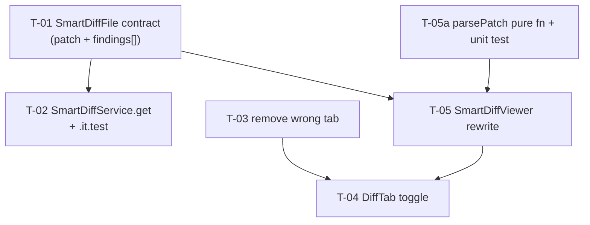

# Development Plan: Smart Diff Rework

## Goal

Rework the Smart Diff feature so it matches the authoritative UI design. Smart Diff is **not** a
separate tab — it is the default content of the existing **"Files changed"** tab (`tab === "diff"`),
toggled via a "Smart order / Original order" switch. In Smart order, the diff is grouped by role
(Core / Wiring / Boilerplate) with the **actual inline diff content** rendered per file, including
per-line severity badges (`blocker` / `warning` / `suggestion`) drawn on the matching code lines.

The initial implementation shipped a wrong "Smart diff" tab that showed only a flat file list with a
"N findings" badge per file. This plan: (1) extends the `SmartDiffFile` contract with `patch` and
structured `findings` (line + severity), (2) updates the service to pass them, (3) removes the wrong
tab wiring, (4) adds the Smart/Original toggle to `DiffTab`, and (5) rewrites `SmartDiffViewer` to
render inline annotated diffs.

## Architecture

- **Onion (server):** Contract lives in `src/vendor/shared/` (Ports). `SmartDiffService` (Application)
  consumes `ReviewRepository` (Infrastructure) — it already does; we only change the projection it
  builds. No route change, no DB schema change (the `patch` column already exists on `pr_files` and is
  returned by `getPrFiles`).
- **Shared contract sync:** `server/src/vendor/shared/contracts/brief.ts` and
  `client/src/vendor/shared/contracts/brief.ts` are **manual copies** — both edited in the same task.
- **Client (Next.js App Router):** `SmartDiffViewer` is a `"use client"` colocated component under the
  PR-detail route. The unified-diff parser is extracted as a pure, unit-testable function so the
  rendering component stays thin. `DiffTab` owns the Smart/Original toggle state.



## Tech Stack

- Server: Fastify 5, Drizzle ORM, Zod (`fastify-type-provider-zod`), Vitest (+ Testcontainers for `.it.test`).
- Client: Next.js 15 App Router, React 19, TanStack Query, next-intl, Vitest + jsdom + React Testing Library.

## Global Constraints

- TDD per task: write failing test → run (red) → implement → run (green) → commit.
- No placeholders — every step contains the actual code.
- Each task ends with one runnable Acceptance command and a commit.
- **Both vendor copies** of `brief.ts` change in the SAME task (T-01).
- **No DB schema change** — `pr_files.patch` already exists and `getPrFiles` already returns it. Do
  NOT run `db:generate` / `db:migrate`.
- Severity stored as a free `z.string()` on the contract for forward-compat; the UI maps known values
  (`CRITICAL` → blocker, `WARNING` → warning, `SUGGESTION` → suggestion) and falls back gracefully.
- Edit-tool quote corruption: writing `.ts`/`.tsx` string literals via the Edit tool can convert
  ASCII `'` to Unicode `'`/`'` (TS1127). Prefer the `Write` tool for new files; after any `Edit`
  touching string literals, verify `pnpm typecheck` is clean.

## Requirements

- R1: `SmartDiffFile` carries `patch: string | null` (raw unified diff) and
  `findings: { line: number; severity: string }[]`, replacing `finding_lines`. Both vendor copies updated.
- R2: `SmartDiffService.get()` populates `patch` from `getPrFiles` rows and `findings` from non-dismissed
  findings of the most recent review (`{ line: startLine, severity }`).
- R3: The integration test asserts `findings[0].line` and `findings[0].severity` instead of `finding_lines`.
- R4: The wrong "Smart diff" tab is removed: no `{ key: "smart-diff" }` entry in `PrDetailHeader`, no
  `tab === "smart-diff"` branch and no `SmartDiffViewer` import in `page.tsx`.
- R5: `DiffTab` renders a "Smart order / Original order" toggle (two buttons) in the `SectionLabel`
  `right` slot. "Smart order" is the default active state.
- R6: When Smart order is active, `DiffTab` renders `<SmartDiffViewer prId={...} />`; when Original order
  is active it renders the existing `<DiffViewer files commenting />`.
- R7: `SmartDiffViewer` shows a "REVIEWER-ORDERED DIFF" label and a total stats line "N files · +X −Y"
  (sum across all files).
- R8: Each group renders a colored dot (Core=blue, Wiring=yellow, Boilerplate=gray), role label,
  subtitle, and a file-count badge. Boilerplate is collapsed by default; Core and Wiring are expanded.
- R9: Each file card shows the filename, a "+N −N" diff badge, and a "summary" button shown only when
  `pseudocode_summary` is non-null.
- R10: Expanded file cards render the `patch` as inline diff (line numbers, `+`/`-`/context), with a
  severity badge (`blocker` / `warning` / `suggestion`) on the RIGHT of any line whose new-line number
  matches a `findings[].line`.
- R11: The unified-diff parser is a separate pure function `parsePatch(patch: string): DiffLine[]`
  (`DiffLine = { type: '+' | '-' | ' '; content: string; lineNo: number | null }`), unit-tested in isolation.

## Design audit

| Panel | Element | Requirement |
| ----- | ------- | ----------- |
| DiffTab header | "Smart order" / "Original order" toggle (Smart active default) | R5 |
| Smart order view | "REVIEWER-ORDERED DIFF" label | R7 |
| Smart order view | Total stats "9 files · +247 −38" | R7 |
| Group header | Blue dot + "Core logic" + "The substance…" + file count | R8 |
| Group header | Yellow dot + "Wiring" + "Hooks the core…" + file count | R8 |
| Group header | Gray dot + "Boilerplate" + "Generated / mechanical…" + file count | R8 |
| Group state | Boilerplate collapsed; Core + Wiring expanded | R8 |
| File card header | Filename + "+N −N" diff badge | R9 |
| File card header | "summary" button (only if pseudocode_summary present) | R9 |
| File card body | Inline diff: line numbers + `+`/`-` per line | R10 |
| File card body | Per-line severity badge (blocker/warning/suggestion) on matching lines | R10, R11 |

> Orphan-contract check: `SmartDiffFile.pseudocode_summary` is already nullish in the contract and is now
> surfaced by the "summary" button (R9). `split_suggestion` remains in the `SmartDiff` schema and keeps its
> existing "large PR" banner behaviour in the rewritten viewer — no orphaned fields introduced.

## Affected modules & contracts

- `server` `smart-diff` module — `service.ts` projection change + `smart-diff.it.test.ts` assertions.
- Contracts — `SmartDiffFile` in BOTH `server/src/vendor/shared/contracts/brief.ts` and
  `client/src/vendor/shared/contracts/brief.ts`: add `SmartDiffFileFinding`, add `patch`, replace
  `finding_lines` with `findings`.
- `client` PR-detail route — `page.tsx`, `PrDetailHeader.tsx`, `DiffTab/DiffTab.tsx`, and the
  `SmartDiffViewer/` folder (component + new `parsePatch` helper + tests).

## INSIGHTS summary

- [client]: `src/vendor/shared/` is a manual copy of the server's — any contract change must be applied to
  both copies in the same change.
- [client]: Per-severity icons/colors are canonical in `src/vendor/ui/primitives/tokens.ts` as `SEV`
  (CRITICAL → `AlertOctagon`, WARNING → `AlertTriangle`, SUGGESTION → `Lightbulb`). Derive any severity
  icon via `SEV[severity].icon` + `Icon[sev.icon]`; never hardcode.
- [client]: `Icon` has no index signature — when indexing dynamically, type the key as `IconName`
  (TS7053 otherwise).
- [client]: Edit tool converts ASCII `'` to Unicode quotes in `.ts/.tsx` string literals (TS1127). Prefer
  `Write` for new files; re-run `pnpm typecheck` after Edits on string literals.
- [client]: Relative depth from `pulls/[number]/_components/<Name>/` back to `pulls/` is 3 levels
  (`../../../`); `[number]` counts as a level.
- [server]: A service must not run raw Drizzle queries — go through `ReviewRepository`. `SmartDiffService`
  already does; keep it that way (no new `db.select` in the service).
- [server]: `getPrFiles(prId)` returns `pr_files.$inferSelect` rows — `patch`, `additions`, `deletions`
  are all present. No new repo method needed.
- [server]: Never hand-edit migration files; but this rework needs NO migration (no schema change).

## File map

**Modified**
- `server/src/vendor/shared/contracts/brief.ts` — T-01
- `client/src/vendor/shared/contracts/brief.ts` — T-01
- `server/src/modules/smart-diff/service.ts` — T-02
- `server/src/modules/smart-diff/smart-diff.it.test.ts` — T-02
- `client/src/app/repos/[repoId]/pulls/[number]/_components/PrDetailHeader/PrDetailHeader.tsx` — T-03
- `client/src/app/repos/[repoId]/pulls/[number]/page.tsx` — T-03
- `client/src/app/repos/[repoId]/pulls/[number]/_components/DiffTab/DiffTab.tsx` — T-04
- `client/src/app/repos/[repoId]/pulls/[number]/_components/SmartDiffViewer/SmartDiffViewer.tsx` — T-05
- `client/src/app/repos/[repoId]/pulls/[number]/_components/SmartDiffViewer/SmartDiffViewer.test.tsx` — T-05
- `client/src/app/repos/[repoId]/pulls/[number]/_components/SmartDiffViewer/styles.ts` — T-05

**Created**
- `client/src/app/repos/[repoId]/pulls/[number]/_components/SmartDiffViewer/parsePatch.ts` — T-05
- `client/src/app/repos/[repoId]/pulls/[number]/_components/SmartDiffViewer/parsePatch.test.ts` — T-05

> Note: a `parsePatch` already exists at `client/src/components/diff-viewer/helpers.ts` returning a
> different `Line[]` shape (`kind`/`oldNo`/`newNo`). Do NOT reuse or modify it — the Smart Diff view needs
> the simpler `DiffLine` shape (R11) and matches findings by the NEW line number. Keep the new parser
> colocated and independently named to avoid coupling the two diff renderers.

## Phased tasks

### Phase 1 — Contract & server

#### T-01: Extend `SmartDiffFile` contract (both vendor copies)

- **Action:** In BOTH `server/src/vendor/shared/contracts/brief.ts` and
  `client/src/vendor/shared/contracts/brief.ts`, in the `// ---- Smart Diff ----` section: add a new
  schema `SmartDiffFileFinding = z.object({ line: z.number().int(), severity: z.string() })` with an
  exported `type SmartDiffFileFinding`. Change `SmartDiffFile` to add `patch: z.string().nullish()` and
  replace `finding_lines: z.array(z.number().int())` with `findings: z.array(SmartDiffFileFinding)`.
  Keep `path`, `pseudocode_summary`, `additions`, `deletions` unchanged. The two files must end
  byte-identical in this section.
  ```typescript
  export const SmartDiffFileFinding = z.object({
    line: z.number().int(),
    severity: z.string(),
  });
  export type SmartDiffFileFinding = z.infer<typeof SmartDiffFileFinding>;

  export const SmartDiffFile = z.object({
    path: z.string(),
    pseudocode_summary: z.string().nullish(),
    additions: z.number().int(),
    deletions: z.number().int(),
    patch: z.string().nullish(),
    findings: z.array(SmartDiffFileFinding),
  });
  export type SmartDiffFile = z.infer<typeof SmartDiffFile>;
  ```
- **Why:** Satisfies R1; without `patch` the client cannot render inline diffs and without structured
  `findings` it cannot draw per-line severity badges.
- **Module:** server (contract shared with client)
- **Type:** core
- **Skills to use:** zod, typescript-expert
- **Owned paths:** `server/src/vendor/shared/contracts/brief.ts`, `client/src/vendor/shared/contracts/brief.ts`
- **Depends-on:** none
- **Risk:** low
- **Known gotchas:** Both files are manual copies — must stay in sync (client INSIGHTS). No migration:
  this is a transport contract only, not a DB schema. Severity is a free `z.string()` (not an enum) for
  forward-compat per the design note.
- **Acceptance:** `cd server && pnpm exec tsc --noEmit` passes AND `cd client && pnpm typecheck` passes
  (both fail to compile against the old `finding_lines` shape until T-02/T-05 land, so run typecheck only
  on the two contract files' parse-ability:) — run `cd server && node -e "require('tsx/cjs'); const z=require('./src/vendor/shared/contracts/brief.ts'); console.log(typeof z.SmartDiffFile.parse)"` is NOT used; instead the binding acceptance is: `git grep -n "findings: z.array(SmartDiffFileFinding)" server/src/vendor/shared/contracts/brief.ts client/src/vendor/shared/contracts/brief.ts` returns both files. Commit at end.

#### T-02: Update `SmartDiffService.get()` + integration test (TDD)

- **Action (test first):** In `server/src/modules/smart-diff/smart-diff.it.test.ts`, rewrite the
  "A file with a seeded finding has non-empty finding_lines" test to assert the new shape: after parsing
  the body, find the file across all groups and assert
  `found.findings.length` > 0, `found.findings[0].line === 42`, and `found.findings[0].severity === 'WARNING'`.
  Also add an assertion in the first test that a core file with a non-empty `patch` round-trips
  (`found.patch` contains the seeded patch text). Run the suite to confirm RED.
- **Action (implement):** In `server/src/modules/smart-diff/service.ts`, replace the
  `findingsByFile` map of `number[]` with a `Map<string, { line: number; severity: string }[]>`. In the
  loop over `mostRecent.findings`, skip dismissed (`finding.dismissedAt != null`) and push
  `{ line: finding.startLine, severity: finding.severity }`. In step 5, change each file projection to
  `{ path, additions, deletions, patch: f.patch ?? null, findings: findingsByFile.get(f.path) ?? [], pseudocode_summary: null }`.
  Drop the dedupe/sort over `number[]` (or adapt to dedupe by `line`). Keep `classifyFiles`,
  `ROLE_ORDER`, and `split_suggestion` logic untouched. Run the suite GREEN.
- **Why:** Satisfies R2 + R3; the service is the only place that joins PR files with findings, so the
  inline-diff payload must be assembled here.
- **Module:** server
- **Type:** backend
- **Skills to use:** fastify-best-practices, drizzle-orm-patterns, onion-architecture-node, zod, typescript-expert
- **Owned paths:** `server/src/modules/smart-diff/service.ts`, `server/src/modules/smart-diff/smart-diff.it.test.ts`
- **Depends-on:** T-01
- **Risk:** medium
- **Known gotchas:** `reviewsForPull` returns `{ review, findings }[]`; `reviews[0].findings` is
  `FindingRow[]` with `startLine`, `severity`, `dismissedAt`, `file`. `getPrFiles` rows already include
  `patch` (nullable). Do NOT add a `db.select` to the service (onion: service → repository only). No
  migration. Severity values in DB are upper-case (`'WARNING'`, `'CRITICAL'`, `'SUGGESTION'`).
- **Acceptance:** `cd server && pnpm exec vitest run smart-diff.it.test` passes (requires Docker). Commit at end.

### Phase 2 — Remove wrong tab, then add toggle

#### T-03: Remove the wrong "Smart diff" tab wiring

- **Action:** In
  `client/src/app/repos/[repoId]/pulls/[number]/_components/PrDetailHeader/PrDetailHeader.tsx`, remove the
  `{ key: "smart-diff", label: "Smart diff", icon: "GitBranch" }` entry from the `Tabs` `tabs` array
  (leave `overview`, `findings`, `diff`). In
  `client/src/app/repos/[repoId]/pulls/[number]/page.tsx`, remove
  `import { SmartDiffViewer } from "./_components/SmartDiffViewer";` and remove the entire
  `{tab === "smart-diff" && <SmartDiffViewer prId={prId ?? ""} repoFullName={repoFullName} />}` line.
  Do not touch the `tab === "diff"` block (T-04 owns `DiffTab`, not `page.tsx`).
- **Why:** Satisfies R4; Smart Diff must live inside the "Files changed" tab, not as its own tab. Leaving
  the dead branch would render the old flat viewer.
- **Module:** client
- **Type:** ui
- **Skills to use:** react-frontend-architecture, next-best-practices, react-best-practices, typescript-expert
- **Owned paths:** `client/src/app/repos/[repoId]/pulls/[number]/_components/PrDetailHeader/PrDetailHeader.tsx`, `client/src/app/repos/[repoId]/pulls/[number]/page.tsx`
- **Depends-on:** none (independent of T-01/T-02; concurrent with Phase 1)
- **Risk:** low
- **Known gotchas:** `page.tsx` still imports and renders `DiffTab` for `tab === "diff"` — keep that
  import. After removing the `smart-diff` tab, the default tab logic (`search.get("tab") ?? "overview"`)
  is unaffected.
- **Acceptance:** `cd client && pnpm typecheck` passes AND
  `git grep -n "smart-diff\|SmartDiffViewer" client/src/app/repos/[repoId]/pulls/[number]/page.tsx client/src/app/repos/[repoId]/pulls/[number]/_components/PrDetailHeader/PrDetailHeader.tsx` returns nothing. Commit at end.

#### T-04: Add Smart/Original order toggle to `DiffTab`

- **Action:** In `client/src/app/repos/[repoId]/pulls/[number]/_components/DiffTab/DiffTab.tsx`, add
  `const [smartOrder, setSmartOrder] = React.useState(true);`. In the `SectionLabel` `right` slot, render
  two `<Button>`s ("Smart order" active when `smartOrder`, "Original order" active when `!smartOrder`)
  alongside the existing comments toggle (keep the comments toggle; group both in a flex container).
  Use `kind="ghost"`/`kind="default"` (or `size="sm"`) to indicate the active state, with
  `aria-pressed={smartOrder}` / `aria-pressed={!smartOrder}` for accessibility. Below the label, render
  conditionally: `smartOrder ? <SmartDiffViewer prId={prId ?? ""} /> : <DiffViewer files={files} commenting={commenting} />`.
  Import `SmartDiffViewer` from `../SmartDiffViewer`. Keep the "Files changed · {filesCount} files" label
  text.
- **Why:** Satisfies R5 + R6; the toggle is the design's entry point for Smart Diff inside the existing tab.
- **Module:** client
- **Type:** ui
- **Skills to use:** react-frontend-architecture, react-best-practices, next-best-practices, typescript-expert
- **Owned paths:** `client/src/app/repos/[repoId]/pulls/[number]/_components/DiffTab/DiffTab.tsx`
- **Depends-on:** T-03 (removes the old `SmartDiffViewer` usage in `page.tsx` so this becomes the sole
  consumer), T-05 (`SmartDiffViewer` new `{ prId }`-only props). Order: implement after T-05 so the new
  props compile.
- **Risk:** low
- **Known gotchas:** `SmartDiffViewer`'s new signature is `{ prId: string }` (no `repoFullName`) — passing
  the old prop will TS-error after T-05. The icon-only/text buttons need `aria-pressed`; for accessibility
  per react-best-practices, give each button a clear label. Do not store derived state — `smartOrder` is
  genuine UI state.
- **Acceptance:** `cd client && pnpm typecheck` passes AND `cd client && pnpm test DiffTab` passes if a
  DiffTab test exists; otherwise `cd client && pnpm test SmartDiffViewer` (T-05 suite) plus `pnpm typecheck`
  is the gate. Commit at end.

### Phase 3 — SmartDiffViewer rewrite

#### T-05: Rewrite `SmartDiffViewer` with inline annotated diffs + `parsePatch` (TDD)

- **Action (parser test first):** Create
  `client/src/app/repos/[repoId]/pulls/[number]/_components/SmartDiffViewer/parsePatch.test.ts`. Assert
  `parsePatch("")` → `[]`; that a patch with a `@@ -1,3 +1,4 @@` hunk header yields additions/deletions/
  context lines with correct `lineNo` (new-line numbers; deletions carry `lineNo: null` since they have no
  new-line position); and that multiple hunks reset line numbers per the headers. Run RED.
- **Action (parser):** Create
  `client/src/app/repos/[repoId]/pulls/[number]/_components/SmartDiffViewer/parsePatch.ts` exporting:
  ```typescript
  export interface DiffLine { type: "+" | "-" | " "; content: string; lineNo: number | null; }
  export function parsePatch(patch: string | null | undefined): DiffLine[] { /* parse @@ -X,Y +A,B @@,
    track current new-line number; '+' → { type:"+", lineNo: newNo++ }, '-' → { type:"-", lineNo: null },
    ' '/context → { type:" ", lineNo: newNo++ }; skip the hunk-header line itself or emit it as context. */ }
  ```
  Match the project's hunk-header regex shape (`@@ -(\d+)(?:,\d+)? \+(\d+)(?:,\d+)? @@`). Run parser test GREEN.
- **Action (component test):** Rewrite
  `client/src/app/repos/[repoId]/pulls/[number]/_components/SmartDiffViewer/SmartDiffViewer.test.tsx`:
  drop `useRouter`/`repoFullName`/`finding_lines` mocks. Mock `useSmartDiff` only. Use `BASE_DATA` with the
  new `SmartDiffFile` shape (`patch`, `findings: [{ line, severity }]`). Assert: (1) "REVIEWER-ORDERED DIFF"
  label renders; (2) total stats line "N files · +X −Y" renders with summed values; (3) Core, Wiring,
  Boilerplate group headers render; (4) Boilerplate body hidden by default, Core/Wiring expanded; (5) a
  file whose `findings` include a line matching a rendered `+` line shows the mapped severity badge text
  (e.g. "warning"); (6) the "summary" button shows only when `pseudocode_summary` is non-null. Run RED.
- **Action (component):** Rewrite
  `client/src/app/repos/[repoId]/pulls/[number]/_components/SmartDiffViewer/SmartDiffViewer.tsx` to props
  `{ prId: string }`. Render a "REVIEWER-ORDERED DIFF" `SectionLabel`, a total-stats summary line
  (sum `additions`/`deletions` across all groups' files; count files), then each group: colored dot
  (Core=`var(--accent-text)`, Wiring=`var(--warn)`, Boilerplate=`var(--text-muted)`), role label,
  subtitle, file-count badge, collapsible (Boilerplate `useState(false)`, others `useState(true)`).
  Per file card: filename, "+N −N" badge, and a "summary" button (`pseudocode_summary != null`) that
  toggles showing the summary text. Expanded card body renders `parsePatch(file.patch)`; for each line
  render line number + sign + content, and if `line.type === "+"` and `line.lineNo` matches a
  `file.findings[].line`, render a severity badge on the right. Map severity → label/color via a
  `Record<string, { label: string; color: string; icon: IconName }>` keyed by upper-case DB values
  (`CRITICAL` → blocker, `WARNING` → warning, `SUGGESTION` → suggestion) with a default fallback. Keep the
  existing large-PR `split_suggestion` banner. Update `styles.ts` for the new diff-line / severity-badge /
  stats elements (extend the existing `s` object; do not delete still-used keys). Run component test GREEN.
- **Why:** Satisfies R7–R11; this is the core visual rework — inline diff with per-line severity is the
  whole point of the redesign.
- **Module:** client
- **Type:** ui
- **Skills to use:** react-frontend-architecture, react-best-practices, next-best-practices, typescript-expert
  (load `react-testing-library` lazily via the Skill tool when writing the RTL component test)
- **Owned paths:** `client/src/app/repos/[repoId]/pulls/[number]/_components/SmartDiffViewer/SmartDiffViewer.tsx`, `client/src/app/repos/[repoId]/pulls/[number]/_components/SmartDiffViewer/SmartDiffViewer.test.tsx`, `client/src/app/repos/[repoId]/pulls/[number]/_components/SmartDiffViewer/styles.ts`, `client/src/app/repos/[repoId]/pulls/[number]/_components/SmartDiffViewer/parsePatch.ts`, `client/src/app/repos/[repoId]/pulls/[number]/_components/SmartDiffViewer/parsePatch.test.ts`
- **Depends-on:** T-01 (new `SmartDiffFile` type)
- **Risk:** high
- **Known gotchas:** Derive severity icon/color from `SEV` tokens in `src/vendor/ui/primitives/tokens.ts`
  rather than hardcoding (client INSIGHTS); type dynamic `Icon[...]` keys as `IconName` (TS7053). Findings
  match by NEW line number — deletions (`lineNo: null`) never carry a badge. Prefer the `Write` tool for the
  new files to avoid Edit-tool Unicode-quote corruption (TS1127); re-run `pnpm typecheck` after any Edit on
  string literals. Do not store derived values (totals) in state — compute during render. Keep boilerplate
  collapsed via `useState(false)`; this is genuine UI state, not derived.
- **Acceptance:** `cd client && pnpm test SmartDiffViewer && pnpm test parsePatch && pnpm typecheck` all pass. Commit at end.

## Testing strategy

- Server unit: `cd server && pnpm exec vitest run --exclude '**/*.it.test.ts'`
- Server integration: `cd server && pnpm exec vitest run smart-diff.it.test` (requires Docker)
- Client unit/RTL: `cd client && pnpm test SmartDiffViewer && pnpm test parsePatch && pnpm test DiffTab`
- Client types: `cd client && pnpm typecheck`
- Full regression before merge: `cd client && pnpm test && pnpm typecheck` and `cd server && pnpm test`

## Risks & mitigations

- **Contract change breaks compile in the window between T-01 and T-02/T-05** — mitigated by phasing: T-01
  → T-02 (server) and T-01 → T-05 (client) land the consumers; each task's Acceptance includes a typecheck
  so a half-migrated tree never merges. Each phase reaches a mergeable state only once its consumers compile.
- **`pseudocode_summary` is always `null` from the service today** — the "summary" button is wired but will
  not render until a future task populates it. This is acceptable (nullish-guarded) and tracked as
  out-of-scope: summary generation is not part of this rework.
- **Severity values mismatch (DB upper-case vs design lower-case labels)** — mitigated by an explicit
  upper-case-keyed map with a graceful default in T-05.
- **Existing duplicate `parsePatch` in `diff-viewer/helpers.ts`** — intentionally NOT reused; the new one
  is colocated and independently named to keep the two diff renderers decoupled (documented in File map).
- **i18n strings** — `messages/en/prReview.json` has a `smartDiff` block with `findingLines` (now unused)
  and lacks "REVIEWER-ORDERED DIFF". T-05 may add new keys (e.g. `reviewerOrdered`, `totalStats`) under
  `smartDiff`; if added, keep within the `SmartDiffViewer` owned-path work and use `useTranslations`.

## Red-flags check

- [x] Global Constraints have no internal contradictions (no schema change ⇒ no migration; both vendor copies in one task)
- [x] Every requirement maps to a task (R1→T-01, R2/R3→T-02, R4→T-03, R5/R6→T-04, R7–R11→T-05)
- [x] Dependencies form a DAG (T-01→T-02; T-01→T-05; T-03→T-04; T-05→T-04; no cycles)
- [x] Concurrent tasks have non-overlapping Owned paths and parent directories (Phase 1 server vs T-03 client are disjoint)
- [x] Every task description names exact file paths
- [x] Every task is self-contained (carries contract refs, owned paths, runnable acceptance)
- [x] Every Acceptance is a runnable, binary command
- [x] Each phase produces a mergeable state (consumers compile within the same phase before next begins)
- [x] Shared contract change updates both vendor copies in the same task (T-01)
- [x] No schema change ⇒ correctly NO `db:generate`/`db:migrate` (verified `pr_files.patch` exists, `getPrFiles` returns it)
- [x] Integration edge-cases explicit: 404 path and boilerplate-grouping tests already exist in `.it.test`; finding-shape assertion is updated in T-02
- [x] UI design audit completed — every visible panel element maps to a requirement
- [x] Orphan contracts: `pseudocode_summary` surfaced (R9); `split_suggestion` retains its banner; `findings`/`patch` consumed by T-05
