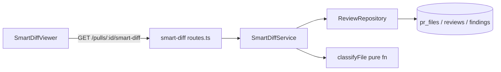

# Development Plan: Smart Diff

## Goal

Add a "Smart Diff" feature that classifies the files of a PR into `core` / `wiring` /
`boilerplate` using a deterministic, path-based rule engine (no LLM), exposes the grouped result
through a new server route `GET /pulls/:id/smart-diff` shaped to the existing `SmartDiff` Zod
contract, and renders it in the PR-detail UI as a grouped, collapsible `SmartDiffViewer` that
surfaces per-file finding badges from the most recent review.

## Architecture

DevDigest backend is an onion / ports-and-adapters architecture — **all imports point inward**:

```
Transport (modules/*/routes.ts)
  → Application (modules/*/service.ts)
    → Infrastructure (modules/*/repository.ts, src/adapters/*)
      → Ports (@devdigest/shared, src/vendor/shared/**)
        → Core (reviewer-core/, pure)
```

The classifier is a **pure function** with no I/O — it lives in the `smart-diff` server module as a
domain helper (it has no LLM dependency so it does not belong in `reviewer-core/`, and it is server
feature logic, not a shared contract). The route composes already-fetched data (PR files +
findings) through the **repository layer** — services and routes must NEVER touch `db/schema` or
Drizzle directly (the architecture reviewer flagged this HIGH on the Intent feature; see INSIGHTS).

The client adds a feature component under the PR-detail route's colocated `_components/`, a data
hook in `src/lib/hooks/`, and a new tab.



## Tech Stack

- **Server:** Fastify 5, Drizzle ORM, Zod via `fastify-type-provider-zod`, Vitest.
- **Client:** Next.js 15 App Router, React 19, TanStack Query, next-intl, Vitest + jsdom + RTL.
- **Contracts:** `@devdigest/shared` → `server/src/vendor/shared` (manual copy in
  `client/src/vendor/shared`).

## Global Constraints

- **No LLM call** in the smart-diff feature — it is pure composition of already-persisted data.
- **No contract changes.** `SmartDiff`, `SmartDiffGroup`, `SmartDiffFile`, `SmartDiffRole`,
  `ProposedSplit` already exist in BOTH vendor copies of
  `contracts/brief.ts` (verified identical). Do not add or edit any contract. If you believe a
  contract change is needed, STOP — re-read the contract first.
- **Repository layer only.** `SmartDiffService` must obtain data via `ReviewRepository`
  (`getPull`, `getPrFiles`, `reviewsForPull`) — never via raw Drizzle / `db/schema` from the
  service or route.
- **Routes are thin:** Zod params schema → call service → return. No DB, no SDK, no logic.
- **Workspace scoping** is mandatory: resolve `workspaceId` via `getContext(container, req)` and
  pass it to `repo.getPull(workspaceId, prId)`, which throws/returns undefined for cross-workspace
  PRs (return 404).
- **Edit-tool quote corruption (Windows):** the Edit tool rewrites ASCII `'` to Unicode curly
  quotes in `.ts`/`.tsx` string literals (TS1127). Prefer the `Write` tool for new files. If you
  must Edit a string literal, build multi-line strings as arrays joined with `.join(...)`, or run
  the curly-quote fix one-liner from `client/INSIGHTS.md`.
- **Client repo-scoped query guard:** every client `useQuery` keyed by an id must set
  `enabled: !!id` (see `client/INSIGHTS.md`).
- **Vendor copy is manual** — only relevant if a contract ever changes; here it does not.

## File map

### Created

| Path | Purpose |
| ---- | ------- |
| `server/src/modules/smart-diff/constants.ts` | Classification patterns + thresholds (single source) |
| `server/src/modules/smart-diff/classifier.ts` | Pure `classifyFile(path)` → role + `classifyFiles` helper |
| `server/src/modules/smart-diff/classifier.test.ts` | Unit tests for the classifier |
| `server/src/modules/smart-diff/service.ts` | `SmartDiffService.get(prId, workspaceId)` — composes `SmartDiff` |
| `server/src/modules/smart-diff/routes.ts` | `GET /pulls/:id/smart-diff` Fastify plugin |
| `server/src/modules/smart-diff/smart-diff.it.test.ts` | Integration test for the route (Docker) |
| `client/src/lib/hooks/smart-diff.ts` | `useSmartDiff(prId)` TanStack Query hook |
| `client/src/app/repos/[repoId]/pulls/[number]/_components/SmartDiffViewer/SmartDiffViewer.tsx` | Grouped, collapsible viewer |
| `client/src/app/repos/[repoId]/pulls/[number]/_components/SmartDiffViewer/styles.ts` | Inline style objects |
| `client/src/app/repos/[repoId]/pulls/[number]/_components/SmartDiffViewer/index.ts` | Barrel re-export |
| `client/src/app/repos/[repoId]/pulls/[number]/_components/SmartDiffViewer/SmartDiffViewer.test.tsx` | RTL tests |

### Modified

| Path | Change |
| ---- | ------ |
| `server/src/modules/index.ts` | Register `smartDiff` plugin |
| `client/src/lib/hooks/index.ts` | `export * from "./smart-diff"` |
| `client/src/app/repos/[repoId]/pulls/[number]/_components/PrDetailHeader/PrDetailHeader.tsx` | Add a "Smart diff" tab |
| `client/src/app/repos/[repoId]/pulls/[number]/page.tsx` | Render `SmartDiffViewer` for `tab === "smart-diff"` |

## INSIGHTS summary

- [server]: Services must go through `ReviewRepository`, never raw Drizzle / `db/schema` — the
  architecture reviewer flagged this HIGH on the Intent feature. Construct
  `new ReviewRepository(container.db)` in the service constructor.
- [server]: The `SmartDiff` contract and all its sub-schemas already exist in
  `contracts/brief.ts` — grep before adding any contract infrastructure; none is needed.
- [server]: `ReviewRepository.getPull(workspaceId, prId)` returns `undefined` (not null) for a
  missing/cross-workspace PR; `getPrFiles(prId)` and `reviewsForPull(prId)` provide files and
  findings without extra DB code.
- [server]: `pnpm db:generate` + `pnpm db:migrate` only matter for schema changes — this feature
  has none, so no migration is required.
- [client]: `src/vendor/shared/` is a manual copy of the server copy; not touched here.
- [client]: Every repo/id-scoped `useQuery` must set `enabled: !!prId`, else it fires
  `GET /pulls//smart-diff` (404) on first mount before the id resolves.
- [client]: Canonical per-severity styling lives in `src/vendor/ui/primitives/tokens.ts` as `SEV`
  (CRITICAL → `AlertOctagon`, WARNING → `AlertTriangle`, SUGGESTION → `Lightbulb`); derive the
  badge color/icon from there — never hardcode.
- [client]: `Icon[someString]` causes TS7053 (no index signature) — type the key as `IconName`
  from `@devdigest/ui`.
- [client/server]: Edit tool corrupts ASCII quotes in `.ts`/`.tsx` string literals on Windows;
  prefer the `Write` tool for new files.

## Design audit

The request supplies the design as a textual screenshot description; the matching i18n strings
already exist in `client/messages/en/prReview.json` under the `smartDiff` key (`coreLabel`,
`wiringLabel`, `boilerplateLabel`, `largeTitle`, `largeBody`, `filesCount`, `findingLines`,
`groupedByRole`). Every visible element below maps to a requirement.

| Panel | Element | Requirement |
| ----- | ------- | ----------- |
| Section header | Colored dot (blue Core / yellow Wiring / gray Boilerplate) | R5 |
| Section header | Role label (Core logic / Wiring / Boilerplate) | R5 |
| Section header | Subtitle per role ("review closely" / "Hooks the core into the app" / "skim") | R5 |
| Boilerplate section | Collapsed by default, expandable | R6 |
| File card | Filename | R5 |
| File card | Line badge (`+84 −8` style) | R5 |
| File card | "N findings" badge colored by max severity | R7 |
| File card | Clicking badge navigates to finding file:line | R8 |
| Top of viewer | Large-PR split suggestion banner (when `too_big`) | R9 |
| Empty/loading | Loading skeleton + empty state (no diff) | R10 |

## Requirements

- R1: A pure, deterministic `classifyFile(path)` returns `core | wiring | boilerplate` based on
  path/pattern rules; classification never depends on patch content or order.
- R2: All classification patterns and thresholds live in a separate `constants.ts` (single source).
- R3: `GET /pulls/:id/smart-diff` returns a payload validating against the `SmartDiff` contract,
  composed from `pr_files` and the most recent review's findings — with no LLM call.
- R4: The route is workspace-scoped and returns 404 for a missing / cross-workspace PR.
- R5: `SmartDiffViewer` renders one section per role with a colored dot, role label, and subtitle,
  and renders file cards with filename + `+adds −dels` line badge.
- R6: The Boilerplate section is collapsed by default and can be expanded.
- R7: A file with findings from the latest review shows a "N findings" badge colored by the file's
  max finding severity.
- R8: Clicking a file's finding badge navigates to that file's first finding line (file:line).
- R9: When `split_suggestion.too_big` is true, the viewer shows the large-PR split banner listing
  the proposed splits.
- R10: The viewer handles loading and empty (no files) states without crashing.

## Affected modules & contracts

- `server/src/modules/smart-diff` (new) — classifier + constants + service + routes + tests.
- `server/src/modules/index.ts` — register the plugin.
- `client` PR-detail route — new hook, new viewer component, new tab.
- Contracts: **none** — `SmartDiff` and sub-schemas pre-exist in both vendor copies.

## Architecture notes

- **Classifier placement:** pure, no LLM, no I/O → it is server feature-domain logic, kept inside
  the `smart-diff` module (NOT `reviewer-core/`, which is reserved for the LLM review pipeline).
  Exported as plain functions so the service and tests can import them directly.
- **Finding lines per file:** `reviewsForPull(prId)` returns reviews newest-first, each with its
  `findings`. Take the FIRST review (most recent) and map its findings by `file` → sorted unique
  `start_line[]` for `SmartDiffFile.finding_lines`. Use only non-dismissed findings
  (`dismissedAt == null`) to match the PR-list finding counts.
- **`split_suggestion`:** `total_lines = Σ(additions + deletions)` over files; `too_big` when
  `total_lines > LARGE_PR_THRESHOLD` (constant). `proposed_splits` group file paths by role
  (one proposed split per non-empty role) — a deterministic, no-LLM heuristic.
- **`pseudocode_summary`** is `nullish` in the contract and requires an LLM — leave it `null`
  (omit) for every file. (Out of scope — tracked here as a deliberate null; no LLM in this feature.)
- **RSC boundary:** `SmartDiffViewer` is a client component (`"use client"`) — it uses hooks and
  click handlers.
- **DI wiring:** no new container ports/adapters — the service only needs `container.db` to build
  `ReviewRepository`, exactly like `IntentService`.

## Phased tasks

> Phase 1 ships the backend (classifier → service → route) as a self-consistent, independently
> mergeable slice. Phase 2 ships the client against the now-live contract. Within Phase 1, T-01 and
> T-02 are independent; T-03/T-04 depend on them.

### Phase 1 — Backend: classifier, service, route

#### T-01: Classification constants

- **Action:** Create `server/src/modules/smart-diff/constants.ts` exporting deterministic
  classification rules and thresholds as the single source:
  - `BOILERPLATE_PATTERNS: RegExp[]` matching: `package-lock.json`, `pnpm-lock.yaml`,
    `yarn.lock`, any `*.lock`, paths containing `dist/`, `*.snap`, `__snapshots__/`,
    `*.generated.*`, `*.min.js`, `*.map`.
  - `WIRING_PATTERNS: RegExp[]` matching: `src/server.ts`, `src/index.ts`, any `**/index.ts`,
    `config.ts`, paths containing `/config/`, route-registration files
    (`routes.ts`, `**/router.ts`, `app.ts`, `main.ts`).
  - `LARGE_PR_THRESHOLD = 500` (changed lines) with a doc comment.
  - `ROLE_ORDER: SmartDiffRole[] = ['core', 'wiring', 'boilerplate']` for stable group ordering.
  Use plain `RegExp` literals; do NOT include any LLM or threshold logic elsewhere. Import the
  `SmartDiffRole` type from `@devdigest/shared`.
- **Why:** Satisfies R2 — keeps all heuristics in one auditable file so the classifier stays a thin
  matcher.
- **Module:** server
- **Type:** backend
- **Skills to use:** onion-architecture-node, typescript-expert
- **Owned paths:** `server/src/modules/smart-diff/constants.ts`
- **Depends-on:** none
- **Risk:** low
- **Known gotchas:** Prefer the `Write` tool (this file has regex literals and string patterns —
  Edit-tool quote corruption risk on Windows). Anchor patterns so `index.ts` matches at any depth
  but does not match `indexer.ts` (use `/(^|\/)index\.ts$/`).
- **Acceptance:** `cd server && pnpm exec tsc --noEmit` reports no new errors for this file;
  file exports `BOILERPLATE_PATTERNS`, `WIRING_PATTERNS`, `LARGE_PR_THRESHOLD`, `ROLE_ORDER`.

#### T-02: Pure file classifier + unit tests

- **Action:** Create `server/src/modules/smart-diff/classifier.ts`:
  - `export function classifyFile(path: string): SmartDiffRole` — returns `'boilerplate'` if any
    `BOILERPLATE_PATTERNS` matches, else `'wiring'` if any `WIRING_PATTERNS` matches, else
    `'core'`. Evaluation order is boilerplate → wiring → core (most-specific first); purely a
    function of `path`.
  - `export function classifyFiles<T extends { path: string }>(files: T[]): Map<SmartDiffRole, T[]>`
    — groups files by role preserving input order within each role.
  Import patterns from `./constants.js` and `SmartDiffRole` from `@devdigest/shared`. No I/O, no
  Drizzle, no Fastify imports.
  Create `server/src/modules/smart-diff/classifier.test.ts` (hermetic, Vitest) covering:
  `package-lock.json`/`*.lock`/`dist/...`/`*.snap`/`__snapshots__/`/`*.generated.ts` → `boilerplate`;
  `src/server.ts`/`src/index.ts`/`src/modules/x/index.ts`/`src/config.ts`/`src/config/db.ts`/
  `routes.ts` → `wiring`; `src/modules/auth/service.ts`/`src/middleware/rateLimit.ts` →
  `core`; and that `indexer.ts` (a trap) classifies as `core`, not `wiring`.
- **Why:** Satisfies R1 — the deterministic engine the route composes on.
- **Module:** server
- **Type:** backend
- **Skills to use:** onion-architecture-node, typescript-expert
- **Owned paths:** `server/src/modules/smart-diff/classifier.ts`,
  `server/src/modules/smart-diff/classifier.test.ts`
- **Depends-on:** T-01
- **Risk:** low
- **Known gotchas:** TDD — write `classifier.test.ts` first, run it (red), implement, run again
  (green). Prefer the `Write` tool. `noUncheckedIndexedAccess` is on — guard `Map.get()` results.
- **Acceptance:** `cd server && pnpm exec vitest run src/modules/smart-diff/classifier.test.ts`
  passes (all cases green).

#### T-03: SmartDiffService — compose the SmartDiff payload

- **Action:** Create `server/src/modules/smart-diff/service.ts` with
  `export class SmartDiffService`:
  - Constructor `(private readonly container: Container)` builds
    `this.repo = new ReviewRepository(container.db)` (mirror `IntentService`).
  - `async get(prId: string, workspaceId: string): Promise<SmartDiff>`:
    1. `const pr = await this.repo.getPull(workspaceId, prId); if (!pr) throw new NotFoundError('Pull request not found');`
    2. `const files = await this.repo.getPrFiles(prId);`
    3. `const reviews = await this.repo.reviewsForPull(prId);` — take `reviews[0]` (most recent) if
       present; build `findingsByFile: Map<string, number[]>` from its `findings` where
       `dismissedAt == null`, mapping `file` → sorted unique `startLine[]`.
    4. Group files with `classifyFiles(files)`; for each role in `ROLE_ORDER` that has files, emit a
       `SmartDiffGroup { role, files: SmartDiffFile[] }` where each `SmartDiffFile` is
       `{ path, additions, deletions, finding_lines: findingsByFile.get(path) ?? [], pseudocode_summary: null }`.
    5. `total_lines = Σ(additions + deletions)`; `too_big = total_lines > LARGE_PR_THRESHOLD`;
       `proposed_splits` = for each role with files, `{ name: <role label>, files: [paths…] }`.
    6. Return `{ groups, split_suggestion: { too_big, total_lines, proposed_splits } }` and parse
       it through `SmartDiff.parse(...)` before returning so the shape is contract-validated.
  Imports: `SmartDiff`, `SmartDiffGroup`, `SmartDiffFile` from `@devdigest/shared`; `Container`
  from `../../platform/container.js`; `NotFoundError` from `../../platform/errors.js`;
  `ReviewRepository` from `../reviews/repository.js`; classifier + constants from local files.
- **Why:** Satisfies R3 + R4 — produces the contract payload via the repository layer with no LLM.
- **Module:** server
- **Type:** backend
- **Skills to use:** onion-architecture-node, drizzle-orm-patterns, zod, typescript-expert
- **Owned paths:** `server/src/modules/smart-diff/service.ts`
- **Depends-on:** T-01, T-02
- **Risk:** medium
- **Known gotchas:** Do NOT query Drizzle / `db/schema` from the service — use only
  `ReviewRepository` methods (`getPull`, `getPrFiles`, `reviewsForPull`); raw queries here were
  flagged HIGH on Intent (`server/INSIGHTS.md`). `getPull` returns `undefined` (not null).
  `FindingRow.startLine`/`dismissedAt` are the DB column names. Guard `Map.get()` with `?? []`.
- **Acceptance:** `cd server && pnpm exec tsc --noEmit` has no new errors; class exported and
  `get()` returns a value that `SmartDiff.parse` accepts (exercised by T-04's integration test).

#### T-04: GET /pulls/:id/smart-diff route + integration test + registration

- **Action:** Create `server/src/modules/smart-diff/routes.ts` — a default `FastifyPluginAsync`
  exporting `smartDiffRoutes` that:
  - builds `const app = appBase.withTypeProvider<ZodTypeProvider>()` and
    `const service = new SmartDiffService(app.container)`.
  - registers `app.get('/pulls/:id/smart-diff', { schema: { params: IdParams } }, async (req) => {
    const { workspaceId } = await getContext(app.container, req);
    return service.get(req.params.id, workspaceId); })`.
  Mirror `intent/routes.ts` exactly for imports (`getContext` from `../_shared/context.js`,
  `IdParams` from `../_shared/schemas.js`). The route must contain NO DB access and NO logic beyond
  context + delegate. `NotFoundError` thrown by the service maps to 404 via the platform error
  handler.
  Then register it in `server/src/modules/index.ts`: add
  `import smartDiff from './smart-diff/routes.js';` and add `smartDiff,` to the `modules` object.
  Add `server/src/modules/smart-diff/smart-diff.it.test.ts` (Docker integration, `.it.test.ts`
  suffix) that seeds a PR with `pr_files` + a review with findings, calls
  `app.inject({ method: 'GET', url: '/pulls/<id>/smart-diff' })`, asserts 200 and that the parsed
  body satisfies `SmartDiff.parse`, that a known boilerplate file lands in the `boilerplate` group,
  and that a file with a finding has the expected `finding_lines`. Add a second case asserting a
  cross-workspace / unknown id returns 404. Model setup on an existing `*.it.test.ts` in
  `server/src/modules/` (e.g. `intent/intent.it.test.ts`).
- **Why:** Satisfies R3 + R4 — exposes the composed payload over HTTP and proves the contract +
  404 path end to end.
- **Module:** server
- **Type:** backend
- **Skills to use:** fastify-best-practices, onion-architecture-node, zod, drizzle-orm-patterns
- **Owned paths:** `server/src/modules/smart-diff/routes.ts`,
  `server/src/modules/smart-diff/smart-diff.it.test.ts`, `server/src/modules/index.ts`
- **Depends-on:** T-03
- **Risk:** medium
- **Known gotchas:** Route schemas are Zod-first via `fastify-type-provider-zod` — never call
  `.parse()` on params in the handler (`server/CLAUDE.md`). `IdParams` already exists in
  `_shared/schemas.js`. Integration tests need Docker (`pnpm exec vitest run .it.test`). Copy the
  exact seed/bootstrap helper used by `intent/intent.it.test.ts` to get an app + workspace + PR.
- **Acceptance:** `cd server && pnpm exec vitest run src/modules/smart-diff/smart-diff.it.test.ts`
  passes (200 + contract-valid body + 404 case); `pnpm exec tsc --noEmit` clean.

### Phase 2 — Client: hook, viewer, tab

#### T-05: useSmartDiff data hook

- **Action:** Create `client/src/lib/hooks/smart-diff.ts`:
  ```
  "use client";
  import { useQuery } from "@tanstack/react-query";
  import { api } from "../api";
  import type { SmartDiff } from "@devdigest/shared";

  export function useSmartDiff(prId: string | null | undefined) {
    return useQuery({
      queryKey: ["smart-diff", prId ?? ""],
      queryFn: () => api.get<SmartDiff>(`/pulls/${prId!}/smart-diff`),
      enabled: !!prId,
    });
  }
  ```
  Then add `export * from "./smart-diff";` to `client/src/lib/hooks/index.ts`.
- **Why:** Satisfies R3 client-side — fetches the grouped payload for the viewer.
- **Module:** client
- **Type:** ui
- **Skills to use:** react-frontend-architecture, next-best-practices, typescript-expert
- **Owned paths:** `client/src/lib/hooks/smart-diff.ts`, `client/src/lib/hooks/index.ts`
- **Depends-on:** T-04
- **Risk:** low
- **Known gotchas:** `enabled: !!prId` is mandatory (`client/INSIGHTS.md`) — without it the hook
  fires `GET /pulls//smart-diff` (404) before `prId` resolves. `SmartDiff` is already re-exported
  from `@devdigest/shared` and `client/src/lib/types.ts`.
- **Acceptance:** `cd client && pnpm typecheck` clean; `useSmartDiff` importable from `@/lib/hooks`.

#### T-06: SmartDiffViewer component + RTL tests

- **Action:** Create the colocated component folder
  `client/src/app/repos/[repoId]/pulls/[number]/_components/SmartDiffViewer/` with:
  - `SmartDiffViewer.tsx` (`"use client"`): props `{ prId: string; repoFullName: string | null }`.
    Calls `useSmartDiff(prId)`, `useTranslations("prReview")`. Behaviour:
    - Loading → `<Skeleton/>` rows (R10). No data / zero groups → an empty state message (R10).
    - When `split_suggestion.too_big`, render a banner using `t("smartDiff.largeTitle", { lines })`
      + `t("smartDiff.largeBody")` and list `proposed_splits[].name` with their file counts (R9).
    - For each group in payload order, render a section with: a colored dot
      (core → `var(--accent-text)`/blue, wiring → `var(--warn)`/yellow, boilerplate →
      `var(--text-muted)`/gray), the role label (`t("smartDiff.coreLabel" | "wiringLabel" |
      "boilerplateLabel")`), and a fixed per-role subtitle string (Core: "The substance of the
      change — review closely"; Wiring: "Hooks the core into the app"; Boilerplate: "Generated /
      mechanical — skim") (R5).
    - The `boilerplate` section starts collapsed via local `useState(false)`; a header toggle
      expands it (R6). Core and wiring start expanded.
    - Each file card: filename (start-truncated path with `title` full path — reuse the RTL-ellipsis
      style from `client/INSIGHTS.md`), a `+{additions} −{deletions}` mono badge (R5), and when
      `finding_lines.length > 0` a "{n} findings" badge (`t("smartDiff.findingLines"` is for
      finding-lines; use a plain count label) colored by max severity (R7).
    - Clicking the findings badge calls
      `router.push('/repos/' + repoId + '/pulls/' + number + '?tab=findings')` and (best-effort)
      scrolls to the file's first finding line; the badge is a `<button>` with an `aria-label`
      (R8). Use `useParams`/`useRouter` from `next/navigation` to build the target.
    - Severity for the badge color: this feature only has `finding_lines` (line numbers), not
      severities. Derive the badge color from the COUNT bucket is NOT acceptable — instead read the
      file's findings from the latest review is server-side only. Since `SmartDiffFile` carries no
      severity, color the badge with a single "has-findings" accent (`var(--warn)`) and note the
      severity-coloring refinement under Risks. (See Risks: severity not in contract.)
  - `styles.ts`: inline style objects (Tailwind utilities are not used in this route — match
    `OverviewTab/styles.ts`).
  - `index.ts`: `export { SmartDiffViewer } from "./SmartDiffViewer";`
  - `SmartDiffViewer.test.tsx` (RTL + Vitest, mock `useSmartDiff`,
    wrap in `NextIntlClientProvider` with `messages/en/prReview.json`, mock `next/navigation`):
    asserts (a) three role sections render with labels; (b) boilerplate body is hidden until its
    header is clicked; (c) a file with `finding_lines` shows a findings badge and clicking it calls
    the mocked router; (d) the split banner shows when `too_big`; (e) loading and empty states
    render. Model the mocking/Intl harness on `OverviewTab/OverviewTab.test.tsx`.
- **Why:** Satisfies R5–R10 — the full grouped, collapsible, finding-aware viewer.
- **Module:** client
- **Type:** ui
- **Skills to use:** react-frontend-architecture, react-best-practices, next-best-practices,
  typescript-expert
- **Owned paths:**
  `client/src/app/repos/[repoId]/pulls/[number]/_components/SmartDiffViewer/SmartDiffViewer.tsx`,
  `client/src/app/repos/[repoId]/pulls/[number]/_components/SmartDiffViewer/styles.ts`,
  `client/src/app/repos/[repoId]/pulls/[number]/_components/SmartDiffViewer/index.ts`,
  `client/src/app/repos/[repoId]/pulls/[number]/_components/SmartDiffViewer/SmartDiffViewer.test.tsx`
- **Depends-on:** T-05
- **Risk:** medium
- **Known gotchas:** Load the `react-testing-library` skill lazily before writing the test. Derive
  any per-severity icon/color from `SEV` in `src/vendor/ui/primitives/tokens.ts` if you add
  severity later — never hardcode. `Icon[str]` needs an `IconName`-typed key (TS7053). Prefer the
  `Write` tool for all new files (Edit-tool quote corruption). Relative import depth from this
  `_components/<Name>/` folder to `src/lib/` is deep — `useSmartDiff` is reachable via the
  `@/lib/hooks` alias; prefer the alias over counting `../`.
- **Acceptance:** `cd client && pnpm test src/app/repos/\\[repoId\\]/pulls/\\[number\\]/_components/SmartDiffViewer`
  passes; `cd client && pnpm typecheck` clean.

#### T-07: Wire the Smart Diff tab into PR detail

- **Action:** Two edits:
  1. `PrDetailHeader.tsx`: add a tab entry to the `Tabs` `tabs={[...]}` array:
     `{ key: "smart-diff", label: "Smart diff", icon: "GitBranch" }` (place it between `findings`
     and `diff`). Do not change any other prop.
  2. `page.tsx`: add a render branch
     `{tab === "smart-diff" && <SmartDiffViewer prId={prId ?? ""} repoFullName={repoFullName} />}`
     alongside the existing `tab === "overview" | "findings" | "diff"` branches, and add
     `import { SmartDiffViewer } from "./_components/SmartDiffViewer";`.
- **Why:** Satisfies R5–R10 navigation — makes the viewer reachable from the PR-detail page.
- **Module:** client
- **Type:** ui
- **Skills to use:** react-frontend-architecture, next-best-practices
- **Owned paths:**
  `client/src/app/repos/[repoId]/pulls/[number]/_components/PrDetailHeader/PrDetailHeader.tsx`,
  `client/src/app/repos/[repoId]/pulls/[number]/page.tsx`
- **Depends-on:** T-06
- **Risk:** low
- **Known gotchas:** `page.tsx` and `PrDetailHeader.tsx` are owned only by this task — no other
  Phase-2 task touches them, so no overlap. `repoFullName` and `prId` are already computed in
  `page.tsx` (see lines 36/82). Edit-tool quote risk: keep the new strings simple ASCII or run the
  curly-quote fix after editing.
- **Acceptance:** `cd client && pnpm typecheck` clean and `cd client && pnpm test` green
  (existing suites still pass); the "Smart diff" tab renders `SmartDiffViewer`.

## Testing strategy

- **Server unit:** `cd server && pnpm exec vitest run src/modules/smart-diff/classifier.test.ts`
  (no Docker).
- **Server integration:** `cd server && pnpm exec vitest run src/modules/smart-diff/smart-diff.it.test.ts`
  (requires Docker / Postgres).
- **Client unit/RTL:** `cd client && pnpm test` and `cd client && pnpm typecheck`.
- **Whole-server typecheck gate:** `cd server && pnpm exec tsc --noEmit`.
- **Architecture gate:** `cd server && npm run depcruise` (must stay at 0 errors — the new
  service must not import `db/schema` or `src/adapters`).

## Risks & mitigations

- **Severity color of the findings badge** — `SmartDiffFile` carries only `finding_lines` (no
  severity), so the badge cannot be colored by max severity from the contract alone. Mitigation:
  ship a single "has-findings" accent badge now (still satisfies R7's "badge present + navigable");
  per-severity coloring would require adding a `max_severity` field to the contract, which is
  explicitly OUT OF SCOPE here (no contract changes). Flagged for a follow-up if design insists on
  exact severity colors.
- **`pseudocode_summary` is null** — the contract allows it (`nullish`); generating it needs an
  LLM, which is out of scope. Deliberately emitted as `null`; no UI depends on it.
- **Classifier false positives** (e.g. a business-logic file named `config.ts`) — patterns are
  heuristic. Mitigation: rules live in `constants.ts` (R2) and are unit-tested (T-02) so they are
  easy to audit and extend; the trap-case test (`indexer.ts` → core) guards the most likely
  mis-anchor.
- **Integration test flakiness without Docker** — `.it.test.ts` requires Postgres. Mitigation: the
  classifier (the only non-trivial logic) is covered by a hermetic unit test that needs no Docker;
  the integration test only proves wiring + contract shape.

## Red-flags check

- [x] Global Constraints have no internal contradictions (no-LLM + no-contract-change + repo-only
  are mutually consistent; verified the contract pre-exists in both vendor copies).
- [x] Every requirement maps to a task (R1→T-02, R2→T-01, R3→T-03/T-04/T-05, R4→T-04, R5–R10→T-06,
  navigation→T-07).
- [x] Dependencies form a DAG (T-01→T-02→T-03→T-04→T-05→T-06→T-07; T-01 also feeds T-03; no cycles).
- [x] Concurrent tasks have non-overlapping Owned paths and parent directories (within Phase 1, T-01
  and T-02 own distinct files; T-04 is the only task touching `modules/index.ts`; in Phase 2 each
  task owns distinct files — T-05 owns `lib/hooks/*`, T-06 owns the `SmartDiffViewer/` dir, T-07
  owns `PrDetailHeader.tsx` + `page.tsx`).
- [x] Every task description names exact file paths.
- [x] Every task is self-contained (carries contract ref via `@devdigest/shared`, owned paths, and
  a runnable acceptance command).
- [x] Every Acceptance is a runnable command with binary pass/fail.
- [x] Each phase is self-consistent and mergeable (Phase 1 = working backend route + tests; Phase 2
  = client against the live route).
- [x] Shared contract changes assign both vendor copies in the same task — N/A, no contract change.
- [x] Schema changes include `db:generate` + `db:migrate` — N/A, no schema change.
- [x] Integration edge-cases explicit: workspace-scoped 404 is an explicit assertion in T-04.
- [x] UI design audit completed — every visible element maps to a requirement (see Design audit).
- [x] Orphan contracts: every `SmartDiff*` schema touched is implemented (groups → T-03/T-06,
  split_suggestion → T-03/T-06); `pseudocode_summary` is explicitly out-of-scope (deliberate null,
  tracked under Risks).
```