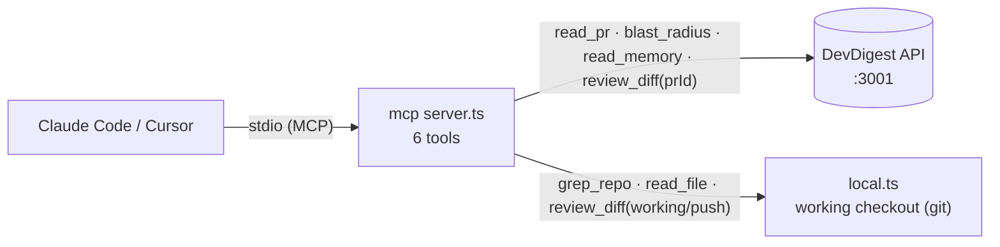

# @devdigest/mcp — MCP server + pre-push review CLI (L04)

Two runnable surfaces that reuse the DevDigest engine (`apps/api`):



Engine-backed tools call the HTTP API; local tools read the working checkout so
they work pre-push on uncommitted changes.

## 1. DevDigest MCP server (stdio)

A Model Context Protocol server for Claude Code / Cursor. Exposes six tools
(§11):

| Tool          | Backed by                         | Notes |
|---------------|-----------------------------------|-------|
| `read_pr`     | engine `GET /pulls/:id`           | full PR detail |
| `blast_radius`| engine `GET /pulls/:id/blast`     | changed symbols + downstream |
| `read_memory` | engine `GET /memory`              | curated memory items |
| `grep_repo`   | local `git grep`                  | searches the working checkout |
| `read_file`   | local fs (traversal-guarded)      | reads the working checkout |
| `review_diff` | engine `POST /pulls/:id/review` OR local working/push diff | PR review or pre-push diff |

Transport: **stdio**. Build then register in your MCP client:

```jsonc
// e.g. Claude Code / Cursor MCP config
{
  "mcpServers": {
    "devdigest": { "command": "devdigest-mcp", "env": { "DEVDIGEST_API_BASE": "http://localhost:3001" } }
  }
}
```

Run in dev: `pnpm --filter @devdigest/mcp dev:server`.

## 2. Local pre-push review CLI

```sh
devdigest review --mode push          # diff origin/HEAD...HEAD
devdigest review --mode working       # uncommitted working diff
devdigest review --pr <prId>          # trigger the engine's Structured Reviewer
devdigest review --mode push --json   # machine-readable
```

Exits non-zero on a high-severity finding so it drops into `.git/hooks/pre-push`:

```sh
#!/bin/sh
exec devdigest review --mode push
```

Without `--pr` (and no engine reachable) it runs a fast **offline heuristic**
pass (secrets, debug statements, security TODOs, large-diff) so the gate always
works locally. With `--pr` it reuses A2's full Structured Reviewer over HTTP.

## External source: GitHub MCP

For agents that need live GitHub context (issues, PR comments, file contents
beyond the imported snapshot), DevDigest treats the **official GitHub MCP
server** (`github-mcp-server`, the `github/github-mcp-server` toolset) as an
external MCP source. Register it alongside `devdigest` in the same MCP client
config; DevDigest's own tools stay focused on review/blast/memory while GitHub
MCP provides repository plumbing.

## Status / install

`@modelcontextprotocol/sdk` is declared in `package.json` but installed by the
orchestrator at the workspace checkpoint (parallel-phase no-install rule).
Until then, `client.ts`, `local.ts`, and the CLI's `heuristicReview` are
SDK-free and unit-testable; `server.ts` typechecks once the SDK is installed.
