# `@devdigest/reviewer-core` — the review engine

Pure review logic: **diff → prompt → LLM → grounded findings**. No database,
GitHub, or filesystem; the only side effect is an LLM call through an **injected**
`LLMProvider`, which is what makes it mock-testable and lets the same engine run
in two very different hosts:

- the **server** (`@devdigest/api`) for local reviews in the studio, and
- the **agent-runner** GitHub Action for reviews in CI.

Both wire it via a tsconfig path alias (`@devdigest/reviewer-core` →
`../reviewer-core/src`) and consume the TypeScript **source** directly (tsx in
dev, vitest in tests, `@vercel/ncc` bundle in the runner). The package never
emits JS — its `build` is a type-check.

## Pipeline

```mermaid
flowchart LR
  IN["inputs<br/>diff · agent manifest · skills"] --> PROMPT["assemblePrompt()<br/>prompt.ts"]
  PROMPT --> WRAP["wrapUntrusted()<br/>fence the diff vs prompt injection"]
  WRAP --> LLM["LLMProvider (injected)<br/>llm/openrouter.ts"]
  LLM --> STRUCT["structured output<br/>llm/structured.ts<br/>Zod → JSON Schema · parse-with-repair"]
  STRUCT --> GROUND["groundFindings()<br/>grounding.ts<br/>mechanical citation gate vs the diff"]
  GROUND --> REDUCE["reduce()<br/>review/reduce.ts<br/>merge map-reduce passes"]
  REDUCE --> TOREVIEW["toReview()<br/>output/to-review.ts"]
  TOREVIEW --> OUT["Review<br/>verdict · score · grounded findings"]
```

The grounding step is the mandatory gate: a finding that doesn't cite a real
line in the diff is dropped, so the engine can't hallucinate locations.
`review/run.ts` orchestrates single-pass vs map-reduce strategies.

## Public API

Exported from `src/index.ts`: `assemblePrompt` / `wrapUntrusted` (prompt),
`groundFindings` / `groundingSummary` (grounding), `toJsonSchema` / `extractJson`
/ `parseWithRepair` (structured output), plus the `run` entrypoint and
`reduce`. Contracts (`Review`, `Finding`, `Verdict`, …) come from
`@devdigest/shared`.

## Testing

`npm test` (vitest) — hermetic units with a stubbed `LLMProvider`: prompt
assembly, the grounding gate, `toReview` selection, and a full `run`. No keys,
no network. `npm run typecheck` doubles as the build. See
[`../TESTING.md`](../TESTING.md).
