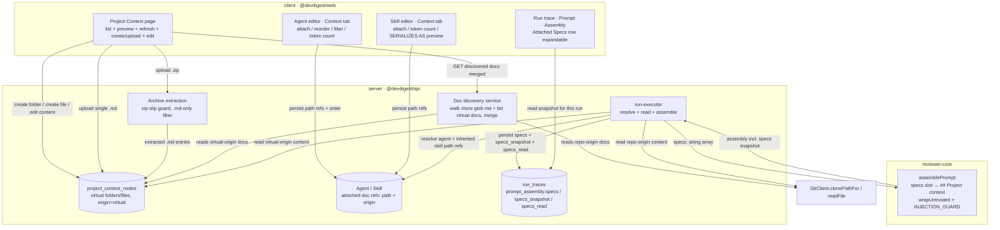
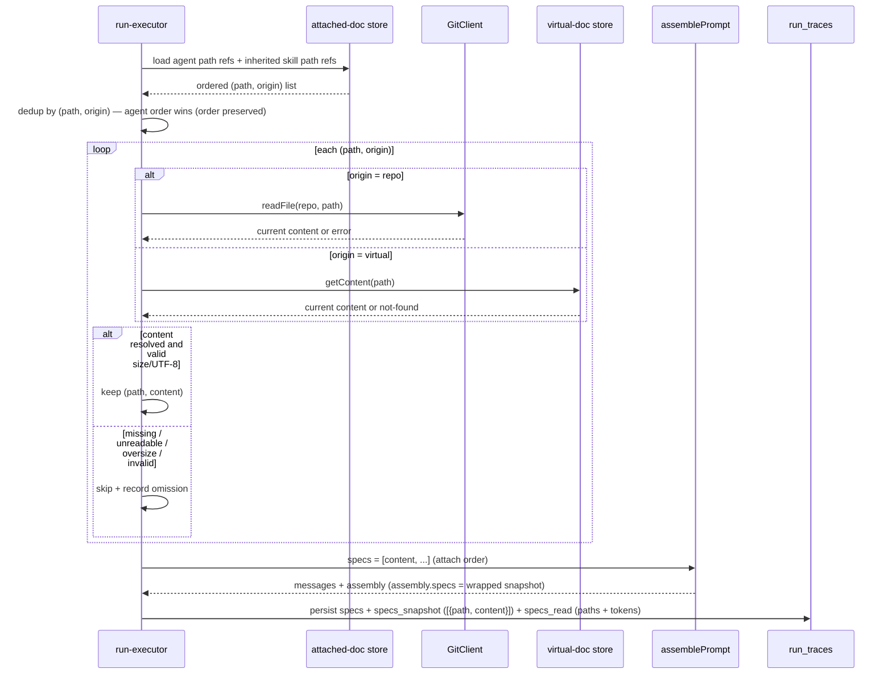

# Spec: Project Context  |  Spec ID: SPEC-2026-07-08-project-context  |  Status: approved

## Problem & why

Reviewer agents today only see the PR diff plus repo-intel-derived context (repo skeleton,
callers, file rank). The prompt engine already reserves a `specs` slot (rendered as
`## Project context`), but nothing ever fills it — `run-executor` passes no `specs` to
`reviewPullRequest`, and `RunTrace.specs_read` is hardcoded `[]`
(`server/src/modules/reviews/run-executor.ts:321,471`). As a result, a repo's own
human-authored guidance — invariants, API contracts, security baselines living in its `specs/`,
`docs/`, `insights/` markdown — cannot steer a review.

The requester wants any such markdown file to become *attachable context*: once a user attaches a
doc to a review agent (or a skill), that markdown stops being documentation-for-humans and starts
actively shaping the reviewer's behavior through the LLM prompt. This is the smaller, simpler of
two related features; the eventual automatic per-PR "flash-selector" that would auto-pick relevant
specs is explicitly out of scope here — this spec is manual attach only.

Beyond attaching docs that already exist in the repo, the requester also wants users who don't yet
have specs committed to their repo to create that content directly from the Project Context page —
create folders/files, upload a single `.md` file, or upload a `.zip` archive of `.md` files (whose
internal directory structure becomes matching subfolders) — and edit that content in-app afterward,
reusing the existing Skill Config tab's markdown editor pattern
(`client/src/app/skills/[id]/_components/SkillEditor/_components/ConfigTab/ConfigTab.tsx:18,85-91`).

## Goals / Non-goals

**Goals**

- Discover every `.md` file under configurable root folders (`specs`/`docs`/`insights`, at any
  depth) inside a cloned repo, merge it with DevDigest-managed virtual documents, and list the
  combined set with paths and origin on a "Project Context" page.
- Let a user manually attach/detach discovered documents (either origin) to an agent (Agent editor
  "Context" tab) and to a skill (Skill editor "Project context to use" section), with attach-order
  preserved.
- Store only document *path references* (`{ path, origin }`) in agent/skill metadata, never
  document text.
- At run time, resolve attached references (agent's own + inherited from attached skills), read
  current content from the right source per origin, and inject them into the existing
  `## Project context` prompt slot as an untrusted block governed by `INJECTION_GUARD`.
- Display a running token count of currently-attached documents in the Context tabs.
- Display, on the Project Context page itself, an aggregate file count and total estimated token
  count across every currently-discovered document (repo + virtual origin) plus the last-scan
  time — so a user can gauge total available context size before attaching any subset via the
  Context tabs.
- Make the run trace show which documents were attached for each run and let the user read the
  exact injected text for that specific run.
- Introduce zero additional LLM calls — pure text assembly.
- Let a user create folders/files and upload a single `.md` file or a `.zip` archive of `.md` files
  (preserving its internal directory structure as subfolders) into a DevDigest-managed *virtual*
  document space, under one of the workspace's configured root-folder names — merged into Project
  Context's listing and attach flow alongside git-discovered documents.
- Let a user edit an existing virtual document's markdown content in-app and save it.

**Non-goals**

- Automatic/relevance-based selection of specs per PR (the deferred "flash-selector").
- Semantic search / RAG chunking / embeddings over docs — the `code_chunks` embedding table
  (`server/src/db/schema/context.ts:31-47`) is a separate, pre-existing feature and out of scope
  here. Screen 1's status-line *real estate* ("Indexed: N files · M chunks · last Xm ago") is,
  however, repurposed by this spec: "chunks" becomes a total estimated token count over the
  discovered document set (see the new Goal above and AC-40) — no RAG/embedding logic is involved
  in producing that number, only the same `ceil(length/4)` heuristic used elsewhere in this spec.
- Writing to or editing documents that live in the actual git repository — git-discovered documents
  remain read-only from this app. Only DevDigest-managed *virtual* documents (created/uploaded
  through this feature) are editable/writable.
- Any change to `grounding.ts` or the citation gate.

## Assumptions

- The prompt engine's `specs` slot is the injection point. Verified: `PromptParts.specs?: string[]`
  (`reviewer-core/src/prompt.ts:67-68`), wrapped per-item via `wrapUntrusted('spec-N', …)`
  (`:127-130`), rendered as `## Project context` (`:161`), and persisted in the run trace via
  `PromptAssembly.specs` (`:182`, contract at `server/src/vendor/shared/contracts/trace.ts:43`).
  The requester's "L02–L04 slot already exists" claim is confirmed true.
- File reads at run time use the existing `GitClient` port: `readFile(repo, path)`
  (`server/src/vendor/shared/adapters.ts:226`) for the working-tree copy, `showFile(repo, ref, path)`
  (`:233`) if a specific ref is needed, and `clonePathFor(repo)` (`:234`) to root a recursive walk.
- Discovery runs against the already-cloned repo (`repos.clonePath`,
  `server/src/db/schema/repos.ts` via `repository.ts:73`), not a fresh network fetch.
- The configurable root-folder name set (default `specs`/`docs`/`insights`) is a per-workspace
  setting with a global default, mirroring the workspace-override-else-registry-default pattern of
  `resolveFeatureModel` / `getFeatureModelOverride`
  (`server/src/modules/settings/feature-models.ts:38-56`) — a workspace may override the set; repos
  without an override use the default.
- Token counting reuses a deterministic char-based heuristic; `estimateTokens(text) = ceil(len/4)`
  already exists server-side at `server/src/modules/intent/extractor.ts:74-76` **and** client-side
  at `client/src/app/skills/[id]/_components/SkillEditor/_components/ConfigTab/ConfigTab.tsx:14-16`
  (used today for the skill-body token counter, `ConfigTab.tsx:83`). The discovery response carries
  a server-computed `token_estimate` per document (same formula); the Context tabs' running token
  count (AC-11/AC-12) and the Project Context page's aggregate footer (AC-40) both just **sum
  already-fetched `token_estimate` values client-side** as checkboxes toggle — no need to fetch full
  document content, and no extra round trip, to keep either counter live.
- Attachments are workspace/repo-scoped — a user who can open an agent/skill in a workspace may
  attach any discovered doc from that workspace's repo (no per-document ACL beyond repo access).
  Confirmed by requester.
- **Virtual documents are DevDigest-managed, not git-backed.** Per requester confirmation, files/
  folders created or uploaded through the Project Context page are stored in DevDigest's own
  storage (a new DB table), never committed to the source repo. They are displayed under a virtual
  `.devdigest/{root}/…` path (matching Screen 1's `.devdigest/specs/` label) and merged with
  git-discovered documents in discovery results and attach lists. Each discovered/attachable
  document therefore carries an explicit origin tag (`repo` vs `virtual`) rather than relying on
  string-prefix sniffing, so run-executor knows whether to resolve a path via `GitClient` or via the
  virtual-document store.
- File upload reuses the existing `@fastify/multipart` registration pattern already used for skill
  import (`server/src/modules/skills/routes.ts:2,31`, 10 MB `fileSize` limit) — a new route
  registers the same plugin for the Project Context upload endpoints.
- The in-app markdown editor for virtual documents follows the same `CodeMirror` +
  `@codemirror/lang-markdown` pattern already used for a skill's body
  (`client/src/app/skills/[id]/_components/SkillEditor/_components/ConfigTab/ConfigTab.tsx:18,85-91`).
  That usage is inline to `ConfigTab`, not an extracted shared component today, so this is new UI
  work modeled on that pattern, not a direct import.

## Dependencies

- `reviewer-core` prompt engine `specs` slot + `INJECTION_GUARD` + `wrapUntrusted`
  (`reviewer-core/src/prompt.ts:16-34,46-50,67-68,127-130,161,182`). Already shipped.
- `RunTrace` / `PromptAssembly` contracts, both vendor copies
  (`server/src/vendor/shared/contracts/trace.ts:39-90`,
  `client/src/vendor/shared/contracts/trace.ts`). Any contract change must be synced across both.
- `GitClient` port (`readFile`/`showFile`/`clonePathFor`) —
  `server/src/vendor/shared/adapters.ts:215-235`.
- `run-executor` prompt assembly path (`server/src/modules/reviews/run-executor.ts:runOneAgent`,
  the omit-when-empty contract at `:233-244`).
- `@fastify/multipart` (already a dependency, registered in `server/src/modules/skills/routes.ts:2`)
  for single-file and archive upload.
- A `.zip` archive-extraction library — **new dependency**, no zip-parsing library exists in
  `server/package.json` today (confirmed via search). `implementation-planner` selects the concrete
  package; this spec only requires it support safe, streaming extraction with per-entry path
  inspection (needed for zip-slip protection, see `## Non-functional`).
- No external service or other spec is a prerequisite; the deferred flash-selector is a *successor*,
  not a dependency.

## User stories

- As a reviewer-config author, I want to see every markdown doc under my repo's spec-like folders
  in one place, so I can decide which to feed my review agents.
- As a reviewer-config author, I want to attach specific docs to a review agent (and reorder them),
  so the reviewer judges PRs against my project's stated invariants and contracts.
- As a skill author, I want to attach docs to a skill once, so every agent using that skill inherits
  them without re-attaching per agent.
- As a reviewer-config author, I want to see how many tokens my attached docs add before I run,
  so I can control prompt cost.
- As a reviewer auditing a completed run, I want to see which docs were attached and read the exact
  text that was injected into *that* run, so I can verify the reviewer's behavior rather than guess.
- As a reviewer, I want to attach a spec stating an invariant (e.g. "`api/` must not import `db/`
  directly"), open a PR that violates it, and have the reviewer catch it and cite the spec.
- As a reviewer-config author whose repo has no committed specs yet, I want to create folders/files
  or upload a single markdown file or a zip of markdown files directly from the Project Context
  page, so I can start attaching project context without first committing anything to the repo.
- As a reviewer-config author, I want to edit a virtual document's content in-app, so I can fix or
  extend project context without leaving the tool.

## Architecture & contracts

Three-package flow — discovery + attach (build time) and injection + audit (run time):

Run-time assembly sequence:

**New / changed interface shapes (field-level, no code):**

- *Discovery response* (new read endpoint, repo-scoped): a list of discovered documents, merging
  repo- and virtual-origin documents, each with `path` (POSIX-normalized — repo-relative for
  `origin: repo`, virtual-namespace-relative under `.devdigest/{root}/…` for `origin: virtual`),
  `root_folder` (one of the configured names — `specs`/`docs`/`insights`), `filename`, `origin`
  (`repo` | `virtual`), and a server-computed `token_estimate` (`ceil(byteLength/4)`) — deliberately
  metadata-only, not full document content, so the list response stays small for a repo with many/
  large docs. The Project Context page's aggregate file-count/token-count footer (AC-40) sums
  `token_estimate` client-side over this already-fetched list — no extra round trip, no separate
  aggregate endpoint. Full content is fetched lazily, per document, only when a Preview or Edit
  action is activated (a new per-document content read endpoint) or when `run-executor` resolves
  attached references at run time (`GitClient` / virtual-document store, as already described in
  the sequence diagram above).
- *Agent attached documents* (new persisted field on the agent config): an **ordered** list of
  document references, each `{ path, origin }` (not a bare path string — origin disambiguates a
  repo-read via `GitClient` from a virtual-store read). Ordering is load-bearing (earlier = earlier
  in the prompt block). Storage shape (ordered jsonb array vs. a link table with an `order` column,
  mirroring `agent_skills.order` at `server/src/db/schema/agents.ts:51-64`) is a planner-level
  decision — see `## Deferred`. Precedent for a jsonb path array exists:
  `skills.evidenceFiles: jsonb<string[]>` (`server/src/db/schema/skills.ts:19`).
- *Skill attached documents* (new persisted field on the skill config): same shape as the agent's.
- *Virtual document node* (new persisted entity — folders and files created/uploaded through the
  Project Context page): `type` (`folder` | `file`), `root_folder` (one of the configured names,
  chosen by the user as the top-level container), `path` (virtual-namespace-relative, e.g.
  `billing/invoice.md`), `filename` (files only), `content` (markdown text, files only, null for
  folders), workspace/repo scope, created/updated timestamps. A folder node persists even with zero
  file children, so an explicitly-created empty folder still appears in discovery results.
- *Create folder* (new write endpoint): input `root_folder` + folder `path`; creates a `folder`-type
  virtual node. Rejects if a node already exists at that path (conflict, not overwrite).
- *Create / upload single file* (new write endpoint): input `root_folder` + `path` + either inline
  markdown `content` (create) or an uploaded `.md` file (upload, via `@fastify/multipart`); creates
  a `file`-type virtual node. Rejects on path conflict, same as folder creation.
- *Upload archive* (new write endpoint, multipart): input `root_folder` + an uploaded `.zip` file.
  The server extracts every `.md` entry, recreating the archive's internal directory structure as
  virtual folder/file nodes under `root_folder`; non-`.md` entries are ignored; any entry whose
  resolved path would escape `root_folder` (zip-slip) is rejected without extracting it; a
  path-conflicting entry is rejected without overwriting the existing node.
- *Edit virtual document* (new write endpoint): input document id + new `content`; updates a
  `file`-type virtual node in place. Only available for `origin: virtual` documents — the Project
  Context page offers no edit action for `origin: repo` documents.
- *Skill "SERIALIZES AS" preview* (client-only, no new persisted field): a display-only panel on the
  Skill Context tab that renders the literal text `## Project specifications` followed by one bullet
  per attached path in attach order (e.g. `- specs/public-api.md`). This is illustrative UI copy for
  the skill author showing what any consuming agent will inherit — it is **not** the actual runtime
  prompt header. At run time there is exactly one merged slot, rendered by the existing engine as
  `## Project context` (`reviewer-core/src/prompt.ts:161`), combining the agent's own attachments and
  every attached skill's inherited paths, deduped, in attach order. The Agent Context tab has no
  equivalent "SERIALIZES AS" panel — it shows only the running token-count footer (see AC-11).
- *Run trace* (existing contract, newly populated): `prompt_assembly.specs` carries the
  delimiter-wrapped injected text snapshot (already persisted, currently always null for lack of
  input) — this is the raw text actually sent to the LLM (per-doc `<untrusted source="spec-N">…`
  wrapping), used verbatim by the panel-level "Copy raw output" action; `specs_read: string[]`
  carries the attached paths that were injected (currently hardcoded `[]`).
- *Run trace — attached-specs snapshot* (**new field**: `prompt_assembly.specs_snapshot`): an
  ordered array of `{ path, content }` pairs, one per document actually injected into that run
  (same order as `specs_read`), captured at run time alongside `specs`. This is what the "Attached
  Specs" expand modal renders — a per-document `### <path>` heading followed by that document's
  content, plus a client-side "Search in this block…" filter over the rendered text and a Copy
  control that copies the full rendered (headed, concatenated) text of the modal. It exists
  because the raw `specs` string is pre-wrapped in `<untrusted source="spec-N">` delimiters with no
  path labels, so it cannot alone reconstruct a per-document, human-readable breakdown — the modal
  is a readable reconstruction from structured data, not a literal display of the wire-format bytes
  sent to the LLM. Must be added to `PromptAssembly` in both vendor copies
  (`server/src/vendor/shared/contracts/trace.ts`, `client/src/vendor/shared/contracts/trace.ts`),
  per the existing contract-sync rule in `## Non-functional`. No separate per-run token-footprint
  field is needed on `RunTrace`/`RunStats`: the run trace view derives the attached-specs token
  count on the fly from `specs_snapshot`, using the same client-side heuristic as the Context tabs
  (AC-12).

## Acceptance criteria (EARS)

- AC-1: WHEN a user opens the Project Context page for a repo, the server SHALL return every `.md`
  file inside the clone whose repo-relative path matches the configured root-folder glob
  (`**/{specs,docs,insights}/**/*.md`), merged with every DevDigest-managed virtual document node
  for that repo, each with its path, filename, source root-folder name, and origin (`repo` |
  `virtual`).
- AC-2: The server SHALL derive the discoverable root-folder name set from the workspace's
  root-folder-name setting (override if present, else the global default), never a hardcoded
  literal.
- AC-3: WHEN a user triggers the refresh action on the Project Context page, the server SHALL
  invalidate the cached discovery result and re-scan the clone, returning the current document set.
- AC-4: WHEN a user attaches a document in the Agent Context tab, the server SHALL append that
  document's `{ path, origin }` reference to the agent's attached-document list, after any
  already-attached references.
- AC-5: WHEN a user reorders attached documents via the drag handle in the Agent Context tab, the
  server SHALL persist the new order.
- AC-6: The system SHALL store only document path references (`{ path, origin }`) in agent and
  skill metadata, never document text — this applies regardless of a referenced document's origin;
  the document text itself lives only in the git clone (`origin: repo`) or the virtual-document
  store (`origin: virtual`), never duplicated into agent/skill metadata.
- AC-7: WHEN a user types in the "Filter documents…" box, the client SHALL narrow the displayed
  rows to documents whose filename or path contains the filter text.
- AC-8: WHEN a user activates a row's Preview affordance, the client SHALL display that document's
  rendered markdown content.
- AC-9: WHEN a user attaches a document in the Skill Context tab, the server SHALL append that
  document's `{ path, origin }` reference to the skill's attached-document list.
- AC-10: WHERE an agent uses a skill that has attached documents, the run-executor SHALL include
  that skill's attached documents in the assembled prompt for that agent's run.
- AC-11: WHILE documents are attached in the Agent or Skill Context tab, the client SHALL display a
  running token count computed from the currently-attached documents' content.
- AC-12: The client SHALL compute the running token count locally in the browser by summing each
  currently-attached document's `token_estimate` (`ceil(length/4)`, already present in the
  already-fetched discovery response), with no LLM call, no external tokenizer service, and no
  additional round-trip to the server per toggle.
- AC-13: WHEN a review run starts for an agent that has attached documents (own or inherited), the
  run-executor SHALL read each attached reference's current content — via `GitClient` for
  `origin: repo`, via the virtual-document store for `origin: virtual` — and pass it to the `specs`
  prompt slot in attach order.
- AC-14: The run-executor SHALL treat every injected document as untrusted data — wrapped in the
  untrusted delimiter and governed by `INJECTION_GUARD` — never as instructions to the reviewer.
- AC-15: IF a document path is attached both directly on the agent and via an inherited skill, THEN
  the run-executor SHALL inject that document exactly once, at the position of its first occurrence
  when the agent's own attach-ordered list is walked before any inherited skill's list.
- AC-16: The Project Context feature SHALL add zero LLM calls to a review run.
- AC-17: IF an attached document's path does not resolve in the clone at run time, THEN the
  run-executor SHALL skip that document and record its omission, without failing the run.
- AC-18: WHEN an agent run completes, the server SHALL record in the run trace the list of injected
  document paths (`specs_read`) for that run.
- AC-19: WHEN a user expands the "Attached Specs" row in the run trace Prompt Assembly section, the
  client SHALL display, for each document injected into that run, a heading naming its path
  followed by that document's exact content snapshot from `specs_snapshot`.
- AC-20: The server SHALL persist a per-run snapshot of the injected project-context text
  (`prompt_assembly.specs` and `prompt_assembly.specs_snapshot`), so the run trace reflects what
  was actually sent even after the source files change.
- AC-25: WHILE the "Attached Specs" modal is open, the client SHALL filter the displayed per-document
  content to only text matching the user's search-box term.
- AC-26: WHEN a user activates the "Attached Specs" modal's Copy control, the client SHALL copy the
  full rendered modal text (all per-document headings and content) to the clipboard.
- AC-27: IF an attached document's path no longer resolves in the clone, THEN the Agent or Skill
  Context tab SHALL display that row with a "stale/missing" badge instead of silently dropping it
  from the attached list.
- AC-28: IF an attached document's size exceeds the per-document cap (400 KB, reusing
  `MAX_FILE_SIZE` from `repo-intel/constants.ts:43`), THEN the run-executor SHALL skip that document
  and record its omission, without failing the run — the same treatment as an unresolvable path
  (AC-17).
- AC-29: WHILE the currently-attached documents' total token count exceeds the workspace's
  attached-context token budget (default 4000, configurable per workspace), the Agent or Skill
  Context tab SHALL display a visible warning, without blocking further attachment or blocking a
  run.
- AC-30: IF an attached document's content is not valid UTF-8, THEN the run-executor SHALL skip
  that document and record its omission, without failing the run — the same treatment as an
  unresolvable path (AC-17).
- AC-21: IF a repo has zero discovered documents, THEN the Project Context page and Context tabs
  SHALL show an empty state, not an error.
- AC-22: WHILE an agent has zero attached documents (own and inherited), the run-executor SHALL omit
  the `## Project context` slot entirely, producing a prompt identical to the pre-feature shape.
- AC-23: WHEN a user opens the Skill Context tab, the client SHALL render a "SERIALIZES AS" preview
  showing the literal text `## Project specifications` followed by one bullet per attached document
  path, in attach order.
- AC-24: WHERE the Agent Context tab is displayed, the client SHALL NOT render a "SERIALIZES AS"
  preview panel — only the running token-count footer (AC-11).
- AC-31: WHEN a user creates a folder under a chosen root-folder name via the Project Context page,
  the server SHALL persist a `folder`-type virtual document node that appears in subsequent
  discovery results even if it has zero file children.
- AC-32: WHEN a user creates a new markdown file (inline content) or uploads a single `.md` file
  under a chosen root-folder name and path via the Project Context page, the server SHALL persist a
  `file`-type virtual document node with that content.
- AC-33: WHEN a user uploads a `.zip` archive under a chosen root-folder name via the Project
  Context page, the server SHALL extract every `.md` entry in the archive and create matching
  virtual folder/file nodes preserving the archive's internal directory structure under that root.
- AC-34: WHILE extracting an uploaded archive, the server SHALL ignore any entry that is not a `.md`
  file — it is not extracted and does not produce a virtual node.
- AC-35: IF an uploaded archive entry's resolved extraction path would fall outside the chosen
  root-folder's virtual namespace (e.g. via `../` traversal in the entry name), THEN the server
  SHALL reject that entry without extracting it.
- AC-36: IF a folder/file create, a single-file upload, or an archive entry targets a path that
  already exists as a virtual document node, THEN the server SHALL reject that operation with a
  conflict error, without overwriting the existing node.
- AC-37: WHEN a user opens the Edit view for a virtual (`origin: virtual`) document on the Project
  Context page, the client SHALL display its content in a markdown editor and let the user save
  changes, updating the persisted virtual document node.
- AC-38: WHERE a document's origin is `repo` (git-discovered, not DevDigest-managed), the Project
  Context page SHALL NOT offer an Edit action for it.
- AC-39: IF an uploaded single file or archive exceeds the multipart size limit (10 MB, reusing the
  existing `@fastify/multipart` `fileSize` configuration), THEN the server SHALL reject the upload
  with an error, extracting nothing.
- AC-40: WHEN a user opens the Project Context page, the client SHALL display the total discovered
  document count, the sum of each discovered document's `ceil(length/4)` token estimate, and the
  timestamp of the last discovery scan.

## Success criteria (measurable)

- 0 additional LLM calls per run introduced by attached context (LLM call count for a run with
  attachments equals the count for the same run with none).
- Each `specs_snapshot[i].content` value persisted for a run is byte-identical to the raw document
  content actually passed into `assemblePrompt`'s `specs[i]` for that same run, before
  `wrapUntrusted` decoration (100% fidelity) — so the "Attached Specs" modal never shows text that
  differs from what was truly sent.
- Dedup correctness: for an agent + inherited skill sharing K duplicate paths, the injected block
  contains each path's content exactly once (0 duplicates).
- In the invariant-violation acceptance scenario (a spec stating "`api/` must not import `db/`
  directly", attached to a reviewer, against a PR that violates it), the reviewer emits ≥1 finding
  that references the attached spec's invariant.
- Discovery scan completes in under 1 second for a repo with ≤ a few hundred discoverable
  documents (cold scan, cache miss).

## Edge cases

- **Empty attach list / zero discovered docs** — AC-21, AC-22 (empty state; prompt unchanged); the
  Project Context page's aggregate footer (AC-40) shows 0 files / 0 tokens rather than erroring.
- **Doc deleted or moved after attach** — path no longer resolves at run time → AC-17 (skip +
  record). The stored path is not auto-pruned; it stays attached and is surfaced as
  "stale/missing" in the Context tab (AC-27) rather than silently dropped.
- **Doc too large** — per-document 400 KB cap (reusing `MAX_FILE_SIZE`); oversize documents are
  skipped and recorded, not truncated or force-injected (AC-28).
- **Non-UTF-8 or malformed markdown** — treated the same as an unresolvable path: skipped and
  recorded, not injected (AC-30). Preview rendering degrades gracefully (no crash) for malformed
  markdown, per existing markdown-render behavior.
- **Concurrent edit of a doc while a run is in flight** — the run-executor reads content once at run
  start (read-once-at-start semantics, confirmed); the persisted snapshot (`specs` +
  `specs_snapshot`, AC-20) is authoritative for that run regardless of later edits to the source
  file.
- **Permission to a doc the user can't otherwise access** — attachments are workspace/repo scoped
  with no finer per-document ACL: any user who can open the agent/skill in the workspace may attach
  any document discovered in that workspace's repo.
- **Path traversal via a crafted attached path** — an attached path must be validated to resolve
  *inside* the clone root before any `fs` read, matching the existing guard in
  `conventions/extractor.ts:verifyEvidence` (server INSIGHTS 2026-06-22) and
  `skills/import.service.ts:39`. See `## Non-functional` and `## Untrusted inputs`.
- **Total attached-context token budget** — a per-workspace budget (default 4000 tokens) triggers a
  visible, non-blocking warning in the Context tab when exceeded (AC-29); a per-document 400 KB size
  cap causes that document to be skipped and recorded rather than injected (AC-28).
- **Repo not yet cloned** (`repos.clonePath` null) — discovery has nothing to walk on the git side;
  degrades to virtual-only results (or empty if none), not a crash (mirrors `REPO_INTEL_ENABLED`
  degrade behavior in `server/CLAUDE.md` gotchas).
- **Zip-slip via a crafted archive entry name** (e.g. `../../etc/passwd` or an absolute path as a
  zip entry name) — every extracted entry's resolved path MUST be validated to stay inside the
  target root-folder's virtual namespace before creating a node; a violating entry is rejected, not
  extracted (AC-35). See `## Non-functional`.
- **Archive containing non-`.md` entries** — ignored during extraction, not extracted, not an error
  for the overall upload (AC-34).
- **Create/upload path collision with an existing virtual node** — rejected as a conflict, never
  silently overwritten (AC-36); the user must rename or delete the existing node first.
- **Create/upload path collision with a git-discovered (`origin: repo`) document at the same
  root-folder-relative path** — names are not required to be globally unique across origins (a
  virtual doc and a repo doc may share a relative path); the two remain distinct nodes disambiguated
  by `origin`, both listed and both individually attachable.

## Non-functional

- **Security** — Attached-document content is externally-authored text that could be manipulated
  (e.g. a malicious PR that edits a spec file); it MUST be injected as an untrusted block under
  `INJECTION_GUARD`, never as instructions (AC-14). Attached paths MUST be sanitized against path
  traversal (`path.resolve(full).startsWith(path.resolve(cloneRoot))`) before any `fs` read — same
  invariant as `conventions/extractor.ts:verifyEvidence`. Discovery walk MUST NOT follow symlinks
  (matches `repo-intel/pipeline/walk.ts:89`). Archive extraction MUST validate every entry's
  resolved path stays inside the target root-folder's virtual namespace before writing (zip-slip
  protection, AC-35) and MUST NOT follow symlinks or extract entries with absolute paths. Upload
  endpoints reuse the existing `@fastify/multipart` `fileSize` limit (10 MB, AC-39).
- **Budget** — Per-document size cap: 400 KB (`MAX_FILE_SIZE`, `repo-intel/constants.ts:43`),
  oversize documents skipped + recorded (AC-28). Total attached-context token budget: 4000 tokens
  default, per-workspace configurable, non-blocking warning on excess (AC-29).
- **Performance** — Discovery is a recursive readdir over the clone (model on
  `repo-intel/pipeline/walk.ts`, but for `.md` under the configured roots, not code extensions).
  Target: sub-second discovery scan for a repo with ≤ a few hundred discoverable documents.
  Discovery results are cached between page loads and invalidated only by the explicit refresh
  action (AC-3) — not re-scanned on every Project Context page open. Token counting is O(content
  length) char arithmetic, no I/O. Zero new LLM calls (AC-16).
- **Contract sync** — the new `prompt_assembly.specs_snapshot` field must be applied to BOTH vendor
  copies (`server/src/vendor/shared/`, `client/src/vendor/shared/`); client INSIGHTS 2026-06-20
  flags this as a manual, sync-required copy.

## Inputs (provenance)

- Prompt `specs` slot → `## Project context` render + untrusted wrapping
  [reused: `reviewer-core/src/prompt.ts:67-68,127-130,161`].
- Injection hardening for attached content
  [reused: `reviewer-core/src/prompt.ts:16-34` (`INJECTION_GUARD`), `:46-50` (`wrapUntrusted`)].
- Per-run injected-text snapshot storage
  [reused: `PromptAssembly.specs` `server/src/vendor/shared/contracts/trace.ts:43`; persisted via
  `run-executor.ts:312`].
- Attached-paths audit slot
  [reused: `RunTrace.specs_read` `server/src/vendor/shared/contracts/trace.ts:87`; currently
  hardcoded `[]` at `run-executor.ts:321,471` — populate it].
- File reads from the clone
  [reused: `GitClient.readFile/showFile/clonePathFor` `server/src/vendor/shared/adapters.ts:226,233,234`].
- Token estimate heuristic
  [deterministic: `estimateTokens = ceil(len/4)`, server at
  `server/src/modules/intent/extractor.ts:74-76`, client at
  `client/src/app/skills/[id]/_components/SkillEditor/_components/ConfigTab/ConfigTab.tsx:14-16`
  (already used for the skill-body token counter there)].
- Recursive clone walk pattern (POSIX-normalize, symlink-skip, size-guard) — model, not direct
  reuse: existing `walkClone` filters to code extensions, so `.md`-under-configured-roots discovery
  is new [new: modeled on `server/src/modules/repo-intel/pipeline/walk.ts:55-122`].
- Ordered attach relationship precedent [reused: `agent_skills.order` `server/src/db/schema/agents.ts:60`].
- Path-array-on-config precedent [reused: `skills.evidenceFiles: jsonb<string[]>` `server/src/db/schema/skills.ts:19`].
- Multipart upload handling
  [reused: `@fastify/multipart` registration + 10 MB `fileSize` limit,
  `server/src/modules/skills/routes.ts:2,31`].
- In-app markdown editor pattern
  [new: modeled on `CodeMirror` + `@codemirror/lang-markdown` usage in
  `client/src/app/skills/[id]/_components/SkillEditor/_components/ConfigTab/ConfigTab.tsx:18,85-91`
  — that usage is inline to `ConfigTab`, not an extracted shared component, so this is new work
  following the same pattern, not a direct import].
- Path traversal guard pattern, extended to zip-slip
  [reused: `conventions/extractor.ts:verifyEvidence` traversal-check shape, `skills/import.service.ts:39`;
  new: per-entry application during archive extraction, since no existing code extracts archives].
- New work: doc-discovery service/route (merging repo + virtual origins), attach persistence
  (agent + skill, `{path, origin}` refs), run-executor resolve+read+inject wiring (dual-origin read),
  Context tabs, Project Context page, token-count UI, trace Prompt Assembly "Attached Specs" expand
  modal, virtual-document store (folders/files), create-folder/create-file/upload-file/upload-archive
  endpoints, archive extraction with zip-slip guard, in-app markdown edit for virtual documents
  [new: 0 LLM calls].

## Untrusted inputs

Yes — this feature's entire purpose is to inject externally-authored markdown into the reviewer
prompt. Sources: repo `.md` files under `specs`/`docs`/`insights`, which can be edited by any PR
(including a malicious one that rewrites a spec to disable review rules), **and** DevDigest-managed
virtual documents created/uploaded/edited by workspace users through the Project Context page.
Every attached document — regardless of origin — MUST be injected as an untrusted block via
`wrapUntrusted` + `INJECTION_GUARD` (`reviewer-core/src/prompt.ts`), treated as data and never as
instructions to the outer agent — exactly as the diff, PR description, and skill bodies already
are; a virtual document's content is user-authored but still runs through an LLM prompt as
attacker-reachable text if that user's account is compromised or the content is later edited to an
injection attempt, so no origin is exempted from the untrusted-wrapping requirement. Attached
*paths* (which the user selects, but which could be tampered with in transit) MUST be
traversal-sanitized against the clone root (repo origin) or the virtual namespace root (virtual
origin) before any read. Uploaded archive entry names are themselves untrusted input and MUST be
validated against zip-slip before extraction (see `## Non-functional`).

## Deferred

- **Storage shape for attached-document references.** Ordered jsonb array on the agent/skill row
  (like `skills.evidenceFiles: jsonb<string[]>`, `server/src/db/schema/skills.ts:19`) vs. a
  dedicated link table with an `order` column (like `agent_skills`,
  `server/src/db/schema/agents.ts:51-64`). Left to `implementation-planner` — recommend the link
  table for the agent side (drag-reorder + skill-inheritance argue for a first-class relationship)
  and evaluating the same shape for skills; not a product-requirement ambiguity, a schema-design
  call.

## [NEEDS CLARIFICATION: ...]
