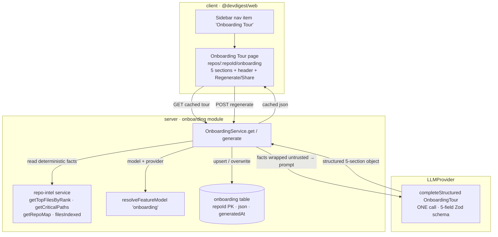
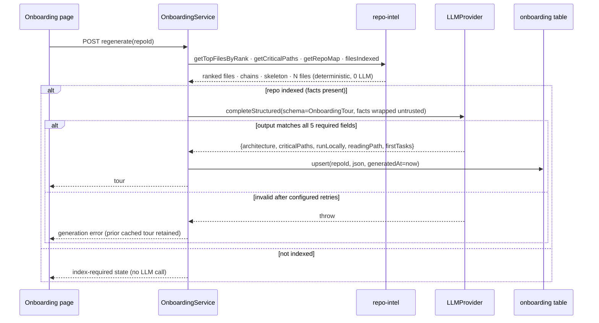

# Spec: Onboarding Generator  |  Spec ID: SPEC-2026-07-10-onboarding-generator  |  Status: approved

## Problem & why

A newcomer dropped into an unfamiliar repository that DevDigest has already indexed has no fast,
trustworthy on-ramp. The repo-intel index already computes exactly the structural facts an
onboarding tour needs — a PageRank-over-import-graph file ranking (`file_rank`,
`server/src/modules/repo-intel/pipeline/rank.ts:25`), dependency chains from the top-ranked roots
literally documented as the "onboarding reading-path" (`getCriticalPaths`,
`server/src/modules/repo-intel/service.ts:688-693`), an Aider-style repo skeleton
(`renderRepoMap`, `server/src/modules/repo-intel/pipeline/repo-map.ts:28`), and an indexed-file
count (`repo_index_state.filesIndexed`, `server/src/db/schema/repo-intel.ts:44`) — but none of it
is surfaced as a human-readable orientation page.

The requester wants a one-time-generated **Onboarding Tour**: a new repo-scoped page in the
`client/` app (sidebar nav "Onboarding Tour", per `design/onboarding-tour-overview.png`) with five
sections — Architecture overview, Critical paths, How to run locally, Guided reading path, First
tasks. It must read from the existing index rather than re-deriving repo understanding from
scratch, must produce output that is genuinely useful for a *foreign* repo (not generic
boilerplate), and must cost **exactly one LLM call per generation** — an architectural constraint,
not an implementer detail. A pre-existing but unused `onboarding` table already models exactly this
artifact (PK `repoId`, opaque `json`, `generatedAt`; `server/src/db/schema/context.ts:120-126`),
so persistence/caching has a home without a new migration decision.

## Goals / Non-goals

**Goals**

- Add a repo-scoped "Onboarding Tour" page to `client/` with the five sections shown in
  `design/onboarding-tour-overview.png` and `design/onboarding-tour-run-locally-reading-path.png`.
- Generate the tour with **exactly one** structured LLM call per generation (`completeStructured`,
  `server/src/vendor/shared/adapters.ts:82-88`), returning all five sections in one structured
  object — never one call per section.
- Derive the Critical-paths and Guided-reading-path file **ordering deterministically** from the
  existing import-graph PageRank (`file_rank.rank`), never alphabetically or by date — the LLM
  annotates the deterministically-ranked lists, it does not choose their order.
- Reuse the existing repo-intel primitives (`getTopFilesByRank`, `getCriticalPaths`, `getRepoMap`,
  `filesIndexed`) as the deterministic input to generation, rather than reinventing ranking.
- Persist each generated tour as one row in the existing `onboarding` table, keyed by repo, so page
  loads serve the cached artifact and never trigger an LLM call on mere navigation.
- Provide a Regenerate action that overwrites the cached tour, and display the indexed-file count
  and a relative "last refreshed" time in the page header
  (`design/onboarding-tour-overview.png`).
- Treat every repo-authored fact fed into the generation prompt (README, `package.json`, file
  paths, repo skeleton) as untrusted data under `INJECTION_GUARD`.
- Register a new `onboarding` feature-model id so the generation model is workspace-overridable via
  `resolveFeatureModel` (`server/src/modules/settings/feature-models.ts:51-57`).

**Non-goals**

- Re-indexing or changing the repo-intel crawl/rank/skeleton pipeline — this feature is a pure
  *consumer* of the existing index.
- Any second LLM call, per-section call, or agentic sub-step that issues additional LLM round-trips
  (see AC-6).
- Real-time or auto-refresh of the tour when the repo changes — refresh is user-triggered only
  (Regenerate); auto-invalidation on new commits is out of scope (see `[NEEDS CLARIFICATION]`).
- Persisting the tour anywhere other than the existing `onboarding` table (no new table, no
  filesystem artifact).
- Public/anonymous sharing infrastructure for the "Share link" action — v1 is copy-internal-URL
  only (see AC-26), auth-gated, no anonymous access.
- Churn/recency ("hotness") weighting of the ranking — `file_rank.hotness` is hard-wired to `0` in
  the current index (`server/src/modules/repo-intel/pipeline/rank.ts:6-7`) and this feature does
  not add it.

## Assumptions

- **The generation is one `completeStructured` call over deterministic pre-computed facts.** The
  `LLMProvider` port exposes `completeStructured<T>({ schema: z.ZodType<T>, schemaName, messages,
  maxRetries, … })` returning a schema-validated object (`server/src/vendor/shared/adapters.ts:55-88`;
  enforced on the wire via JSON-schema `response_format` + `parseWithRepair` retry loop,
  `reviewer-core/src/llm/openrouter.ts:59-116`). The server pre-computes all deterministic
  structural facts (ranked file lists, dependency chains, repo skeleton, indexed-file count) with
  **zero** LLM calls, then makes exactly one `completeStructured` call whose Zod schema has one
  required field per section — so a single call returns the whole five-section object. This is the
  same single-prompt-returns-structured-object pattern the review engine already uses
  (`reviewer-core/src/review/run.ts:180-187`).
- **Ranking is server-side and deterministic; the LLM only annotates.** Critical-paths file
  selection is `getTopFilesByRank(repoId, N)` (top-N by `file_rank.rank` DESC, junk paths excluded;
  `server/src/modules/repo-intel/service.ts:669-686`); Guided-reading-path ordering comes from
  `getCriticalPaths(repoId)` (dependency chains from the top `CRITICAL_PATH_ROOTS=5` roots following
  the highest-ranked import target up to `BFS_DEPTH=2` hops; `service.ts:688-732`). The LLM receives
  these already-ordered lists and authors the one-line annotations ("why it matters" / reading
  reason) — it never reorders or invents file entries. This keeps "ranked, not alphabetical"
  directly testable against `file_rank`.
- **`file_rank.rank` is PageRank over the dependency-cruiser import graph** (`computeFileRank`,
  `server/src/modules/repo-intel/pipeline/rank.ts:25-69`; graph built from `file_edges`,
  `server/src/adapters/depgraph/index.ts:56`). This is the concrete meaning of "importance /
  centrality" for both ranked sections.
- **The indexed-file count in the header is `repo_index_state.filesIndexed`**
  (`server/src/db/schema/repo-intel.ts:44`, written at `pipeline/full.ts:291-299`, read via
  `tryGetIndexState`, `repository.ts:206`). This is the "index of {N} files" shown in
  `design/onboarding-tour-overview.png`.
- **Persistence/caching reuses the existing unused `onboarding` table** (`repoId` PK, `json` jsonb,
  `generatedAt` timestamptz; `server/src/db/schema/context.ts:120-126`). It is declared and exported
  in the schema barrel but no module reads or writes it today, so this feature adopts it without a
  schema change — subject to confirming it is present in a shipped migration (server INSIGHTS
  2026-07-09 documents DB-vs-git drift for never-committed tables; verify before assuming no
  migration is needed).
- **The tour lives in a new server feature module** `server/src/modules/onboarding/`
  (route + service + repository), calling `LLMProvider` directly — matching the intent/risks/
  conventions pattern (`server/src/modules/risks/service.ts:34-36`,
  `server/src/modules/intent/service.ts:86`), not `reviewer-core/` (which is reserved for the
  review pipeline; smart-diff precedent, server INSIGHTS 2026-06-29).
- **The page is repo-scoped at `client/src/app/repos/[repoId]/onboarding/`** and its nav item goes
  in the WORKSPACE group of `client/src/vendor/ui/nav.ts:21-26`. The bare top-level `/onboarding`
  slug is already taken by the unrelated "Add repository" screen
  (`client/src/app/onboarding/page.tsx`), so the tour must be repo-scoped — which also matches the
  `onboarding` table's per-repo PK.
- **The client already has both render primitives needed:** the `Markdown` primitive
  (`client/src/vendor/ui/primitives/Markdown.tsx:6`, react-markdown + remark-gfm, escaping by
  default) for prose, and `MermaidDiagram` (`client/src/components/mermaid-diagram/MermaidDiagram.tsx:20`,
  `securityLevel: "strict"`, `mermaid.parse` validation, returns `null` on invalid input) for the
  architecture diagram. This feature would be `MermaidDiagram`'s first production consumer.
- **Feature-model registration edits `platform.ts`, not `feature-models.ts`.** Adding the
  `onboarding` id means extending the `FeatureModelId` enum + `FEATURE_MODELS` array in
  `server/src/vendor/shared/contracts/platform.ts:14-87` **and** the client vendor copy;
  `feature-models.ts` derives everything generically (server INSIGHTS 2026-07-02).
- **The architecture diagram is an LLM-authored Mermaid string, not a deterministic render of
  `file_edges`.** The design's diagram uses generic conceptual nodes (`client`, `server.ts`,
  `middleware`, `redis`, `postgres`; `design/onboarding-tour-overview.png`) that do not map 1:1 to
  indexed file paths, so it must be model-authored prose-level architecture, validated by
  `MermaidDiagram` before render. **Confirmed** — a deterministic `file_edges`-derived diagram was
  considered and rejected: it would surface a raw, hundred-node import graph rather than the
  conceptual summary a newcomer needs.

## Dependencies

- **repo-intel index (hard prerequisite).** Generation requires a completed index for the repo:
  `getTopFilesByRank` / `getCriticalPaths` return `[]` when `repoIntelEnabled` is false or the graph
  is empty (`server/src/modules/repo-intel/service.ts:674,694-696`), and `getRepoMap` returns only
  on a cache hit (`service.ts:428`). An unindexed repo degrades to an "index required" state, not a
  crash (mirrors the `REPO_INTEL_ENABLED` degrade gotcha, `server/CLAUDE.md`).
- **`LLMProvider.completeStructured` + `resolveFeatureModel`** — `server/src/vendor/shared/adapters.ts:82-88`,
  `server/src/modules/settings/feature-models.ts:51-57`. Already shipped.
- **`onboarding` table** — `server/src/db/schema/context.ts:120-126` (exists; confirm migration
  presence).
- **Client render primitives** — `Markdown` (`client/src/vendor/ui/primitives/Markdown.tsx`) and
  `MermaidDiagram` (`client/src/components/mermaid-diagram/MermaidDiagram.tsx`). Already shipped.
- **`githubBlobUrl`** (`client/src/lib/github-urls.ts:24`) — reused for the Critical-paths "Open"
  action target, called with `defaultBranch` instead of its usual PR-scoped `headSha` (AC-27).
  Already shipped.
- **Client data/nav plumbing** — TanStack Query hooks pattern (`client/src/lib/hooks/*` + barrel
  `client/src/lib/hooks/index.ts`), api-client (`client/src/lib/api.ts`), nav registry
  (`client/src/vendor/ui/nav.ts`). Already shipped.
- No other spec is a prerequisite. This spec is independent of the Project Context feature
  (`specs/SPEC-2026-07-08-project-context.md`) — it does not read or attach project-context
  documents — though both share the repo-intel index as a common substrate.

## User stories

- As a newcomer to a foreign but indexed repo, I want a one-page orientation with an architecture
  summary, so I understand the shape of the system before reading any code.
- As a newcomer, I want a ranked list of the most important files with a one-line reason each and an
  Open action, so I know which files actually matter rather than guessing
  (`design/onboarding-tour-overview.png`).
- As a newcomer, I want a copy-pastable ordered sequence of shell commands to run the project
  locally, so I can get it running without reverse-engineering the setup
  (`design/onboarding-tour-run-locally-reading-path.png`).
- As a newcomer, I want a guided reading path — files to read first, in a sensible order with a
  reason each — so I read the codebase in dependency order rather than alphabetically
  (`design/onboarding-tour-run-locally-reading-path.png`).
- As a newcomer, I want a short list of starter tasks, so I have a concrete first thing to attempt.
- As a repo owner, I want to Regenerate the tour after the codebase changes, so it reflects the
  current state (`design/onboarding-tour-overview.png`).
- As an operator, I want the tour generation to cost exactly one LLM call, so cost and latency are
  predictable and auditable.

## Architecture & contracts

New server feature module `server/src/modules/onboarding/` that composes deterministic repo-intel
facts, makes one structured LLM call, and caches the result in the `onboarding` table. New
repo-scoped client page renders the cached artifact.

**New / changed interface shapes (field-level, no code):**

- *`OnboardingTour` cached payload* (the `onboarding.json` shape, new): an object with exactly five
  required section fields plus meta —
  - `architecture`: `{ summary` (markdown prose, LLM), `diagram` (Mermaid string, LLM) `}`.
  - `criticalPaths`: ordered array of `{ path` (repo-relative), `rankPercentile` (deterministic,
    from `file_rank.percentile`), `fanIn` (deterministic count of reverse import edges, optional),
    `why` (one-line annotation, LLM) `}` — order is `file_rank.rank` DESC, load-bearing.
  - `runLocally`: ordered array of `{ command` (string), `comment` (optional inline note) `}`.
  - `readingPath`: ordered array of `{ path, reason` (one-line, LLM) `}` — order from
    `getCriticalPaths`, load-bearing.
  - `firstTasks`: ordered array of `{ title` (string, LLM), `rationale` (one-line, LLM), `relatedFiles?`
    (optional array of repo-relative paths drawn from the provided ranked/critical-paths lists, LLM)
    `}` — authored by the LLM within the same single structured call, from the repo skeleton and
    critical-paths facts already provided; no external issue-tracker or TODO/FIXME-comment
    integration in v1.
  - `meta`: `{ filesIndexed` (from `repo_index_state.filesIndexed`), `generatedAt`, `indexedAtSha`
    (from `repo_index_state.lastIndexedSha`, `server/src/db/schema/repo-intel.ts:39`) `}`.
- *Get onboarding tour* (new read endpoint, repo-scoped): returns the cached `OnboardingTour` plus
  `generatedAt`, or a `not-generated` marker if no row exists (drives the empty/generate state), or
  an `index-required` marker if the repo is unindexed.
- *Generate / regenerate onboarding tour* (new write endpoint, repo-scoped): triggers exactly one
  generation, overwrites the `onboarding` row on success, returns the new tour; on LLM failure
  returns an error and leaves any prior row intact.
- *Onboarding feature-model id* (new): add `onboarding` to `FeatureModelId` +`FEATURE_MODELS`
  (both vendor copies of `platform.ts`), so `resolveFeatureModel(container, workspaceId,
  'onboarding')` yields the workspace override else registry default.
- *Sidebar nav item* (new, client-only): `{ key: 'onboarding', label: 'Onboarding Tour', icon,
  href: '/repos/:repoId/onboarding', gKey }` in the WORKSPACE group of
  `client/src/vendor/ui/nav.ts`, with a matching `SHORTCUTS` entry — an unused `gKey` must be
  chosen (`p`, `x`, `s`, `a`, `c`, `,` are taken).

## Design references

| File | Shows | Grounds |
| --- | --- | --- |
| `design/onboarding-tour-overview.png` | Full page: sidebar "Onboarding Tour" nav item; header "Onboarding for {repo}" + "Generated from index of {N} files · last refreshed {t} ago" + Regenerate / Share link; Architecture overview (prose + node diagram client→server.ts→middleware→redis/postgres); Critical paths (file list + "why" annotations + Open buttons); "ON THIS PAGE" side nav listing all 5 sections incl. First tasks | Goals; User stories; AC-9, AC-12, AC-13, AC-14, AC-15, AC-16, AC-17, AC-22 |
| `design/onboarding-tour-run-locally-reading-path.png` | How to run locally (numbered shell commands, each with a copy button) and Guided reading path (numbered file list, one-line reason each) | AC-18, AC-19, AC-20 |

## Acceptance criteria (EARS)

- AC-1: WHEN a user triggers onboarding generation for an indexed repo, the server SHALL make
  exactly one `completeStructured` LLM call and produce a single object containing all five section
  fields (`architecture`, `criticalPaths`, `runLocally`, `readingPath`, `firstTasks`).
- AC-2: The Onboarding Generator SHALL introduce exactly one LLM call per generation — no
  per-section calls and no additional LLM round-trips for pre-computation.
- AC-3: The server SHALL compute the Critical-paths file selection deterministically as the top-N
  files by `file_rank.rank` descending (via `getTopFilesByRank`), excluding junk paths, before any
  LLM call.
- AC-4: The server SHALL compute the Guided-reading-path file ordering deterministically from
  `getCriticalPaths` (import-graph dependency order), never alphabetically or by date.
- AC-5: WHEN generation runs, the server SHALL pass the deterministically-ordered file lists to the
  LLM for annotation only, and the LLM SHALL NOT reorder them or introduce file entries not present
  in the provided lists.
- AC-6: WHEN generation runs, the server SHALL supply every repo-authored fact (repo skeleton,
  `package.json`/README excerpts, file paths) to the prompt as an untrusted block governed by
  `INJECTION_GUARD`, never as instructions to the model.
- AC-7: IF the single structured LLM call does not return an output satisfying all five required
  section fields after its configured retries, THEN the server SHALL fail the generation with an
  error and SHALL NOT persist a partial tour.
- AC-8: WHEN a generation fails, the server SHALL leave any previously-cached tour row for that repo
  unchanged.
- AC-9: WHEN a generation succeeds, the server SHALL upsert the result into the `onboarding` table
  (PK `repoId`), overwriting any prior row and setting `generatedAt` to the current time.
- AC-10: The server SHALL resolve the generation model via `resolveFeatureModel(container,
  workspaceId, 'onboarding')` — workspace override if present, else the registry default.
- AC-11: IF the repo has no completed index (empty `file_rank`/`file_edges`, or `repoIntelEnabled`
  false), THEN the server SHALL return an "index-required" state and SHALL NOT make an LLM call.
- AC-12: WHEN a user opens the Onboarding Tour page for a repo that has a cached tour, the client
  SHALL render all five sections from the cached artifact without triggering a new LLM call.
- AC-13: The client SHALL display, in the page header, the indexed-file count
  (`repo_index_state.filesIndexed`) and the tour's `generatedAt` rendered as a relative
  "last refreshed" time, per `design/onboarding-tour-overview.png`.
- AC-14: WHEN a user activates Regenerate, the client SHALL trigger a new generation that overwrites
  the cached tour and updates the displayed "last refreshed" time.
- AC-15: The client SHALL render the Architecture-overview prose via the escaping `Markdown`
  primitive and the architecture diagram via the `MermaidDiagram` component
  (`securityLevel: "strict"`).
- AC-16: IF the generated architecture-diagram string is not valid Mermaid, THEN the client SHALL
  omit the diagram (render nothing) rather than throw or show an error, per `MermaidDiagram`'s
  null-on-invalid behavior.
- AC-17: The client SHALL render the Critical-paths list in the server-provided ranked order, each
  row showing the file path, its one-line annotation, and an Open action, per
  `design/onboarding-tour-overview.png`.
- AC-18: WHEN a user activates a "How to run locally" command's copy control, the client SHALL copy
  that command's text to the clipboard, per `design/onboarding-tour-run-locally-reading-path.png`.
- AC-19: The client SHALL render the Guided-reading-path list in the server-provided ranked order,
  numbered, each with its one-line reason, and SHALL NOT re-sort it alphabetically, per
  `design/onboarding-tour-run-locally-reading-path.png`.
- AC-20: The client SHALL render the "How to run locally" commands in the server-provided order,
  numbered, per `design/onboarding-tour-run-locally-reading-path.png`.
- AC-21: WHEN a user opens the Onboarding Tour page for an indexed repo that has no cached tour, the
  client SHALL display a generate empty-state action rather than auto-triggering an LLM generation.
- AC-22: The client SHALL render an "Onboarding Tour" navigation item in the WORKSPACE sidebar
  group, per `design/onboarding-tour-overview.png`.
- AC-23: The client SHALL render all LLM-generated markdown through the escaping `Markdown`
  primitive (no `dangerouslySetInnerHTML`), so injected HTML/script in generated content cannot
  execute.
- AC-24: The server SHALL label the "How to run locally" section as AI-generated in the persisted
  payload, so the client can display that its commands are model-generated suggestions from
  untrusted repo content and not verified-safe.
- AC-25: The `firstTasks` section SHALL be an array of `{ title, rationale, relatedFiles? }` objects
  authored by the LLM within the same single structured call, from the repo skeleton and
  critical-paths facts already provided — with no external issue-tracker or TODO/FIXME-comment
  integration in v1.
- AC-26: WHEN a user activates "Share link", the client SHALL copy the internal repo-scoped
  Onboarding Tour URL to the clipboard; the server SHALL NOT expose any public or anonymous-access
  variant of this URL in v1.
- AC-27: WHEN a user activates a Critical-paths row's "Open" action, the client SHALL navigate to
  `githubBlobUrl(repoFullName, defaultBranch, path)` (`client/src/lib/github-urls.ts:24`) — no
  in-app repo file viewer exists outside the PR-detail route (confirmed: only
  `repos/[repoId]/pulls/[number]` renders file content), and no PR `head_sha` is available outside
  that context, so the repo's `default_branch` is used as the ref instead.
- AC-28: The server SHALL persist `repo_index_state.lastIndexedSha` as `meta.indexedAtSha` in every
  generated tour. WHEN the repo's current `lastIndexedSha` differs from the cached tour's
  `meta.indexedAtSha`, the client SHALL display a non-blocking "may be stale" hint without
  auto-triggering regeneration.
- AC-29: IF a deterministic section's underlying data is empty (e.g. `getCriticalPaths` returns
  `[]` because the repo has no import edges) but the section's key is present in the LLM's
  structured output, THEN the server SHALL treat the generation as successful and the client SHALL
  render that section's empty-state — this does NOT trigger the AC-7 failure path, which is
  reserved for a section field missing from the output entirely.
- AC-30: WHEN a Regenerate request is in flight for a repo, the client SHALL disable the Regenerate
  action until that request settles (success or failure), so a user cannot issue a second
  concurrent Regenerate click for the same repo from the same session.
- AC-31: WHEN a generation attempt completes (success or failure), the server SHALL log one
  structured line recording `model`, `tokensIn`, `tokensOut`, and `costUsd` from that single
  `completeStructured` call, so the "exactly one LLM call per generation" constraint is observable
  in logs; a test SHALL assert `completeStructured` is invoked exactly once per generation via a
  mock provider call-count spy.

## Success criteria (measurable)

- LLM call count per generation = exactly 1 (0 additional calls beyond the single
  `completeStructured` call).
- All five section keys are present in 100% of persisted `onboarding.json` payloads (0 partial
  persists; a failed generation persists nothing).
- Ranking fidelity: the Critical-paths file order equals `file_rank.rank` DESC order for the
  selected files (0 alphabetical orderings), and re-generating at the same index commit yields an
  identical Critical-paths and Guided-reading-path *file list and order* (LLM prose may differ) —
  making "ranked, not alphabetical" reproducibly testable.
- Usefulness proxy (for the "genuinely useful, not generic boilerplate" requirement): ≥ 80% of the
  Critical-paths files fall in the top decile of the repo's `file_rank.percentile` distribution —
  i.e. the list is the actually-central files, not arbitrary ones. The subjective "reads as useful"
  prose-quality judgment beyond this proxy is accepted via a manual pass on ≥ 1 real foreign repo as
  a release gate, not an automated criterion.
- Generation latency is dominated by exactly one model call; deterministic pre-computation adds no
  LLM latency (0 model calls in the pre-computation path).

## Edge cases

- **Unindexed repo** — no `file_rank`/`file_edges`; return an "index-required" state, no LLM call
  (AC-11). Mirrors `REPO_INTEL_ENABLED` degrade behavior.
- **Repo not yet cloned** (`repos.clonePath` null) — no clone to derive facts from; treated as the
  unindexed / index-required case, not a crash.
- **Empty import graph but files indexed** — `getCriticalPaths` returns `[]` when there are no edges
  (`service.ts:696`); the Guided-reading-path section is then present-but-empty with an empty-state,
  not a generation failure (AC-29).
- **LLM returns malformed / schema-mismatched output** — `completeStructured` retries then throws
  (server INSIGHTS 2026-06-22); generation fails with an error, no partial persist, prior tour
  retained (AC-7, AC-8).
- **Invalid Mermaid in generated diagram** — client omits the diagram, renders nothing (AC-16).
- **Prompt-injected repo content** — a malicious README/file could attempt to steer the model
  (e.g. produce a destructive "run locally" command, or injection text); facts are wrapped untrusted
  under `INJECTION_GUARD` (AC-6), generated markdown is rendered escaped (AC-23), and the
  run-locally section is labeled AI-generated (AC-24). The residual risk that a user copy-pastes a
  model-suggested command is called out in `## Non-functional`.
- **Stale tour after repo changes** — the tour never auto-invalidates; the header shows
  `generatedAt` as "last refreshed" and the user must Regenerate. `meta.indexedAtSha` is compared
  against the repo's current `lastIndexedSha` to show a non-blocking "may be stale" hint (AC-28).
- **Concurrent regenerate** — prevented at the client: the Regenerate action is disabled for the
  duration of an in-flight request (AC-30), so a single user session cannot issue a second
  concurrent Regenerate click. Cross-session/cross-tab races on the single `onboarding` row are not
  separately locked server-side; last write wins on upsert in that residual case.
- **Model-generated file path not in the repo** — the LLM must annotate only the server-provided
  paths (AC-5); any entry whose path is not in the provided ranked list is dropped server-side
  rather than rendered, so the Open action never points at a non-existent file.

## Non-functional

- **Security** — Repo-authored content fed into the prompt is untrusted (a PR can rewrite a README
  to embed injection); it MUST be wrapped under `INJECTION_GUARD`/`wrapUntrusted`
  (`reviewer-core/src/prompt.ts`), never treated as instructions (AC-6). The **generated output is
  itself untrusted-influenced**: the "How to run locally" commands are model-authored from
  attacker-reachable repo text and are presented for copy-paste execution — they MUST be labeled
  AI-generated (AC-24) and rendered as inert text (no auto-execution, no shell integration).
  Generated markdown MUST render through the escaping `Markdown` primitive (AC-23); the diagram
  through `MermaidDiagram` with `securityLevel: "strict"`. The generation model id is
  server-controlled config, never client input.
- **Performance** — Deterministic pre-computation reuses cached repo-intel reads (`getRepoMap` is a
  `repo_map_cache` hit; rank/edges are indexed reads) and adds no LLM latency. Exactly one model
  call per generation (AC-2). Page loads serve the cached `onboarding` row — no generation on
  navigation (AC-12).
- **Cost** — One `completeStructured` call per generation, on a workspace-overridable model
  (AC-10). No background/auto regeneration.
- **Contract sync** — the new `onboarding` `FeatureModelId` + `FEATURE_MODELS` entry MUST be applied
  to BOTH vendor copies of `platform.ts` (`server/src/vendor/shared/`, `client/src/vendor/shared/`);
  vendor-sync drift is a documented recurring failure (server INSIGHTS 2026-07-09).
- **Observability** — unlike review runs, generation is not a `RunTrace`-producing agent run, and no
  existing feature module logs LLM call usage (confirmed: `RisksService` discards
  `CompletionResult.tokensIn/tokensOut/costUsd/model` entirely — no precedent to follow). This
  feature MUST originate its own observability: `OnboardingService` logs one structured line per
  generation attempt (`model`, `tokensIn`, `tokensOut`, `costUsd`, from the existing
  `CompletionResult` fields, `server/src/vendor/shared/adapters.ts:43-49`) (AC-31).

## Inputs (provenance)

- Structured single LLM call [reused: `LLMProvider.completeStructured`
  `server/src/vendor/shared/adapters.ts:82-88`; wire enforcement
  `reviewer-core/src/llm/openrouter.ts:59-116`; review-pipeline precedent
  `reviewer-core/src/review/run.ts:180-187`].
- Critical-paths ranked file selection [reused: `getTopFilesByRank`
  `server/src/modules/repo-intel/service.ts:669-686`, over `getRankedPaths`/`file_rank.rank`
  `repository.ts:491`].
- Guided-reading-path ordering [reused: `getCriticalPaths` (documented "onboarding reading-path")
  `server/src/modules/repo-intel/service.ts:688-732`].
- Architecture skeleton facts [reused: `getRepoMap`/`renderRepoMap`
  `server/src/modules/repo-intel/service.ts:428`, `pipeline/repo-map.ts:28`].
- Indexed-file count [reused: `repo_index_state.filesIndexed`
  `server/src/db/schema/repo-intel.ts:44`, read via `tryGetIndexState` `repository.ts:206`].
- Fan-in ("used by N") count [deterministic: reverse import edges via `file_edges` +
  `file_edges_repo_to_idx` reverse index `server/src/db/schema/repo-intel.ts:55-68`; read via
  `getEdges` `repository.ts:474`].
- Tour persistence/cache [reused: `onboarding` table `server/src/db/schema/context.ts:120-126` —
  exists, currently unused; confirm migration presence per server INSIGHTS 2026-07-09].
- Model resolution [reused: `resolveFeatureModel`
  `server/src/modules/settings/feature-models.ts:51-57`; new `onboarding` id in
  `server/src/vendor/shared/contracts/platform.ts:14-87` + client copy].
- Untrusted wrapping [reused: `INJECTION_GUARD`/`wrapUntrusted` `reviewer-core/src/prompt.ts`].
- Prose + diagram render [reused: `Markdown` `client/src/vendor/ui/primitives/Markdown.tsx:6`;
  `MermaidDiagram` `client/src/components/mermaid-diagram/MermaidDiagram.tsx:20`].
- Client page/nav/data plumbing [reused: page pattern under `client/src/app/repos/[repoId]/…`;
  hooks `client/src/lib/hooks/*` + barrel; api-client `client/src/lib/api.ts`; nav
  `client/src/vendor/ui/nav.ts:21-26`].
- New work: `server/src/modules/onboarding/` (route + service + repository composing repo-intel
  facts → one structured call → cache), the `OnboardingTour` payload shape + Zod schema, the client
  Onboarding Tour page and its hooks, the sidebar nav item, the `onboarding` feature-model id
  [new: 1 LLM call per generation].

## Untrusted inputs

Yes. Generation reads externally-authored repo content — `README`, `package.json`, source-file
paths, and the repo skeleton (which contains symbol names/signatures from repo files) — all of which
a PR (including a malicious one) can author or rewrite. Every such fact MUST be injected into the
generation prompt as an untrusted block via `wrapUntrusted` + `INJECTION_GUARD`
(`reviewer-core/src/prompt.ts`), treated as data and never as instructions. Additionally, the
feature's *output* is untrusted-influenced and reaches the user: generated markdown is rendered
through the escaping `Markdown` primitive (AC-23), the diagram through `MermaidDiagram` with
`securityLevel: "strict"` (AC-15/AC-16), and the copy-pastable "How to run locally" commands are
labeled AI-generated and rendered inert (AC-24) so a user is warned before running a
model-suggested command derived from attacker-reachable repo text.

