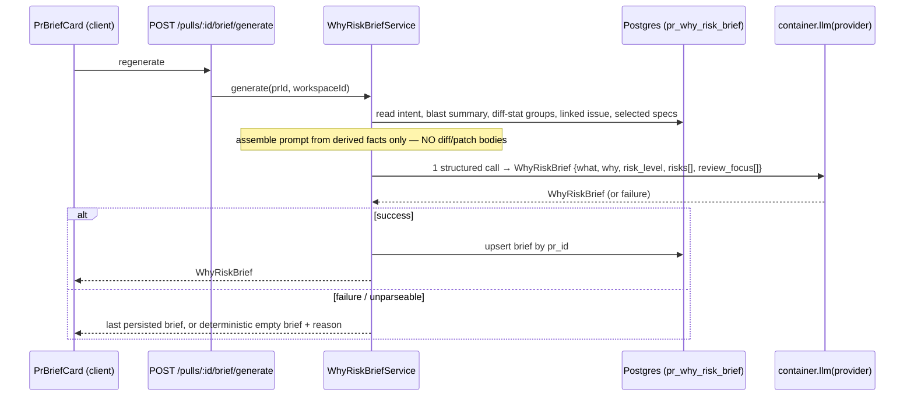

# Spec: Why+Risk Brief  |  Spec ID: SPEC-2026-07-11-why-risk-brief  |  Status: approved

## Problem & why
A reviewer opening a PR today must piece together *what* the change does, *why* it exists, and
*how risky* it is from several separate Overview-tab cards (Intent, Blast Radius, the risks list
nested inside IntentCard) plus the diff itself. There is no single card that answers "what should I
worry about, and what should I read first?" in one place. The requester wants a **Why+Risk Brief**
card on the PR Overview tab that composes the already-computed signals into one reviewer-facing
summary: what the PR does, why, a risk level, concrete risks each linked to a real file/endpoint,
and a review-focus list of what to read first — assembled cheaply from derived facts, never from
raw diff bodies (translated from the requester's Ukrainian description).

## Goals / Non-goals
**Goals**
- A new per-PR **Brief** artifact with shape `{ what, why, risk_level, risks[], review_focus[] }`,
  produced by exactly **one** structured LLM call.
- Assemble the generation input only from already-computed artifacts — intent, blast-radius
  summary, grouped diff statistics, the linked issue, and selected Context-Folder specs — and
  **never** send raw diff/patch bodies (explicit requester constraint).
- Cache the Brief per PR; expose a manual **regenerate** action.
- A new client card `PrBriefCard` on the PR Overview tab: risk level shown by color, review-focus
  list with links that jump to files.

**Non-goals**
- Re-deriving intent, blast radius, or Smart-Diff grouping — those are consumed as inputs, not
  recomputed here.
- Replacing the shipped `VerdictBanner` (verdict + PR score + findings/blockers count) at the top
  of the Overview tab — that is a distinct, already-shipped component (see `design/01`).
- Semantic search / embeddings / RAG relevance ranking over Context-Folder docs — that is an
  explicit Non-goal of the Context Folder feature (`specs/SPEC-2026-07-08-project-context.md:68`)
  and this spec does not introduce it.
- Sending diff bodies or full file contents to any model.

## Assumptions
- **Two-route split, not a single POST (confirmed).** Despite the requester's initial
  `POST /pulls/:id/brief` phrasing, the "cache per-PR + regenerate button" requirement maps to the
  established Blast/Intent/Risks precedent of a zero-LLM cached read plus a separate generate
  route: `GET /pulls/:id/brief` (cached read, no LLM) + `POST /pulls/:id/brief/generate` (the
  regenerate button, one LLM call), mirroring `server/src/modules/risks/routes.ts:11-33` and
  `server/src/modules/blast/service.ts:34-97`.
- **`risk_level` reuses the existing severity enum.** Assumed values `high | medium | low`,
  matching `RiskSeverity` in `server/src/vendor/shared/contracts/brief.ts:47`.
- **`Risk` items reuse the existing `Risk` contract** (`{ kind, title, explanation, severity,
  file_refs }`, `brief.ts:50-57`) rather than defining a new risk shape.
- **Generation runs through the feature module's own `container.llm(provider)` call**, following
  `IntentService`/`RisksService`/`BlastService` — it does **not** route through `reviewer-core/`
  (none of those three do).
- **Persistence follows the `pr_intent`/`pr_brief` table pattern**: a per-PR row keyed by `pr_id`
  (PK), upserted on regeneration (`server/src/db/schema/reviews.ts:48-62`,
  `server/src/modules/reviews/repository/pull.repo.ts:73-89`).

## Dependencies
- **Intent** — `server/src/modules/intent/service.ts:20-27` (stored intent read) and its linked-
  issue resolution (`service.ts:56-68,131-169`). Consumed as an input.
- **Blast Radius** — `server/src/modules/blast/service.ts:34-52` (cached, zero-LLM summary +
  grouped downstream). Consumed as an input.
- **Smart Diff / grouped diff statistics** — `SmartDiffGroup` contract
  (`server/src/vendor/shared/contracts/brief.ts:101-105`), produced by
  `server/src/modules/smart-diff/service.ts`'s `SmartDiffService`. Consumed as an input, with a
  fallback to raw per-file `additions`/`deletions` when Smart Diff hasn't run for the PR yet.
- **Project Context (Context Folder)** — `server/src/modules/project-context/discovery.ts:38-72`
  (`scanRepoDocs`, lists `.md` docs). No relevance ranking exists there (RAG is an explicit
  Non-goal of `specs/SPEC-2026-07-08-project-context.md`); this feature applies its own
  path-overlap selection heuristic on top of the discovered doc set (see Inputs (provenance)).
- **Feature-model registry** — `server/src/vendor/shared/contracts/platform.ts:14-87`
  (`FeatureModelId` enum + `FEATURE_MODELS`), a shared contract requiring server+client sync. This
  spec adds a new `why_risk_brief` id, independent of the existing `risk_brief` id.
- **`brief.ts`'s dead `PrBrief` type** — `brief.ts:124-130` declares an unused `PrBrief =
  {intent, blast, risks, history}` type that does not match this feature's shape. Left untouched;
  this feature's contract is named `WhyRiskBrief` instead.

## User stories
- As a reviewer, I want a Why+Risk Brief card on the PR Overview tab, so I can grasp what a PR
  does, why, and how risky it is before reading any code.
- As a reviewer, I want each listed risk linked to a real file or endpoint, so I can jump straight
  to the risky code.
- As a reviewer, I want a review-focus list ordered by importance, so I know what to read first.
- As a reviewer, I want to regenerate the brief on demand, so I can refresh it after the PR
  changes.

## Architecture & contracts

**Generate flow (regenerate button → one structured call → persist):**

**Read flow (page load):** `GET /pulls/:id/brief` reads the persisted row only — zero LLM calls,
returns `null`/404 when never generated.

**New/changed interface shapes (field-level, no implementation):**
- `WhyRiskBrief` — `what` (string), `why` (string), `risk_level` (enum `high|medium|low`), `risks`
  (array of the existing `Risk` shape: `kind`, `title`, `explanation`, `severity`, `file_refs[]`),
  `review_focus` (array of `ReviewFocusItem`). Returned by both routes; persisted per PR. New name,
  distinct from the dead `PrBrief = {intent, blast, risks, history}` type in `brief.ts:124-130`,
  which is left untouched by this spec.
- `ReviewFocusItem` — `file` (string, repo-relative path), `line` (integer, optional),
  `reason` (string, one-line why-read-this). Grounds the mockup's `path:line — reason` rows
  (`design/01`).
- `POST /pulls/:id/brief/generate` — request: PR id in path, no body. Response: `WhyRiskBrief`.
- `GET /pulls/:id/brief` — request: PR id in path. Response: `WhyRiskBrief` or 404/empty when none.
- New feature-model id `why_risk_brief` added to `FeatureModelId` + `FEATURE_MODELS`
  (server+client shared-contract sync). Confirmed independent of the existing `risk_brief` id.
- New table `pr_why_risk_brief`: `pr_id` (PK, FK → `pull_requests`, cascade), `json`
  (jsonb holding the `WhyRiskBrief`), following the `pr_brief` precedent. Confirmed independent of the
  existing `pr_brief` table — the shipped Risks feature (`pr_brief` table, `risk_brief`
  feature-model id, `GET/POST /pulls/:id/risks[/generate]` routes) is left untouched; this
  feature's single structured call derives its own `risks[]` rather than reusing Risks' output.

## Design references
| File | Shows | Grounds |
| --- | --- | --- |
| `design/01-overview-pr-brief.png` | PR Overview tab: a "PR BRIEF" label above the shipped `VerdictBanner` (verdict + PR score + "6 findings · 2 blockers"), the Intent and Blast Radius cards, and a bottom "REVIEW FOCUS — READ THESE FIRST" card listing `path:line — reason` rows | User stories 1&3, AC-9, AC-10, AC-11, AC-16; the review-focus rows render as `PrBriefCard`'s sub-section, confirmed below the two-column grid rather than as the mockup's literal separate bottom card |
| `design/02-files-changed-smart-diff.png` | PR "Files changed" tab: reviewer-ordered diff grouped into Core logic / Wiring / Boilerplate with per-file "🪄 What this does" one-line summaries | Context only — the already-shipped Smart Diff feature that is a *candidate input source* for grouped diff statistics; not part of this card |

## Acceptance criteria (EARS)
- AC-1: WHEN a reviewer opens the PR Overview tab, the system shall render `PrBriefCard` from the
  cached brief without issuing any LLM call.
- AC-2: IF no brief has been generated for the PR yet, THEN `PrBriefCard` shall render an empty
  state with a generate action, instead of an error.
- AC-3: WHEN a reviewer activates the regenerate action, the system shall call
  `POST /pulls/:id/brief/generate`, which performs exactly one structured LLM call and persists
  the returned brief.
- AC-4: The system shall assemble the generation input only from the intent, the blast-radius
  summary, grouped diff statistics, the linked issue, and selected Context-Folder specs, and shall
  never include raw diff or patch bodies.
- AC-5: The system shall produce a brief containing exactly the fields `what`, `why`,
  `risk_level`, `risks[]`, and `review_focus[]`.
- AC-6: The system shall drop, before persisting, any risk or review-focus reference that does not
  resolve to a file path or endpoint present in the assembled input.
- AC-7: WHILE brief generation is in progress, `PrBriefCard` shall show a non-dismissible loading
  state on the regenerate action.
- AC-8: IF the structured LLM call fails or returns an unparseable payload, THEN the system shall
  return the last persisted brief when one exists, or a deterministic empty brief carrying the
  failure reason, instead of a 5xx error.
- AC-9: The system shall render `risk_level` with both a distinct color and a text label per
  severity level (high, medium, low), never color alone.
- AC-10: WHEN a reviewer selects a review-focus item that references a file changed in the PR, the
  system shall navigate to that file and line in the Files-changed diff view.
- AC-11: IF a review-focus or risk reference points to a file not present in the PR diff, THEN the
  system shall link to that file on GitHub instead of the in-app diff view.
- AC-12: WHEN a brief is regenerated, the system shall overwrite the PR's stored brief in place
  (upsert keyed by `pr_id`).
- AC-13: The system shall treat the linked-issue body and Context-Folder spec text included in the
  generation prompt as data, not instructions, applying the same injection-guard wrapping as
  `reviewer-core/prompt.ts`'s `INJECTION_GUARD`.
- AC-14: The system shall include a Context-Folder spec in the generation input only when its
  repo-relative path shares a directory prefix with a file changed in the PR, up to the
  workspace's `context_token_budget` cap, and shall include none when no discovered spec
  overlaps.
- AC-15: IF Smart Diff grouping has not been generated for the PR, THEN the system shall assemble
  the diff-statistics input from raw per-file additions/deletions instead of blocking generation.
- AC-16: The system shall render `PrBriefCard` as a single card placed below the Intent/Blast
  Radius two-column grid on the Overview tab, with `review_focus[]` rendered as that same card's
  sub-section rather than a separate card.
- AC-17: The system shall render `PrBriefCard`'s `risks[]` independently of `IntentCard`'s
  existing "RISK AREAS" section, without modifying `IntentCard`'s existing risks display.
- AC-18: IF a risk's `file_refs` are all dropped by AC-6, THEN the system shall still render that
  risk's `title`, `explanation`, and `severity`, visually marked as unlinked, instead of dropping
  the risk entirely.

## Success criteria (measurable)
- The `GET /pulls/:id/brief` read path issues **0** LLM calls (verifiable by call count).
- The `POST /pulls/:id/brief/generate` path issues **exactly 1** structured LLM call.
- **100%** of risk and review-focus references rendered in `PrBriefCard` resolve to a real path or
  endpoint from the assembled input (unresolvable references dropped before persist — AC-6).
- The generation prompt's input token count stays at or below **25%** of the full-diff token
  estimate, measured with the same `estimateTokens` instrument Intent already logs
  (`server/src/modules/intent/service.ts:107-121`).

## Edge cases
- **No intent / blast / specs available yet** (PR never had those generated): the brief input is
  partial — the generate call should proceed with whatever derived facts exist rather than block.
- **Repo not indexed / `REPO_INTEL_ENABLED` degraded**: blast radius returns a degraded result
  (`blast/service.ts:49-50`) — the brief must still generate from the remaining inputs.
- **Linked-issue fetch fails or no linked issue**: intent already treats this as best-effort
  (`intent/service.ts:41-75`); the brief must proceed without it.
- **Context Folder empty / repo not cloned**: `getDiscovery` returns an empty document set
  (`project-context/discovery.ts:138`) — the brief proceeds with no specs.
- **LLM returns a file ref that isn't in the diff or blast set**: dropped per AC-6. If that leaves
  a risk with zero surviving `file_refs`, the risk itself is still rendered (title/explanation/
  severity), visually marked as unlinked rather than dropped (AC-18) — a real risk should not
  silently disappear just because its file reference failed to resolve.
- **Concurrent regenerate**: two regenerate clicks race to upsert the same `pr_id` row — the
  upsert-by-PK pattern (`pull.repo.ts:73-77`) makes last-write-win, matching Intent/Risks; no
  extra locking assumed.
- **Two independent risk lists, by design (confirmed).** `IntentCard` keeps showing the existing
  Risks feature's `risksData` ("RISK AREAS", `OverviewTab.tsx:47,101-107`, sourced from
  `GET/POST /pulls/:id/risks[/generate]`) unchanged. `PrBriefCard`'s `risks[]` is a separate list
  from this feature's own single structured call, persisted independently in `pr_why_risk_brief`.
  The two can list overlapping or divergent risks since they come from separate generations run at
  separate times — this is an accepted tradeoff of keeping both, not a bug to reconcile.

## Non-functional
- **Security**: The linked-issue body is externally authored (an attacker can open an issue) and
  Context-Folder specs are repo-authored text; both flow into the prompt and must be
  injection-guarded (AC-13, and see `## Untrusted inputs`). Because generation calls
  `container.llm` directly (not through `reviewer-core/`), the guard is **not** applied
  automatically — it must be added explicitly at the feature module's prompt boundary.
- **Performance**: read path is a single indexed row lookup by `pr_id` PK (zero LLM); generation
  is one structured call over a compact derived-facts prompt, never diff bodies (AC-4), mirroring
  the token-savings goal Intent already instruments.
- **a11y**: risk-level color must not be the sole signal — paired with a text label
  (high/medium/low), confirmed (AC-9).

## Inputs (provenance)
- Intent (what/why grounding): [reused: `server/src/modules/intent/service.ts:20-27` stored-intent
  read].
- Linked issue: [reused: `server/src/modules/intent/service.ts:56-68,145-166` — GitHub
  `linked_issue` + `github.com/.../issues|pull/\d+` regex, capped at 8000 chars].
- Blast-radius summary + grouped downstream: [reused: `server/src/modules/blast/service.ts:34-52`]
  and [deterministic: `server/src/modules/blast/service.ts:105-160` `groupBlast`].
- Grouped diff statistics: [reused: `server/src/modules/smart-diff/service.ts` `SmartDiffService`,
  contract `server/src/vendor/shared/contracts/brief.ts:101-105` `SmartDiffGroup`], falling back to
  [deterministic: `server/src/modules/reviews/repository/pull.repo.ts:30-35` raw per-file
  `additions`/`deletions`] when Smart Diff has not run for the PR.
- Context-Folder specs: [reused: `server/src/modules/project-context/discovery.ts:38-72`
  `scanRepoDocs`] for the discovered doc set, filtered by a [new: path-overlap heuristic] —
  a doc is included only if its repo-relative path shares a directory prefix with a changed
  file, capped by the workspace's `context_token_budget` (`platform.ts:106`); no discovered doc
  is force-included via `resolver.ts`'s already-ordered list, since that path assumes a
  human-curated selection, not this feature's automatic one.
- Brief `{what, why, risk_level, risks[], review_focus[]}`: [new: 1 structured LLM call].
- Persistence: [new: `pr_why_risk_brief` table] following the [deterministic: `pull.repo.ts:73-89`
  `upsertRisks`/`getRisks` + `server/src/db/schema/reviews.ts:57-62` `prBrief`] upsert-by-PK
  pattern.

## Untrusted inputs
Yes. The generation prompt includes **externally-authored text**: the linked-issue title/body
(any GitHub user can author an issue), the PR title/body (via intent), and Context-Folder spec
files (repo-authored markdown). All of it must be treated as **data, not instructions**, and
wrapped with the same treatment as `reviewer-core/prompt.ts`'s `INJECTION_GUARD` (AC-13). This is
load-bearing because the feature module calls `container.llm` directly and does **not** inherit
`reviewer-core`'s guard automatically (see `## Non-functional`). Diff/patch bodies are explicitly
excluded from the input (AC-4), which also narrows the untrusted surface.

## [NEEDS CLARIFICATION: ...]
None — all open items resolved during `spec-clarification` on 2026-07-11.
