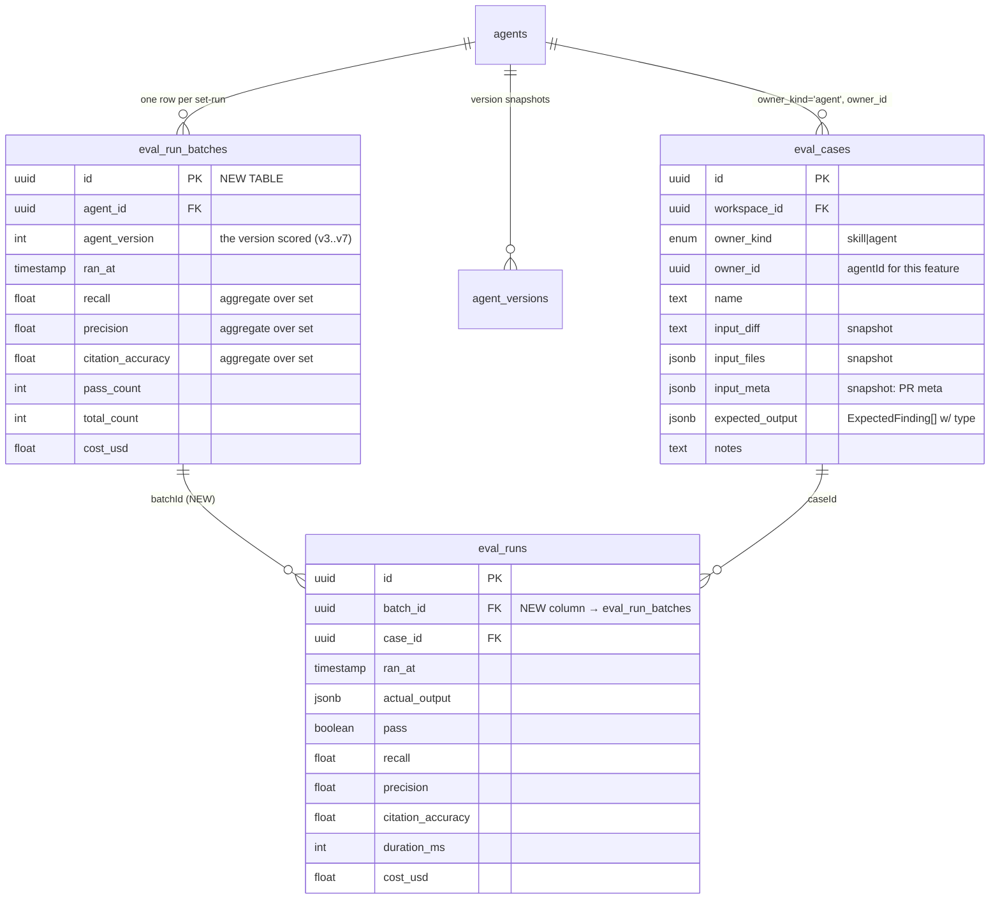
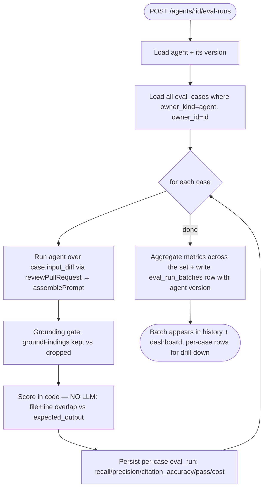
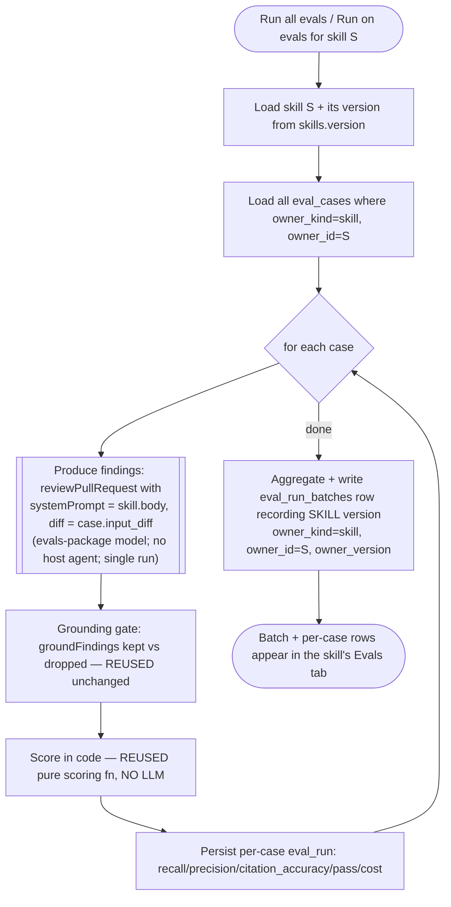

# Spec: Eval Pipeline  |  Spec ID: SPEC-2026-07-15-eval-pipeline  |  Status: approved

> **Scope-extension note (2026-07-16).** The agent-eval scope of this spec (AC-1..AC-28, all
> `## Resolved decisions`) remains **approved and immutable** — do not re-edit it. This revision
> **adds** a skills-eval extension (`owner_kind='skill'`), threaded through Goals, Non-goals,
> Assumptions, Dependencies, Architecture, the Design references table (`design/07`), Acceptance
> criteria (AC-29..AC-38), Edge cases, and Inputs. The extension was clarified on 2026-07-16
> (`spec-clarification`): the crux — what "running an eval on a skill" *means* — is resolved to the
> `evals/`-package model (skill `body` as the system prompt via `reviewPullRequest`; AC-38), with the
> `eval_run_batches` shape, run-entry-point, and disabled-skill questions all resolved and the skill
> Compare view deferred (see `## Resolved decisions — skills extension` and `## Deferred`). No open
> `[NEEDS CLARIFICATION]` items remain; the whole spec (AC-1..AC-38) is ready for
> `implementation-planner`.

## Problem & why
DevDigest's reviewer agents (Security Reviewer, Performance Reviewer, Custom Mentor) evolve by
editing their system prompt, skills, and model. Today there is no way to tell whether a prompt edit
made an agent *better* or *worse* — a change that adds recall can silently add false positives, and
nobody notices until a live PR review is wrong. The requester wants a **regression harness**: turn
real review findings into reusable eval cases, run an agent across all its cases in one click, and
measure **recall / precision / citation_accuracy** so prompt-version A can be compared against
version B ("old prompt vs new") before promoting the change. The data layer for this
(`eval_cases` / `eval_runs` tables and their Zod contracts) already exists in the repo but is
completely unwired — no route, service, or UI consumes it (translated from the requester's Ukrainian
description).

**Skills extension (2026-07-16).** Reviewer **skills** (rubrics, conventions, security rules) evolve
the same way an agent's prompt does — a skill's `body` is edited and re-versioned (`skills.version`,
`skill_versions`, `server/src/db/schema/skills.ts:18,23-34`) — and can silently make the agents that
pull it better or worse. The `eval_cases` table is *already* owner-generic
(`owner_kind` enum includes `'skill'`, `server/src/db/schema/eval.ts:13`), and a new
`design/07-skill-editor-evals-tab.png` mockup shows a **Skill Editor → Evals tab** mirroring the
agent one. This extension brings the same regression harness to skills. The crux — unlike an agent, a
**skill is not a runnable reviewer** — it has no system prompt and no `reviewPullRequest`; it only
rides along an agent's review as a `<skill>…</skill>` prompt slot (`reviewer-core/src/prompt.ts:52-55,156`)
— was resolved in clarification (2026-07-16): a skill eval runs `reviewPullRequest` with the skill's
`body` supplied **as the system prompt**, matching the existing `evals/` package model (AC-38; see
`## Resolved decisions — skills extension`).

## Goals / Non-goals
**Goals**
- One-click creation of an eval case from a real review finding: an **accepted** finding becomes a
  `must_find` expectation, a **dismissed** finding becomes a `must_not_flag` expectation. The click
  snapshots the finding's input (diff fragment + files + PR meta) onto the case.
- An **Evals** tab in `AgentEditor` listing every eval case in an agent's set, with per-case
  run/edit/delete and a "Run all evals" action (`design/03`).
- A route `POST /agents/:id/eval-runs` that runs the agent over **all** cases in its set as one run,
  using each case's **snapshotted** input so runs of different agent versions are comparable.
- **Code-only scoring** (zero LLM calls) producing three metrics per run: `recall`, `precision`,
  `citation_accuracy`.
- Run history per agent and a **Compare runs** view (metric deltas + system-prompt diff) for two
  selected runs ("v6 → v7", `design/02`, `design/06`).
- A separate **Eval Dashboard** left-sidebar page showing the latest eval runs across all reviewer
  agents, with a per-agent drill-down (`design/04`, `design/06`).

**Goals — skills extension (draft)**
- An **Evals** tab in the **Skill Editor**, listing every eval case in a skill's set
  (`owner_kind='skill'`, `owner_id=<skillId>`), with per-case run/edit/delete, "Run all evals", and a
  header **"Run on evals"** entry point (`design/07`). Added alongside the skill editor's existing
  Config/Preview/Context/Stats/Versions tabs (`client/src/app/skills/[id]/_components/SkillEditor/constants.ts:9-15`).
- Running a skill over **all** cases in its set as one run, recording `recall`/`precision`/`citation_accuracy`
  with the **same code-only scoring and grounding gate as agents, unchanged** (the scoring function is
  owner-agnostic — it takes `(expected_output, findings, input_diff)` only).
- Recording the **skill version** scored on each set-run (from `skills.version`/`skill_versions`), so
  two runs of different skill versions are comparable — the skill analogue of the agent-version label.

**Non-goals**
- Changing the **behaviour** of the live PR review pipeline, the grounding gate logic
  (`reviewer-core/src/grounding.ts`), or the `Finding`/`Review` contracts — the eval pipeline
  **consumes** them, never modifies them. (Exception, per AC-10: reviewer-core may gain a
  *non-mutating* accessor that also returns raw pre-grounding findings, without altering what the
  live review path itself returns — see `## Dependencies`.)
- Adding the **Stats** and **CI** AgentEditor tabs shown in `design/03`'s tab row — they do not
  exist in code today (`constants.ts` has only Config/Skills/Context) and are out of scope here
  (resolved: Evals tab only).
- Building the "GLOBAL" sidebar group (Memory / Multi-Agent Review / Agent Performance / CI Runs)
  shown in `design/02`/`design/04` — those nav items do not exist in code (`nav.ts` has only
  WORKSPACE and SKILLS LAB); only the single **Eval Dashboard** item is in scope.
- Any LLM-judged or semantic scoring — matching is purely file + line-range overlap.
- Auto-scheduling eval runs or CI gating on eval results. *(The former "eval cases for skills"
  exclusion is **removed by the 2026-07-16 extension** — skills are now in scope for the Evals tab;
  see the skill-scoping non-goals below for what within skills-eval stays out.)*

**Non-goals — skills extension (draft)**
- A **skill Compare-runs / content-diff view**. The agent Compare view diffs the agent *system prompt*
  (`client/src/app/eval/[agentId]/_components/CompareRunsModal/CompareRunsModal.tsx:45-49`); a skill
  has no system prompt, only a `body` (versioned in `skill_versions`), and **no skill-content diff
  capability exists anywhere in the app today** — it would be net-new. `design/07` shows only the
  Evals tab (no Compare affordance), so a skill Compare view is out of scope for this extension
  (recorded as an explicit divergence; see `## Deferred` for the follow-up shape if later wanted).
- **Listing skills on the cross-agent Eval Dashboard** (`design/04`/`design/06`). `design/07` scopes
  skills-eval to the Skill Editor's Evals tab only; the dashboard's cross-owner overview shape
  (`EvalDashboardOverview`) stays agent-only for now.
- **"Turn into eval case" (create-from-finding) for skills.** That one-click path derives its owner
  agent from the source finding's own review (`EvalCaseFromFindingInput`, no owner field,
  `server/src/vendor/shared/contracts/eval-ci.ts:80-88`); a finding traces to an *agent* review, not
  a skill run, so there is no skill equivalent. Skill eval cases are authored via "+ New eval case"
  only (AC-30).

## Assumptions
- **The feature spans server + reviewer-core + client**, so it lives in the repo-root `specs/`
  folder (this file). Server owns the route/service/persistence; reviewer-core owns the pure
  scoring function; client owns the Evals tab + Eval Dashboard page; `@devdigest/shared` owns the
  contracts synced across all three.
- **An "agent's set" = every `eval_cases` row where `owner_kind='agent'` and `owner_id=<agentId>`.**
  A case belongs to exactly one owner (single `owner_id` column, `server/src/db/schema/eval.ts:12-13`),
  so a case cannot belong to more than one agent.
- **Input is snapshotted at case-creation time and stored on the case**, never re-fetched at run
  time — the `eval_cases` table already carries `input_diff` (text), `input_files` (jsonb), and
  `input_meta` (jsonb) columns for exactly this (`server/src/db/schema/eval.ts:15-17`), matching the
  editor's Diff / Files / PR meta tabs (`design/05`).
- **The agent version compared as "v6 → v7" is the existing monotonic `agents.version` integer**
  (`server/src/db/schema/agents.ts:33`), snapshotted per config change into `agent_versions`
  (`agents.ts:38`), whose comment states it is "Used for reproducibility (eval replays a past
  version)" (`server/src/vendor/shared/contracts/knowledge.ts:229-233`). The UI renders it as
  `v${version}`.
- **`citation_accuracy` reuses `reviewer-core`'s existing grounding gate** (`groundFindings`,
  `reviewer-core/src/grounding.ts:52`) rather than defining a new grounding rule.
- **Running an agent over a case reuses the existing review path** (`reviewPullRequest` →
  `assemblePrompt`), so the snapshotted diff is automatically wrapped by `INJECTION_GUARD`
  (`reviewer-core/src/prompt.ts:16`, `assemblePrompt` wraps the diff via `wrapUntrusted`,
  `prompt.ts:167`). The eval feeds a *synthetic* PR (the snapshot) instead of a live one.
- **The "Turn into eval case" expectation type is derived from the finding's persisted decision**:
  the accept/dismiss routes already exist (`POST /findings/:id/accept|dismiss`,
  `server/src/modules/reviews/routes.ts:144`), so decision state is available at click time.

**Assumptions — skills extension (draft)**
- **A "skill's set" = every `eval_cases` row where `owner_kind='skill'` and `owner_id=<skillId>`** —
  the table is already owner-generic (`owner_id` is a bare uuid with **no FK**, so it references a
  skill just as validly as an agent, `server/src/db/schema/eval.ts:13-14`). No schema change is
  needed for the *case* layer; the case machinery generalizes to skills for free.
- **The scoring + grounding functions are owner-agnostic and are reused unchanged.** They operate on
  `(expected_output, findings, input_diff)` and `(findings, diff)` respectively — no agent or skill
  concept (`reviewer-core/src/grounding.ts:52`, plus the pure scoring function this spec adds). A
  skill run reuses them verbatim; only the *production of findings* differs (the crux — see clarifications).
- **A skill has a monotonic version to record on a batch**, analogous to `agents.version`:
  `skills.version` (integer, `server/src/db/schema/skills.ts:18`) snapshotted per body edit into
  `skill_versions` (`skills.ts:23-34`), with the `SkillVersion` contract already present
  (`server/src/vendor/shared/contracts/knowledge.ts:168-173`) and a `GET /skills/:id/versions` route.
  The UI renders it `v${version}` (the `v5` pill, `design/07`).
- **The skill editor already has Stats and Versions tabs**, so — unlike the agent editor, where
  Stats/CI had to be documented as accepted divergences — the *only* tab this extension adds is
  **Evals**, yielding exactly the 6-tab row in `design/07` (Config · Context · Preview · Evals · Stats
  · Versions) with **no** accepted tab divergence
  (`client/src/app/skills/[id]/_components/SkillEditor/constants.ts:9-15`).
- **The skill-execution model was resolved in clarification** (a skill cannot be run standalone, so it
  runs `reviewPullRequest` with the skill `body` as the system prompt — the `evals/`-package model,
  AC-38), documented under `## Resolved decisions — skills extension`.

## Dependencies
- **Existing eval data layer** — tables `eval_cases`/`eval_runs` (`server/src/db/schema/eval.ts:7,22`)
  and contracts `EvalCase`/`EvalRun`/`EvalOwnerKind` (`server/src/vendor/shared/contracts/knowledge.ts:50,58,70,73`),
  `EvalCaseInput`/`EvalRunRecord`/`EvalRunResult`/`EvalTrendPoint`/`EvalDashboard`
  (`server/src/vendor/shared/contracts/eval-ci.ts:20,33,49,57,68`). **Present but unwired** — no
  route/service/repository reads them yet.
- **`agents` + `agent_versions` tables** (`server/src/db/schema/agents.ts:8,38`) and the `Agent`
  contract (`knowledge.ts:203-219`) — the run records which agent version it scored.
- **`Finding` contract** (`server/src/vendor/shared/contracts/findings.ts:47`) — fields `severity`,
  `category`, `title`, `file`, `start_line`, `end_line`, `confidence`, `kind`. The expected-output
  editor (`design/05`) emits an array of this shape.
- **Grounding gate** — `reviewer-core/src/grounding.ts:52` (`groundFindings`) for `citation_accuracy`.
  **Requires pre-grounding access:** `citation_accuracy` is measured over the agent's *raw* model
  output, but the live `reviewPullRequest` path grounds internally and returns only survivors. The
  eval run must obtain the raw pre-grounding findings — via a lower-level reviewer-core entry that
  returns raw output, or a new `{ raw, grounded }` return shape — without modifying the live review
  pipeline's own behaviour (a reviewer-core change to be scoped at planning time).
- **Existing agent-review path** — `POST /pulls/:id/review` and `service.runReview`
  (`server/src/modules/reviews/routes.ts:27`) as the precedent for running an agent over a diff.
- **AgentEditor tab host** — `client/src/app/agents/[id]/_components/AgentEditor/AgentEditor.tsx:13`
  + tab registry `constants.ts:10-14`.
- **Sidebar nav registry** — `client/src/vendor/ui/nav.ts:21` (`NAV`), SKILLS LAB group `nav.ts:30-37`.

**Dependencies — skills extension (draft):**
- **`skills` + `skill_versions` tables** (`server/src/db/schema/skills.ts:5-21,23-34`) and the `Skill`
  / `SkillVersion` contracts (`server/src/vendor/shared/contracts/knowledge.ts:142-157,168-173`) — the
  run records which skill version it scored; the `body` column is the skill's content.
- **`agent_skills` join table** (`server/src/db/schema/agents.ts:51-64`) — the only mechanism by which
  a skill reaches a review (there is **no** skills array on `agents`); a skill's live behaviour is as
  an *enabled link on some agent*. Relevant to the execution-model clarification (which host agent runs
  the skill).
- **Skill prompt slot** — `reviewer-core/src/prompt.ts:52-55,119-122,156` (`wrapSkill` → `## Skills /
  rules` section) and `PromptParts.skills?: string[]` (`prompt.ts:63-64`). A skill enters a review
  **only** as a pre-resolved body string wrapped in `<skill>…</skill>`; it has no system prompt.
- **Review engine input shape** — `reviewer-core/src/review/run.ts:44-98` (`ReviewInput`): requires a
  trusted `systemPrompt: string`; `skills?: string[]` is optional/additive. **There is no entry that
  runs a skill without an agent system prompt** — the core dependency behind the execution-model
  clarification.
- **Existing agent skill-loading at run time** — `server/src/modules/reviews/run-executor.ts:198-208`
  and the eval mirror `server/src/modules/eval/service.ts:208-214` (`resolveSkills`): loads an agent's
  enabled linked skills, formats each `### <name>\n<body>`, passes them as `skills` into
  `reviewPullRequest`. The precedent a skill-eval run would reuse (via a host agent).
- **Skill editor tab host** — `client/src/app/skills/[id]/_components/SkillEditor/SkillEditor.tsx:14-37`
  + tab registry `constants.ts:9-15` (Config/Preview/Context/Stats/Versions today; add Evals).
- **`EvalRunBatchRecord` contract** (`server/src/vendor/shared/contracts/eval-ci.ts:62-74`) — currently
  **agent-specific** (`agent_id`, `agent_version`). A skill batch needs this generalized or paralleled
  (schema decision — see Architecture & the clarification).
- **`evals/` CLI harness (adjacent, NOT reused)** — `evals/src/tasks.ts:21-24` `skillTask()` runs a
  skill in isolation by injecting an on-disk `SKILL.md` **as the system prompt** through the Claude
  Code SDK. Architecturally disjoint from the studio engine (no DB, no `reviewPullRequest`, no
  grounding). Named here only so the clarification can consider whether its "skill body as system
  prompt" model is (or is not) the intended execution model.

## User stories
- As a reviewer, I want to turn a real finding into an eval case in one click, so I can capture a
  regression example without re-typing the diff or the expectation.
- As an agent author, I want to see every eval case for an agent in one place, so I know what its
  regression set covers.
- As an agent author, I want to run the agent across all its cases in one click, so I get one set of
  metrics per run.
- As an agent author, I want recall, precision, and citation_accuracy for each run, so I can tell
  whether a prompt edit helped or hurt.
- As an agent author, I want to compare two runs side by side (old prompt vs new), so I can see the
  metric deltas and the prompt diff before promoting a version.
- As a team lead, I want an Eval Dashboard across all reviewer agents, so I can spot a regression in
  any agent at a glance.
- As a skill author, I want an Evals tab on the Skill Editor listing that skill's regression cases,
  so I know what the skill's rubric is expected to catch and not catch (`design/07`).
- As a skill author, I want to run the skill across all its cases in one click and get
  recall/precision/citation_accuracy, so I can tell whether editing the skill's `body` (v4 → v5)
  helped or hurt before I re-version it.

## Architecture & contracts

**Data model (existing tables — this feature wires them, not creates them):**

**RESOLVED — set-run entity added.** The design's run-history table (`design/06`) shows one row
**per set-run** with a version label (v3..v7), aggregate metrics, and `pass X/20`; the existing
`eval_runs` table is keyed **per case** with no agent-version and no run-batch id. Confirmed against
the contracts: `EvalRunRecord` (`eval-ci.ts:33`) is per-case, and `EvalDashboard` (`eval-ci.ts:68`)
computes `current`/`delta`/`trend` as **read-time aggregates** — no persisted set-run row exists.
Resolution: add a **new `eval_run_batches` table** (one row per set-run, holding `agent_id`,
`agent_version`, `ran_at`, aggregate `recall`/`precision`/`citation_accuracy`,
`pass_count`/`total_count`, `cost_usd`) and add a `batch_id` FK column to `eval_runs`. History and
Compare read from `eval_run_batches`; the per-case `eval_runs` rows remain for the case-level
drill-down. New migration via `pnpm db:generate` → `db:migrate` (never edit existing migrations, per
`server/CLAUDE.md`). Both new shapes get `@devdigest/shared` contracts, synced server + client.

**Run + scoring flow (one set-run, N LLM calls, code-only scoring):**

**Scoring (all deterministic, zero LLM — the crux):**
- A candidate agent finding is **credited to an expectation** when its `file` matches the
  expectation's `file` AND its `[start_line, end_line]` range overlaps the expectation's line range
  (same overlap primitive as `grounding.ts`'s `rangeIntersects`).
- `recall` = (# `must_find` expectations matched by ≥1 agent finding) / (# `must_find` expectations).
- `precision` = `TP / (TP + FP)` **over covered findings only**, where TP = agent findings
  overlapping a `must_find` expectation, FP = agent findings overlapping a `must_not_flag`
  expectation. **Resolved:** findings overlapping *neither* expectation are **excluded** from the
  denominator (the gold set is partially annotated — a case captures one specific finding, not every
  possible finding on the diff, so penalising legitimate findings on un-annotated lines would make
  precision noisy and incomparable across versions). The UI labels this "precision over covered
  findings". Trade-off accepted: a newly "chatty" agent adding many findings outside annotated zones
  is not caught by precision (only `citation_accuracy` catches un-grounded ones) — acceptable
  because the requester explicitly ties precision to `must_not_flag` cases.
- `citation_accuracy` = `kept / (kept + dropped)` from `groundFindings` over the case's `input_diff`,
  measured over the agent's **raw pre-grounding** findings (measuring post-grounding is always 100%
  by construction). **Resolved:** score over raw model output; the eval run must have access to the
  agent's pre-grounding findings (the live `reviewPullRequest` path grounds internally and returns
  only survivors), so the eval path either calls a lower-level entry that returns the raw model
  output before the gate, or `reviewer-core` exposes a `{ raw, grounded }` pair — see
  `## Dependencies`.

**New/changed interface shapes (field-level, no implementation):**
- **`expected_output` shape (RESOLVED — new discriminated contract in `@devdigest/shared`)** — an
  array of `ExpectedFinding`, each: `type` (`'must_find' | 'must_not_flag'`, **required**
  discriminator), `file` (string, **required**), `start_line` (integer, **required**), `end_line`
  (integer, **required**) — `file`+`start_line`+`end_line` are the fields matching relies on — plus
  **optional** `severity` (CRITICAL|WARNING|SUGGESTION), `category` (bug|security|perf|style|test),
  `title` (string), which are display-only and unused by scoring (irrelevant for `must_not_flag`).
  The discriminator is **not present today** (`expected_output` is `z.unknown()`, `knowledge.ts:81`);
  this feature adds the `ExpectedFinding[]` contract to **both** vendor copies (server + client, per
  `client/INSIGHTS.md` sync rule) before planning. **Design divergence noted:** `design/05`'s
  expected-output JSON shows no `type` field (a bare findings array); the manual "+ New eval case"
  editor must add a per-entry `must_find` / `must_not_flag` control (toggle/badge) so a
  hand-authored case can set the expectation type — one-click creation still derives `type` from the
  finding's decision (AC-1/AC-2), but manual authoring needs the explicit control.
- **`POST /agents/:id/eval-runs`** — request: agent id in path, no body (runs the whole set).
  Response: the **batch** record (`eval_run_batches` row: aggregate
  `recall`/`precision`/`citation_accuracy`, `pass_count`/`total_count`, `cost_usd`, agent `version`,
  `ran_at`), with the per-case `eval_runs` rows available via a batch drill-down read.
- **Eval-case create-from-finding** — request: the source `finding_id` (its decision resolves the
  expectation type) and the target `agent_id`. Server snapshots the finding's `input_diff` /
  `input_files` / `input_meta` and builds the `expected_output` entry. Response: the created
  `EvalCase`.
- **Eval-case CRUD** — `GET /agents/:id/eval-cases` (list the set), plus create/edit/delete/run-one
  for the editor (`design/03`, `design/05`).
- **Eval Dashboard read** — a cross-agent list of latest runs + per-agent trend, modeled by the
  existing `EvalDashboard` / `EvalTrendPoint` contracts (`eval-ci.ts:57,68`).
- **Pure scoring function in reviewer-core** — takes `(expected_output, agent_findings, input_diff)`
  and returns `{ recall, precision, citation_accuracy, pass }`; no I/O, no LLM (fits reviewer-core's
  purity contract, `reviewer-core/CLAUDE.md`).

### Skills extension (draft)

**What generalizes for free vs. what does not:**

| Layer | Agent-eval today | Skills-eval | Change needed |
| --- | --- | --- | --- |
| `eval_cases` table + `EvalCase`/`EvalCaseInput` contracts | owner-generic (`owner_kind`/`owner_id`, no FK) | same rows, `owner_kind='skill'` | **none** |
| Pure scoring fn + `groundFindings` | owner-agnostic `(expected, findings, diff)` | reused verbatim | **none** |
| `EvalRunRecord`/`EvalRunResult`/`EvalTrendPoint`/`EvalDashboard` (single-owner) | owner-generic | reused | **none** (`EvalDashboard` already `owner_kind`/`owner_id`, `eval-ci.ts:110-112`) |
| `eval_run_batches` table + `EvalRunBatchRecord` | **agent-specific** (`agent_id`/`agent_version`, `eval.ts:30-43`, `eval-ci.ts:62-74`) | owner-generic (`owner_kind`/`owner_id`/`owner_version`), migration backfills `agent` | **YES — schema + contract (resolved: owner-generic, no host-agent cols)** |
| Producing findings from the owner | `reviewPullRequest(agent.systemPrompt, …)` | `reviewPullRequest(systemPrompt = skill.body, …)` — evals-package model | **YES — execution model (resolved: skill body as system prompt, AC-38)** |
| Compare-runs prompt diff | diffs agent `system_prompt` | skill has `body`, not a prompt; no diff capability exists | out of scope (Non-goals) |

**`eval_run_batches` shape — RESOLVED (owner-generic).** Mirror the `eval_cases` precedent and make
the batch **owner-generic**: replace `agent_id`/`agent_version` with `owner_kind` (`skill|agent`),
`owner_id` (bare uuid, no FK — same tradeoff `eval_cases` already accepts, `eval.ts:13-14`), and
`owner_version` (the agent *or* skill version scored). A new migration backfills existing rows to
`owner_kind='agent'` (never edit existing migrations, `server/CLAUDE.md`). `EvalRunBatchRecord`
generalizes the same way. Because the resolved execution model (AC-38) runs the skill directly
(`systemPrompt = skill.body`) with **no host agent**, the batch needs **no**
`host_agent_id`/`host_agent_version` columns.

**Run + scoring flow for a skill (open step highlighted):**

**New/changed interface shapes (skills — field-level, no implementation):**
- **`EvalRunBatchRecord` → owner-generic**: `owner_kind` (`skill|agent`), `owner_id` (string),
  `owner_version` (int) replacing `agent_id`/`agent_version`; other fields
  (`recall`/`precision`/`citation_accuracy`/`pass_count`/`total_count`/`cost_usd`/`ran_at`) unchanged.
  Synced to **both** vendor copies (server + client). No `host_agent_*` fields (AC-38 uses no host
  agent).
- **Skill eval-run route** — a skill analogue of `POST /agents/:id/eval-runs`, e.g.
  `POST /skills/:id/eval-runs`: skill id in path, no body (runs the whole set), returns the batch
  record. Internally each case runs via `reviewPullRequest({ systemPrompt: skill.body, diff })`
  (AC-38), then the shared grounding gate + scorer.
- **Skill eval-case CRUD** — `GET /skills/:id/eval-cases` (list the set) + create/edit/delete/run-one,
  reusing the owner-generic `EvalCaseInput` with `owner_kind='skill'`, `owner_id=<skillId>`. No
  create-from-finding variant (Non-goals).
- **No new scoring contract** — the reviewer-core pure scoring function and `groundFindings` are used
  unchanged; a skill run differs only in how `findings` are produced upstream of scoring.

## Design references
| File | Shows | Grounds |
| --- | --- | --- |
| `design/01-finding-card-turn-into-eval-case.png` | FindingCard action row with a new "Turn into eval case" button beside Accept / Dismiss / Learn / Reply to author, on the "Hardcoded Stripe secret key" finding (`src/config.ts:12`, 98% conf, security) | User story 1; AC-1, AC-2, AC-3 |
| `design/02-compare-runs-modal.png` | "Compare runs · v6 → v7" modal: metric-delta tiles (Recall 78→82 ▲4pt, Precision 93→91 ▼2pt, Citation 94→95 ▲1pt, Cost 0.21→0.23), a SYSTEM PROMPT DIFF (added line "Flag unused imports as suggestions."), Close / Promote v7 | User story 5; AC-13, AC-14, AC-20 |
| `design/03-agent-editor-evals-tab.png` | AgentEditor Evals tab: EVAL METRICS row (Recall 82 ▲4, Precision 91 ▼2, Citation 95 ▲1, Traces Passed 17/20), "View full dashboard →", Eval cases list "3/5 passing" (stripe-key-leak pass, ssrf-webhook pass, missing-retry-after fail, clean-refactor-no-flags empty[] pass, service-role-in-client never run), Run all evals / + New eval case | User stories 2,3,4; AC-4, AC-5, AC-8..AC-11, AC-16 |
| `design/04-eval-dashboard.png` | Eval Dashboard sidebar page: header + "Run all agents", per-agent list (Security/Performance/Custom Mentor + sparkline + Recall/Prec/Cite), "RECENT EVAL RUNS · ALL AGENTS" table | User story 6; AC-15 |
| `design/05-eval-case-editor.png` | New/edit eval case modal: Name + Input tabs Diff/Files/PR meta (diff adds `stripeKey: "sk_live_..."`), Expected output editor with "valid JSON" badge + "+ Finding skeleton", Run on save toggle, Cancel/Run case/Save, "Last run passed · expected 1 finding, got 1 · 1.8s · $0.02" | User story 1; AC-3, AC-19 |
| `design/06-eval-dashboard-agent-detail.png` | Per-agent drill-down: warning banner "Precision dipped 2pts on v7…", three metric tiles + sparklines, METRIC TREND multi-line chart, RECENT RUNS table with checkboxes to select exactly two runs → Compare (opens `design/02`) | User story 5; AC-12, AC-13, AC-15 |
| `design/07-skill-editor-evals-tab.png` | Skill Editor with skill `pr-quality-rubric` (badge `rubric`, version pill `v5`) selected; tab row Config · Context · Preview · **Evals** · Stats · Versions (Evals active); top-right **"Run on evals"** button; Evals body "Eval cases 17/20 passing", "Run all evals", "+ New eval case", per-case rows (stripe-key-leak pass, ssrf-webhook pass, missing-retry-after fail "got 0", clean-refactor-no-flags empty[] pass, service-role-in-client "never run") each with run/edit/delete icons; left skill-list cards show pre-existing per-skill metadata (type badge, source, "N agents · X% pull · Y% accept") | Skills user stories; AC-29..AC-38 |

## Acceptance criteria (EARS)
- AC-1: WHEN a reviewer activates "Turn into eval case" on an **accepted** finding, the system shall
  create an eval case whose expectation is `must_find` for that finding's file and line range.
- AC-2: WHEN a reviewer activates "Turn into eval case" on a **dismissed** finding, the system shall
  create an eval case whose expectation is `must_not_flag` for that finding's file and line range.
- AC-3: WHEN an eval case is created from a finding, the system shall snapshot the finding's input
  (diff fragment, files, PR meta) onto the eval case's `input_diff`/`input_files`/`input_meta`
  columns at creation time.
- AC-4: WHEN a reviewer opens an agent's Evals tab, the system shall list every eval case whose
  `owner_kind='agent'` and `owner_id` equals that agent, showing each case's last-run pass/fail
  state or "never run".
- AC-5: WHEN a reviewer activates "Run all evals" for an agent, the system shall run the agent over
  every case in its set as a single run and record `recall`, `precision`, and `citation_accuracy`.
- AC-6: WHEN the system runs an eval case, the system shall use the case's snapshotted input, and
  shall not re-fetch the original PR's current diff.
- AC-7: The system shall credit an agent finding to an expectation only WHEN the finding's file
  equals the expectation's file AND the finding's line range overlaps the expectation's line range.
- AC-8: The system shall compute `recall` as the fraction of `must_find` expectations in the run
  that were matched by at least one agent finding.
- AC-9: IF an agent finding overlaps a `must_not_flag` expectation, THEN the system shall count that
  finding as a false positive against `precision`.
- AC-10: The system shall compute `citation_accuracy` as `kept / (kept + dropped)` where the
  denominator is the agent's **raw pre-grounding** findings and the numerator is those that survive
  the grounding gate (`groundFindings`) over the case's snapshotted diff.
- AC-11: The system shall compute all three metrics with zero LLM calls.
- AC-12: WHEN the system completes a set run, the system shall write one `eval_run_batches` row
  recording the agent version scored plus the aggregate metrics, so two runs of different versions
  are comparable, and shall link each per-case `eval_runs` row to that batch via `batch_id`.
- AC-13: WHEN a reviewer selects exactly two runs of one agent, the system shall enable a Compare
  view showing per-metric deltas and the system-prompt diff between the two versions.
- AC-14: WHEN an agent's system prompt is changed between two eval runs over the same case set, the
  system shall report `recall` and/or `precision` values that differ between the two runs.
- AC-15: WHEN a reviewer opens the Eval Dashboard, the system shall show the latest eval run per
  reviewer agent and a per-agent drill-down of that agent's run history.
- AC-16: WHERE an eval case's expected output is empty (zero expected findings), the system shall
  treat it as a pure precision case — the case passes only IF the agent emits zero findings on it.
- AC-17: The system shall treat an eval case's snapshotted diff as untrusted data, applying the same
  `INJECTION_GUARD` wrapping as `reviewer-core/src/prompt.ts` when the agent runs over it.
- AC-18: IF the agent call fails for one case during a set run, THEN the system shall record that
  case as failed with the reason and continue running the remaining cases, instead of aborting the
  whole run.
- AC-19: WHILE a reviewer edits an eval case's expected output, the system shall indicate whether
  the current text is valid JSON before allowing Save.
- AC-20: WHEN a reviewer promotes a version from the Compare view, the system shall set that
  agent version as the active configuration.
- AC-21: The system shall compute `precision` as `TP / (TP + FP)` over covered findings only — TP =
  findings overlapping a `must_find` expectation, FP = findings overlapping a `must_not_flag`
  expectation — and shall exclude from the denominator any agent finding that overlaps neither
  expectation.
- AC-22: The system shall persist each eval case's `expected_output` as an array of
  `ExpectedFinding` records carrying an explicit `type` (`must_find` | `must_not_flag`) plus `file`,
  `start_line`, and `end_line`.
- AC-23: WHERE a reviewer authors or edits an eval case manually (not via "Turn into eval case"),
  the system shall let the reviewer set each expected finding's expectation type
  (`must_find` | `must_not_flag`).
- AC-24: The system shall mark an eval case `pass` for a run IF AND ONLY IF every `must_find`
  expectation in the case is matched by at least one agent finding AND no `must_not_flag` expectation
  is triggered; `citation_accuracy` shall not affect the per-case pass verdict.
- AC-25: IF a set run's cases contain zero `must_find` expectations in total, THEN the system shall
  report the run's `recall` as `null` ("n/a"), not `0` or `NaN`, and the UI shall render it as "—".
- AC-26: WHEN a reviewer activates "Turn into eval case" on a finding that already backs an eval
  case, the system shall create a new eval case (not a no-op or an update) and shall surface a
  non-blocking "already has an eval case" hint on that finding.
- AC-27: WHEN a reviewer activates "Run all agents" on the Eval Dashboard, the system shall run
  `POST /agents/:id/eval-runs` sequentially (not in parallel) over every **enabled** reviewer agent,
  under the existing 10/min rate limit (`reviews/routes.ts:29`).
- AC-28: WHEN a reviewer activates "View full dashboard →" from the Evals tab, the system shall
  navigate to the Eval Dashboard page with no additional backend call.

**Skills extension (AC-29..AC-38).** These cover the skill-parallel behaviour, including the
resolved execution model (skill `body` as the system prompt — AC-38).
- AC-29: WHEN a reviewer opens a skill's Evals tab, the system shall list every eval case whose
  `owner_kind='skill'` and `owner_id` equals that skill, showing each case's last-run pass/fail state
  or "never run" (the skill analogue of AC-4, `design/07`).
- AC-30: WHERE a reviewer authors an eval case from a skill's Evals tab ("+ New eval case"), the
  system shall create it with `owner_kind='skill'` and `owner_id` set to that skill; the system shall
  not offer a create-from-finding path on skills (a finding traces to an agent review, not a skill).
- AC-31: WHEN the skill editor renders its tab row, the system shall show an **Evals** tab alongside
  the existing Config, Preview, Context, Stats, and Versions tabs (`design/07`,
  `client/src/app/skills/[id]/_components/SkillEditor/constants.ts:9-15`).
- AC-32: The system shall score a skill's eval run with the **same** owner-agnostic pure scoring
  function and grounding gate used for agents (AC-7..AC-11, AC-21, AC-24), with zero LLM calls in the
  scoring step, and shall apply the same "n/a"/empty-set rules (AC-16, AC-25).
- AC-33: WHEN a reviewer activates **either** "Run all evals" (body) **or** "Run on evals" (header)
  for a skill, the system shall run every case in the skill's set as a single run — both entry points
  triggering the same set-run — and record `recall`, `precision`, and `citation_accuracy`.
- AC-34: WHEN the system completes a skill set-run, the system shall write one `eval_run_batches` row
  whose owner columns are `owner_kind='skill'`, `owner_id=<skillId>`, and `owner_version` set to the
  skill version scored (from `skills.version`), so two runs of different skill versions are
  comparable, and shall link each per-case `eval_runs` row to that batch via `batch_id` (the skill
  analogue of AC-12).
- AC-35: WHEN a skill eval case runs, the system shall treat the case's snapshotted diff as untrusted
  data and wrap it with the same `INJECTION_GUARD` treatment as `reviewer-core/src/prompt.ts` (the
  skill analogue of AC-17), regardless of the execution model chosen.
- AC-36: IF the skill run fails for one case during a set run, THEN the system shall record that case
  as failed with the reason and continue running the remaining cases, instead of aborting the whole
  run (the skill analogue of AC-18).
- AC-37: WHERE a skill is disabled (`skills.enabled=false`) or attached to no agent, the system shall
  still allow running its eval set from the Evals tab — an eval measures the skill's `body` directly
  and (per the AC-38 execution model) does not route through the live `enabled && skill.enabled`
  host-agent gate (`run-executor.ts:200`).
- AC-38: WHEN the system runs a skill eval case, the system shall produce the case's findings by
  invoking the review engine (`reviewPullRequest`) with the skill's `body` as the system prompt and
  the case's snapshotted `input_diff` as the `<untrusted>`-wrapped review input, and shall then score
  those findings with the same `groundFindings` gate and the same owner-agnostic pure scorer used for
  agents — introducing no host/reference agent and performing a single run per case (not a
  baseline-vs-candidate lift).

## Success criteria (measurable)
- The scoring step issues **0** LLM calls per run (verifiable by call count).
- A one-line system-prompt change (e.g. adding "Flag unused imports as suggestions.", `design/02`)
  produces a **≥ 1 percentage-point** change in `precision` or `recall` between two runs over the
  same case set (the sensitivity check).
- **100%** of eval runs record the agent `version` they scored (no run with a null/unknown version).
- Creating an eval case from a finding takes exactly **one** user action (one click on "Turn into
  eval case"), with no intermediate form required to capture the diff or expectation.
- **Skills extension:** **100%** of skill eval-run batches record the skill `version` they scored (no
  batch with a null/unknown skill version), matching the agent-version guarantee.

## Edge cases
- **Case with only `must_not_flag` expectations** — contributes nothing to `recall`'s denominator;
  it is a pure precision signal. When the whole set has zero `must_find` expectations, run `recall`
  is `null`/"n/a" (AC-25), never `NaN` or a misleading `0` (`EvalRunRecord.recall` is already
  `nullable`, `eval-ci.ts:40`).
- **`clean-refactor-no-flags` (empty `[]`, `design/03`)** — expected 0 findings; passes iff the
  agent emits 0 (AC-16). Any emitted finding is a false positive.
- **`service-role-in-client` "never run" (`design/03`)** — a case that exists but has no run yet;
  the tab must render a distinct "never run" state, not a fail.
- **Agent call fails on one case mid-run** — record that case as failed, continue the rest (AC-18).
- **Finding already tied to an eval case** — re-clicking "Turn into eval case" on the same finding
  creates a new case each time (cases are cheap snapshots) plus a non-blocking "already has an eval
  case" hint on the finding (AC-26).
- **Snapshotted diff references a file the agent's grounding drops entirely** — the agent produces a
  finding whose file is absent from the snapshot diff; grounding drops it and it lowers
  `citation_accuracy` (consistent with `grounding.ts:61-63`).
- **Agent has zero eval cases** — "Run all evals" over an empty set: no-op with an empty-state
  message rather than an error.
- **AgentEditor Stats/CI tabs shown in `design/03` do not exist in code** — **resolved:** add only
  the Evals tab, leaving a 4-tab row (Config/Skills/Context/Evals); Stats/CI are out of scope
  (Non-goals), an accepted, documented divergence from the mockup's 6 tabs.
- **Sidebar "GLOBAL" group in `design/02`/`design/04` does not exist** — **resolved:** the Eval
  Dashboard item is inserted after Conventions in the SKILLS LAB group (`nav.ts:35`); the GLOBAL
  group is out of scope (Non-goals), an accepted, documented divergence from the mockup.
- **Skills — editor tab row (`design/07`)** — the skill editor already ships Config/Preview/Context/
  Stats/Versions (`SkillEditor/constants.ts:9-15`); adding only **Evals** yields exactly the mockup's
  6-tab row with **no** accepted divergence (unlike the agent editor, where Stats/CI stayed out).
- **Skills — "Run on evals" (header) vs "Run all evals" (body)** — `design/07` shows two run entry
  points on the skill Evals view. **Resolved:** they are the **same action** — with no host-agent
  selection to make (AC-38), both trigger the same skill set-run (AC-33).
- **Skills — case `service-role-in-client` "never run" / `clean-refactor-no-flags` empty[] (`design/07`)**
  — identical states to the agent Evals tab (`design/03`); reuse the same "never run" and
  empty-expected-set rendering (AC-16, AC-25).
- **Skills — skill with zero eval cases** — "Run all evals" over an empty set is a no-op with an
  empty-state message, not an error (mirrors the agent empty-set edge case).
- **Skills — skill attached to no agent, or disabled** — an eval measures the skill's `body` directly,
  so a skill with `agent_count=0` or `enabled=false` is still eval-able; the resolved execution model
  (AC-38) runs `body` as the system prompt and does **not** route through the live `enabled` gate, so
  no gate is re-applied (AC-37).
- **Skills — `left skill-list metadata cards` ("N agents · X% pull · Y% accept", `design/07`)** — these
  are **pre-existing** skill UI (`Skill.agent_count`/`pull_pct`/`accept_pct`,
  `knowledge.ts:153-155`), context only, **not** part of this eval feature; no requirement derives from
  them.

## Non-functional
- **Security**: an eval case's `input_diff` is a snapshot of externally-authored PR content and is
  fed to the agent as review input — it must be treated as data, not instructions, via
  `INJECTION_GUARD` (AC-17, `## Untrusted inputs`). Because the run reuses `reviewPullRequest` →
  `assemblePrompt`, the guard is inherited automatically; a bespoke run path that bypasses
  `assemblePrompt` would lose it.
- **Performance**: a set run is **N** LLM calls (one agent review per case); scoring adds zero LLM
  calls and is pure in-memory overlap arithmetic. The read paths (Evals tab list, dashboard) are DB
  reads with no LLM.
- **a11y**: metric deltas must not be conveyed by color alone — the design pairs each delta with a
  ▲/▼ arrow and a signed number (`design/02`, `design/03`); preserve the text/arrow signal.
- **Security (skills)**: a skill eval run feeds the case's snapshotted (externally-authored) diff to a
  model, so the same `INJECTION_GUARD`/`<untrusted>` wrapping applies (AC-35). The resolved execution
  model (AC-38) injects the skill's own `body` **as the system prompt** (the `evals/` `skillTask`
  style), which forgoes the production `<skill>` `INJECTION_GUARD` classification
  (`reviewer-core/src/prompt.ts:29-33`). This is **not** a security regression: a skill's `body` is
  trusted, workspace-authored rule text (the untrusted input is the diff, still wrapped); the
  `<skill>` classification governs agent-role-vs-skill-rule *precedence* in a live review, which a
  skill eval does not measure.

## Inputs (provenance)
- Eval case persistence (diff/files/meta/expected snapshot): [deterministic:
  `server/src/db/schema/eval.ts:7-19` `eval_cases`] — existing table, wired by this feature.
- Run persistence (recall/precision/citation/pass/cost per case): [deterministic:
  `server/src/db/schema/eval.ts:22-34` `eval_runs`] — existing table.
- Expectation type derivation (accepted→must_find, dismissed→must_not_flag): [reused:
  `server/src/modules/reviews/routes.ts:144` finding accept/dismiss decision state].
- Agent version for comparison: [reused: `server/src/db/schema/agents.ts:33` `version` +
  `agents.ts:38` `agent_versions`; `server/src/vendor/shared/contracts/knowledge.ts:229-233`].
- Running the agent over the snapshot: [reused: `server/src/modules/reviews/routes.ts:27`
  `POST /pulls/:id/review` + `service.runReview` review path], producing [new: N LLM calls per run].
- `citation_accuracy` grounding: [reused: `reviewer-core/src/grounding.ts:52` `groundFindings`,
  `grounding.ts:41-46` `rangeIntersects`].
- recall/precision overlap matching: [deterministic: reuse `grounding.ts:41-46` overlap primitive]
  in a [new: pure scoring function in reviewer-core].
- Finding shape emitted by the expected-output editor: [reused:
  `server/src/vendor/shared/contracts/findings.ts:47-58`].
- Injection wrapping of the snapshot diff: [reused: `reviewer-core/src/prompt.ts:16` `INJECTION_GUARD`,
  `prompt.ts:46-50,167` `wrapUntrusted`/`assemblePrompt`].

**Inputs (provenance) — skills extension (draft):**
- Skill eval-case persistence: [deterministic: `server/src/db/schema/eval.ts:8-24` `eval_cases` with
  `owner_kind='skill'`] — same owner-generic table, no schema change.
- Skill version recorded on a batch: [reused: `server/src/db/schema/skills.ts:18` `skills.version` +
  `skills.ts:23-34` `skill_versions`; `server/src/vendor/shared/contracts/knowledge.ts:168-173`
  `SkillVersion`].
- Skill content (the thing being evaluated): [reused: `server/src/db/schema/skills.ts:16` `skills.body`;
  its prompt-slot injection at `reviewer-core/src/prompt.ts:52-55,156`].
- Producing findings from a skill: [new: N LLM calls per run] via `reviewPullRequest` with the skill's
  `body` supplied as the `systemPrompt` (AC-38) — the studio-engine adaptation of the `evals/`
  package's skill model [reused-pattern: `evals/src/tasks.ts:21-24` `skillTask`,
  `evals/src/artifacts/load.ts:19-31` `skillContent`], satisfying `ReviewInput`'s required
  `systemPrompt` (`reviewer-core/src/review/run.ts:44-98`) without a host agent.
- Scoring + grounding: [reused unchanged: same owner-agnostic pure scoring fn + `groundFindings`,
  `reviewer-core/src/grounding.ts:52`].

## Untrusted inputs
Yes. An eval case's `input_diff` (and `input_files`/`input_meta`) is a snapshot of real PR content —
authored by whoever wrote the reviewed code, i.e. externally influenced — and is fed to the reviewer
agent as the diff to review. It must be treated as **data, not instructions**, wrapped with the same
`INJECTION_GUARD` treatment as `reviewer-core/src/prompt.ts` (AC-17). This is inherited automatically
**only** if the eval run routes through `reviewPullRequest` → `assemblePrompt` (which wraps the diff
in `<untrusted>`); a scoring-only or bespoke run path must not bypass that wrapping.

**Skills extension:** identical — a skill eval case's `input_diff` is the same untrusted PR snapshot
and must be `<untrusted>`-wrapped when the skill is run over it (AC-35). Separately, the skill's own
`body` is workspace-supplied **trusted** rule text: the resolved execution model (AC-38) promotes it
to the system prompt (forgoing the production `<skill>` classification), which is safe because `body`
is authored by the workspace, not an external party — see the Security (skills) note in
`## Non-functional` and `## Resolved decisions — skills extension`.

## Resolved decisions (was [NEEDS CLARIFICATION])
All open items from authoring were resolved in spec-clarification (see AC-10, AC-21..AC-28, the
data-model note, and the Edge cases section). No open clarifications remain.

- **"Run all agents" / "View full dashboard →" scope** — sequential fan-out of
  `POST /agents/:id/eval-runs` over enabled reviewer agents under the 10/min rate limit (AC-27);
  "View full dashboard →" is pure navigation (AC-28). Cost note: a full run is (agents × cases) LLM
  calls — acceptable for the demo, bounded by sequential execution + rate limit.

> The statement above ("No open clarifications remain") applies to the **agent-eval scope
> (AC-1..AC-28)**. The **skills extension (AC-29..AC-38)** was clarified on 2026-07-16 — its
> resolutions are in the next section (`## Resolved decisions — skills extension`); no open items
> remain.

## Resolved decisions — skills extension (was [NEEDS CLARIFICATION])

All open items from the 2026-07-16 skills extension were resolved in spec-clarification
(2026-07-16). The resolutions are folded into Goals/Non-goals, Architecture, Acceptance criteria
(AC-33/AC-34/AC-37 rewritten; AC-38 added), Edge cases, Non-functional, and Inputs. No open
`[NEEDS CLARIFICATION]` items remain for the skills extension.

- **The crux — what "running an eval on a skill" MEANS: model (B), skill `body` as the system
  prompt, consistent with the `evals/` package.** Verified against the existing `evals/` benchmark
  harness: `skillTask` (`evals/src/tasks.ts:21-24`) injects the skill's content **as the system
  prompt** (`skillContent` → `systemPrompt`, `evals/src/artifacts/load.ts:19-31`) to "measure the
  artifact's CONTENT in isolation". The studio eval adopts the same model, adapted to the studio
  engine so it still gets `<untrusted>`-diff wrapping + grounding + the code scorer: a skill run
  calls `reviewPullRequest({ systemPrompt: skill.body, diff: case.input_diff })`, then the same
  `groundFindings` gate and the same owner-agnostic pure scorer as agents. **No host/reference
  agent** is introduced (option A rejected), and it is a **single run per case** — not a
  baseline-vs-candidate lift (option C rejected) — because `design/07` shows absolute per-case
  pass/fail ("expected 1 finding, got 1"), not a delta. See AC-33, AC-38.
  - *Security nuance (resolved, not a regression):* a skill's `body` is **trusted,
    workspace-authored** rule text; the untrusted input is always the `input_diff`, which stays
    `<untrusted>`-wrapped (AC-35). Promoting `body` to the system prompt therefore does not expose an
    injection hole — it only measures the skill as a standalone reviewer, exactly as `evals/` already
    does deliberately. The production `<skill>` `INJECTION_GUARD` classification governs
    agent-role-vs-skill-rule *precedence* in a live review, which is not what a skill eval measures.
- **`eval_run_batches` shape: owner-generic, no host-agent columns.** `owner_kind` (`skill|agent`),
  `owner_id` (bare uuid, no FK — matching the `eval_cases` precedent, `eval.ts:13-14`), and
  `owner_version` replace `agent_id`/`agent_version`; a new migration backfills existing rows to
  `owner_kind='agent'` (never edit existing migrations, `server/CLAUDE.md`). Because model (B) uses
  **no** host agent, **no** `host_agent_id`/`host_agent_version` columns are needed. `EvalRunBatchRecord`
  generalizes the same way, synced to both vendor copies. See AC-34.
- **"Run on evals" (header) vs "Run all evals" (body): the same action.** With no host-agent
  selection to make (model B), both entry points on `design/07` trigger the same skill set-run
  (AC-33).
- **Disabled skill (`enabled=false`) is still eval-able.** An eval measures the skill's `body`
  directly; model (B) does not route through the live `enabled && skill.enabled` host-agent gate
  (`run-executor.ts:200`), so a disabled or agent-unattached skill can still run its eval set. See
  AC-37.
- **Skill Compare-runs view: out of scope (deferred).** See `## Deferred`.
- **Skills on the cross-agent Eval Dashboard: agent-only this iteration** (already a skills
  Non-goal). `EvalDashboardOverview` stays agent-keyed (`eval-ci.ts:138-149`); skills surface their
  metrics on the Skill Editor's Evals tab only (`design/07`).

## Deferred

- **Skill Compare-runs view** (metric deltas + skill-content diff between two skill versions).
  `design/07` shows no Compare affordance, and no skill-content-diff capability exists in the app
  today — the agent Compare's `diffLines` runs on `system_prompt` and is not reusable as-is
  (`client/src/app/eval/[agentId]/_components/CompareRunsModal/CompareRunsModal.tsx:45-49`). If later
  wanted, a skill Compare would diff two `skill_versions.body` snapshots (net-new). Deferred out of
  this extension by decision on 2026-07-16.
