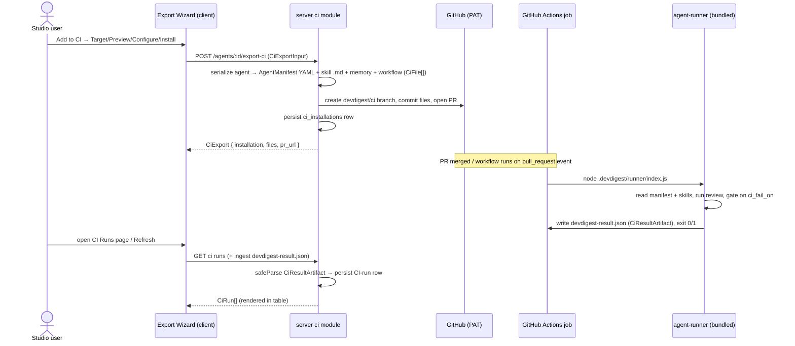
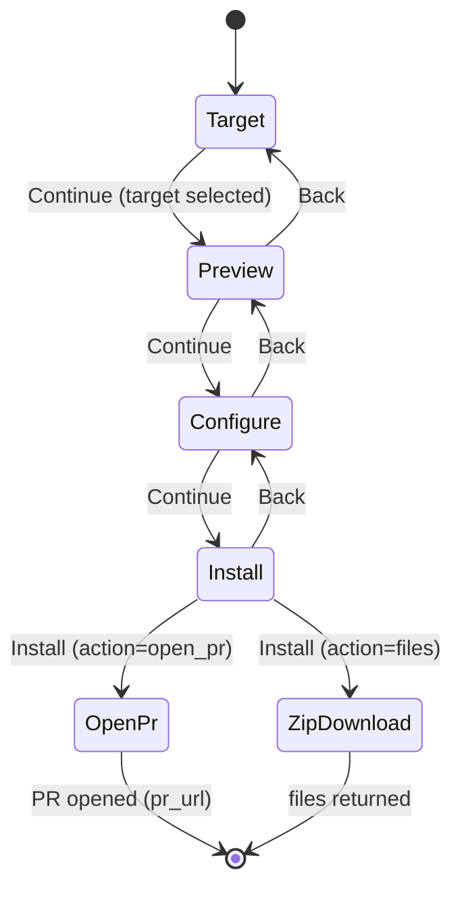

# Spec: Export to CI  |  Spec ID: SPEC-2026-07-19-export-to-ci  |  Status: approved

## Problem & why
A "debugged" DevDigest agent (a tuned config: model + system prompt + linked skills + settings)
today only runs inside the studio. There is no supported way to make that same agent review real
pull requests automatically inside a team's CI. Teams that iterated on an agent in the studio have
to hand-wire a workflow and hope the runtime behaves identically — which drifts from the studio and
is easy to get wrong on the security-sensitive parts (over-broad token scopes, secrets leaked to
fork PRs, comment-triggered actions).

This feature (worktree B of the L07 lab) adds the **Export to CI** path: a 4-step wizard on the
agent's CI tab that serializes the agent to a byte-identical manifest, generates a self-contained
GitHub Actions workflow (the already-built `agent-runner` travels in the same PR — no external
marketplace action), opens a reviewable PR to a `devdigest/ci` branch, and — once the runner
executes in CI — ingests its result artifact back into DevDigest for display on a global **CI Runs**
page and the per-agent **CI tab**. The manifest is validated by the *same* Zod contract in the
studio and in the runner, so the studio agent and the CI agent can never silently diverge.

## Goals / Non-goals
Goals:
- An "Add to CI" button on the agent CI tab opens the 4-step Export Wizard (Target → Preview →
  Configure → Install), per `design/02-wizard-1-target.png` … `design/05-wizard-4-install.png`.
- Serialize an agent config to a manifest at `.devdigest/agents/<slug>.yaml`, validated by the
  shared `AgentManifest` Zod contract — the same schema `agent-runner` reads.
- Generate a self-contained CI bundle (agent manifest + skill markdown + memory + workflow) and open
  a PR on a `devdigest/ci` branch; nothing lands on the base branch directly.
- Persist a `ci_installations` row per (agent, repo) export.
- Provide a server ingest endpoint that `safeParse`s a runner-produced `devdigest-result.json`
  (`CiResultArtifact`) and records CI-run history.
- Render the global **CI Runs** page (`design/06-ci-runs-page.png`) and the per-agent **CI tab**
  installations list (`design/01-ci-tab-agent-page.png`).
- Encode the security rules from requirement 7 as generated-workflow acceptance criteria
  (least-privilege `permissions:`, secret from Actions secrets only, fork PRs get no secrets, no
  comment-triggered actions).

Non-goals:
- Building or modifying `agent-runner` (root `agent-runner/`) — it is a fixed, already-implemented,
  already-tested dependency consumed via the shared manifest contract.
- The multi-agent review service and the PR feed — owned by worktree A. This spec introduces no
  changes there.
- Changing the `AgentManifest`, `CiResultArtifact`, `CiExport*`, `CiInstallation`, `CiFile`
  Zod contracts — they already exist and are synced both sides (`eval-ci.ts`). This spec consumes
  them as-is. **Additive exception (`CiRun` only):** `CiRun` gains three optional per-severity count
  fields (`critical?`/`warning?`/`suggestion?`) to back the Findings column of `design/06`, synced
  client + server — additive, no existing field changes (see Decisions).
- CircleCI / Jenkins / Generic-CLI target *generation*: the wizard shows all four target cards
  (`design/02-wizard-1-target.png`), but only GitHub Actions generation ships this iteration — the
  other three cards render visible-but-disabled ("coming soon") (AC-43).

## Assumptions
- An agent config is exactly: `provider`, `model`, `systemPrompt`, linked `skills` (via the
  `agent_skills` join table), and settings (`strategy`, `ciFailOn`, `repoIntel`, `enabled`,
  `version`) — confirmed at `server/src/db/schema/agents.ts:15-33,51-64`. The manifest serializes
  these into `AgentManifest` (`eval-ci.ts:260-277`).
- The canonical LLM secret is `OPENROUTER_API_KEY`. The runner reads only `OPENROUTER_API_KEY`
  (`agent-runner/src/index.ts:39`) and the manifest defaults `provider=openrouter`
  (`eval-ci.ts:261`). The `OPENAI_API_KEY` / `openai-key` and the `uses: devdigest/review-action@v1`
  line visible in `design/03-wizard-2-preview.png` are known mockup errors (locked decision) — the
  spec targets `OPENROUTER_API_KEY` and a self-contained runner invocation.
- The runner is self-contained: it ships as an ncc-bundled `.devdigest/runner/index.js` in the same
  PR and is invoked directly (`node .devdigest/runner/index.js`), referencing no external
  marketplace action (`agent-runner/src/index.ts:4-7`).
- The exported bundle files match `design/03-wizard-2-preview.png`'s "FILES TO CREATE" list:
  `.devdigest/agents/<slug>.yaml`, `.devdigest/skills/<slug>.md` (one per linked skill),
  `.devdigest/memory.jsonl`, `.github/workflows/devdigest-review.yml`.
- Export runs in the studio's single-tenant local mode against a GitHub PAT stored in
  `~/.devdigest/secrets.json` (project `CLAUDE.md`), not a GitHub App.

## Dependencies
- `agent-runner/` (root package) — the fixed runtime consumer of the manifest; reads
  `.devdigest/agents/*.yaml` (`agent-runner/src/manifest.ts:69`), resolves
  `.devdigest/skills/<slug>.md` (`agent-runner/src/skills.ts:18`), writes `devdigest-result.json`
  (`agent-runner/src/run.ts:149`), and gates the CI job on `ci_fail_on`
  (`agent-runner/src/run.ts:137-138,160-161`). Must not be modified.
- Shared contracts `server/src/vendor/shared/contracts/eval-ci.ts` (`AgentManifest`, `CiFile`,
  `CiExport`/`CiExportInput`, `CiInstallation`, `CiRun`, `CiRunStatus`, `CiResultArtifact`) and
  `knowledge.ts:227-232` (`CiFailOn`) — pre-existing, synced client + server.
- DB tables `ci_installations` and `ci_runs` (`server/src/db/schema/ci.ts`) — pre-existing;
  `ci_runs` is the CI-run system of record (ingest write target), joined to
  `ci_installations`→`agents` for repo + agent name on read. `agent_runs.source` enum
  `['local','ci']` (`server/src/db/schema/runs.ts:25`) is not written on the CI path in this
  iteration (see Decisions).
- `INJECTION_GUARD` (`reviewer-core/src/prompt.ts:16-34`, applied at `prompt.ts:116-117`) — the sole
  prompt-injection defense, already applied on the CI review path via the runner.
- i18n strings already authored in `client/messages/en/ci.json` (`runs.*`, `exportWizard.*`,
  `ciTab.*`) — reuse these keys.
- GitHub branch/commit/PR capability — **reuse the existing** `GitHubClient` port
  (`server/src/vendor/shared/adapters.ts:143`), concrete `OctokitGitHubClient`
  (`server/src/adapters/github/octokit.ts:39`): `commitFiles` (create-or-update branch + atomic
  commit, `octokit.ts:325`), `openPullRequest` (`octokit.ts:306`), and `findOpenPr` (`octokit.ts:393`,
  backs the AC-44 upsert). Obtain via `container.github()` (`server/src/platform/container.ts:159`);
  PAT from `SecretsProvider.get('GITHUB_TOKEN')` → `~/.devdigest/secrets.json` (env fallback,
  `server/src/adapters/secrets/local.ts:40`). No new branch/commit/PR primitive is needed; the port
  comment already names `devdigest/ci` (`adapters.ts:136`).

## User stories
- **US-1** As a studio user who tuned an agent, I want to click "Add to CI" and walk a 4-step wizard,
  so that the agent starts reviewing PRs in a target repo without hand-writing a workflow.
- **US-2** As a studio user, I want the export to open a reviewable PR (not commit to the base
  branch), so that the exported config is reviewed like any other code change.
- **US-3** As a security-conscious user, I want the generated workflow to be least-privilege and
  fork-safe by construction, so that adding CI review cannot leak my LLM key or be abused via PR
  comments.
- **US-4** As a studio user, I want the agent's CI tab to show every repo the agent is installed in
  with its status, so that I can see where it is deployed and update or add repos.
- **US-5** As a studio user, I want a global CI Runs page listing every review executed inside CI
  (PR, repo, agent, source, findings-by-severity, cost, duration, status, and a link to the Actions
  job), so that I can monitor automated reviews separately from local runs.
- **US-6** As a studio user, I want runner results to flow back into DevDigest automatically on
  refresh, so that CI-run history stays current without manual entry.

## Architecture & contracts

### End-to-end export → PR → CI run → ingest → CI Runs

### Wizard state machine

### Interface shapes (field-level; existing contracts, no new code)
- **`POST /agents/:id/export-ci`** — request body `CiExportInput` (`eval-ci.ts:282-291`):
  `repo` (string "owner/name", required), `target` (`gha|circle|jenkins|cli`, default `gha`),
  `action` (`open_pr|files`, default `open_pr`), `post_as` (`github_review|pr_comment|none`, default
  `github_review`), `triggers` (string[], default `[opened, synchronize, reopened]`), `base` (string,
  default `main`). Response `CiExport` (`eval-ci.ts:306-311`): `installation` (`CiInstallation`),
  `files` (`CiFile[]` — each `path` + `contents` + `editable`), `pr_url` (string | null).
- **`AgentManifest`** written to `.devdigest/agents/<slug>.yaml` (`eval-ci.ts:260-277`): `name`,
  `provider` (default `openrouter`), `model`, `system_prompt`, `skills` (string[] slugs), `strategy`
  (`auto|single-pass|map-reduce`), `ci_fail_on` (`never|critical|warning|any`, default `critical` —
  sourced from `agents.ciFailOn`). Contains no secret value.
- **CI ingest** — accepts a runner-produced `devdigest-result.json` shaped as `CiResultArtifact`
  (`eval-ci.ts:336-347`): `findings_count`, `critical?`, `warning?`, `suggestion?`, `cost_usd`,
  `duration_ms?`, `agent`, `version?`, `pr_number?`. Server `safeParse`s and maps it onto a
  `ci_runs` row (the CI-run system of record).
- **CI Runs read model** — a list of `CiRun` (`eval-ci.ts:317-330`) read from `ci_runs` joined to
  `ci_installations`→`agents` for `repo` + `agent`: `id`, `ci_installation_id`, `pr_number`,
  `ran_at`, `status`, `findings_count`, `cost_usd`, `github_url`, `source`, `agent?`, `duration_s?`.
  The per-severity counts the table renders come from three fields persisted on the `ci_runs` row at
  ingest (`critical`/`warning`/`suggestion` from the artifact) — see Decisions.
- **Client surface** (new, per current-state gaps): `ci-runs` `NavItemDef` in
  `client/src/vendor/ui/nav.ts`, a `"ci"` tab in `client/src/app/agents/[id]/_components/AgentEditor/constants.ts`
  `TABS`, and an `app/ci-runs/` page — reusing `ci.json` strings.

## Design references
| File | Shows | Grounds |
| --- | --- | --- |
| `design/01-ci-tab-agent-page.png` | Agent CI tab: "CI deployment · Active in N repos" header, "Update CI config" + "Add to CI" buttons, per-repo installation rows (target badge + status pill + relative time), "Add repository" row | US-1, US-4, AC-1, AC-20, AC-21, AC-22 |
| `design/02-wizard-1-target.png` | Wizard Step 1 Target: 4 target cards (GitHub Actions recommended, CircleCI, Jenkins, Generic CLI), Continue | US-1, AC-2, AC-3 |
| `design/03-wizard-2-preview.png` | Wizard Step 2 Preview: FILES TO CREATE list + selected file contents with "editable" badge (workflow YAML editable) | US-1, AC-4, AC-5, AC-6 |
| `design/04-wizard-3-configure.png` | Wizard Step 3 Configure: trigger chips, Secrets expected (OPENROUTER_API_KEY not set, GITHUB_TOKEN ready), Post results as radios, block-merge info callout | US-1, US-3, AC-7, AC-8, AC-9, AC-14 |
| `design/05-wizard-4-install.png` | Wizard Step 4 Install: "Open a PR with these files" (recommended) vs "Copy files as a zip", setup-docs link, Install | US-1, US-2, AC-10, AC-11, AC-12 |
| `design/06-ci-runs-page.png` | Global CI Runs page: title/subtitle, auto-refresh + Refresh, filter chips, table (timestamp, PR, agent, source, dur., findings-by-severity, cost, status, Trace) | US-5, US-6, AC-23, AC-24, AC-25, AC-26, AC-27 |

## Acceptance criteria (EARS)

### Export wizard (US-1)
- AC-1: WHEN a user opens the agent's CI tab and clicks "Add to CI", the system shall open the
  Export Wizard on Step 1 (Target) with the 4-step progress indicator Target → Preview → Configure →
  Install (`design/01-ci-tab-agent-page.png`, `design/02-wizard-1-target.png`).
- AC-2: WHILE the wizard is on Step 1, the system shall present exactly four target cards — GitHub
  Actions (marked "recommended"), CircleCI, Jenkins, Generic CLI — with GitHub Actions selected by
  default (`design/02-wizard-1-target.png`).
- AC-3: WHEN a user advances from any step via "Continue", the system shall move to the next step in
  the fixed order Target → Preview → Configure → Install, and WHEN the user clicks "Back" it shall
  return to the immediately previous step (`design/02-wizard-1-target.png`,
  `design/05-wizard-4-install.png`).
- AC-4: WHEN the wizard reaches Step 2 (Preview), the system shall list the files to be created —
  `.devdigest/agents/<slug>.yaml`, one `.devdigest/skills/<slug>.md` per linked skill,
  `.devdigest/memory.jsonl`, and `.github/workflows/devdigest-review.yml`
  (`design/03-wizard-2-preview.png`).
- AC-5: WHEN a user selects a file in the Step 2 Preview list, the system shall display that file's
  generated contents in the right pane (`design/03-wizard-2-preview.png`).
- AC-6: WHERE a previewed file is the generated workflow, the system shall mark it "editable" and
  allow the user to edit its contents before install (`design/03-wizard-2-preview.png`).
- AC-7: WHILE the wizard is on Step 3 (Configure), the system shall render trigger chips for
  `pull_request:opened`, `pull_request:synchronize` (both selected by default) and
  `pull_request:reopened` (optional, unselected by default) (`design/04-wizard-3-configure.png`).
- AC-8: WHILE the wizard is on Step 3, the system shall list the expected secrets — `OPENROUTER_API_KEY`
  ("Your OpenRouter key", status "not set") and `GITHUB_TOKEN` ("Auto-provided by Actions", status
  "ready") (`design/04-wizard-3-configure.png`).
- AC-9: WHILE the wizard is on Step 3, the system shall present "Post results as" options GitHub
  review (recommended), PR comment, and None (exit code only), mapping to `CiExportInput.post_as`
  values `github_review|pr_comment|none` (`design/04-wizard-3-configure.png`, `eval-ci.ts:287`).
- AC-45: WHILE the wizard is on Step 3, the block-merge info callout shall state that merge blocking
  is achieved via "Fail CI on" + a branch-protection required status check with no GitHub App
  required; the `exportWizard.blockMergeDesc` i18n string shall be corrected from its current
  "Requires a GitHub App" text to match this (`design/04-wizard-3-configure.png`,
  `client/messages/en/ci.json`).
- AC-47: WHEN a user changes triggers or "Post results as" on Step 3 (Configure) after hand-editing
  the workflow YAML on Step 2 (Preview), the system shall regenerate the workflow and shall warn that
  manual Step-2 edits to regenerated fields will be overwritten (`design/03-wizard-2-preview.png`,
  `design/04-wizard-3-configure.png`).
- AC-10: WHILE the wizard is on Step 4 (Install), the system shall offer "Open a PR with these files"
  (recommended) and "Copy files as a zip", and shall link to the GitHub Action setup docs
  (`design/05-wizard-4-install.png`).
- AC-11: WHEN the user confirms Install with "Open a PR with these files", the system shall call
  `POST /agents/:id/export-ci` with `action=open_pr` and shall surface the resulting `pr_url`
  (`design/05-wizard-4-install.png`, `eval-ci.ts:286,309`).
- AC-12: WHEN the user confirms Install with "Copy files as a zip", the system shall call
  `POST /agents/:id/export-ci` with `action=files` and shall return the generated files without
  opening a PR (`design/05-wizard-4-install.png`, `eval-ci.ts:286`).

### Manifest serialization & PR (US-1, US-2)
- AC-13: WHEN the server handles `POST /agents/:id/export-ci`, the system shall serialize the agent
  config to `.devdigest/agents/<slug>.yaml` conforming to the shared `AgentManifest` schema, such
  that `AgentManifest.safeParse` on that YAML succeeds (`eval-ci.ts:260-277`,
  `agent-runner/src/manifest.ts:69`).
- AC-14: The system shall set the manifest's `ci_fail_on` from the agent's stored `ciFailOn` setting
  (`server/src/db/schema/agents.ts:25`, `eval-ci.ts:275`).
- AC-15: The system shall emit one `.devdigest/skills/<slug>.md` file for each skill linked to the
  agent via `agent_skills`, whose slug matches a `skills` entry in the manifest
  (`server/src/db/schema/agents.ts:51-64`, `agent-runner/src/skills.ts:18`).
- AC-16: The system shall generate a self-contained workflow that invokes the bundled runner directly
  (e.g. `node .devdigest/runner/index.js`) and shall not reference any external marketplace action
  (no `uses: devdigest/review-action@...`) (`agent-runner/src/index.ts:4-7`; corrects
  `design/03-wizard-2-preview.png`).
- AC-46: The system shall include the prebuilt ncc bundle of `agent-runner` as
  `.devdigest/runner/index.js` in the exported files, and the generated workflow shall invoke it with
  `node .devdigest/runner/index.js` — with no `ncc build`/`npm ci` step and no branch/release checkout
  of the runner at job time (`agent-runner/src/index.ts:4-7`).
- AC-17: WHEN `action=open_pr`, the system shall commit the generated files to a `devdigest/ci`
  branch and open a pull request against `CiExportInput.base` via the existing `GitHubClient` port
  (`commitFiles` then `openPullRequest`, `server/src/adapters/github/octokit.ts:325,306`), and shall
  not commit any file directly to the base branch (`eval-ci.ts:290`).
- AC-18: WHEN an export succeeds, the system shall persist a `ci_installations` row with the agent id,
  `repo`, and `target_type`, and shall return it as `CiExport.installation`
  (`server/src/db/schema/ci.ts:4-12`, `eval-ci.ts:307`).
- AC-19: IF `CiExportInput.repo` is not a non-empty "owner/name" string, THEN the system shall reject
  the request with a validation error and shall not open a PR (`eval-ci.ts:284`).
- AC-43: WHILE the wizard is on Step 1 (Target), the system shall render the CircleCI, Jenkins, and
  Generic CLI cards as visible-but-disabled ("coming soon"); only GitHub Actions generation is
  produced this iteration (`design/02-wizard-1-target.png`).
- AC-44: WHEN an export targets a (agent, repo) pair that already has a `ci_installations` row, the
  system shall upsert that row and open or refresh the single `devdigest/ci` PR rather than creating a
  duplicate installation or PR, using `findOpenPr` to reuse the existing open PR for that branch
  (`server/src/adapters/github/octokit.ts:393`, `design/01-ci-tab-agent-page.png`, `ci.json`
  `publishDialog.republish`).

### Agent CI tab (US-4)
- AC-20: WHILE an agent has one or more CI installations, the CI tab shall display a "CI deployment"
  header stating the count of active repos and shall render "Update CI config" and "Add to CI"
  actions (`design/01-ci-tab-agent-page.png`).
- AC-21: The CI tab shall render one row per installation showing the repo, a target-type badge
  (e.g. GitHub Actions), the latest run status pill, and a relative timestamp
  (`design/01-ci-tab-agent-page.png`).
- AC-22: The CI tab shall render an "Add repository" affordance that opens the Export Wizard for a new
  target repo (`design/01-ci-tab-agent-page.png`).
- AC-41: The CI tab shall provide a "Fail CI on" selector bound to the agent's `ciFailOn` setting
  (one per-agent value applied to all its installations), persisting to `agents.ciFailOn`
  (`server/src/db/schema/agents.ts:25`, requirement 6).
- AC-42: WHERE the CI tab shows a workflow version for an installation, the system shall surface the
  agent's `version` captured at export time; it shall not track a separate per-installation workflow
  version in this iteration (`server/src/db/schema/agents.ts`, requirement 6).

### CI Runs page (US-5, US-6)
- AC-23: The CI Runs page shall render the title "CI Runs" and subtitle "Agent reviews executed
  inside CI · not local runs", reusing `ci.json` `runs.title`/`runs.subtitle`
  (`design/06-ci-runs-page.png`, `client/messages/en/ci.json:5-6`).
- AC-24: The CI Runs page shall render one table row per CI run with columns Timestamp, Pull Request
  (#number + truncated title), Agent, Source (target badge), Duration, Findings, Cost, Status, and a
  trailing "Trace" link (`design/06-ci-runs-page.png`).
- AC-25: WHERE a run has findings, the Findings column shall show per-severity counts (blocker,
  warning, suggestion) with their severity icons; WHERE a run has no findings it shall show "—"
  (`design/06-ci-runs-page.png`).
- AC-26: IF a run's status is failed, THEN the system shall render "—" in the Duration, Findings, and
  Cost columns for that row (`design/06-ci-runs-page.png`).
- AC-27: The Status column shall render a pill of Succeeded, No findings, or Failed, mapping to
  `CiRunStatus` values `succeeded|no_findings|failed` (`design/06-ci-runs-page.png`,
  `eval-ci.ts:313`, `client/messages/en/ci.json:25-30`).
- AC-28: WHEN a user clicks a row's "Trace" link, the system shall navigate to the run's Actions job
  URL from `CiRun.github_url` (`eval-ci.ts:326`, `design/06-ci-runs-page.png`).
- AC-39: WHILE the CI Runs page is open, the system shall auto-refresh by polling for new CI runs
  every ~15 seconds and shall ingest any new runner results on each poll, in addition to a manual
  "Refresh" control (`design/06-ci-runs-page.png`).
- AC-40: The CI Runs page shall provide a "Source" filter (e.g. GitHub Actions / CircleCI) alongside
  the date/agent/repo/status filters, keyed as `runs.filters.allSources`
  (`design/06-ci-runs-page.png`, `client/messages/en/ci.json`).

### Ingest (US-6)
- AC-29: WHEN the CI ingest endpoint receives a `devdigest-result.json` payload, the system shall
  `safeParse` it against `CiResultArtifact` and shall reject a payload that fails validation without
  persisting a run (`eval-ci.ts:336-347`).
- AC-30: WHEN a valid `CiResultArtifact` is ingested, the system shall persist a `ci_runs` row
  carrying its `agent`, `findings_count`, `critical`/`warning`/`suggestion` per-severity counts,
  `cost_usd`, `duration_ms`, and `pr_number`, with `source` set to the originating CI target, linked
  to the matching `ci_installations` row (`eval-ci.ts:336-347`, `server/src/db/schema/ci.ts:14-26`).
- AC-37: WHEN a CI job for an installed repo finished with a failed conclusion and produced no
  `devdigest-result.json` artifact, the system shall record a `ci_runs` row with `status='failed'`
  and null duration/findings/cost, sourced from the job metadata (PR number, repo, Actions URL),
  so the failed run still appears on the CI Runs page per AC-26.
- AC-38: The server shall ingest CI results by pulling from the GitHub Actions API (studio is
  unreachable from GitHub in local single-tenant mode): for each installed repo it lists recent
  workflow runs, downloads the `devdigest-result.json` artifact when present, and `safeParse`s it
  per AC-29 — the studio pulls; the workflow never posts back to the studio.

### Security — generated workflow & fork safety (US-3, requirement 7)
- AC-31: The generated workflow shall declare `permissions:` limited to exactly `contents: read` and
  `pull-requests: write`, and shall grant no broader scope (requirement 7).
- AC-32: The generated workflow shall reference the LLM key only as `${{ secrets.OPENROUTER_API_KEY }}`
  and shall never embed a key literal in the workflow or the manifest (requirement 7;
  `agent-runner/src/index.ts:39`).
- AC-33: The generated manifest YAML shall contain no secret or API-key value (requirement 7;
  `eval-ci.ts:260-277`).
- AC-34: The generated workflow shall trigger only on `pull_request` events (`opened`, `synchronize`,
  and optionally `reopened`) and shall not use `pull_request_target`, so that a pull request from a
  fork runs without access to repository secrets (requirement 7; `design/04-wizard-3-configure.png`).
- AC-35: The generated workflow shall not trigger any review action from `issue_comment` or
  pull-request-comment events, so that untrusted comment text cannot initiate a run (requirement 7).
- AC-36: WHILE a review runs in CI, the system shall treat the PR diff, PR description, and any
  comment text as untrusted data governed by `INJECTION_GUARD`, never as instructions
  (`reviewer-core/src/prompt.ts:16-34`, requirement 7).

## Success criteria (measurable)
- 100% of manifests emitted by export pass `AgentManifest.safeParse` in the runner on first read
  (zero schema-drift failures), verified against `agent-runner/src/manifest.ts:69`.
- 100% of generated GHA workflows satisfy AC-31 (`permissions:` = `contents: read` +
  `pull-requests: write`, nothing broader) and AC-34/AC-35 (no `pull_request_target`, no
  comment-triggered runs) — measured by a static assertion over the generated YAML.
- 0 secret literals present in any generated workflow or manifest file (AC-32/AC-33), scanned before
  the PR is opened.

## Edge cases
- Re-exporting an agent to a repo it is already installed in — the system upserts the existing
  `ci_installations` row and opens/refreshes a single `devdigest/ci` PR, not a duplicate (AC-44;
  `design/01-ci-tab-agent-page.png` "Update CI config"; `ci.json` `publishDialog.republish`).
- User edits the workflow YAML in Step 2 (Preview), then changes triggers/post-as in Step 3
  (Configure) — the system regenerates the workflow and warns that manual Step-2 edits will be
  overwritten (AC-47).
- Runner hard-fails before writing an artifact (any pipeline exception → exit 1, no
  `devdigest-result.json`, `agent-runner/src/run.ts:167-172`) — the CI Runs page must represent such
  a run as `failed` with "—" columns (AC-26). With no artifact to `safeParse`, a failed `ci_runs`
  row must still be recorded from the workflow-side signal (job conclusion + PR/repo context), with
  `status='failed'` and null duration/findings/cost — see AC-37.
- Fork PR with no `OPENROUTER_API_KEY` available — runner receives empty key
  (`agent-runner/src/index.ts:39`); its degraded behavior is `agent-runner`'s own (out of scope), but
  the resulting failed/skipped run must still surface sanely on the CI Runs page.
- CircleCI / Jenkins / Generic-CLI target selected — out of scope this iteration; the cards render
  visible-but-disabled ("coming soon") and only GitHub Actions generation ships (AC-43).
- Empty state: no CI runs yet → reuse `ci.json` `runs.emptyTitle`/`runs.emptyBody`
  (`client/messages/en/ci.json:3-4`).

## Non-functional
- Security: least-privilege token scope, secrets sourced only from Actions secrets, fork PRs
  denied secrets, no comment-triggered execution, untrusted-input handling via `INJECTION_GUARD`
  — all covered as ACs above.
- Security (server input): `CiExportInput.repo` is user-supplied "owner/name" text used to build a
  GitHub API path — the server must validate/normalize it and treat it as data, never interpolate it
  unescaped into a shell command or file path (A05/A08). The generated file paths under `.devdigest/`
  are server-controlled constants, not user input.
- The CI Runs page auto-refreshes by polling every ~15s (ingesting new runner results on each poll)
  with a manual Refresh control (`design/06-ci-runs-page.png`, AC-39).

## Inputs (provenance)
- Agent config → manifest fields: `[reused: server/src/db/schema/agents.ts:15-33]` (provider, model,
  systemPrompt, strategy, ciFailOn, version) and `[reused: server/src/db/schema/agents.ts:51-64]`
  (linked skills via `agent_skills` join table).
- Manifest schema + validation contract: `[reused: server/src/vendor/shared/contracts/eval-ci.ts:260-277]`
  (`AgentManifest`); consumed by the runner at `[reused: agent-runner/src/manifest.ts:69]`.
- Runner LLM key source: `[deterministic: agent-runner/src/index.ts:39]` (`OPENROUTER_API_KEY` only).
- Result artifact shape + producer: `[reused: server/src/vendor/shared/contracts/eval-ci.ts:336-347]`
  (`CiResultArtifact`), written by `[deterministic: agent-runner/src/run.ts:149]` and built/validated
  at `[deterministic: agent-runner/src/artifact.ts:32-53]`.
- CI-fail gate semantics: `[deterministic: reviewer-core]` gate computed in
  `[reused: agent-runner/src/run.ts:137-138,160-161]` from `CiFailOn`
  `[reused: knowledge.ts:227-232]`.
- Export request/response + installation/run read models:
  `[reused: eval-ci.ts:282-330]` (`CiExportInput`, `CiExport`, `CiInstallation`, `CiRunStatus`,
  `CiRun`) and `[reused: server/src/db/schema/ci.ts:4-26]` (tables). `CiRun` and `ci_runs` are
  extended additively with optional `critical`/`warning`/`suggestion` per-severity counts
  `[new: additive fields + migration — see Decisions]`.
- i18n strings: `[reused: client/messages/en/ci.json]` (`runs.*`, `exportWizard.*`, `ciTab.*`).
- Injection defense on the CI review path: `[reused: reviewer-core/src/prompt.ts:16-34,116-117]`.
- GitHub branch/commit/PR: `[reused: server/src/vendor/shared/adapters.ts:143]` (`GitHubClient` port),
  `[reused: server/src/adapters/github/octokit.ts:306,325,393]` (`openPullRequest`/`commitFiles`/
  `findOpenPr`), obtained via `[reused: server/src/platform/container.ts:159]`; PAT via
  `[reused: server/src/adapters/secrets/local.ts:40]`.
- Server ci module orchestration, `POST /agents/:id/export-ci`, the pull-based ingest endpoint,
  `app/ci-runs/` page, `ci-runs` nav item, and the `"ci"` editor tab: `[new: 0 LLM calls — new code,
  none exists yet]` (confirmed absent: `server/src/modules/ci/` not present; no export/ingest route;
  no client CI hooks; no skill-to-markdown serializer). The manifest YAML writer, workflow generator,
  and per-severity `ci_runs` columns are also new, but branch/commit/PR reuses the adapter above.

## Untrusted inputs
The CI review path consumes externally-authored text — the PR diff, the PR author's description, and
(potentially) PR comments — which the bundled runner feeds to the LLM. All of it must be treated as
data, never as instructions, per `reviewer-core`'s `INJECTION_GUARD`
(`reviewer-core/src/prompt.ts:16-34`), which is appended to every agent's system prompt on every
review path including the CI runner. Additionally, `CiExportInput.repo` is user-supplied text used to
construct a GitHub API target and must be validated as data server-side (see Non-functional).

## Decisions
- **Ingest/read-model table** → `ci_runs` is the CI-run system of record (ingest write target),
  joined to `ci_installations`→`agents` for repo + agent name on read. `agent_runs(source='ci')` is
  NOT written on the CI path this iteration (per-run observability like tokens/model/grounding is not
  on the CI Runs page). (AC-30, AC-37; `server/src/db/schema/ci.ts:14-26`.)
- **Findings-by-severity** → persist `critical`/`warning`/`suggestion` from the ingested
  `CiResultArtifact` onto the `ci_runs` row (new nullable int columns via a new migration) and expose
  them as optional additive fields on the `CiRun` contract, so the table reads them directly. (AC-25,
  AC-30; additive-exception noted under Non-goals.)
- **Ingest model** → pull-based: the studio polls the GitHub Actions API and downloads artifacts;
  the workflow never posts back (studio unreachable from GitHub in local single-tenant mode). (AC-38.)
- **Auto-refresh cadence** → poll every ~15s and ingest on each poll, plus a manual Refresh. (AC-39.)
- **Source filter** → in scope; add `runs.filters.allSources` i18n key. (AC-40.)
- **"Fail CI on" scope** → per-agent (writes `agents.ciFailOn`, applied to all installations); no
  per-installation column added. (AC-41.)
- **Workflow version on installations** → surface the agent's `version` captured at export time; no
  per-install version column this iteration. (AC-42.)
- **Non-GHA target generation** → GHA-only; CircleCI/Jenkins/Generic-CLI cards render
  visible-but-disabled ("coming soon"). (AC-43.)
- **Re-export / update semantics** → upsert on (agent, repo): update the existing `ci_installations`
  row and open/refresh a single `devdigest/ci` PR. (AC-44.)
- **`blockMergeDesc` i18n string** → the `ci.json` `exportWizard.blockMergeDesc` string ("Requires a
  GitHub App — not available with PAT in local mode") contradicts the authoritative
  `design/04-wizard-3-configure.png` callout ("Fail CI on" + branch-protection required status check,
  "No GitHub App needed"). Correct the i18n string to the design's branch-protection guidance. (AC-45.)
- **Preview edit vs. Configure regeneration** → regenerate the workflow on a Configure change and
  warn that manual Step-2 edits to regenerated fields will be overwritten (no YAML-merge this
  iteration). (AC-47.)
- **Runner bundling** → the export commits the prebuilt ncc `dist/index.js` into the PR as
  `.devdigest/runner/index.js`, invoked via `node .devdigest/runner/index.js`; no build step or
  checkout of the runner at job time. (AC-46.)

## [NEEDS CLARIFICATION]
- None remaining — all open items resolved above (see Decisions) or covered by acceptance criteria.
