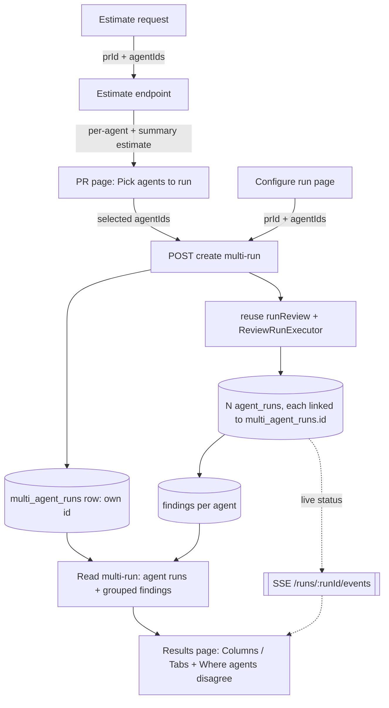
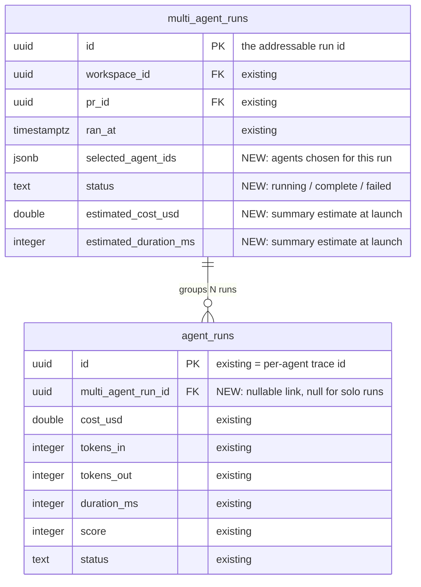
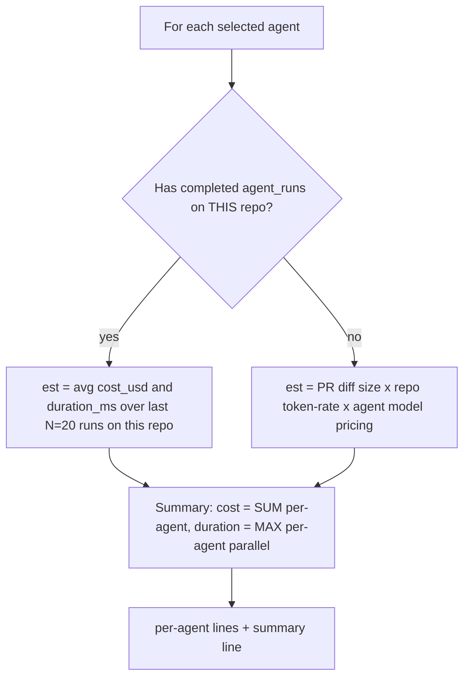
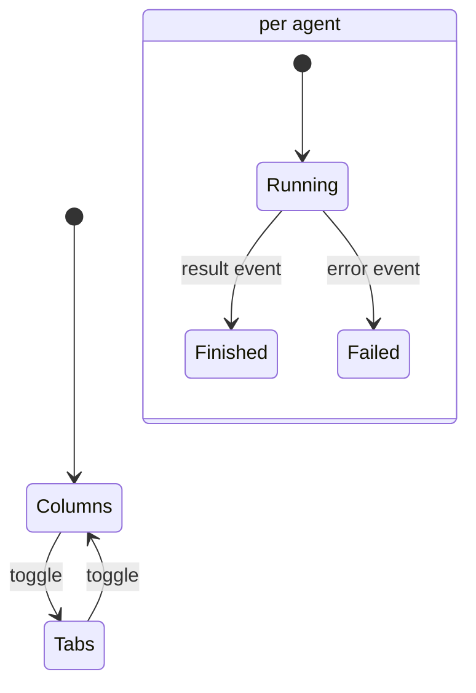

# Spec: Multi-Agent Review & live multi-agent review  |  Spec ID: SPEC-2026-07-19-multi-agent-review  |  Status: approved

## Problem & why
A real PR mixes security, performance, and domain-logic concerns; a single general reviewer agent
under-covers whichever concern isn't its focus. Today the PR page runs "one agent or all" via
`RunReviewDropdown` (`client/src/app/repos/[repoId]/pulls/[number]/_components/RunReviewDropdown/RunReviewDropdown.tsx:51-77`)
and the executor runs the selected agents but presents their findings as one flat list with no
attribution and no cross-agent grouping. Two consequences the requester called out: (1) when three
specialized agents independently flag the same obvious bug, the user reads three near-identical
findings and stops trusting the tool; (2) there is no addressable record of a multi-agent run, so
the control measurement "same PR: 1 agent vs 3, token/dollar totals side by side" cannot be taken.
This feature ("worktree A") adds an agent picker with a pre-run cost/time estimate, persists each
multi-agent run as its own addressable record, groups findings across agents by code location
("Where agents disagree"), and presents live per-agent status on a dedicated results page — reusing
the existing parallelism-capable executor, `FindingCard`, and run-trace drawer rather than
rebuilding them.

## Goals / Non-goals
**Goals**
- G1: A multi-select "Pick agents to run" picker on the PR page that replaces the existing
  one-or-all `RunReviewDropdown`, plus a **Multi-Agent Review → Configure run** page (select PR +
  agent checkboxes) that starts the same run. (`design/01.png`, `design/02.png`, `design/03.png`)
- G2: A pre-run per-agent cost/time estimate and a summary estimate, computed from a **hybrid**,
  **repo-scoped** source: an agent's historical average over its recent completed runs **on the
  target PR's repository** when available, else PR diff size × a repo token-rate constant × model
  pricing. The summary shows cost = Σ per-agent, duration = max per-agent (parallel fan-out).
  (`design/01.png`, `design/03.png`)
- G3: Persist each multi-agent run as its own addressable `multi_agent_runs` record that links the
  N spawned `agent_runs`; a re-run creates a new record and never overwrites a prior one.
- G4: Cross-agent grouping ("Where agents disagree") using a **same-file + overlapping-line-range**
  rule only, showing a column per agent that actually ran with a binary `flagged` / `did not flag`
  verdict, and a "Show only conflicts" toggle. (`design/04.png`, `design/05.png`)
- G5: A Multi-Agent Review results page with a **Columns ⇄ Tabs** mode toggle: Columns = one
  column per agent (live status + cost + score header, "View trace", findings); Tabs+detail =
  per-agent tabs rendering findings via the reused `FindingCard`. (`design/04.png`, `design/05.png`)
- G6: Live per-agent status on the results page while the run is in progress, via the existing SSE
  run-events stream. (`design/04.png`)
- G7: A per-agent "View trace" that opens the existing `RunTraceDrawer` for that agent's run id.
  (`design/04.png`, `design/05.png`)

**Non-goals**
- N1: No changes to the review engine — `ci/` and `agent-runner/` are off-limits, and
  `reviewer-core/` (esp. `grounding.ts`) is read-only.
- N2: No new finding-action **server** logic. Accept/Dismiss and Turn-into-eval-case are reused
  as-is. Learn and Reply-to-author are added to `FindingCard` only as **visible, disabled/no-op
  stub buttons** to match `design/05.png`, rendered only when the parent passes their handler (same
  conditional-prop pattern as the existing `onTurnIntoEvalCase`), so they appear in the Multi-Agent
  Review detail but NOT on the existing PR findings page. No server route change — `learn`/`reply`
  keep their current 400. (See AC-24.)
- N3: No semantic / "essence" similarity in the grouping rule — file + line-range overlap only.
- N4: No Per-Agent Stats / "Agent Performance" page — attribution data is captured, but that page
  is a separate feature. Its sidebar nav entry is **not** added by worktree A either; only the
  "Multi-Agent Review" nav entry + route is added (the `NAV` array has neither today —
  `client/src/vendor/ui/nav.ts:21-39`). (See AC-25.)
- N5: No new trace or live-log UI — the existing drawer and SSE stream are reused unchanged.

## Assumptions
- A1: The existing review executor is the sole path that spawns per-agent `agent_runs`; the new
  create-multi-run route reuses `service.runReview` / `ReviewRunExecutor` rather than a second
  execution path. (`server/src/modules/reviews/service.ts:103-138`,
  `server/src/modules/reviews/run-executor.ts:66-168`)
- A2: Each agent's per-run row (`agent_runs.id`) is the trace id the drawer already consumes — the
  drawer takes a `runId`, and an agent's run id is exactly that. (`RunTraceDrawer.tsx:19-29`)
- A3: New Zod contracts for the multi-run/estimate payloads live in `vendor/shared` and must be
  mirrored in both `server/src/vendor/shared/` and `client/src/vendor/shared/` (manual copy), with
  the client `extensionAlias` gotcha honored. (`client/INSIGHTS.md:93`, `client/INSIGHTS.md:130`)
- A4: The grouping rule is computed server-side and returned by the read-multi-run route, so the
  ~6-line line-overlap helper is reimplemented locally in the server (matching the in-repo
  duplication pattern), not imported from `reviewer-core`. (`reviewer-core/INSIGHTS.md:23`)
- A5: This is a single-tenant/workspace-scoped app; every multi-run read/write is scoped to the
  active `workspaceId` (both `multi_agent_runs` and `agent_runs` carry it).

## Dependencies
- D1: **Parallel execution of the selected agents — IN SCOPE for worktree A (resolved).** The
  current executor runs agents **sequentially** — `executeRuns` iterates jobs with a `for … await`
  loop (`server/src/modules/reviews/run-executor.ts:140` and `:147`), with no `Promise.all`. The
  headline "parallelism saves time, not money" measurement and the design's "≈ 8.2s · parallel
  fan-out" summary (`design/03.png`, `design/04.png`) require concurrency. **Decision: worktree A
  makes the fan-out concurrent** (bounded `Promise.all` over jobs). `run-executor.ts` is under
  `server/` (not the off-limits `ci/`/`agent-runner/`), and per-agent failure isolation already
  exists (the `await` is wrapped in try/catch inside the loop). Because this is the SHARED execution
  path for every review, the change must preserve per-agent failure isolation and mind LLM-provider
  rate limits and DB/SSE-bus write contention under concurrency. Solo (1-agent) runs are unaffected
  — concurrency only changes behavior at N>1. See AC-23. (`reviewer-core/INSIGHTS.md:15` deadline
  budget is per-request and unaffected by concurrency.)
- D2: Reused finding actions — server `actOnFinding` (accept/dismiss) at
  `server/src/modules/reviews/findings.ts:11-34`, and the eval-case path
  (`server/src/modules/eval/service.ts:420-593`, routes at
  `server/src/modules/eval/routes.ts:109-118` and `:146-149`).
- D3: Reused SSE live-events stream — `useRunEvents` (`client/src/lib/hooks/reviews.ts:176-225`)
  over `GET /runs/:runId/events` (`server/src/modules/reviews/routes.ts:48-92`).
- D4: Reused `FindingCard` (`client/.../FindingCard/FindingCard.tsx`) and `RunTraceDrawer`
  (`client/.../RunTraceDrawer/RunTraceDrawer.tsx`).
- D5: A new generated migration is required for the schema changes (migrations do not run on boot;
  `pnpm db:generate` then `pnpm db:migrate`; never edit existing migrations).

## User stories
- US1: As a reviewer, I want to pick a subset of agents to run on a PR directly from the PR page, so
  that I cover several concerns (security, performance, domain) in one pass. (`design/01.png`)
- US2: As a reviewer, I want to start a multi-agent review from a dedicated Configure-run page by
  selecting a PR and checking agents, so that I can launch a run without being on the PR page.
  (`design/02.png`, `design/03.png`)
- US3: As a reviewer, I want a per-agent and total cost/time estimate before I run, so that I know
  roughly what a fan-out will cost. (`design/01.png`, `design/03.png`)
- US4: As a reviewer, I want to watch each agent's status change live during the run, so that I stop
  anxiously watching a single spinner and can see who finished, who's thinking, and who crashed.
  (`design/04.png`)
- US5: As a reviewer, I want to compare agents' findings side by side (Columns) or drill into one
  agent's findings (Tabs + detail), so that I can work whichever way suits the review.
  (`design/04.png`, `design/05.png`)
- US6: As a reviewer, I want findings that different agents raised at the same code location grouped
  together — including agents that ran but "did not flag" it — so that I don't read three duplicate
  findings and can see genuine disagreement. (`design/04.png`, `design/05.png`)
- US7: As a reviewer, I want to open any agent's full trace from its column/tab, so that I can
  answer "why did this finding cost this much" and "what did the grounding gate reject".
  (`design/04.png`, `design/05.png`)
- US8: As a reviewer, I want each multi-run kept as its own addressable record, so that I can reopen
  a past run and compare a 1-agent run against a 3-agent run on the same PR.

## Architecture & contracts

### Data flow: PR → picker → multi-run → agent_runs → grouping → UI

### Schema shape (field-level, no code)

- New `multi_agent_runs` columns: `selected_agent_ids` (jsonb array of uuid), `status`
  (text enum-like), `estimated_cost_usd` (double precision), `estimated_duration_ms` (integer). All
  NEW columns nullable/defaulted to keep the migration additive. (base table:
  `server/src/db/schema/runs.ts:42-51`)
- New `agent_runs` column: `multi_agent_run_id` (uuid, nullable, FK → `multi_agent_runs.id`,
  `on delete set null`); null for existing/solo runs so the change is backward-compatible. Today
  `agent_runs` has no such FK. (`server/src/db/schema/runs.ts:8-32`)
- The `estimated_cost_usd` / `estimated_duration_ms` pair is **stored on the row at launch** (not
  recomputed on read), so a past run shows the estimate-vs-actual it was launched with — required
  for the addressable-history value (G3) and the 1-vs-3 comparison.

### New routes (field-level, no code)
- **Create multi-run** — `POST /pulls/:id/multi-agent-runs`
  - in: `{ agentIds: uuid[] }` (workspace + pr from path/context)
  - out: `{ multiRunId: uuid, runs: { agentId, runId }[] }`
  - effect: inserts one `multi_agent_runs` row, spawns N linked `agent_runs`, fires the reused
    executor. Mirrors the existing `POST /pulls/:id/review` shape
    (`server/src/modules/reviews/routes.ts:27-44`).
- **Read multi-run** — `GET /multi-agent-runs/:id`
  - out: `{ id, prId, status, ranAt, agents: { agentId, runId, status, costUsd, durationMs, score,
    findingsCount }[], groups: CrossAgentGroup[] }`
  - `CrossAgentGroup`: `{ file, lineStart, lineEnd, title, verdicts: { agentId, state:
    'flagged'|'did_not_flag', severity?, findingId? }[], isConflict: boolean }`.
- **Estimate** — `POST /pulls/:id/multi-agent-runs/estimate`
  - in: `{ agentIds: uuid[] }`
  - out: `{ perAgent: { agentId, estCostUsd, estDurationMs, basis: 'history'|'diff-size' }[],
    summary: { estCostUsd, estDurationMs } }`.
- **List history (recommended)** — `GET /pulls/:id/multi-agent-runs` → `[{ id, ranAt, status,
  agentCount, totalCostUsd, totalDurationMs }]` for the 1-vs-3 comparison view.
- **Route/module placement (resolved by convention):** the new routes, service, and repository live
  in a self-contained Fastify plugin `server/src/modules/multi-agent-runs/` (per the server
  convention "each feature is a self-contained Fastify plugin: `src/modules/<name>/`"), reusing the
  reviews executor (`service.runReview` / `ReviewRunExecutor`) via DI rather than duplicating the
  execution path. Zod-first route schemas (`fastify-type-provider-zod`), no manual `Schema.parse()`
  in handlers. Final exact path prefixes are an implementation detail for `implementation-planner`.

### Estimate computation

### Results-mode & run status (UI state)

## Design references
| File | Shows | Grounds |
| --- | --- | --- |
| `design/01.png` | PR page with "Pick agents to run" dropdown (multi-select, per-agent time hint, "Run multi-agent review (N)", "Configure agents…" link) replacing `RunReviewDropdown` | G1, G2, US1, US3, AC-1, AC-2, AC-9 |
| `design/02.png` | Configure-run page, empty state ("Pick a pull request first") | G1, US2, AC-3 |
| `design/03.png` | Configure-run page, PR selected: step-1 PR picker, step-2 agent checkboxes with per-agent "time · $cost" hints, "Select all", "Run multi-agent review (N)" + summary "≈ 8.2s · $0.20 · parallel fan-out" | G1, G2, US2, US3, AC-3, AC-9, AC-10, AC-11 |
| `design/04.png` | Results page **Columns** mode: per-agent column (status + cost + score header, "View trace", findings count) + "Where agents disagree" block with per-agent verdicts incl. "did not flag" + "Show only conflicts" toggle | G4, G5, G6, US4, US5, US6, AC-12..AC-19 |
| `design/05.png` | Results page **Tabs + detail** mode: per-agent tabs, finding detail via reused `FindingCard` (confidence, suggested fix, Accept/Dismiss/Learn/Turn-into-eval-case/Reply-to-author), same "Where agents disagree" block | G5, US5, US7, AC-13, AC-20, AC-21 |

**Design divergences (mockup precedes data/behavior — noted so downstream agents don't chase a non-existent pixel):**
- Both results mockups show only the **finished** run state (per-agent cost + score ring); the live
  Running / Failed / Cancelled header states (AC-17) are **not** depicted — they derive from US4.
- The "Where agents disagree" per-agent "did not flag" cells show explanatory reasons ("Not a
  security concern", "No perf impact") that are **not backable** — a non-flagging agent emits no
  record; v1 shows bare "did not flag" with no reason (E9).
- `design/04.png` includes an "Architecture" column in a disagree group though Architecture was not
  among the run's agents; per AC-14 only agents that actually ran get a column (mockup slip).
- `design/05.png` shows Learn / Reply-to-author buttons that do not exist in `FindingCard` today;
  v1 adds them as disabled stubs in the multi-agent context only (N2, AC-24).

## Acceptance criteria (EARS)
- AC-1: The system **shall** present, on the PR page, a multi-select "Pick agents to run" picker in
  place of the existing one-or-all "Run review" dropdown. (`design/01.png`)
- AC-2: WHEN the user confirms the picker with N agents selected, the system **shall** start a
  multi-agent review over exactly those N agents. (`design/01.png`)
- AC-3: WHILE no pull request is selected on the Configure-run page, the system **shall** show the
  empty "Pick a pull request first" state and **shall not** enable the run button. (`design/02.png`)
- AC-4: WHEN the user starts a multi-agent review, the system **shall** persist one
  `multi_agent_runs` row with its own id and link each spawned `agent_run` to it via
  `multi_agent_run_id`.
- AC-5: WHEN the user re-runs a multi-agent review on a PR that already has one, the system
  **shall** create a new `multi_agent_runs` record and **shall not** overwrite or delete any prior
  record.
- AC-6: The system **shall** expose each past `multi_agent_runs` record at its own addressable URL
  so a user can open it later.
- AC-7: WHEN a multi-run read is requested for a workspace, the system **shall** return only
  multi-runs and agent runs belonging to that workspace. (security: A01/IDOR)
- AC-8: IF a multi-run id is requested that does not belong to the active workspace, THEN the system
  **shall** respond with a not-found result rather than the record.
- AC-9: WHEN the user selects a set of agents for a PR in the picker or Configure-run page, the
  system **shall** display a per-agent time and cost estimate for each selected agent.
  (`design/01.png`, `design/03.png`)
- AC-10: WHEN one or more agents are selected, the system **shall** display a summary estimate whose
  **cost** equals the SUM of the selected agents' per-agent cost estimates and whose **duration**
  equals the MAX of their per-agent duration estimates (parallel fan-out — wall-clock ≈ slowest
  agent, cost ≈ sum). (`design/03.png`: "≈ 8.2s · $0.20" = max(8.2,7.4,6.9,7.1)s · Σ(0.06,0.05,
  0.04,0.05)$; see AC-23.)
- AC-11: WHERE a selected agent has at least one prior completed `agent_run` **on the same
  repository as the target PR**, the system **shall** base that agent's estimate on the historical
  average `cost_usd` and `duration_ms` over that agent's most recent N=20 completed runs on that
  repository; IF it has no prior completed run on that repository, THEN the system **shall** base the
  estimate on the target PR's diff size × a token-rate constant × the agent's model pricing, where
  the token-rate constant is the average tokens-per-diff-line over completed runs on that repository
  (any agent) when available, else a workspace-global average. Rationale: cost/time scale with repo
  size (file count, context), so history and the fallback baseline are both repo-scoped.
- AC-12: WHEN the results page loads a multi-run, the system **shall** form one cross-agent group
  per flagged code location (a location being a file plus a set of overlapping line ranges), merging
  into that single group every agent's finding whose file matches and whose line range overlaps —
  including a location flagged by only one agent. WHILE "Show only conflicts" is OFF, the system
  **shall** display every such group (all findings, by location); a single-agent-only location is
  still shown. (`design/04.png`)
- AC-13: WHERE a cross-agent group exists, the system **shall** show, for each agent that ran in
  this multi-run, either its verdict for that location or an explicit "did not flag" marker.
  (`design/04.png`, `design/05.png`)
- AC-14: The system **shall** include in a cross-agent group a column only for agents that actually
  ran in this multi-run, and **shall not** show agents absent from the run. (`design/04.png`)
- AC-15: The system **shall** represent each agent's per-location verdict as the binary state
  `flagged` or `did not flag`, with no third state. (`design/04.png`)
- AC-16: WHEN the user enables "Show only conflicts", the system **shall** display only groups in
  which at least one agent flagged the location and at least one agent that ran did not flag it;
  WHEN disabled, the system **shall** display all cross-agent groups. (`design/04.png`)
- AC-17: WHILE a multi-agent run is in progress, the system **shall** update each agent's
  column/tab-header status live from the SSE stream without a manual page refresh, mapping
  `agent_runs.status` to four distinct header states: `running`→**Running**, `done`→**Finished**,
  `failed`→**Failed**, `cancelled`→**Cancelled** (Cancelled is shown distinctly from Failed).
  (US4; the live/running/failed/cancelled states are NOT depicted in any mockup — `design/04.png`
  and `design/05.png` show only the finished state, i.e. cost + score; see the divergence note under
  Design references. Status values verified: `server/src/modules/reviews/run-executor.ts:90,:322,:377`,
  `server/src/modules/reviews/repository/run.repo.ts:28,:97`.)
- AC-18: IF one agent's run fails, THEN the system **shall** render that agent's column in a failed
  state while leaving the other agents' results and statuses intact.
- AC-19: The system **shall** display, in each agent's column/tab header, that agent's status, cost,
  and score. (`design/04.png`, `design/05.png`)
- AC-20: WHEN the user toggles between Columns and Tabs on the results page, the system **shall**
  switch the layout without re-running the review. (`design/04.png`, `design/05.png`)
- AC-21: WHEN the user activates an agent's "View trace", the system **shall** open the existing
  run-trace drawer for that agent's run id. (`design/04.png`, `design/05.png`)
- AC-22: WHEN a finding is shown in Tabs detail, the system **shall** render it via the existing
  `FindingCard` with Accept, Dismiss, and Turn-into-eval-case functional (reused, no new
  finding-action code). (`design/05.png`)
- AC-23: WHEN a multi-agent run over N>1 agents is started, the system **shall** execute the
  selected agents concurrently (fan-out), such that the run's wall-clock approximates the slowest
  single agent's duration rather than the sum, while preserving per-agent failure isolation (one
  agent's failure does not abort the others). (`design/03.png`, `design/04.png`;
  `server/src/modules/reviews/run-executor.ts:140-167`)
- AC-24: WHERE a finding is rendered in the Multi-Agent Review detail, the system **shall** display
  Learn and Reply-to-author as visible but disabled (no-op) buttons, alongside the functional
  Accept / Dismiss / Turn-into-eval-case; these two stubs **shall not** be rendered on the existing
  PR findings page and **shall not** add any new server behavior (`learn`/`reply` remain 400).
  (`design/05.png`)
- AC-25: The system **shall** add a "Multi-Agent Review" entry to the sidebar `NAV` array routing to
  the Multi-Agent Review page, and **shall not** add an "Agent Performance" nav entry (separate
  feature, N4). (`client/src/vendor/ui/nav.ts:21-39`; `design/04.png`)

## Success criteria (measurable)
- SC-1: A 1-agent run and a 3-agent run on the same PR are recorded as two separate addressable
  `multi_agent_runs`, and the read route returns each run's total `cost_usd` (summed over its
  `agent_runs`) so the two can be compared side by side.
- SC-2: For independent agents, the 3-agent run's total cost is approximately 3× the comparable
  1-agent run's cost (parallelism saves wall-clock, not dollars) — i.e. total cost scales ~linearly
  with agent count, within normal per-run variance.
- SC-3: Cross-agent grouping collapses M findings that different agents raised at the same
  file+overlapping-range into a single group, so the user sees one group instead of M duplicate
  findings for that location.
- SC-4: Wall-clock of a multi-run ≈ the slowest single agent's `duration_ms` (parallel), not the
  sum, once the concurrent fan-out (AC-23) lands. Measurable by comparing the multi-run's total
  wall-clock against `max(agent_runs.duration_ms)` for its linked runs.

## Edge cases
- E1: An agent that ran but produced zero findings anywhere still appears as a column and reads "did
  not flag" for every group. (`design/04.png`)
- E2: A location flagged by every agent that ran (unanimous) is a cross-agent group but not a
  conflict — hidden when "Show only conflicts" is on. (`design/04.png`; see AC-16)
- E3: Findings in the same file with non-overlapping line ranges are **not** grouped (no semantic
  merge) — distinct locations stay separate. (`reviewer-core/INSIGHTS.md:23`)
- E4: A re-run mid-flight or a second concurrent run on the same PR must not link its `agent_runs`
  to the wrong `multi_agent_runs` row (each create-multi-run owns exactly its spawned runs). (AC-4)
- E5: Partial failure — some agents finish, one fails; the results page and grouping must render
  from the agents that succeeded. (AC-18; per-agent isolation at `run-executor.ts:146-166`)
- E6: The diff-size measure for the no-history fallback is the PR's **added+removed line count**
  from the diff the server already loads for review (same source the executor uses); not bytes, not
  tokens (token-rate is per diff line). If the estimate is requested before the diff is loaded, the
  estimate endpoint loads it via that same source before computing.
- E7: The results page may be opened for an in-progress run — grouping over not-yet-complete agents
  should reflect only agents that have reported so far, and update as more finish. (AC-12, AC-17)
- E8: A finding's line range may be a whole-file range; overlap then matches broadly. This mirrors
  the known over-broad-overlap behavior in the eval matcher and should be expected, not "fixed".
  (`reviewer-core/INSIGHTS.md:11`)
- E9: **"did not flag" renders WITHOUT a reason.** An agent that ran but did not flag a location
  leaves no record and therefore no rationale, so the per-agent "did not flag" cell shows only the
  state — not a reason. This is a deliberate divergence from `design/04.png` / `design/05.png`,
  which show explanatory text ("Not a security concern", "No perf impact") that is not derivable
  from current data. (See AC-13; the reason text would require a new per-location "why not" signal
  the agents do not emit — out of scope for v1.)
- E10: A location where a single agent flagged and no other running agent flagged it still appears
  as a group when "Show only conflicts" is OFF (full view shows all findings by location); it is a
  conflict (shown when the toggle is ON) only if at least one other agent that ran did not flag it
  — i.e. a single-agent-only location where no other agent ran is not a conflict. Severity/category
  differences between two agents that BOTH flagged the same location are **not** a separate conflict
  trigger in v1 (verdict state stays binary per AC-15). (AC-16)

## Non-functional
- **Security (A01 / IDOR):** every new route scopes reads and writes by the active `workspaceId`;
  a multi-run or agent run from another workspace returns not-found (AC-7, AC-8). Follows the
  reviews module's existing workspace-scoping.
- **Security (A05 / XSS):** finding titles, rationales, and suggested-fix text are model output
  (externally influenced); they are rendered only through the existing `FindingCard` markdown path,
  which must not be bypassed with unsanitized `dangerouslySetInnerHTML` in the new columns/groups
  UI. Group headers (file, line, title) render as text, not HTML.
- **Perf:** grouping is O(findings²) per file in the naive form; acceptable for typical
  per-PR finding counts. The estimate route aggregates historical `agent_runs`; it should query an
  aggregate, not load every past run.
- **Contract sync:** any new Zod contract must be added to **both** `server/src/vendor/shared/` and
  `client/src/vendor/shared/`, and the client needs `experimental.extensionAlias` to already cover
  new `@devdigest/shared` sub-imports. (`client/INSIGHTS.md:93`, `client/INSIGHTS.md:130`)
- **Migrations:** the two schema changes ship as one new generated migration; never hand-edit
  existing migrations; run `pnpm db:migrate` after. (`server/INSIGHTS.md` db-migration notes)
- **a11y:** N/A beyond reusing existing components — no new a11y standard raised by the requester.

## Inputs (provenance)
- Per-agent execution and per-agent failure isolation — `[reused: server/src/modules/reviews/run-executor.ts:66-168, :146-166]`.
- Kicking a review from a route — `[reused: server/src/modules/reviews/routes.ts:27-44, service.ts:103-138]`.
- `agent_runs` cost/token/duration/score data feeding estimate + headers — `[deterministic: server/src/db/schema/runs.ts:8-32]`.
- `multi_agent_runs` base table (to be extended) — `[deterministic: server/src/db/schema/runs.ts:42-51]` (currently a stub; no reader/writer exists).
- Cross-agent line-overlap helper — `[new: reimplemented locally in server; NOT importable from reviewer-core per reviewer-core/INSIGHTS.md:23]`.
- Pre-run estimate (hybrid history/diff-size) — `[new: 0 LLM calls; deterministic arithmetic over agent_runs aggregate + diff size]`.
- Live per-agent status — `[reused: client/src/lib/hooks/reviews.ts:176-225 over server/src/modules/reviews/routes.ts:48-92]`.
- Finding rendering + Accept/Dismiss + Turn-into-eval-case — `[reused: client/.../FindingCard/FindingCard.tsx; server/src/modules/reviews/findings.ts:11-34; server/src/modules/eval/routes.ts:109-118, :146-149]`.
- Per-agent trace — `[reused: client/.../RunTraceDrawer/RunTraceDrawer.tsx:19-29]`.

## Untrusted inputs
Populated — this feature consumes externally-authored / model-generated text. Agent **findings**
(titles, rationale, suggested fixes) are LLM output derived from PR diffs, and the underlying PR
diff/comments are externally authored. The new grouping/estimate code treats all of this as **data,
never as instructions**: it only reads finding coordinates (file, line range) and renders finding
text through the existing sanitized `FindingCard` path. No new code in worktree A assembles an LLM
prompt, so the `INJECTION_GUARD` in `reviewer-core/prompt.ts` continues to be the injection defence
for the reused executor; worktree A introduces no new prompt-construction surface. If the estimate's
diff-size input (added+removed line count) is used only as a magnitude for the estimate — never
interpolated into a prompt.

## Clarifications resolved
All open items from the 2026-07-19 spec-clarification interview are resolved and folded into the
sections above: parallel fan-out in scope (AC-23), Learn/Reply stub buttons in the multi-agent
context only (AC-24), a "Multi-Agent Review" nav entry but no "Agent Performance" (AC-25),
full-view-by-default grouping with the mockup-aligned conflict definition and no fabricated
"did not flag" reasons (AC-12/E9/E10), repo-scoped estimate history with max-duration/sum-cost
summary (AC-10/AC-11), added+removed-line diff-size fallback (E6), stored estimate columns, the
four-state status mapping incl. a distinct Cancelled (AC-17), and route/module placement by
convention. No items were deferred.
